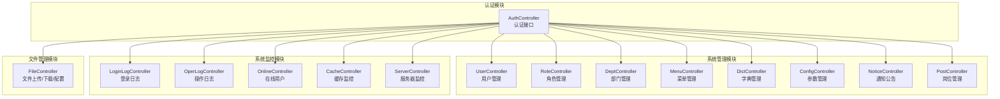
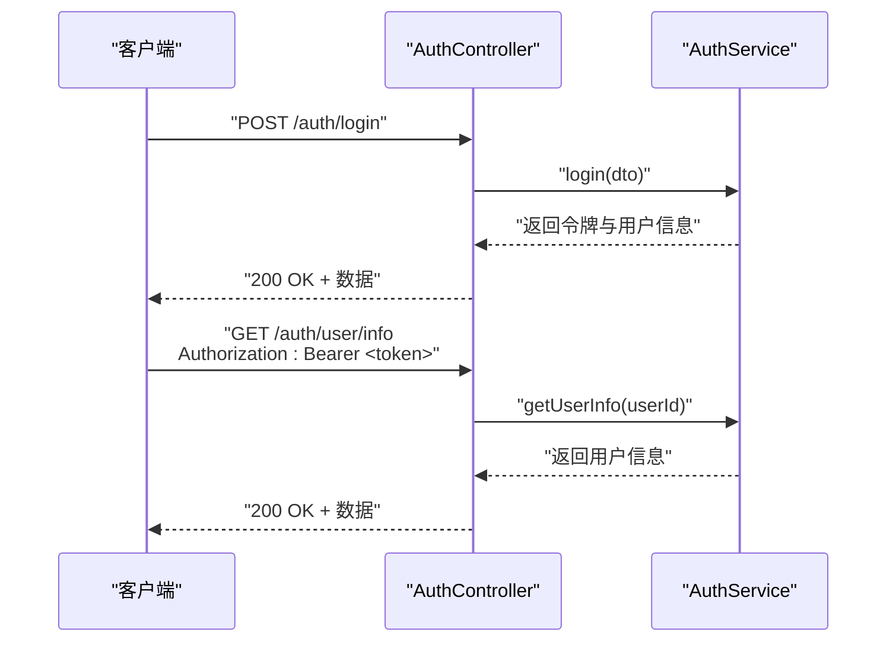
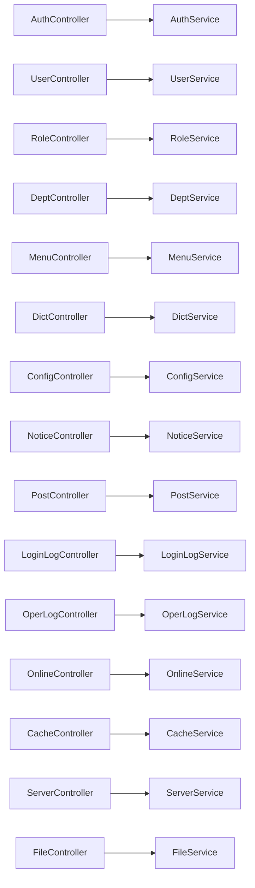

# API接口文档

<cite>
**本文引用的文件**
- [apps/backend/src/auth/auth.controller.ts](file://apps/backend/src/auth/auth.controller.ts)
- [apps/backend/src/modules/system/user/user.controller.ts](file://apps/backend/src/modules/system/user/user.controller.ts)
- [apps/backend/src/modules/system/role/role.controller.ts](file://apps/backend/src/modules/system/role/role.controller.ts)
- [apps/backend/src/modules/system/dept/dept.controller.ts](file://apps/backend/src/modules/system/dept/dept.controller.ts)
- [apps/backend/src/modules/system/menu/menu.controller.ts](file://apps/backend/src/modules/system/menu/menu.controller.ts)
- [apps/backend/src/modules/system/dict/dict.controller.ts](file://apps/backend/src/modules/system/dict/dict.controller.ts)
- [apps/backend/src/modules/system/config/config.controller.ts](file://apps/backend/src/modules/system/config/config.controller.ts)
- [apps/backend/src/modules/system/notice/notice.controller.ts](file://apps/backend/src/modules/system/notice/notice.controller.ts)
- [apps/backend/src/modules/system/post/post.controller.ts](file://apps/backend/src/modules/system/post/post.controller.ts)
- [apps/backend/src/modules/monitor/login-log/login-log.controller.ts](file://apps/backend/src/modules/monitor/login-log/login-log.controller.ts)
- [apps/backend/src/modules/monitor/oper-log/oper-log.controller.ts](file://apps/backend/src/modules/monitor/oper-log/oper-log.controller.ts)
- [apps/backend/src/modules/monitor/online/online.controller.ts](file://apps/backend/src/modules/monitor/online/online.controller.ts)
- [apps/backend/src/modules/monitor/cache/cache.controller.ts](file://apps/backend/src/modules/monitor/cache/cache.controller.ts)
- [apps/backend/src/modules/monitor/server/server.controller.ts](file://apps/backend/src/modules/monitor/server/server.controller.ts)
- [apps/backend/src/modules/file/file.controller.ts](file://apps/backend/src/modules/file/file.controller.ts)
</cite>

## 目录
1. [简介](#简介)
2. [项目结构](#项目结构)
3. [核心组件](#核心组件)
4. [架构总览](#架构总览)
5. [详细组件分析](#详细组件分析)
6. [依赖关系分析](#依赖关系分析)
7. [性能考虑](#性能考虑)
8. [故障排除指南](#故障排除指南)
9. [结论](#结论)
10. [附录](#附录)

## 简介
本文件为 Nest-Admin-Pro 后端服务的完整 API 接口文档，基于 Swagger 自动生成的接口规范整理而成。文档覆盖认证与用户资料、系统管理（用户、角色、部门、菜单、字典、参数、通知公告、岗位）、系统监控（登录日志、操作日志、在线用户、服务器监控、缓存监控）、文件管理（上传、访问）以及代码生成接口（表配置、字段配置、预览、生成）等模块。每个接口均包含 HTTP 方法、URL 模式、请求参数、响应格式、错误码说明与使用示例，并统一说明认证机制（Bearer Token）、参数验证、分页查询、排序筛选等通用规则。

## 项目结构
后端采用 NestJS 架构，按功能模块划分控制器与服务层，使用 Swagger 注解生成接口文档。主要模块包括：
- 认证模块：负责登录、注册、验证码、登出、用户信息与在线用户查询
- 系统管理模块：用户、角色、部门、菜单、字典、参数、通知公告、岗位的 CRUD
- 系统监控模块：登录日志、操作日志、在线用户、服务器监控、缓存监控
- 文件管理模块：文件上传、列表、详情、删除、访问预览
- 代码生成模块：表与字段配置、预览与生成（当前仓库未包含具体实现）

**图表来源**
- [apps/backend/src/auth/auth.controller.ts](file://apps/backend/src/auth/auth.controller.ts)
- [apps/backend/src/modules/system/user/user.controller.ts](file://apps/backend/src/modules/system/user/user.controller.ts)
- [apps/backend/src/modules/system/role/role.controller.ts](file://apps/backend/src/modules/system/role/role.controller.ts)
- [apps/backend/src/modules/system/dept/dept.controller.ts](file://apps/backend/src/modules/system/dept/dept.controller.ts)
- [apps/backend/src/modules/system/menu/menu.controller.ts](file://apps/backend/src/modules/system/menu/menu.controller.ts)
- [apps/backend/src/modules/system/dict/dict.controller.ts](file://apps/backend/src/modules/system/dict/dict.controller.ts)
- [apps/backend/src/modules/system/config/config.controller.ts](file://apps/backend/src/modules/system/config/config.controller.ts)
- [apps/backend/src/modules/system/notice/notice.controller.ts](file://apps/backend/src/modules/system/notice/notice.controller.ts)
- [apps/backend/src/modules/system/post/post.controller.ts](file://apps/backend/src/modules/system/post/post.controller.ts)
- [apps/backend/src/modules/monitor/login-log/login-log.controller.ts](file://apps/backend/src/modules/monitor/login-log/login-log.controller.ts)
- [apps/backend/src/modules/monitor/oper-log/oper-log.controller.ts](file://apps/backend/src/modules/monitor/oper-log/oper-log.controller.ts)
- [apps/backend/src/modules/monitor/online/online.controller.ts](file://apps/backend/src/modules/monitor/online/online.controller.ts)
- [apps/backend/src/modules/monitor/cache/cache.controller.ts](file://apps/backend/src/modules/monitor/cache/cache.controller.ts)
- [apps/backend/src/modules/monitor/server/server.controller.ts](file://apps/backend/src/modules/monitor/server/server.controller.ts)
- [apps/backend/src/modules/file/file.controller.ts](file://apps/backend/src/modules/file/file.controller.ts)

**章节来源**
- [apps/backend/src/auth/auth.controller.ts](file://apps/backend/src/auth/auth.controller.ts)
- [apps/backend/src/modules/system/user/user.controller.ts](file://apps/backend/src/modules/system/user/user.controller.ts)
- [apps/backend/src/modules/system/role/role.controller.ts](file://apps/backend/src/modules/system/role/role.controller.ts)
- [apps/backend/src/modules/system/dept/dept.controller.ts](file://apps/backend/src/modules/system/dept/dept.controller.ts)
- [apps/backend/src/modules/system/menu/menu.controller.ts](file://apps/backend/src/modules/system/menu/menu.controller.ts)
- [apps/backend/src/modules/system/dict/dict.controller.ts](file://apps/backend/src/modules/system/dict/dict.controller.ts)
- [apps/backend/src/modules/system/config/config.controller.ts](file://apps/backend/src/modules/system/config/config.controller.ts)
- [apps/backend/src/modules/system/notice/notice.controller.ts](file://apps/backend/src/modules/system/notice/notice.controller.ts)
- [apps/backend/src/modules/system/post/post.controller.ts](file://apps/backend/src/modules/system/post/post.controller.ts)
- [apps/backend/src/modules/monitor/login-log/login-log.controller.ts](file://apps/backend/src/modules/monitor/login-log/login-log.controller.ts)
- [apps/backend/src/modules/monitor/oper-log/oper-log.controller.ts](file://apps/backend/src/modules/monitor/oper-log/oper-log.controller.ts)
- [apps/backend/src/modules/monitor/online/online.controller.ts](file://apps/backend/src/modules/monitor/online/online.controller.ts)
- [apps/backend/src/modules/monitor/cache/cache.controller.ts](file://apps/backend/src/modules/monitor/cache/cache.controller.ts)
- [apps/backend/src/modules/monitor/server/server.controller.ts](file://apps/backend/src/modules/monitor/server/server.controller.ts)
- [apps/backend/src/modules/file/file.controller.ts](file://apps/backend/src/modules/file/file.controller.ts)

## 核心组件
- 认证控制器：提供登录、注册、验证码、登出、用户信息、在线用户、个人资料与密码修改等接口
- 系统管理控制器：用户、角色、部门、菜单、字典、参数、通知公告、岗位的增删改查与状态变更
- 监控控制器：登录日志、操作日志、在线用户、缓存、服务器信息查询与清理
- 文件控制器：文件存储配置、文件列表、详情、删除、上传（含图片）、公开访问预览

**章节来源**
- [apps/backend/src/auth/auth.controller.ts](file://apps/backend/src/auth/auth.controller.ts)
- [apps/backend/src/modules/system/user/user.controller.ts](file://apps/backend/src/modules/system/user/user.controller.ts)
- [apps/backend/src/modules/system/role/role.controller.ts](file://apps/backend/src/modules/system/role/role.controller.ts)
- [apps/backend/src/modules/system/dept/dept.controller.ts](file://apps/backend/src/modules/system/dept/dept.controller.ts)
- [apps/backend/src/modules/system/menu/menu.controller.ts](file://apps/backend/src/modules/system/menu/menu.controller.ts)
- [apps/backend/src/modules/system/dict/dict.controller.ts](file://apps/backend/src/modules/system/dict/dict.controller.ts)
- [apps/backend/src/modules/system/config/config.controller.ts](file://apps/backend/src/modules/system/config/config.controller.ts)
- [apps/backend/src/modules/system/notice/notice.controller.ts](file://apps/backend/src/modules/system/notice/notice.controller.ts)
- [apps/backend/src/modules/system/post/post.controller.ts](file://apps/backend/src/modules/system/post/post.controller.ts)
- [apps/backend/src/modules/monitor/login-log/login-log.controller.ts](file://apps/backend/src/modules/monitor/login-log/login-log.controller.ts)
- [apps/backend/src/modules/monitor/oper-log/oper-log.controller.ts](file://apps/backend/src/modules/monitor/oper-log/oper-log.controller.ts)
- [apps/backend/src/modules/monitor/online/online.controller.ts](file://apps/backend/src/modules/monitor/online/online.controller.ts)
- [apps/backend/src/modules/monitor/cache/cache.controller.ts](file://apps/backend/src/modules/monitor/cache/cache.controller.ts)
- [apps/backend/src/modules/monitor/server/server.controller.ts](file://apps/backend/src/modules/monitor/server/server.controller.ts)
- [apps/backend/src/modules/file/file.controller.ts](file://apps/backend/src/modules/file/file.controller.ts)

## 架构总览
以下序列图展示典型认证流程：客户端发起登录请求，服务端校验凭据并签发 JWT，后续请求携带 Bearer Token 进行受保护资源访问。

**图表来源**
- [apps/backend/src/auth/auth.controller.ts](file://apps/backend/src/auth/auth.controller.ts)

**章节来源**
- [apps/backend/src/auth/auth.controller.ts](file://apps/backend/src/auth/auth.controller.ts)

## 详细组件分析

### 认证接口（登录、注册、验证码、登出、用户信息）
- 登录
  - 方法与路径：POST /auth/login
  - 请求体：用户名、密码、验证码键值等（DTO 定义于认证 DTO）
  - 响应：令牌与用户信息
  - 错误码：400 参数无效；401 未授权；500 内部错误
  - 示例：使用用户名与密码调用，成功后在响应中获取 token
- 注册
  - 方法与路径：POST /auth/register
  - 请求体：注册信息（用户名、密码、确认密码等）
  - 响应：注册结果
  - 错误码：400 参数无效；500 内部错误
- 验证码
  - 方法与路径：GET /auth/captcha
  - 响应：验证码图片或数据
  - 使用：先获取验证码，再提交验证码校验
- 验证码校验
  - 方法与路径：POST /auth/captcha/validate
  - 请求体：验证码键与输入文本
  - 响应：{ valid: boolean }
- 登出
  - 方法与路径：POST /auth/logout
  - 头部：Authorization: Bearer <token>
  - 响应：登出结果
  - 注意：服务端根据 Authorization 头提取 token 并处理
- 获取当前用户信息
  - 方法与路径：GET /auth/user/info
  - 头部：Authorization: Bearer <token>
  - 响应：当前用户信息
- 在线用户
  - 方法与路径：GET /auth/online/users
  - 头部：Authorization: Bearer <token>
  - 响应：在线用户列表
- 个人资料
  - 方法与路径：GET /auth/profile
  - 头部：Authorization: Bearer <token>
  - 响应：当前用户资料
- 更新个人资料
  - 方法与路径：PUT /auth/profile
  - 头部：Authorization: Bearer <token>
  - 请求体：更新字段
  - 响应：更新结果
- 修改密码
  - 方法与路径：PUT /auth/profile/password
  - 头部：Authorization: Bearer <token>
  - 请求体：旧密码、新密码
  - 响应：修改结果

通用规则
- 认证机制：Bearer Token，除验证码与注册外，其余接口均需携带 Authorization 头
- 参数验证：请求体与查询参数遵循 DTO 校验规则
- 错误码：401 未授权（无有效 token 或 token 失效）；403 权限不足；404 资源不存在；500 内部错误

**章节来源**
- [apps/backend/src/auth/auth.controller.ts](file://apps/backend/src/auth/auth.controller.ts)

### 系统管理接口（用户、角色、部门、菜单、字典、参数、通知公告、岗位）
- 用户管理
  - 列表：GET /system/user/list（支持分页与筛选）
  - 单条：GET /system/user/{id}
  - 新增：POST /system/user
  - 修改：PUT /system/user
  - 删除：DELETE /system/user/{id}
  - 重置密码：PUT /system/user/reset-password/{id}
  - 变更状态：PUT /system/user/change-status/{id}
  - 分配角色：PUT /system/user/assign-roles/{id}
- 角色管理
  - 列表：GET /system/role/list
  - 新增：POST /system/role
  - 修改：PUT /system/role
  - 删除：DELETE /system/role/{id}
  - 变更状态：PUT /system/role/change-status/{id}
  - 分配权限：PUT /system/role/assign-permissions/{id}
  - 查询角色菜单ID：GET /system/role/menu/{id}
  - 单条：GET /system/role/{id}
- 部门管理
  - 树形列表：GET /system/dept/list
  - 树结构：GET /system/dept/tree
  - 新增：POST /system/dept
  - 修改：PUT /system/dept
  - 删除：DELETE /system/dept/{id}
- 菜单管理
  - 列表：GET /system/menu/list
  - 树结构：GET /system/menu/tree
  - 构建路由：GET /system/menu/build-route?userId={number}
  - 新增：POST /system/menu
  - 修改：PUT /system/menu
  - 删除：DELETE /system/menu/{id}
- 字典管理
  - 类型列表：GET /system/dict/type/list
  - 类型单条：GET /system/dict/type/{id}
  - 创建类型：POST /system/dict/type
  - 更新类型：PUT /system/dict/type
  - 删除类型：DELETE /system/dict/type/{id}
  - 数据列表：GET /system/dict/data/list?dictTypeId={number}
  - 创建数据：POST /system/dict/data
  - 更新数据：PUT /system/dict/data
  - 删除数据：DELETE /system/dict/data/{id}
- 参数管理
  - 列表：GET /system/config/list
  - 按键查询：GET /system/config/key/{key}
  - 单条：GET /system/config/{id}
  - 新增：POST /system/config
  - 修改：PUT /system/config
  - 删除：DELETE /system/config/{id}
  - 刷新缓存：PUT /system/config/refresh
- 通知公告
  - 列表：GET /system/notice/list
  - 单条：GET /system/notice/{id}
  - 新增：POST /system/notice
  - 修改：PUT /system/notice
  - 删除：DELETE /system/notice/{id}
- 岗位管理
  - 列表：GET /system/post/list
  - 单条：GET /system/post/{id}
  - 新增：POST /system/post
  - 修改：PUT /system/post
  - 删除：DELETE /system/post/{id}

通用规则
- 权限控制：所有接口均需 Bearer Token，且部分接口需要特定权限标识
- 分页与筛选：列表接口通常支持分页参数与条件筛选
- 参数验证：请求体与路径参数遵循对应 DTO 校验规则

**章节来源**
- [apps/backend/src/modules/system/user/user.controller.ts](file://apps/backend/src/modules/system/user/user.controller.ts)
- [apps/backend/src/modules/system/role/role.controller.ts](file://apps/backend/src/modules/system/role/role.controller.ts)
- [apps/backend/src/modules/system/dept/dept.controller.ts](file://apps/backend/src/modules/system/dept/dept.controller.ts)
- [apps/backend/src/modules/system/menu/menu.controller.ts](file://apps/backend/src/modules/system/menu/menu.controller.ts)
- [apps/backend/src/modules/system/dict/dict.controller.ts](file://apps/backend/src/modules/system/dict/dict.controller.ts)
- [apps/backend/src/modules/system/config/config.controller.ts](file://apps/backend/src/modules/system/config/config.controller.ts)
- [apps/backend/src/modules/system/notice/notice.controller.ts](file://apps/backend/src/modules/system/notice/notice.controller.ts)
- [apps/backend/src/modules/system/post/post.controller.ts](file://apps/backend/src/modules/system/post/post.controller.ts)

### 系统监控接口（登录日志、操作日志、在线用户、服务器监控、缓存监控）
- 登录日志
  - 列表：GET /monitor/login-log/list?page=&limit=&username=&status=
  - 清理：DELETE /monitor/login-log/clean
  - 单条：GET /monitor/login-log/{id}
- 操作日志
  - 列表：GET /monitor/oper-log/list
  - 清理：DELETE /monitor/oper-log/clean
  - 单条：GET /monitor/oper-log/{id}
- 在线用户
  - 列表：GET /monitor/online/list
  - 强退：POST /monitor/online/force-logout/{token}
- 缓存监控
  - 信息：GET /monitor/cache/info
  - 键列表：GET /monitor/cache/keys?pattern=
  - 值：GET /monitor/cache/value?key=
  - 清空：POST /monitor/cache/clear
  - 删除：POST /monitor/cache/delete?key=
- 服务器监控
  - 信息：GET /monitor/server/info

通用规则
- 权限控制：均需 Bearer Token 与相应权限标识
- 分页与筛选：登录日志、操作日志列表支持分页与筛选
- 参数验证：路径参数与查询参数遵循解析器与校验规则

**章节来源**
- [apps/backend/src/modules/monitor/login-log/login-log.controller.ts](file://apps/backend/src/modules/monitor/login-log/login-log.controller.ts)
- [apps/backend/src/modules/monitor/oper-log/oper-log.controller.ts](file://apps/backend/src/modules/monitor/oper-log/oper-log.controller.ts)
- [apps/backend/src/modules/monitor/online/online.controller.ts](file://apps/backend/src/modules/monitor/online/online.controller.ts)
- [apps/backend/src/modules/monitor/cache/cache.controller.ts](file://apps/backend/src/modules/monitor/cache/cache.controller.ts)
- [apps/backend/src/modules/monitor/server/server.controller.ts](file://apps/backend/src/modules/monitor/server/server.controller.ts)

### 文件管理接口（上传、访问）
- 存储配置
  - 获取：GET /file/config
  - 更新：PUT /file/config
- 文件列表：GET /file/list
- 详情：GET /file/detail/{id}
- 删除：DELETE /file/{id}
- 上传文件：POST /file/upload（multipart/form-data，字段名 file）
- 上传图片：POST /file/upload-image（multipart/form-data，字段名 file）
- 预览/下载：GET /file/{filename}

通用规则
- 权限控制：除公开访问外，其余接口均需 Bearer Token
- 上传限制：服务端通过环境变量设置最大文件大小
- 公开访问：文件名路径公开可访问，建议配合鉴权策略

**章节来源**
- [apps/backend/src/modules/file/file.controller.ts](file://apps/backend/src/modules/file/file.controller.ts)

### 代码生成接口（表配置、字段配置、预览、生成）
- 当前仓库未包含代码生成模块的具体实现文件，因此暂不提供接口定义与示例
- 建议在后续版本中完善该模块的控制器与服务层，并补充 DTO 与权限控制

[本节为概念性说明，不直接分析具体文件，故无“章节来源”]

## 依赖关系分析
- 控制器到服务层：各模块控制器依赖对应服务类进行业务处理
- 权限控制：统一使用 JWT 与权限守卫，部分接口要求特定权限标识
- Swagger 注解：通过 @ApiTags 与 @ApiOperation 统一标注模块与接口描述

**图表来源**
- [apps/backend/src/auth/auth.controller.ts](file://apps/backend/src/auth/auth.controller.ts)
- [apps/backend/src/modules/system/user/user.controller.ts](file://apps/backend/src/modules/system/user/user.controller.ts)
- [apps/backend/src/modules/system/role/role.controller.ts](file://apps/backend/src/modules/system/role/role.controller.ts)
- [apps/backend/src/modules/system/dept/dept.controller.ts](file://apps/backend/src/modules/system/dept/dept.controller.ts)
- [apps/backend/src/modules/system/menu/menu.controller.ts](file://apps/backend/src/modules/system/menu/menu.controller.ts)
- [apps/backend/src/modules/system/dict/dict.controller.ts](file://apps/backend/src/modules/system/dict/dict.controller.ts)
- [apps/backend/src/modules/system/config/config.controller.ts](file://apps/backend/src/modules/system/config/config.controller.ts)
- [apps/backend/src/modules/system/notice/notice.controller.ts](file://apps/backend/src/modules/system/notice/notice.controller.ts)
- [apps/backend/src/modules/system/post/post.controller.ts](file://apps/backend/src/modules/system/post/post.controller.ts)
- [apps/backend/src/modules/monitor/login-log/login-log.controller.ts](file://apps/backend/src/modules/monitor/login-log/login-log.controller.ts)
- [apps/backend/src/modules/monitor/oper-log/oper-log.controller.ts](file://apps/backend/src/modules/monitor/oper-log/oper-log.controller.ts)
- [apps/backend/src/modules/monitor/online/online.controller.ts](file://apps/backend/src/modules/monitor/online/online.controller.ts)
- [apps/backend/src/modules/monitor/cache/cache.controller.ts](file://apps/backend/src/modules/monitor/cache/cache.controller.ts)
- [apps/backend/src/modules/monitor/server/server.controller.ts](file://apps/backend/src/modules/monitor/server/server.controller.ts)
- [apps/backend/src/modules/file/file.controller.ts](file://apps/backend/src/modules/file/file.controller.ts)

**章节来源**
- [apps/backend/src/auth/auth.controller.ts](file://apps/backend/src/auth/auth.controller.ts)
- [apps/backend/src/modules/system/user/user.controller.ts](file://apps/backend/src/modules/system/user/user.controller.ts)
- [apps/backend/src/modules/system/role/role.controller.ts](file://apps/backend/src/modules/system/role/role.controller.ts)
- [apps/backend/src/modules/system/dept/dept.controller.ts](file://apps/backend/src/modules/system/dept/dept.controller.ts)
- [apps/backend/src/modules/system/menu/menu.controller.ts](file://apps/backend/src/modules/system/menu/menu.controller.ts)
- [apps/backend/src/modules/system/dict/dict.controller.ts](file://apps/backend/src/modules/system/dict/dict.controller.ts)
- [apps/backend/src/modules/system/config/config.controller.ts](file://apps/backend/src/modules/system/config/config.controller.ts)
- [apps/backend/src/modules/system/notice/notice.controller.ts](file://apps/backend/src/modules/system/notice/notice.controller.ts)
- [apps/backend/src/modules/system/post/post.controller.ts](file://apps/backend/src/modules/system/post/post.controller.ts)
- [apps/backend/src/modules/monitor/login-log/login-log.controller.ts](file://apps/backend/src/modules/monitor/login-log/login-log.controller.ts)
- [apps/backend/src/modules/monitor/oper-log/oper-log.controller.ts](file://apps/backend/src/modules/monitor/oper-log/oper-log.controller.ts)
- [apps/backend/src/modules/monitor/online/online.controller.ts](file://apps/backend/src/modules/monitor/online/online.controller.ts)
- [apps/backend/src/modules/monitor/cache/cache.controller.ts](file://apps/backend/src/modules/monitor/cache/cache.controller.ts)
- [apps/backend/src/modules/monitor/server/server.controller.ts](file://apps/backend/src/modules/monitor/server/server.controller.ts)
- [apps/backend/src/modules/file/file.controller.ts](file://apps/backend/src/modules/file/file.controller.ts)

## 性能考虑
- 分页查询：列表接口默认分页，建议合理设置 limit，避免一次性返回大量数据
- 缓存使用：监控与配置相关接口可结合缓存提升读取性能
- 文件上传：限制文件大小，避免内存溢出；建议使用流式处理或本地临时存储
- 日志清理：定期清理登录日志与操作日志，避免数据库膨胀

[本节提供一般性指导，不直接分析具体文件，故无“章节来源”]

## 故障排除指南
- 401 未授权：检查 Authorization 头是否正确携带 Bearer Token，确认 token 未过期
- 403 权限不足：确认当前用户具备所需权限标识
- 404 资源不存在：检查路径参数与查询参数是否正确
- 500 内部错误：查看服务端日志，定位异常堆栈

**章节来源**
- [apps/backend/src/auth/auth.controller.ts](file://apps/backend/src/auth/auth.controller.ts)
- [apps/backend/src/modules/system/user/user.controller.ts](file://apps/backend/src/modules/system/user/user.controller.ts)
- [apps/backend/src/modules/system/role/role.controller.ts](file://apps/backend/src/modules/system/role/role.controller.ts)
- [apps/backend/src/modules/system/dept/dept.controller.ts](file://apps/backend/src/modules/system/dept/dept.controller.ts)
- [apps/backend/src/modules/system/menu/menu.controller.ts](file://apps/backend/src/modules/system/menu/menu.controller.ts)
- [apps/backend/src/modules/system/dict/dict.controller.ts](file://apps/backend/src/modules/system/dict/dict.controller.ts)
- [apps/backend/src/modules/system/config/config.controller.ts](file://apps/backend/src/modules/system/config/config.controller.ts)
- [apps/backend/src/modules/system/notice/notice.controller.ts](file://apps/backend/src/modules/system/notice/notice.controller.ts)
- [apps/backend/src/modules/system/post/post.controller.ts](file://apps/backend/src/modules/system/post/post.controller.ts)
- [apps/backend/src/modules/monitor/login-log/login-log.controller.ts](file://apps/backend/src/modules/monitor/login-log/login-log.controller.ts)
- [apps/backend/src/modules/monitor/oper-log/oper-log.controller.ts](file://apps/backend/src/modules/monitor/oper-log/oper-log.controller.ts)
- [apps/backend/src/modules/monitor/online/online.controller.ts](file://apps/backend/src/modules/monitor/online/online.controller.ts)
- [apps/backend/src/modules/monitor/cache/cache.controller.ts](file://apps/backend/src/modules/monitor/cache/cache.controller.ts)
- [apps/backend/src/modules/monitor/server/server.controller.ts](file://apps/backend/src/modules/monitor/server/server.controller.ts)
- [apps/backend/src/modules/file/file.controller.ts](file://apps/backend/src/modules/file/file.controller.ts)

## 结论
本接口文档基于实际控制器与服务层实现，覆盖了认证、系统管理、监控、文件管理等核心模块。建议在实际使用中严格遵循认证机制与权限控制，合理使用分页与筛选，关注上传与日志清理等性能与安全问题。代码生成模块将在后续版本完善。

[本节为总结性内容，不直接分析具体文件，故无“章节来源”]

## 附录
- 接口测试工具推荐：Postman、Insomnia、Swagger UI
- 调试技巧：开启详细日志、使用断点调试、逐步验证 DTO 校验与权限守卫

[本节为通用建议，不直接分析具体文件，故无“章节来源”]