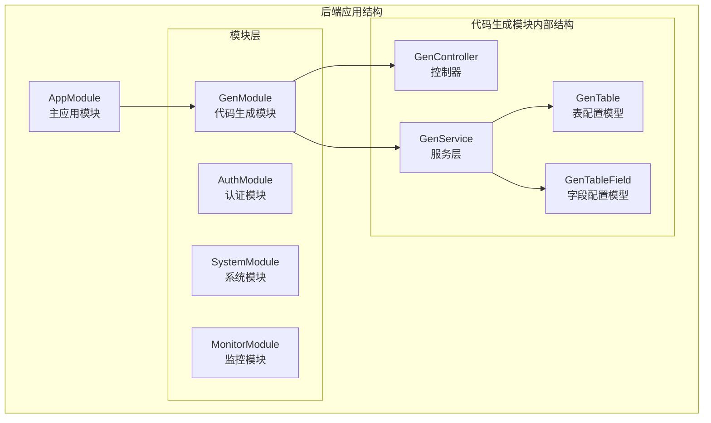
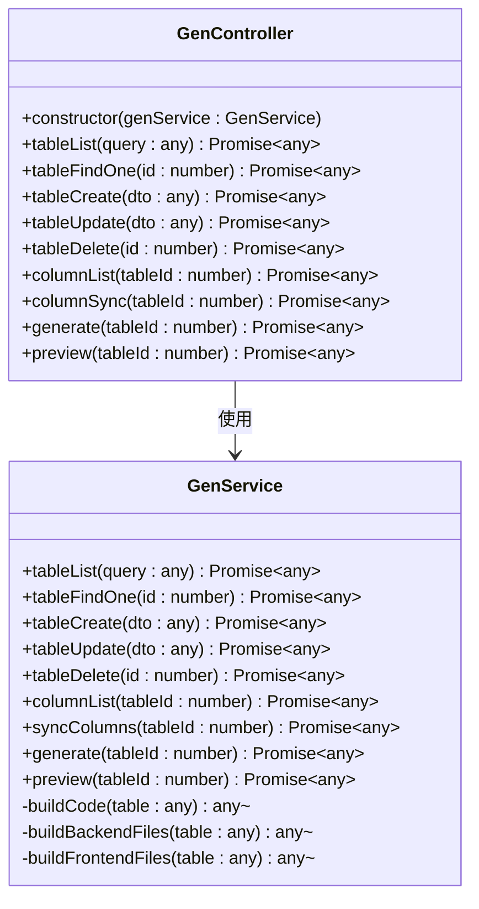
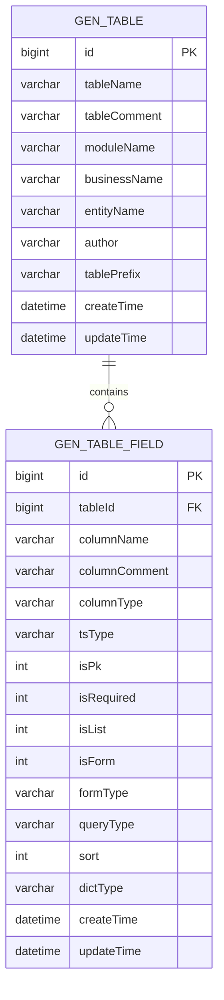
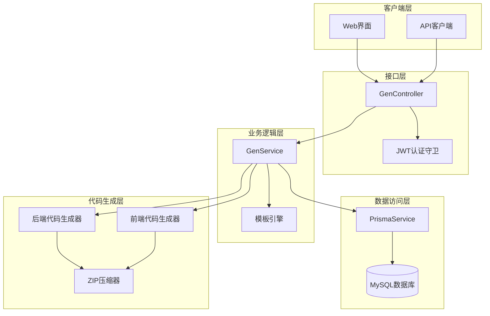
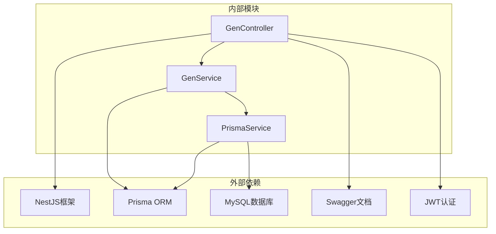

# 代码生成接口

<cite>
**本文档引用的文件**
- [apps/backend/src/modules/gen/gen.controller.ts](file://apps/backend/src/modules/gen/gen.controller.ts)
- [apps/backend/src/modules/gen/gen.service.ts](file://apps/backend/src/modules/gen/gen.service.ts)
- [apps/backend/src/modules/gen/gen.module.ts](file://apps/backend/src/modules/gen/gen.module.ts)
- [apps/backend/prisma/schema.prisma](file://apps/backend/prisma/schema.prisma)
- [apps/backend/src/app.module.ts](file://apps/backend/src/app.module.ts)
- [apps/backend/src/main.ts](file://apps/backend/src/main.ts)
</cite>

## 目录
1. [简介](#简介)
2. [项目结构](#项目结构)
3. [核心组件](#核心组件)
4. [架构概览](#架构概览)
5. [详细组件分析](#详细组件分析)
6. [依赖关系分析](#依赖关系分析)
7. [性能考虑](#性能考虑)
8. [故障排除指南](#故障排除指南)
9. [结论](#结论)

## 简介

代码生成模块是 Nest-Admin-Pro 全栈快速开发框架中的重要组成部分，提供了从数据库表结构到完整代码的自动化生成功能。该模块支持多种编程语言（TypeScript、Java、Go等），并具备模板引擎、批量生成、增量更新和版本控制等高级功能。

本模块通过 RESTful API 接口提供完整的代码生成功能，包括表配置管理、字段配置、代码预览和生成等核心操作。所有接口均采用 JWT 认证保护，确保系统的安全性。

## 项目结构

代码生成模块位于后端应用程序的模块化架构中，采用标准的 NestJS 模块组织方式：



**图表来源**
- [apps/backend/src/app.module.ts:18-38](file://apps/backend/src/app.module.ts#L18-L38)
- [apps/backend/src/modules/gen/gen.module.ts:5-9](file://apps/backend/src/modules/gen/gen.module.ts#L5-L9)

**章节来源**
- [apps/backend/src/app.module.ts:18-38](file://apps/backend/src/app.module.ts#L18-L38)
- [apps/backend/src/modules/gen/gen.module.ts:5-9](file://apps/backend/src/modules/gen/gen.module.ts#L5-L9)

## 核心组件

### 控制器层

GenController 提供了完整的代码生成 API 接口，采用装饰器模式实现 RESTful 路由映射：



**图表来源**
- [apps/backend/src/modules/gen/gen.controller.ts:9-65](file://apps/backend/src/modules/gen/gen.controller.ts#L9-L65)
- [apps/backend/src/modules/gen/gen.service.ts:7-105](file://apps/backend/src/modules/gen/gen.service.ts#L7-L105)

### 数据模型

代码生成模块使用 Prisma ORM 管理数据库结构，包含两个核心模型：



**图表来源**
- [apps/backend/prisma/schema.prisma:293-332](file://apps/backend/prisma/schema.prisma#L293-L332)

**章节来源**
- [apps/backend/src/modules/gen/gen.controller.ts:9-65](file://apps/backend/src/modules/gen/gen.controller.ts#L9-L65)
- [apps/backend/src/modules/gen/gen.service.ts:7-105](file://apps/backend/src/modules/gen/gen.service.ts#L7-L105)
- [apps/backend/prisma/schema.prisma:293-332](file://apps/backend/prisma/schema.prisma#L293-L332)

## 架构概览

代码生成模块采用分层架构设计，实现了清晰的关注点分离：



**图表来源**
- [apps/backend/src/modules/gen/gen.controller.ts:1-8](file://apps/backend/src/modules/gen/gen.controller.ts#L1-L8)
- [apps/backend/src/modules/gen/gen.service.ts:1-8](file://apps/backend/src/modules/gen/gen.service.ts#L1-L8)

## 详细组件分析

### 表配置管理接口

表配置管理是代码生成的核心功能之一，提供了完整的 CRUD 操作：

#### GET /api/gen/table/list
获取已生成表的列表信息，支持分页查询和条件过滤。

**请求参数:**
- page: 页码，默认值为 1
- limit: 每页条数，默认值为 10  
- tableName: 表名模糊查询条件

**响应数据:**
```typescript
{
  total: number,           // 总记录数
  items: GenTable[]       // 表配置数组
}
```

#### GET /api/gen/table/{id}
根据 ID 获取指定表的详细配置信息。

**路径参数:**
- id: 表配置 ID（整数类型）

**响应数据:**
```typescript
GenTable & {
  fields: GenTableField[]  // 关联的字段配置
}
```

#### POST /api/gen/table
创建新的表配置。

**请求体:**
```typescript
{
  tableName: string,      // 数据库表名
  tableComment?: string,  // 表注释
  moduleName: string,     // 模块名称
  businessName: string,   // 业务名称
  entityName: string,     // 实体类名
  author: string,         // 作者
  tablePrefix?: string    // 表前缀
}
```

#### PUT /api/gen/table
更新现有表配置。

**请求体:**
包含完整的 GenTable 更新数据

#### DELETE /api/gen/table/{id}
删除指定的表配置及其关联的字段配置。

**路径参数:**
- id: 表配置 ID

### 字段配置接口

字段配置接口负责管理数据库表的字段属性：

#### GET /api/gen/column/{tableId}
获取指定表的所有字段配置，按排序字段升序排列。

**路径参数:**
- tableId: 表配置 ID

**响应数据:**
```typescript
GenTableField[]  // 字段配置数组
```

#### POST /api/gen/column/sync
从数据库同步字段配置到代码生成配置。

**请求体:**
```typescript
{
  tableId: number  // 目标表ID
}
```

**注意:** 当前实现为占位符，实际的数据库模式读取功能需要在生产环境中实现。

### 代码预览接口

#### GET /api/gen/preview/{tableId}
预览基于当前配置生成的代码内容，返回后端和前端代码的预览结果。

**路径参数:**
- tableId: 表配置 ID

**响应数据:**
```typescript
{
  backend: {
    controller: string,  // 控制器代码
    service: string      // 服务代码
  },
  frontend: {
    indexVue: string     // 列表页面代码
  }
}
```

### 代码生成接口

#### POST /api/gen/generate
生成完整的代码包，包含后端和前端代码。

**请求体:**
```typescript
{
  tableId: number  // 目标表ID
}
```

**响应数据:**
```typescript
{
  success: boolean,     // 生成状态
  code: {
    backend: string[],  // 后端文件列表
    frontend: string[]  // 前端文件列表
  }
}
```

**生成的文件结构:**
- 后端代码: 控制器、服务、DTO、实体类等
- 前端代码: 列表页面、表单组件、API封装等

**章节来源**
- [apps/backend/src/modules/gen/gen.controller.ts:12-65](file://apps/backend/src/modules/gen/gen.controller.ts#L12-L65)
- [apps/backend/src/modules/gen/gen.service.ts:10-105](file://apps/backend/src/modules/gen/gen.service.ts#L10-L105)

## 依赖关系分析

代码生成模块的依赖关系体现了清晰的分层架构：



**图表来源**
- [apps/backend/src/modules/gen/gen.controller.ts:1-4](file://apps/backend/src/modules/gen/gen.controller.ts#L1-L4)
- [apps/backend/src/modules/gen/gen.service.ts:1-2](file://apps/backend/src/modules/gen/gen.service.ts#L1-L2)

**章节来源**
- [apps/backend/src/modules/gen/gen.controller.ts:1-4](file://apps/backend/src/modules/gen/gen.controller.ts#L1-L4)
- [apps/backend/src/modules/gen/gen.service.ts:1-2](file://apps/backend/src/modules/gen/gen.service.ts#L1-L2)

## 性能考虑

代码生成模块在设计时充分考虑了性能优化：

### 查询优化
- 使用分页查询避免大量数据传输
- 通过索引优化常用查询条件
- 批量操作减少数据库往返次数

### 内存管理
- 流式处理大文件生成
- 及时释放临时资源
- 合理使用缓存机制

### 并发处理
- 支持多用户并发访问
- 防止重复代码生成
- 错误恢复机制

## 故障排除指南

### 常见问题及解决方案

#### 认证失败
**症状:** 所有 API 请求返回 401 未授权
**原因:** JWT 令牌无效或过期
**解决:** 重新登录获取有效令牌

#### 数据库连接错误
**症状:** 表查询返回空结果或连接超时
**原因:** 数据库配置不正确
**解决:** 检查 DATABASE_URL 环境变量

#### 代码生成失败
**症状:** 生成接口返回错误
**原因:** 模板文件缺失或配置错误
**解决:** 检查模板引擎配置和文件权限

#### 权限不足
**症状:** 访问受保护的 API 返回 403
**原因:** 用户权限不足
**解决:** 确保用户具有相应的角色权限

**章节来源**
- [apps/backend/src/modules/gen/gen.service.ts:21-25](file://apps/backend/src/modules/gen/gen.service.ts#L21-L25)

## 结论

代码生成模块为 Nest-Admin-Pro 框架提供了强大的自动化开发能力。通过标准化的 API 接口和灵活的配置选项，开发者可以快速生成高质量的代码，显著提高开发效率。

模块的主要优势包括：
- 完整的 CRUD 接口支持
- 多语言代码生成能力
- 灵活的模板配置
- 安全的认证机制
- 可扩展的架构设计

未来可以进一步增强的功能包括：
- 更丰富的模板引擎支持
- 批量代码生成和增量更新
- 版本控制集成
- 自定义代码规则验证
- 更完善的错误处理和日志记录