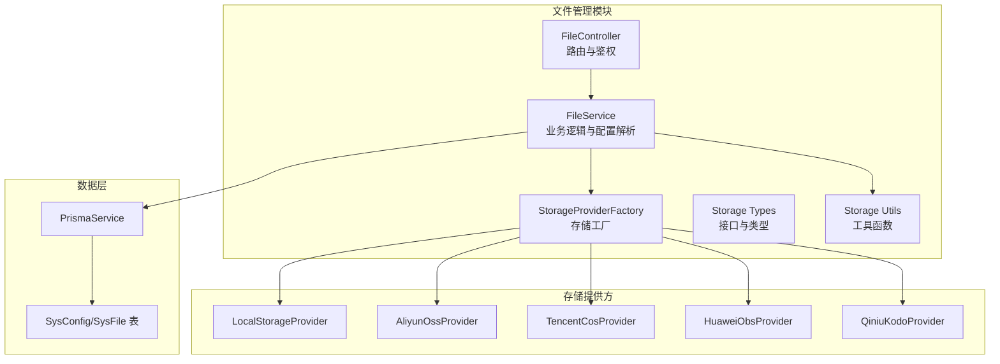
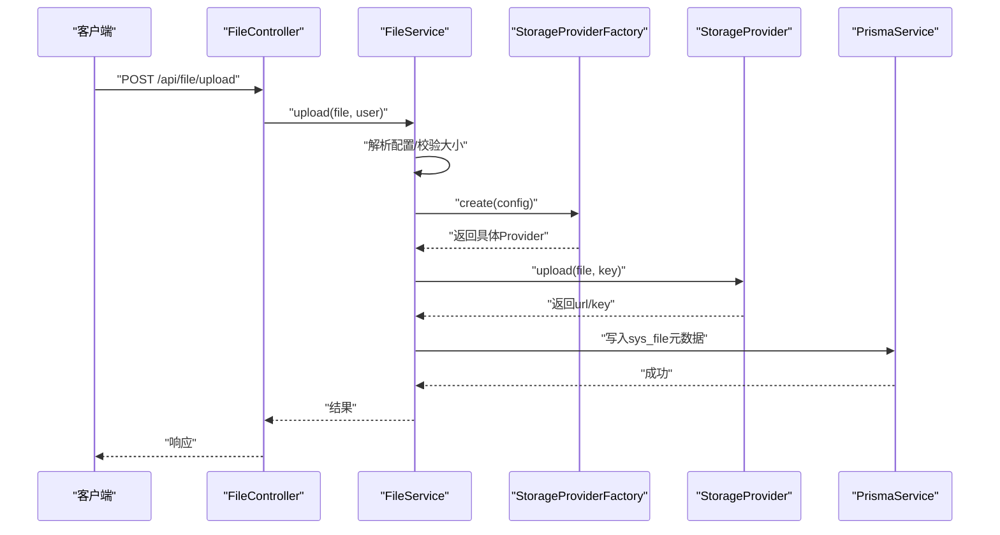
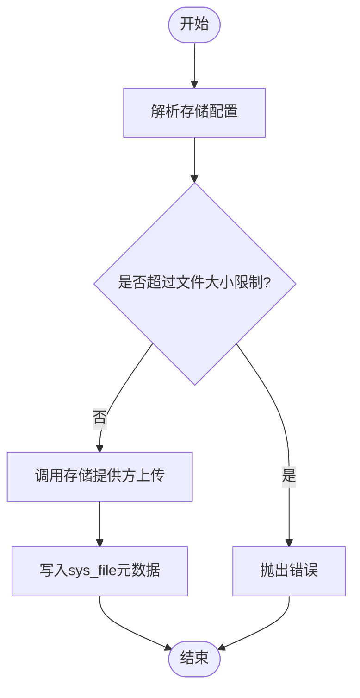
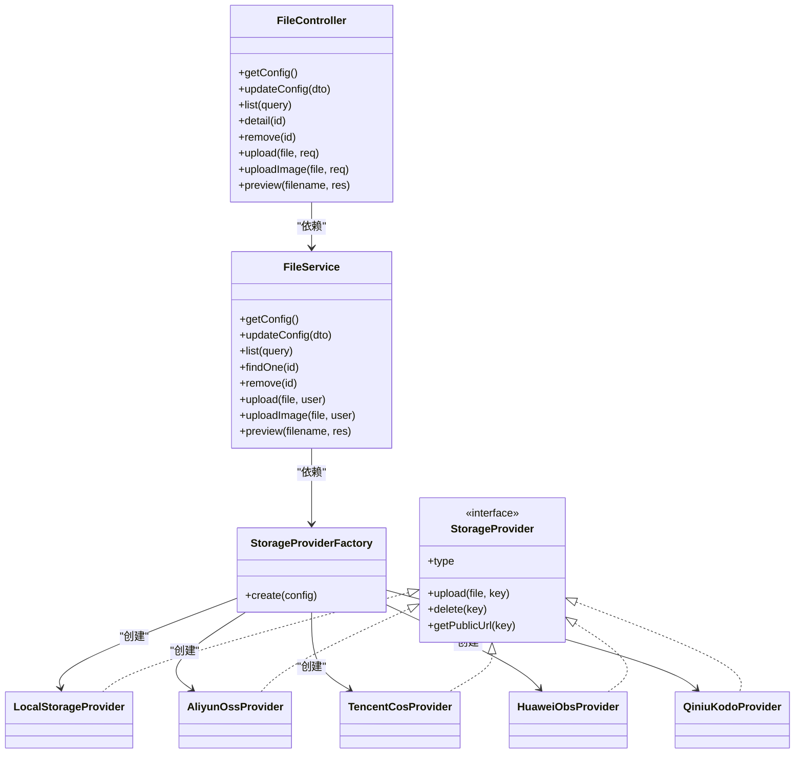

# 文件管理接口

<cite>
**本文档引用的文件**
- [apps/backend/src/modules/file/file.controller.ts](file://apps/backend/src/modules/file/file.controller.ts)
- [apps/backend/src/modules/file/file.service.ts](file://apps/backend/src/modules/file/file.service.ts)
- [apps/backend/src/modules/file/storage/storage-provider.factory.ts](file://apps/backend/src/modules/file/storage/storage-provider.factory.ts)
- [apps/backend/src/modules/file/storage/storage.types.ts](file://apps/backend/src/modules/file/storage/storage.types.ts)
- [apps/backend/src/modules/file/storage/local.provider.ts](file://apps/backend/src/modules/file/storage/local.provider.ts)
- [apps/backend/src/modules/file/storage/aliyun-oss.provider.ts](file://apps/backend/src/modules/file/storage/aliyun-oss.provider.ts)
- [apps/backend/src/modules/file/storage/tencent-cos.provider.ts](file://apps/backend/src/modules/file/storage/tencent-cos.provider.ts)
- [apps/backend/src/modules/file/storage/huawei-obs.provider.ts](file://apps/backend/src/modules/file/storage/huawei-obs.provider.ts)
- [apps/backend/src/modules/file/storage/qiniu-kodo.provider.ts](file://apps/backend/src/modules/file/storage/qiniu-kodo.provider.ts)
- [apps/backend/src/modules/file/storage/storage.utils.ts](file://apps/backend/src/modules/file/storage/storage.utils.ts)
- [apps/backend/src/common/prisma.service.ts](file://apps/backend/src/common/prisma.service.ts)
- [apps/backend/prisma/schema.prisma](file://apps/backend/prisma/schema.prisma)
</cite>

## 目录
1. [简介](#简介)
2. [项目结构](#项目结构)
3. [核心组件](#核心组件)
4. [架构总览](#架构总览)
5. [详细组件分析](#详细组件分析)
6. [依赖关系分析](#依赖关系分析)
7. [性能与安全考虑](#性能与安全考虑)
8. [故障排查指南](#故障排查指南)
9. [结论](#结论)
10. [附录：接口定义与配置参数](#附录接口定义与配置参数)

## 简介
本文件管理模块提供统一的文件上传、下载、删除与存储配置管理能力，并支持多种存储后端（本地、阿里云 OSS、腾讯云 COS、华为云 OBS、七牛云 Kodo）。通过统一的存储抽象与工厂模式，系统可在不同存储之间无缝切换，同时提供文件列表查询、文件详情、直链访问等功能。

## 项目结构
文件管理模块位于后端应用的 modules/file 目录下，采用分层设计：
- 控制器层：负责路由与鉴权，接收请求并调用服务层
- 服务层：封装业务逻辑，解析配置、持久化元数据、调用存储提供方
- 存储提供方：按需实现本地或云存储上传、删除、生成公有链接
- 数据访问：基于 Prisma 访问 sys_config 与 sys_file 表

图表来源
- [apps/backend/src/modules/file/file.controller.ts:32-99](file://apps/backend/src/modules/file/file.controller.ts#L32-L99)
- [apps/backend/src/modules/file/file.service.ts:42-309](file://apps/backend/src/modules/file/file.service.ts#L42-L309)
- [apps/backend/src/modules/file/storage/storage-provider.factory.ts:8-24](file://apps/backend/src/modules/file/storage/storage-provider.factory.ts#L8-L24)
- [apps/backend/src/modules/file/storage/storage.types.ts:3-42](file://apps/backend/src/modules/file/storage/storage.types.ts#L3-L42)
- [apps/backend/src/modules/file/storage/local.provider.ts:6-45](file://apps/backend/src/modules/file/storage/local.provider.ts#L6-L45)
- [apps/backend/src/modules/file/storage/aliyun-oss.provider.ts:6-50](file://apps/backend/src/modules/file/storage/aliyun-oss.provider.ts#L6-L50)
- [apps/backend/src/modules/file/storage/tencent-cos.provider.ts:7-73](file://apps/backend/src/modules/file/storage/tencent-cos.provider.ts#L7-L73)
- [apps/backend/src/modules/file/storage/huawei-obs.provider.ts:8-92](file://apps/backend/src/modules/file/storage/huawei-obs.provider.ts#L8-L92)
- [apps/backend/src/modules/file/storage/qiniu-kodo.provider.ts:7-67](file://apps/backend/src/modules/file/storage/qiniu-kodo.provider.ts#L7-L67)
- [apps/backend/src/common/prisma.service.ts:4-21](file://apps/backend/src/common/prisma.service.ts#L4-L21)
- [apps/backend/prisma/schema.prisma:152-207](file://apps/backend/prisma/schema.prisma#L152-L207)

章节来源
- [apps/backend/src/modules/file/file.controller.ts:32-99](file://apps/backend/src/modules/file/file.controller.ts#L32-L99)
- [apps/backend/src/modules/file/file.service.ts:42-309](file://apps/backend/src/modules/file/file.service.ts#L42-L309)
- [apps/backend/src/modules/file/storage/storage-provider.factory.ts:8-24](file://apps/backend/src/modules/file/storage/storage-provider.factory.ts#L8-L24)
- [apps/backend/src/common/prisma.service.ts:4-21](file://apps/backend/src/common/prisma.service.ts#L4-L21)
- [apps/backend/prisma/schema.prisma:152-207](file://apps/backend/prisma/schema.prisma#L152-L207)

## 核心组件
- 文件控制器：定义所有对外接口，包含鉴权与权限校验
- 文件服务：解析与更新存储配置、执行上传/删除/预览、查询文件列表与详情
- 存储工厂：根据配置动态选择具体存储提供方
- 存储提供方：实现本地与多家云存储的上传、删除、公有链接生成
- 工具函数：生成存储键名、规范化原始文件名、构建公有链接、断言云存储配置
- 数据模型：sys_config 存储配置项；sys_file 存储文件元数据

章节来源
- [apps/backend/src/modules/file/file.controller.ts:34-99](file://apps/backend/src/modules/file/file.controller.ts#L34-L99)
- [apps/backend/src/modules/file/file.service.ts:42-309](file://apps/backend/src/modules/file/file.service.ts#L42-L309)
- [apps/backend/src/modules/file/storage/storage-provider.factory.ts:8-24](file://apps/backend/src/modules/file/storage/storage-provider.factory.ts#L8-L24)
- [apps/backend/src/modules/file/storage/storage.types.ts:3-42](file://apps/backend/src/modules/file/storage/storage.types.ts#L3-L42)
- [apps/backend/src/modules/file/storage/storage.utils.ts:5-61](file://apps/backend/src/modules/file/storage/storage.utils.ts#L5-L61)
- [apps/backend/prisma/schema.prisma:182-207](file://apps/backend/prisma/schema.prisma#L182-L207)

## 架构总览
文件管理模块遵循“控制器-服务-存储提供方-数据层”的分层架构。上传流程通过内存存储接收文件，随后由存储提供方写入目标位置，并将元数据持久化到数据库。下载/预览根据存储类型返回重定向或直接读取文件。

图表来源
- [apps/backend/src/modules/file/file.controller.ts:77-83](file://apps/backend/src/modules/file/file.controller.ts#L77-L83)
- [apps/backend/src/modules/file/file.service.ts:150-209](file://apps/backend/src/modules/file/file.service.ts#L150-L209)
- [apps/backend/src/modules/file/storage/storage-provider.factory.ts:8-24](file://apps/backend/src/modules/file/storage/storage-provider.factory.ts#L8-L24)
- [apps/backend/src/common/prisma.service.ts:4-21](file://apps/backend/src/common/prisma.service.ts#L4-L21)

## 详细组件分析

### 接口总览与权限
- 所有文件相关接口均要求登录（JWT），部分接口额外要求系统权限
- 文件配置读取/更新接口要求“system:config:list”
- 文件列表/详情接口要求“system:file:list”
- 删除接口要求“system:file:remove”

章节来源
- [apps/backend/src/modules/file/file.controller.ts:37-51](file://apps/backend/src/modules/file/file.controller.ts#L37-L51)
- [apps/backend/src/modules/file/file.controller.ts:53-75](file://apps/backend/src/modules/file/file.controller.ts#L53-L75)

### 文件上传接口
- 接口：POST /api/file/upload
- 功能：上传文件并保存至配置的存储后端，记录元数据
- 支持的文件类型：任意二进制文件
- 大小限制：由配置决定，默认值来自环境变量或配置表
- 存储策略：根据配置选择本地或云存储
- 权限控制：登录用户可上传
- 返回：包含存储后的URL、文件名、对象键、大小与存储类型

图表来源
- [apps/backend/src/modules/file/file.service.ts:150-155](file://apps/backend/src/modules/file/file.service.ts#L150-L155)
- [apps/backend/src/modules/file/file.service.ts:187-209](file://apps/backend/src/modules/file/file.service.ts#L187-L209)

章节来源
- [apps/backend/src/modules/file/file.controller.ts:77-83](file://apps/backend/src/modules/file/file.controller.ts#L77-L83)
- [apps/backend/src/modules/file/file.service.ts:150-209](file://apps/backend/src/modules/file/file.service.ts#L150-L209)

### 图片上传接口
- 接口：POST /api/file/upload-image
- 功能：仅允许图片类型上传
- 支持的文件类型：jpg/jpeg/png/gif/bmp/webp
- 大小限制：由图片大小限制配置决定
- 存储策略：同上
- 权限控制：登录用户可上传

章节来源
- [apps/backend/src/modules/file/file.controller.ts:85-91](file://apps/backend/src/modules/file/file.controller.ts#L85-L91)
- [apps/backend/src/modules/file/file.service.ts:157-166](file://apps/backend/src/modules/file/file.service.ts#L157-L166)

### 文件列表查询接口
- 接口：GET /api/file/list
- 查询参数：
  - page：页码（默认1）
  - limit：每页数量（默认10）
  - originalName：原文件名模糊搜索
  - storage：存储类型过滤
  - mimeType：MIME类型过滤
- 权限控制：需要“system:file:list”
- 返回：总数与分页条目

章节来源
- [apps/backend/src/modules/file/file.controller.ts:53-59](file://apps/backend/src/modules/file/file.controller.ts#L53-L59)
- [apps/backend/src/modules/file/file.service.ts:100-119](file://apps/backend/src/modules/file/file.service.ts#L100-L119)

### 文件详情接口
- 接口：GET /api/file/detail/:id
- 功能：获取指定文件的详情
- 权限控制：需要“system:file:list”

章节来源
- [apps/backend/src/modules/file/file.controller.ts:61-67](file://apps/backend/src/modules/file/file.controller.ts#L61-L67)
- [apps/backend/src/modules/file/file.service.ts:121-127](file://apps/backend/src/modules/file/file.service.ts#L121-L127)

### 文件删除接口
- 接口：DELETE /api/file/:id
- 功能：删除文件（先从存储后端删除，再标记数据库为已删除）
- 权限控制：需要“system:file:remove”
- 注意：若远程对象不存在，仍会尝试标记删除

章节来源
- [apps/backend/src/modules/file/file.controller.ts:69-75](file://apps/backend/src/modules/file/file.controller.ts#L69-L75)
- [apps/backend/src/modules/file/file.service.ts:129-148](file://apps/backend/src/modules/file/file.service.ts#L129-L148)

### 文件访问接口
- 接口：GET /api/file/:filename
- 功能：文件预览/下载
- 行为：
  - 若为本地存储：校验路径安全后直接返回文件
  - 若为云存储：重定向到公有URL
- 权限控制：公开访问

章节来源
- [apps/backend/src/modules/file/file.controller.ts:93-98](file://apps/backend/src/modules/file/file.controller.ts#L93-L98)
- [apps/backend/src/modules/file/file.service.ts:168-185](file://apps/backend/src/modules/file/file.service.ts#L168-L185)

### 存储配置接口
- 获取配置：GET /api/file/config
- 更新配置：PUT /api/file/config
- 权限控制：需要“system:config:list”
- 配置项详见“附录：接口定义与配置参数”

章节来源
- [apps/backend/src/modules/file/file.controller.ts:37-51](file://apps/backend/src/modules/file/file.controller.ts#L37-L51)
- [apps/backend/src/modules/file/file.service.ts:45-98](file://apps/backend/src/modules/file/file.service.ts#L45-L98)

### 存储提供方实现对比
- 本地存储：直接写入本地目录，生成相对URL
- 阿里云 OSS：使用 SDK 上传，支持自定义endpoint与secure
- 腾讯云 COS：使用 SDK 上传，支持自定义publicUrl或默认域名
- 华为云 OBS：使用 SDK 上传，必须提供endpoint
- 七牛云 Kodo：使用上传凭证上传，按区域选择zone

章节来源
- [apps/backend/src/modules/file/storage/local.provider.ts:6-45](file://apps/backend/src/modules/file/storage/local.provider.ts#L6-L45)
- [apps/backend/src/modules/file/storage/aliyun-oss.provider.ts:6-50](file://apps/backend/src/modules/file/storage/aliyun-oss.provider.ts#L6-L50)
- [apps/backend/src/modules/file/storage/tencent-cos.provider.ts:7-73](file://apps/backend/src/modules/file/storage/tencent-cos.provider.ts#L7-L73)
- [apps/backend/src/modules/file/storage/huawei-obs.provider.ts:8-92](file://apps/backend/src/modules/file/storage/huawei-obs.provider.ts#L8-L92)
- [apps/backend/src/modules/file/storage/qiniu-kodo.provider.ts:7-67](file://apps/backend/src/modules/file/storage/qiniu-kodo.provider.ts#L7-L67)

## 依赖关系分析
- 控制器依赖服务层进行业务处理
- 服务层依赖存储工厂与工具函数
- 存储工厂根据配置实例化具体提供方
- 服务层依赖Prisma访问数据库
- 各存储提供方依赖对应SDK与配置

图表来源
- [apps/backend/src/modules/file/file.controller.ts:34-99](file://apps/backend/src/modules/file/file.controller.ts#L34-L99)
- [apps/backend/src/modules/file/file.service.ts:42-309](file://apps/backend/src/modules/file/file.service.ts#L42-L309)
- [apps/backend/src/modules/file/storage/storage-provider.factory.ts:8-24](file://apps/backend/src/modules/file/storage/storage-provider.factory.ts#L8-L24)
- [apps/backend/src/modules/file/storage/storage.types.ts:33-38](file://apps/backend/src/modules/file/storage/storage.types.ts#L33-L38)
- [apps/backend/src/modules/file/storage/local.provider.ts:6-45](file://apps/backend/src/modules/file/storage/local.provider.ts#L6-L45)
- [apps/backend/src/modules/file/storage/aliyun-oss.provider.ts:6-50](file://apps/backend/src/modules/file/storage/aliyun-oss.provider.ts#L6-L50)
- [apps/backend/src/modules/file/storage/tencent-cos.provider.ts:7-73](file://apps/backend/src/modules/file/storage/tencent-cos.provider.ts#L7-L73)
- [apps/backend/src/modules/file/storage/huawei-obs.provider.ts:8-92](file://apps/backend/src/modules/file/storage/huawei-obs.provider.ts#L8-L92)
- [apps/backend/src/modules/file/storage/qiniu-kodo.provider.ts:7-67](file://apps/backend/src/modules/file/storage/qiniu-kodo.provider.ts#L7-L67)

## 性能与安全考虑
- 上传缓冲：当前使用内存存储，适合中小文件；大文件可能导致内存压力
- 并发与限流：建议在网关或反向代理层增加上传速率限制
- 路径安全：本地存储在预览时对路径进行安全校验，防止目录穿越
- 云存储直链：优先使用公有URL重定向，减少服务端带宽占用
- 配置缓存：配置项来自数据库，建议在服务启动时缓存关键配置以降低查询开销

[本节为通用指导，不涉及特定文件分析]

## 故障排查指南
- 上传失败（无文件/空缓冲）：检查前端multipart字段名称与文件是否正确传递
- 超过大小限制：调整配置中的文件/图片大小限制
- 云存储配置不完整：确保region、bucket、accessKeyId、accessKeySecret齐全
- 华为云OBS缺少endpoint：该提供方强制要求endpoint
- 删除异常：远程对象可能已被删除，但元数据仍会标记为已删除

章节来源
- [apps/backend/src/modules/file/file.service.ts:150-155](file://apps/backend/src/modules/file/file.service.ts#L150-L155)
- [apps/backend/src/modules/file/file.service.ts:157-166](file://apps/backend/src/modules/file/file.service.ts#L157-L166)
- [apps/backend/src/modules/file/storage/storage.utils.ts:42-46](file://apps/backend/src/modules/file/storage/storage.utils.ts#L42-L46)
- [apps/backend/src/modules/file/storage/huawei-obs.provider.ts:11-16](file://apps/backend/src/modules/file/storage/huawei-obs.provider.ts#L11-L16)
- [apps/backend/src/modules/file/file.service.ts:137-141](file://apps/backend/src/modules/file/file.service.ts#L137-L141)

## 结论
文件管理模块通过清晰的分层与可插拔的存储提供方，实现了灵活且可扩展的文件管理能力。结合数据库配置与元数据管理，满足了多场景下的文件存储需求。建议在生产环境中关注上传缓冲、并发控制与云存储配置的完整性。

[本节为总结性内容，不涉及特定文件分析]

## 附录：接口定义与配置参数

### 接口定义
- 获取存储配置
  - 方法：GET /api/file/config
  - 权限：system:config:list
  - 返回：当前存储配置（敏感信息会被隐藏）
- 更新存储配置
  - 方法：PUT /api/file/config
  - 权限：system:config:list
  - 请求体：见“配置参数”一节
- 列表查询
  - 方法：GET /api/file/list
  - 权限：system:file:list
  - 查询参数：page、limit、originalName、storage、mimeType
- 文件详情
  - 方法：GET /api/file/detail/:id
  - 权限：system:file:list
- 删除文件
  - 方法：DELETE /api/file/:id
  - 权限：system:file:remove
- 上传文件
  - 方法：POST /api/file/upload
  - 权限：登录用户
  - 表单字段：file
- 上传图片
  - 方法：POST /api/file/upload-image
  - 权限：登录用户
  - 表单字段：file
- 预览/下载
  - 方法：GET /api/file/:filename
  - 权限：公开

章节来源
- [apps/backend/src/modules/file/file.controller.ts:37-98](file://apps/backend/src/modules/file/file.controller.ts#L37-L98)
- [apps/backend/src/modules/file/file.service.ts:100-119](file://apps/backend/src/modules/file/file.service.ts#L100-L119)

### 配置参数
- 存储方式 storage
  - 取值：local、aliyun-oss、tencent-cos、qiniu-kodo、huawei-obs
  - 默认：local
- 本地上传目录 uploadDir
  - 默认：./uploads
- 图片上传大小限制 maxImageSize
  - 默认：2MB
- 文件上传大小限制 maxFileSize
  - 默认：100MB
- 云存储通用参数
  - region：区域
  - bucket：存储桶
  - accessKeyId：访问密钥ID
  - accessKeySecret：访问密钥
  - endpoint：服务端点
  - prefix：对象前缀
  - publicUrl：公有访问域名
  - secure：是否使用HTTPS

章节来源
- [apps/backend/src/modules/file/file.service.ts:64-98](file://apps/backend/src/modules/file/file.service.ts#L64-L98)
- [apps/backend/src/modules/file/storage/storage.types.ts:10-23](file://apps/backend/src/modules/file/storage/storage.types.ts#L10-L23)
- [apps/backend/src/modules/file/storage/storage.utils.ts:42-46](file://apps/backend/src/modules/file/storage/storage.utils.ts#L42-L46)

### 数据模型
- sys_config：系统配置表，用于存储文件存储相关配置
- sys_file：文件元数据表，记录文件原始名、存储键、URL、存储类型、大小、上传人等

章节来源
- [apps/backend/prisma/schema.prisma:152-165](file://apps/backend/prisma/schema.prisma#L152-L165)
- [apps/backend/prisma/schema.prisma:182-207](file://apps/backend/prisma/schema.prisma#L182-L207)