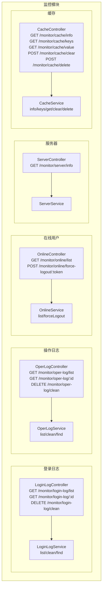
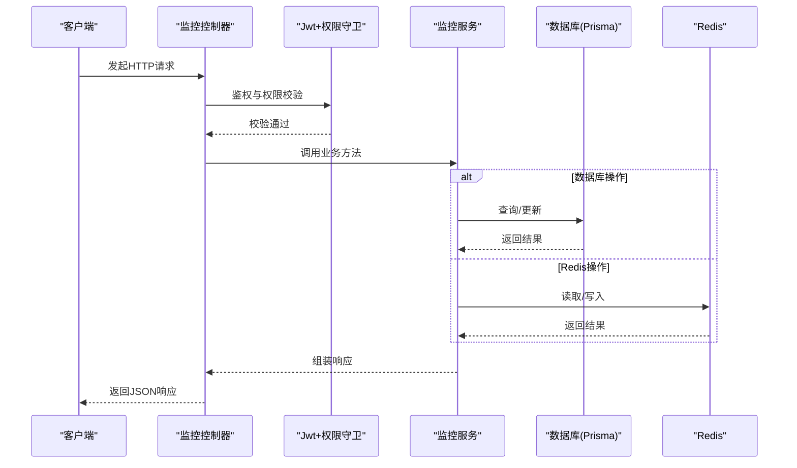
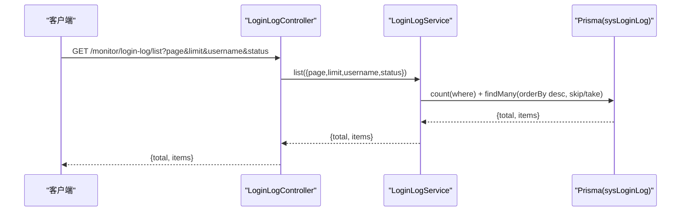
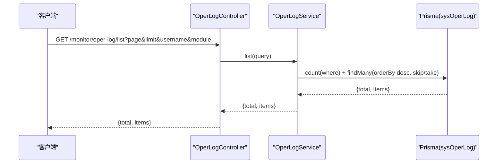
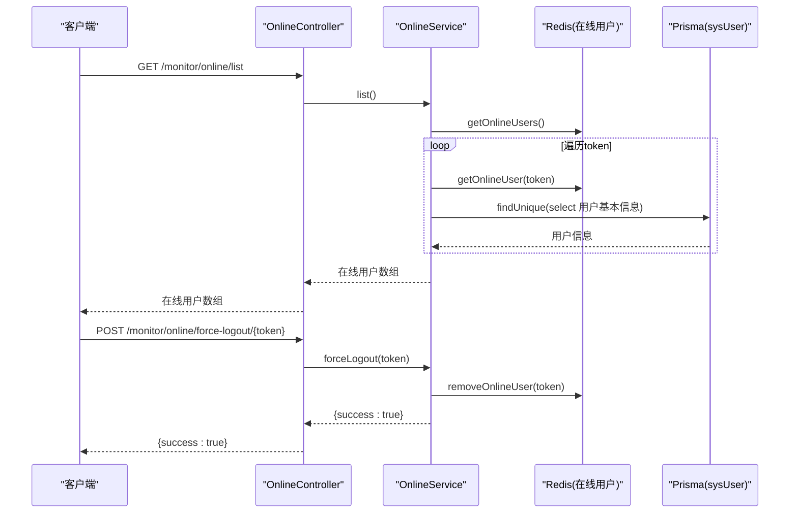
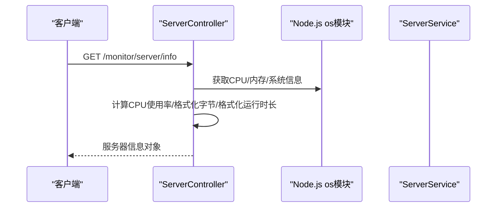
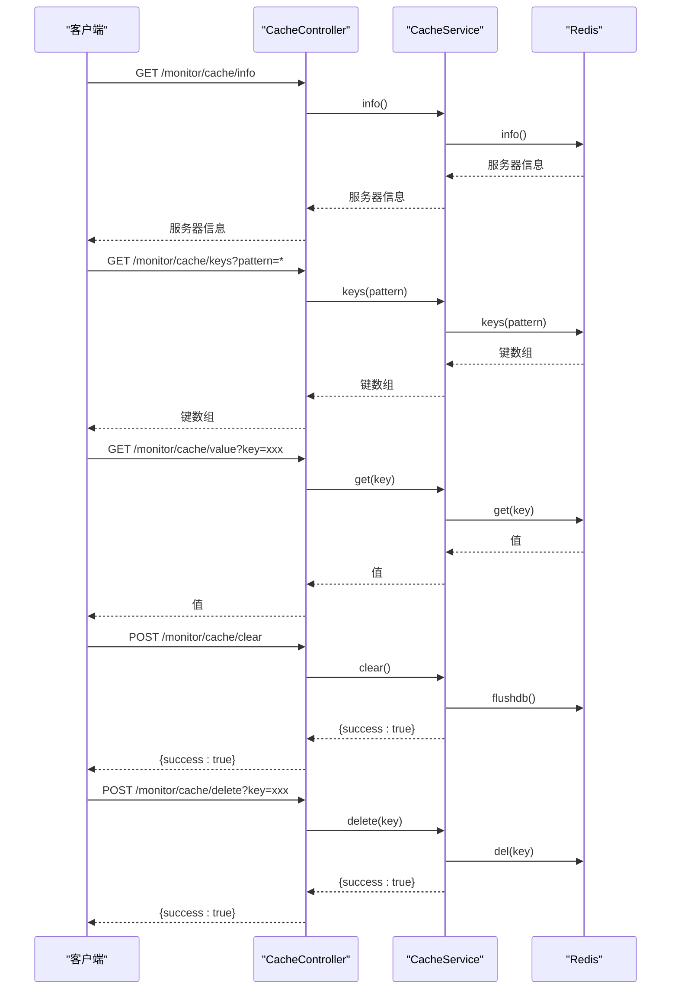
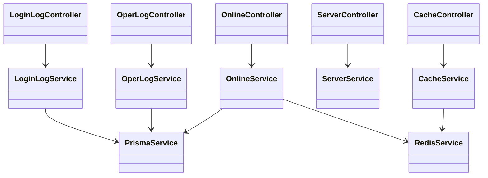

# 监控接口

<cite>
**本文档引用的文件**
- [apps/backend/src/modules/monitor/login-log/login-log.controller.ts](file://apps/backend/src/modules/monitor/login-log/login-log.controller.ts)
- [apps/backend/src/modules/monitor/login-log/login-log.service.ts](file://apps/backend/src/modules/monitor/login-log/login-log.service.ts)
- [apps/backend/src/modules/monitor/oper-log/oper-log.controller.ts](file://apps/backend/src/modules/monitor/oper-log/oper-log.controller.ts)
- [apps/backend/src/modules/monitor/oper-log/oper-log.service.ts](file://apps/backend/src/modules/monitor/oper-log/oper-log.service.ts)
- [apps/backend/src/modules/monitor/online/online.controller.ts](file://apps/backend/src/modules/monitor/online/online.controller.ts)
- [apps/backend/src/modules/monitor/online/online.service.ts](file://apps/backend/src/modules/monitor/online/online.service.ts)
- [apps/backend/src/modules/monitor/server/server.controller.ts](file://apps/backend/src/modules/monitor/server/server.controller.ts)
- [apps/backend/src/modules/monitor/server/server.service.ts](file://apps/backend/src/modules/monitor/server/server.service.ts)
- [apps/backend/src/modules/monitor/cache/cache.controller.ts](file://apps/backend/src/modules/monitor/cache/cache.controller.ts)
- [apps/backend/src/modules/monitor/cache/cache.service.ts](file://apps/backend/src/modules/monitor/cache/cache.service.ts)
</cite>

## 目录
1. [简介](#简介)
2. [项目结构](#项目结构)
3. [核心组件](#核心组件)
4. [架构总览](#架构总览)
5. [详细组件分析](#详细组件分析)
6. [依赖关系分析](#依赖关系分析)
7. [性能考虑](#性能考虑)
8. [故障排除指南](#故障排除指南)
9. [结论](#结论)

## 简介
本文件面向系统监控模块的API接口规范，覆盖登录日志管理、操作日志管理、在线用户监控、服务器性能监控以及Redis缓存监控五大类接口。文档从接口定义、请求参数、响应结构、权限控制、数据统计与图表格式、实时监控机制与历史分析能力等方面进行系统化说明，并对聚合计算、趋势分析、异常检测与告警触发等高级功能给出扩展建议。

## 项目结构
监控模块采用按功能分层的目录组织方式，控制器负责HTTP路由与参数解析，服务层封装数据访问与业务逻辑，依赖Prisma进行数据库操作，依赖Redis进行在线用户与缓存信息读取。

**图示来源**
- [apps/backend/src/modules/monitor/login-log/login-log.controller.ts:1-45](file://apps/backend/src/modules/monitor/login-log/login-log.controller.ts#L1-L45)
- [apps/backend/src/modules/monitor/oper-log/oper-log.controller.ts:1-35](file://apps/backend/src/modules/monitor/oper-log/oper-log.controller.ts#L1-L35)
- [apps/backend/src/modules/monitor/online/online.controller.ts:1-28](file://apps/backend/src/modules/monitor/online/online.controller.ts#L1-L28)
- [apps/backend/src/modules/monitor/server/server.controller.ts:1-70](file://apps/backend/src/modules/monitor/server/server.controller.ts#L1-L70)
- [apps/backend/src/modules/monitor/cache/cache.controller.ts:1-50](file://apps/backend/src/modules/monitor/cache/cache.controller.ts#L1-L50)

**章节来源**
- [apps/backend/src/modules/monitor/login-log/login-log.controller.ts:1-45](file://apps/backend/src/modules/monitor/login-log/login-log.controller.ts#L1-L45)
- [apps/backend/src/modules/monitor/oper-log/oper-log.controller.ts:1-35](file://apps/backend/src/modules/monitor/oper-log/oper-log.controller.ts#L1-L35)
- [apps/backend/src/modules/monitor/online/online.controller.ts:1-28](file://apps/backend/src/modules/monitor/online/online.controller.ts#L1-L28)
- [apps/backend/src/modules/monitor/server/server.controller.ts:1-70](file://apps/backend/src/modules/monitor/server/server.controller.ts#L1-L70)
- [apps/backend/src/modules/monitor/cache/cache.controller.ts:1-50](file://apps/backend/src/modules/monitor/cache/cache.controller.ts#L1-L50)

## 核心组件
- 登录日志控制器：提供登录日志列表查询、详情查询、清空功能；支持按用户名与登录状态筛选。
- 操作日志控制器：提供操作日志列表查询、详情查询、清空功能；支持按用户名与模块名筛选。
- 在线用户控制器：提供在线用户列表查询、强制下线功能；通过Redis令牌映射在线用户。
- 服务器控制器：提供服务器基础信息查询；计算CPU使用率、内存使用量与系统运行时长。
- 缓存控制器：提供Redis信息查询、键扫描、键值读取、全库清理、单键删除功能。

**章节来源**
- [apps/backend/src/modules/monitor/login-log/login-log.controller.ts:13-28](file://apps/backend/src/modules/monitor/login-log/login-log.controller.ts#L13-L28)
- [apps/backend/src/modules/monitor/oper-log/oper-log.controller.ts:13-33](file://apps/backend/src/modules/monitor/oper-log/oper-log.controller.ts#L13-L33)
- [apps/backend/src/modules/monitor/online/online.controller.ts:13-26](file://apps/backend/src/modules/monitor/online/online.controller.ts#L13-L26)
- [apps/backend/src/modules/monitor/server/server.controller.ts:14-41](file://apps/backend/src/modules/monitor/server/server.controller.ts#L14-L41)
- [apps/backend/src/modules/monitor/cache/cache.controller.ts:13-48](file://apps/backend/src/modules/monitor/cache/cache.controller.ts#L13-L48)

## 架构总览
监控接口统一采用鉴权守卫与权限守卫，确保仅授权用户可访问。控制器调用对应服务层，服务层通过Prisma或Redis完成数据读写。

**图示来源**
- [apps/backend/src/modules/monitor/login-log/login-log.controller.ts:9-11](file://apps/backend/src/modules/monitor/login-log/login-log.controller.ts#L9-L11)
- [apps/backend/src/modules/monitor/oper-log/oper-log.controller.ts:9-11](file://apps/backend/src/modules/monitor/oper-log/oper-log.controller.ts#L9-L11)
- [apps/backend/src/modules/monitor/online/online.controller.ts:9-11](file://apps/backend/src/modules/monitor/online/online.controller.ts#L9-L11)
- [apps/backend/src/modules/monitor/server/server.controller.ts:9-12](file://apps/backend/src/modules/monitor/server/server.controller.ts#L9-L12)
- [apps/backend/src/modules/monitor/cache/cache.controller.ts:9-11](file://apps/backend/src/modules/monitor/cache/cache.controller.ts#L9-L11)

## 详细组件分析

### 登录日志管理接口
- 接口路径
  - GET /monitor/login-log/list
  - GET /monitor/login-log/{id}
  - DELETE /monitor/login-log/clean
- 权限标识
  - monitor:login:list
- 请求参数
  - 分页参数：page（默认1）、limit（默认10）
  - 过滤条件：username（模糊匹配）、status（数字，0/1）
- 响应结构
  - 列表：{ total: number, items: Array }
  - 单条：对象（sysLoginLog记录）
- 数据统计与图表
  - 可按天/小时聚合登录次数、成功/失败比例
  - 支持按用户维度统计登录频次与成功率
- 实时监控与历史分析
  - 实时：结合WebSocket推送新增登录事件
  - 历史：支持时间范围筛选与导出
- 高级功能建议
  - 异常检测：同一IP/账号短时间多次失败
  - 告警触发：连续失败阈值、异地登录提醒

**图示来源**
- [apps/backend/src/modules/monitor/login-log/login-log.controller.ts:13-28](file://apps/backend/src/modules/monitor/login-log/login-log.controller.ts#L13-L28)
- [apps/backend/src/modules/monitor/login-log/login-log.service.ts:8-21](file://apps/backend/src/modules/monitor/login-log/login-log.service.ts#L8-L21)

**章节来源**
- [apps/backend/src/modules/monitor/login-log/login-log.controller.ts:13-28](file://apps/backend/src/modules/monitor/login-log/login-log.controller.ts#L13-L28)
- [apps/backend/src/modules/monitor/login-log/login-log.service.ts:8-21](file://apps/backend/src/modules/monitor/login-log/login-log.service.ts#L8-L21)

### 操作日志管理接口
- 接口路径
  - GET /monitor/oper-log/list
  - GET /monitor/oper-log/{id}
  - DELETE /monitor/oper-log/clean
- 权限标识
  - monitor:oper:list
- 请求参数
  - 分页参数：page（默认1）、limit（默认10）
  - 过滤条件：username（模糊匹配）、module（模块名模糊匹配）
- 响应结构
  - 列表：{ total: number, items: Array }
  - 单条：对象（sysOperLog记录）
- 数据统计与图表
  - 可按模块/用户聚合操作次数、错误率
  - 支持按时间段的趋势分析
- 实时监控与历史分析
  - 实时：操作日志拦截器自动记录，可推送增量
  - 历史：支持按时间范围与模块筛选导出
- 高级功能建议
  - 异常检测：高频删除/修改敏感字段
  - 告警触发：批量删除、越权操作

**图示来源**
- [apps/backend/src/modules/monitor/oper-log/oper-log.controller.ts:13-18](file://apps/backend/src/modules/monitor/oper-log/oper-log.controller.ts#L13-L18)
- [apps/backend/src/modules/monitor/oper-log/oper-log.service.ts:8-23](file://apps/backend/src/modules/monitor/oper-log/oper-log.service.ts#L8-L23)

**章节来源**
- [apps/backend/src/modules/monitor/oper-log/oper-log.controller.ts:13-18](file://apps/backend/src/modules/monitor/oper-log/oper-log.controller.ts#L13-L18)
- [apps/backend/src/modules/monitor/oper-log/oper-log.service.ts:8-23](file://apps/backend/src/modules/monitor/oper-log/oper-log.service.ts#L8-L23)

### 在线用户监控接口
- 接口路径
  - GET /monitor/online/list
  - POST /monitor/online/force-logout/{token}
- 权限标识
  - monitor:online:list
- 请求参数
  - 列表：无
  - 强制下线：路径参数 token（字符串）
- 响应结构
  - 列表：数组，元素包含 token 与用户基本信息
  - 强制下线：{ success: true }
- 数据统计与图表
  - 在线人数曲线、按部门/角色分布
- 实时监控与历史分析
  - 实时：基于Redis令牌集合，定时刷新
  - 历史：结合登录日志分析活跃时段
- 高级功能建议
  - 异常检测：多端登录、长时间不活跃
  - 告警触发：高并发登录、异地登录

**图示来源**
- [apps/backend/src/modules/monitor/online/online.controller.ts:13-26](file://apps/backend/src/modules/monitor/online/online.controller.ts#L13-L26)
- [apps/backend/src/modules/monitor/online/online.service.ts:9-30](file://apps/backend/src/modules/monitor/online/online.service.ts#L9-L30)

**章节来源**
- [apps/backend/src/modules/monitor/online/online.controller.ts:13-26](file://apps/backend/src/modules/monitor/online/online.controller.ts#L13-L26)
- [apps/backend/src/modules/monitor/online/online.service.ts:9-30](file://apps/backend/src/modules/monitor/online/online.service.ts#L9-L30)

### 服务器性能监控接口
- 接口路径
  - GET /monitor/server/info
- 权限标识
  - monitor:server:list
- 请求参数：无
- 响应结构
  - 包含操作系统、CPU核数、CPU使用率、内存总量/已用/剩余/使用率、运行时长、主机名等
- 数据统计与图表
  - CPU/内存使用率折线图、磁盘I/O趋势
- 实时监控与历史分析
  - 实时：周期性采集并入库，前端轮询展示
  - 历史：按天/小时聚合指标，生成报表
- 高级功能建议
  - 异常检测：CPU/内存持续高位、频繁重启
  - 告警触发：阈值告警、容量预警

**图示来源**
- [apps/backend/src/modules/monitor/server/server.controller.ts:14-41](file://apps/backend/src/modules/monitor/server/server.controller.ts#L14-L41)

**章节来源**
- [apps/backend/src/modules/monitor/server/server.controller.ts:14-41](file://apps/backend/src/modules/monitor/server/server.controller.ts#L14-L41)

### Redis缓存监控接口
- 接口路径
  - GET /monitor/cache/info
  - GET /monitor/cache/keys?pattern=*
  - GET /monitor/cache/value?key=xxx
  - POST /monitor/cache/clear
  - POST /monitor/cache/delete?key=xxx
- 权限标识
  - monitor:cache:list
- 请求参数
  - keys：pattern（默认*）
  - value：key（必填）
  - delete：key（必填）
  - clear：无
- 响应结构
  - info：Redis服务器信息
  - keys：键数组
  - value：键对应的值
  - clear/delete：{ success: true }
- 数据统计与图表
  - 键空间分布、热键TopN、内存占用趋势
- 实时监控与历史分析
  - 实时：键扫描与值读取
  - 历史：定期采样Key数量与内存使用
- 高级功能建议
  - 异常检测：Key过期风暴、内存增长异常
  - 告警触发：内存上限、Key数量激增

**图示来源**
- [apps/backend/src/modules/monitor/cache/cache.controller.ts:13-48](file://apps/backend/src/modules/monitor/cache/cache.controller.ts#L13-L48)
- [apps/backend/src/modules/monitor/cache/cache.service.ts:8-28](file://apps/backend/src/modules/monitor/cache/cache.service.ts#L8-L28)

**章节来源**
- [apps/backend/src/modules/monitor/cache/cache.controller.ts:13-48](file://apps/backend/src/modules/monitor/cache/cache.controller.ts#L13-L48)
- [apps/backend/src/modules/monitor/cache/cache.service.ts:8-28](file://apps/backend/src/modules/monitor/cache/cache.service.ts#L8-L28)

## 依赖关系分析
- 控制器依赖服务层，服务层依赖基础设施：
  - LoginLogService/OperLogService 依赖 PrismaService
  - OnlineService 依赖 RedisService 与 PrismaService
  - CacheService 依赖 RedisService
  - ServerController 直接使用 Node.js os 模块
- 权限控制：所有监控接口均需 JwtAuthGuard 与 PermissionGuard，且配置了具体权限标识

**图示来源**
- [apps/backend/src/modules/monitor/login-log/login-log.controller.ts:1-11](file://apps/backend/src/modules/monitor/login-log/login-log.controller.ts#L1-L11)
- [apps/backend/src/modules/monitor/oper-log/oper-log.controller.ts:1-11](file://apps/backend/src/modules/monitor/oper-log/oper-log.controller.ts#L1-L11)
- [apps/backend/src/modules/monitor/online/online.controller.ts:1-11](file://apps/backend/src/modules/monitor/online/online.controller.ts#L1-L11)
- [apps/backend/src/modules/monitor/server/server.controller.ts:1-12](file://apps/backend/src/modules/monitor/server/server.controller.ts#L1-L12)
- [apps/backend/src/modules/monitor/cache/cache.controller.ts:1-11](file://apps/backend/src/modules/monitor/cache/cache.controller.ts#L1-L11)
- [apps/backend/src/modules/monitor/login-log/login-log.service.ts:1-6](file://apps/backend/src/modules/monitor/login-log/login-log.service.ts#L1-L6)
- [apps/backend/src/modules/monitor/oper-log/oper-log.service.ts:1-6](file://apps/backend/src/modules/monitor/oper-log/oper-log.service.ts#L1-L6)
- [apps/backend/src/modules/monitor/online/online.service.ts:1-7](file://apps/backend/src/modules/monitor/online/online.service.ts#L1-L7)
- [apps/backend/src/modules/monitor/server/server.service.ts:1-4](file://apps/backend/src/modules/monitor/server/server.service.ts#L1-L4)
- [apps/backend/src/modules/monitor/cache/cache.service.ts:1-6](file://apps/backend/src/modules/monitor/cache/cache.service.ts#L1-L6)

**章节来源**
- [apps/backend/src/modules/monitor/login-log/login-log.controller.ts:1-11](file://apps/backend/src/modules/monitor/login-log/login-log.controller.ts#L1-L11)
- [apps/backend/src/modules/monitor/oper-log/oper-log.controller.ts:1-11](file://apps/backend/src/modules/monitor/oper-log/oper-log.controller.ts#L1-L11)
- [apps/backend/src/modules/monitor/online/online.controller.ts:1-11](file://apps/backend/src/modules/monitor/online/online.controller.ts#L1-L11)
- [apps/backend/src/modules/monitor/server/server.controller.ts:1-12](file://apps/backend/src/modules/monitor/server/server.controller.ts#L1-L12)
- [apps/backend/src/modules/monitor/cache/cache.controller.ts:1-11](file://apps/backend/src/modules/monitor/cache/cache.controller.ts#L1-L11)

## 性能考虑
- 分页查询：列表接口默认每页10条，建议根据实际数据规模调整limit并增加索引优化
- 并发访问：在线用户列表遍历token并逐个查询用户信息，建议在Redis侧增加批量查询或缓存用户信息
- Redis压力：keys命令可能阻塞，建议使用scan替代，或限制pattern范围
- CPU/内存采集：服务器信息接口直接调用系统API，建议缓存短期结果避免频繁系统调用
- 数据库查询：登录/操作日志列表使用count与findMany并行，注意where条件的索引设计

## 故障排除指南
- 权限不足
  - 现象：返回403
  - 处理：确认用户是否具备monitor:*相关权限
- 参数类型错误
  - 现象：分页参数解析失败
  - 处理：确保page/limit为整数，username/status/module为字符串
- Redis不可用
  - 现象：在线用户列表为空、缓存接口报错
  - 处理：检查Redis连接配置与网络连通性
- 数据库异常
  - 现象：登录/操作日志查询失败
  - 处理：检查Prisma连接与表结构是否存在

**章节来源**
- [apps/backend/src/modules/monitor/login-log/login-log.controller.ts:1-11](file://apps/backend/src/modules/monitor/login-log/login-log.controller.ts#L1-L11)
- [apps/backend/src/modules/monitor/oper-log/oper-log.controller.ts:1-11](file://apps/backend/src/modules/monitor/oper-log/oper-log.controller.ts#L1-L11)
- [apps/backend/src/modules/monitor/online/online.controller.ts:1-11](file://apps/backend/src/modules/monitor/online/online.controller.ts#L1-L11)
- [apps/backend/src/modules/monitor/cache/cache.controller.ts:1-11](file://apps/backend/src/modules/monitor/cache/cache.controller.ts#L1-L11)

## 结论
监控模块提供了完整的系统运行状态观测能力，涵盖登录行为、操作轨迹、在线用户、服务器资源与缓存状态。通过鉴权与权限守卫保障安全，结合分页与过滤提升查询效率。建议在生产环境中完善实时推送、历史归档与告警联动机制，以实现更全面的可观测性与运维自动化。