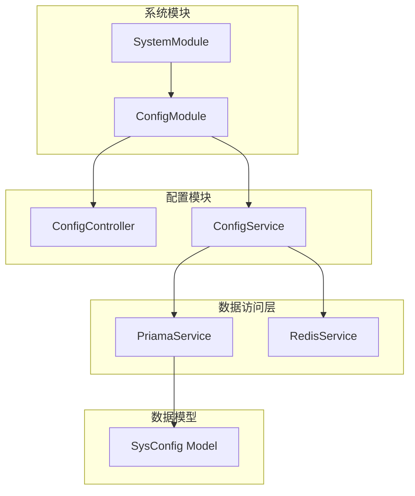
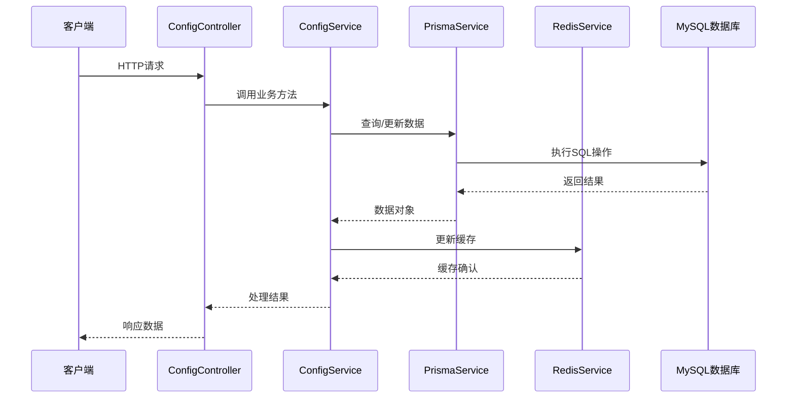
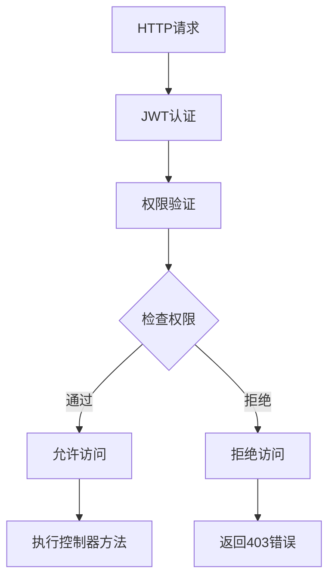
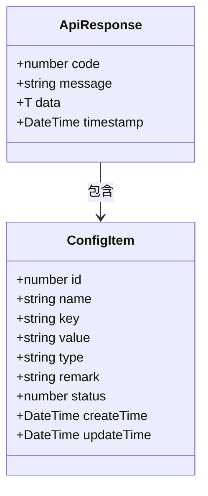
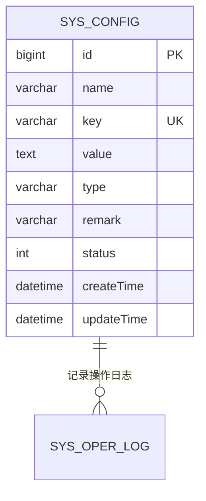
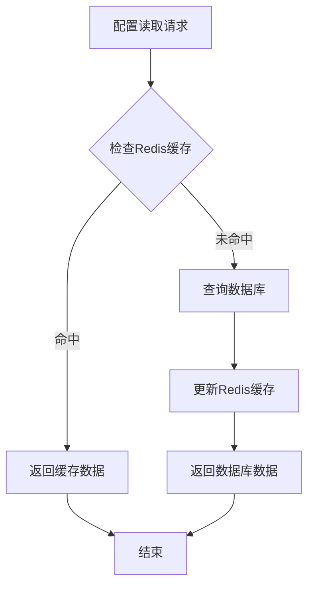
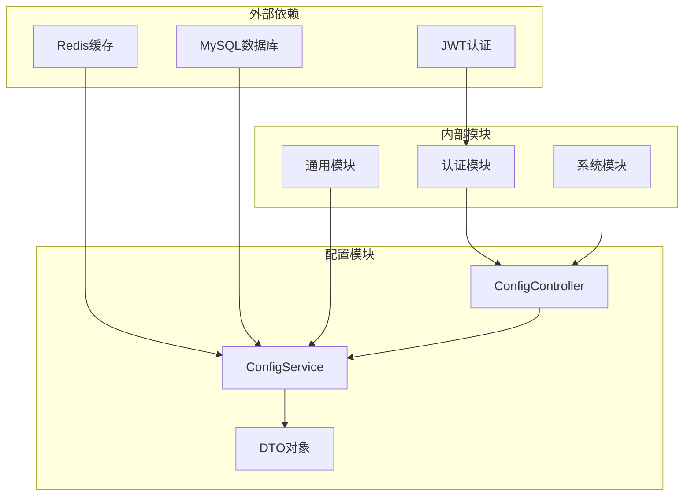

# 参数配置接口

<cite>
**本文档引用的文件**
- [config.controller.ts](file://apps/backend/src/modules/system/config/config.controller.ts)
- [config.service.ts](file://apps/backend/src/modules/system/config/config.service.ts)
- [config.dto.ts](file://apps/backend/src/modules/system/config/dto/config.dto.ts)
- [guards.ts](file://apps/backend/src/auth/guards.ts)
- [redis.service.ts](file://apps/backend/src/cache/redis.service.ts)
- [prisma.service.ts](file://apps/backend/src/common/prisma.service.ts)
- [schema.prisma](file://apps/backend/prisma/schema.prisma)
- [config.ts](file://apps/vben-admin/apps/web-antd/src/api/system/config.ts)
- [system.module.ts](file://apps/backend/src/modules/system/system.module.ts)
- [app.module.ts](file://apps/backend/src/app.module.ts)
- [transform.interceptor.ts](file://apps/backend/src/common/transform.interceptor.ts)
- [oper-log.interceptor.ts](file://apps/backend/src/common/oper-log.interceptor.ts)
</cite>

## 目录
1. [简介](#简介)
2. [项目结构](#项目结构)
3. [核心组件](#核心组件)
4. [架构概览](#架构概览)
5. [详细组件分析](#详细组件分析)
6. [依赖关系分析](#依赖关系分析)
7. [性能考虑](#性能考虑)
8. [故障排除指南](#故障排除指南)
9. [结论](#结论)

## 简介

参数配置模块是系统管理的重要组成部分，负责管理系统运行时的各种配置参数。该模块提供了完整的CRUD操作接口，支持参数配置的增删改查、状态管理、缓存刷新等功能。通过Redis缓存机制实现高性能的配置读取，并提供热更新能力，确保系统配置的实时性和一致性。

## 项目结构

参数配置模块采用标准的NestJS分层架构设计，包含控制器、服务层、数据传输对象(DTO)、数据库模型等组件。



**图表来源**
- [system.module.ts:11-21](file://apps/backend/src/modules/system/system.module.ts#L11-L21)
- [config.module.ts:5-8](file://apps/backend/src/modules/system/config/config.module.ts#L5-L8)

**章节来源**
- [system.module.ts:1-23](file://apps/backend/src/modules/system/system.module.ts#L1-L23)
- [config.module.ts:1-10](file://apps/backend/src/modules/system/config/config.module.ts#L1-L10)

## 核心组件

### 控制器层

ConfigController是参数配置模块的入口点，提供RESTful API接口。所有接口都使用JWT认证和权限验证，确保只有授权用户才能访问。

### 服务层

ConfigService负责业务逻辑处理，包括数据查询、验证、缓存管理等。它与数据库和Redis缓存进行交互，实现配置数据的持久化存储和快速读取。

### 数据传输对象

提供标准化的数据验证和转换机制，确保输入数据的完整性和安全性。

**章节来源**
- [config.controller.ts:11-62](file://apps/backend/src/modules/system/config/config.controller.ts#L11-L62)
- [config.service.ts:7-56](file://apps/backend/src/modules/system/config/config.service.ts#L7-L56)
- [config.dto.ts:5-28](file://apps/backend/src/modules/system/config/dto/config.dto.ts#L5-L28)

## 架构概览

参数配置模块采用分层架构设计，实现了清晰的关注点分离和职责划分。



**图表来源**
- [config.controller.ts:14-61](file://apps/backend/src/modules/system/config/config.controller.ts#L14-L61)
- [config.service.ts:10-55](file://apps/backend/src/modules/system/config/config.service.ts#L10-L55)

### 权限控制架构



**图表来源**
- [guards.ts:36-50](file://apps/backend/src/auth/guards.ts#L36-L50)

## 详细组件分析

### API接口定义

#### 获取参数配置列表
- **URL**: `GET /api/system/config/list`
- **权限**: `system:config:list`
- **功能**: 分页查询参数配置列表，支持按名称、键名、状态过滤

**章节来源**
- [config.controller.ts:14-19](file://apps/backend/src/modules/system/config/config.controller.ts#L14-L19)

#### 获取参数配置详情
- **URL**: `GET /api/system/config/:id`
- **权限**: `system:config:list`
- **功能**: 根据ID获取单个参数配置的详细信息

**章节来源**
- [config.controller.ts:28-33](file://apps/backend/src/modules/system/config/config.controller.ts#L28-L33)

#### 创建参数配置
- **URL**: `POST /api/system/config`
- **权限**: `system:config:list`
- **功能**: 创建新的参数配置项

**章节来源**
- [config.controller.ts:35-40](file://apps/backend/src/modules/system/config/config.controller.ts#L35-L40)

#### 更新参数配置
- **URL**: `PUT /api/system/config`
- **权限**: `system:config:list`
- **功能**: 更新现有参数配置项

**章节来源**
- [config.controller.ts:42-47](file://apps/backend/src/modules/system/config/config.controller.ts#L42-L47)

#### 删除参数配置
- **URL**: `DELETE /api/system/config/:id`
- **权限**: `system:config:list`
- **功能**: 删除指定ID的参数配置

**章节来源**
- [config.controller.ts:49-54](file://apps/backend/src/modules/system/config/config.controller.ts#L49-L54)

#### 刷新配置缓存
- **URL**: `PUT /api/system/config/refresh`
- **权限**: `system:config:list`
- **功能**: 重新加载所有启用的配置到Redis缓存中

**章节来源**
- [config.controller.ts:56-61](file://apps/backend/src/modules/system/config/config.controller.ts#L56-L61)

### 请求参数说明

#### CreateConfigDto
创建参数配置时需要的字段：
- `name`: 参数名称，字符串类型，必填
- `key`: 参数键名，字符串类型，必填
- `value`: 参数值，字符串类型，必填
- `type`: 参数类型，默认为"string"
- `remark`: 备注说明，可选
- `status`: 状态，默认为1(启用)

#### UpdateConfigDto
更新参数配置时需要的字段：
- `id`: 配置ID，整数类型，必填
- `name`: 参数名称，可选
- `value`: 参数值，可选
- `type`: 参数类型，可选
- `status`: 状态，可选
- `remark`: 备注说明，可选

#### QueryConfigDto
查询参数配置时的过滤条件：
- `name`: 参数名称过滤，可选
- `key`: 参数键名过滤，可选
- `status`: 状态过滤，可选

**章节来源**
- [config.dto.ts:5-28](file://apps/backend/src/modules/system/config/dto/config.dto.ts#L5-L28)

### 响应数据结构

所有API响应都经过统一的包装格式，遵循以下结构：



**图表来源**
- [transform.interceptor.ts:12-28](file://apps/backend/src/common/transform.interceptor.ts#L12-L28)

### 权限控制

参数配置模块使用双重权限控制机制：

1. **JWT认证**: 确保请求来自已认证的用户
2. **权限验证**: 检查用户是否具有相应的系统配置权限

权限标识符：
- `system:config:list`: 查看配置列表权限
- `system:config:add`: 添加配置权限  
- `system:config:edit`: 编辑配置权限
- `system:config:remove`: 删除配置权限

**章节来源**
- [guards.ts:16-17](file://apps/backend/src/auth/guards.ts#L16-L17)
- [config.controller.ts:15](file://apps/backend/src/modules/system/config/config.controller.ts#L15)

### 数据库模型

参数配置使用Prisma ORM进行数据持久化，SysConfig模型定义如下：



**图表来源**
- [schema.prisma:152-165](file://apps/backend/prisma/schema.prisma#L152-L165)

**章节来源**
- [schema.prisma:152-165](file://apps/backend/prisma/schema.prisma#L152-L165)

### 缓存策略

参数配置采用Redis作为缓存层，实现高性能的配置读取：



**图表来源**
- [config.service.ts:49-55](file://apps/backend/src/modules/system/config/config.service.ts#L49-L55)

**章节来源**
- [redis.service.ts:29-47](file://apps/backend/src/cache/redis.service.ts#L29-L47)

### 状态码定义

- `200 OK`: 请求成功
- `401 Unauthorized`: 未认证或认证失败
- `403 Forbidden`: 权限不足
- `404 Not Found`: 资源不存在
- `500 Internal Server Error`: 服务器内部错误

### 实际使用示例

前端调用示例：

```typescript
// 获取配置列表
getConfigList({ name: '系统', page: 1, limit: 10 })

// 根据键名获取配置
getConfigByKey('sys_name')

// 创建新配置
createConfig({
  name: '系统名称',
  key: 'sys_name',
  value: 'Nest-Admin-Pro'
})

// 更新配置
updateConfig({
  id: 1,
  value: 'Nest-Admin-Pro v2.0'
})

// 删除配置
deleteConfig(1)

// 刷新缓存
refreshConfigCache()
```

**章节来源**
- [config.ts:19-45](file://apps/vben-admin/apps/web-antd/src/api/system/config.ts#L19-L45)

## 依赖关系分析

参数配置模块的依赖关系图：



**图表来源**
- [app.module.ts:18-38](file://apps/backend/src/app.module.ts#L18-L38)
- [config.controller.ts:1-6](file://apps/backend/src/modules/system/config/config.controller.ts#L1-L6)

**章节来源**
- [app.module.ts:1-59](file://apps/backend/src/app.module.ts#L1-L59)
- [config.service.ts:1-8](file://apps/backend/src/modules/system/config/config.service.ts#L1-L8)

## 性能考虑

### 缓存优化

1. **Redis缓存**: 所有配置数据都缓存在Redis中，减少数据库查询压力
2. **批量刷新**: 支持一次性刷新所有启用的配置到缓存
3. **智能过期**: 配置更新时自动更新缓存，确保数据一致性

### 数据库优化

1. **索引优化**: 在key字段上建立唯一索引，提高查询性能
2. **分页查询**: 支持大数据量的分页查询
3. **条件过滤**: 支持多条件组合查询

### 并发控制

1. **事务处理**: 关键操作使用数据库事务保证数据一致性
2. **锁机制**: 避免并发更新导致的数据竞争

## 故障排除指南

### 常见问题及解决方案

#### Redis连接失败
- **症状**: 配置更新后无法立即生效
- **原因**: Redis服务不可用
- **解决**: 检查Redis连接配置和网络连通性

#### 权限不足
- **症状**: 返回403错误
- **原因**: 用户缺少相应权限
- **解决**: 为用户分配system:config:*权限

#### 配置重复
- **症状**: 创建配置时报错
- **原因**: 键名重复
- **解决**: 使用唯一的配置键名

#### 数据库连接问题
- **症状**: 查询或更新操作失败
- **原因**: 数据库连接异常
- **解决**: 检查数据库连接配置和连接池设置

**章节来源**
- [redis.service.ts:16-23](file://apps/backend/src/cache/redis.service.ts#L16-L23)
- [config.service.ts:20-22](file://apps/backend/src/modules/system/config/config.service.ts#L20-L22)

### 日志监控

系统提供完整的操作日志记录，包括：
- 请求时间、方法、URL
- 请求参数和响应结果
- 用户信息和IP地址
- 执行时长和错误信息

**章节来源**
- [oper-log.interceptor.ts:30-61](file://apps/backend/src/common/oper-log.interceptor.ts#L30-L61)

## 结论

参数配置模块通过合理的架构设计和完善的权限控制，为系统提供了安全、高效的配置管理能力。其核心特点包括：

1. **完整的CRUD支持**: 提供参数配置的全生命周期管理
2. **高性能缓存**: 基于Redis的缓存机制确保快速响应
3. **严格权限控制**: 双重认证和权限验证保障系统安全
4. **统一数据格式**: 标准化的响应格式便于前端处理
5. **完善的日志记录**: 全面的操作日志便于审计和故障排查

该模块的设计充分体现了现代Web应用的最佳实践，为系统的稳定运行提供了重要支撑。