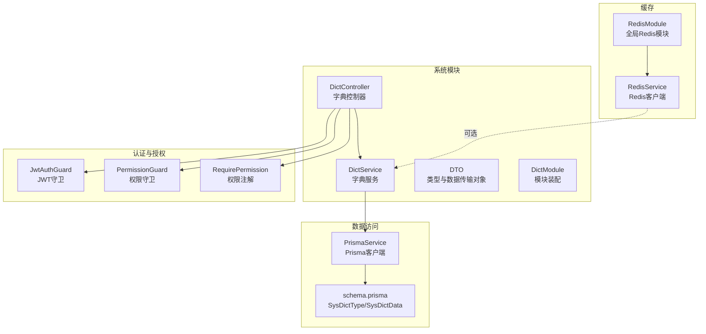
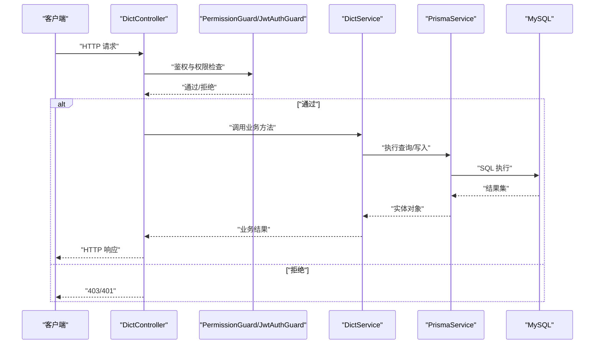
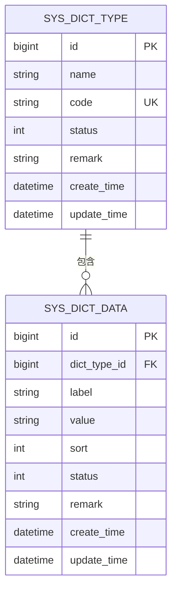
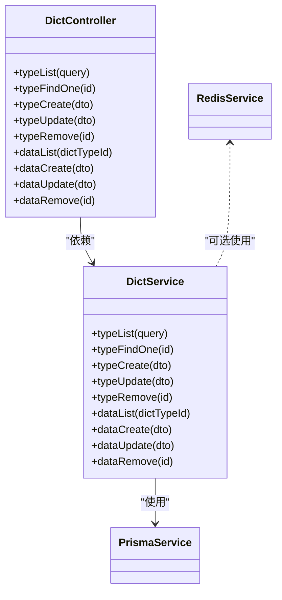

# 字典管理接口

<cite>
**本文引用的文件**
- [apps/backend/src/modules/system/dict/dict.controller.ts](file://apps/backend/src/modules/system/dict/dict.controller.ts)
- [apps/backend/src/modules/system/dict/dict.service.ts](file://apps/backend/src/modules/system/dict/dict.service.ts)
- [apps/backend/src/modules/system/dict/dto/dict.dto.ts](file://apps/backend/src/modules/system/dict/dto/dict.dto.ts)
- [apps/backend/src/modules/system/dict/dict.module.ts](file://apps/backend/src/modules/system/dict/dict.module.ts)
- [apps/backend/src/auth/guards.ts](file://apps/backend/src/auth/guards.ts)
- [apps/backend/src/common/prisma.service.ts](file://apps/backend/src/common/prisma.service.ts)
- [apps/backend/prisma/schema.prisma](file://apps/backend/prisma/schema.prisma)
- [apps/backend/src/cache/redis.service.ts](file://apps/backend/src/cache/redis.service.ts)
- [apps/backend/src/cache/redis.module.ts](file://apps/backend/src/cache/redis.module.ts)
</cite>

## 目录
1. [简介](#简介)
2. [项目结构](#项目结构)
3. [核心组件](#核心组件)
4. [架构总览](#架构总览)
5. [详细组件分析](#详细组件分析)
6. [依赖关系分析](#依赖关系分析)
7. [性能考虑](#性能考虑)
8. [故障排查指南](#故障排查指南)
9. [结论](#结论)
10. [附录](#附录)

## 简介
本文件为“字典管理”模块的详细API文档，围绕 DictController 控制器提供的字典类型与字典数据的完整CRUD能力进行说明。涵盖以下接口：
- 获取字典类型列表（GET /api/system/dict/type/list）
- 获取字典类型详情（GET /api/system/dict/type/:id）
- 创建字典类型（POST /api/system/dict/type）
- 更新字典类型（PUT /api/system/dict/type）
- 删除字典类型（DELETE /api/system/dict/type/:id）
- 获取字典数据列表（GET /api/system/dict/data/list?dictTypeId=...）
- 创建字典数据（POST /api/system/dict/data）
- 更新字典数据（PUT /api/system/dict/data）
- 删除字典数据（DELETE /api/system/dict/data/:id）

同时，文档给出请求参数说明（CreateDictTypeDto、UpdateDictTypeDto、QueryDictTypeDto、CreateDictDataDto、UpdateDictDataDto）、响应数据结构、权限控制策略（system:dict:list）以及状态码定义，并对字典数据缓存、动态字典加载等高级功能进行说明。

## 项目结构
字典模块采用按功能分层的组织方式，核心由控制器、服务、DTO、模块组成；权限控制通过JWT与权限守卫实现；数据持久化通过Prisma完成；可选的缓存能力通过Redis提供。

图表来源
- [apps/backend/src/modules/system/dict/dict.controller.ts:1-81](file://apps/backend/src/modules/system/dict/dict.controller.ts#L1-L81)
- [apps/backend/src/modules/system/dict/dict.service.ts:1-59](file://apps/backend/src/modules/system/dict/dict.service.ts#L1-L59)
- [apps/backend/src/modules/system/dict/dto/dict.dto.ts:1-42](file://apps/backend/src/modules/system/dict/dto/dict.dto.ts#L1-L42)
- [apps/backend/src/modules/system/dict/dict.module.ts:1-10](file://apps/backend/src/modules/system/dict/dict.module.ts#L1-L10)
- [apps/backend/src/auth/guards.ts:1-51](file://apps/backend/src/auth/guards.ts#L1-L51)
- [apps/backend/src/common/prisma.service.ts:1-22](file://apps/backend/src/common/prisma.service.ts#L1-L22)
- [apps/backend/prisma/schema.prisma:118-150](file://apps/backend/prisma/schema.prisma#L118-L150)
- [apps/backend/src/cache/redis.module.ts:1-9](file://apps/backend/src/cache/redis.module.ts#L1-L9)
- [apps/backend/src/cache/redis.service.ts:1-128](file://apps/backend/src/cache/redis.service.ts#L1-L128)

章节来源
- [apps/backend/src/modules/system/dict/dict.controller.ts:1-81](file://apps/backend/src/modules/system/dict/dict.controller.ts#L1-L81)
- [apps/backend/src/modules/system/dict/dict.service.ts:1-59](file://apps/backend/src/modules/system/dict/dict.service.ts#L1-L59)
- [apps/backend/src/modules/system/dict/dto/dict.dto.ts:1-42](file://apps/backend/src/modules/system/dict/dto/dict.dto.ts#L1-L42)
- [apps/backend/src/modules/system/dict/dict.module.ts:1-10](file://apps/backend/src/modules/system/dict/dict.module.ts#L1-L10)
- [apps/backend/src/auth/guards.ts:1-51](file://apps/backend/src/auth/guards.ts#L1-L51)
- [apps/backend/src/common/prisma.service.ts:1-22](file://apps/backend/src/common/prisma.service.ts#L1-L22)
- [apps/backend/prisma/schema.prisma:118-150](file://apps/backend/prisma/schema.prisma#L118-L150)
- [apps/backend/src/cache/redis.module.ts:1-9](file://apps/backend/src/cache/redis.module.ts#L1-L9)
- [apps/backend/src/cache/redis.service.ts:1-128](file://apps/backend/src/cache/redis.service.ts#L1-L128)

## 核心组件
- DictController：暴露REST接口，负责路由分发与参数校验，调用DictService执行业务逻辑。
- DictService：封装字典类型与字典数据的增删改查、条件过滤、排序与关联查询。
- DTO：定义请求体与查询参数的数据结构与验证规则。
- 权限守卫：RequirePermission用于标注所需权限，PermissionGuard在运行时检查用户权限集合。
- 数据模型：SysDictType（字典类型）、SysDictData（字典数据），通过PrismaService访问数据库。
- 缓存：RedisService提供键值与哈希存储能力，可用于字典数据缓存与动态加载优化。

章节来源
- [apps/backend/src/modules/system/dict/dict.controller.ts:1-81](file://apps/backend/src/modules/system/dict/dict.controller.ts#L1-L81)
- [apps/backend/src/modules/system/dict/dict.service.ts:1-59](file://apps/backend/src/modules/system/dict/dict.service.ts#L1-L59)
- [apps/backend/src/modules/system/dict/dto/dict.dto.ts:1-42](file://apps/backend/src/modules/system/dict/dto/dict.dto.ts#L1-L42)
- [apps/backend/src/auth/guards.ts:16-51](file://apps/backend/src/auth/guards.ts#L16-L51)
- [apps/backend/prisma/schema.prisma:118-150](file://apps/backend/prisma/schema.prisma#L118-L150)
- [apps/backend/src/cache/redis.service.ts:1-128](file://apps/backend/src/cache/redis.service.ts#L1-L128)

## 架构总览
下图展示从HTTP请求到数据库的端到端流程，包括权限校验、参数解析、业务处理与数据持久化。

图表来源
- [apps/backend/src/modules/system/dict/dict.controller.ts:1-81](file://apps/backend/src/modules/system/dict/dict.controller.ts#L1-L81)
- [apps/backend/src/auth/guards.ts:36-51](file://apps/backend/src/auth/guards.ts#L36-L51)
- [apps/backend/src/modules/system/dict/dict.service.ts:1-59](file://apps/backend/src/modules/system/dict/dict.service.ts#L1-L59)
- [apps/backend/src/common/prisma.service.ts:1-22](file://apps/backend/src/common/prisma.service.ts#L1-L22)

## 详细组件分析

### 接口清单与说明

- 获取字典类型列表
  - 方法与路径：GET /api/system/dict/type/list
  - 权限：system:dict:list
  - 查询参数：支持 name、code、status（可选）
  - 返回：字典类型数组（按id升序）
  - 处理流程：控制器接收QueryDictTypeDto，服务端按条件构造where并查询

- 获取字典类型详情
  - 方法与路径：GET /api/system/dict/type/:id
  - 权限：system:dict:list
  - 路径参数：id（整数）
  - 返回：字典类型及关联的字典数据项（按sort升序）
  - 错误：未找到返回404

- 创建字典类型
  - 方法与路径：POST /api/system/dict/type
  - 权限：system:dict:list
  - 请求体：CreateDictTypeDto（name、code、status可选、remark可选）
  - 返回：新创建的字典类型

- 更新字典类型
  - 方法与路径：PUT /api/system/dict/type
  - 权限：system:dict:list
  - 请求体：UpdateDictTypeDto（id必填，其余可选）
  - 返回：更新后的字典类型
  - 错误：未找到返回404

- 删除字典类型
  - 方法与路径：DELETE /api/system/dict/type/:id
  - 权限：system:dict:list
  - 路径参数：id（整数）
  - 返回：{ success: true }
  - 错误：若存在关联数据则返回400

- 获取字典数据列表
  - 方法与路径：GET /api/system/dict/data/list?dictTypeId=...
  - 权限：system:dict:list
  - 查询参数：dictTypeId（整数，必填）
  - 返回：该类型下的字典数据数组（按sort升序）

- 创建字典数据
  - 方法与路径：POST /api/system/dict/data
  - 权限：system:dict:list
  - 请求体：CreateDictDataDto（dictTypeId、label、value、sort/status可选、remark可选）

- 更新字典数据
  - 方法与路径：PUT /api/system/dict/data
  - 权限：system:dict:list
  - 请求体：UpdateDictDataDto（id必填，其余可选）
  - 错误：未找到返回404

- 删除字典数据
  - 方法与路径：DELETE /api/system/dict/data/:id
  - 权限：system:dict:list
  - 路径参数：id（整数）
  - 返回：{ success: true }

章节来源
- [apps/backend/src/modules/system/dict/dict.controller.ts:14-79](file://apps/backend/src/modules/system/dict/dict.controller.ts#L14-L79)
- [apps/backend/src/modules/system/dict/dict.service.ts:9-58](file://apps/backend/src/modules/system/dict/dict.service.ts#L9-L58)
- [apps/backend/src/modules/system/dict/dto/dict.dto.ts:5-42](file://apps/backend/src/modules/system/dict/dto/dict.dto.ts#L5-L42)
- [apps/backend/src/auth/guards.ts:16-51](file://apps/backend/src/auth/guards.ts#L16-L51)

### 请求参数与响应结构

- CreateDictTypeDto
  - 字段：name（字符串，必填）、code（字符串，必填）、status（整数，可选，默认启用）、remark（字符串，可选）
  - 示例：见DTO文件中的示例注解

- UpdateDictTypeDto
  - 字段：id（整数，必填）、name/status/remark（可选）

- QueryDictTypeDto
  - 字段：name/code（字符串，可选）、status（整数，可选）

- CreateDictDataDto
  - 字段：dictTypeId（整数，必填）、label（字符串，必填）、value（字符串，必填）、sort/status/remark（可选）

- UpdateDictDataDto
  - 字段：id（整数，必填）、label/value/sort/status/remark（可选）

- 响应结构
  - 列表类接口返回数组或分页结构（具体取决于前端/后端实现）
  - 单条查询返回对象
  - 删除接口返回 { success: true }

章节来源
- [apps/backend/src/modules/system/dict/dto/dict.dto.ts:5-42](file://apps/backend/src/modules/system/dict/dto/dict.dto.ts#L5-L42)

### 权限控制
- 所有接口均使用 RequirePermission('system:dict:list') 注解
- 运行时由 PermissionGuard 从请求上下文提取用户权限集合，要求满足全部所需权限
- JWT守卫确保请求携带有效令牌

章节来源
- [apps/backend/src/modules/system/dict/dict.controller.ts:16-49](file://apps/backend/src/modules/system/dict/dict.controller.ts#L16-L49)
- [apps/backend/src/auth/guards.ts:36-51](file://apps/backend/src/auth/guards.ts#L36-L51)

### 状态码定义
- 200：删除成功（删除接口）
- 400：删除失败（存在关联数据）
- 401：未认证
- 403：无权限
- 404：资源不存在（类型/数据未找到）

章节来源
- [apps/backend/src/modules/system/dict/dict.controller.ts:45-49](file://apps/backend/src/modules/system/dict/dict.controller.ts#L45-L49)
- [apps/backend/src/modules/system/dict/dict.service.ts:34-39](file://apps/backend/src/modules/system/dict/dict.service.ts#L34-L39)
- [apps/backend/src/auth/guards.ts:40-51](file://apps/backend/src/auth/guards.ts#L40-L51)

### 实际使用示例
以下为典型调用场景（仅描述请求与预期响应，不包含具体代码）：
- 新增字典类型
  - 请求：POST /api/system/dict/type
  - 请求体：包含 name、code、status、remark
  - 响应：新增的字典类型对象
- 获取某类型详情
  - 请求：GET /api/system/dict/type/1
  - 响应：包含该类型及其所有数据项的对象
- 新增字典数据
  - 请求：POST /api/system/dict/data
  - 请求体：包含 dictTypeId、label、value、sort、status、remark
  - 响应：新增的字典数据对象
- 删除字典类型
  - 请求：DELETE /api/system/dict/type/1
  - 响应：{ success: true }

章节来源
- [apps/backend/src/modules/system/dict/dict.controller.ts:29-49](file://apps/backend/src/modules/system/dict/dict.controller.ts#L29-L49)
- [apps/backend/src/modules/system/dict/dict.service.ts:24-39](file://apps/backend/src/modules/system/dict/dict.service.ts#L24-L39)

### 数据模型与关系
字典类型与字典数据通过外键关联，类型包含多个数据项，数据项按sort排序。

图表来源
- [apps/backend/prisma/schema.prisma:118-150](file://apps/backend/prisma/schema.prisma#L118-L150)

## 依赖关系分析
- 控制器依赖服务：DictController 通过构造函数注入 DictService
- 服务依赖数据访问：DictService 使用 PrismaService 访问数据库
- 权限依赖：控制器使用 RequirePermission 注解，运行时由 PermissionGuard 检查
- 缓存依赖：RedisModule 全局导出 RedisService，可在服务中按需使用

图表来源
- [apps/backend/src/modules/system/dict/dict.controller.ts:1-81](file://apps/backend/src/modules/system/dict/dict.controller.ts#L1-L81)
- [apps/backend/src/modules/system/dict/dict.service.ts:1-59](file://apps/backend/src/modules/system/dict/dict.service.ts#L1-L59)
- [apps/backend/src/common/prisma.service.ts:1-22](file://apps/backend/src/common/prisma.service.ts#L1-L22)
- [apps/backend/src/cache/redis.service.ts:1-128](file://apps/backend/src/cache/redis.service.ts#L1-L128)

章节来源
- [apps/backend/src/modules/system/dict/dict.controller.ts:1-81](file://apps/backend/src/modules/system/dict/dict.controller.ts#L1-L81)
- [apps/backend/src/modules/system/dict/dict.service.ts:1-59](file://apps/backend/src/modules/system/dict/dict.service.ts#L1-L59)
- [apps/backend/src/common/prisma.service.ts:1-22](file://apps/backend/src/common/prisma.service.ts#L1-L22)
- [apps/backend/src/cache/redis.service.ts:1-128](file://apps/backend/src/cache/redis.service.ts#L1-L128)

## 性能考虑
- 查询优化
  - 类型列表支持按 name/code/status 过滤，建议在数据库层面建立索引（schema已包含索引定义）
  - 数据项按 sort 升序返回，避免前端二次排序
- 写入优化
  - 批量导入字典数据时，建议使用数据库事务减少往返
- 缓存策略（可选）
  - 可使用 RedisService 对热点字典类型/数据进行缓存，设置合理TTL
  - 动态字典加载：在应用启动或首次访问时从数据库加载，写入缓存；变更时失效对应键

章节来源
- [apps/backend/prisma/schema.prisma:118-150](file://apps/backend/prisma/schema.prisma#L118-L150)
- [apps/backend/src/cache/redis.service.ts:29-60](file://apps/backend/src/cache/redis.service.ts#L29-L60)

## 故障排查指南
- 400 删除失败
  - 现象：删除字典类型时报错
  - 原因：该类型下存在字典数据
  - 处理：先删除或迁移关联数据后再试
- 404 资源不存在
  - 现象：查询类型或数据详情报错
  - 原因：id无效或已被删除
  - 处理：确认id正确性与数据状态
- 403 无权限
  - 现象：接口返回403
  - 原因：当前用户缺少 system:dict:list 权限
  - 处理：为用户角色分配相应权限
- 401 未认证
  - 现象：接口返回401
  - 原因：缺少或无效的JWT令牌
  - 处理：重新登录获取令牌

章节来源
- [apps/backend/src/modules/system/dict/dict.service.ts:34-39](file://apps/backend/src/modules/system/dict/dict.service.ts#L34-L39)
- [apps/backend/src/auth/guards.ts:40-51](file://apps/backend/src/auth/guards.ts#L40-L51)

## 结论
字典管理模块提供了完善的类型与数据CRUD能力，配合权限守卫与Prisma数据访问，能够稳定支撑业务字典需求。通过Redis缓存可进一步提升读取性能与动态加载体验。建议在生产环境中结合索引、事务与缓存策略，确保高并发下的稳定性与一致性。

## 附录

### 接口一览表
- GET /api/system/dict/type/list：获取字典类型列表
- GET /api/system/dict/type/:id：获取字典类型详情
- POST /api/system/dict/type：创建字典类型
- PUT /api/system/dict/type：更新字典类型
- DELETE /api/system/dict/type/:id：删除字典类型
- GET /api/system/dict/data/list?dictTypeId=...：获取字典数据列表
- POST /api/system/dict/data：创建字典数据
- PUT /api/system/dict/data：更新字典数据
- DELETE /api/system/dict/data/:id：删除字典数据

章节来源
- [apps/backend/src/modules/system/dict/dict.controller.ts:14-79](file://apps/backend/src/modules/system/dict/dict.controller.ts#L14-L79)