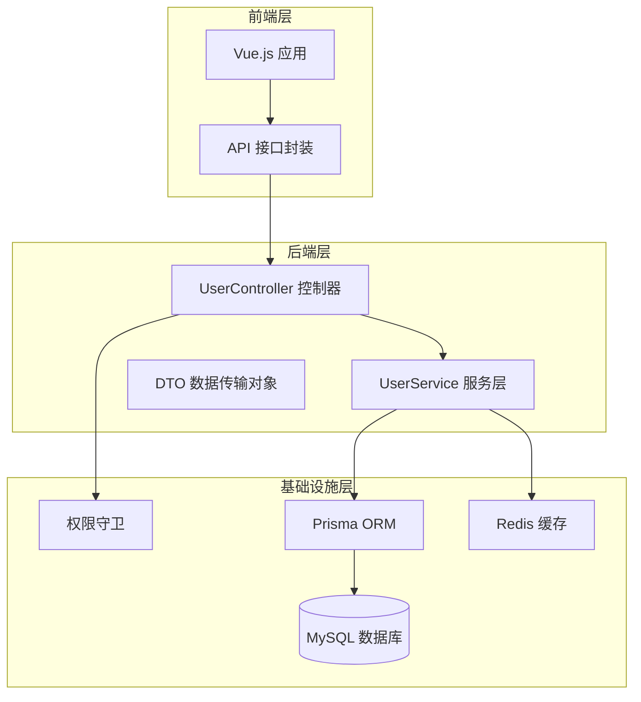
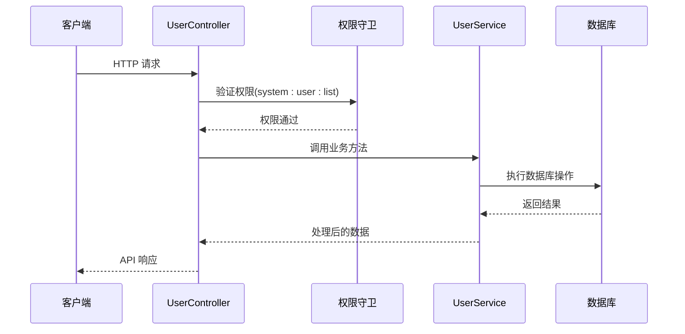
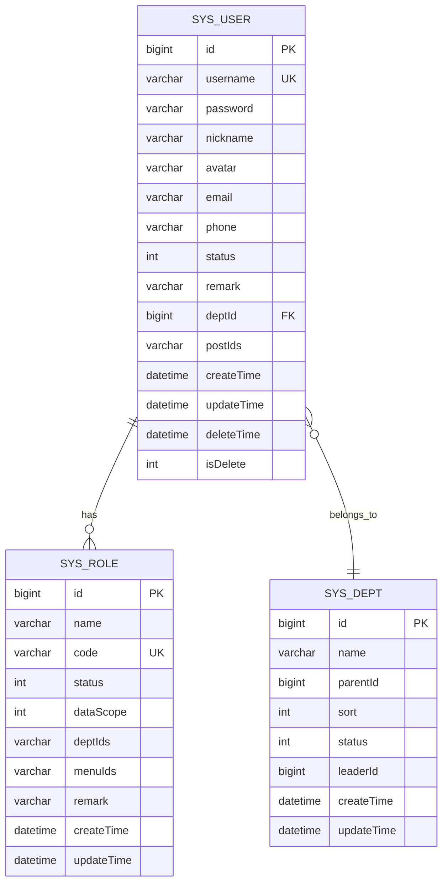
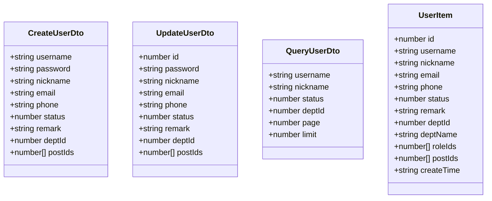
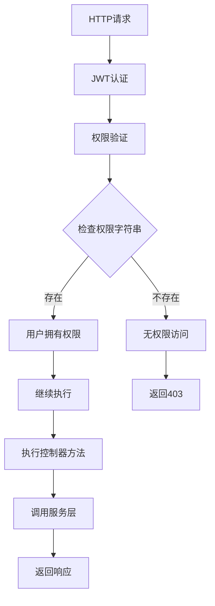
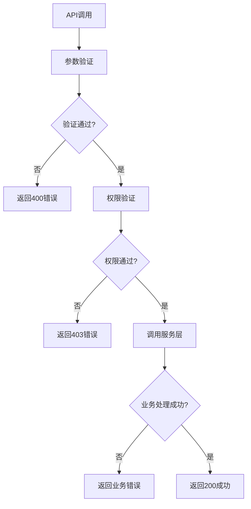

# 用户管理接口

## 目录
1. [简介](#简介)
2. [项目结构](#项目结构)
3. [核心组件](#核心组件)
4. [架构概览](#架构概览)
5. [详细接口文档](#详细接口文档)
6. [数据模型](#数据模型)
7. [权限控制](#权限控制)
8. [状态码定义](#状态码定义)
9. [使用示例](#使用示例)
10. [故障排除指南](#故障排除指南)
11. [结论](#结论)

## 简介

用户管理接口是系统的核心功能模块，提供了完整的用户生命周期管理能力。该模块基于NestJS框架构建，采用RESTful API设计规范，支持用户的基本CRUD操作、高级查询、权限管理和安全控制。

本接口文档详细说明了用户管理的所有API端点，包括：
- 获取用户列表（支持分页、条件筛选、排序）
- 获取用户详情
- 创建用户
- 更新用户
- 删除用户
- 重置密码
- 修改用户状态
- 分配角色

## 项目结构

用户管理模块采用典型的分层架构设计：



**图表来源**
- [user.controller.ts:1-89](file://apps/backend/src/modules/system/user/user.controller.ts#L1-89)
- [user.service.ts:1-144](file://apps/backend/src/modules/system/user/user.service.ts#L1-144)
- [guards.ts:1-51](file://apps/backend/src/auth/guards.ts#L1-51)

**章节来源**
- [user.controller.ts:1-89](file://apps/backend/src/modules/system/user/user.controller.ts#L1-89)
- [user.service.ts:1-144](file://apps/backend/src/modules/system/user/user.service.ts#L1-144)

## 核心组件

### 控制器层
UserController负责处理HTTP请求，应用权限验证，并将业务逻辑委托给UserService。

### 服务层  
UserService实现具体的业务逻辑，包括数据验证、数据库操作、密码加密等。

### DTO层
数据传输对象用于请求参数验证和响应数据结构定义。

### 权限控制
基于JWT的认证和基于权限字符串的授权机制。

**章节来源**
- [user.controller.ts:20-23](file://apps/backend/src/modules/system/user/user.controller.ts#L20-23)
- [guards.ts:16-17](file://apps/backend/src/auth/guards.ts#L16-17)

## 架构概览



**图表来源**
- [user.controller.ts:26-31](file://apps/backend/src/modules/system/user/user.controller.ts#L26-31)
- [guards.ts:36-50](file://apps/backend/src/auth/guards.ts#L36-50)

## 详细接口文档

### 获取用户列表

**请求地址**: `GET /api/system/user/list`

**权限要求**: `system:user:list`

**功能描述**: 支持分页查询、条件筛选和排序的用户列表接口

**请求参数**:

| 参数名 | 类型 | 必填 | 默认值 | 描述 |
|--------|------|------|--------|------|
| username | string | 否 | - | 用户名（模糊匹配） |
| nickname | string | 否 | - | 昵称（模糊匹配） |
| status | number | 否 | - | 用户状态（1启用，0禁用） |
| deptId | number | 否 | - | 部门ID |
| page | number | 否 | 1 | 页码（最小值1） |
| limit | number | 否 | 10 | 每页条数（最小值1） |

**响应数据结构**:

```typescript
{
  code: number,           // 响应码
  data: {
    total: number,        // 总记录数
    items: UserItem[]     // 用户列表
  },
  message: string         // 响应消息
}
```

**UserItem 结构**:

| 字段名 | 类型 | 描述 |
|--------|------|------|
| id | number | 用户ID |
| username | string | 用户名 |
| nickname | string | 昵称 |
| email | string | 邮箱 |
| phone | string | 电话 |
| status | number | 状态（1启用，0禁用） |
| remark | string | 备注 |
| deptId | number | 部门ID |
| deptName | string | 部门名称 |
| roleIds | number[] | 角色ID数组 |
| postIds | number[] | 岗位ID数组 |
| createTime | string | 创建时间 |

**章节来源**
- [user.controller.ts:26-31](file://apps/backend/src/modules/system/user/user.controller.ts#L26-31)
- [user.dto.ts:94-130](file://apps/backend/src/modules/system/user/dto/user.dto.ts#L94-130)
- [user.service.ts:18-46](file://apps/backend/src/modules/system/user/user.service.ts#L18-46)

### 获取用户详情

**请求地址**: `GET /api/system/user/{id}`

**权限要求**: `system:user:list`

**功能描述**: 根据用户ID获取用户详细信息

**路径参数**:

| 参数名 | 类型 | 必填 | 描述 |
|--------|------|------|------|
| id | number | 是 | 用户ID |

**响应数据结构**:

```typescript
{
  code: number,
  data: UserItem,
  message: string
}
```

**章节来源**
- [user.controller.ts:33-38](file://apps/backend/src/modules/system/user/user.controller.ts#L33-38)
- [user.service.ts:48-55](file://apps/backend/src/modules/system/user/user.service.ts#L48-55)

### 创建用户

**请求地址**: `POST /api/system/user`

**权限要求**: `system:user:add`

**功能描述**: 创建新用户

**请求体参数**:

| 参数名 | 类型 | 必填 | 默认值 | 描述 |
|--------|------|------|--------|------|
| username | string | 是 | - | 用户名 |
| password | string | 是 | - | 密码 |
| nickname | string | 否 | - | 昵称 |
| email | string | 否 | - | 邮箱 |
| phone | string | 否 | - | 电话 |
| status | number | 否 | 1 | 状态（1启用，0禁用） |
| remark | string | 否 | - | 备注 |
| deptId | number | 否 | - | 部门ID |
| postIds | number[] | 否 | - | 岗位ID数组 |

**响应数据结构**:

```typescript
{
  code: number,
  data: {
    id: number,
    username: string
  },
  message: string
}
```

**章节来源**
- [user.controller.ts:40-45](file://apps/backend/src/modules/system/user/user.controller.ts#L40-45)
- [user.dto.ts:5-47](file://apps/backend/src/modules/system/user/dto/user.dto.ts#L5-47)
- [user.service.ts:57-78](file://apps/backend/src/modules/system/user/user.service.ts#L57-78)

### 更新用户

**请求地址**: `PUT /api/system/user`

**权限要求**: `system:user:edit`

**功能描述**: 更新现有用户信息

**请求体参数**:

| 参数名 | 类型 | 必填 | 默认值 | 描述 |
|--------|------|------|--------|------|
| id | number | 是 | - | 用户ID |
| password | string | 否 | - | 新密码（提供则更新） |
| nickname | string | 否 | - | 昵称 |
| email | string | 否 | - | 邮箱 |
| phone | string | 否 | - | 电话 |
| status | number | 否 | - | 状态（1启用，0禁用） |
| remark | string | 否 | - | 备注 |
| deptId | number | 否 | - | 部门ID |
| postIds | number[] | 否 | - | 岗位ID数组 |

**响应数据结构**:

```typescript
{
  code: number,
  data: {
    id: number,
    username: string
  },
  message: string
}
```

**章节来源**
- [user.controller.ts:47-52](file://apps/backend/src/modules/system/user/user.controller.ts#L47-52)
- [user.dto.ts:49-92](file://apps/backend/src/modules/system/user/dto/user.dto.ts#L49-92)
- [user.service.ts:80-107](file://apps/backend/src/modules/system/user/user.service.ts#L80-107)

### 删除用户

**请求地址**: `DELETE /api/system/user/{id}`

**权限要求**: `system:user:remove`

**功能描述**: 删除用户（软删除）

**路径参数**:

| 参数名 | 类型 | 必填 | 描述 |
|--------|------|------|------|
| id | number | 是 | 用户ID |

**响应数据结构**:

```typescript
{
  code: number,
  data: {
    success: boolean
  },
  message: string
}
```

**章节来源**
- [user.controller.ts:54-60](file://apps/backend/src/modules/system/user/user.controller.ts#L54-60)
- [user.service.ts:109-115](file://apps/backend/src/modules/system/user/user.service.ts#L109-115)

### 重置密码

**请求地址**: `PUT /api/system/user/reset-password/{id}`

**权限要求**: `system:user:resetPwd`

**功能描述**: 重置用户密码为默认值

**路径参数**:

| 参数名 | 类型 | 必填 | 描述 |
|--------|------|------|------|
| id | number | 是 | 用户ID |

**响应数据结构**:

```typescript
{
  code: number,
  data: {
    password: string  // 新密码
  },
  message: string
}
```

**章节来源**
- [user.controller.ts:62-67](file://apps/backend/src/modules/system/user/user.controller.ts#L62-67)
- [user.service.ts:117-125](file://apps/backend/src/modules/system/user/user.service.ts#L117-125)

### 修改状态

**请求地址**: `PUT /api/system/user/change-status/{id}`

**权限要求**: `system:user:edit`

**功能描述**: 修改用户状态

**路径参数**:

| 参数名 | 类型 | 必填 | 描述 |
|--------|------|------|------|
| id | number | 是 | 用户ID |

**请求体参数**:

| 参数名 | 类型 | 必填 | 描述 |
|--------|------|------|------|
| status | number | 是 | 新状态（1启用，0禁用） |

**响应数据结构**:

```typescript
{
  code: number,
  data: {
    success: boolean
  },
  message: string
}
```

**章节来源**
- [user.controller.ts:69-77](file://apps/backend/src/modules/system/user/user.controller.ts#L69-77)
- [user.service.ts:127-133](file://apps/backend/src/modules/system/user/user.service.ts#L127-133)

### 分配角色

**请求地址**: `PUT /api/system/user/assign-roles/{id}`

**权限要求**: `system:user:edit`

**功能描述**: 为用户分配角色

**路径参数**:

| 参数名 | 类型 | 必填 | 描述 |
|--------|------|------|------|
| id | number | 是 | 用户ID |

**请求体参数**:

| 参数名 | 类型 | 必填 | 描述 |
|--------|------|------|------|
| roleIds | number[] | 是 | 角色ID数组 |

**响应数据结构**:

```typescript
{
  code: number,
  data: {
    success: boolean
  },
  message: string
}
```

**章节来源**
- [user.controller.ts:79-87](file://apps/backend/src/modules/system/user/user.controller.ts#L79-87)
- [user.service.ts:135-143](file://apps/backend/src/modules/system/user/user.service.ts#L135-143)

## 数据模型

### 用户实体结构



**图表来源**
- [schema.prisma:13-38](file://apps/backend/prisma/schema.prisma#L13-38)
- [schema.prisma:41-56](file://apps/backend/prisma/schema.prisma#L41-56)
- [schema.prisma:59-75](file://apps/backend/prisma/schema.prisma#L59-75)

### DTO类关系图



**图表来源**
- [user.dto.ts:5-47](file://apps/backend/src/modules/system/user/dto/user.dto.ts#L5-47)
- [user.dto.ts:49-92](file://apps/backend/src/modules/system/user/dto/user.dto.ts#L49-92)
- [user.dto.ts:94-130](file://apps/backend/src/modules/system/user/dto/user.dto.ts#L94-130)

## 权限控制

### 权限字符串

系统使用基于字符串的权限控制机制，每个API端点都对应特定的权限字符串：

| API端点 | 权限字符串 | 功能描述 |
|---------|------------|----------|
| GET /system/user/list | system:user:list | 查询用户列表 |
| GET /system/user/:id | system:user:list | 获取用户详情 |
| POST /system/user | system:user:add | 创建用户 |
| PUT /system/user | system:user:edit | 更新用户 |
| DELETE /system/user/:id | system:user:remove | 删除用户 |
| PUT /system/user/reset-password/:id | system:user:resetPwd | 重置密码 |
| PUT /system/user/change-status/:id | system:user:edit | 修改状态 |
| PUT /system/user/assign-roles/:id | system:user:edit | 分配角色 |

### 权限验证流程



**图表来源**
- [guards.ts:36-50](file://apps/backend/src/auth/guards.ts#L36-50)
- [user.controller.ts:22-23](file://apps/backend/src/modules/system/user/user.controller.ts#L22-23)

**章节来源**
- [guards.ts:16-17](file://apps/backend/src/auth/guards.ts#L16-17)
- [clean.sql:49-53](file://scripts/clean.sql#L49-53)

## 状态码定义

### 成功状态码
- `200`: 请求成功
- `201`: 创建成功

### 客户端错误状态码
- `400`: 请求参数错误或业务逻辑错误
- `401`: 未认证或Token无效
- `403`: 权限不足
- `404`: 资源不存在

### 服务器错误状态码
- `500`: 服务器内部错误

### API响应格式

所有API响应都遵循统一的结构：

```typescript
{
  code: number,      // HTTP状态码或业务状态码
  data: any,         // 响应数据
  message: string    // 响应消息
}
```

**章节来源**
- [api-response.ts:1-35](file://apps/backend/src/common/api-response.ts#L1-35)
- [exception.filter.ts:20-35](file://apps/backend/src/common/exception.filter.ts#L20-35)

## 使用示例

### 基础使用示例

以下示例展示了如何在前端应用中使用用户管理API：

**获取用户列表**
```javascript
// 使用Vben Admin的API封装
import { userApi } from '@/api/system/user'

// 基本分页查询
const userList = await userApi.list({
  page: 1,
  limit: 10
})

// 带条件查询
const filteredUsers = await userApi.list({
  username: 'admin',
  status: 1,
  page: 1,
  limit: 10
})
```

**创建用户**
```javascript
// 创建新用户
const newUser = await userApi.create({
  username: 'newuser',
  password: 'password123',
  nickname: '新用户',
  email: 'newuser@example.com',
  status: 1,
  deptId: 1
})
```

**更新用户**
```javascript
// 更新用户信息
const updatedUser = await userApi.update({
  id: 1,
  nickname: '更新后的昵称',
  phone: '13800138000',
  status: 0
})
```

**高级查询示例**

```javascript
// 复杂条件查询
const advancedQuery = await userApi.list({
  username: 'admin',
  nickname: '管理员',
  status: 1,
  deptId: 1,
  page: 1,
  limit: 20
})

// 自定义排序（通过后端orderBy实现）
// 在服务层已设置按ID降序排列
```

**章节来源**
- [user.ts:27-57](file://apps/vben-admin/apps/web-antd/src/api/system/user.ts#L27-57)

## 故障排除指南

### 常见问题及解决方案

**1. 权限不足错误 (403)**
- 检查用户是否具备相应的权限字符串
- 确认角色配置中包含所需的权限
- 验证JWT Token是否正确传递

**2. 用户名重复错误 (400)**
- 确保用户名唯一性
- 检查数据库约束
- 避免重复提交相同用户名

**3. 用户不存在错误 (404)**
- 验证用户ID是否正确
- 检查用户是否被软删除
- 确认用户状态正常

**4. 密码重置问题**
- 默认重置密码为固定值
- 确保用户邮箱配置正确
- 检查邮件发送配置

**5. 分页查询异常**
- 确认page和limit参数范围
- 检查数据库连接状态
- 验证查询条件的性能

### 错误处理流程



**图表来源**
- [user.service.ts:57-78](file://apps/backend/src/modules/system/user/user.service.ts#L57-78)
- [exception.filter.ts:20-35](file://apps/backend/src/common/exception.filter.ts#L20-35)

**章节来源**
- [user.service.ts:57-115](file://apps/backend/src/modules/system/user/user.service.ts#L57-115)
- [exception.filter.ts:12-37](file://apps/backend/src/common/exception.filter.ts#L12-37)

## 结论

用户管理接口提供了完整的企业级用户管理功能，具有以下特点：

1. **完整的CRUD操作**: 支持用户的基本增删改查操作
2. **灵活的查询功能**: 支持多条件筛选、分页查询和排序
3. **严格的安全控制**: 基于JWT的认证和基于权限字符串的授权
4. **统一的响应格式**: 标准化的API响应结构
5. **完善的错误处理**: 全面的异常捕获和错误响应

该接口设计符合RESTful API最佳实践，易于集成和扩展，能够满足大多数企业级应用的用户管理需求。