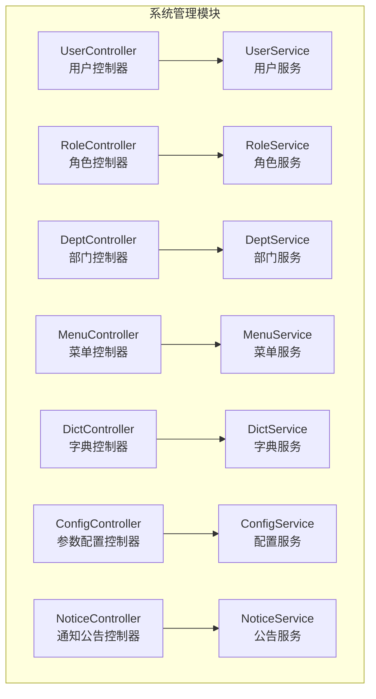
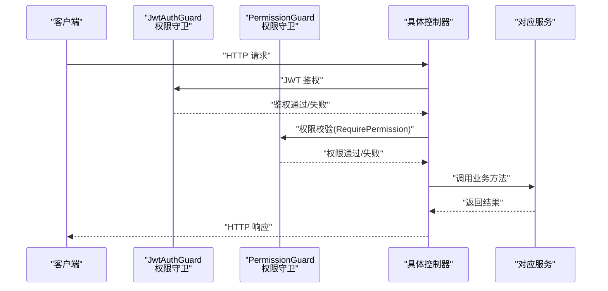
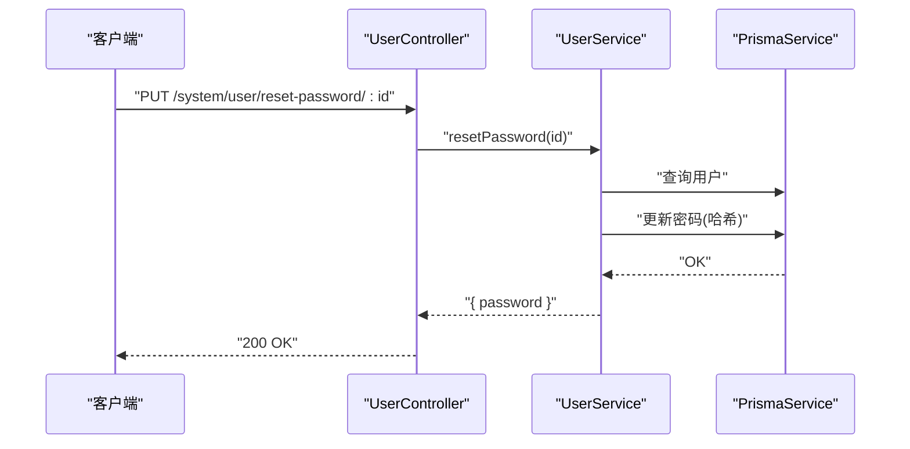
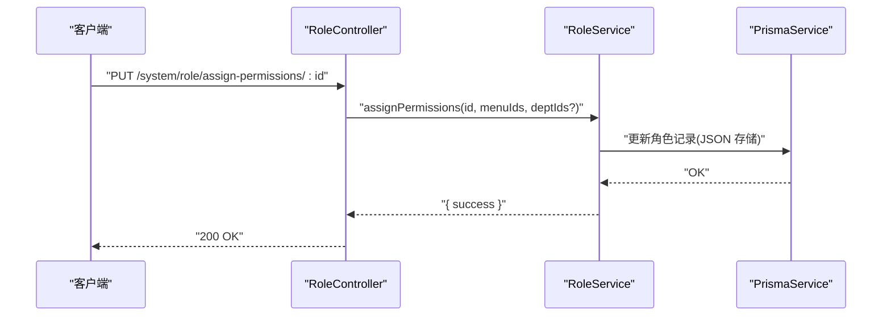
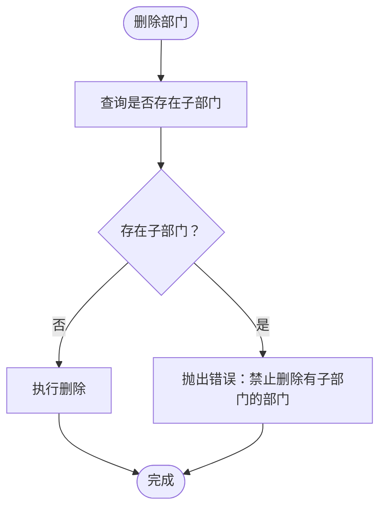
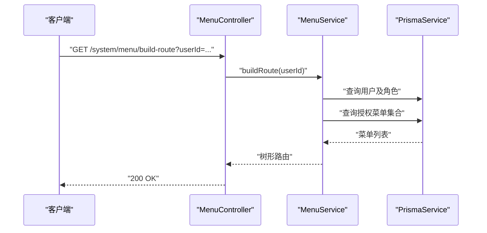
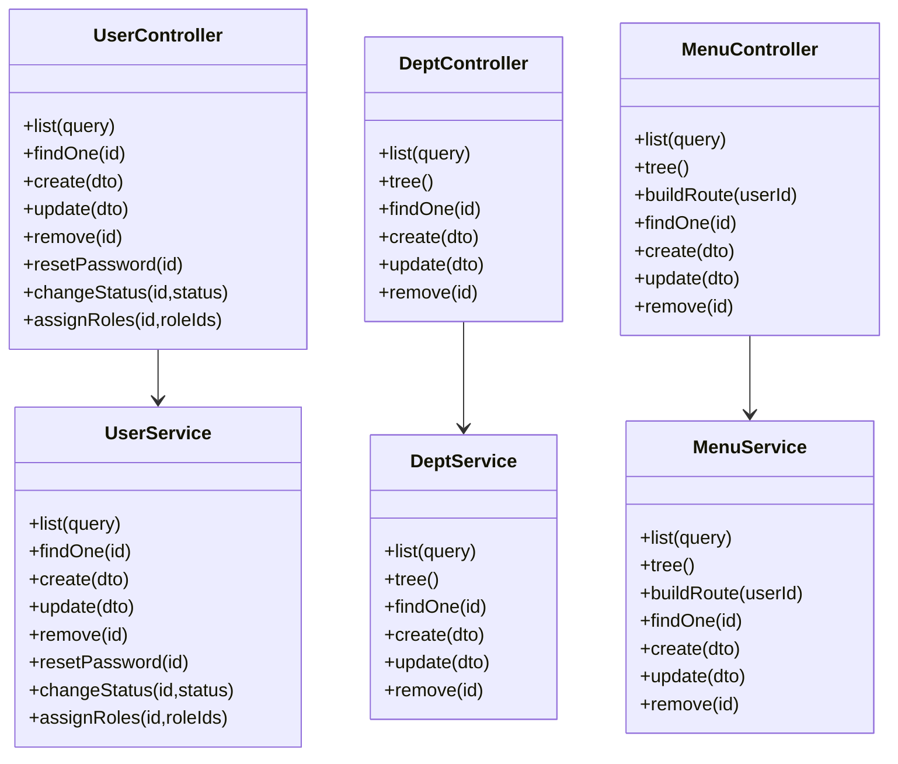

# 系统管理接口

<cite>
**本文档引用的文件**
- [apps/backend/src/modules/system/user/user.controller.ts](file://apps/backend/src/modules/system/user/user.controller.ts)
- [apps/backend/src/modules/system/user/user.service.ts](file://apps/backend/src/modules/system/user/user.service.ts)
- [apps/backend/src/modules/system/user/dto/user.dto.ts](file://apps/backend/src/modules/system/user/dto/user.dto.ts)
- [apps/backend/src/modules/system/role/role.controller.ts](file://apps/backend/src/modules/system/role/role.controller.ts)
- [apps/backend/src/modules/system/role/role.service.ts](file://apps/backend/src/modules/system/role/role.service.ts)
- [apps/backend/src/modules/system/role/dto/role.dto.ts](file://apps/backend/src/modules/system/role/dto/role.dto.ts)
- [apps/backend/src/modules/system/dept/dept.controller.ts](file://apps/backend/src/modules/system/dept/dept.controller.ts)
- [apps/backend/src/modules/system/dept/dept.service.ts](file://apps/backend/src/modules/system/dept/dept.service.ts)
- [apps/backend/src/modules/system/dept/dto/dept.dto.ts](file://apps/backend/src/modules/system/dept/dto/dept.dto.ts)
- [apps/backend/src/modules/system/menu/menu.controller.ts](file://apps/backend/src/modules/system/menu/menu.controller.ts)
- [apps/backend/src/modules/system/menu/menu.service.ts](file://apps/backend/src/modules/system/menu/menu.service.ts)
- [apps/backend/src/modules/system/menu/dto/menu.dto.ts](file://apps/backend/src/modules/system/menu/dto/menu.dto.ts)
- [apps/backend/src/modules/system/dict/dict.controller.ts](file://apps/backend/src/modules/system/dict/dict.controller.ts)
- [apps/backend/src/modules/system/dict/dto/dict.dto.ts](file://apps/backend/src/modules/system/dict/dto/dict.dto.ts)
- [apps/backend/src/modules/system/config/config.controller.ts](file://apps/backend/src/modules/system/config/config.controller.ts)
- [apps/backend/src/modules/system/config/dto/config.dto.ts](file://apps/backend/src/modules/system/config/dto/config.dto.ts)
- [apps/backend/src/modules/system/notice/notice.controller.ts](file://apps/backend/src/modules/system/notice/notice.controller.ts)
- [apps/backend/src/modules/system/notice/dto/notice.dto.ts](file://apps/backend/src/modules/system/notice/dto/notice.dto.ts)
</cite>

## 目录
1. [简介](#简介)
2. [项目结构](#项目结构)
3. [核心组件](#核心组件)
4. [架构总览](#架构总览)
5. [详细组件分析](#详细组件分析)
6. [依赖关系分析](#依赖关系分析)
7. [性能考虑](#性能考虑)
8. [故障排除指南](#故障排除指南)
9. [结论](#结论)

## 简介
本文件为 Nest-Admin-Pro 项目的系统管理模块提供完整的 API 文档，覆盖用户管理、角色管理、部门管理、菜单管理、字典管理、参数配置、通知公告等实体的 CRUD 接口与扩展能力。每个接口均遵循 RESTful 规范，支持分页查询、条件筛选、排序规则、批量删除、重置密码、状态变更、权限分配等常见运维场景。

## 项目结构
系统管理模块采用按功能域划分的目录组织方式，控制器负责路由与鉴权，服务层封装业务逻辑，DTO 定义请求参数与校验规则，配合 Prisma 进行数据库访问，Redis 用于缓存（如配置刷新）。

**图表来源**
- [apps/backend/src/modules/system/user/user.controller.ts:20-88](file://apps/backend/src/modules/system/user/user.controller.ts#L20-L88)
- [apps/backend/src/modules/system/role/role.controller.ts:11-79](file://apps/backend/src/modules/system/role/role.controller.ts#L11-L79)
- [apps/backend/src/modules/system/dept/dept.controller.ts:11-59](file://apps/backend/src/modules/system/dept/dept.controller.ts#L11-L59)
- [apps/backend/src/modules/system/menu/menu.controller.ts:11-66](file://apps/backend/src/modules/system/menu/menu.controller.ts#L11-L66)
- [apps/backend/src/modules/system/dict/dict.controller.ts:8-80](file://apps/backend/src/modules/system/dict/dict.controller.ts#L8-L80)
- [apps/backend/src/modules/system/config/config.controller.ts:8-62](file://apps/backend/src/modules/system/config/config.controller.ts#L8-L62)
- [apps/backend/src/modules/system/notice/notice.controller.ts:8-49](file://apps/backend/src/modules/system/notice/notice.controller.ts#L8-L49)

**章节来源**
- [apps/backend/src/modules/system/user/user.controller.ts:20-88](file://apps/backend/src/modules/system/user/user.controller.ts#L20-L88)
- [apps/backend/src/modules/system/role/role.controller.ts:11-79](file://apps/backend/src/modules/system/role/role.controller.ts#L11-L79)
- [apps/backend/src/modules/system/dept/dept.controller.ts:11-59](file://apps/backend/src/modules/system/dept/dept.controller.ts#L11-L59)
- [apps/backend/src/modules/system/menu/menu.controller.ts:11-66](file://apps/backend/src/modules/system/menu/menu.controller.ts#L11-L66)
- [apps/backend/src/modules/system/dict/dict.controller.ts:8-80](file://apps/backend/src/modules/system/dict/dict.controller.ts#L8-L80)
- [apps/backend/src/modules/system/config/config.controller.ts:8-62](file://apps/backend/src/modules/system/config/config.controller.ts#L8-L62)
- [apps/backend/src/modules/system/notice/notice.controller.ts:8-49](file://apps/backend/src/modules/system/notice/notice.controller.ts#L8-L49)

## 核心组件
- 控制器层：统一使用 JWT 鉴权与权限守卫，结合 Swagger 注解标注接口用途与权限点。
- 服务层：封装查询、创建、更新、删除、树形构建、状态变更、权限分配等业务逻辑。
- DTO 层：通过 class-validator 与 class-transformer 提供参数校验与类型转换。
- 数据访问：基于 PrismaService 访问数据库；部分场景使用 RedisService（如配置缓存刷新）。

**章节来源**
- [apps/backend/src/modules/system/user/user.controller.ts:14-22](file://apps/backend/src/modules/system/user/user.controller.ts#L14-L22)
- [apps/backend/src/modules/system/role/role.controller.ts:8-13](file://apps/backend/src/modules/system/role/role.controller.ts#L8-L13)
- [apps/backend/src/modules/system/dept/dept.controller.ts:8-13](file://apps/backend/src/modules/system/dept/dept.controller.ts#L8-L13)
- [apps/backend/src/modules/system/menu/menu.controller.ts:8-13](file://apps/backend/src/modules/system/menu/menu.controller.ts#L8-L13)
- [apps/backend/src/modules/system/dict/dict.controller.ts:6-10](file://apps/backend/src/modules/system/dict/dict.controller.ts#L6-L10)
- [apps/backend/src/modules/system/config/config.controller.ts:6-10](file://apps/backend/src/modules/system/config/config.controller.ts#L6-L10)
- [apps/backend/src/modules/system/notice/notice.controller.ts:6-10](file://apps/backend/src/modules/system/notice/notice.controller.ts#L6-L10)

## 架构总览
系统管理模块遵循典型的三层架构：控制器接收请求并进行鉴权与参数解析，服务层执行业务逻辑并调用数据访问层，最终返回标准化响应。权限控制通过 RequirePermission 装饰器与权限字符串绑定，确保最小授权原则。

**图表来源**
- [apps/backend/src/modules/system/user/user.controller.ts:17-22](file://apps/backend/src/modules/system/user/user.controller.ts#L17-L22)
- [apps/backend/src/modules/system/role/role.controller.ts:8-9](file://apps/backend/src/modules/system/role/role.controller.ts#L8-L9)
- [apps/backend/src/modules/system/dept/dept.controller.ts:8-9](file://apps/backend/src/modules/system/dept/dept.controller.ts#L8-L9)
- [apps/backend/src/modules/system/menu/menu.controller.ts:8-9](file://apps/backend/src/modules/system/menu/menu.controller.ts#L8-L9)
- [apps/backend/src/modules/system/dict/dict.controller.ts:6-7](file://apps/backend/src/modules/system/dict/dict.controller.ts#L6-L7)
- [apps/backend/src/modules/system/config/config.controller.ts:6-7](file://apps/backend/src/modules/system/config/config.controller.ts#L6-L7)
- [apps/backend/src/modules/system/notice/notice.controller.ts:6-7](file://apps/backend/src/modules/system/notice/notice.controller.ts#L6-L7)

## 详细组件分析

### 用户管理接口
- 基础路径：/api/system/user
- 权限点：system:user:list、system:user:add、system:user:edit、system:user:remove、system:user:resetPwd

接口规范
- GET /list
  - 查询参数：username、nickname、status、deptId、page、limit
  - 返回：分页列表（total + items），其中 items 包含用户基本信息与角色简要信息
- GET /:id
  - 路径参数：id（整数）
  - 返回：单个用户详情（不包含密码）
- POST /
  - 请求体：CreateUserDto
  - 返回：创建成功标识
- PUT /
  - 请求体：UpdateUserDto
  - 返回：更新成功标识
- DELETE /:id
  - 路径参数：id（整数）
  - 返回：删除成功标识
- PUT /reset-password/:id
  - 路径参数：id（整数）
  - 返回：新密码明文（仅首次）
- PUT /change-status/:id
  - 路径参数：id（整数），body 中包含 status
  - 返回：状态变更结果
- PUT /assign-roles/:id
  - 路径参数：id（整数），body 中包含 roleIds 数组
  - 返回：角色分配结果

请求参数与校验
- CreateUserDto 字段：username、password、nickname、email、phone、status、remark、deptId、postIds[]
- UpdateUserDto 字段：id 必填，其余可选；password 可选（更新时加密）
- QueryUserDto 字段：username、nickname、status、deptId、page（≥1）、limit（≥1）

业务逻辑要点
- 列表查询支持多条件模糊匹配与分页排序
- 创建用户前检查用户名唯一性并进行密码哈希
- 更新用户时可选择性更新密码
- 删除用户采用软删除标记
- 分配角色通过关联表更新实现

**图表来源**
- [apps/backend/src/modules/system/user/user.controller.ts:62-67](file://apps/backend/src/modules/system/user/user.controller.ts#L62-L67)
- [apps/backend/src/modules/system/user/user.service.ts:117-125](file://apps/backend/src/modules/system/user/user.service.ts#L117-L125)

**章节来源**
- [apps/backend/src/modules/system/user/user.controller.ts:26-87](file://apps/backend/src/modules/system/user/user.controller.ts#L26-L87)
- [apps/backend/src/modules/system/user/user.service.ts:18-143](file://apps/backend/src/modules/system/user/user.service.ts#L18-L143)
- [apps/backend/src/modules/system/user/dto/user.dto.ts:5-131](file://apps/backend/src/modules/system/user/dto/user.dto.ts#L5-L131)

### 角色管理接口
- 基础路径：/api/system/role
- 权限点：system:role:list、system:role:add、system:role:edit、system:role:remove

接口规范
- GET /list
  - 查询参数：name、code、status、page、limit
  - 返回：分页列表
- GET /:id
  - 路径参数：id（整数）
  - 返回：单个角色详情
- POST /
  - 请求体：CreateRoleDto
  - 返回：创建结果
- PUT /
  - 请求体：UpdateRoleDto
  - 返回：更新结果
- DELETE /:id
  - 路径参数：id（整数）
  - 返回：删除结果
- PUT /change-status/:id
  - 路径参数：id（整数），body 中包含 status
  - 返回：状态变更结果
- PUT /assign-permissions/:id
  - 路径参数：id（整数），body 中包含 menuIds[]、deptIds[]
  - 返回：权限分配结果
- GET /menu/:id
  - 路径参数：id（整数）
  - 返回：该角色已授权的菜单与部门 ID 列表

请求参数与校验
- CreateRoleDto：name、code、dataScope
- UpdateRoleDto：id 必填，其余可选（name、dataScope、status）
- QueryRoleDto：name、code、status、page（≥1）、limit（≥1）
- AssignPermDto：menuIds[]、deptIds[]（可选）

业务逻辑要点
- 角色编码唯一性校验
- 权限分配存储为 JSON 字符串
- 获取角色菜单时进行 JSON 解析

**图表来源**
- [apps/backend/src/modules/system/role/role.controller.ts:56-64](file://apps/backend/src/modules/system/role/role.controller.ts#L56-L64)
- [apps/backend/src/modules/system/role/role.service.ts:64-72](file://apps/backend/src/modules/system/role/role.service.ts#L64-L72)

**章节来源**
- [apps/backend/src/modules/system/role/role.controller.ts:17-78](file://apps/backend/src/modules/system/role/role.controller.ts#L17-L78)
- [apps/backend/src/modules/system/role/role.service.ts:11-79](file://apps/backend/src/modules/system/role/role.service.ts#L11-L79)
- [apps/backend/src/modules/system/role/dto/role.dto.ts:5-38](file://apps/backend/src/modules/system/role/dto/role.dto.ts#L5-L38)

### 部门管理接口
- 基础路径：/api/system/dept
- 权限点：system:dept:list、system:dept:add、system:dept:edit、system:dept:remove

接口规范
- GET /list
  - 查询参数：name、status
  - 返回：部门树形结构（按 sort+id 排序）
- GET /tree
  - 返回：可用状态的部门树（status=1）
- GET /:id
  - 路径参数：id（整数）
  - 返回：单个部门详情
- POST /
  - 请求体：CreateDeptDto
  - 返回：创建结果
- PUT /
  - 请求体：UpdateDeptDto
  - 返回：更新结果
- DELETE /:id
  - 路径参数：id（整数）
  - 返回：删除结果

请求参数与校验
- CreateDeptDto：name、parentId、sort、status、leaderId
- UpdateDeptDto：id 必填，其余可选
- QueryDeptDto：name、status

业务逻辑要点
- 树形结构通过递归构建，根节点为 parentId=0 或无父节点者
- 删除部门前检查是否存在子部门，避免级联删除

**图表来源**
- [apps/backend/src/modules/system/dept/dept.service.ts:66-71](file://apps/backend/src/modules/system/dept/dept.service.ts#L66-L71)

**章节来源**
- [apps/backend/src/modules/system/dept/dept.controller.ts:17-58](file://apps/backend/src/modules/system/dept/dept.controller.ts#L17-L58)
- [apps/backend/src/modules/system/dept/dept.service.ts:9-72](file://apps/backend/src/modules/system/dept/dept.service.ts#L9-L72)
- [apps/backend/src/modules/system/dept/dto/dept.dto.ts:5-27](file://apps/backend/src/modules/system/dept/dto/dept.dto.ts#L5-L27)

### 菜单管理接口
- 基础路径：/api/system/menu
- 权限点：system:menu:list、system:menu:add、system:menu:edit、system:menu:remove

接口规范
- GET /list
  - 查询参数：name、type、status
  - 返回：菜单树形结构（按 sort+id 排序）
- GET /tree
  - 返回：可用状态的菜单树（status=1）
- GET /build-route?userId=...
  - 查询参数：userId（整数）
  - 返回：当前用户可访问的菜单树（过滤类型≤2）
- GET /:id
  - 路径参数：id（整数）
  - 返回：单个菜单详情
- POST /
  - 请求体：CreateMenuDto
  - 返回：创建结果
- PUT /
  - 请求体：UpdateMenuDto
  - 返回：更新结果
- DELETE /:id
  - 路径参数：id（整数）
  - 返回：删除结果

请求参数与校验
- CreateMenuDto：name、type、parentId、path、component、icon、sort、perms、status、external、keepAlive、show
- UpdateMenuDto：id 必填，其余可选
- QueryMenuDto：name、type、status

业务逻辑要点
- 菜单树构建与部门类似，支持外链、缓存、显示控制等字段
- 构建用户路由时聚合角色授权的菜单 ID 并过滤类型

**图表来源**
- [apps/backend/src/modules/system/menu/menu.controller.ts:31-36](file://apps/backend/src/modules/system/menu/menu.controller.ts#L31-L36)
- [apps/backend/src/modules/system/menu/menu.service.ts:34-55](file://apps/backend/src/modules/system/menu/menu.service.ts#L34-L55)

**章节来源**
- [apps/backend/src/modules/system/menu/menu.controller.ts:17-65](file://apps/backend/src/modules/system/menu/menu.controller.ts#L17-L65)
- [apps/backend/src/modules/system/menu/menu.service.ts:9-94](file://apps/backend/src/modules/system/menu/menu.service.ts#L9-L94)
- [apps/backend/src/modules/system/menu/dto/menu.dto.ts:5-41](file://apps/backend/src/modules/system/menu/dto/menu.dto.ts#L5-L41)

### 字典管理接口
- 基础路径：/api/system/dict
- 权限点：system:dict:list、system:dict:add、system:dict:edit、system:dict:remove

字典类型（Type）
- GET /type/list
  - 查询参数：name、code、status
  - 返回：分页列表
- GET /type/:id
  - 路径参数：id（整数）
  - 返回：单个字典类型
- POST /type
  - 请求体：CreateDictTypeDto
  - 返回：创建结果
- PUT /type
  - 请求体：UpdateDictTypeDto
  - 返回：更新结果
- DELETE /type/:id
  - 路径参数：id（整数）
  - 返回：删除结果

字典数据（Data）
- GET /data/list?dictTypeId=...
  - 查询参数：dictTypeId（整数）
  - 返回：该类型的字典数据列表
- POST /data
  - 请求体：CreateDictDataDto
  - 返回：创建结果
- PUT /data
  - 请求体：UpdateDictDataDto
  - 返回：更新结果
- DELETE /data/:id
  - 路径参数：id（整数）
  - 返回：删除结果

请求参数与校验
- CreateDictTypeDto：name、code、status、remark
- UpdateDictTypeDto：id 必填，其余可选
- QueryDictTypeDto：name、code、status
- CreateDictDataDto：dictTypeId（必填）、label、value、sort、status、remark
- UpdateDictDataDto：id 必填，其余可选

业务逻辑要点
- 字典类型与数据分离管理，数据通过 dictTypeId 关联
- 支持按类型查询数据列表

**章节来源**
- [apps/backend/src/modules/system/dict/dict.controller.ts:14-79](file://apps/backend/src/modules/system/dict/dict.controller.ts#L14-L79)
- [apps/backend/src/modules/system/dict/dto/dict.dto.ts:5-42](file://apps/backend/src/modules/system/dict/dto/dict.dto.ts#L5-L42)

### 参数配置接口
- 基础路径：/api/system/config
- 权限点：system:config:list、system:config:add、system:config:edit、system:config:remove

接口规范
- GET /list
  - 查询参数：name、key、status
  - 返回：分页列表
- GET /key/:key
  - 路径参数：key（字符串）
  - 返回：指定键值的配置项
- GET /:id
  - 路径参数：id（整数）
  - 返回：单个配置详情
- POST /
  - 请求体：CreateConfigDto
  - 返回：创建结果
- PUT /
  - 请求体：UpdateConfigDto
  - 返回：更新结果
- DELETE /:id
  - 路径参数：id（整数）
  - 返回：删除结果
- PUT /refresh
  - 返回：刷新配置缓存结果

请求参数与校验
- CreateConfigDto：name、key、value、type、remark、status
- UpdateConfigDto：id 必填，其余可选
- QueryConfigDto：name、key、status

业务逻辑要点
- 支持按 key 快速查询
- 提供缓存刷新接口（结合 RedisService 实现）

**章节来源**
- [apps/backend/src/modules/system/config/config.controller.ts:14-61](file://apps/backend/src/modules/system/config/config.controller.ts#L14-L61)
- [apps/backend/src/modules/system/config/dto/config.dto.ts:5-28](file://apps/backend/src/modules/system/config/dto/config.dto.ts#L5-L28)

### 通知公告接口
- 基础路径：/api/system/notice
- 权限点：system:notice:list、system:notice:add、system:notice:edit、system:notice:remove

接口规范
- GET /list
  - 查询参数：title、type、status、page（≥1）、limit（≥1）
  - 返回：分页列表
- GET /:id
  - 路径参数：id（整数）
  - 返回：单个公告详情
- POST /
  - 请求体：CreateNoticeDto
  - 返回：创建结果
- PUT /
  - 请求体：UpdateNoticeDto
  - 返回：更新结果
- DELETE /:id
  - 路径参数：id（整数）
  - 返回：删除结果

请求参数与校验
- CreateNoticeDto：title、content、type、status、publishTime
- UpdateNoticeDto：id 必填，其余可选
- QueryNoticeDto：title、type、status、page（≥1）、limit（≥1）

业务逻辑要点
- 支持标题、类型、状态筛选与分页
- 发布时间可选，便于定时发布

**章节来源**
- [apps/backend/src/modules/system/notice/notice.controller.ts:14-48](file://apps/backend/src/modules/system/notice/notice.controller.ts#L14-L48)
- [apps/backend/src/modules/system/notice/dto/notice.dto.ts:5-29](file://apps/backend/src/modules/system/notice/dto/notice.dto.ts#L5-L29)

## 依赖关系分析
- 控制器依赖对应服务，服务依赖 PrismaService 进行数据访问。
- 部门与菜单服务在内部实现树形结构构建，减少控制器复杂度。
- 权限控制通过 RequirePermission 与权限字符串耦合，便于统一管理。

**图表来源**
- [apps/backend/src/modules/system/user/user.controller.ts:23-24](file://apps/backend/src/modules/system/user/user.controller.ts#L23-L24)
- [apps/backend/src/modules/system/user/user.service.ts:12-16](file://apps/backend/src/modules/system/user/user.service.ts#L12-L16)
- [apps/backend/src/modules/system/dept/dept.controller.ts:14-15](file://apps/backend/src/modules/system/dept/dept.controller.ts#L14-L15)
- [apps/backend/src/modules/system/dept/dept.service.ts:6-7](file://apps/backend/src/modules/system/dept/dept.service.ts#L6-L7)
- [apps/backend/src/modules/system/menu/menu.controller.ts:14-15](file://apps/backend/src/modules/system/menu/menu.controller.ts#L14-L15)
- [apps/backend/src/modules/system/menu/menu.service.ts:6-7](file://apps/backend/src/modules/system/menu/menu.service.ts#L6-L7)

**章节来源**
- [apps/backend/src/modules/system/user/user.controller.ts:23-24](file://apps/backend/src/modules/system/user/user.controller.ts#L23-L24)
- [apps/backend/src/modules/system/user/user.service.ts:12-16](file://apps/backend/src/modules/system/user/user.service.ts#L12-L16)
- [apps/backend/src/modules/system/dept/dept.controller.ts:14-15](file://apps/backend/src/modules/system/dept/dept.controller.ts#L14-L15)
- [apps/backend/src/modules/system/dept/dept.service.ts:6-7](file://apps/backend/src/modules/system/dept/dept.service.ts#L6-L7)
- [apps/backend/src/modules/system/menu/menu.controller.ts:14-15](file://apps/backend/src/modules/system/menu/menu.controller.ts#L14-L15)
- [apps/backend/src/modules/system/menu/menu.service.ts:6-7](file://apps/backend/src/modules/system/menu/menu.service.ts#L6-L7)

## 性能考虑
- 分页查询：默认每页大小与最小页码限制由 DTO 校验保证，建议前端传入合理 limit。
- 复合查询：where 条件按需拼装，避免全表扫描；树形构建为 O(n) 递归，建议控制层级深度。
- 密码处理：创建/更新时进行哈希计算，注意 CPU 开销；可结合安全策略调整迭代次数。
- 缓存：配置类接口提供缓存刷新能力，建议在批量更新后触发刷新以降低读取延迟。

## 故障排除指南
- 401 未授权：确认 JWT 令牌有效且未过期。
- 403 权限不足：检查当前用户是否具备对应 RequirePermission 权限字符串。
- 404 资源不存在：确认 ID 是否正确或已被软删除。
- 400 参数错误：检查 DTO 校验规则，如整数范围、字符串长度、必填字段等。
- 业务异常：如“角色编码已存在”、“部门存在子节点不可删除”等，根据提示修正后再试。

**章节来源**
- [apps/backend/src/modules/system/user/user.service.ts:57-61](file://apps/backend/src/modules/system/user/user.service.ts#L57-L61)
- [apps/backend/src/modules/system/dept/dept.service.ts:66-70](file://apps/backend/src/modules/system/dept/dept.service.ts#L66-L70)
- [apps/backend/src/modules/system/menu/menu.service.ts:88-93](file://apps/backend/src/modules/system/menu/menu.service.ts#L88-L93)

## 结论
系统管理模块提供了完善的系统运维能力，涵盖用户、角色、部门、菜单、字典、配置与公告等核心实体的 CRUD 与扩展功能。通过统一的鉴权与权限控制、清晰的分层架构以及严谨的参数校验，能够满足企业级后台管理系统的稳定运行需求。建议在生产环境中结合缓存策略与监控告警进一步提升性能与可观测性。