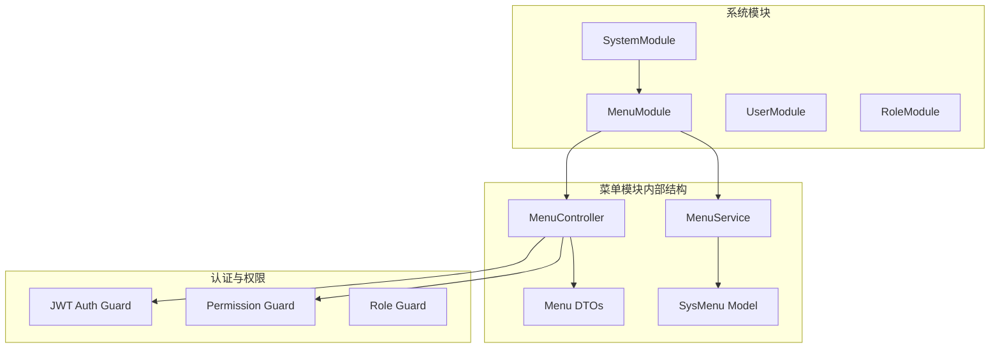
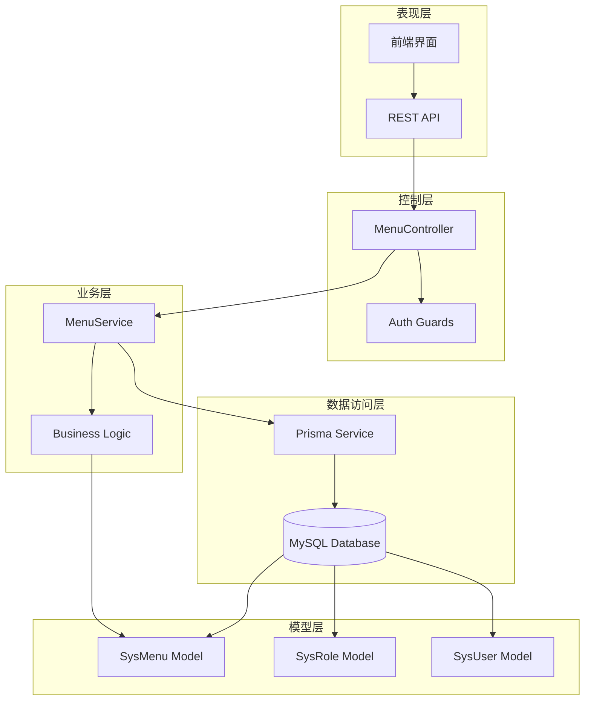
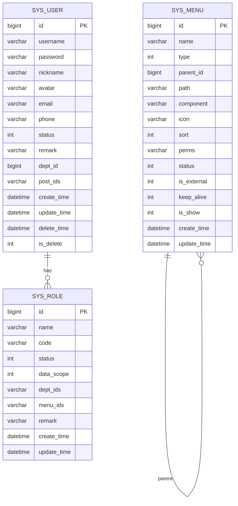
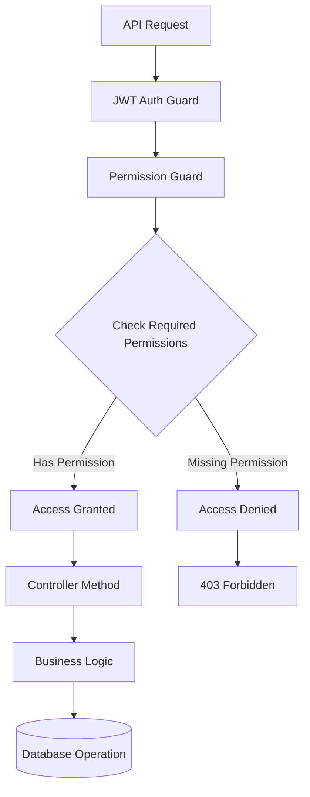
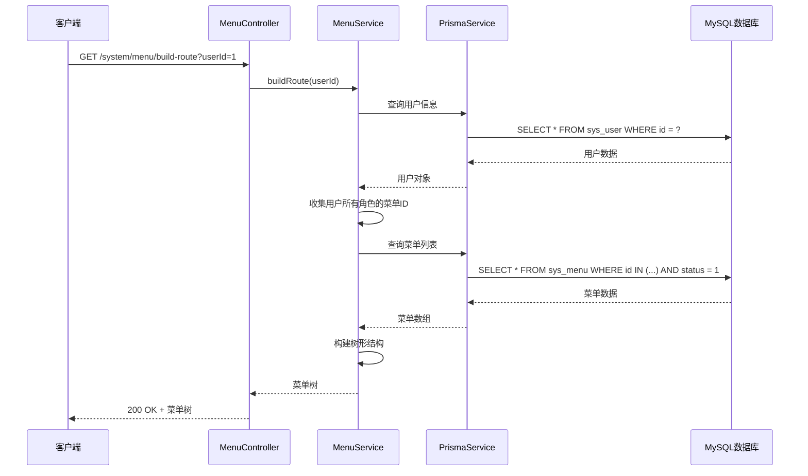
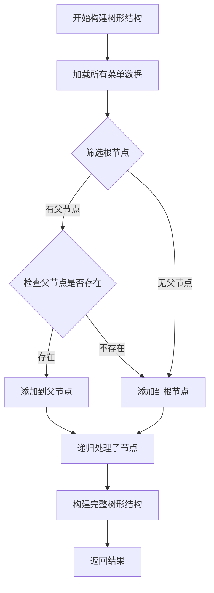
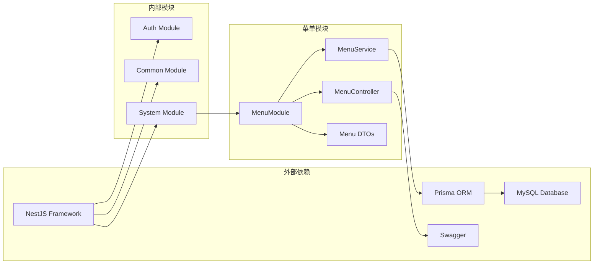

# 菜单管理接口

<cite>
**本文档引用的文件**
- [apps/backend/src/modules/system/menu/menu.controller.ts](file://apps/backend/src/modules/system/menu/menu.controller.ts)
- [apps/backend/src/modules/system/menu/menu.service.ts](file://apps/backend/src/modules/system/menu/menu.service.ts)
- [apps/backend/src/modules/system/menu/dto/menu.dto.ts](file://apps/backend/src/modules/system/menu/dto/menu.dto.ts)
- [apps/backend/src/modules/system/menu/menu.module.ts](file://apps/backend/src/modules/system/menu/menu.module.ts)
- [apps/backend/src/auth/guards.ts](file://apps/backend/src/auth/guards.ts)
- [apps/backend/src/auth/jwt.guard.ts](file://apps/backend/src/auth/jwt.guard.ts)
- [apps/backend/prisma/schema.prisma](file://apps/backend/prisma/schema.prisma)
- [apps/vben-admin/apps/web-antd/src/api/system/menu.ts](file://apps/vben-admin/apps/web-antd/src/api/system/menu.ts)
- [apps/vben-admin/packages/effects/common-ui/src/components/icon-picker/icons.ts](file://apps/vben-admin/packages/effects/common-ui/src/components/icon-picker/icons.ts)
- [apps/vben-admin/packages/effects/common-ui/src/components/icon-picker/icon-picker.vue](file://apps/vben-admin/packages/effects/common-ui/src/components/icon-picker/icon-picker.vue)
- [apps/backend/src/modules/system/system.module.ts](file://apps/backend/src/modules/system/system.module.ts)
</cite>

## 目录
1. [简介](#简介)
2. [项目结构](#项目结构)
3. [核心组件](#核心组件)
4. [架构概览](#架构概览)
5. [详细组件分析](#详细组件分析)
6. [依赖关系分析](#依赖关系分析)
7. [性能考虑](#性能考虑)
8. [故障排除指南](#故障排除指南)
9. [结论](#结论)

## 简介

菜单管理模块是Nest-Admin-Pro后台管理系统的核心功能模块之一，负责系统的菜单CRUD操作和动态路由生成。该模块提供了完整的菜单管理API接口，支持树形菜单结构、动态路由构建、权限控制等功能。

本模块基于NestJS框架开发，采用TypeScript编写，使用Prisma作为ORM工具进行数据库操作。系统通过JWT认证和权限守卫确保接口的安全性，支持细粒度的权限控制。

## 项目结构

菜单管理模块在项目中的组织结构如下：



**图表来源**
- [apps/backend/src/modules/system/system.module.ts:11-22](file://apps/backend/src/modules/system/system.module.ts#L11-L22)
- [apps/backend/src/modules/system/menu/menu.module.ts:5-9](file://apps/backend/src/modules/system/menu/menu.module.ts#L5-L9)

**章节来源**
- [apps/backend/src/modules/system/system.module.ts:1-23](file://apps/backend/src/modules/system/system.module.ts#L1-L23)
- [apps/backend/src/modules/system/menu/menu.module.ts:1-10](file://apps/backend/src/modules/system/menu/menu.module.ts#L1-L10)

## 核心组件

### MenuController 控制器

MenuController是菜单管理模块的主要入口点，负责处理所有菜单相关的HTTP请求。该控制器实现了完整的CRUD操作，并集成了权限控制和认证机制。

主要特性：
- 基于RESTful设计的API端点
- 集成JWT认证和权限验证
- 支持多种菜单查询模式
- 提供动态路由构建功能

**章节来源**
- [apps/backend/src/modules/system/menu/menu.controller.ts:14-66](file://apps/backend/src/modules/system/menu/menu.controller.ts#L14-L66)

### MenuService 服务层

MenuService负责处理业务逻辑，包括菜单数据的查询、创建、更新和删除操作。该服务使用Prisma ORM与数据库交互，并实现了菜单树形结构的构建算法。

核心功能：
- 菜单列表查询和过滤
- 菜单树形结构构建
- 动态路由生成
- 菜单权限验证

**章节来源**
- [apps/backend/src/modules/system/menu/menu.service.ts:6-94](file://apps/backend/src/modules/system/menu/menu.service.ts#L6-L94)

### DTO 数据传输对象

模块定义了三个核心DTO类来处理数据验证和传输：

1. **CreateMenuDto**: 用于菜单创建的数据传输对象
2. **UpdateMenuDto**: 用于菜单更新的数据传输对象  
3. **QueryMenuDto**: 用于菜单查询条件的数据传输对象

这些DTO类使用class-validator进行数据验证，并通过Swagger注解提供API文档信息。

**章节来源**
- [apps/backend/src/modules/system/menu/dto/menu.dto.ts:5-40](file://apps/backend/src/modules/system/menu/dto/menu.dto.ts#L5-L40)

## 架构概览

菜单管理模块采用分层架构设计，确保了良好的代码组织和可维护性：



**图表来源**
- [apps/backend/src/modules/system/menu/menu.controller.ts:1-15](file://apps/backend/src/modules/system/menu/menu.controller.ts#L1-L15)
- [apps/backend/src/modules/system/menu/menu.service.ts:1-8](file://apps/backend/src/modules/system/menu/menu.service.ts#L1-L8)
- [apps/backend/prisma/schema.prisma:92-116](file://apps/backend/prisma/schema.prisma#L92-L116)

## 详细组件分析

### API 接口定义

#### 获取菜单列表
- **方法**: GET
- **路径**: `/api/system/menu/list`
- **权限**: `system:menu:list`
- **描述**: 获取菜单列表，支持按名称、类型、状态进行过滤查询

**请求参数**:
- name: 菜单名称（可选，模糊匹配）
- type: 菜单类型（可选）
- status: 菜单状态（可选）

**响应数据**:
```typescript
{
  id: number,
  name: string,
  type: number,
  parentId: number,
  path?: string,
  component?: string,
  icon?: string,
  sort: number,
  perms?: string,
  status: number,
  external?: number,
  keepAlive?: number,
  show?: number,
  children?: MenuItem[]
}
```

**章节来源**
- [apps/backend/src/modules/system/menu/menu.controller.ts:17-22](file://apps/backend/src/modules/system/menu/menu.controller.ts#L17-L22)
- [apps/backend/src/modules/system/menu/dto/menu.dto.ts:36-40](file://apps/backend/src/modules/system/menu/dto/menu.dto.ts#L36-L40)

#### 获取菜单树形结构
- **方法**: GET  
- **路径**: `/api/system/menu/tree`
- **权限**: `system:menu:list`
- **描述**: 获取完整的菜单树形结构，仅返回状态为启用的菜单项

**响应数据**: 树形结构的菜单数组，支持多层级嵌套

**章节来源**
- [apps/backend/src/modules/system/menu/menu.controller.ts:24-29](file://apps/backend/src/modules/system/menu/menu.controller.ts#L24-L29)

#### 构建用户路由
- **方法**: GET
- **路径**: `/api/system/menu/build-route`
- **权限**: `system:menu:list`  
- **描述**: 为指定用户构建动态路由，基于用户的角色权限生成可访问的菜单树

**查询参数**:
- userId: 用户ID（数字类型）

**响应数据**: 用户可访问的菜单树形结构

**章节来源**
- [apps/backend/src/modules/system/menu/menu.controller.ts:31-36](file://apps/backend/src/modules/system/menu/menu.controller.ts#L31-L36)

#### 获取菜单详情
- **方法**: GET
- **路径**: `/api/system/menu/:id`
- **权限**: `system:menu:list`
- **描述**: 根据ID获取指定菜单的详细信息

**路径参数**:
- id: 菜单ID（整数类型）

**响应数据**: 单个菜单对象的完整信息

**章节来源**
- [apps/backend/src/modules/system/menu/menu.controller.ts:38-43](file://apps/backend/src/modules/system/menu/menu.controller.ts#L38-L43)

#### 创建菜单
- **方法**: POST
- **路径**: `/api/system/menu`
- **权限**: `system:menu:list`
- **描述**: 创建新的菜单项

**请求体**: CreateMenuDto 对象

**响应数据**: 新创建的菜单对象

**章节来源**
- [apps/backend/src/modules/system/menu/menu.controller.ts:45-50](file://apps/backend/src/modules/system/menu/menu.controller.ts#L45-L50)

#### 更新菜单
- **方法**: PUT
- **路径**: `/api/system/menu`
- **权限**: `system:menu:list`
- **描述**: 更新现有的菜单项

**请求体**: UpdateMenuDto 对象

**响应数据**: 更新后的菜单对象

**章节来源**
- [apps/backend/src/modules/system/menu/menu.controller.ts:52-57](file://apps/backend/src/modules/system/menu/menu.controller.ts#L52-L57)

#### 删除菜单
- **方法**: DELETE
- **路径**: `/api/system/menu/:id`
- **权限**: `system:menu:list`
- **描述**: 删除指定的菜单项

**路径参数**:
- id: 菜单ID（整数类型）

**响应数据**: `{ success: true }`

**章节来源**
- [apps/backend/src/modules/system/menu/menu.controller.ts:59-65](file://apps/backend/src/modules/system/menu/menu.controller.ts#L59-L65)

### 数据模型定义

菜单数据模型基于Prisma定义，支持完整的树形结构和权限控制：



**图表来源**
- [apps/backend/prisma/schema.prisma:92-116](file://apps/backend/prisma/schema.prisma#L92-L116)
- [apps/backend/prisma/schema.prisma:40-56](file://apps/backend/prisma/schema.prisma#L40-L56)
- [apps/backend/prisma/schema.prisma:12-38](file://apps/backend/prisma/schema.prisma#L12-L38)

**章节来源**
- [apps/backend/prisma/schema.prisma:92-116](file://apps/backend/prisma/schema.prisma#L92-L116)

### 权限控制机制

系统采用多层权限控制确保接口安全：



**图表来源**
- [apps/backend/src/auth/guards.ts:36-51](file://apps/backend/src/auth/guards.ts#L36-L51)
- [apps/backend/src/auth/jwt.guard.ts:1-5](file://apps/backend/src/auth/jwt.guard.ts#L1-L5)

权限定义：
- `system:menu:list`: 菜单列表查看权限
- `system:menu:add`: 菜单添加权限  
- `system:menu:edit`: 菜单编辑权限
- `system:menu:remove`: 菜单删除权限

**章节来源**
- [apps/backend/src/auth/guards.ts:16-17](file://apps/backend/src/auth/guards.ts#L16-L17)
- [apps/backend/src/modules/system/menu/menu.controller.ts:18-65](file://apps/backend/src/modules/system/menu/menu.controller.ts#L18-L65)

### 动态菜单生成

系统支持根据用户角色动态生成菜单树，实现个性化的界面展示：



**图表来源**
- [apps/backend/src/modules/system/menu/menu.service.ts:34-55](file://apps/backend/src/modules/system/menu/menu.service.ts#L34-L55)

**章节来源**
- [apps/backend/src/modules/system/menu/menu.service.ts:34-55](file://apps/backend/src/modules/system/menu/menu.service.ts#L34-L55)

### 菜单树形结构算法

系统实现了高效的菜单树形结构构建算法：



**图表来源**
- [apps/backend/src/modules/system/menu/menu.service.ts:27-32](file://apps/backend/src/modules/system/menu/menu.service.ts#L27-L32)

**章节来源**
- [apps/backend/src/modules/system/menu/menu.service.ts:27-32](file://apps/backend/src/modules/system/menu/menu.service.ts#L27-L32)

## 依赖关系分析

菜单管理模块的依赖关系图：



**图表来源**
- [apps/backend/src/modules/system/menu/menu.module.ts:5-9](file://apps/backend/src/modules/system/menu/menu.module.ts#L5-L9)
- [apps/backend/src/modules/system/system.module.ts:11-22](file://apps/backend/src/modules/system/system.module.ts#L11-L22)

**章节来源**
- [apps/backend/src/modules/system/menu/menu.module.ts:1-10](file://apps/backend/src/modules/system/menu/menu.module.ts#L1-L10)
- [apps/backend/src/modules/system/system.module.ts:1-23](file://apps/backend/src/modules/system/system.module.ts#L1-L23)

## 性能考虑

### 数据库优化

1. **索引策略**: 菜单表在parentId、sort、perms字段上建立了复合索引，优化查询性能
2. **查询优化**: 使用Prisma的原生查询优化器，避免N+1查询问题
3. **缓存策略**: 建议在应用层实现菜单数据的缓存机制

### API性能优化

1. **批量操作**: 支持批量删除和更新操作，减少网络往返次数
2. **分页查询**: 列表查询支持分页，避免大量数据传输
3. **条件过滤**: 提供多种过滤条件，精确控制查询范围

### 内存管理

1. **树形结构构建**: 使用递归算法构建树形结构，内存复杂度为O(n)
2. **数据验证**: DTO层进行数据验证，避免无效数据进入业务层
3. **错误处理**: 统一的异常处理机制，防止内存泄漏

## 故障排除指南

### 常见问题及解决方案

**1. 权限不足错误 (403 Forbidden)**
- 检查用户是否具有相应的菜单权限
- 确认角色配置中包含正确的权限标识
- 验证JWT令牌的有效性和完整性

**2. 菜单删除失败**
- 确认要删除的菜单是否有子菜单
- 检查是否存在依赖该菜单的其他数据
- 验证菜单状态是否为启用状态

**3. 动态路由生成异常**
- 检查用户角色配置中的menuIds字段
- 确认菜单状态和类型设置正确
- 验证菜单树形结构的完整性

**4. 数据验证错误**
- 检查请求数据格式是否符合DTO定义
- 确认必填字段是否完整
- 验证数据类型和范围限制

**章节来源**
- [apps/backend/src/modules/system/menu/menu.service.ts:88-93](file://apps/backend/src/modules/system/menu/menu.service.ts#L88-L93)
- [apps/backend/src/auth/guards.ts:36-51](file://apps/backend/src/auth/guards.ts#L36-L51)

## 结论

菜单管理模块是Nest-Admin-Pro系统的重要组成部分，提供了完整的菜单CRUD操作和动态路由生成功能。该模块采用现代化的架构设计，结合了JWT认证、权限控制、数据验证等最佳实践，确保了系统的安全性、可维护性和扩展性。

通过树形结构管理和动态路由构建，系统能够灵活地适应不同的业务需求，为用户提供个性化的界面体验。同时，完善的权限控制机制确保了系统的安全性和数据的完整性。

未来可以考虑的改进方向包括：增加菜单版本管理、实现菜单变更审计、优化大数据量下的查询性能、增强菜单模板功能等。