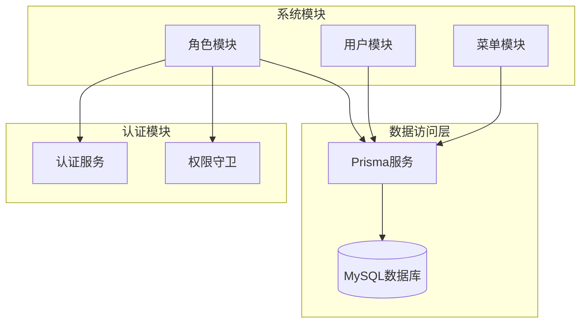
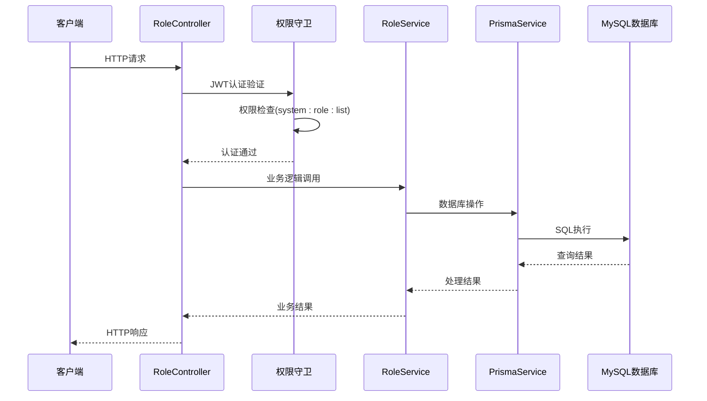
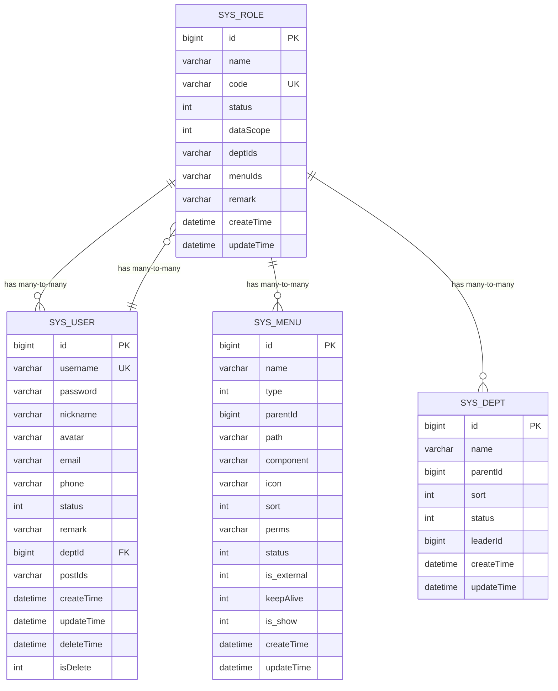
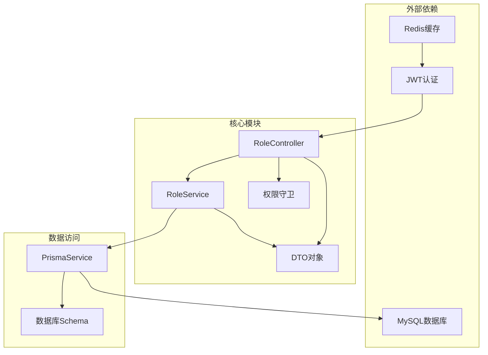
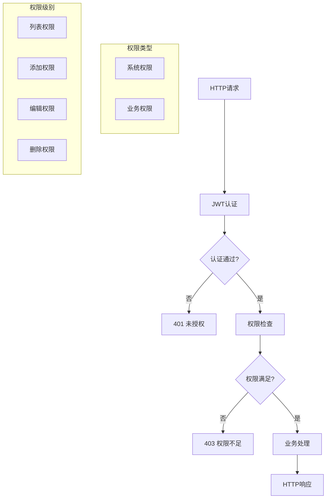

# 角色管理接口

<cite>
**本文引用的文件**
- [apps/backend/src/modules/system/role/role.controller.ts](file://apps/backend/src/modules/system/role/role.controller.ts)
- [apps/backend/src/modules/system/role/role.service.ts](file://apps/backend/src/modules/system/role/role.service.ts)
- [apps/backend/src/modules/system/role/dto/role.dto.ts](file://apps/backend/src/modules/system/role/dto/role.dto.ts)
- [apps/backend/src/auth/guards.ts](file://apps/backend/src/auth/guards.ts)
- [apps/backend/src/common/prisma.service.ts](file://apps/backend/src/common/prisma.service.ts)
- [apps/backend/prisma/schema.prisma](file://apps/backend/prisma/schema.prisma)
- [apps/backend/src/modules/system/user/user.service.ts](file://apps/backend/src/modules/system/user/user.service.ts)
- [apps/backend/src/modules/system/menu/menu.service.ts](file://apps/backend/src/modules/system/menu/menu.service.ts)
- [apps/backend/src/auth/auth.service.ts](file://apps/backend/src/auth/auth.service.ts)
- [docs/api.md](file://docs/api.md)
</cite>

## 目录
1. [简介](#简介)
2. [项目结构](#项目结构)
3. [核心组件](#核心组件)
4. [架构概览](#架构概览)
5. [详细组件分析](#详细组件分析)
6. [依赖关系分析](#依赖关系分析)
7. [性能考虑](#性能考虑)
8. [故障排除指南](#故障排除指南)
9. [结论](#结论)
10. [附录](#附录)

## 简介
本文件为角色管理模块的详细API文档，基于RoleController控制器实现，涵盖角色的完整CRUD操作接口。系统采用JWT认证与权限守卫相结合的安全机制，通过RequirePermission装饰器实现细粒度的权限控制。角色管理支持标准的增删改查操作，同时提供角色状态变更、权限分配、菜单权限配置等高级功能。

## 项目结构
角色管理模块位于后端应用的系统模块中，采用分层架构设计：



**图表来源**
- [apps/backend/src/modules/system/role/role.controller.ts:1-80](file://apps/backend/src/modules/system/role/role.controller.ts#L1-L80)
- [apps/backend/src/auth/guards.ts:1-51](file://apps/backend/src/auth/guards.ts#L1-L51)
- [apps/backend/src/common/prisma.service.ts:1-22](file://apps/backend/src/common/prisma.service.ts#L1-L22)

**章节来源**
- [apps/backend/src/modules/system/role/role.controller.ts:1-80](file://apps/backend/src/modules/system/role/role.controller.ts#L1-L80)
- [apps/backend/src/modules/system/role/role.service.ts:1-80](file://apps/backend/src/modules/system/role/role.service.ts#L1-L80)

## 核心组件
角色管理模块由以下核心组件构成：

### 控制器层
- RoleController：提供RESTful API接口，处理HTTP请求和响应
- 集成JWT认证和权限验证
- 实现标准CRUD操作和高级功能

### 服务层
- RoleService：业务逻辑处理，包括数据验证、查询和持久化
- 数据访问通过Prisma ORM实现
- 提供事务性和一致性保证

### DTO层
- CreateRoleDto：创建角色的数据传输对象
- UpdateRoleDto：更新角色的数据传输对象
- QueryRoleDto：查询角色的条件对象
- AssignPermDto：权限分配的数据传输对象

**章节来源**
- [apps/backend/src/modules/system/role/role.controller.ts:1-80](file://apps/backend/src/modules/system/role/role.controller.ts#L1-L80)
- [apps/backend/src/modules/system/role/role.service.ts:1-80](file://apps/backend/src/modules/system/role/role.service.ts#L1-L80)
- [apps/backend/src/modules/system/role/dto/role.dto.ts:1-38](file://apps/backend/src/modules/system/role/dto/role.dto.ts#L1-L38)

## 架构概览
角色管理系统的整体架构采用分层设计，确保关注点分离和可维护性：



**图表来源**
- [apps/backend/src/modules/system/role/role.controller.ts:17-22](file://apps/backend/src/modules/system/role/role.controller.ts#L17-L22)
- [apps/backend/src/auth/guards.ts:36-51](file://apps/backend/src/auth/guards.ts#L36-L51)
- [apps/backend/src/modules/system/role/role.service.ts:11-28](file://apps/backend/src/modules/system/role/role.service.ts#L11-L28)

## 详细组件分析

### 角色CRUD操作接口

#### 获取角色列表
**接口地址**: `GET /api/system/role/list`  
**权限要求**: `system:role:list`  
**功能描述**: 支持按名称、编码、状态进行条件查询，支持分页功能

**请求参数**:
- name: 角色名称（模糊匹配）
- code: 角色编码（模糊匹配）  
- status: 角色状态（1启用，0禁用）
- page: 页码，默认1
- limit: 每页条数，默认10

**响应数据结构**:
```json
{
  "total": 100,
  "items": [
    {
      "id": 1,
      "name": "超级管理员",
      "code": "SUPER_ADMIN",
      "status": 1,
      "dataScope": 1,
      "remark": "系统超级管理员",
      "createTime": "2024-01-01T00:00:00Z",
      "updateTime": "2024-01-01T00:00:00Z"
    }
  ]
}
```

**章节来源**
- [apps/backend/src/modules/system/role/role.controller.ts:17-22](file://apps/backend/src/modules/system/role/role.controller.ts#L17-L22)
- [apps/backend/src/modules/system/role/role.service.ts:11-28](file://apps/backend/src/modules/system/role/role.service.ts#L11-L28)
- [apps/backend/src/modules/system/role/dto/role.dto.ts:25-31](file://apps/backend/src/modules/system/role/dto/role.dto.ts#L25-L31)

#### 获取角色详情
**接口地址**: `GET /api/system/role/:id`  
**权限要求**: `system:role:list`  
**功能描述**: 根据角色ID获取详细信息

**路径参数**:
- id: 角色唯一标识符（整数）

**响应数据结构**:
```json
{
  "id": 1,
  "name": "超级管理员",
  "code": "SUPER_ADMIN",
  "status": 1,
  "dataScope": 1,
  "deptIds": "[]",
  "menuIds": "[]",
  "remark": "系统超级管理员",
  "createTime": "2024-01-01T00:00:00Z",
  "updateTime": "2024-01-01T00:00:00Z"
}
```

**章节来源**
- [apps/backend/src/modules/system/role/role.controller.ts:73-78](file://apps/backend/src/modules/system/role/role.controller.ts#L73-L78)
- [apps/backend/src/modules/system/role/role.service.ts:30-34](file://apps/backend/src/modules/system/role/role.service.ts#L30-L34)

#### 创建角色
**接口地址**: `POST /api/system/role`  
**权限要求**: `system:role:add`  
**功能描述**: 创建新的角色，支持自定义数据范围

**请求体参数**:
- name: 角色名称（必填）
- code: 角色编码（必填，唯一）
- dataScope: 数据范围（可选，默认1）

**响应数据结构**:
```json
{
  "id": 2,
  "name": "普通管理员",
  "code": "NORMAL_ADMIN",
  "status": 1,
  "dataScope": 1,
  "remark": null,
  "createTime": "2024-01-01T00:00:00Z",
  "updateTime": "2024-01-01T00:00:00Z"
}
```

**章节来源**
- [apps/backend/src/modules/system/role/role.controller.ts:24-29](file://apps/backend/src/modules/system/role/role.controller.ts#L24-L29)
- [apps/backend/src/modules/system/role/role.service.ts:36-42](file://apps/backend/src/modules/system/role/role.service.ts#L36-L42)
- [apps/backend/src/modules/system/role/dto/role.dto.ts:5-14](file://apps/backend/src/modules/system/role/dto/role.dto.ts#L5-L14)

#### 更新角色
**接口地址**: `PUT /api/system/role`  
**权限要求**: `system:role:edit`  
**功能描述**: 更新现有角色信息

**请求体参数**:
- id: 角色ID（必填）
- name: 角色名称（可选）
- dataScope: 数据范围（可选）
- status: 角色状态（可选）

**响应数据结构**:
```json
{
  "id": 1,
  "name": "更新后的角色名称",
  "code": "SUPER_ADMIN",
  "status": 0,
  "dataScope": 2,
  "remark": "系统超级管理员",
  "createTime": "2024-01-01T00:00:00Z",
  "updateTime": "2024-01-01T00:00:00Z"
}
```

**章节来源**
- [apps/backend/src/modules/system/role/role.controller.ts:31-36](file://apps/backend/src/modules/system/role/role.controller.ts#L31-L36)
- [apps/backend/src/modules/system/role/role.service.ts:44-52](file://apps/backend/src/modules/system/role/role.service.ts#L44-L52)
- [apps/backend/src/modules/system/role/dto/role.dto.ts:16-23](file://apps/backend/src/modules/system/role/dto/role.dto.ts#L16-L23)

#### 删除角色
**接口地址**: `DELETE /api/system/role/:id`  
**权限要求**: `system:role:remove`  
**功能描述**: 删除指定角色

**路径参数**:
- id: 角色唯一标识符（整数）

**响应数据结构**:
```json
{
  "success": true
}
```

**章节来源**
- [apps/backend/src/modules/system/role/role.controller.ts:38-44](file://apps/backend/src/modules/system/role/role.controller.ts#L38-L44)
- [apps/backend/src/modules/system/role/role.service.ts:54-57](file://apps/backend/src/modules/system/role/role.service.ts#L54-L57)

#### 角色状态修改
**接口地址**: `PUT /api/system/role/change-status/:id`  
**权限要求**: `system:role:edit`  
**功能描述**: 切换角色启用/禁用状态

**路径参数**:
- id: 角色唯一标识符（整数）

**请求体参数**:
- status: 新的状态值（1启用，0禁用）

**响应数据结构**:
```json
{
  "success": true
}
```

**章节来源**
- [apps/backend/src/modules/system/role/role.controller.ts:46-54](file://apps/backend/src/modules/system/role/role.controller.ts#L46-L54)
- [apps/backend/src/modules/system/role/role.service.ts:59-62](file://apps/backend/src/modules/system/role/role.service.ts#L59-L62)

### 高级功能接口

#### 角色权限分配
**接口地址**: `PUT /api/system/role/assign-permissions/:id`  
**权限要求**: `system:role:edit`  
**功能描述**: 为角色分配菜单权限和部门数据权限

**路径参数**:
- id: 角色唯一标识符（整数）

**请求体参数**:
- menuIds: 菜单权限ID数组（必填）
- deptIds: 部门数据权限ID数组（可选）

**响应数据结构**:
```json
{
  "success": true
}
```

**章节来源**
- [apps/backend/src/modules/system/role/role.controller.ts:56-64](file://apps/backend/src/modules/system/role/role.controller.ts#L56-L64)
- [apps/backend/src/modules/system/role/role.service.ts:64-73](file://apps/backend/src/modules/system/role/role.service.ts#L64-L73)
- [apps/backend/src/modules/system/role/dto/role.dto.ts:33-37](file://apps/backend/src/modules/system/role/dto/role.dto.ts#L33-L37)

#### 获取角色菜单权限
**接口地址**: `GET /api/system/role/menu/:id`  
**权限要求**: `system:role:list`  
**功能描述**: 获取角色已分配的菜单权限

**路径参数**:
- id: 角色唯一标识符（整数）

**响应数据结构**:
```json
{
  "menuIds": ["1", "2", "3"],
  "deptIds": ["100", "101"]
}
```

**章节来源**
- [apps/backend/src/modules/system/role/role.controller.ts:66-71](file://apps/backend/src/modules/system/role/role.controller.ts#L66-L71)
- [apps/backend/src/modules/system/role/role.service.ts:75-79](file://apps/backend/src/modules/system/role/role.service.ts#L75-L79)

### 数据模型关系图



**图表来源**
- [apps/backend/prisma/schema.prisma:40-56](file://apps/backend/prisma/schema.prisma#L40-L56)
- [apps/backend/prisma/schema.prisma:13-38](file://apps/backend/prisma/schema.prisma#L13-L38)
- [apps/backend/prisma/schema.prisma:92-116](file://apps/backend/prisma/schema.prisma#L92-L116)
- [apps/backend/prisma/schema.prisma:58-75](file://apps/backend/prisma/schema.prisma#L58-L75)

## 依赖关系分析

### 组件依赖图



**图表来源**
- [apps/backend/src/modules/system/role/role.controller.ts:1-15](file://apps/backend/src/modules/system/role/role.controller.ts#L1-L15)
- [apps/backend/src/modules/system/role/role.service.ts:1-9](file://apps/backend/src/modules/system/role/role.service.ts#L1-L9)
- [apps/backend/src/common/prisma.service.ts:1-22](file://apps/backend/src/common/prisma.service.ts#L1-L22)

### 权限控制流程



**图表来源**
- [apps/backend/src/auth/guards.ts:36-51](file://apps/backend/src/auth/guards.ts#L36-L51)
- [apps/backend/src/modules/system/role/role.controller.ts:18-54](file://apps/backend/src/modules/system/role/role.controller.ts#L18-L54)

**章节来源**
- [apps/backend/src/auth/guards.ts:1-51](file://apps/backend/src/auth/guards.ts#L1-L51)
- [apps/backend/src/modules/system/role/role.controller.ts:1-80](file://apps/backend/src/modules/system/role/role.controller.ts#L1-L80)

## 性能考虑
角色管理模块在设计时充分考虑了性能优化：

### 查询优化
- 使用分页查询避免大数据量加载
- 条件查询支持索引字段优化
- 批量操作减少数据库往返次数

### 缓存策略
- JWT令牌存储在Redis中实现快速验证
- 在用户认证服务中实现在线用户管理
- 可扩展的缓存机制支持热点数据缓存

### 数据库优化
- 合理的索引设计支持高频查询
- JSON字段存储权限数据便于灵活扩展
- 连接池管理确保数据库连接效率

## 故障排除指南

### 常见错误及解决方案

#### 认证失败
**问题**: 401 未授权错误  
**原因**: JWT令牌无效或过期  
**解决方案**: 
- 重新登录获取新令牌
- 检查令牌格式是否正确
- 验证服务器时间同步

#### 权限不足
**问题**: 403 权限不足错误  
**原因**: 当前用户缺少必要的系统权限  
**解决方案**:
- 确认用户角色包含所需权限
- 检查权限字符串格式
- 验证权限分配是否正确

#### 数据重复
**问题**: 400 请求参数错误  
**原因**: 角色编码重复或必填字段缺失  
**解决方案**:
- 更换唯一的角色编码
- 检查所有必填字段
- 验证数据类型和格式

#### 资源不存在
**问题**: 404 资源不存在  
**原因**: 角色ID无效或已被删除  
**解决方案**:
- 验证角色ID的有效性
- 检查角色是否存在
- 确认数据库连接正常

**章节来源**
- [apps/backend/src/modules/system/role/role.service.ts:36-42](file://apps/backend/src/modules/system/role/role.service.ts#L36-L42)
- [apps/backend/src/modules/system/role/role.service.ts:44-52](file://apps/backend/src/modules/system/role/role.service.ts#L44-L52)
- [apps/backend/src/auth/guards.ts:36-51](file://apps/backend/src/auth/guards.ts#L36-L51)

## 结论
角色管理模块提供了完整的角色生命周期管理功能，具备良好的安全性、可扩展性和性能表现。通过JWT认证和权限守卫的双重保障，确保了系统的安全访问控制。模块化的架构设计便于维护和功能扩展，为后续的功能增强奠定了坚实基础。

## 附录

### API使用示例

#### 获取角色列表
```bash
curl -X GET "http://localhost:3000/api/system/role/list?page=1&limit=10&status=1" \
  -H "Authorization: Bearer YOUR_JWT_TOKEN"
```

#### 创建角色
```bash
curl -X POST "http://localhost:3000/api/system/role" \
  -H "Authorization: Bearer YOUR_JWT_TOKEN" \
  -H "Content-Type: application/json" \
  -d '{
    "name": "测试角色",
    "code": "TEST_ROLE",
    "dataScope": 1
  }'
```

#### 分配权限
```bash
curl -X PUT "http://localhost:3000/api/system/role/assign-permissions/1" \
  -H "Authorization: Bearer YOUR_JWT_TOKEN" \
  -H "Content-Type: application/json" \
  -d '{
    "menuIds": ["1", "2", "3"],
    "deptIds": ["100", "101"]
  }'
```

### 状态码定义
- 200: 请求成功
- 400: 请求参数错误
- 401: 未授权/Token过期
- 403: 权限不足
- 404: 资源不存在
- 500: 服务器内部错误

### 权限清单
- system:role:list: 角色列表查看权限
- system:role:add: 角色添加权限
- system:role:edit: 角色编辑权限
- system:role:remove: 角色删除权限

**章节来源**
- [docs/api.md:247-256](file://docs/api.md#L247-L256)
- [apps/backend/src/modules/system/role/role.controller.ts:18-54](file://apps/backend/src/modules/system/role/role.controller.ts#L18-L54)