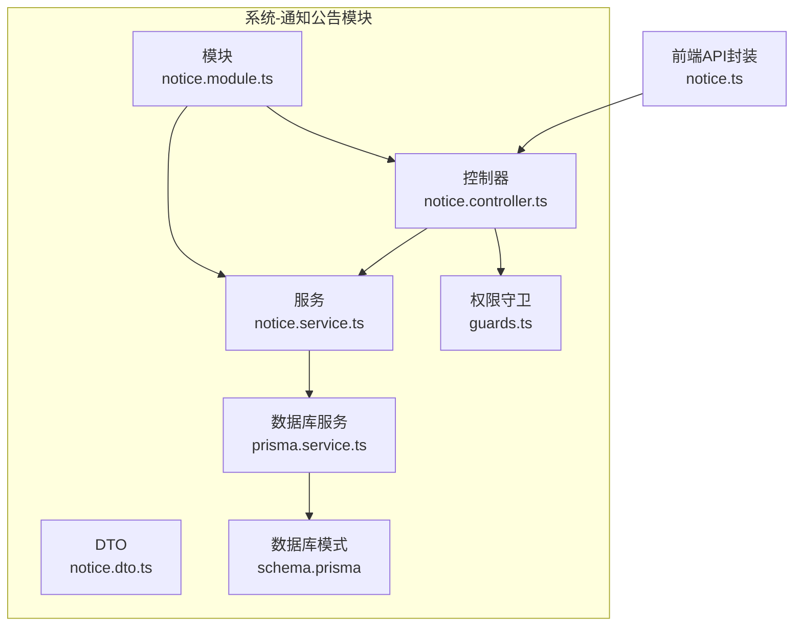
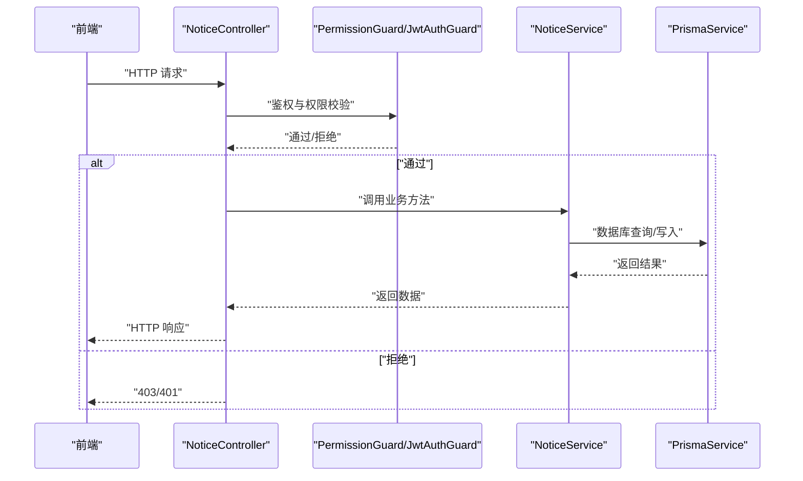
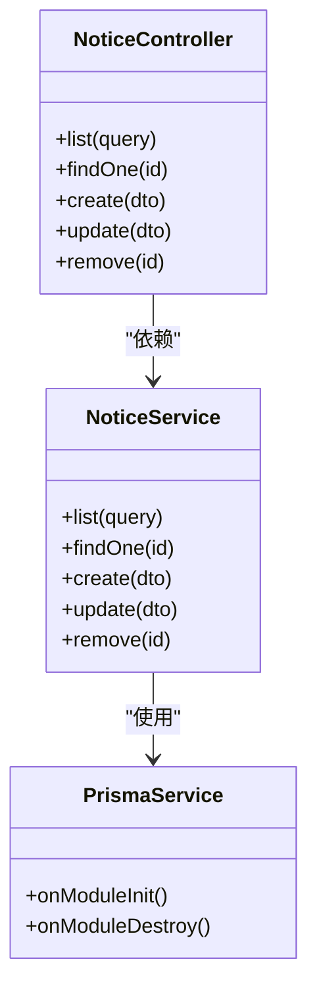

# 通知公告接口

<cite>
**本文引用的文件**
- [apps/backend/src/modules/system/notice/notice.controller.ts](file://apps/backend/src/modules/system/notice/notice.controller.ts)
- [apps/backend/src/modules/system/notice/notice.service.ts](file://apps/backend/src/modules/system/notice/notice.service.ts)
- [apps/backend/src/modules/system/notice/dto/notice.dto.ts](file://apps/backend/src/modules/system/notice/dto/notice.dto.ts)
- [apps/backend/src/modules/system/notice/notice.module.ts](file://apps/backend/src/modules/system/notice/notice.module.ts)
- [apps/backend/src/auth/guards.ts](file://apps/backend/src/auth/guards.ts)
- [apps/backend/src/common/prisma.service.ts](file://apps/backend/src/common/prisma.service.ts)
- [apps/backend/prisma/schema.prisma](file://apps/backend/prisma/schema.prisma)
- [apps/vben-admin/apps/web-antd/src/api/system/notice.ts](file://apps/vben-admin/apps/web-antd/src/api/system/notice.ts)
</cite>

## 目录
1. [简介](#简介)
2. [项目结构](#项目结构)
3. [核心组件](#核心组件)
4. [架构总览](#架构总览)
5. [详细组件分析](#详细组件分析)
6. [依赖关系分析](#依赖关系分析)
7. [性能考虑](#性能考虑)
8. [故障排查指南](#故障排查指南)
9. [结论](#结论)
10. [附录](#附录)

## 简介
本文件为通知公告模块的详细API文档，围绕后端控制器 NoticeController 提供的接口进行说明。当前已实现的接口包括：获取通知公告列表、获取通知公告详情、创建通知公告、更新通知公告、删除通知公告。同时，文档补充了权限控制、状态码定义、请求与响应结构、以及与前端交互的示例。

注意：根据当前代码仓库，以下接口尚未在后端实现：
- 通知公告状态修改（PUT /api/system/notice/change-status/:id）
- 通知公告发布（PUT /api/system/notice/publish/:id）
- 通知公告撤回（PUT /api/system/notice/withdraw/:id）
- 通知公告批量删除（DELETE /api/system/notice/batch-remove）

这些接口在前端存在调用定义，但后端控制器与服务层尚未实现对应方法。本文将明确标注“未实现”字段，并给出建议的实现路径。

## 项目结构
通知公告模块位于后端 NestJS 应用的 system 子模块下，采用标准的分层结构：DTO 参数校验、Service 业务逻辑、Controller 控制器、Module 模块装配。

图表来源
- [apps/backend/src/modules/system/notice/notice.controller.ts:1-50](file://apps/backend/src/modules/system/notice/notice.controller.ts#L1-L50)
- [apps/backend/src/modules/system/notice/notice.service.ts:1-44](file://apps/backend/src/modules/system/notice/notice.service.ts#L1-L44)
- [apps/backend/src/modules/system/notice/dto/notice.dto.ts:1-29](file://apps/backend/src/modules/system/notice/dto/notice.dto.ts#L1-L29)
- [apps/backend/src/modules/system/notice/notice.module.ts:1-10](file://apps/backend/src/modules/system/notice/notice.module.ts#L1-L10)
- [apps/backend/src/auth/guards.ts:1-51](file://apps/backend/src/auth/guards.ts#L1-L51)
- [apps/backend/src/common/prisma.service.ts:1-22](file://apps/backend/src/common/prisma.service.ts#L1-L22)
- [apps/backend/prisma/schema.prisma:167-180](file://apps/backend/prisma/schema.prisma#L167-L180)
- [apps/vben-admin/apps/web-antd/src/api/system/notice.ts:1-40](file://apps/vben-admin/apps/web-antd/src/api/system/notice.ts#L1-L40)

章节来源
- [apps/backend/src/modules/system/notice/notice.controller.ts:1-50](file://apps/backend/src/modules/system/notice/notice.controller.ts#L1-L50)
- [apps/backend/src/modules/system/notice/notice.service.ts:1-44](file://apps/backend/src/modules/system/notice/notice.service.ts#L1-L44)
- [apps/backend/src/modules/system/notice/dto/notice.dto.ts:1-29](file://apps/backend/src/modules/system/notice/dto/notice.dto.ts#L1-L29)
- [apps/backend/src/modules/system/notice/notice.module.ts:1-10](file://apps/backend/src/modules/system/notice/notice.module.ts#L1-L10)
- [apps/backend/src/auth/guards.ts:1-51](file://apps/backend/src/auth/guards.ts#L1-L51)
- [apps/backend/src/common/prisma.service.ts:1-22](file://apps/backend/src/common/prisma.service.ts#L1-L22)
- [apps/backend/prisma/schema.prisma:167-180](file://apps/backend/prisma/schema.prisma#L167-L180)
- [apps/vben-admin/apps/web-antd/src/api/system/notice.ts:1-40](file://apps/vben-admin/apps/web-antd/src/api/system/notice.ts#L1-L40)

## 核心组件
- 控制器：负责路由映射、参数解析、权限校验与响应包装。
- 服务：封装数据访问与业务处理，使用 Prisma 进行数据库操作。
- DTO：对请求参数进行类型约束与校验。
- 权限守卫：统一鉴权与授权控制。
- 数据库模式：SysNotice 表结构定义。

章节来源
- [apps/backend/src/modules/system/notice/notice.controller.ts:1-50](file://apps/backend/src/modules/system/notice/notice.controller.ts#L1-L50)
- [apps/backend/src/modules/system/notice/notice.service.ts:1-44](file://apps/backend/src/modules/system/notice/notice.service.ts#L1-L44)
- [apps/backend/src/modules/system/notice/dto/notice.dto.ts:1-29](file://apps/backend/src/modules/system/notice/dto/notice.dto.ts#L1-L29)
- [apps/backend/src/auth/guards.ts:1-51](file://apps/backend/src/auth/guards.ts#L1-L51)
- [apps/backend/prisma/schema.prisma:167-180](file://apps/backend/prisma/schema.prisma#L167-L180)

## 架构总览
通知公告模块遵循典型的 NestJS 分层架构，控制器通过权限守卫拦截请求，随后委派给服务层执行业务逻辑，服务层通过 Prisma 访问数据库。前端通过统一的 API 封装发起请求。

图表来源
- [apps/backend/src/modules/system/notice/notice.controller.ts:1-50](file://apps/backend/src/modules/system/notice/notice.controller.ts#L1-L50)
- [apps/backend/src/auth/guards.ts:36-51](file://apps/backend/src/auth/guards.ts#L36-L51)
- [apps/backend/src/modules/system/notice/notice.service.ts:1-44](file://apps/backend/src/modules/system/notice/notice.service.ts#L1-L44)
- [apps/backend/src/common/prisma.service.ts:1-22](file://apps/backend/src/common/prisma.service.ts#L1-L22)

## 详细组件分析

### 接口清单与说明
- 获取通知公告列表
  - 方法与路径：GET /api/system/notice/list
  - 权限：system:notice:list
  - 功能：支持按标题、类型、状态筛选，分页查询
  - 响应：包含 total 与 items 的分页结果
  - 未实现：无
- 获取通知公告详情
  - 方法与路径：GET /api/system/notice/:id
  - 权限：system:notice:list
  - 功能：按主键查询
  - 响应：单条通知记录
  - 未实现：无
- 创建通知公告
  - 方法与路径：POST /api/system/notice
  - 权限：system:notice:add
  - 功能：新增通知
  - 响应：新创建的通知对象
  - 未实现：无
- 更新通知公告
  - 方法与路径：PUT /api/system/notice
  - 权限：system:notice:edit
  - 功能：按 id 更新通知
  - 响应：更新后的通知对象
  - 未实现：无
- 删除通知公告
  - 方法与路径：DELETE /api/system/notice/:id
  - 权限：system:notice:remove
  - 功能：按 id 删除
  - 响应：成功标志
  - 未实现：无
- 通知公告状态修改（未实现）
  - 方法与路径：PUT /api/system/notice/change-status/:id
  - 权限：system:notice:edit
  - 功能：修改通知状态字段
  - 响应：更新后的通知对象
  - 未实现：后端控制器与服务未实现该方法
- 通知公告发布（未实现）
  - 方法与路径：PUT /api/system/notice/publish/:id
  - 权限：system:notice:edit
  - 功能：设置发布状态与发布时间
  - 响应：更新后的通知对象
  - 未实现：后端控制器与服务未实现该方法
- 通知公告撤回（未实现）
  - 方法与路径：PUT /api/system/notice/withdraw/:id
  - 权限：system:notice:edit
  - 功能：取消发布状态
  - 响应：更新后的通知对象
  - 未实现：后端控制器与服务未实现该方法
- 通知公告批量删除（未实现）
  - 方法与路径：DELETE /api/system/notice/batch-remove
  - 权限：system:notice:remove
  - 功能：批量删除通知
  - 响应：批量删除结果
  - 未实现：后端控制器与服务未实现该方法

章节来源
- [apps/backend/src/modules/system/notice/notice.controller.ts:14-48](file://apps/backend/src/modules/system/notice/notice.controller.ts#L14-L48)
- [apps/backend/src/auth/guards.ts:16-17](file://apps/backend/src/auth/guards.ts#L16-L17)

### 请求参数与响应结构

- CreateNoticeDto（创建）
  - 字段
    - title：字符串，必填
    - content：字符串，必填
    - type：整数，可选，默认值由服务层设定
    - status：整数，可选，默认值由服务层设定
    - publishTime：日期时间字符串，可选
  - 校验规则：参见 DTO 文件
  - 参考路径
    - [apps/backend/src/modules/system/notice/dto/notice.dto.ts:5-11](file://apps/backend/src/modules/system/notice/dto/notice.dto.ts#L5-L11)

- UpdateNoticeDto（更新）
  - 字段
    - id：整数，必填
    - title/content/type/status/publishTime：均为可选
  - 校验规则：参见 DTO 文件
  - 参考路径
    - [apps/backend/src/modules/system/notice/dto/notice.dto.ts:13-20](file://apps/backend/src/modules/system/notice/dto/notice.dto.ts#L13-L20)

- QueryNoticeDto（查询）
  - 字段
    - title：字符串，可选
    - type：整数，可选
    - status：整数，可选
    - page：整数，最小值1，可选，默认1
    - limit：整数，最小值1，可选，默认10
  - 校验规则：参见 DTO 文件
  - 参考路径
    - [apps/backend/src/modules/system/notice/dto/notice.dto.ts:22-28](file://apps/backend/src/modules/system/notice/dto/notice.dto.ts#L22-L28)

- 响应结构
  - 列表响应：包含 total 与 items
  - 单条响应：SysNotice 对象
  - 删除响应：成功标志
  - 参考路径
    - [apps/backend/src/modules/system/notice/service.ts:9-20](file://apps/backend/src/modules/system/notice/notice.service.ts#L9-L20)
    - [apps/backend/prisma/schema.prisma:167-180](file://apps/backend/prisma/schema.prisma#L167-L180)

章节来源
- [apps/backend/src/modules/system/notice/dto/notice.dto.ts:1-29](file://apps/backend/src/modules/system/notice/dto/notice.dto.ts#L1-L29)
- [apps/backend/src/modules/system/notice/notice.service.ts:9-20](file://apps/backend/src/modules/system/notice/notice.service.ts#L9-L20)
- [apps/backend/prisma/schema.prisma:167-180](file://apps/backend/prisma/schema.prisma#L167-L180)

### 权限控制
- 全局守卫：JwtAuthGuard（JWT 鉴权）+ PermissionGuard（权限校验）
- 控制器级权限注解：RequirePermission(...)
- 权限标识
  - system:notice:list
  - system:notice:add
  - system:notice:edit
  - system:notice:remove
- 参考路径
  - [apps/backend/src/modules/system/notice/notice.controller.ts:10-11](file://apps/backend/src/modules/system/notice/notice.controller.ts#L10-L11)
  - [apps/backend/src/auth/guards.ts:16-17](file://apps/backend/src/auth/guards.ts#L16-L17)

章节来源
- [apps/backend/src/modules/system/notice/notice.controller.ts:10-11](file://apps/backend/src/modules/system/notice/notice.controller.ts#L10-L11)
- [apps/backend/src/auth/guards.ts:16-17](file://apps/backend/src/auth/guards.ts#L16-L17)

### 数据模型与数据库
- SysNotice 表字段
  - id、title、content、type、status、publishTime、createTime、updateTime
- 索引
  - type、status
- 参考路径
  - [apps/backend/prisma/schema.prisma:167-180](file://apps/backend/prisma/schema.prisma#L167-L180)

章节来源
- [apps/backend/prisma/schema.prisma:167-180](file://apps/backend/prisma/schema.prisma#L167-L180)

### 前端对接
- 前端 API 封装导出的方法与路径
  - 列表：/system/notice/list
  - 详情：/system/notice/:id
  - 新增：/system/notice
  - 更新：/system/notice
  - 删除：/system/notice/:id
- 参考路径
  - [apps/vben-admin/apps/web-antd/src/api/system/notice.ts:21-39](file://apps/vben-admin/apps/web-antd/src/api/system/notice.ts#L21-L39)

章节来源
- [apps/vben-admin/apps/web-antd/src/api/system/notice.ts:1-40](file://apps/vben-admin/apps/web-antd/src/api/system/notice.ts#L1-L40)

### 未实现接口的建议实现路径
- change-status
  - 控制器：添加 PUT /system/notice/change-status/:id，接收 id 并调用服务层方法
  - 服务层：实现 changeStatus(id, status)，更新状态字段
  - DTO：可复用 UpdateNoticeDto 或新增 StatusChangeDto
- publish/withdraw
  - 控制器：添加 PUT /system/notice/publish/:id 与 /system/notice/withdraw/:id
  - 服务层：实现 publish(id) 与 withdraw(id)，分别设置 publishTime 与清除
- batch-remove
  - 控制器：添加 DELETE /system/notice/batch-remove，接收 id 数组
  - 服务层：实现批量删除逻辑

章节来源
- [apps/backend/src/modules/system/notice/notice.controller.ts:14-48](file://apps/backend/src/modules/system/notice/notice.controller.ts#L14-L48)
- [apps/backend/src/modules/system/notice/notice.service.ts:28-43](file://apps/backend/src/modules/system/notice/notice.service.ts#L28-L43)

## 依赖关系分析
- 控制器依赖服务层与守卫
- 服务层依赖 PrismaService
- PrismaService 依赖 Prisma Client 与数据库连接
- 模块负责装配控制器与服务

图表来源
- [apps/backend/src/modules/system/notice/notice.controller.ts:1-50](file://apps/backend/src/modules/system/notice/notice.controller.ts#L1-L50)
- [apps/backend/src/modules/system/notice/notice.service.ts:1-44](file://apps/backend/src/modules/system/notice/notice.service.ts#L1-L44)
- [apps/backend/src/common/prisma.service.ts:1-22](file://apps/backend/src/common/prisma.service.ts#L1-L22)

章节来源
- [apps/backend/src/modules/system/notice/notice.controller.ts:1-50](file://apps/backend/src/modules/system/notice/notice.controller.ts#L1-L50)
- [apps/backend/src/modules/system/notice/notice.service.ts:1-44](file://apps/backend/src/modules/system/notice/notice.service.ts#L1-L44)
- [apps/backend/src/common/prisma.service.ts:1-22](file://apps/backend/src/common/prisma.service.ts#L1-L22)

## 性能考虑
- 查询优化
  - 使用索引字段（type、status）进行过滤
  - 分页查询避免一次性加载大量数据
- 并发与事务
  - 批量删除建议使用事务，确保一致性
- 缓存策略
  - 对热点通知内容可考虑缓存，降低数据库压力
- 前端分页
  - 合理设置 page 与 limit，避免过大的页大小

## 故障排查指南
- 401 未认证
  - 检查 JWT 是否有效、是否过期
- 403 权限不足
  - 检查用户权限集合是否包含 system:notice:* 相关标识
- 404 通知不存在
  - 确认 id 是否正确；服务层在查询不到时会抛出异常
- 500 服务器错误
  - 检查数据库连接与 Prisma 日志
- 参考路径
  - [apps/backend/src/auth/guards.ts:36-51](file://apps/backend/src/auth/guards.ts#L36-L51)
  - [apps/backend/src/modules/system/notice/notice.service.ts:22-26](file://apps/backend/src/modules/system/notice/notice.service.ts#L22-L26)
  - [apps/backend/src/common/prisma.service.ts:14-21](file://apps/backend/src/common/prisma.service.ts#L14-L21)

章节来源
- [apps/backend/src/auth/guards.ts:36-51](file://apps/backend/src/auth/guards.ts#L36-L51)
- [apps/backend/src/modules/system/notice/notice.service.ts:22-26](file://apps/backend/src/modules/system/notice/notice.service.ts#L22-L26)
- [apps/backend/src/common/prisma.service.ts:14-21](file://apps/backend/src/common/prisma.service.ts#L14-L21)

## 结论
通知公告模块已实现基础 CRUD 能力与权限控制，满足日常的增删改查需求。对于高级功能（状态变更、发布/撤回、批量删除），当前后端尚未实现，前端已存在调用入口。建议尽快补齐后端控制器与服务层方法，完善权限标识与参数校验，确保接口的一致性与安全性。

## 附录

### API 定义与示例

- 获取通知公告列表
  - 请求
    - 方法：GET
    - 路径：/api/system/notice/list
    - 查询参数：title、type、status、page、limit
  - 响应
    - 结构：{ total: number, items: SysNotice[] }
  - 示例
    - GET /api/system/notice/list?page=1&limit=10&type=1&status=1
  - 参考路径
    - [apps/backend/src/modules/system/notice/notice.controller.ts:14-19](file://apps/backend/src/modules/system/notice/notice.controller.ts#L14-L19)
    - [apps/backend/src/modules/system/notice/notice.service.ts:9-20](file://apps/backend/src/modules/system/notice/notice.service.ts#L9-L20)

- 获取通知公告详情
  - 请求
    - 方法：GET
    - 路径：/api/system/notice/:id
  - 响应
    - 结构：SysNotice
  - 示例
    - GET /api/system/notice/1
  - 参考路径
    - [apps/backend/src/modules/system/notice/notice.controller.ts:21-26](file://apps/backend/src/modules/system/notice/notice.controller.ts#L21-L26)
    - [apps/backend/src/modules/system/notice/notice.service.ts:22-26](file://apps/backend/src/modules/system/notice/notice.service.ts#L22-L26)

- 创建通知公告
  - 请求
    - 方法：POST
    - 路径：/api/system/notice
    - 请求体：CreateNoticeDto
  - 响应
    - 结构：SysNotice
  - 示例
    - POST /api/system/notice { "title": "...", "content": "...", "type": 1, "status": 1 }
  - 参考路径
    - [apps/backend/src/modules/system/notice/notice.controller.ts:28-33](file://apps/backend/src/modules/system/notice/notice.controller.ts#L28-L33)
    - [apps/backend/src/modules/system/notice/notice.service.ts:28-32](file://apps/backend/src/modules/system/notice/notice.service.ts#L28-L32)

- 更新通知公告
  - 请求
    - 方法：PUT
    - 路径：/api/system/notice
    - 请求体：UpdateNoticeDto
  - 响应
    - 结构：SysNotice
  - 示例
    - PUT /api/system/notice { "id": 1, "title": "..." }
  - 参考路径
    - [apps/backend/src/modules/system/notice/notice.controller.ts:35-40](file://apps/backend/src/modules/system/notice/notice.controller.ts#L35-L40)
    - [apps/backend/src/modules/system/notice/notice.service.ts:34-38](file://apps/backend/src/modules/system/notice/notice.service.ts#L34-L38)

- 删除通知公告
  - 请求
    - 方法：DELETE
    - 路径：/api/system/notice/:id
  - 响应
    - 结构：{ success: true }
  - 示例
    - DELETE /api/system/notice/1
  - 参考路径
    - [apps/backend/src/modules/system/notice/notice.controller.ts:42-48](file://apps/backend/src/modules/system/notice/notice.controller.ts#L42-L48)
    - [apps/backend/src/modules/system/notice/notice.service.ts:40-43](file://apps/backend/src/modules/system/notice/notice.service.ts#L40-L43)

- 通知公告状态修改（未实现）
  - 请求
    - 方法：PUT
    - 路径：/api/system/notice/change-status/:id
    - 请求体：{ status: number }
  - 响应
    - 结构：SysNotice
  - 示例
    - PUT /api/system/notice/change-status/1 { "status": 2 }
  - 实现建议
    - 在控制器添加路由与参数校验，在服务层实现 changeStatus 方法
  - 参考路径
    - [apps/backend/src/modules/system/notice/notice.controller.ts:14-48](file://apps/backend/src/modules/system/notice/notice.controller.ts#L14-L48)
    - [apps/backend/src/modules/system/notice/notice.service.ts:28-43](file://apps/backend/src/modules/system/notice/notice.service.ts#L28-L43)

- 通知公告发布（未实现）
  - 请求
    - 方法：PUT
    - 路径：/api/system/notice/publish/:id
  - 响应
    - 结构：SysNotice
  - 示例
    - PUT /api/system/notice/publish/1
  - 实现建议
    - 设置 publishTime 为当前时间或指定时间
  - 参考路径
    - [apps/backend/src/modules/system/notice/notice.controller.ts:14-48](file://apps/backend/src/modules/system/notice/notice.controller.ts#L14-L48)
    - [apps/backend/src/modules/system/notice/notice.service.ts:28-43](file://apps/backend/src/modules/system/notice/notice.service.ts#L28-L43)

- 通知公告撤回（未实现）
  - 请求
    - 方法：PUT
    - 路径：/api/system/notice/withdraw/:id
  - 响应
    - 结构：SysNotice
  - 示例
    - PUT /api/system/notice/withdraw/1
  - 实现建议
    - 清除 publishTime 或设置为 null
  - 参考路径
    - [apps/backend/src/modules/system/notice/notice.controller.ts:14-48](file://apps/backend/src/modules/system/notice/notice.controller.ts#L14-L48)
    - [apps/backend/src/modules/system/notice/notice.service.ts:28-43](file://apps/backend/src/modules/system/notice/notice.service.ts#L28-L43)

- 通知公告批量删除（未实现）
  - 请求
    - 方法：DELETE
    - 路径：/api/system/notice/batch-remove
    - 请求体：{ ids: number[] }
  - 响应
    - 结构：批量删除结果
  - 示例
    - DELETE /api/system/notice/batch-remove { "ids": [1,2,3] }
  - 实现建议
    - 在服务层实现批量删除逻辑，使用事务保证一致性
  - 参考路径
    - [apps/backend/src/modules/system/notice/notice.controller.ts:14-48](file://apps/backend/src/modules/system/notice/notice.controller.ts#L14-L48)
    - [apps/backend/src/modules/system/notice/notice.service.ts:28-43](file://apps/backend/src/modules/system/notice/notice.service.ts#L28-L43)

### 权限标识对照
- system:notice:list：查看列表与详情
- system:notice:add：新增
- system:notice:edit：编辑、状态修改、发布/撤回
- system:notice:remove：删除、批量删除

章节来源
- [apps/backend/src/modules/system/notice/notice.controller.ts:14-48](file://apps/backend/src/modules/system/notice/notice.controller.ts#L14-L48)
- [apps/backend/src/auth/guards.ts:16-17](file://apps/backend/src/auth/guards.ts#L16-L17)