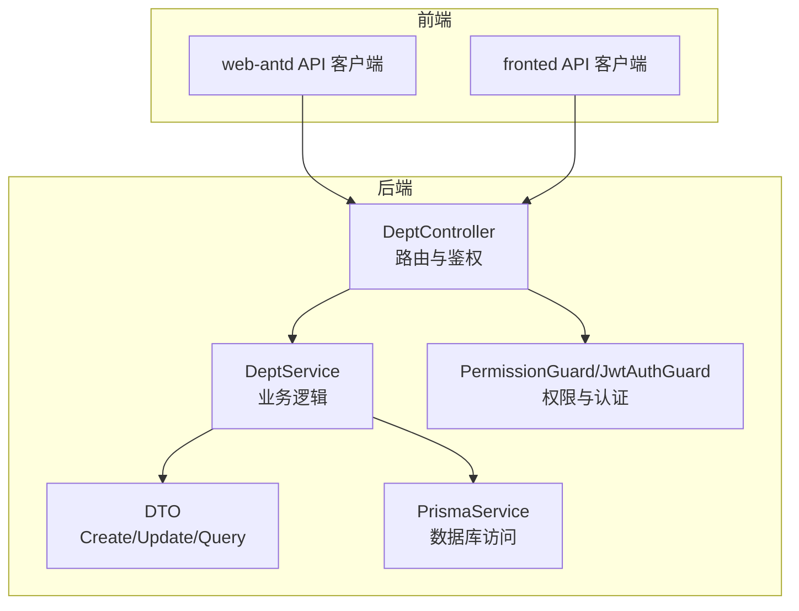
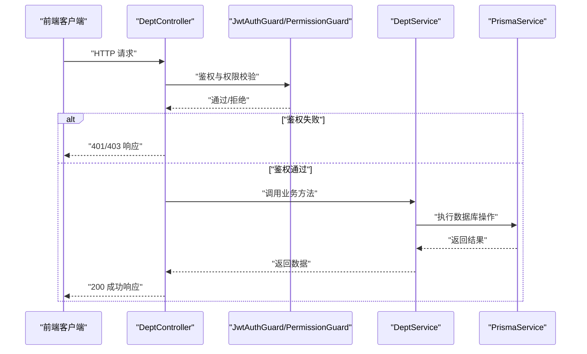
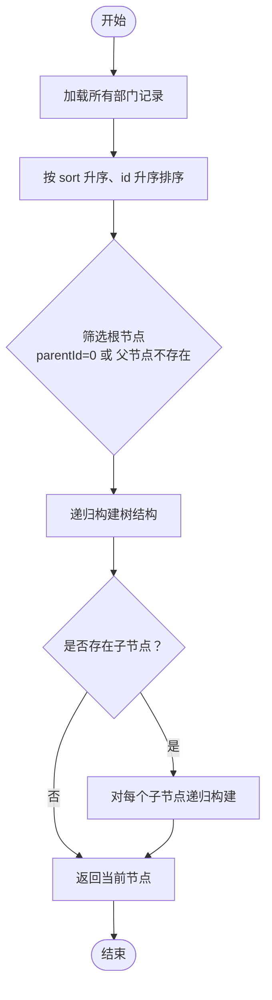
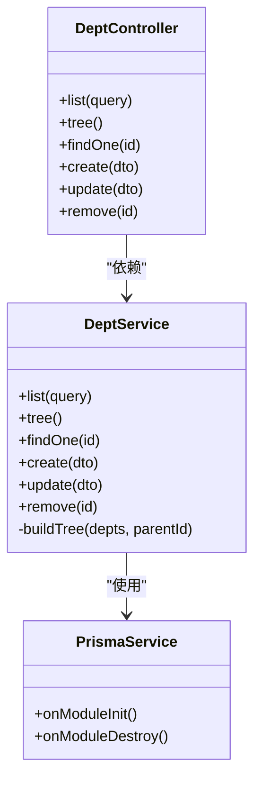

# 部门管理接口

<cite>
**本文引用的文件**
- [apps/backend/src/modules/system/dept/dept.controller.ts](file://apps/backend/src/modules/system/dept/dept.controller.ts)
- [apps/backend/src/modules/system/dept/dept.service.ts](file://apps/backend/src/modules/system/dept/dept.service.ts)
- [apps/backend/src/modules/system/dept/dto/dept.dto.ts](file://apps/backend/src/modules/system/dept/dto/dept.dto.ts)
- [apps/backend/src/common/api-response.ts](file://apps/backend/src/common/api-response.ts)
- [apps/backend/src/common/prisma.service.ts](file://apps/backend/src/common/prisma.service.ts)
- [apps/backend/src/auth/guards.ts](file://apps/backend/src/auth/guards.ts)
- [apps/backend/prisma/schema.prisma](file://apps/backend/prisma/schema.prisma)
- [apps/vben-admin/apps/web-antd/src/api/system/dept.ts](file://apps/vben-admin/apps/web-antd/src/api/system/dept.ts)
- [apps/fronted/src/api/index.ts](file://apps/fronted/src/api/index.ts)
</cite>

## 目录
1. [简介](#简介)
2. [项目结构](#项目结构)
3. [核心组件](#核心组件)
4. [架构总览](#架构总览)
5. [详细组件分析](#详细组件分析)
6. [依赖分析](#依赖分析)
7. [性能考虑](#性能考虑)
8. [故障排除指南](#故障排除指南)
9. [结论](#结论)
10. [附录](#附录)

## 简介
本文件为“部门管理”模块的详细API文档，基于后端控制器与服务层实现，覆盖部门的完整CRUD能力与树形结构查询。文档包含：
- 接口清单与权限要求
- 请求参数与响应结构
- 树形结构构建与层级关系管理
- 错误处理与状态码
- 实际使用示例与最佳实践

## 项目结构
部门管理模块位于后端系统模块中，采用标准的分层架构：
- 控制器负责HTTP路由与鉴权/权限校验
- 服务层封装业务逻辑与数据访问
- DTO用于请求参数校验与Swagger标注
- Prisma作为ORM访问MySQL数据库
- 前端通过统一的API客户端调用后端接口

图表来源
- [apps/backend/src/modules/system/dept/dept.controller.ts:1-60](file://apps/backend/src/modules/system/dept/dept.controller.ts#L1-L60)
- [apps/backend/src/modules/system/dept/dept.service.ts:1-73](file://apps/backend/src/modules/system/dept/dept.service.ts#L1-L73)
- [apps/backend/src/modules/system/dept/dto/dept.dto.ts:1-27](file://apps/backend/src/modules/system/dept/dto/dept.dto.ts#L1-L27)
- [apps/backend/src/common/prisma.service.ts:1-22](file://apps/backend/src/common/prisma.service.ts#L1-L22)
- [apps/backend/src/auth/guards.ts:1-51](file://apps/backend/src/auth/guards.ts#L1-L51)
- [apps/vben-admin/apps/web-antd/src/api/system/dept.ts:1-38](file://apps/vben-admin/apps/web-antd/src/api/system/dept.ts#L1-L38)
- [apps/fronted/src/api/index.ts:39-47](file://apps/fronted/src/api/index.ts#L39-L47)

章节来源
- [apps/backend/src/modules/system/dept/dept.controller.ts:1-60](file://apps/backend/src/modules/system/dept/dept.controller.ts#L1-L60)
- [apps/backend/src/modules/system/dept/dept.service.ts:1-73](file://apps/backend/src/modules/system/dept/dept.service.ts#L1-L73)
- [apps/backend/src/modules/system/dept/dto/dept.dto.ts:1-27](file://apps/backend/src/modules/system/dept/dto/dept.dto.ts#L1-L27)
- [apps/backend/src/common/prisma.service.ts:1-22](file://apps/backend/src/common/prisma.service.ts#L1-L22)
- [apps/backend/src/auth/guards.ts:1-51](file://apps/backend/src/auth/guards.ts#L1-L51)
- [apps/vben-admin/apps/web-antd/src/api/system/dept.ts:1-38](file://apps/vben-admin/apps/web-antd/src/api/system/dept.ts#L1-L38)
- [apps/fronted/src/api/index.ts:39-47](file://apps/fronted/src/api/index.ts#L39-L47)

## 核心组件
- 控制器：定义REST接口、参数解析、鉴权与权限注解
- 服务层：实现查询、创建、更新、删除、树形构建等业务逻辑
- DTO：定义请求参数结构与校验规则
- 数据模型：SysDept（树形部门表）及Prisma关系映射
- 权限守卫：JWT认证与权限校验

章节来源
- [apps/backend/src/modules/system/dept/dept.controller.ts:1-60](file://apps/backend/src/modules/system/dept/dept.controller.ts#L1-L60)
- [apps/backend/src/modules/system/dept/dept.service.ts:1-73](file://apps/backend/src/modules/system/dept/dept.service.ts#L1-L73)
- [apps/backend/src/modules/system/dept/dto/dept.dto.ts:1-27](file://apps/backend/src/modules/system/dept/dto/dept.dto.ts#L1-L27)
- [apps/backend/prisma/schema.prisma:58-75](file://apps/backend/prisma/schema.prisma#L58-L75)
- [apps/backend/src/auth/guards.ts:1-51](file://apps/backend/src/auth/guards.ts#L1-L51)

## 架构总览
部门管理接口遵循“控制器-服务-数据访问”的分层设计，所有接口均受JWT与权限守卫保护，并通过RequirePermission注解声明所需权限。

图表来源
- [apps/backend/src/modules/system/dept/dept.controller.ts:1-60](file://apps/backend/src/modules/system/dept/dept.controller.ts#L1-L60)
- [apps/backend/src/auth/guards.ts:1-51](file://apps/backend/src/auth/guards.ts#L1-L51)
- [apps/backend/src/modules/system/dept/dept.service.ts:1-73](file://apps/backend/src/modules/system/dept/dept.service.ts#L1-L73)
- [apps/backend/src/common/prisma.service.ts:1-22](file://apps/backend/src/common/prisma.service.ts#L1-L22)

## 详细组件分析

### 接口总览与权限
- 所有接口均需登录（JWT）并通过权限校验
- 默认权限前缀：system:dept:list
- 具体权限：
  - 列表/树形查询：system:dept:list
  - 新增：system:dept:add
  - 修改：system:dept:edit
  - 删除：system:dept:remove

章节来源
- [apps/backend/src/modules/system/dept/dept.controller.ts:1-60](file://apps/backend/src/modules/system/dept/dept.controller.ts#L1-L60)
- [apps/backend/src/auth/guards.ts:1-51](file://apps/backend/src/auth/guards.ts#L1-L51)

### 获取部门列表（GET /api/system/dept/list）
- 功能：按条件查询部门列表并构建树形结构
- 查询参数：
  - name：字符串，模糊匹配名称
  - status：整数，可选，过滤状态
- 返回：树形结构数组
- 权限：system:dept:list

章节来源
- [apps/backend/src/modules/system/dept/dept.controller.ts:17-22](file://apps/backend/src/modules/system/dept/dept.controller.ts#L17-L22)
- [apps/backend/src/modules/system/dept/dept.service.ts:9-19](file://apps/backend/src/modules/system/dept/dept.service.ts#L9-L19)
- [apps/backend/src/modules/system/dept/dto/dept.dto.ts:23-26](file://apps/backend/src/modules/system/dept/dto/dept.dto.ts#L23-L26)

### 获取部门树形结构（GET /api/system/dept/tree）
- 功能：获取启用状态的部门树（status=1），按排序字段升序排列
- 返回：树形结构数组
- 权限：system:dept:list

章节来源
- [apps/backend/src/modules/system/dept/dept.controller.ts:24-29](file://apps/backend/src/modules/system/dept/dept.controller.ts#L24-L29)
- [apps/backend/src/modules/system/dept/dept.service.ts:21-27](file://apps/backend/src/modules/system/dept/dept.service.ts#L21-L27)

### 获取部门详情（GET /api/system/dept/:id）
- 功能：根据ID查询部门详情
- 路径参数：id（整数）
- 返回：单个部门对象
- 权限：system:dept:list
- 异常：未找到返回404

章节来源
- [apps/backend/src/modules/system/dept/dept.controller.ts:31-36](file://apps/backend/src/modules/system/dept/dept.controller.ts#L31-L36)
- [apps/backend/src/modules/system/dept/dept.service.ts:39-43](file://apps/backend/src/modules/system/dept/dept.service.ts#L39-L43)

### 创建部门（POST /api/system/dept）
- 功能：新增部门
- 请求体：CreateDeptDto
- 返回：新创建的部门对象
- 权限：system:dept:add
- 参数默认值：parentId默认0，sort默认0，status默认1

章节来源
- [apps/backend/src/modules/system/dept/dept.controller.ts:38-43](file://apps/backend/src/modules/system/dept/dept.controller.ts#L38-L43)
- [apps/backend/src/modules/system/dept/dept.service.ts:45-55](file://apps/backend/src/modules/system/dept/dept.service.ts#L45-L55)
- [apps/backend/src/modules/system/dept/dto/dept.dto.ts:5-12](file://apps/backend/src/modules/system/dept/dto/dept.dto.ts#L5-L12)

### 更新部门（PUT /api/system/dept）
- 功能：更新部门信息
- 请求体：UpdateDeptDto
- 返回：更新后的部门对象
- 权限：system:dept:edit
- 异常：未找到返回404

章节来源
- [apps/backend/src/modules/system/dept/dept.controller.ts:45-50](file://apps/backend/src/modules/system/dept/dept.controller.ts#L45-L50)
- [apps/backend/src/modules/system/dept/dept.service.ts:57-64](file://apps/backend/src/modules/system/dept/dept.service.ts#L57-L64)
- [apps/backend/src/modules/system/dept/dto/dept.dto.ts:14-21](file://apps/backend/src/modules/system/dept/dto/dept.dto.ts#L14-L21)

### 删除部门（DELETE /api/system/dept/:id）
- 功能：删除部门，若存在子部门则禁止删除
- 路径参数：id（整数）
- 返回：{ success: true }
- 权限：system:dept:remove
- 异常：存在子部门返回错误；未找到返回404

章节来源
- [apps/backend/src/modules/system/dept/dept.controller.ts:52-58](file://apps/backend/src/modules/system/dept/dept.controller.ts#L52-L58)
- [apps/backend/src/modules/system/dept/dept.service.ts:66-71](file://apps/backend/src/modules/system/dept/dept.service.ts#L66-L71)

### 部门状态修改（PUT /api/system/dept/change-status/:id）
- 功能：修改部门状态（当前控制器未实现该路由）
- 备注：前端存在对应API调用，但后端控制器未暴露此路由
- 建议：如需提供，请在控制器中添加对应路由与权限注解

章节来源
- [apps/vben-admin/apps/web-antd/src/api/system/dept.ts:1-38](file://apps/vben-admin/apps/web-antd/src/api/system/dept.ts#L1-L38)
- [apps/fronted/src/api/index.ts:39-47](file://apps/fronted/src/api/index.ts#L39-L47)
- [apps/backend/src/modules/system/dept/dept.controller.ts:1-60](file://apps/backend/src/modules/system/dept/dept.controller.ts#L1-L60)

### 部门树形结构查询（GET /api/system/dept/tree）
- 功能：获取启用状态的部门树
- 返回：树形结构数组
- 权限：system:dept:list

章节来源
- [apps/backend/src/modules/system/dept/dept.controller.ts:24-29](file://apps/backend/src/modules/system/dept/dept.controller.ts#L24-L29)
- [apps/backend/src/modules/system/dept/dept.service.ts:21-27](file://apps/backend/src/modules/system/dept/dept.service.ts#L21-L27)

### 部门下拉选择（GET /api/system/dept/deptList）
- 功能：获取部门下拉选项（当前控制器未实现该路由）
- 备注：前端存在对应API调用，但后端控制器未暴露此路由
- 建议：如需提供，请在控制器中添加对应路由与权限注解

章节来源
- [apps/vben-admin/apps/web-antd/src/api/system/dept.ts:1-38](file://apps/vben-admin/apps/web-antd/src/api/system/dept.ts#L1-L38)
- [apps/fronted/src/api/index.ts:39-47](file://apps/fronted/src/api/index.ts#L39-L47)
- [apps/backend/src/modules/system/dept/dept.controller.ts:1-60](file://apps/backend/src/modules/system/dept/dept.controller.ts#L1-L60)

### 请求参数与响应结构

#### CreateDeptDto
- 字段
  - name：字符串，必填
  - parentId：整数，可选，默认0
  - sort：整数，可选，默认0
  - status：整数，可选，默认1
  - leaderId：整数，可选
- 示例路径
  - [apps/backend/src/modules/system/dept/dto/dept.dto.ts:5-12](file://apps/backend/src/modules/system/dept/dto/dept.dto.ts#L5-L12)

#### UpdateDeptDto
- 字段
  - id：整数，必填
  - name：字符串，可选
  - parentId：整数，可选
  - sort：整数，可选
  - status：整数，可选
  - leaderId：整数，可选
- 示例路径
  - [apps/backend/src/modules/system/dept/dto/dept.dto.ts:14-21](file://apps/backend/src/modules/system/dept/dto/dept.dto.ts#L14-L21)

#### QueryDeptDto
- 字段
  - name：字符串，可选
  - status：整数，可选
- 示例路径
  - [apps/backend/src/modules/system/dept/dto/dept.dto.ts:23-26](file://apps/backend/src/modules/system/dept/dto/dept.dto.ts#L23-L26)

#### 响应数据结构
- 统一响应包装类
  - code：数字，状态码
  - data：任意类型或null
  - message：字符串，消息
- 示例路径
  - [apps/backend/src/common/api-response.ts:1-35](file://apps/backend/src/common/api-response.ts#L1-L35)

### 树形结构数据处理与层级关系管理
- 数据模型
  - SysDept：包含id、parentId、sort、status、leaderId等字段
  - 关系：children与parent（自关联）
- 服务层实现
  - list与tree：先按sort与id排序，再递归构建树
  - buildTree：根据parentId过滤根节点与子节点，递归生成children
- 复杂度
  - 时间复杂度：O(n)，其中n为部门数量
  - 空间复杂度：O(h)，h为树的最大深度（递归栈）

图表来源
- [apps/backend/src/modules/system/dept/dept.service.ts:9-37](file://apps/backend/src/modules/system/dept/dept.service.ts#L9-L37)
- [apps/backend/prisma/schema.prisma:58-75](file://apps/backend/prisma/schema.prisma#L58-L75)

章节来源
- [apps/backend/src/modules/system/dept/dept.service.ts:9-37](file://apps/backend/src/modules/system/dept/dept.service.ts#L9-L37)
- [apps/backend/prisma/schema.prisma:58-75](file://apps/backend/prisma/schema.prisma#L58-L75)

### 权限控制与鉴权
- 鉴权
  - JwtAuthGuard：确保请求携带有效JWT
  - PermissionGuard：校验用户是否具备所需权限
- 注解
  - @UseGuards(JwtAuthGuard, PermissionGuard)
  - @RequirePermission('system:dept:*')
- 用户权限来源
  - 用户对象中的permissions数组由后端认证模块注入

章节来源
- [apps/backend/src/modules/system/dept/dept.controller.ts:1-14](file://apps/backend/src/modules/system/dept/dept.controller.ts#L1-L14)
- [apps/backend/src/auth/guards.ts:1-51](file://apps/backend/src/auth/guards.ts#L1-L51)

### 错误处理与状态码
- 常见状态码
  - 200：成功
  - 400：参数错误
  - 401：未认证
  - 403：无权限
  - 404：资源不存在
  - 500：服务器内部错误
- 服务层异常
  - 删除部门存在子部门时抛出错误
  - 查询不到部门时抛出未找到异常

章节来源
- [apps/backend/src/common/api-response.ts:1-35](file://apps/backend/src/common/api-response.ts#L1-L35)
- [apps/backend/src/modules/system/dept/dept.service.ts:66-71](file://apps/backend/src/modules/system/dept/dept.service.ts#L66-L71)

### 实际使用示例
- 前端调用示例（web-antd）
  - 获取列表：getDeptList()
  - 获取树：getDeptTree()
  - 获取详情：getDeptDetail(id)
  - 创建：createDept(data)
  - 更新：updateDept(data)
  - 删除：deleteDept(id)
- 前端调用示例（fronted）
  - deptApi.list(params)
  - deptApi.tree()
  - deptApi.findOne(id)
  - deptApi.create(data)
  - deptApi.update(data)
  - deptApi.delete(id)

章节来源
- [apps/vben-admin/apps/web-antd/src/api/system/dept.ts:1-38](file://apps/vben-admin/apps/web-antd/src/api/system/dept.ts#L1-L38)
- [apps/fronted/src/api/index.ts:39-47](file://apps/fronted/src/api/index.ts#L39-L47)

## 依赖分析
- 控制器依赖服务层与权限守卫
- 服务层依赖Prisma进行数据访问
- DTO用于参数校验与接口文档生成
- 前端通过统一API客户端调用后端接口

图表来源
- [apps/backend/src/modules/system/dept/dept.controller.ts:1-60](file://apps/backend/src/modules/system/dept/dept.controller.ts#L1-L60)
- [apps/backend/src/modules/system/dept/dept.service.ts:1-73](file://apps/backend/src/modules/system/dept/dept.service.ts#L1-L73)
- [apps/backend/src/common/prisma.service.ts:1-22](file://apps/backend/src/common/prisma.service.ts#L1-L22)

章节来源
- [apps/backend/src/modules/system/dept/dept.controller.ts:1-60](file://apps/backend/src/modules/system/dept/dept.controller.ts#L1-L60)
- [apps/backend/src/modules/system/dept/dept.service.ts:1-73](file://apps/backend/src/modules/system/dept/dept.service.ts#L1-L73)
- [apps/backend/src/common/prisma.service.ts:1-22](file://apps/backend/src/common/prisma.service.ts#L1-L22)

## 性能考虑
- 查询优化
  - 使用索引：parentId、sort
  - 排序与过滤：在数据库层面完成，减少内存处理
- 树形构建
  - 单次查询+一次递归构建，时间复杂度O(n)
- 建议
  - 对于大规模数据，建议分页查询与缓存热点树结构
  - 避免频繁全量树查询，可按需增量更新

章节来源
- [apps/backend/prisma/schema.prisma:73-74](file://apps/backend/prisma/schema.prisma#L73-L74)
- [apps/backend/src/modules/system/dept/dept.service.ts:9-37](file://apps/backend/src/modules/system/dept/dept.service.ts#L9-L37)

## 故障排除指南
- 401 未认证
  - 检查请求头Authorization是否携带有效JWT
- 403 无权限
  - 检查用户permissions是否包含system:dept:*相关权限
- 404 资源不存在
  - 确认ID是否存在；查询部门详情时若不存在会抛出未找到
- 400 参数错误
  - 检查请求体字段类型与必填项
- 删除失败（存在子部门）
  - 先删除子部门，或调整父ID后再删除

章节来源
- [apps/backend/src/auth/guards.ts:1-51](file://apps/backend/src/auth/guards.ts#L1-L51)
- [apps/backend/src/modules/system/dept/dept.service.ts:66-71](file://apps/backend/src/modules/system/dept/dept.service.ts#L66-L71)

## 结论
部门管理模块提供了完善的树形组织结构管理能力，接口设计清晰、权限控制严格、数据模型支持灵活的层级关系。建议在生产环境中结合缓存与分页策略提升性能，并完善缺失的change-status与deptList接口以满足前端需求。

## 附录
- 数据模型概览（SysDept）
  - 字段：id、name、parentId、sort、status、leaderId、createTime、updateTime
  - 关系：children（子部门）、parent（父部门）
- 前端API映射
  - web-antd：/system/dept/*
  - fronted：/system/dept/*

章节来源
- [apps/backend/prisma/schema.prisma:58-75](file://apps/backend/prisma/schema.prisma#L58-L75)
- [apps/vben-admin/apps/web-antd/src/api/system/dept.ts:1-38](file://apps/vben-admin/apps/web-antd/src/api/system/dept.ts#L1-L38)
- [apps/fronted/src/api/index.ts:39-47](file://apps/fronted/src/api/index.ts#L39-L47)