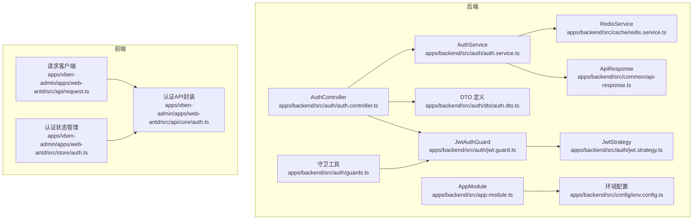
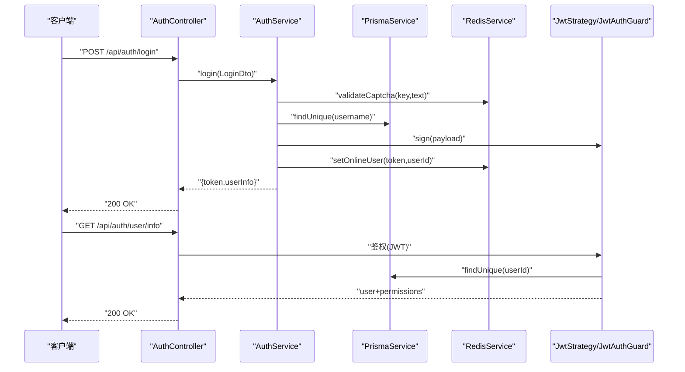
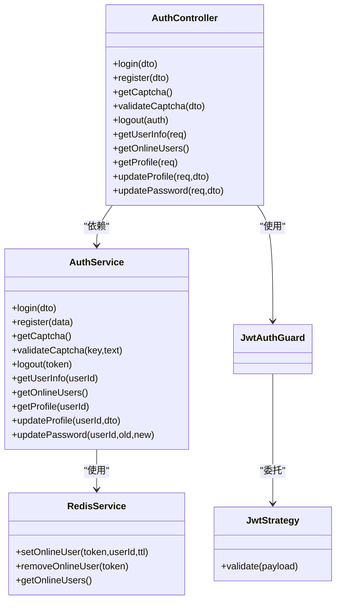

# 认证接口

<cite>
**本文引用的文件**
- [apps/backend/src/auth/auth.controller.ts](file://apps/backend/src/auth/auth.controller.ts)
- [apps/backend/src/auth/auth.service.ts](file://apps/backend/src/auth/auth.service.ts)
- [apps/backend/src/auth/dto/auth.dto.ts](file://apps/backend/src/auth/dto/auth.dto.ts)
- [apps/backend/src/auth/jwt.guard.ts](file://apps/backend/src/auth/jwt.guard.ts)
- [apps/backend/src/auth/jwt.strategy.ts](file://apps/backend/src/auth/jwt.strategy.ts)
- [apps/backend/src/auth/guards.ts](file://apps/backend/src/auth/guards.ts)
- [apps/backend/src/cache/redis.service.ts](file://apps/backend/src/cache/redis.service.ts)
- [apps/backend/src/common/api-response.ts](file://apps/backend/src/common/api-response.ts)
- [apps/backend/src/config/env.config.ts](file://apps/backend/src/config/env.config.ts)
- [apps/backend/src/app.module.ts](file://apps/backend/src/app.module.ts)
- [apps/vben-admin/apps/web-antd/src/api/core/auth.ts](file://apps/vben-admin/apps/web-antd/src/api/core/auth.ts)
- [apps/vben-admin/apps/web-antd/src/api/request.ts](file://apps/vben-admin/apps/web-antd/src/api/request.ts)
- [apps/vben-admin/apps/web-antd/src/store/auth.ts](file://apps/vben-admin/apps/web-antd/src/store/auth.ts)
</cite>

## 目录
1. [简介](#简介)
2. [项目结构](#项目结构)
3. [核心组件](#核心组件)
4. [架构总览](#架构总览)
5. [详细接口文档](#详细接口文档)
6. [依赖关系分析](#依赖关系分析)
7. [性能与安全考虑](#性能与安全考虑)
8. [故障排查指南](#故障排查指南)
9. [结论](#结论)
10. [附录](#附录)

## 简介
本文件面向后端与前端开发者，系统化梳理认证模块的RESTful接口，覆盖登录、注册、验证码、登出、当前用户信息、在线用户、个人资料与密码修改等能力。文档严格依据后端控制器与服务实现，给出请求参数、响应格式、错误码、认证方式（Bearer Token）以及前端集成要点，并提供JWT令牌使用与权限校验机制说明。

## 项目结构
认证相关代码主要位于后端应用的auth模块，配合全局拦截器、异常过滤器、Redis缓存与JWT策略共同完成认证与授权流程；前端通过统一请求客户端自动注入Authorization头并处理Nest风格响应包装。

**图表来源**
- [apps/backend/src/auth/auth.controller.ts:1-87](file://apps/backend/src/auth/auth.controller.ts#L1-L87)
- [apps/backend/src/auth/auth.service.ts:1-294](file://apps/backend/src/auth/auth.service.ts#L1-L294)
- [apps/backend/src/auth/dto/auth.dto.ts:1-91](file://apps/backend/src/auth/dto/auth.dto.ts#L1-L91)
- [apps/backend/src/auth/jwt.guard.ts:1-5](file://apps/backend/src/auth/jwt.guard.ts#L1-L5)
- [apps/backend/src/auth/jwt.strategy.ts:1-78](file://apps/backend/src/auth/jwt.strategy.ts#L1-L78)
- [apps/backend/src/auth/guards.ts:1-51](file://apps/backend/src/auth/guards.ts#L1-L51)
- [apps/backend/src/cache/redis.service.ts:1-128](file://apps/backend/src/cache/redis.service.ts#L1-L128)
- [apps/backend/src/common/api-response.ts:1-35](file://apps/backend/src/common/api-response.ts#L1-L35)
- [apps/backend/src/config/env.config.ts:1-47](file://apps/backend/src/config/env.config.ts#L1-L47)
- [apps/backend/src/app.module.ts:1-59](file://apps/backend/src/app.module.ts#L1-L59)
- [apps/vben-admin/apps/web-antd/src/api/request.ts:1-139](file://apps/vben-admin/apps/web-antd/src/api/request.ts#L1-L139)
- [apps/vben-admin/apps/web-antd/src/api/core/auth.ts:1-122](file://apps/vben-admin/apps/web-antd/src/api/core/auth.ts#L1-L122)
- [apps/vben-admin/apps/web-antd/src/store/auth.ts:1-137](file://apps/vben-admin/apps/web-antd/src/store/auth.ts#L1-L137)

**章节来源**
- [apps/backend/src/auth/auth.controller.ts:1-87](file://apps/backend/src/auth/auth.controller.ts#L1-L87)
- [apps/backend/src/auth/auth.service.ts:1-294](file://apps/backend/src/auth/auth.service.ts#L1-L294)
- [apps/backend/src/auth/jwt.guard.ts:1-5](file://apps/backend/src/auth/jwt.guard.ts#L1-L5)
- [apps/backend/src/auth/jwt.strategy.ts:1-78](file://apps/backend/src/auth/jwt.strategy.ts#L1-L78)
- [apps/backend/src/cache/redis.service.ts:1-128](file://apps/backend/src/cache/redis.service.ts#L1-L128)
- [apps/backend/src/common/api-response.ts:1-35](file://apps/backend/src/common/api-response.ts#L1-L35)
- [apps/backend/src/config/env.config.ts:1-47](file://apps/backend/src/config/env.config.ts#L1-L47)
- [apps/backend/src/app.module.ts:1-59](file://apps/backend/src/app.module.ts#L1-L59)
- [apps/vben-admin/apps/web-antd/src/api/request.ts:1-139](file://apps/vben-admin/apps/web-antd/src/api/request.ts#L1-L139)
- [apps/vben-admin/apps/web-antd/src/api/core/auth.ts:1-122](file://apps/vben-admin/apps/web-antd/src/api/core/auth.ts#L1-L122)
- [apps/vben-admin/apps/web-antd/src/store/auth.ts:1-137](file://apps/vben-admin/apps/web-antd/src/store/auth.ts#L1-L137)

## 核心组件
- AuthController：暴露认证相关REST接口，负责路由与参数绑定，调用AuthService执行业务逻辑。
- AuthService：核心业务层，包含登录校验、注册、验证码生成与校验、登出、当前用户信息与菜单权限构建、在线用户查询、个人资料读取与更新、密码修改等。
- DTO：对请求体进行参数校验与Swagger注解。
- JwtAuthGuard/JwtStrategy：基于Passport的JWT认证守卫与策略，负责从请求头解析Bearer Token并校验有效性，同时向上下文注入用户信息与权限集合。
- Guards工具：提供角色与权限守卫，用于系统其他模块的细粒度权限控制（认证模块内部分接口也复用JWT守卫）。
- RedisService：维护在线用户集合与键值缓存，支持验证码存储与过期控制。
- ApiResponse：统一响应包装类，规范后端返回结构。
- 前端请求客户端：自动注入Authorization头，按Nest风格响应进行解包与错误提示。

**章节来源**
- [apps/backend/src/auth/auth.controller.ts:1-87](file://apps/backend/src/auth/auth.controller.ts#L1-L87)
- [apps/backend/src/auth/auth.service.ts:1-294](file://apps/backend/src/auth/auth.service.ts#L1-L294)
- [apps/backend/src/auth/dto/auth.dto.ts:1-91](file://apps/backend/src/auth/dto/auth.dto.ts#L1-L91)
- [apps/backend/src/auth/jwt.guard.ts:1-5](file://apps/backend/src/auth/jwt.guard.ts#L1-L5)
- [apps/backend/src/auth/jwt.strategy.ts:1-78](file://apps/backend/src/auth/jwt.strategy.ts#L1-L78)
- [apps/backend/src/auth/guards.ts:1-51](file://apps/backend/src/auth/guards.ts#L1-L51)
- [apps/backend/src/cache/redis.service.ts:1-128](file://apps/backend/src/cache/redis.service.ts#L1-L128)
- [apps/backend/src/common/api-response.ts:1-35](file://apps/backend/src/common/api-response.ts#L1-L35)
- [apps/vben-admin/apps/web-antd/src/api/request.ts:1-139](file://apps/vben-admin/apps/web-antd/src/api/request.ts#L1-L139)

## 架构总览
下图展示认证接口在后端的整体调用链路与关键组件交互。

**图表来源**
- [apps/backend/src/auth/auth.controller.ts:13-58](file://apps/backend/src/auth/auth.controller.ts#L13-L58)
- [apps/backend/src/auth/auth.service.ts:29-89](file://apps/backend/src/auth/auth.service.ts#L29-L89)
- [apps/backend/src/auth/jwt.strategy.ts:20-43](file://apps/backend/src/auth/jwt.strategy.ts#L20-L43)
- [apps/backend/src/cache/redis.service.ts:83-91](file://apps/backend/src/cache/redis.service.ts#L83-L91)

## 详细接口文档

### 1) 用户登录
- 路径：POST /api/auth/login
- 功能：用户名+密码+验证码登录，成功返回JWT令牌与用户基础信息。
- 鉴权：无需认证（@Public）
- 请求体参数（LoginDto）
  - username: string（必填）
  - password: string（必填）
  - captchaKey: string（必填，来自验证码接口）
  - captchaText: string（必填，用户输入）
- 响应
  - code: number
  - data: { token: string, userInfo: object }
  - message: string
- 错误码
  - 400：验证码无效或已过期
  - 401：用户名或密码错误/账户被禁用
- 认证要求：无
- 实际代码示例路径
  - 控制器入口：[apps/backend/src/auth/auth.controller.ts:13-19](file://apps/backend/src/auth/auth.controller.ts#L13-L19)
  - 业务实现：[apps/backend/src/auth/auth.service.ts:29-89](file://apps/backend/src/auth/auth.service.ts#L29-L89)
  - DTO定义：[apps/backend/src/auth/dto/auth.dto.ts:43-63](file://apps/backend/src/auth/dto/auth.dto.ts#L43-L63)

**章节来源**
- [apps/backend/src/auth/auth.controller.ts:13-19](file://apps/backend/src/auth/auth.controller.ts#L13-L19)
- [apps/backend/src/auth/auth.service.ts:29-89](file://apps/backend/src/auth/auth.service.ts#L29-L89)
- [apps/backend/src/auth/dto/auth.dto.ts:43-63](file://apps/backend/src/auth/dto/auth.dto.ts#L43-L63)

### 2) 用户注册
- 路径：POST /api/auth/register
- 功能：创建新用户（默认昵称为用户名或指定昵称）。
- 鉴权：无需认证（@Public）
- 请求体参数（RegisterDto）
  - username: string（必填）
  - password: string（最小长度6，必填）
  - nickname?: string（可选）
- 响应
  - code: number
  - data: { id: number, username: string }
  - message: string
- 错误码
  - 400：用户名已存在
- 认证要求：无
- 实际代码示例路径
  - 控制器入口：[apps/backend/src/auth/auth.controller.ts:21-26](file://apps/backend/src/auth/auth.controller.ts#L21-L26)
  - 业务实现：[apps/backend/src/auth/auth.service.ts:91-107](file://apps/backend/src/auth/auth.service.ts#L91-L107)
  - DTO定义：[apps/backend/src/auth/dto/auth.dto.ts:65-79](file://apps/backend/src/auth/dto/auth.dto.ts#L65-L79)

**章节来源**
- [apps/backend/src/auth/auth.controller.ts:21-26](file://apps/backend/src/auth/auth.controller.ts#L21-L26)
- [apps/backend/src/auth/auth.service.ts:91-107](file://apps/backend/src/auth/auth.service.ts#L91-L107)
- [apps/backend/src/auth/dto/auth.dto.ts:65-79](file://apps/backend/src/auth/dto/auth.dto.ts#L65-L79)

### 3) 验证码获取
- 路径：GET /api/auth/captcha
- 功能：生成SVG验证码并返回key与图片数据，key需在登录时提交。
- 鉴权：无需认证（@Public）
- 响应
  - code: number
  - data: { key: string, img: string }
  - message: string
- 错误码：无特定业务错误
- 认证要求：无
- 实际代码示例路径
  - 控制器入口：[apps/backend/src/auth/auth.controller.ts:28-33](file://apps/backend/src/auth/auth.controller.ts#L28-L33)
  - 业务实现：[apps/backend/src/auth/auth.service.ts:109-128](file://apps/backend/src/auth/auth.service.ts#L109-L128)
  - Redis存储：[apps/backend/src/cache/redis.service.ts:11-23](file://apps/backend/src/cache/redis.service.ts#L11-L23)

**章节来源**
- [apps/backend/src/auth/auth.controller.ts:28-33](file://apps/backend/src/auth/auth.controller.ts#L28-L33)
- [apps/backend/src/auth/auth.service.ts:109-128](file://apps/backend/src/auth/auth.service.ts#L109-L128)
- [apps/backend/src/cache/redis.service.ts:11-23](file://apps/backend/src/cache/redis.service.ts#L11-L23)

### 4) 验证码验证
- 路径：POST /api/auth/captcha/validate
- 功能：校验用户输入的验证码是否正确且未过期。
- 鉴权：无需认证（@Public）
- 请求体参数（CaptchaDto）
  - key: string（必填）
  - text: string（必填）
- 响应
  - code: number
  - data: { valid: boolean }
  - message: string
- 错误码：无特定业务错误
- 认证要求：无
- 实际代码示例路径
  - 控制器入口：[apps/backend/src/auth/auth.controller.ts:35-42](file://apps/backend/src/auth/auth.controller.ts#L35-L42)
  - 业务实现：[apps/backend/src/auth/auth.service.ts:121-128](file://apps/backend/src/auth/auth.service.ts#L121-L128)
  - Redis读取/删除：[apps/backend/src/cache/redis.service.ts:29-51](file://apps/backend/src/cache/redis.service.ts#L29-L51)

**章节来源**
- [apps/backend/src/auth/auth.controller.ts:35-42](file://apps/backend/src/auth/auth.controller.ts#L35-L42)
- [apps/backend/src/auth/auth.service.ts:121-128](file://apps/backend/src/auth/auth.service.ts#L121-L128)
- [apps/backend/src/cache/redis.service.ts:29-51](file://apps/backend/src/cache/redis.service.ts#L29-L51)

### 5) 用户登出
- 路径：POST /api/auth/logout
- 功能：使当前令牌失效，移除在线用户记录。
- 鉴权：需要JWT（@UseGuards(JwtAuthGuard)）
- 请求头
  - Authorization: Bearer <token>
- 响应
  - code: number
  - data: null 或提示信息
  - message: string
- 错误码：无特定业务错误
- 认证要求：Bearer Token
- 实际代码示例路径
  - 控制器入口：[apps/backend/src/auth/auth.controller.ts:44-51](file://apps/backend/src/auth/auth.controller.ts#L44-L51)
  - 业务实现：[apps/backend/src/auth/auth.service.ts:130-133](file://apps/backend/src/auth/auth.service.ts#L130-L133)
  - Redis移除在线用户：[apps/backend/src/cache/redis.service.ts:88-91](file://apps/backend/src/cache/redis.service.ts#L88-L91)

**章节来源**
- [apps/backend/src/auth/auth.controller.ts:44-51](file://apps/backend/src/auth/auth.controller.ts#L44-L51)
- [apps/backend/src/auth/auth.service.ts:130-133](file://apps/backend/src/auth/auth.service.ts#L130-L133)
- [apps/backend/src/cache/redis.service.ts:88-91](file://apps/backend/src/cache/redis.service.ts#L88-L91)

### 6) 获取当前用户信息
- 路径：GET /api/auth/user/info
- 功能：返回当前用户信息、权限列表与菜单树（按排序与可见性过滤）。
- 鉴权：需要JWT（@UseGuards(JwtAuthGuard)）
- 响应
  - code: number
  - data: { user: object, permissions: string[], menus: any[] }
  - message: string
- 错误码
  - 401：用户不存在或被禁用
- 认证要求：Bearer Token
- 实际代码示例路径
  - 控制器入口：[apps/backend/src/auth/auth.controller.ts:53-58](file://apps/backend/src/auth/auth.controller.ts#L53-L58)
  - 业务实现：[apps/backend/src/auth/auth.service.ts:135-187](file://apps/backend/src/auth/auth.service.ts#L135-L187)
  - JWT策略注入用户与权限：[apps/backend/src/auth/jwt.strategy.ts:20-43](file://apps/backend/src/auth/jwt.strategy.ts#L20-L43)

**章节来源**
- [apps/backend/src/auth/auth.controller.ts:53-58](file://apps/backend/src/auth/auth.controller.ts#L53-L58)
- [apps/backend/src/auth/auth.service.ts:135-187](file://apps/backend/src/auth/auth.service.ts#L135-L187)
- [apps/backend/src/auth/jwt.strategy.ts:20-43](file://apps/backend/src/auth/jwt.strategy.ts#L20-L43)

### 7) 获取在线用户
- 路径：GET /api/auth/online/users
- 功能：返回当前在线的token列表。
- 鉴权：需要JWT（@UseGuards(JwtAuthGuard)）
- 响应
  - code: number
  - data: string[]
  - message: string
- 错误码：无特定业务错误
- 认证要求：Bearer Token
- 实际代码示例路径
  - 控制器入口：[apps/backend/src/auth/auth.controller.ts:60-65](file://apps/backend/src/auth/auth.controller.ts#L60-L65)
  - 业务实现：[apps/backend/src/auth/auth.service.ts:205-207](file://apps/backend/src/auth/auth.service.ts#L205-L207)
  - Redis在线集合：[apps/backend/src/cache/redis.service.ts:97-99](file://apps/backend/src/cache/redis.service.ts#L97-L99)

**章节来源**
- [apps/backend/src/auth/auth.controller.ts:60-65](file://apps/backend/src/auth/auth.controller.ts#L60-L65)
- [apps/backend/src/auth/auth.service.ts:205-207](file://apps/backend/src/auth/auth.service.ts#L205-L207)
- [apps/backend/src/cache/redis.service.ts:97-99](file://apps/backend/src/cache/redis.service.ts#L97-L99)

### 8) 获取用户资料
- 路径：GET /api/auth/profile
- 功能：返回当前用户的完整资料（含部门、角色、岗位等）。
- 鉴权：需要JWT（@UseGuards(JwtAuthGuard)）
- 响应
  - code: number
  - data: object（包含id、username、nickname、avatar、email、phone、remark、status、deptName、roles、posts）
  - message: string
- 错误码
  - 401：用户不存在
- 认证要求：Bearer Token
- 实际代码示例路径
  - 控制器入口：[apps/backend/src/auth/auth.controller.ts:67-72](file://apps/backend/src/auth/auth.controller.ts#L67-L72)
  - 业务实现：[apps/backend/src/auth/auth.service.ts:209-243](file://apps/backend/src/auth/auth.service.ts#L209-L243)

**章节来源**
- [apps/backend/src/auth/auth.controller.ts:67-72](file://apps/backend/src/auth/auth.controller.ts#L67-L72)
- [apps/backend/src/auth/auth.service.ts:209-243](file://apps/backend/src/auth/auth.service.ts#L209-L243)

### 9) 更新用户资料
- 路径：PUT /api/auth/profile
- 功能：更新当前用户的昵称、邮箱、手机、头像、备注等字段（空字符串将被转换为NULL）。
- 鉴权：需要JWT（@UseGuards(JwtAuthGuard)）
- 请求体参数（UpdateProfileDto）
  - nickname?: string（可选）
  - email?: string（可选，为空则置NULL）
  - phone?: string（可选，为空则置NULL）
  - avatar?: string（可选）
  - remark?: string（可选，为空则置NULL）
- 响应
  - code: number
  - data: 更新后的用户对象
  - message: string
- 错误码
  - 401：用户不存在
- 认证要求：Bearer Token
- 实际代码示例路径
  - 控制器入口：[apps/backend/src/auth/auth.controller.ts:74-79](file://apps/backend/src/auth/auth.controller.ts#L74-L79)
  - 业务实现：[apps/backend/src/auth/auth.service.ts:245-270](file://apps/backend/src/auth/auth.service.ts#L245-L270)
  - DTO定义：[apps/backend/src/auth/dto/auth.dto.ts:4-29](file://apps/backend/src/auth/dto/auth.dto.ts#L4-L29)

**章节来源**
- [apps/backend/src/auth/auth.controller.ts:74-79](file://apps/backend/src/auth/auth.controller.ts#L74-L79)
- [apps/backend/src/auth/auth.service.ts:245-270](file://apps/backend/src/auth/auth.service.ts#L245-L270)
- [apps/backend/src/auth/dto/auth.dto.ts:4-29](file://apps/backend/src/auth/dto/auth.dto.ts#L4-L29)

### 10) 修改密码
- 路径：PUT /api/auth/profile/password
- 功能：校验旧密码并更新为新密码（新密码最小长度6）。
- 鉴权：需要JWT（@UseGuards(JwtAuthGuard)）
- 请求体参数（UpdatePasswordDto）
  - oldPassword: string（必填）
  - newPassword: string（最小长度6，必填）
- 响应
  - code: number
  - data: null 或提示信息
  - message: string
- 错误码
  - 401：用户不存在
  - 400：旧密码不正确
- 认证要求：Bearer Token
- 实际代码示例路径
  - 控制器入口：[apps/backend/src/auth/auth.controller.ts:81-86](file://apps/backend/src/auth/auth.controller.ts#L81-L86)
  - 业务实现：[apps/backend/src/auth/auth.service.ts:272-292](file://apps/backend/src/auth/auth.service.ts#L272-L292)
  - DTO定义：[apps/backend/src/auth/dto/auth.dto.ts:31-41](file://apps/backend/src/auth/dto/auth.dto.ts#L31-L41)

**章节来源**
- [apps/backend/src/auth/auth.controller.ts:81-86](file://apps/backend/src/auth/auth.controller.ts#L81-L86)
- [apps/backend/src/auth/auth.service.ts:272-292](file://apps/backend/src/auth/auth.service.ts#L272-L292)
- [apps/backend/src/auth/dto/auth.dto.ts:31-41](file://apps/backend/src/auth/dto/auth.dto.ts#L31-L41)

## 依赖关系分析
- 控制器到服务：AuthController通过依赖注入AuthService执行具体业务。
- 服务到数据库：AuthService使用PrismaService访问sysUser/sysMenu等表。
- 服务到缓存：AuthService使用RedisService进行验证码存储与在线用户管理。
- 鉴权链路：JwtAuthGuard继承自AuthGuard('jwt')，JwtStrategy负责从请求头解析Bearer Token并校验，随后将用户信息与权限注入请求上下文。
- 前端集成：前端请求客户端统一注入Authorization头，按Nest响应包装格式解包data字段，并在401时触发重新认证流程。

**图表来源**
- [apps/backend/src/auth/auth.controller.ts:1-87](file://apps/backend/src/auth/auth.controller.ts#L1-L87)
- [apps/backend/src/auth/auth.service.ts:1-294](file://apps/backend/src/auth/auth.service.ts#L1-L294)
- [apps/backend/src/auth/jwt.guard.ts:1-5](file://apps/backend/src/auth/jwt.guard.ts#L1-L5)
- [apps/backend/src/auth/jwt.strategy.ts:1-78](file://apps/backend/src/auth/jwt.strategy.ts#L1-L78)
- [apps/backend/src/cache/redis.service.ts:1-128](file://apps/backend/src/cache/redis.service.ts#L1-L128)

**章节来源**
- [apps/backend/src/auth/auth.controller.ts:1-87](file://apps/backend/src/auth/auth.controller.ts#L1-L87)
- [apps/backend/src/auth/auth.service.ts:1-294](file://apps/backend/src/auth/auth.service.ts#L1-L294)
- [apps/backend/src/auth/jwt.guard.ts:1-5](file://apps/backend/src/auth/jwt.guard.ts#L1-L5)
- [apps/backend/src/auth/jwt.strategy.ts:1-78](file://apps/backend/src/auth/jwt.strategy.ts#L1-L78)
- [apps/backend/src/cache/redis.service.ts:1-128](file://apps/backend/src/cache/redis.service.ts#L1-L128)

## 性能与安全考虑
- JWT签名与过期
  - JWT密钥与过期时间由环境配置提供，建议生产环境设置足够长的过期时间并定期轮换密钥。
  - 建议在网关或反向代理层限制请求频率，避免暴力破解。
- 在线用户管理
  - 使用Redis集合维护在线用户，便于统计与广播；注意合理设置TTL以回收资源。
- 密码安全
  - 使用bcrypt进行密码哈希，新密码最小长度6；旧密码校验失败时记录登录日志。
- 验证码时效
  - 验证码存储带过期时间，校验成功后立即删除，降低重放风险。
- 响应一致性
  - 所有接口遵循统一响应包装，前端按code=200提取data，减少解析复杂度。

**章节来源**
- [apps/backend/src/config/env.config.ts:3-8](file://apps/backend/src/config/env.config.ts#L3-L8)
- [apps/backend/src/cache/redis.service.ts:83-99](file://apps/backend/src/cache/redis.service.ts#L83-L99)
- [apps/backend/src/auth/auth.service.ts:48-60](file://apps/backend/src/auth/auth.service.ts#L48-L60)
- [apps/backend/src/common/api-response.ts:1-35](file://apps/backend/src/common/api-response.ts#L1-L35)

## 故障排查指南
- 登录失败（401）
  - 检查用户名是否存在、账户状态是否正常、密码是否匹配。
  - 确认验证码是否有效且未过期。
  - 参考：[apps/backend/src/auth/auth.service.ts:29-89](file://apps/backend/src/auth/auth.service.ts#L29-L89)
- 验证码错误（400）
  - 确认captchaKey与captchaText一致，且Redis中存在对应键值。
  - 参考：[apps/backend/src/auth/auth.service.ts:121-128](file://apps/backend/src/auth/auth.service.ts#L121-L128)
- 未携带或令牌无效（401）
  - 确保请求头包含Authorization: Bearer <token>，且令牌未过期。
  - 前端统一注入逻辑参考：[apps/vben-admin/apps/web-antd/src/api/request.ts:55-63](file://apps/vben-admin/apps/web-antd/src/api/request.ts#L55-L63)
- 权限不足（403）
  - 当前用户缺少所需角色或权限，检查用户角色与菜单权限映射。
  - 参考：[apps/backend/src/auth/jwt.strategy.ts:45-76](file://apps/backend/src/auth/jwt.strategy.ts#L45-L76)
- 在线用户为空
  - 检查Redis连接与在线集合键名是否正确。
  - 参考：[apps/backend/src/cache/redis.service.ts:97-99](file://apps/backend/src/cache/redis.service.ts#L97-L99)

**章节来源**
- [apps/backend/src/auth/auth.service.ts:29-89](file://apps/backend/src/auth/auth.service.ts#L29-L89)
- [apps/backend/src/auth/auth.service.ts:121-128](file://apps/backend/src/auth/auth.service.ts#L121-L128)
- [apps/vben-admin/apps/web-antd/src/api/request.ts:55-63](file://apps/vben-admin/apps/web-antd/src/api/request.ts#L55-L63)
- [apps/backend/src/auth/jwt.strategy.ts:45-76](file://apps/backend/src/auth/jwt.strategy.ts#L45-L76)
- [apps/backend/src/cache/redis.service.ts:97-99](file://apps/backend/src/cache/redis.service.ts#L97-L99)

## 结论
本认证接口体系以JWT为核心，结合Redis与Prisma实现登录态管理、权限注入与用户资料维护。前端通过统一请求客户端自动处理认证头与响应解包，确保跨端一致性。建议在生产环境中强化密钥管理、速率限制与审计日志，持续提升安全性与可观测性。

## 附录

### JWT令牌使用方法
- 获取令牌
  - 先调用“获取验证码”接口获得key与img，再调用“用户登录”接口提交username、password、captchaKey、captchaText。
  - 参考：[apps/backend/src/auth/auth.controller.ts:13-19](file://apps/backend/src/auth/auth.controller.ts#L13-L19)
- 使用令牌
  - 将返回的token保存至本地存储，在后续请求头中添加Authorization: Bearer <token>。
  - 前端自动注入逻辑参考：[apps/vben-admin/apps/web-antd/src/api/request.ts:55-63](file://apps/vben-admin/apps/web-antd/src/api/request.ts#L55-L63)
- 令牌过期
  - 后端未提供刷新接口，过期后需重新登录获取新令牌。
  - 参考：[apps/vben-admin/apps/web-antd/src/api/request.ts:51-53](file://apps/vben-admin/apps/web-antd/src/api/request.ts#L51-L53)

**章节来源**
- [apps/backend/src/auth/auth.controller.ts:13-19](file://apps/backend/src/auth/auth.controller.ts#L13-L19)
- [apps/vben-admin/apps/web-antd/src/api/request.ts:51-63](file://apps/vben-admin/apps/web-antd/src/api/request.ts#L51-L63)

### 权限验证机制
- 角色与权限来源
  - JwtStrategy根据用户角色动态计算权限集合，超级管理员拥有全部权限，普通用户仅包含其角色关联菜单的权限。
  - 参考：[apps/backend/src/auth/jwt.strategy.ts:45-76](file://apps/backend/src/auth/jwt.strategy.ts#L45-L76)
- 接口权限
  - 认证模块内大部分接口均使用JwtAuthGuard，确保Bearer Token有效。
  - 参考：[apps/backend/src/auth/auth.controller.ts:44-86](file://apps/backend/src/auth/auth.controller.ts#L44-L86)
- 系统级权限
  - 系统模块使用RequirePermission与PermissionGuard进行更细粒度的权限控制。
  - 参考：[apps/backend/src/auth/guards.ts:16-51](file://apps/backend/src/auth/guards.ts#L16-L51)

**章节来源**
- [apps/backend/src/auth/jwt.strategy.ts:45-76](file://apps/backend/src/auth/jwt.strategy.ts#L45-L76)
- [apps/backend/src/auth/auth.controller.ts:44-86](file://apps/backend/src/auth/auth.controller.ts#L44-L86)
- [apps/backend/src/auth/guards.ts:16-51](file://apps/backend/src/auth/guards.ts#L16-L51)

### 常见问题与解决方案
- 无法获取用户信息（401）
  - 检查用户状态与是否被删除；确认令牌有效。
  - 参考：[apps/backend/src/auth/auth.service.ts:135-142](file://apps/backend/src/auth/auth.service.ts#L135-L142)
- 更新资料失败（401）
  - 确认当前登录用户存在且令牌有效。
  - 参考：[apps/backend/src/auth/auth.service.ts:245-257](file://apps/backend/src/auth/auth.service.ts#L245-L257)
- 修改密码失败（400）
  - 确认旧密码正确且新密码满足长度要求。
  - 参考：[apps/backend/src/auth/auth.service.ts:272-283](file://apps/backend/src/auth/auth.service.ts#L272-L283)

**章节来源**
- [apps/backend/src/auth/auth.service.ts:135-142](file://apps/backend/src/auth/auth.service.ts#L135-L142)
- [apps/backend/src/auth/auth.service.ts:245-257](file://apps/backend/src/auth/auth.service.ts#L245-L257)
- [apps/backend/src/auth/auth.service.ts:272-283](file://apps/backend/src/auth/auth.service.ts#L272-L283)