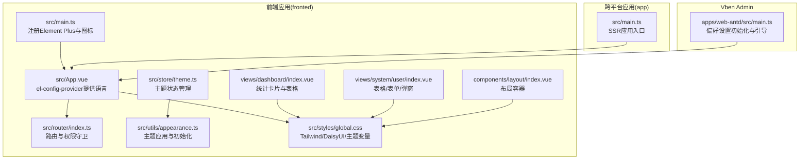
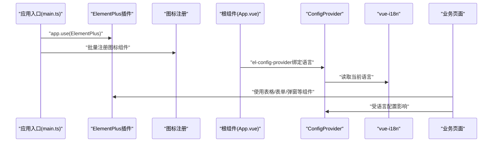
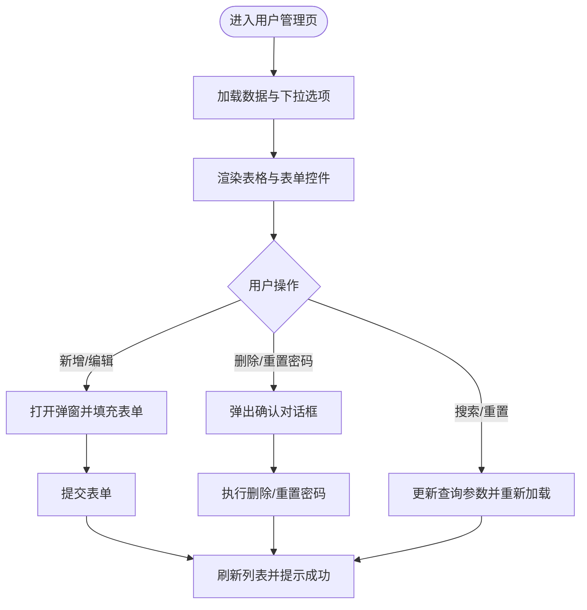
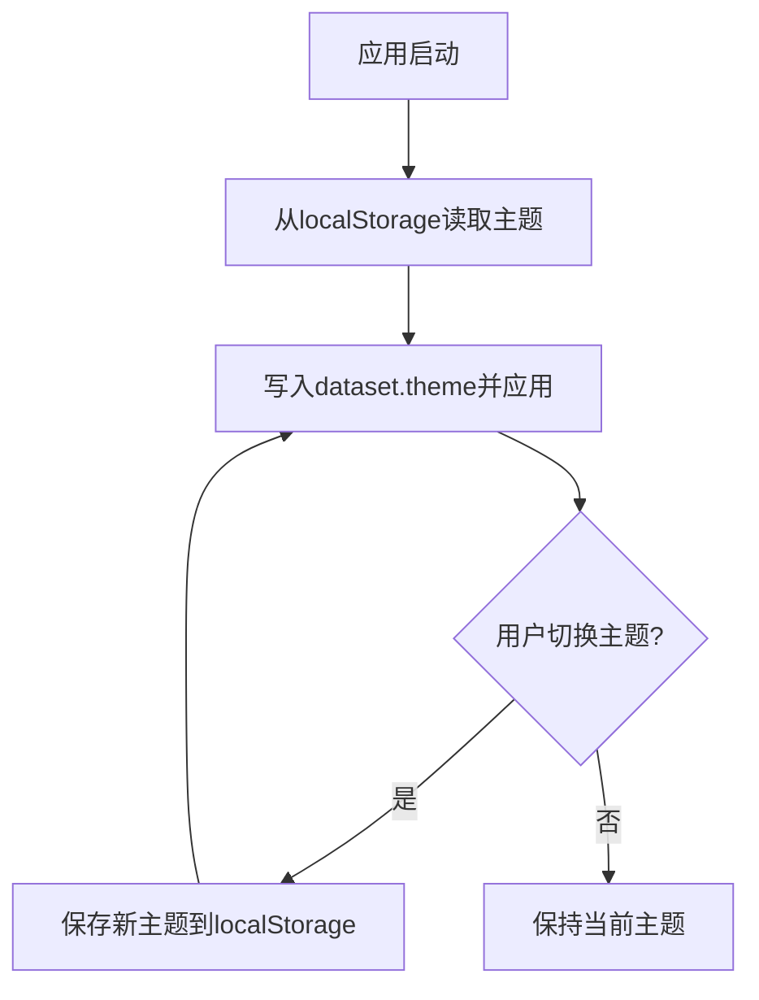
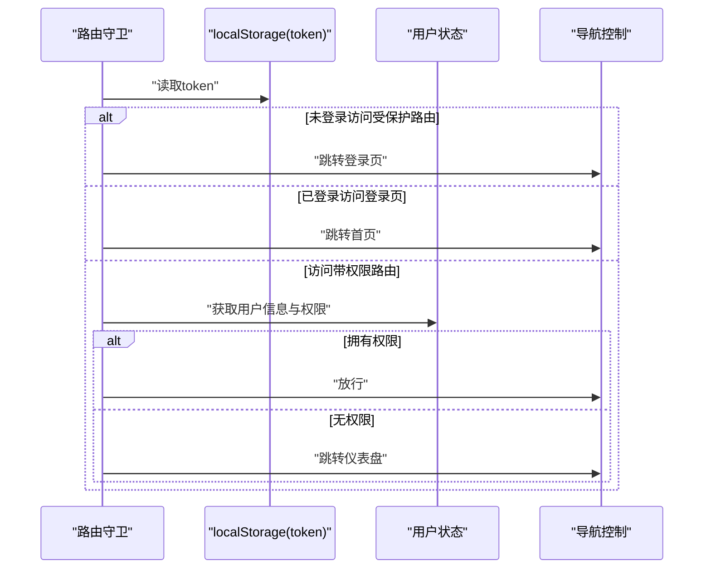
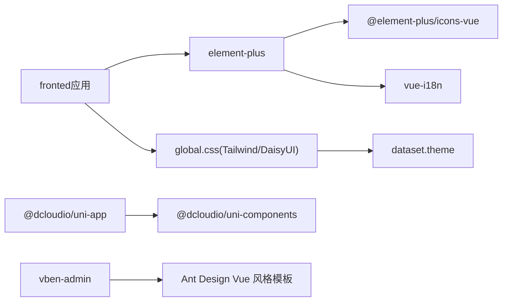
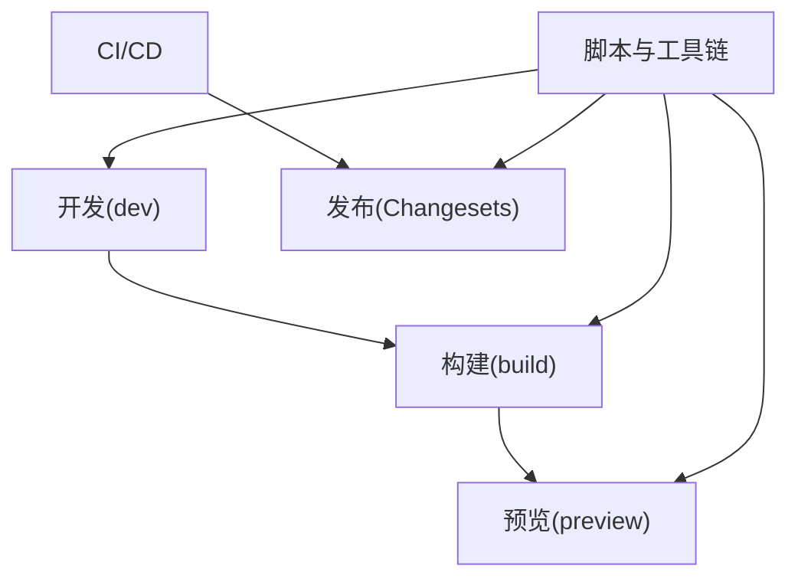

# UI组件库

<cite>
**本文引用的文件**
- [apps/fronted/package.json](file://apps/fronted/package.json)
- [apps/vben-admin/package.json](file://apps/vben-admin/package.json)
- [apps/app/package.json](file://apps/app/package.json)
- [apps/fronted/src/main.ts](file://apps/fronted/src/main.ts)
- [apps/fronted/src/App.vue](file://apps/fronted/src/App.vue)
- [apps/fronted/src/router/index.ts](file://apps/fronted/src/router/index.ts)
- [apps/fronted/src/store/theme.ts](file://apps/fronted/src/store/theme.ts)
- [apps/fronted/src/utils/appearance.ts](file://apps/fronted/src/utils/appearance.ts)
- [apps/fronted/src/styles/global.css](file://apps/fronted/src/styles/global.css)
- [apps/fronted/src/views/dashboard/index.vue](file://apps/fronted/src/views/dashboard/index.vue)
- [apps/fronted/src/views/system/user/index.vue](file://apps/fronted/src/views/system/user/index.vue)
- [apps/fronted/src/components/layout/index.vue](file://apps/fronted/src/components/layout/index.vue)
- [apps/fronted/src/components/layout/SidebarMenu.vue](file://apps/fronted/src/components/layout/SidebarMenu.vue)
- [apps/fronted/src/components/HelloWorld.vue](file://apps/fronted/src/components/HelloWorld.vue)
- [apps/vben-admin/apps/web-antd/src/main.ts](file://apps/vben-admin/apps/web-antd/src/main.ts)
- [apps/app/src/main.ts](file://apps/app/src/main.ts)
</cite>

## 目录
1. [简介](#简介)
2. [项目结构](#项目结构)
3. [核心组件](#核心组件)
4. [架构总览](#架构总览)
5. [组件详解](#组件详解)
6. [依赖关系分析](#依赖关系分析)
7. [性能与体验](#性能与体验)
8. [可访问性与用户体验](#可访问性与用户体验)
9. [测试与质量保障](#测试与质量保障)
10. [第三方库与替代方案](#第三方库与替代方案)
11. [工具链与自动化构建](#工具链与自动化构建)
12. [结论](#结论)

## 简介
本项目包含多个前端应用与组件库实践示例，涵盖基于 Vue 3 的 Web 应用（Element Plus + TailwindCSS + DaisyUI）、跨平台应用（uni-app）以及 Vben Admin 生态（Ant Design Vue 风格）。本文围绕 UI 组件库的使用与扩展，系统梳理 Element Plus 在本仓库中的集成方式、常用组件（数据表格、表单、弹窗）的使用范式、图标系统、样式定制与主题适配、可访问性与用户体验优化、测试与质量保障、第三方库集成与替代方案，以及组件开发的工具链与自动化流程。

## 项目结构
- 前端应用（apps/fronted）
  - 使用 Element Plus 作为主 UI 组件库，配合 TailwindCSS 和 DaisyUI 实现现代化样式与主题切换。
  - 全局注册 Element Plus 图标，并通过 el-config-provider 提供多语言支持。
  - 路由采用 Vue Router，内置鉴权守卫与权限控制。
- 跨平台应用（apps/app）
  - 基于 uni-app，使用 @dcloudio/uni-components 提供的基础组件能力。
- Vben Admin（apps/vben-admin）
  - 多工作区 Monorepo，提供 Ant Design Vue 风格的 Web 应用模板与工具链。
- 样式与主题
  - 通过全局 CSS 引入 Tailwind v4 与 DaisyUI，结合 dataset 主题开关实现明暗主题切换。
  - 主题状态持久化到 localStorage，启动时自动初始化。

**图表来源**
- [apps/fronted/src/main.ts:1-27](file://apps/fronted/src/main.ts#L1-L27)
- [apps/fronted/src/App.vue:1-16](file://apps/fronted/src/App.vue#L1-L16)
- [apps/fronted/src/router/index.ts:1-160](file://apps/fronted/src/router/index.ts#L1-L160)
- [apps/fronted/src/store/theme.ts:1-24](file://apps/fronted/src/store/theme.ts#L1-L24)
- [apps/fronted/src/utils/appearance.ts:1-13](file://apps/fronted/src/utils/appearance.ts#L1-L13)
- [apps/fronted/src/styles/global.css:1-297](file://apps/fronted/src/styles/global.css#L1-L297)
- [apps/fronted/src/views/dashboard/index.vue:1-189](file://apps/fronted/src/views/dashboard/index.vue#L1-L189)
- [apps/fronted/src/views/system/user/index.vue:1-309](file://apps/fronted/src/views/system/user/index.vue#L1-L309)
- [apps/fronted/src/components/layout/index.vue](file://apps/fronted/src/components/layout/index.vue)
- [apps/app/src/main.ts:1-9](file://apps/app/src/main.ts#L1-L9)
- [apps/vben-admin/apps/web-antd/src/main.ts:1-33](file://apps/vben-admin/apps/web-antd/src/main.ts#L1-L33)

**章节来源**
- [apps/fronted/package.json:1-34](file://apps/fronted/package.json#L1-L34)
- [apps/fronted/src/main.ts:1-27](file://apps/fronted/src/main.ts#L1-L27)
- [apps/fronted/src/App.vue:1-16](file://apps/fronted/src/App.vue#L1-L16)
- [apps/fronted/src/router/index.ts:1-160](file://apps/fronted/src/router/index.ts#L1-L160)
- [apps/fronted/src/store/theme.ts:1-24](file://apps/fronted/src/store/theme.ts#L1-L24)
- [apps/fronted/src/utils/appearance.ts:1-13](file://apps/fronted/src/utils/appearance.ts#L1-L13)
- [apps/fronted/src/styles/global.css:1-297](file://apps/fronted/src/styles/global.css#L1-L297)
- [apps/app/src/main.ts:1-9](file://apps/app/src/main.ts#L1-L9)
- [apps/vben-admin/apps/web-antd/src/main.ts:1-33](file://apps/vben-admin/apps/web-antd/src/main.ts#L1-L33)

## 核心组件
- Element Plus
  - 完整引入与按需引入均可；本项目在入口统一注册并全局使用。
  - 图标系统：通过 @element-plus/icons-vue 批量注册，便于在模板中直接使用。
  - 国际化：通过 el-config-provider 绑定 vue-i18n 的当前语言，动态切换 Element Plus 内置文案语言。
- 表格与表单
  - 数据表格：使用原生 table 结合 DaisyUI 的 table 类，实现斑马纹、悬停高亮、响应式分页等。
  - 表单控件：input/select/radio/toggle 等基础控件与 Element Plus 的 el-tree-select、ElMessage、ElMessageBox 等组合使用。
- 弹窗
  - 使用原生 dialog 与 DaisyUI modal 类，配合表单提交与确认对话框实现交互闭环。
- 主题与样式
  - 通过 dataset 切换主题，Tailwind v4 自定义变量与 DaisyUI 组件类实现一致风格。
  - 全局过渡动画、滚动条美化、按钮与卡片 hover 效果等增强体验。

**章节来源**
- [apps/fronted/src/main.ts:1-27](file://apps/fronted/src/main.ts#L1-L27)
- [apps/fronted/src/App.vue:1-16](file://apps/fronted/src/App.vue#L1-L16)
- [apps/fronted/src/views/dashboard/index.vue:1-189](file://apps/fronted/src/views/dashboard/index.vue#L1-L189)
- [apps/fronted/src/views/system/user/index.vue:1-309](file://apps/fronted/src/views/system/user/index.vue#L1-L309)
- [apps/fronted/src/styles/global.css:1-297](file://apps/fronted/src/styles/global.css#L1-L297)

## 架构总览
Element Plus 在本项目中的集成路径如下：
- 应用入口注册 Element Plus 插件与图标组件；
- 根组件通过 el-config-provider 注入语言环境；
- 页面组件按需使用 Element Plus 组件与 DaisyUI 样式类；
- 主题状态通过 Pinia Store 管理，外观工具负责写入 DOM 属性与本地存储。

**图表来源**
- [apps/fronted/src/main.ts:1-27](file://apps/fronted/src/main.ts#L1-L27)
- [apps/fronted/src/App.vue:1-16](file://apps/fronted/src/App.vue#L1-L16)

**章节来源**
- [apps/fronted/src/main.ts:1-27](file://apps/fronted/src/main.ts#L1-L27)
- [apps/fronted/src/App.vue:1-16](file://apps/fronted/src/App.vue#L1-L16)

## 组件详解

### Element Plus 常用组件使用范式
- 数据表格
  - 使用原生 table 并结合 DaisyUI 的 table、table-sm、table-zebra 等类，实现清晰的视觉层次与交互反馈。
  - 支持 hover 高亮、响应式布局与分页控件。
- 表单组件
  - 基础输入框、选择器、单选/复选、开关等，结合 v-model 实现双向绑定。
  - 使用 ElMessage 与 ElMessageBox 进行消息提示与二次确认。
- 弹窗组件
  - 原生 dialog + modal 类，配合表单提交与取消按钮，实现增删改查的交互闭环。
- 图标系统
  - 通过 @element-plus/icons-vue 批量注册，模板中以组件形式直接使用。

**图表来源**
- [apps/fronted/src/views/system/user/index.vue:1-309](file://apps/fronted/src/views/system/user/index.vue#L1-L309)

**章节来源**
- [apps/fronted/src/views/system/user/index.vue:1-309](file://apps/fronted/src/views/system/user/index.vue#L1-L309)

### 主题与样式定制
- 主题切换
  - 通过 Pinia Store 管理当前主题，调用外观工具将主题写入 document.documentElement.dataset.theme，并持久化到 localStorage。
  - 初始化时从 localStorage 读取主题并应用。
- 样式体系
  - Tailwind v4 自定义变量与 DaisyUI 组件类统一风格，提供圆角、间距、过渡动画等通用变量。
  - 全局 CSS 中定义了卡片、表格、按钮、模态框、滚动条等样式细节与动画。

**图表来源**
- [apps/fronted/src/store/theme.ts:1-24](file://apps/fronted/src/store/theme.ts#L1-L24)
- [apps/fronted/src/utils/appearance.ts:1-13](file://apps/fronted/src/utils/appearance.ts#L1-L13)
- [apps/fronted/src/styles/global.css:1-297](file://apps/fronted/src/styles/global.css#L1-L297)

**章节来源**
- [apps/fronted/src/store/theme.ts:1-24](file://apps/fronted/src/store/theme.ts#L1-L24)
- [apps/fronted/src/utils/appearance.ts:1-13](file://apps/fronted/src/utils/appearance.ts#L1-L13)
- [apps/fronted/src/styles/global.css:1-297](file://apps/fronted/src/styles/global.css#L1-L297)

### 路由与权限控制
- 路由守卫
  - 登录页与受保护路由分离，未登录访问受保护路由跳转登录。
  - 对需要权限的路由，校验用户权限集合，无权限则跳转仪表盘。
- 导航菜单
  - 菜单项包含标题、国际化键值、图标名称等元信息，便于统一渲染与国际化。

**图表来源**
- [apps/fronted/src/router/index.ts:1-160](file://apps/fronted/src/router/index.ts#L1-L160)

**章节来源**
- [apps/fronted/src/router/index.ts:1-160](file://apps/fronted/src/router/index.ts#L1-L160)

### 布局与通用组件
- 布局容器
  - 布局组件提供页面骨架与侧边栏菜单容器，配合路由与菜单数据渲染导航。
- 通用组件
  - HelloWorld 作为示例组件，展示基础模板与样式类使用。

**章节来源**
- [apps/fronted/src/components/layout/index.vue](file://apps/fronted/src/components/layout/index.vue)
- [apps/fronted/src/components/layout/SidebarMenu.vue](file://apps/fronted/src/components/layout/SidebarMenu.vue)
- [apps/fronted/src/components/HelloWorld.vue](file://apps/fronted/src/components/HelloWorld.vue)

## 依赖关系分析
- Element Plus 与图标
  - Element Plus 作为核心 UI 库，图标通过 @element-plus/icons-vue 注册为全局组件。
- 样式与主题
  - Tailwind v4 与 DaisyUI 通过全局 CSS 引入，提供原子化样式与主题变量。
- 跨平台与生态
  - uni-app 使用 @dcloudio/uni-components 提供基础组件能力。
  - Vben Admin 提供 Ant Design Vue 风格的模板与工具链，适合对比与迁移。

**图表来源**
- [apps/fronted/package.json:1-34](file://apps/fronted/package.json#L1-L34)
- [apps/app/package.json:1-72](file://apps/app/package.json#L1-L72)
- [apps/vben-admin/package.json:1-97](file://apps/vben-admin/package.json#L1-L97)
- [apps/fronted/src/styles/global.css:1-297](file://apps/fronted/src/styles/global.css#L1-L297)

**章节来源**
- [apps/fronted/package.json:1-34](file://apps/fronted/package.json#L1-L34)
- [apps/app/package.json:1-72](file://apps/app/package.json#L1-L72)
- [apps/vben-admin/package.json:1-97](file://apps/vben-admin/package.json#L1-L97)

## 性能与体验
- 渐进增强的加载体验
  - 仪表盘页面对空数据使用骨架屏占位，提升感知速度。
- 动画与过渡
  - 全局 CSS 定义了统一的过渡时间与动画曲线，卡片 hover、模态框开合、滚动条等均有平滑过渡。
- 可访问性
  - 为减少动画敏感用户不适，提供“降低运动”媒体查询，自动降低动画时长与频率。

**章节来源**
- [apps/fronted/src/views/dashboard/index.vue:105-110](file://apps/fronted/src/views/dashboard/index.vue#L105-L110)
- [apps/fronted/src/styles/global.css:289-297](file://apps/fronted/src/styles/global.css#L289-L297)

## 可访问性与用户体验
- 语言与国际化
  - 通过 el-config-provider 与 vue-i18n 协同，确保组件文案随语言切换。
- 主题一致性
  - 通过 dataset 主题与 DaisyUI 组件类，保证明暗主题下的色彩对比度与可读性。
- 交互反馈
  - 使用 ElMessage 提示操作结果，ElMessageBox 进行危险操作确认，避免误操作。
- 输入与表格
  - 表单控件聚焦态高亮、表格悬停高亮、分页控件明确状态，提升可用性。

**章节来源**
- [apps/fronted/src/App.vue:1-16](file://apps/fronted/src/App.vue#L1-L16)
- [apps/fronted/src/views/system/user/index.vue:212-306](file://apps/fronted/src/views/system/user/index.vue#L212-L306)

## 测试与质量保障
- 单元测试
  - Vben Admin 工作区提供 Vitest 测试运行脚本，建议在组件库开发中引入单元测试与快照测试。
- 质量工具
  - ESLint、Stylelint、oxlint 等配置位于内部 lint-configs，建议在组件库工程中复用或定制规则集。
- 可观测性
  - 建议在组件库中增加错误边界与日志上报，结合 ElMessage/ElNotification 提升可观测性。

**章节来源**
- [apps/vben-admin/package.json:49-49](file://apps/vben-admin/package.json#L49-L49)
- [apps/vben-admin/internal/lint-configs/eslint-config/src/index.ts](file://apps/vben-admin/internal/lint-configs/eslint-config/src/index.ts)
- [apps/vben-admin/internal/lint-configs/stylelint-config/index.mjs](file://apps/vben-admin/internal/lint-configs/stylelint-config/index.mjs)

## 第三方库与替代方案
- Element Plus
  - 本项目已完整集成，适合中后台场景；如需更轻量或更灵活的 UI，可考虑 Naive UI 或 Arco Design Vue。
- Ant Design Vue
  - Vben Admin 提供 Ant Design Vue 风格模板，适合需要统一设计语言的企业级应用。
- uni-app 组件
  - 跨平台场景下使用 @dcloudio/uni-components，注意各平台差异与兼容性测试。

**章节来源**
- [apps/fronted/package.json:18-18](file://apps/fronted/package.json#L18-L18)
- [apps/vben-admin/package.json:1-97](file://apps/vben-admin/package.json#L1-L97)
- [apps/app/package.json:39-56](file://apps/app/package.json#L39-L56)

## 工具链与自动化构建
- 开发与构建
  - Vite 作为构建工具，提供快速冷启动与热更新；TypeScript 与 Vue SFC 编译配置完善。
- Monorepo 与脚本
  - Vben Admin 使用 Turbo 管理多包构建，提供一键安装、类型检查、依赖检测、变更集发布等脚本。
- 预览与部署
  - 提供 preview 脚本与 Dockerfile 示例，便于本地预览与容器化部署。

**图表来源**
- [apps/fronted/package.json:6-10](file://apps/fronted/package.json#L6-L10)
- [apps/vben-admin/package.json:27-52](file://apps/vben-admin/package.json#L27-L52)

**章节来源**
- [apps/fronted/package.json:1-34](file://apps/fronted/package.json#L1-L34)
- [apps/vben-admin/package.json:1-97](file://apps/vben-admin/package.json#L1-L97)

## 结论
本项目在 Element Plus 的基础上，结合 TailwindCSS 与 DaisyUI 实现了现代化、可定制的 UI 组件库实践。通过统一的主题管理、完善的路由与权限控制、丰富的交互反馈与可访问性优化，形成了稳定且易扩展的前端组件体系。同时，Vben Admin 的工具链与 uni-app 的跨平台能力为组件库的工程化与多端适配提供了参考路径。建议在后续迭代中进一步完善组件库的文档、测试与发布流程，以支撑更大规模的团队协作与产品演进。