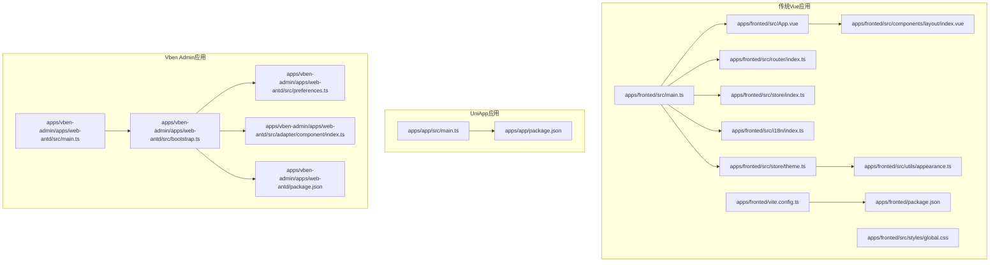
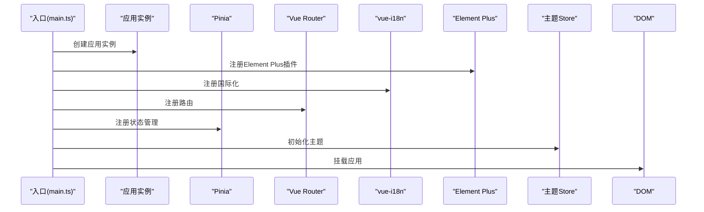
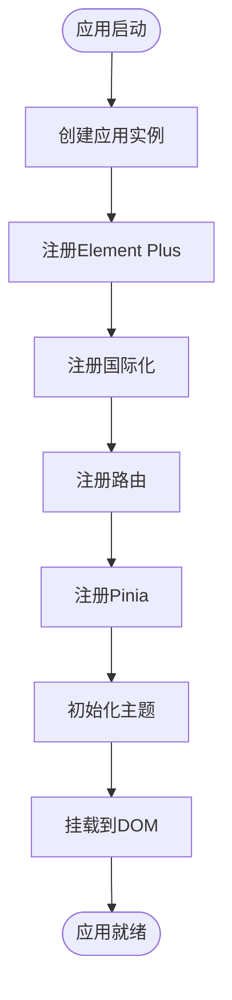
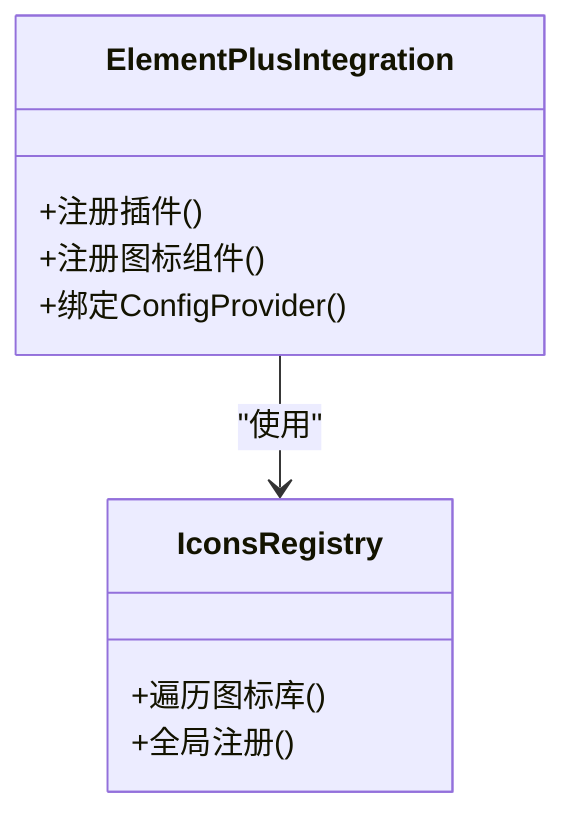
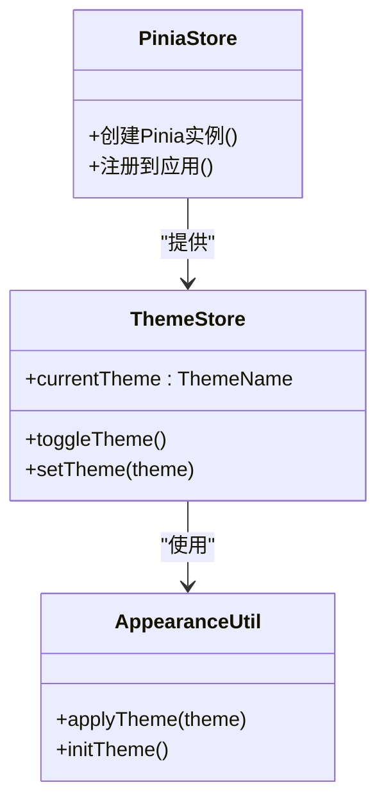
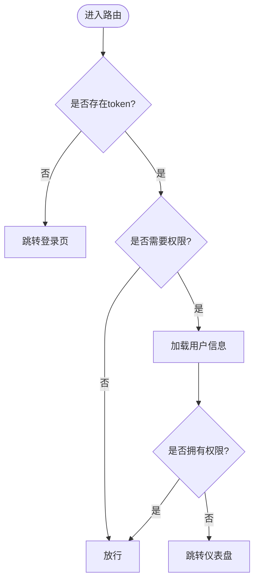
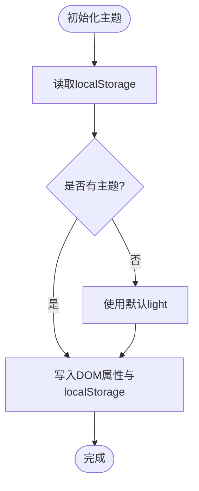
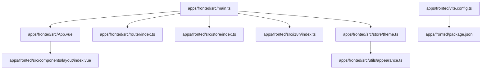

# Vue应用结构

<cite>
**本文档引用的文件**
- [apps/fronted/src/main.ts](file://apps/fronted/src/main.ts)
- [apps/fronted/src/App.vue](file://apps/fronted/src/App.vue)
- [apps/fronted/src/router/index.ts](file://apps/fronted/src/router/index.ts)
- [apps/fronted/src/store/index.ts](file://apps/fronted/src/store/index.ts)
- [apps/fronted/src/store/theme.ts](file://apps/fronted/src/store/theme.ts)
- [apps/fronted/src/utils/appearance.ts](file://apps/fronted/src/utils/appearance.ts)
- [apps/fronted/src/i18n/index.ts](file://apps/fronted/src/i18n/index.ts)
- [apps/fronted/src/components/layout/index.vue](file://apps/fronted/src/components/layout/index.vue)
- [apps/fronted/src/styles/global.css](file://apps/fronted/src/styles/global.css)
- [apps/fronted/vite.config.ts](file://apps/fronted/vite.config.ts)
- [apps/fronted/package.json](file://apps/fronted/package.json)
- [apps/app/src/main.ts](file://apps/app/src/main.ts)
- [apps/app/package.json](file://apps/app/package.json)
- [apps/vben-admin/apps/web-antd/src/main.ts](file://apps/vben-admin/apps/web-antd/src/main.ts)
- [apps/vben-admin/apps/web-antd/src/bootstrap.ts](file://apps/vben-admin/apps/web-antd/src/bootstrap.ts)
- [apps/vben-admin/apps/web-antd/src/preferences.ts](file://apps/vben-admin/apps/web-antd/src/preferences.ts)
- [apps/vben-admin/apps/web-antd/src/adapter/component/index.ts](file://apps/vben-admin/apps/web-antd/src/adapter/component/index.ts)
- [apps/vben-admin/apps/web-antd/package.json](file://apps/vben-admin/apps/web-antd/package.json)
</cite>

## 目录
1. [简介](#简介)
2. [项目结构](#项目结构)
3. [核心组件](#核心组件)
4. [架构总览](#架构总览)
5. [详细组件分析](#详细组件分析)
6. [依赖关系分析](#依赖关系分析)
7. [性能考虑](#性能考虑)
8. [故障排除指南](#故障排除指南)
9. [结论](#结论)

## 简介
本文件面向Vue 3应用的结构化文档，围绕以下目标展开：应用初始化流程（应用实例创建、插件注册、全局配置）、Element Plus UI框架集成与图标系统使用、Pinia状态管理配置与使用、应用启动流程与生命周期管理、全局样式配置与主题初始化最佳实践、开发与生产环境配置差异、第三方库集成与版本兼容性考量。文档同时对比了多套前端实现（传统Vue + Element Plus、UniApp、Vben Admin），帮助读者在不同场景下选择合适的架构模式。

## 项目结构
本仓库包含多个前端应用与工程化方案：
- 传统Vue 3 + Element Plus + Pinia + Vue Router + Vite：位于 apps/fronted
- UniApp 多端应用：位于 apps/app
- Vben Admin（基于Vite + Ant Design Vue）：位于 apps/vben-admin/apps/web-antd

**图表来源**
- [apps/fronted/src/main.ts:1-27](file://apps/fronted/src/main.ts#L1-L27)
- [apps/fronted/src/App.vue:1-16](file://apps/fronted/src/App.vue#L1-L16)
- [apps/fronted/src/router/index.ts:1-160](file://apps/fronted/src/router/index.ts#L1-L160)
- [apps/fronted/src/store/index.ts:1-5](file://apps/fronted/src/store/index.ts#L1-L5)
- [apps/fronted/src/store/theme.ts:1-24](file://apps/fronted/src/store/theme.ts#L1-L24)
- [apps/fronted/src/utils/appearance.ts:1-13](file://apps/fronted/src/utils/appearance.ts#L1-L13)
- [apps/fronted/src/i18n/index.ts:1-703](file://apps/fronted/src/i18n/index.ts#L1-L703)
- [apps/fronted/src/components/layout/index.vue:1-234](file://apps/fronted/src/components/layout/index.vue#L1-L234)
- [apps/fronted/src/styles/global.css:1-297](file://apps/fronted/src/styles/global.css#L1-L297)
- [apps/fronted/vite.config.ts:1-28](file://apps/fronted/vite.config.ts#L1-L28)
- [apps/fronted/package.json:1-34](file://apps/fronted/package.json#L1-L34)
- [apps/app/src/main.ts:1-9](file://apps/app/src/main.ts#L1-L9)
- [apps/app/package.json:1-72](file://apps/app/package.json#L1-L72)
- [apps/vben-admin/apps/web-antd/src/main.ts:1-33](file://apps/vben-admin/apps/web-antd/src/main.ts#L1-L33)
- [apps/vben-admin/apps/web-antd/src/bootstrap.ts:1-77](file://apps/vben-admin/apps/web-antd/src/bootstrap.ts#L1-L77)
- [apps/vben-admin/apps/web-antd/src/preferences.ts:1-77](file://apps/vben-admin/apps/web-antd/src/preferences.ts#L1-L77)
- [apps/vben-admin/apps/web-antd/src/adapter/component/index.ts:1-744](file://apps/vben-admin/apps/web-antd/src/adapter/component/index.ts#L1-L744)
- [apps/vben-admin/apps/web-antd/package.json:1-52](file://apps/vben-admin/apps/web-antd/package.json#L1-L52)

**章节来源**
- [apps/fronted/src/main.ts:1-27](file://apps/fronted/src/main.ts#L1-L27)
- [apps/fronted/package.json:1-34](file://apps/fronted/package.json#L1-L34)
- [apps/app/src/main.ts:1-9](file://apps/app/src/main.ts#L1-L9)
- [apps/app/package.json:1-72](file://apps/app/package.json#L1-L72)
- [apps/vben-admin/apps/web-antd/src/main.ts:1-33](file://apps/vben-admin/apps/web-antd/src/main.ts#L1-L33)

## 核心组件
本节聚焦于传统Vue应用的核心初始化与配置组件，涵盖应用实例创建、插件注册、全局配置、国际化、主题与样式等。

- 应用实例创建与挂载
  - 传统Vue应用通过入口文件创建应用实例，并按顺序注册插件与全局配置，最后挂载到DOM节点。
  - 关键点：Element Plus插件注册、路由与Pinia注册顺序、i18n国际化、主题初始化。

- 插件注册与全局配置
  - Element Plus：引入UI库与样式，注册图标组件，配置Element Plus的国际化。
  - Vue Router：定义路由表与导航守卫，实现权限控制与登录拦截。
  - Pinia：创建全局状态管理实例，提供主题与用户状态。
  - 国际化：基于vue-i18n，支持中英切换与本地持久化。

- 主题与样式
  - 主题切换：通过Pinia Store维护当前主题，配合工具函数写入DOM属性与localStorage。
  - 全局样式：Tailwind CSS + DaisyUI，统一设计令牌与组件样式。

**章节来源**
- [apps/fronted/src/main.ts:1-27](file://apps/fronted/src/main.ts#L1-L27)
- [apps/fronted/src/App.vue:1-16](file://apps/fronted/src/App.vue#L1-L16)
- [apps/fronted/src/router/index.ts:1-160](file://apps/fronted/src/router/index.ts#L1-L160)
- [apps/fronted/src/store/index.ts:1-5](file://apps/fronted/src/store/index.ts#L1-L5)
- [apps/fronted/src/store/theme.ts:1-24](file://apps/fronted/src/store/theme.ts#L1-L24)
- [apps/fronted/src/utils/appearance.ts:1-13](file://apps/fronted/src/utils/appearance.ts#L1-L13)
- [apps/fronted/src/i18n/index.ts:1-703](file://apps/fronted/src/i18n/index.ts#L1-L703)
- [apps/fronted/src/styles/global.css:1-297](file://apps/fronted/src/styles/global.css#L1-L297)

## 架构总览
下面以序列图展示传统Vue应用的启动流程：从入口文件开始，依次初始化插件、注册全局组件、应用国际化与主题、挂载应用。

**图表来源**
- [apps/fronted/src/main.ts:12-26](file://apps/fronted/src/main.ts#L12-L26)
- [apps/fronted/src/App.vue:1-16](file://apps/fronted/src/App.vue#L1-L16)
- [apps/fronted/src/router/index.ts:1-160](file://apps/fronted/src/router/index.ts#L1-L160)
- [apps/fronted/src/store/theme.ts:1-24](file://apps/fronted/src/store/theme.ts#L1-L24)

## 详细组件分析

### 应用初始化与生命周期管理
- 初始化流程
  - 创建应用实例：在入口文件中创建应用实例，随后依次注册插件与全局配置。
  - 插件注册顺序：Element Plus → i18n → Router → Pinia，确保后续组件能正确使用这些能力。
  - 主题初始化：调用主题Store进行初始化，读取本地存储的主题并写入DOM属性。
  - 挂载：将应用挂载到根容器，完成启动。

- 生命周期要点
  - 组件级生命周期：在布局组件中使用mounted钩子拉取用户信息，确保路由守卫后的首屏体验。
  - 应用级生命周期：通过入口文件集中管理插件注册与挂载，保证全局一致性。

**图表来源**
- [apps/fronted/src/main.ts:12-26](file://apps/fronted/src/main.ts#L12-L26)

**章节来源**
- [apps/fronted/src/main.ts:1-27](file://apps/fronted/src/main.ts#L1-L27)
- [apps/fronted/src/components/layout/index.vue:213-222](file://apps/fronted/src/components/layout/index.vue#L213-L222)

### Element Plus UI框架集成与图标系统
- 集成方式
  - 引入Element Plus插件与全局样式，确保组件库样式完整。
  - 通过遍历图标库将图标组件注册为全局组件，便于在模板中直接使用。

- 国际化配置
  - 在根组件中通过ConfigProvider绑定当前语言，实现UI文案随i18n切换。

**图表来源**
- [apps/fronted/src/main.ts:15-18](file://apps/fronted/src/main.ts#L15-L18)
- [apps/fronted/src/App.vue:2-4](file://apps/fronted/src/App.vue#L2-L4)

**章节来源**
- [apps/fronted/src/main.ts:3-23](file://apps/fronted/src/main.ts#L3-L23)
- [apps/fronted/src/App.vue:7-14](file://apps/fronted/src/App.vue#L7-L14)

### Pinia状态管理配置与使用
- 全局状态实例
  - 在入口文件创建Pinia实例并注册到应用，确保全局可用。
  - 提供主题Store与用户Store，分别负责主题切换与用户信息管理。

- 主题Store
  - 维护当前主题（light/dark），提供切换与设置方法。
  - 切换时写入DOM属性与localStorage，实现持久化与即时生效。

**图表来源**
- [apps/fronted/src/store/index.ts:1-5](file://apps/fronted/src/store/index.ts#L1-L5)
- [apps/fronted/src/store/theme.ts:1-24](file://apps/fronted/src/store/theme.ts#L1-L24)
- [apps/fronted/src/utils/appearance.ts:1-13](file://apps/fronted/src/utils/appearance.ts#L1-L13)

**章节来源**
- [apps/fronted/src/store/index.ts:1-5](file://apps/fronted/src/store/index.ts#L1-L5)
- [apps/fronted/src/store/theme.ts:1-24](file://apps/fronted/src/store/theme.ts#L1-L24)
- [apps/fronted/src/utils/appearance.ts:1-13](file://apps/fronted/src/utils/appearance.ts#L1-L13)

### 应用启动流程与路由守卫
- 路由表与导航守卫
  - 定义基础路由与嵌套路由，设置元信息（标题、权限标识）。
  - 导航守卫中检查token与权限，未登录跳转登录页，无权限跳转仪表盘。

- 登录拦截与权限校验
  - 未登录访问受保护路由时重定向至登录页。
  - 访问需要权限的路由时，先拉取用户信息并校验权限。

**图表来源**
- [apps/fronted/src/router/index.ts:131-157](file://apps/fronted/src/router/index.ts#L131-L157)

**章节来源**
- [apps/fronted/src/router/index.ts:1-160](file://apps/fronted/src/router/index.ts#L1-L160)

### 全局样式配置与主题初始化最佳实践
- 样式体系
  - Tailwind CSS + DaisyUI：通过Tailwind的@theme与DaisyUI插件实现主题令牌与组件样式的统一。
  - 全局CSS：定义基础排版、过渡动画、滚动条、卡片、表格、按钮等通用样式。

- 主题初始化
  - 从localStorage读取主题，若不存在则默认light，写入DOM属性与本地存储，实现持久化主题。

**图表来源**
- [apps/fronted/src/utils/appearance.ts:8-12](file://apps/fronted/src/utils/appearance.ts#L8-L12)
- [apps/fronted/src/styles/global.css:267-269](file://apps/fronted/src/styles/global.css#L267-L269)

**章节来源**
- [apps/fronted/src/styles/global.css:1-297](file://apps/fronted/src/styles/global.css#L1-L297)
- [apps/fronted/src/utils/appearance.ts:1-13](file://apps/fronted/src/utils/appearance.ts#L1-L13)

### 开发环境与生产环境配置差异
- Vite配置
  - 别名：@指向src目录，提升导入便捷性。
  - 代理：将/api与/file请求代理到后端服务端口，便于前后端联调。
  - 服务器：默认端口5173，可按需调整。

- 环境变量
  - 生产环境：通过构建脚本注入PROD标志，影响应用行为（如加载优化）。
  - 开发环境：本地调试，端口与代理配置便于联调。

**章节来源**
- [apps/fronted/vite.config.ts:1-28](file://apps/fronted/vite.config.ts#L1-L28)

### 第三方库集成方法与版本兼容性
- 传统Vue应用依赖
  - Vue 3、Element Plus、vue-i18n、Pinia、Vue Router、Axios、ECharts、Tailwind CSS、DaisyUI等。
  - 版本选择遵循Vue 3生态主流版本，确保兼容性与稳定性。

- UniApp应用依赖
  - 基于@uni-app系列包，支持H5、小程序、快应用等多端编译与运行。
  - 版本号统一，避免多端差异导致的兼容问题。

- Vben Admin应用依赖
  - 采用工作区（workspace）与catalog:解析，统一管理依赖版本，减少重复与冲突。
  - 通过@vben前缀包实现模块化拆分，便于扩展与维护。

**章节来源**
- [apps/fronted/package.json:1-34](file://apps/fronted/package.json#L1-L34)
- [apps/app/package.json:1-72](file://apps/app/package.json#L1-L72)
- [apps/vben-admin/apps/web-antd/package.json:1-52](file://apps/vben-admin/apps/web-antd/package.json#L1-L52)

## 依赖关系分析
本节从模块间依赖角度梳理应用结构，突出入口文件对各插件与配置的依赖关系。

**图表来源**
- [apps/fronted/src/main.ts:1-27](file://apps/fronted/src/main.ts#L1-L27)
- [apps/fronted/src/App.vue:1-16](file://apps/fronted/src/App.vue#L1-L16)
- [apps/fronted/src/router/index.ts:1-160](file://apps/fronted/src/router/index.ts#L1-L160)
- [apps/fronted/src/store/index.ts:1-5](file://apps/fronted/src/store/index.ts#L1-L5)
- [apps/fronted/src/store/theme.ts:1-24](file://apps/fronted/src/store/theme.ts#L1-L24)
- [apps/fronted/src/utils/appearance.ts:1-13](file://apps/fronted/src/utils/appearance.ts#L1-L13)
- [apps/fronted/src/components/layout/index.vue:1-234](file://apps/fronted/src/components/layout/index.vue#L1-L234)
- [apps/fronted/vite.config.ts:1-28](file://apps/fronted/vite.config.ts#L1-L28)
- [apps/fronted/package.json:1-34](file://apps/fronted/package.json#L1-L34)

**章节来源**
- [apps/fronted/src/main.ts:1-27](file://apps/fronted/src/main.ts#L1-L27)
- [apps/fronted/src/router/index.ts:1-160](file://apps/fronted/src/router/index.ts#L1-L160)
- [apps/fronted/src/store/theme.ts:1-24](file://apps/fronted/src/store/theme.ts#L1-L24)

## 性能考虑
- 懒加载与异步组件
  - 路由组件采用动态导入，减少首屏包体，提升初始加载速度。
- 图标与UI库
  - Element Plus按需引入与图标批量注册，避免全量引入造成体积膨胀。
- 样式与主题
  - Tailwind + DaisyUI组合提供原子化样式，减少自定义CSS体积；主题切换通过dataset切换，避免重绘开销。
- 构建与代理
  - Vite代理仅在开发环境生效，生产环境通过Nginx或CDN处理跨域与静态资源。

## 故障排除指南
- 登录后无法跳转
  - 检查路由守卫中token读取与next调用逻辑，确保未登录时跳转登录页。
- 权限不足被拦截
  - 确认用户权限拉取成功且权限列表包含所需权限标识。
- 主题切换无效
  - 检查localStorage写入与DOM属性变更，确认appearance工具函数执行。
- 国际化文案不生效
  - 确认i18n实例创建与locale持久化逻辑，检查App.vue中ConfigProvider绑定的语言。

**章节来源**
- [apps/fronted/src/router/index.ts:131-157](file://apps/fronted/src/router/index.ts#L131-L157)
- [apps/fronted/src/utils/appearance.ts:1-13](file://apps/fronted/src/utils/appearance.ts#L1-L13)
- [apps/fronted/src/i18n/index.ts:686-703](file://apps/fronted/src/i18n/index.ts#L686-L703)
- [apps/fronted/src/App.vue:7-14](file://apps/fronted/src/App.vue#L7-L14)

## 结论
本项目提供了三种不同的Vue应用实现路径：传统Vue + Element Plus（适合桌面Web）、UniApp（适合多端统一开发）、Vben Admin（适合企业级后台管理）。无论选择哪种方案，都应遵循统一的应用初始化流程、插件注册顺序、全局配置与主题样式策略。通过Pinia实现状态管理，结合Element Plus与Tailwind/DaisyUI构建一致的UI体验，并利用路由守卫保障安全与权限控制。在开发与生产环境中合理配置Vite与代理，确保开发效率与上线质量。