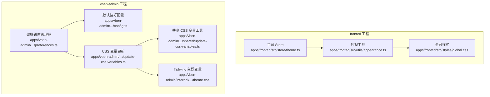
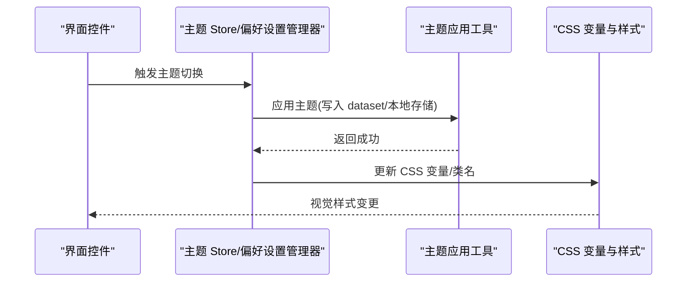
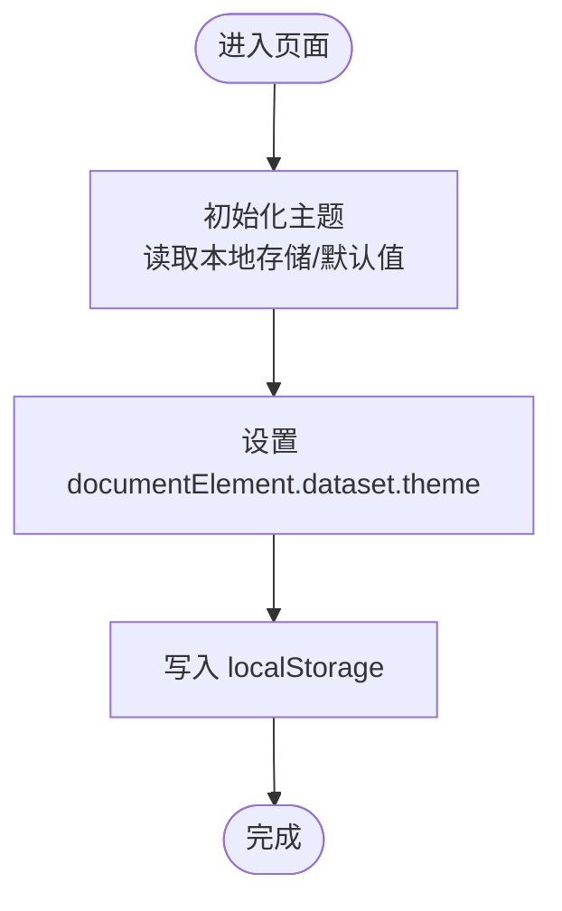
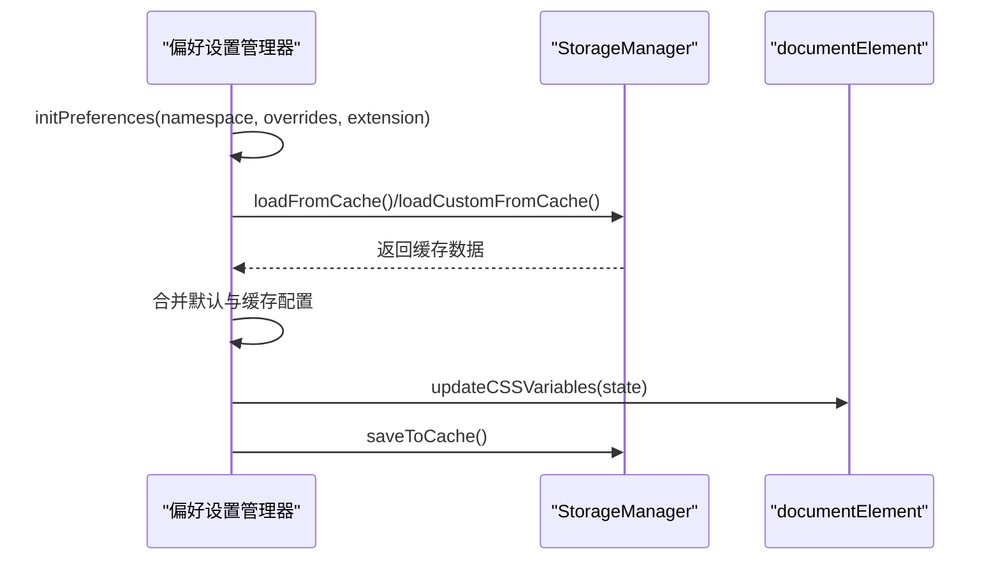
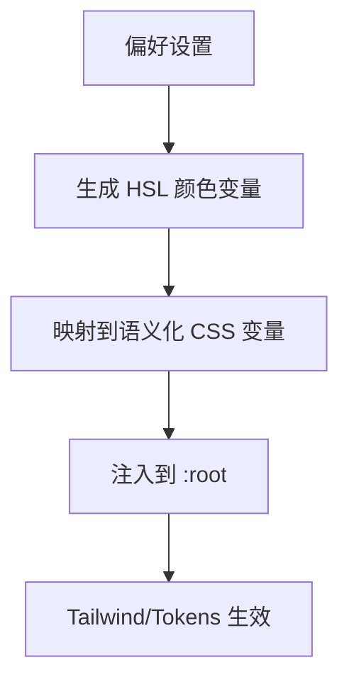
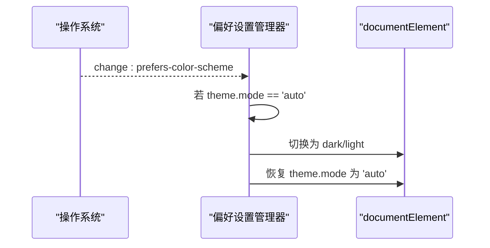
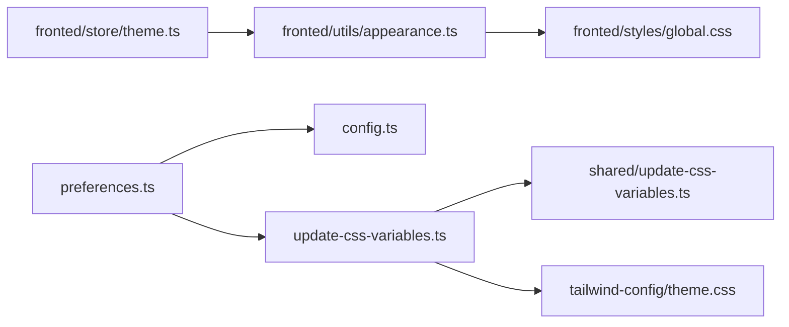

# 主题系统

<cite>
**本文引用的文件**
- [apps/fronted/src/store/theme.ts](file://apps/fronted/src/store/theme.ts)
- [apps/fronted/src/utils/appearance.ts](file://apps/fronted/src/utils/appearance.ts)
- [apps/fronted/src/styles/global.css](file://apps/fronted/src/styles/global.css)
- [apps/vben-admin/packages/@core/preferences/src/preferences.ts](file://apps/vben-admin/packages/@core/preferences/src/preferences.ts)
- [apps/vben-admin/packages/@core/preferences/src/config.ts](file://apps/vben-admin/packages/@core/preferences/src/config.ts)
- [apps/vben-admin/packages/@core/preferences/src/update-css-variables.ts](file://apps/vben-admin/packages/@core/preferences/src/update-css-variables.ts)
- [apps/vben-admin/internal/tailwind-config/src/theme.css](file://apps/vben-admin/internal/tailwind-config/src/theme.css)
- [apps/vben-admin/packages/@core/base/shared/src/utils/update-css-variables.ts](file://apps/vben-admin/packages/@core/base/shared/src/utils/update-css-variables.ts)
</cite>

## 目录
1. [简介](#简介)
2. [项目结构](#项目结构)
3. [核心组件](#核心组件)
4. [架构总览](#架构总览)
5. [详细组件分析](#详细组件分析)
6. [依赖关系分析](#依赖关系分析)
7. [性能考量](#性能考量)
8. [故障排查指南](#故障排查指南)
9. [结论](#结论)
10. [附录](#附录)

## 简介
本主题系统围绕“玻璃拟态”风格设计，提供浅色/深色/自动三种模式，支持主题切换、CSS 变量驱动的动态样式更新、暗黑/浅色自动跟随系统偏好、以及持久化存储与用户偏好设置。系统同时兼容两套前端工程（fronted 与 vben-admin），分别采用不同的主题管理策略与样式体系，但共享统一的主题状态模型与切换机制。

## 项目结构
主题系统涉及以下关键模块：
- 前端工程 fronted：基于 Pinia 的轻量主题状态管理，配合本地存储与 dataset 切换主题。
- 前端工程 vben-admin：基于偏好设置管理器的完整主题系统，支持多主题预设、CSS 变量动态更新、系统偏好监听与持久化。
- 样式层：global.css 与 tailwind-config/theme.css 提供基础变量、过渡动画与组件级样式，支撑玻璃拟态视觉效果。

**图表来源**
- [apps/fronted/src/store/theme.ts:1-24](file://apps/fronted/src/store/theme.ts#L1-L24)
- [apps/fronted/src/utils/appearance.ts:1-13](file://apps/fronted/src/utils/appearance.ts#L1-L13)
- [apps/fronted/src/styles/global.css:1-297](file://apps/fronted/src/styles/global.css#L1-L297)
- [apps/vben-admin/packages/@core/preferences/src/preferences.ts:1-465](file://apps/vben-admin/packages/@core/preferences/src/preferences.ts#L1-L465)
- [apps/vben-admin/packages/@core/preferences/src/config.ts:1-150](file://apps/vben-admin/packages/@core/preferences/src/config.ts#L1-L150)
- [apps/vben-admin/packages/@core/preferences/src/update-css-variables.ts:1-130](file://apps/vben-admin/packages/@core/preferences/src/update-css-variables.ts#L1-L130)
- [apps/vben-admin/packages/@core/base/shared/src/utils/update-css-variables.ts:1-36](file://apps/vben-admin/packages/@core/base/shared/src/utils/update-css-variables.ts#L1-L36)
- [apps/vben-admin/internal/tailwind-config/src/theme.css:1-580](file://apps/vben-admin/internal/tailwind-config/src/theme.css#L1-L580)

**章节来源**
- [apps/fronted/src/store/theme.ts:1-24](file://apps/fronted/src/store/theme.ts#L1-L24)
- [apps/fronted/src/utils/appearance.ts:1-13](file://apps/fronted/src/utils/appearance.ts#L1-L13)
- [apps/fronted/src/styles/global.css:1-297](file://apps/fronted/src/styles/global.css#L1-L297)
- [apps/vben-admin/packages/@core/preferences/src/preferences.ts:1-465](file://apps/vben-admin/packages/@core/preferences/src/preferences.ts#L1-L465)
- [apps/vben-admin/packages/@core/preferences/src/config.ts:1-150](file://apps/vben-admin/packages/@core/preferences/src/config.ts#L1-L150)
- [apps/vben-admin/packages/@core/preferences/src/update-css-variables.ts:1-130](file://apps/vben-admin/packages/@core/preferences/src/update-css-variables.ts#L1-L130)
- [apps/vben-admin/packages/@core/base/shared/src/utils/update-css-variables.ts:1-36](file://apps/vben-admin/packages/@core/base/shared/src/utils/update-css-variables.ts#L1-L36)
- [apps/vben-admin/internal/tailwind-config/src/theme.css:1-580](file://apps/vben-admin/internal/tailwind-config/src/theme.css#L1-L580)

## 核心组件
- fronted 轻量主题 Store：负责主题状态的读取、切换与应用，使用 dataset 与本地存储进行主题标记与持久化。
- vben-admin 偏好设置管理器：提供完整的主题配置、持久化、系统偏好监听与 CSS 变量动态更新能力。
- CSS 变量更新链路：从偏好设置到内置主题预设解析，再到主色变量生成与最终注入到文档根节点。
- 样式层：global.css 与 tailwind-config/theme.css 定义过渡动画、组件样式与语义化颜色变量，支撑玻璃拟态视觉。

**章节来源**
- [apps/fronted/src/store/theme.ts:5-24](file://apps/fronted/src/store/theme.ts#L5-L24)
- [apps/fronted/src/utils/appearance.ts:3-13](file://apps/fronted/src/utils/appearance.ts#L3-L13)
- [apps/vben-admin/packages/@core/preferences/src/preferences.ts:32-162](file://apps/vben-admin/packages/@core/preferences/src/preferences.ts#L32-L162)
- [apps/vben-admin/packages/@core/preferences/src/update-css-variables.ts:12-82](file://apps/vben-admin/packages/@core/preferences/src/update-css-variables.ts#L12-L82)
- [apps/fronted/src/styles/global.css:265-270](file://apps/fronted/src/styles/global.css#L265-L270)
- [apps/vben-admin/internal/tailwind-config/src/theme.css:43-234](file://apps/vben-admin/internal/tailwind-config/src/theme.css#L43-L234)

## 架构总览
主题系统由“状态管理 → 主题应用 → 样式更新 → 视觉呈现”四层构成。fronted 侧重于简单切换，vben-admin 提供可扩展的配置与持久化方案。

**图表来源**
- [apps/fronted/src/store/theme.ts:8-17](file://apps/fronted/src/store/theme.ts#L8-L17)
- [apps/fronted/src/utils/appearance.ts:3-13](file://apps/fronted/src/utils/appearance.ts#L3-L13)
- [apps/vben-admin/packages/@core/preferences/src/preferences.ts:238-254](file://apps/vben-admin/packages/@core/preferences/src/preferences.ts#L238-L254)
- [apps/vben-admin/packages/@core/preferences/src/update-css-variables.ts:12-82](file://apps/vben-admin/packages/@core/preferences/src/update-css-variables.ts#L12-L82)

## 详细组件分析

### fronted 轻量主题系统
- 主题状态：使用 Pinia Store 管理当前主题，初始值来自本地存储或默认浅色。
- 切换机制：toggleTheme 根据当前主题在 light/dark 间切换；setTheme 支持直接指定主题。
- 应用方式：通过 dataset 设置 data-theme，并持久化到 localStorage，配合全局样式中的过渡与组件样式生效。

**图表来源**
- [apps/fronted/src/store/theme.ts:6-12](file://apps/fronted/src/store/theme.ts#L6-L12)
- [apps/fronted/src/utils/appearance.ts:8-13](file://apps/fronted/src/utils/appearance.ts#L8-L13)

**章节来源**
- [apps/fronted/src/store/theme.ts:1-24](file://apps/fronted/src/store/theme.ts#L1-L24)
- [apps/fronted/src/utils/appearance.ts:1-13](file://apps/fronted/src/utils/appearance.ts#L1-L13)
- [apps/fronted/src/styles/global.css:267-269](file://apps/fronted/src/styles/global.css#L267-L269)

### vben-admin 偏好设置与主题系统
- 初始化流程：构造函数不立即读取缓存，initPreferences 异步合并默认配置与缓存，再触发 UI 更新与持久化。
- 主题持久化：分别以独立键保存主偏好、语言与主题模式，确保跨模块一致性。
- 自动跟随系统：监听 prefers-color-scheme 变化，在 auto 模式下即时切换并恢复 auto 状态。
- CSS 变量更新：根据内置主题类型与用户自定义颜色生成 HSL 变量，统一映射到语义化 CSS 变量并注入到文档根节点。

**图表来源**
- [apps/vben-admin/packages/@core/preferences/src/preferences.ts:112-162](file://apps/vben-admin/packages/@core/preferences/src/preferences.ts#L112-L162)
- [apps/vben-admin/packages/@core/preferences/src/preferences.ts:331-407](file://apps/vben-admin/packages/@core/preferences/src/preferences.ts#L331-L407)
- [apps/vben-admin/packages/@core/preferences/src/update-css-variables.ts:12-82](file://apps/vben-admin/packages/@core/preferences/src/update-css-variables.ts#L12-L82)

**章节来源**
- [apps/vben-admin/packages/@core/preferences/src/preferences.ts:32-162](file://apps/vben-admin/packages/@core/preferences/src/preferences.ts#L32-L162)
- [apps/vben-admin/packages/@core/preferences/src/preferences.ts:412-447](file://apps/vben-admin/packages/@core/preferences/src/preferences.ts#L412-L447)
- [apps/vben-admin/packages/@core/preferences/src/update-css-variables.ts:12-127](file://apps/vben-admin/packages/@core/preferences/src/update-css-variables.ts#L12-L127)

### CSS 变量与主题样式动态更新
- 变量生成：根据用户选择的颜色（主色/破坏色/成功色/警告色）生成 HSL 变量集。
- 映射注入：将生成的变量映射到语义化 CSS 变量（如 --primary/--destructive 等），并通过共享工具注入到文档根节点。
- Tailwind 适配：tailwind-config/theme.css 定义了丰富的语义化颜色变量与阴影、动画等基础令牌，fronted 的 global.css 也提供过渡与组件级样式。

**图表来源**
- [apps/vben-admin/packages/@core/preferences/src/update-css-variables.ts:88-119](file://apps/vben-admin/packages/@core/preferences/src/update-css-variables.ts#L88-L119)
- [apps/vben-admin/packages/@core/base/shared/src/utils/update-css-variables.ts:5-33](file://apps/vben-admin/packages/@core/base/shared/src/utils/update-css-variables.ts#L5-L33)
- [apps/vben-admin/internal/tailwind-config/src/theme.css:43-234](file://apps/vben-admin/internal/tailwind-config/src/theme.css#L43-L234)
- [apps/fronted/src/styles/global.css:21-32](file://apps/fronted/src/styles/global.css#L21-L32)

**章节来源**
- [apps/vben-admin/packages/@core/preferences/src/update-css-variables.ts:88-119](file://apps/vben-admin/packages/@core/preferences/src/update-css-variables.ts#L88-L119)
- [apps/vben-admin/packages/@core/base/shared/src/utils/update-css-variables.ts:1-36](file://apps/vben-admin/packages/@core/base/shared/src/utils/update-css-variables.ts#L1-L36)
- [apps/vben-admin/internal/tailwind-config/src/theme.css:43-234](file://apps/vben-admin/internal/tailwind-config/src/theme.css#L43-L234)
- [apps/fronted/src/styles/global.css:21-32](file://apps/fronted/src/styles/global.css#L21-L32)

### 暗黑/浅色模式自动切换逻辑
- fronted：通过本地存储记录用户选择，dataset 标记当前主题，无系统偏好监听。
- vben-admin：监听系统 prefers-color-scheme，当处于 auto 模式时跟随系统并在切换后恢复 auto，保证用户手动切换与系统偏好一致。

**图表来源**
- [apps/vben-admin/packages/@core/preferences/src/preferences.ts:432-446](file://apps/vben-admin/packages/@core/preferences/src/preferences.ts#L432-L446)

**章节来源**
- [apps/vben-admin/packages/@core/preferences/src/preferences.ts:432-446](file://apps/vben-admin/packages/@core/preferences/src/preferences.ts#L432-L446)

### 主题定制开发指南与最佳实践
- 使用偏好设置管理器：通过 initPreferences 注入命名空间与覆盖项，利用扩展字段定义自定义偏好。
- 动态更新 CSS 变量：在 handleUpdates 中对 theme 字段进行监听，调用 updateCSSVariables 实现主题色与字号、圆角等的实时更新。
- 持久化策略：使用 StorageManager 按键保存主偏好、语言与主题模式，避免频繁写入，使用防抖控制保存频率。
- 最佳实践：
  - 优先使用语义化 CSS 变量（如 --primary/--background），减少硬编码颜色。
  - 在 auto 模式下谨慎处理用户手动切换，避免覆盖用户意图。
  - 对颜色变量进行 HSL 转换与映射，确保明暗环境下可读性与对比度。

**章节来源**
- [apps/vben-admin/packages/@core/preferences/src/preferences.ts:112-162](file://apps/vben-admin/packages/@core/preferences/src/preferences.ts#L112-L162)
- [apps/vben-admin/packages/@core/preferences/src/preferences.ts:238-254](file://apps/vben-admin/packages/@core/preferences/src/preferences.ts#L238-L254)
- [apps/vben-admin/packages/@core/preferences/src/update-css-variables.ts:12-82](file://apps/vben-admin/packages/@core/preferences/src/update-css-variables.ts#L12-L82)

### 主题与组件样式的集成方法
- fronted：通过 dataset 切换主题，配合全局样式中的过渡与组件样式（如卡片、模态框、滚动条等）实现统一视觉。
- vben-admin：Tailwind 主题变量定义丰富语义色与阴影，结合组件层样式与动画，形成一致的玻璃拟态风格。

**章节来源**
- [apps/fronted/src/styles/global.css:169-182](file://apps/fronted/src/styles/global.css#L169-L182)
- [apps/fronted/src/styles/global.css:267-269](file://apps/fronted/src/styles/global.css#L267-L269)
- [apps/vben-admin/internal/tailwind-config/src/theme.css:43-234](file://apps/vben-admin/internal/tailwind-config/src/theme.css#L43-L234)

### 扩展性与自定义主题开发
- 内置主题预设：通过内置主题常量定义不同主题的主色与明暗变体，运行时根据当前模式选择对应颜色。
- 自定义颜色：允许用户覆盖主色/破坏色/成功色/警告色，系统将生成并注入对应的 CSS 变量。
- 圆角与字号：支持通过主题配置调整全局圆角与基础字号，联动菜单字号等派生变量。

**章节来源**
- [apps/vben-admin/packages/@core/preferences/src/update-css-variables.ts:38-82](file://apps/vben-admin/packages/@core/preferences/src/update-css-variables.ts#L38-L82)
- [apps/vben-admin/packages/@core/preferences/src/config.ts:117-129](file://apps/vben-admin/packages/@core/preferences/src/config.ts#L117-L129)

## 依赖关系分析
- fronted：store 依赖 appearance 工具；appearance 依赖 DOM 与 localStorage；global.css 提供过渡与组件样式。
- vben-admin：preferences 依赖 StorageManager、breakpoints、debounce 工具与默认配置；update-css-variables 依赖颜色生成与共享 CSS 变量工具；tailwind-config/theme.css 提供语义化变量与组件层样式。

**图表来源**
- [apps/fronted/src/store/theme.ts:1-24](file://apps/fronted/src/store/theme.ts#L1-L24)
- [apps/fronted/src/utils/appearance.ts:1-13](file://apps/fronted/src/utils/appearance.ts#L1-L13)
- [apps/fronted/src/styles/global.css:1-297](file://apps/fronted/src/styles/global.css#L1-L297)
- [apps/vben-admin/packages/@core/preferences/src/preferences.ts:1-465](file://apps/vben-admin/packages/@core/preferences/src/preferences.ts#L1-L465)
- [apps/vben-admin/packages/@core/preferences/src/config.ts:1-150](file://apps/vben-admin/packages/@core/preferences/src/config.ts#L1-L150)
- [apps/vben-admin/packages/@core/preferences/src/update-css-variables.ts:1-130](file://apps/vben-admin/packages/@core/preferences/src/update-css-variables.ts#L1-L130)
- [apps/vben-admin/packages/@core/base/shared/src/utils/update-css-variables.ts:1-36](file://apps/vben-admin/packages/@core/base/shared/src/utils/update-css-variables.ts#L1-L36)
- [apps/vben-admin/internal/tailwind-config/src/theme.css:1-580](file://apps/vben-admin/internal/tailwind-config/src/theme.css#L1-L580)

**章节来源**
- [apps/fronted/src/store/theme.ts:1-24](file://apps/fronted/src/store/theme.ts#L1-L24)
- [apps/fronted/src/utils/appearance.ts:1-13](file://apps/fronted/src/utils/appearance.ts#L1-L13)
- [apps/fronted/src/styles/global.css:1-297](file://apps/fronted/src/styles/global.css#L1-L297)
- [apps/vben-admin/packages/@core/preferences/src/preferences.ts:1-465](file://apps/vben-admin/packages/@core/preferences/src/preferences.ts#L1-L465)
- [apps/vben-admin/packages/@core/preferences/src/config.ts:1-150](file://apps/vben-admin/packages/@core/preferences/src/config.ts#L1-L150)
- [apps/vben-admin/packages/@core/preferences/src/update-css-variables.ts:1-130](file://apps/vben-admin/packages/@core/preferences/src/update-css-variables.ts#L1-L130)
- [apps/vben-admin/packages/@core/base/shared/src/utils/update-css-variables.ts:1-36](file://apps/vben-admin/packages/@core/base/shared/src/utils/update-css-variables.ts#L1-L36)
- [apps/vben-admin/internal/tailwind-config/src/theme.css:1-580](file://apps/vben-admin/internal/tailwind-config/src/theme.css#L1-L580)

## 性能考量
- 防抖保存：偏好设置管理器对保存操作进行防抖，降低频繁写入带来的性能开销。
- 条件更新：仅在主题或应用相关字段发生变化时触发 CSS 变量更新，避免不必要的重绘。
- 系统偏好监听：仅在 auto 模式下监听系统主题变化，减少事件处理成本。

**章节来源**
- [apps/vben-admin/packages/@core/preferences/src/preferences.ts:47](file://apps/vben-admin/packages/@core/preferences/src/preferences.ts#L47)
- [apps/vben-admin/packages/@core/preferences/src/preferences.ts:238-254](file://apps/vben-admin/packages/@core/preferences/src/preferences.ts#L238-L254)
- [apps/vben-admin/packages/@core/preferences/src/preferences.ts:432-446](file://apps/vben-admin/packages/@core/preferences/src/preferences.ts#L432-L446)

## 故障排查指南
- 主题切换无效：
  - fronted：检查 dataset 是否正确写入，localStorage 是否存在主题键，global.css 过渡与组件样式是否生效。
  - vben-admin：确认 handleUpdates 是否触发 updateCSSVariables，CSS 变量是否注入到 :root。
- 自动跟随异常：
  - 检查系统 prefers-color-scheme 事件监听是否注册，auto 模式下是否正确恢复。
- 持久化丢失：
  - 确认 StorageManager 的命名空间与键名，检查保存流程与错误日志。

**章节来源**
- [apps/fronted/src/utils/appearance.ts:3-13](file://apps/fronted/src/utils/appearance.ts#L3-L13)
- [apps/fronted/src/styles/global.css:267-269](file://apps/fronted/src/styles/global.css#L267-L269)
- [apps/vben-admin/packages/@core/preferences/src/preferences.ts:390-407](file://apps/vben-admin/packages/@core/preferences/src/preferences.ts#L390-L407)
- [apps/vben-admin/packages/@core/preferences/src/preferences.ts:432-446](file://apps/vben-admin/packages/@core/preferences/src/preferences.ts#L432-L446)

## 结论
该主题系统在 fronted 与 vben-admin 两端提供了从简单切换到完整配置的多层次实现。通过 dataset 与 CSS 变量的协同，系统实现了快速、可扩展的主题切换与动态样式更新；结合系统偏好监听与持久化策略，兼顾了用户体验与开发效率。建议在实际项目中优先采用 vben-admin 的偏好设置管理器方案，以获得更完善的主题定制与维护能力。

## 附录
- 设计理念与实现要点
  - 玻璃拟态：通过 backdrop-filter、透明度与阴影构建通透感，fronted 的 modal 与滚动条样式体现了该风格。
  - 动态变量：统一的 CSS 变量体系与 Tailwind 语义色，确保主题切换时视觉一致性。
  - 自动模式：在 auto 模式下尊重系统偏好，同时允许用户手动覆盖，提升可用性。

**章节来源**
- [apps/fronted/src/styles/global.css:169-182](file://apps/fronted/src/styles/global.css#L169-L182)
- [apps/fronted/src/styles/global.css:85-98](file://apps/fronted/src/styles/global.css#L85-L98)
- [apps/vben-admin/internal/tailwind-config/src/theme.css:43-234](file://apps/vben-admin/internal/tailwind-config/src/theme.css#L43-L234)