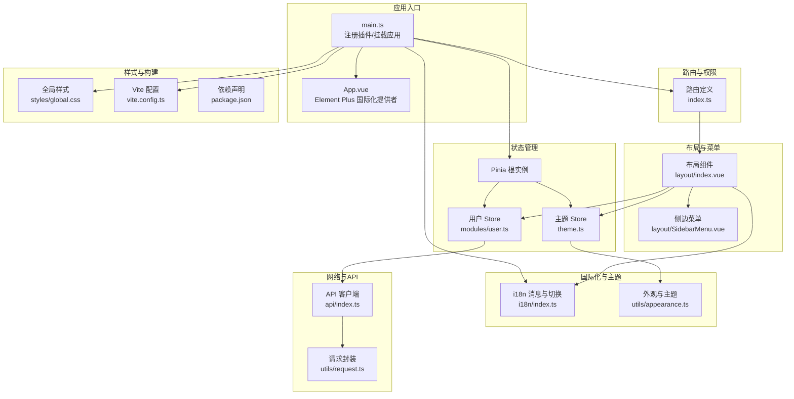
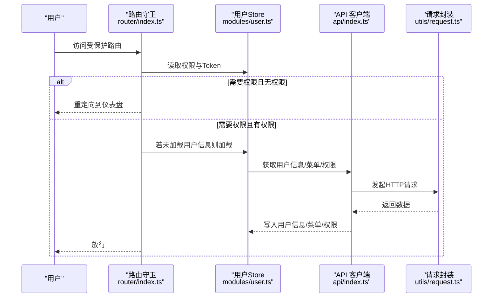
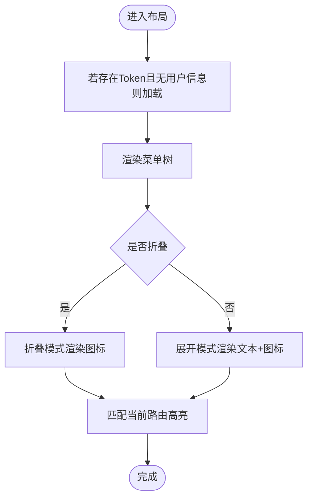
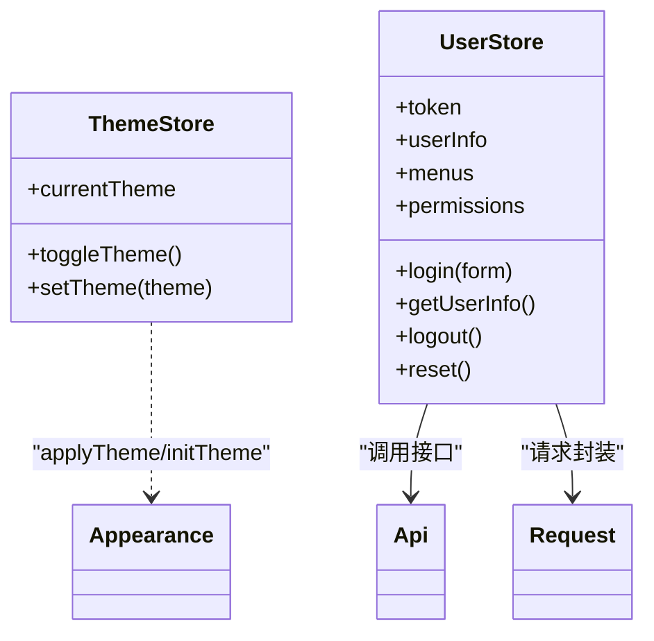
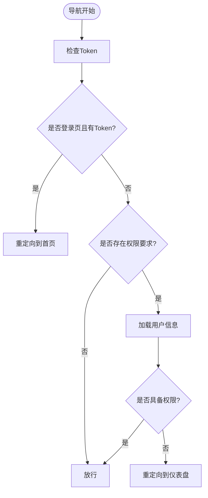
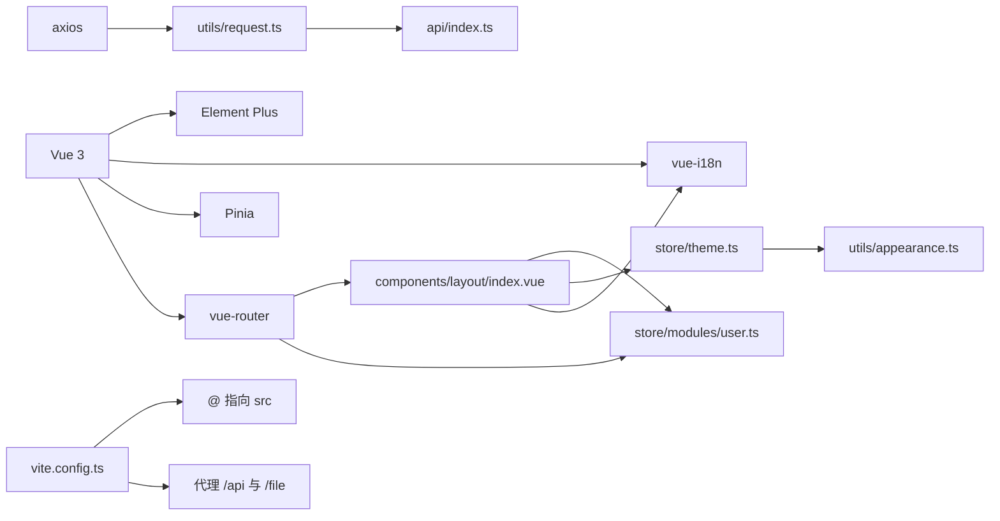

# 前端开发

<cite>
**本文引用的文件**
- [apps/fronted/src/main.ts](file://apps/fronted/src/main.ts)
- [apps/fronted/src/App.vue](file://apps/fronted/src/App.vue)
- [apps/fronted/src/router/index.ts](file://apps/fronted/src/router/index.ts)
- [apps/fronted/src/store/index.ts](file://apps/fronted/src/store/index.ts)
- [apps/fronted/src/store/theme.ts](file://apps/fronted/src/store/theme.ts)
- [apps/fronted/src/store/modules/user.ts](file://apps/fronted/src/store/modules/user.ts)
- [apps/fronted/src/components/layout/index.vue](file://apps/fronted/src/components/layout/index.vue)
- [apps/fronted/src/components/layout/SidebarMenu.vue](file://apps/fronted/src/components/layout/SidebarMenu.vue)
- [apps/fronted/src/i18n/index.ts](file://apps/fronted/src/i18n/index.ts)
- [apps/fronted/src/utils/appearance.ts](file://apps/fronted/src/utils/appearance.ts)
- [apps/fronted/src/utils/request.ts](file://apps/fronted/src/utils/request.ts)
- [apps/fronted/src/api/index.ts](file://apps/fronted/src/api/index.ts)
- [apps/fronted/src/views/system/user/index.vue](file://apps/fronted/src/views/system/user/index.vue)
- [apps/fronted/src/styles/global.css](file://apps/fronted/src/styles/global.css)
- [apps/fronted/vite.config.ts](file://apps/fronted/vite.config.ts)
- [apps/fronted/package.json](file://apps/fronted/package.json)
</cite>

## 目录
1. [简介](#简介)
2. [项目结构](#项目结构)
3. [核心组件](#核心组件)
4. [架构总览](#架构总览)
5. [详细组件分析](#详细组件分析)
6. [依赖关系分析](#依赖关系分析)
7. [性能考虑](#性能考虑)
8. [故障排查指南](#故障排查指南)
9. [结论](#结论)
10. [附录](#附录)

## 简介
本项目是一个基于 Vue 3 + Element Plus 的 Web 管理后台前端应用，采用 Pinia 进行状态管理、Vue Router 实现路由与权限守卫、TailwindCSS + daisyUI 提供现代化 UI 样式，内置国际化与主题切换能力。本文档面向前端开发者，系统性梳理组件层次设计、状态管理模式、路由系统、布局与动态菜单、权限控制、主题系统、国际化、页面开发规范、常用功能集成（ECharts 图表、文件上传、表单校验）以及开发与构建优化策略。

## 项目结构
前端工程位于 apps/fronted，采用按功能域划分的组织方式：
- 应用入口与全局配置：main.ts、App.vue、i18n、store、router
- 组件层：layout 布局与 SidebarMenu 动态菜单、通用组件
- 视图层：各业务页面（如系统管理、监控等）
- 工具与配置：appearance 主题工具、request 请求封装、样式全局样式
- 构建与依赖：vite.config.ts、package.json

**图表来源**
- [apps/fronted/src/main.ts:1-27](file://apps/fronted/src/main.ts#L1-L27)
- [apps/fronted/src/App.vue:1-16](file://apps/fronted/src/App.vue#L1-L16)
- [apps/fronted/src/router/index.ts:1-160](file://apps/fronted/src/router/index.ts#L1-L160)
- [apps/fronted/src/store/theme.ts:1-24](file://apps/fronted/src/store/theme.ts#L1-L24)
- [apps/fronted/src/store/modules/user.ts:1-75](file://apps/fronted/src/store/modules/user.ts#L1-L75)
- [apps/fronted/src/components/layout/index.vue:1-234](file://apps/fronted/src/components/layout/index.vue#L1-L234)
- [apps/fronted/src/components/layout/SidebarMenu.vue:1-131](file://apps/fronted/src/components/layout/SidebarMenu.vue#L1-L131)
- [apps/fronted/src/i18n/index.ts:1-703](file://apps/fronted/src/i18n/index.ts#L1-L703)
- [apps/fronted/src/utils/appearance.ts:1-13](file://apps/fronted/src/utils/appearance.ts#L1-L13)
- [apps/fronted/src/utils/request.ts:1-51](file://apps/fronted/src/utils/request.ts#L1-L51)
- [apps/fronted/src/api/index.ts:1-155](file://apps/fronted/src/api/index.ts#L1-L155)
- [apps/fronted/src/styles/global.css:1-297](file://apps/fronted/src/styles/global.css#L1-L297)
- [apps/fronted/vite.config.ts:1-28](file://apps/fronted/vite.config.ts#L1-L28)
- [apps/fronted/package.json:1-34](file://apps/fronted/package.json#L1-L34)

**章节来源**
- [apps/fronted/src/main.ts:1-27](file://apps/fronted/src/main.ts#L1-L27)
- [apps/fronted/src/router/index.ts:1-160](file://apps/fronted/src/router/index.ts#L1-L160)
- [apps/fronted/src/store/index.ts:1-5](file://apps/fronted/src/store/index.ts#L1-L5)
- [apps/fronted/src/store/theme.ts:1-24](file://apps/fronted/src/store/theme.ts#L1-L24)
- [apps/fronted/src/store/modules/user.ts:1-75](file://apps/fronted/src/store/modules/user.ts#L1-L75)
- [apps/fronted/src/components/layout/index.vue:1-234](file://apps/fronted/src/components/layout/index.vue#L1-L234)
- [apps/fronted/src/components/layout/SidebarMenu.vue:1-131](file://apps/fronted/src/components/layout/SidebarMenu.vue#L1-L131)
- [apps/fronted/src/i18n/index.ts:1-703](file://apps/fronted/src/i18n/index.ts#L1-L703)
- [apps/fronted/src/utils/appearance.ts:1-13](file://apps/fronted/src/utils/appearance.ts#L1-L13)
- [apps/fronted/src/utils/request.ts:1-51](file://apps/fronted/src/utils/request.ts#L1-L51)
- [apps/fronted/src/api/index.ts:1-155](file://apps/fronted/src/api/index.ts#L1-L155)
- [apps/fronted/src/styles/global.css:1-297](file://apps/fronted/src/styles/global.css#L1-L297)
- [apps/fronted/vite.config.ts:1-28](file://apps/fronted/vite.config.ts#L1-L28)
- [apps/fronted/package.json:1-34](file://apps/fronted/package.json#L1-L34)

## 核心组件
- 应用入口与插件注册：在入口中注册 Element Plus、Element Plus 图标、i18n、Pinia、Router，并初始化主题。
- 布局组件：提供响应式桌面/移动端布局、面包屑、主题切换、语言切换、用户下拉菜单、侧边栏折叠与动态菜单渲染。
- 用户状态：登录、获取用户信息（含菜单与权限）、登出、重置。
- 主题状态：主题初始化、切换与持久化。
- 路由与权限：基于 meta.perm 的权限守卫，结合用户权限进行访问控制。
- 国际化：基于 vue-i18n 的中英双语支持与动态切换。
- 请求封装：统一拦截器处理 Token 注入、错误提示与 401 处理。
- API 客户端：按模块导出 REST 接口，便于页面直接调用。

**章节来源**
- [apps/fronted/src/main.ts:1-27](file://apps/fronted/src/main.ts#L1-L27)
- [apps/fronted/src/components/layout/index.vue:1-234](file://apps/fronted/src/components/layout/index.vue#L1-L234)
- [apps/fronted/src/store/modules/user.ts:1-75](file://apps/fronted/src/store/modules/user.ts#L1-L75)
- [apps/fronted/src/store/theme.ts:1-24](file://apps/fronted/src/store/theme.ts#L1-L24)
- [apps/fronted/src/router/index.ts:1-160](file://apps/fronted/src/router/index.ts#L1-L160)
- [apps/fronted/src/i18n/index.ts:1-703](file://apps/fronted/src/i18n/index.ts#L1-L703)
- [apps/fronted/src/utils/request.ts:1-51](file://apps/fronted/src/utils/request.ts#L1-L51)
- [apps/fronted/src/api/index.ts:1-155](file://apps/fronted/src/api/index.ts#L1-L155)

## 架构总览
整体采用“入口 -> 插件注册 -> 全局状态/Pinia -> 路由与权限 -> 布局与菜单 -> 视图”的分层架构。数据流从 API 层经请求封装进入 Pinia Store，再由布局组件消费，配合路由守卫与菜单组件完成动态权限展示。

**图表来源**
- [apps/fronted/src/router/index.ts:130-157](file://apps/fronted/src/router/index.ts#L130-L157)
- [apps/fronted/src/store/modules/user.ts:45-52](file://apps/fronted/src/store/modules/user.ts#L45-L52)
- [apps/fronted/src/api/index.ts:1-155](file://apps/fronted/src/api/index.ts#L1-L155)
- [apps/fronted/src/utils/request.ts:1-51](file://apps/fronted/src/utils/request.ts#L1-L51)

## 详细组件分析

### 布局与动态菜单
- 响应式布局：移动端抽屉式侧边栏，桌面端支持折叠与面包屑导航；顶部包含主题切换、语言切换、用户下拉菜单。
- 动态菜单：根据用户 Store 中的菜单树渲染，支持带子菜单的折叠与高亮；菜单标题通过 i18n 键映射。
- 权限控制：菜单项的显示与激活状态由路由 meta 与用户权限共同决定。

**图表来源**
- [apps/fronted/src/components/layout/index.vue:213-222](file://apps/fronted/src/components/layout/index.vue#L213-L222)
- [apps/fronted/src/components/layout/SidebarMenu.vue:1-131](file://apps/fronted/src/components/layout/SidebarMenu.vue#L1-L131)

**章节来源**
- [apps/fronted/src/components/layout/index.vue:1-234](file://apps/fronted/src/components/layout/index.vue#L1-L234)
- [apps/fronted/src/components/layout/SidebarMenu.vue:1-131](file://apps/fronted/src/components/layout/SidebarMenu.vue#L1-L131)

### 状态管理模式（Pinia）
- 根实例：在入口创建 Pinia 并注入应用。
- 主题 Store：负责当前主题、切换与持久化，依赖外观工具设置 dataset 与本地存储。
- 用户 Store：维护 Token、用户信息、菜单树、权限集合；提供登录、获取用户信息、登出、重置等动作。

**图表来源**
- [apps/fronted/src/store/theme.ts:1-24](file://apps/fronted/src/store/theme.ts#L1-L24)
- [apps/fronted/src/store/modules/user.ts:1-75](file://apps/fronted/src/store/modules/user.ts#L1-L75)
- [apps/fronted/src/utils/appearance.ts:1-13](file://apps/fronted/src/utils/appearance.ts#L1-L13)
- [apps/fronted/src/api/index.ts:1-155](file://apps/fronted/src/api/index.ts#L1-L155)
- [apps/fronted/src/utils/request.ts:1-51](file://apps/fronted/src/utils/request.ts#L1-L51)

**章节来源**
- [apps/fronted/src/store/index.ts:1-5](file://apps/fronted/src/store/index.ts#L1-L5)
- [apps/fronted/src/store/theme.ts:1-24](file://apps/fronted/src/store/theme.ts#L1-L24)
- [apps/fronted/src/store/modules/user.ts:1-75](file://apps/fronted/src/store/modules/user.ts#L1-L75)

### 路由系统与权限守卫
- 路由定义：采用异步组件按需加载；部分路由带有权限标识 meta.perm。
- 导航守卫：检查 Token 与目标路由权限；首次访问需要权限的路由时，先拉取用户信息并写入 Store；若无权限则跳转仪表盘。

**图表来源**
- [apps/fronted/src/router/index.ts:130-157](file://apps/fronted/src/router/index.ts#L130-L157)

**章节来源**
- [apps/fronted/src/router/index.ts:1-160](file://apps/fronted/src/router/index.ts#L1-L160)

### 国际化与多语言支持
- 消息结构：中英双语，覆盖应用名、通用文案、导航、系统管理、监控等模块。
- 切换逻辑：通过 setLocale 更新 i18n 全局语言并持久化；App.vue 将 Element Plus 语言与 i18n 同步。
- 语言选择器：布局组件提供语言切换下拉菜单，支持中文/英文。

**章节来源**
- [apps/fronted/src/i18n/index.ts:1-703](file://apps/fronted/src/i18n/index.ts#L1-L703)
- [apps/fronted/src/App.vue:1-16](file://apps/fronted/src/App.vue#L1-L16)
- [apps/fronted/src/components/layout/index.vue:135-147](file://apps/fronted/src/components/layout/index.vue#L135-L147)

### 主题系统与切换机制
- 主题枚举：light/dark。
- 初始化：优先读取本地存储，否则默认 light。
- 切换：更新 dataset 与本地存储，实现 daisyUI 主题切换。
- 样式：全局 CSS 中为主题切换添加过渡动画。

**章节来源**
- [apps/fronted/src/utils/appearance.ts:1-13](file://apps/fronted/src/utils/appearance.ts#L1-L13)
- [apps/fronted/src/store/theme.ts:1-24](file://apps/fronted/src/store/theme.ts#L1-L24)
- [apps/fronted/src/styles/global.css:265-269](file://apps/fronted/src/styles/global.css#L265-L269)

### 页面组件开发规范与最佳实践
- 数据驱动：使用 reactive/refs 管理查询参数、表格数据、对话框状态。
- 并发加载：使用 Promise.all 并行加载选项数据（如岗位、角色列表）。
- 表单处理：区分新增/编辑场景，提交前清理多余字段；使用 ElMessageBox 确认危险操作。
- 分页与筛选：统一查询参数对象，支持回车触发搜索、重置查询条件。
- 错误处理：统一使用 ElMessage 提示；请求拦截器处理 401 自动登出。

**章节来源**
- [apps/fronted/src/views/system/user/index.vue:1-309](file://apps/fronted/src/views/system/user/index.vue#L1-L309)

### ECharts 图表集成
- 依赖：在 package.json 中引入 echarts。
- 使用建议：在需要展示统计信息的页面（如仪表盘、监控）按需引入 ECharts 实例，使用响应式数据驱动渲染。

**章节来源**
- [apps/fronted/package.json:17-17](file://apps/fronted/package.json#L17-L17)

### 文件上传组件
- API：提供 /file/upload 与 /file/upload-image 接口，支持 multipart/form-data。
- 使用建议：在表单中使用 FormData 传递文件；结合进度反馈与错误提示。

**章节来源**
- [apps/fronted/src/api/index.ts:138-143](file://apps/fronted/src/api/index.ts#L138-L143)

### 表单验证
- 建议：在表单组件中结合 Element Plus 的表单校验规则与业务校验函数；对必填字段使用 required，对密码一致性使用自定义校验器。
- 参考：用户管理页面中的必填项与确认密码校验思路可复用到其他表单。

**章节来源**
- [apps/fronted/src/views/system/user/index.vue:144-200](file://apps/fronted/src/views/system/user/index.vue#L144-L200)

## 依赖关系分析
- 插件与库：Vue 3、Element Plus、vue-i18n、Pinia、vue-router、axios、echarts、daisyUI、TailwindCSS。
- 构建工具：Vite，配置别名 @ 指向 src，开发服务器代理 /api 与 /file 到后端服务。
- 样式：Tailwind v4 + daisyUI，全局 CSS 定义主题变量与组件样式增强。

**图表来源**
- [apps/fronted/package.json:11-24](file://apps/fronted/package.json#L11-L24)
- [apps/fronted/vite.config.ts:1-28](file://apps/fronted/vite.config.ts#L1-L28)
- [apps/fronted/src/utils/request.ts:1-51](file://apps/fronted/src/utils/request.ts#L1-L51)
- [apps/fronted/src/api/index.ts:1-155](file://apps/fronted/src/api/index.ts#L1-L155)
- [apps/fronted/src/store/theme.ts:1-24](file://apps/fronted/src/store/theme.ts#L1-L24)
- [apps/fronted/src/utils/appearance.ts:1-13](file://apps/fronted/src/utils/appearance.ts#L1-L13)
- [apps/fronted/src/components/layout/index.vue:1-234](file://apps/fronted/src/components/layout/index.vue#L1-L234)
- [apps/fronted/src/store/modules/user.ts:1-75](file://apps/fronted/src/store/modules/user.ts#L1-L75)
- [apps/fronted/src/router/index.ts:1-160](file://apps/fronted/src/router/index.ts#L1-L160)

**章节来源**
- [apps/fronted/package.json:1-34](file://apps/fronted/package.json#L1-L34)
- [apps/fronted/vite.config.ts:1-28](file://apps/fronted/vite.config.ts#L1-L28)

## 性能考虑
- 路由懒加载：通过异步组件按需加载，减少首屏体积。
- 并行请求：在页面初始化时使用 Promise.all 并行加载多个下拉选项，缩短等待时间。
- 请求拦截：统一封装请求与响应拦截，避免重复逻辑与错误处理分散。
- 样式优化：Tailwind 与 daisyUI 结合，通过主题变量与过渡动画提升交互体验；全局样式中为主题切换增加平滑过渡。
- 构建优化：Vite 默认开启代码分割与 Tree Shaking；可结合产物分析进一步优化第三方包大小。

[本节为通用指导，无需特定文件引用]

## 故障排查指南
- 登录后无法进入受保护页面
  - 检查路由守卫是否正确读取 Token 与权限；确认用户 Store 是否成功拉取用户信息与权限。
  - 参考：[apps/fronted/src/router/index.ts:130-157](file://apps/fronted/src/router/index.ts#L130-L157)
- 401 未授权
  - 请求拦截器会在 401 时清除 Token 并跳转登录页；检查后端返回的 code 与 message。
  - 参考：[apps/fronted/src/utils/request.ts:25-48](file://apps/fronted/src/utils/request.ts#L25-L48)
- 主题切换无效
  - 确认 dataset 与本地存储是否同步更新；检查全局 CSS 中的主题过渡样式。
  - 参考：[apps/fronted/src/utils/appearance.ts:3-6](file://apps/fronted/src/utils/appearance.ts#L3-L6), [apps/fronted/src/styles/global.css:265-269](file://apps/fronted/src/styles/global.css#L265-L269)
- 国际化不生效
  - 确认 setLocale 是否被调用并持久化；App.vue 中 Element Plus 语言与 i18n 是否同步。
  - 参考：[apps/fronted/src/i18n/index.ts:696-700](file://apps/fronted/src/i18n/index.ts#L696-L700), [apps/fronted/src/App.vue:10-14](file://apps/fronted/src/App.vue#L10-L14)
- 开发代理失效
  - 检查 Vite 代理配置是否指向正确的后端地址。
  - 参考：[apps/fronted/vite.config.ts:14-26](file://apps/fronted/vite.config.ts#L14-L26)

**章节来源**
- [apps/fronted/src/router/index.ts:130-157](file://apps/fronted/src/router/index.ts#L130-L157)
- [apps/fronted/src/utils/request.ts:25-48](file://apps/fronted/src/utils/request.ts#L25-L48)
- [apps/fronted/src/utils/appearance.ts:3-6](file://apps/fronted/src/utils/appearance.ts#L3-L6)
- [apps/fronted/src/styles/global.css:265-269](file://apps/fronted/src/styles/global.css#L265-L269)
- [apps/fronted/src/i18n/index.ts:696-700](file://apps/fronted/src/i18n/index.ts#L696-L700)
- [apps/fronted/src/App.vue:10-14](file://apps/fronted/src/App.vue#L10-L14)
- [apps/fronted/vite.config.ts:14-26](file://apps/fronted/vite.config.ts#L14-L26)

## 结论
本项目以清晰的分层架构与模块化设计实现了管理后台的核心能力：完善的权限体系、动态菜单、国际化与主题切换、现代化 UI 与良好的开发体验。通过 Pinia 管理状态、Vue Router 控制访问、Element Plus 与 TailwindCSS/daisyUI 提供一致的视觉语言，辅以 axios 封装与 Vite 构建工具，形成可扩展、易维护的前端工程化方案。

[本节为总结性内容，无需特定文件引用]

## 附录
- 开发命令
  - dev：启动开发服务器
  - build：TypeScript 编译 + Vite 构建
  - preview：预览构建产物
- 代理配置
  - /api 与 /file 代理至后端服务，便于前后端联调
- 样式与主题
  - Tailwind v4 + daisyUI，主题切换通过 dataset 与本地存储实现

**章节来源**
- [apps/fronted/package.json:6-10](file://apps/fronted/package.json#L6-L10)
- [apps/fronted/vite.config.ts:14-26](file://apps/fronted/vite.config.ts#L14-L26)
- [apps/fronted/src/styles/global.css:1-32](file://apps/fronted/src/styles/global.css#L1-L32)