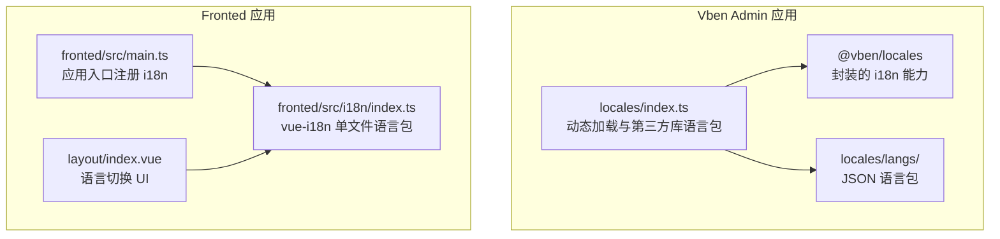
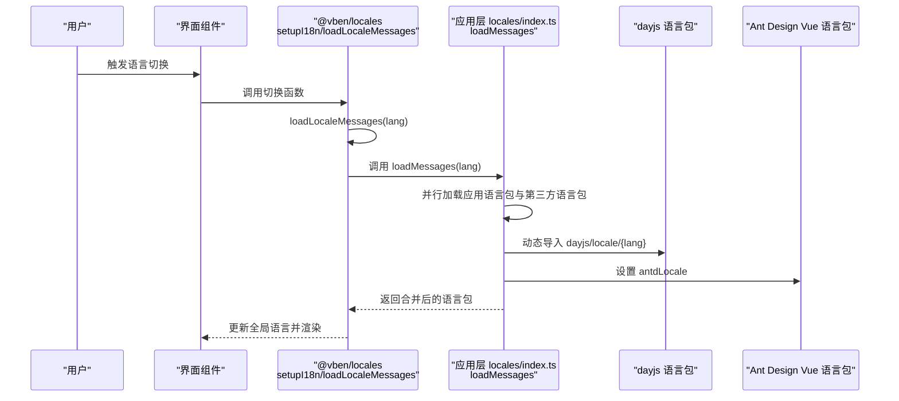
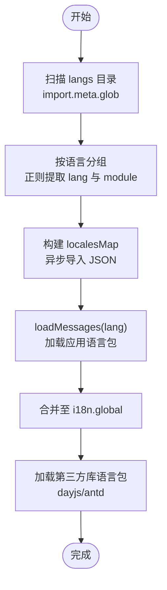
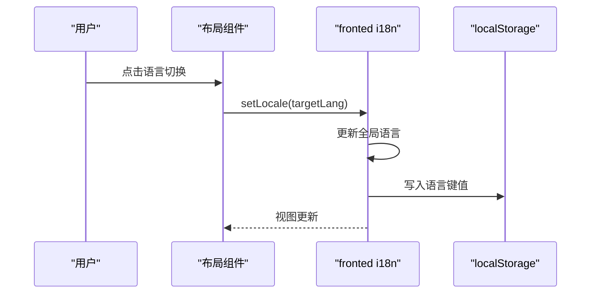
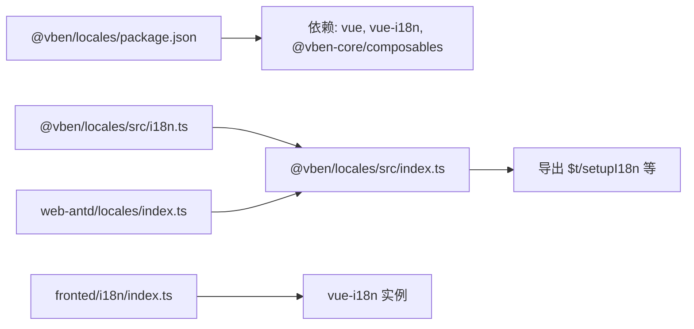

# 国际化

<cite>
**本文引用的文件**
- [apps/vben-admin/apps/web-antd/src/locales/index.ts](file://apps/vben-admin/apps/web-antd/src/locales/index.ts)
- [apps/vben-admin/apps/web-antd/src/locales/langs/en-US/page.json](file://apps/vben-admin/apps/web-antd/src/locales/langs/en-US/page.json)
- [apps/vben-admin/apps/web-antd/src/locales/langs/zh-CN/page.json](file://apps/vben-admin/apps/web-antd/src/locales/langs/zh-CN/page.json)
- [apps/vben-admin/apps/web-antd/src/locales/README.md](file://apps/vben-admin/apps/web-antd/src/locales/README.md)
- [apps/vben-admin/packages/locales/src/index.ts](file://apps/vben-admin/packages/locales/src/index.ts)
- [apps/vben-admin/packages/locales/src/i18n.ts](file://apps/vben-admin/packages/locales/src/i18n.ts)
- [apps/vben-admin/packages/locales/src/typing.ts](file://apps/vben-admin/packages/locales/src/typing.ts)
- [apps/vben-admin/packages/locales/package.json](file://apps/vben-admin/packages/locales/package.json)
- [apps/vben-admin/apps/web-antd/src/main.ts](file://apps/vben-admin/apps/web-antd/src/main.ts)
- [apps/fronted/src/i18n/index.ts](file://apps/fronted/src/i18n/index.ts)
- [apps/fronted/src/main.ts](file://apps/fronted/src/main.ts)
- [apps/fronted/src/components/layout/index.vue](file://apps/fronted/src/components/layout/index.vue)
</cite>

## 目录
1. [简介](#简介)
2. [项目结构](#项目结构)
3. [核心组件](#核心组件)
4. [架构总览](#架构总览)
5. [详细组件分析](#详细组件分析)
6. [依赖分析](#依赖分析)
7. [性能考虑](#性能考虑)
8. [故障排查指南](#故障排查指南)
9. [结论](#结论)
10. [附录](#附录)

## 简介
本文件系统性阐述本仓库中的国际化（i18n）能力与实践，覆盖以下方面：
- 多语言配置与使用
- 语言包组织结构与翻译文件管理
- 动态语言切换与状态管理
- 文本国际化、日期与数字格式化等本地化功能
- 翻译资源的组织与维护最佳实践
- 新语言添加流程与翻译校验方法
- 与后端接口的国际化集成与多语言数据处理
- i18n 工具链与自动化翻译流程建议

## 项目结构
本仓库包含两套前端应用，分别采用不同的 i18n 实现方案：
- Vben Admin 应用（web-antd）
  - 基于 @vben/locales 封装的统一 i18n 能力，支持按目录结构自动聚合 JSON 语言包，并动态加载第三方库（如 dayjs、Ant Design Vue）的语言包。
  - 语言包位于 apps/web-antd/src/locales/langs/{lang}/ 下，按模块拆分 JSON 文件，便于维护与增量更新。
- Fronted 应用（基于 vue-i18n 的传统实现）
  - 语言包直接在单文件中以嵌套对象形式维护，提供 zh-CN 与 en-US 两套语言。
  - 支持通过 setLocale 动态切换语言，并持久化到 localStorage。

图表来源
- [apps/vben-admin/apps/web-antd/src/locales/index.ts:1-103](file://apps/vben-admin/apps/web-antd/src/locales/index.ts#L1-103)
- [apps/vben-admin/apps/web-antd/src/locales/langs/en-US/page.json:1-16](file://apps/vben-admin/apps/web-antd/src/locales/langs/en-US/page.json#L1-L16)
- [apps/vben-admin/apps/web-antd/src/locales/langs/zh-CN/page.json:1-16](file://apps/vben-admin/apps/web-antd/src/locales/langs/zh-CN/page.json#L1-L16)
- [apps/fronted/src/i18n/index.ts:1-703](file://apps/fronted/src/i18n/index.ts#L1-L703)
- [apps/fronted/src/main.ts:1-27](file://apps/fronted/src/main.ts#L1-L27)
- [apps/fronted/src/components/layout/index.vue:135-147](file://apps/fronted/src/components/layout/index.vue#L135-L147)

章节来源
- [apps/vben-admin/apps/web-antd/src/locales/index.ts:1-103](file://apps/vben-admin/apps/web-antd/src/locales/index.ts#L1-103)
- [apps/fronted/src/i18n/index.ts:1-703](file://apps/fronted/src/i18n/index.ts#L1-L703)

## 核心组件
- Vben Admin 的 i18n 封装（@vben/locales）
  - 提供 setupI18n、loadLocaleMessages、loadLocalesMapFromDir 等能力，支持默认语言、缺失键告警、动态合并应用级语言包与第三方库语言包。
  - 通过 import.meta.glob 自动扫描 apps/web-antd/src/locales/langs/**/*.{json}，按语言与文件名聚合。
- Fronted 的 i18n
  - 使用 vue-i18n 创建 i18n 实例，内置 zh-CN 与 en-US 语言包，提供 setLocale 切换与 localStorage 持久化。
- 第三方库语言包加载
  - Vben Admin 在切换语言时动态加载 dayjs 与 Ant Design Vue 的语言包，确保日期与组件文案同步。

章节来源
- [apps/vben-admin/packages/locales/src/i18n.ts:1-148](file://apps/vben-admin/packages/locales/src/i18n.ts#L1-L148)
- [apps/vben-admin/packages/locales/src/index.ts:1-31](file://apps/vben-admin/packages/locales/src/index.ts#L1-L31)
- [apps/vben-admin/apps/web-antd/src/locales/index.ts:1-103](file://apps/vben-admin/apps/web-antd/src/locales/index.ts#L1-L103)
- [apps/fronted/src/i18n/index.ts:688-700](file://apps/fronted/src/i18n/index.ts#L688-L700)

## 架构总览
下图展示 Vben Admin 的动态语言切换与第三方库语言包加载的整体流程。

图表来源
- [apps/vben-admin/packages/locales/src/i18n.ts:102-139](file://apps/vben-admin/packages/locales/src/i18n.ts#L102-L139)
- [apps/vben-admin/apps/web-antd/src/locales/index.ts:33-39](file://apps/vben-admin/apps/web-antd/src/locales/index.ts#L33-L39)
- [apps/vben-admin/apps/web-antd/src/locales/index.ts:53-74](file://apps/vben-admin/apps/web-antd/src/locales/index.ts#L53-L74)
- [apps/vben-admin/apps/web-antd/src/locales/index.ts:80-91](file://apps/vben-admin/apps/web-antd/src/locales/index.ts#L80-L91)

## 详细组件分析

### Vben Admin 语言包组织与加载机制
- 语言包目录结构
  - apps/web-antd/src/locales/langs/{lang}/{module}.json
  - 示例：en-US/page.json、zh-CN/page.json
- 自动聚合
  - 通过 import.meta.glob 与正则匹配，将同语言下的多个 JSON 聚合为一个语言包对象。
- 动态加载应用语言包
  - loadMessages(lang) 并行加载应用语言包与第三方库语言包，随后合并到全局 i18n。
- 第三方库语言包
  - dayjs：根据语言动态导入对应 locale
  - Ant Design Vue：根据语言切换 antdLocale

图表来源
- [apps/vben-admin/packages/locales/src/i18n.ts:23-90](file://apps/vben-admin/packages/locales/src/i18n.ts#L23-L90)
- [apps/vben-admin/apps/web-antd/src/locales/index.ts:22-39](file://apps/vben-admin/apps/web-antd/src/locales/index.ts#L22-L39)

章节来源
- [apps/vben-admin/apps/web-antd/src/locales/index.ts:1-103](file://apps/vben-admin/apps/web-antd/src/locales/index.ts#L1-L103)
- [apps/vben-admin/apps/web-antd/src/locales/langs/en-US/page.json:1-16](file://apps/vben-admin/apps/web-antd/src/locales/langs/en-US/page.json#L1-L16)
- [apps/vben-admin/apps/web-antd/src/locales/langs/zh-CN/page.json:1-16](file://apps/vben-admin/apps/web-antd/src/locales/langs/zh-CN/page.json#L1-L16)
- [apps/vben-admin/apps/web-antd/src/locales/README.md:1-4](file://apps/vben-admin/apps/web-antd/src/locales/README.md#L1-L4)

### Fronted 语言包组织与切换机制
- 语言包组织
  - 单文件内维护 zh-CN 与 en-US 两套语言包，按模块与层级组织。
- 切换与持久化
  - setLocale 将语言写入 i18n.global.locale 与 localStorage，并设置 document.documentElement.lang。
- 入口注册
  - main.ts 中 app.use(i18n) 完成注册；布局组件提供语言切换 UI。

图表来源
- [apps/fronted/src/i18n/index.ts:696-700](file://apps/fronted/src/i18n/index.ts#L696-L700)
- [apps/fronted/src/components/layout/index.vue:135-147](file://apps/fronted/src/components/layout/index.vue#L135-L147)
- [apps/fronted/src/main.ts:1-27](file://apps/fronted/src/main.ts#L1-L27)

章节来源
- [apps/fronted/src/i18n/index.ts:1-703](file://apps/fronted/src/i18n/index.ts#L1-L703)
- [apps/fronted/src/components/layout/index.vue:135-147](file://apps/fronted/src/components/layout/index.vue#L135-L147)
- [apps/fronted/src/main.ts:1-27](file://apps/fronted/src/main.ts#L1-L27)

### 本地化功能：文本、日期与数字
- 文本国际化
  - Vben Admin：通过 $t 与 i18n.global.t 使用；@vben/locales 提供 $t 便捷导出。
  - Fronted：通过 i18n.global.t 使用。
- 日期格式化
  - Vben Admin：在切换语言时动态导入 dayjs/locale/{lang}，并调用 dayjs.locale(...) 应用语言。
- 数字格式化
  - 可结合浏览器 Intl.NumberFormat 或 dayjs 插件实现；本仓库未直接提供数字格式化封装，可在业务层按需引入。

章节来源
- [apps/vben-admin/packages/locales/src/index.ts:9-10](file://apps/vben-admin/packages/locales/src/index.ts#L9-L10)
- [apps/vben-admin/apps/web-antd/src/locales/index.ts:53-74](file://apps/vben-admin/apps/web-antd/src/locales/index.ts#L53-L74)
- [apps/fronted/src/i18n/index.ts:688-694](file://apps/fronted/src/i18n/index.ts#L688-L694)

### 与后端接口的国际化集成
- 语言协商
  - 前端通过用户选择或浏览器语言设置默认语言；后端通常通过 Accept-Language 请求头或路由参数/Cookie 传递语言。
- 多语言数据处理
  - 后端返回多语言字段（如 title_i18n、description_i18n），前端按当前语言取对应字段。
  - 若后端返回统一字段，前端根据语言映射规则进行本地化展示。
- 一致性保障
  - 建议前后端约定语言标识（如 zh-CN、en-US），并在接口文档中明确多语言字段命名规范。

[本节为通用实践说明，不直接分析具体文件，故无章节来源]

## 依赖分析
- @vben/locales
  - 作为 i18n 能力的核心封装，依赖 vue 与 vue-i18n，并导出 $t、setupI18n 等工具。
  - 语言包加载与合并逻辑集中在 packages/locales/src/i18n.ts。
- 应用层依赖
  - web-antd：通过 locales/index.ts 扩展第三方库语言包与应用语言包。
  - fronted：直接在 i18n/index.ts 维护语言包，main.ts 注册。

图表来源
- [apps/vben-admin/packages/locales/package.json:1-29](file://apps/vben-admin/packages/locales/package.json#L1-L29)
- [apps/vben-admin/packages/locales/src/index.ts:1-31](file://apps/vben-admin/packages/locales/src/index.ts#L1-L31)
- [apps/vben-admin/packages/locales/src/i18n.ts:1-148](file://apps/vben-admin/packages/locales/src/i18n.ts#L1-L148)
- [apps/vben-admin/apps/web-antd/src/locales/index.ts:1-103](file://apps/vben-admin/apps/web-antd/src/locales/index.ts#L1-L103)
- [apps/fronted/src/i18n/index.ts:688-694](file://apps/fronted/src/i18n/index.ts#L688-L694)

章节来源
- [apps/vben-admin/packages/locales/package.json:1-29](file://apps/vben-admin/packages/locales/package.json#L1-L29)
- [apps/vben-admin/packages/locales/src/index.ts:1-31](file://apps/vben-admin/packages/locales/src/index.ts#L1-L31)
- [apps/vben-admin/packages/locales/src/i18n.ts:1-148](file://apps/vben-admin/packages/locales/src/i18n.ts#L1-L148)

## 性能考虑
- 语言包按需加载
  - 通过 import.meta.glob 与动态 import，避免一次性加载全部语言包，降低首屏体积。
- 并行动态加载
  - 应用语言包与第三方库语言包并行加载，缩短切换耗时。
- 缓存策略
  - 建议对已加载的语言包进行缓存，避免重复导入；可在应用层增加简单缓存 Map。
- 渲染优化
  - 切换语言时尽量减少不必要的组件重渲染，优先使用响应式语言切换。

[本节为通用指导，不直接分析具体文件，故无章节来源]

## 故障排查指南
- 语言包缺失键告警
  - @vben/locales 在非生产环境默认开启缺失键告警，可通过 missingWarn 控制；若出现大量告警，检查语言包是否完整或键名是否正确。
- 第三方库语言包加载失败
  - dayjs 与 Ant Design Vue 的语言包需与当前语言匹配；若加载失败，检查语言标识与对应包是否存在。
- 前端语言持久化异常
  - Fronted 通过 localStorage 存储语言；若切换无效，检查 localStorage 是否被清理或跨域限制。
- HTML lang 属性未更新
  - 确保切换语言后设置了 document.documentElement.lang，以便辅助技术识别。

章节来源
- [apps/vben-admin/packages/locales/src/i18n.ts:110-116](file://apps/vben-admin/packages/locales/src/i18n.ts#L110-L116)
- [apps/vben-admin/apps/web-antd/src/locales/index.ts:53-74](file://apps/vben-admin/apps/web-antd/src/locales/index.ts#L53-L74)
- [apps/fronted/src/i18n/index.ts:696-700](file://apps/fronted/src/i18n/index.ts#L696-L700)

## 结论
本仓库提供了两种成熟的 i18n 实践路径：
- Vben Admin：面向工程化与可扩展性的封装，支持自动聚合语言包与第三方库语言包动态加载。
- Fronted：面向简洁与可控的传统实现，适合小规模项目或已有语言包结构的场景。

建议在大型项目中优先采用 Vben Admin 的封装方案，在保持灵活性的同时提升可维护性与性能。

[本节为总结性内容，不直接分析具体文件，故无章节来源]

## 附录

### 新语言添加流程（Vben Admin）
- 在 apps/web-antd/src/locales/langs/{lang}/ 下新增对应 JSON 文件（如 page.json）。
- 确保语言标识与 SupportedLanguagesType 匹配（如 zh-CN、en-US）。
- 如需第三方库语言包，补充 dayjs 与 Ant Design Vue 的导入逻辑。
- 重新启动应用验证语言包加载与 UI 渲染。

章节来源
- [apps/vben-admin/packages/locales/src/typing.ts:1-26](file://apps/vben-admin/packages/locales/src/typing.ts#L1-L26)
- [apps/vben-admin/apps/web-antd/src/locales/index.ts:53-91](file://apps/vben-admin/apps/web-antd/src/locales/index.ts#L53-L91)

### 翻译校验方法
- 键名一致性：确保各语言包的键名完全一致，避免运行时报错。
- 缺失键告警：在开发环境开启 missingWarn，及时发现缺失键。
- 人工复核：对关键文案进行双语对照复核，确保语义准确。
- 自动化：可引入 linter 或 spell checker 对语言包进行静态检查。

[本节为通用实践说明，不直接分析具体文件，故无章节来源]

### 与后端接口的国际化集成建议
- 接口字段设计：统一多语言字段命名（如 title_i18n、description_i18n），或提供语言参数。
- 前端语言选择：根据用户选择或浏览器语言设置默认语言。
- 数据回显：后端返回多语言字段时，前端按当前语言取值；若仅返回统一字段，前端进行本地化映射。

[本节为通用实践说明，不直接分析具体文件，故无章节来源]

### i18n 工具链与自动化翻译流程
- 语言包校验：使用 linter/spell checker 对 JSON 语言包进行语法与拼写检查。
- CI 集成：在流水线中加入语言包完整性检查与缺失键告警。
- 自动化翻译：可借助翻译平台或 AI 工具生成初稿，再由人工审校。
- 版本管理：语言包变更纳入版本控制，配合变更日志追踪。

[本节为通用实践说明，不直接分析具体文件，故无章节来源]