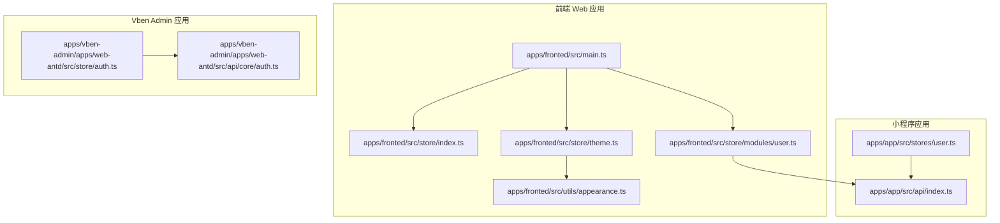
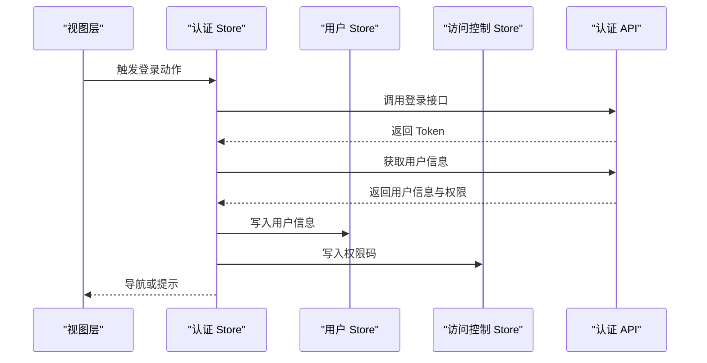
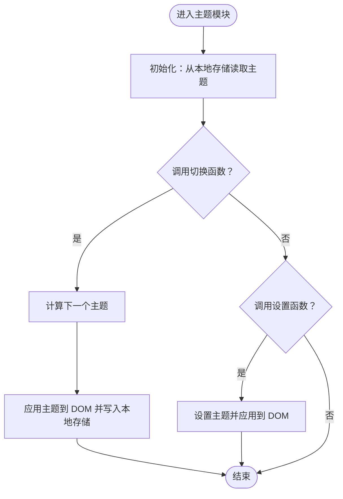
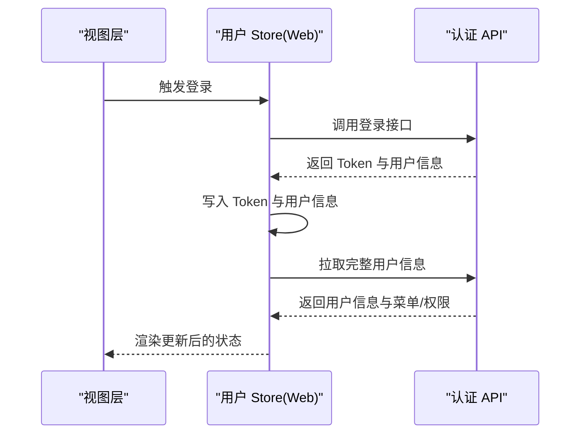
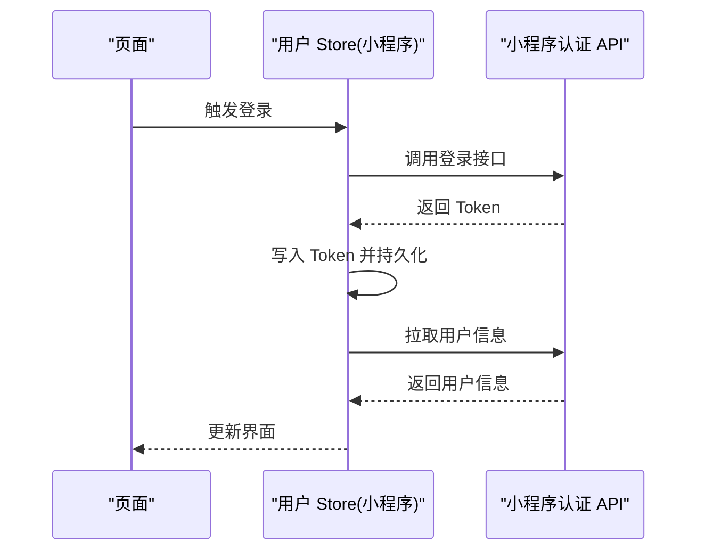
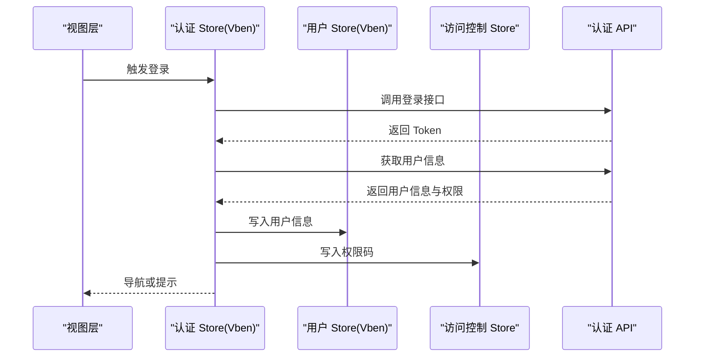
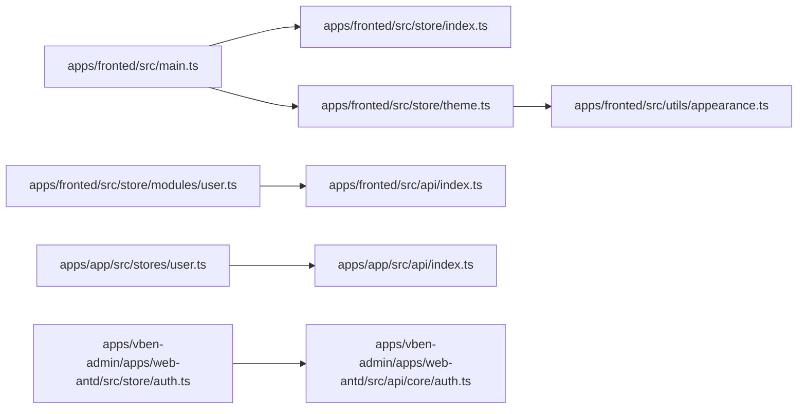

# 状态管理

<cite>
**本文引用的文件**
- [apps/fronted/src/store/index.ts](file://apps/fronted/src/store/index.ts)
- [apps/fronted/src/store/theme.ts](file://apps/fronted/src/store/theme.ts)
- [apps/fronted/src/store/modules/user.ts](file://apps/fronted/src/store/modules/user.ts)
- [apps/fronted/src/utils/appearance.ts](file://apps/fronted/src/utils/appearance.ts)
- [apps/fronted/src/main.ts](file://apps/fronted/src/main.ts)
- [apps/app/src/stores/user.ts](file://apps/app/src/stores/user.ts)
- [apps/app/src/api/index.ts](file://apps/app/src/api/index.ts)
- [apps/vben-admin/apps/web-antd/src/store/auth.ts](file://apps/vben-admin/apps/web-antd/src/store/auth.ts)
- [apps/vben-admin/apps/web-antd/src/api/core/auth.ts](file://apps/vben-admin/apps/web-antd/src/api/core/auth.ts)
</cite>

## 目录
1. [简介](#简介)
2. [项目结构](#项目结构)
3. [核心组件](#核心组件)
4. [架构总览](#架构总览)
5. [详细组件分析](#详细组件分析)
6. [依赖分析](#依赖分析)
7. [性能考虑](#性能考虑)
8. [故障排查指南](#故障排查指南)
9. [结论](#结论)
10. [附录](#附录)

## 简介
本文件系统性梳理仓库中基于 Pinia 的状态管理架构与实践，覆盖以下方面：
- Store 模块化设计：用户状态、主题状态等模块的实现方式与职责边界
- 状态定义、修改与订阅机制：如何在不同平台（Web、小程序）中声明状态、触发变更与响应式订阅
- Actions 与 Getters 的使用场景与最佳实践：登录、登出、用户信息拉取、主题切换等典型流程
- 状态持久化与数据同步策略：本地存储、跨页面/跨应用同步、Token 生命周期管理
- 调试工具与性能优化：开发期调试建议、性能优化技巧
- 与后端 API 的数据交互与状态更新机制：请求封装、错误处理、状态联动

## 项目结构
本仓库包含多个前端应用，均采用 Pinia 进行状态管理，主要分布如下：
- 前端 Web 应用（apps/fronted）：包含主题 Store 与用户模块 Store，以及全局入口初始化
- 小程序应用（apps/app）：包含用户 Store，使用平台存储 API 进行 Token 持久化
- Vben Admin 应用（apps/vben-admin）：包含认证 Store 与用户 Store，配合统一 API 层进行登录、登出与用户信息获取

图表来源
- [apps/fronted/src/main.ts:1-27](file://apps/fronted/src/main.ts#L1-L27)
- [apps/fronted/src/store/index.ts:1-5](file://apps/fronted/src/store/index.ts#L1-L5)
- [apps/fronted/src/store/theme.ts:1-24](file://apps/fronted/src/store/theme.ts#L1-L24)
- [apps/fronted/src/store/modules/user.ts:1-75](file://apps/fronted/src/store/modules/user.ts#L1-L75)
- [apps/fronted/src/utils/appearance.ts:1-13](file://apps/fronted/src/utils/appearance.ts#L1-L13)
- [apps/app/src/stores/user.ts:1-61](file://apps/app/src/stores/user.ts#L1-L61)
- [apps/app/src/api/index.ts:1-37](file://apps/app/src/api/index.ts#L1-L37)
- [apps/vben-admin/apps/web-antd/src/store/auth.ts:1-137](file://apps/vben-admin/apps/web-antd/src/store/auth.ts#L1-L137)
- [apps/vben-admin/apps/web-antd/src/api/core/auth.ts:1-122](file://apps/vben-admin/apps/web-antd/src/api/core/auth.ts#L1-L122)

章节来源
- [apps/fronted/src/main.ts:1-27](file://apps/fronted/src/main.ts#L1-L27)
- [apps/fronted/src/store/index.ts:1-5](file://apps/fronted/src/store/index.ts#L1-L5)
- [apps/fronted/src/store/theme.ts:1-24](file://apps/fronted/src/store/theme.ts#L1-L24)
- [apps/fronted/src/store/modules/user.ts:1-75](file://apps/fronted/src/store/modules/user.ts#L1-L75)
- [apps/fronted/src/utils/appearance.ts:1-13](file://apps/fronted/src/utils/appearance.ts#L1-L13)
- [apps/app/src/stores/user.ts:1-61](file://apps/app/src/stores/user.ts#L1-L61)
- [apps/app/src/api/index.ts:1-37](file://apps/app/src/api/index.ts#L1-L37)
- [apps/vben-admin/apps/web-antd/src/store/auth.ts:1-137](file://apps/vben-admin/apps/web-antd/src/store/auth.ts#L1-L137)
- [apps/vben-admin/apps/web-antd/src/api/core/auth.ts:1-122](file://apps/vben-admin/apps/web-antd/src/api/core/auth.ts#L1-L122)

## 核心组件
- 主题 Store（Web）：负责当前主题状态与切换逻辑，通过本地存储持久化主题选择，并应用到 DOM 上下文
- 用户模块 Store（Web）：负责登录态、用户信息、菜单与权限列表，支持登录、获取用户信息、登出与重置
- 用户 Store（小程序）：负责 Token 与用户信息的读写，结合 API 层完成登录、登出与信息拉取
- 认证 Store（Vben Admin）：负责登录流程、登出流程、用户信息获取，与访问控制 Store 协同工作

章节来源
- [apps/fronted/src/store/theme.ts:1-24](file://apps/fronted/src/store/theme.ts#L1-L24)
- [apps/fronted/src/store/modules/user.ts:1-75](file://apps/fronted/src/store/modules/user.ts#L1-L75)
- [apps/app/src/stores/user.ts:1-61](file://apps/app/src/stores/user.ts#L1-L61)
- [apps/vben-admin/apps/web-antd/src/store/auth.ts:1-137](file://apps/vben-admin/apps/web-antd/src/store/auth.ts#L1-L137)

## 架构总览
整体状态管理遵循“模块化 Store + 统一 API 层”的设计，Web 与小程序分别在各自入口中初始化 Pinia 并挂载 Store；Vben Admin 在认证 Store 中协调用户信息与权限数据。

图表来源
- [apps/vben-admin/apps/web-antd/src/store/auth.ts:27-88](file://apps/vben-admin/apps/web-antd/src/store/auth.ts#L27-L88)
- [apps/vben-admin/apps/web-antd/src/api/core/auth.ts:68-91](file://apps/vben-admin/apps/web-antd/src/api/core/auth.ts#L68-L91)

## 详细组件分析

### 主题状态模块（Web）
- 状态定义：使用响应式引用保存当前主题名称，并在初始化时从本地存储恢复
- 修改机制：提供切换与设置函数，内部更新状态并调用外观工具应用到 DOM
- 订阅机制：主题变更会直接驱动 UI 切换，无需额外订阅
- 持久化策略：主题名称写入本地存储，刷新后自动恢复

图表来源
- [apps/fronted/src/store/theme.ts:5-24](file://apps/fronted/src/store/theme.ts#L5-L24)
- [apps/fronted/src/utils/appearance.ts:3-13](file://apps/fronted/src/utils/appearance.ts#L3-L13)

章节来源
- [apps/fronted/src/store/theme.ts:1-24](file://apps/fronted/src/store/theme.ts#L1-L24)
- [apps/fronted/src/utils/appearance.ts:1-13](file://apps/fronted/src/utils/appearance.ts#L1-L13)

### 用户模块状态（Web）
- 状态定义：包含 Token、用户信息、菜单与权限数组
- 修改机制：登录成功后写入 Token 与用户信息；登出/重置时清空状态并移除本地存储
- 订阅机制：UI 通过响应式引用订阅状态变化，自动渲染最新数据
- 数据来源：通过认证 API 拉取用户信息与权限，菜单可选返回
- 最佳实践：登录后立即拉取完整用户信息，避免未授权访问

图表来源
- [apps/fronted/src/store/modules/user.ts:34-52](file://apps/fronted/src/store/modules/user.ts#L34-L52)
- [apps/fronted/src/api/index.ts:5-11](file://apps/fronted/src/api/index.ts#L5-L11)

章节来源
- [apps/fronted/src/store/modules/user.ts:1-75](file://apps/fronted/src/store/modules/user.ts#L1-L75)
- [apps/fronted/src/api/index.ts:1-37](file://apps/fronted/src/api/index.ts#L1-L37)

### 用户状态（小程序）
- 状态定义：Token 与用户信息
- 修改机制：登录成功后写入平台存储；登出/异常时清理存储
- 订阅机制：通过 Store 响应式更新页面状态
- 数据来源：通过小程序 API 模块发起认证请求

图表来源
- [apps/app/src/stores/user.ts:20-49](file://apps/app/src/stores/user.ts#L20-L49)
- [apps/app/src/api/index.ts:5-11](file://apps/app/src/api/index.ts#L5-L11)

章节来源
- [apps/app/src/stores/user.ts:1-61](file://apps/app/src/stores/user.ts#L1-L61)
- [apps/app/src/api/index.ts:1-37](file://apps/app/src/api/index.ts#L1-L37)

### 认证与用户状态（Vben Admin）
- 状态定义：登录加载状态、用户信息、权限码等
- 修改机制：登录成功后写入访问令牌与用户信息，拉取权限并设置到访问控制 Store；登出时重置所有 Store
- 订阅机制：登录成功后根据用户首页路径或默认路径导航
- 数据来源：统一认证 API 层，适配后端返回结构

图表来源
- [apps/vben-admin/apps/web-antd/src/store/auth.ts:27-88](file://apps/vben-admin/apps/web-antd/src/store/auth.ts#L27-L88)
- [apps/vben-admin/apps/web-antd/src/api/core/auth.ts:68-91](file://apps/vben-admin/apps/web-antd/src/api/core/auth.ts#L68-L91)

章节来源
- [apps/vben-admin/apps/web-antd/src/store/auth.ts:1-137](file://apps/vben-admin/apps/web-antd/src/store/auth.ts#L1-L137)
- [apps/vben-admin/apps/web-antd/src/api/core/auth.ts:1-122](file://apps/vben-admin/apps/web-antd/src/api/core/auth.ts#L1-L122)

## 依赖分析
- 入口初始化：Web 应用在入口中创建并注册 Pinia，同时初始化主题 Store；小程序入口为 SSR 容器
- Store 间耦合：Vben Admin 的认证 Store 依赖用户 Store 与访问控制 Store；Web 用户 Store 依赖认证 API
- 外部依赖：主题模块依赖外观工具；小程序用户 Store 依赖平台存储 API；Vben Admin 依赖统一 API 客户端

图表来源
- [apps/fronted/src/main.ts:1-27](file://apps/fronted/src/main.ts#L1-L27)
- [apps/fronted/src/store/index.ts:1-5](file://apps/fronted/src/store/index.ts#L1-L5)
- [apps/fronted/src/store/theme.ts:1-24](file://apps/fronted/src/store/theme.ts#L1-L24)
- [apps/fronted/src/utils/appearance.ts:1-13](file://apps/fronted/src/utils/appearance.ts#L1-L13)
- [apps/fronted/src/store/modules/user.ts:1-75](file://apps/fronted/src/store/modules/user.ts#L1-L75)
- [apps/app/src/stores/user.ts:1-61](file://apps/app/src/stores/user.ts#L1-L61)
- [apps/app/src/api/index.ts:1-37](file://apps/app/src/api/index.ts#L1-L37)
- [apps/vben-admin/apps/web-antd/src/store/auth.ts:1-137](file://apps/vben-admin/apps/web-antd/src/store/auth.ts#L1-L137)
- [apps/vben-admin/apps/web-antd/src/api/core/auth.ts:1-122](file://apps/vben-admin/apps/web-antd/src/api/core/auth.ts#L1-L122)

章节来源
- [apps/fronted/src/main.ts:1-27](file://apps/fronted/src/main.ts#L1-L27)
- [apps/app/src/main.ts:1-9](file://apps/app/src/main.ts#L1-L9)

## 性能考虑
- 状态粒度：将用户信息与权限拆分为独立模块，避免不必要的全局重渲染
- 异步操作：登录与获取用户信息采用异步 Actions，减少主线程阻塞
- 本地存储：仅对必要字段（如 Token、主题）进行持久化，降低 IO 开销
- 响应式订阅：通过响应式引用直接驱动 UI，避免手动订阅与解绑
- 缓存策略：在 API 层统一处理缓存与重试，Store 专注状态流转

## 故障排查指南
- 登录后无权限：检查认证 Store 是否正确写入权限码，确认访问控制 Store 已更新
- Token 失效：确认登录成功后是否立即拉取用户信息，登出时是否清理本地存储
- 主题不生效：检查外观工具是否正确应用到 DOM，本地存储的主题值是否一致
- 小程序 Token 丢失：确认平台存储 API 使用是否正确，异常分支是否清理了存储

章节来源
- [apps/vben-admin/apps/web-antd/src/store/auth.ts:90-107](file://apps/vben-admin/apps/web-antd/src/store/auth.ts#L90-L107)
- [apps/fronted/src/store/theme.ts:5-24](file://apps/fronted/src/store/theme.ts#L5-L24)
- [apps/app/src/stores/user.ts:40-49](file://apps/app/src/stores/user.ts#L40-L49)

## 结论
本仓库的状态管理以 Pinia 为核心，围绕“模块化 Store + 统一 API 层”展开，覆盖 Web、小程序与 Vben Admin 多端场景。通过明确的状态定义、Actions 驱动与本地存储持久化，实现了登录、登出、主题切换与用户信息同步等关键能力。建议在后续迭代中进一步完善调试工具集成与性能监控，持续优化状态粒度与异步流程。

## 附录
- 调试工具建议：使用浏览器插件或开发工具查看 Pinia Store 变更历史，定位异步流程中的状态异常
- 最佳实践清单
  - 登录成功后立即拉取用户信息，确保权限与菜单可用
  - 对敏感字段（Token）进行本地存储，登出时务必清理
  - 将主题与语言等偏好设置纳入 Store，保持跨页面一致性
  - 在 API 层集中处理错误与重试，Store 仅关注状态流转