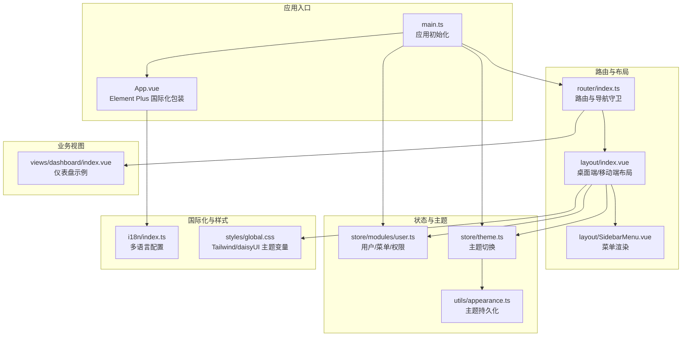
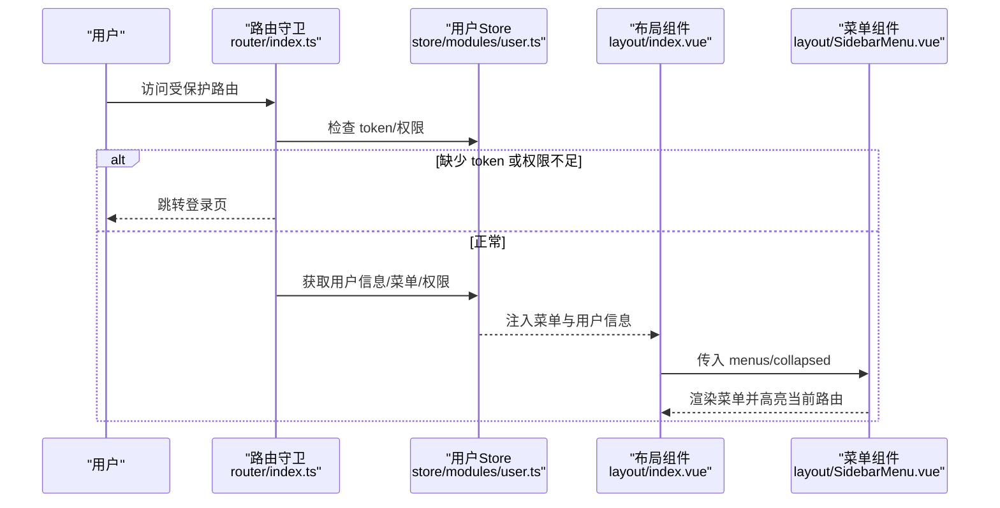
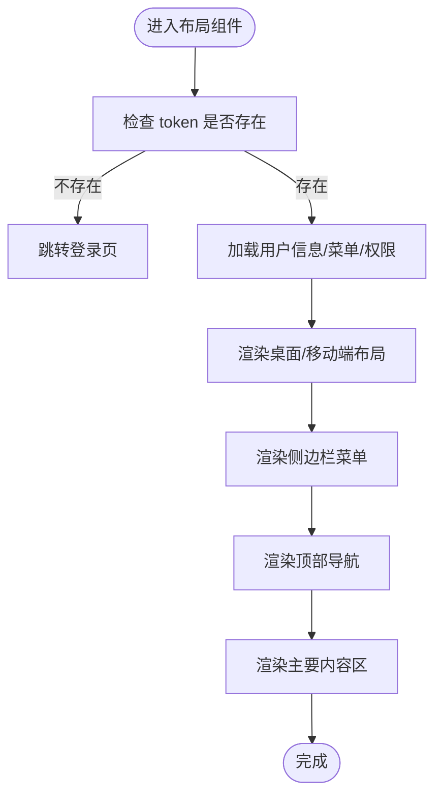
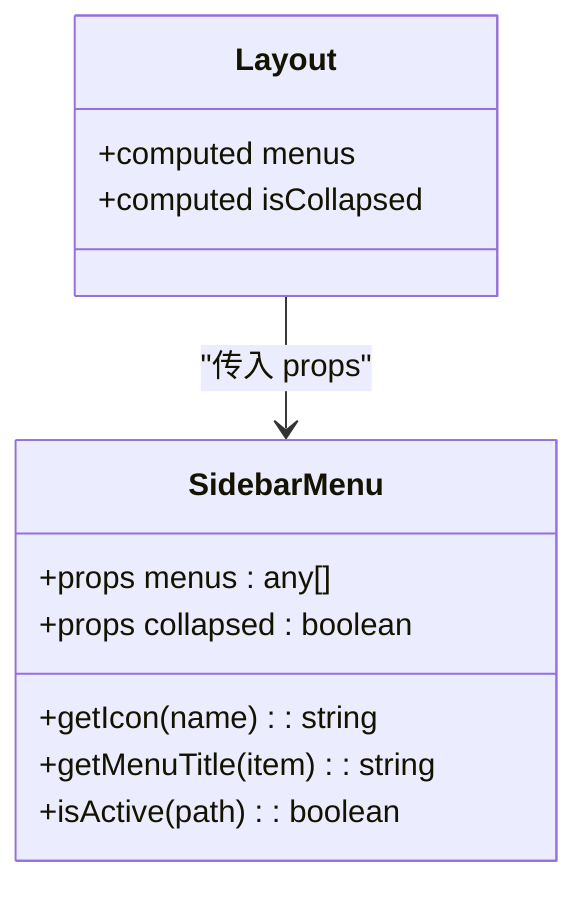
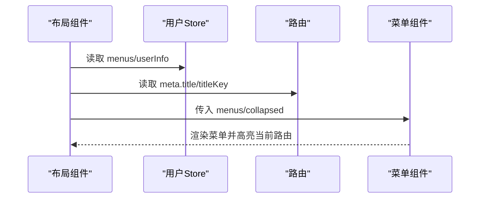
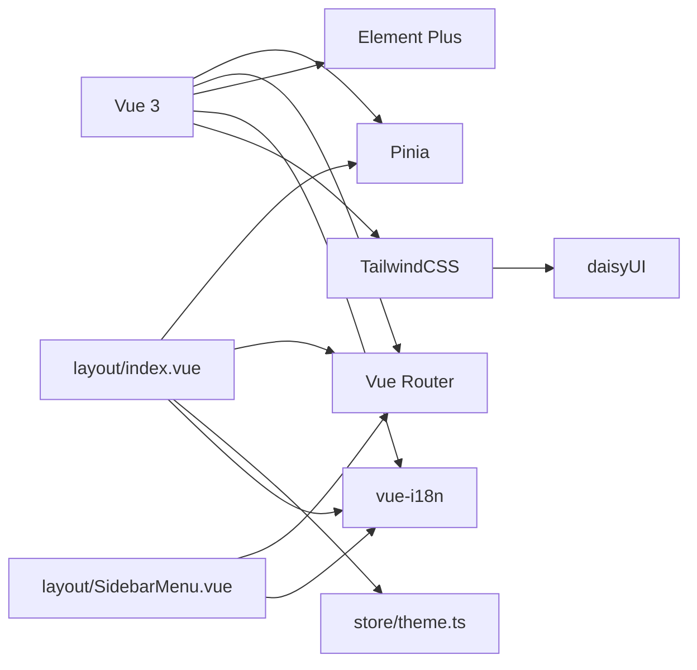

# 组件设计

<cite>
**本文引用的文件**
- [apps/fronted/src/components/layout/index.vue](file://apps/fronted/src/components/layout/index.vue)
- [apps/fronted/src/components/layout/SidebarMenu.vue](file://apps/fronted/src/components/layout/SidebarMenu.vue)
- [apps/fronted/src/App.vue](file://apps/fronted/src/App.vue)
- [apps/fronted/src/main.ts](file://apps/fronted/src/main.ts)
- [apps/fronted/src/router/index.ts](file://apps/fronted/src/router/index.ts)
- [apps/fronted/src/store/modules/user.ts](file://apps/fronted/src/store/modules/user.ts)
- [apps/fronted/src/store/theme.ts](file://apps/fronted/src/store/theme.ts)
- [apps/fronted/src/i18n/index.ts](file://apps/fronted/src/i18n/index.ts)
- [apps/fronted/src/styles/global.css](file://apps/fronted/src/styles/global.css)
- [apps/fronted/src/utils/appearance.ts](file://apps/fronted/src/utils/appearance.ts)
- [apps/fronted/src/api/index.ts](file://apps/fronted/src/api/index.ts)
- [apps/fronted/src/views/dashboard/index.vue](file://apps/fronted/src/views/dashboard/index.vue)
- [apps/fronted/package.json](file://apps/fronted/package.json)
</cite>

## 目录
1. [引言](#引言)
2. [项目结构](#项目结构)
3. [核心组件](#核心组件)
4. [架构总览](#架构总览)
5. [详细组件分析](#详细组件分析)
6. [依赖分析](#依赖分析)
7. [性能考虑](#性能考虑)
8. [故障排查指南](#故障排查指南)
9. [结论](#结论)
10. [附录](#附录)

## 引言
本文件面向前端工程团队与组件开发者，系统化梳理本仓库中布局组件的设计原则、开发规范与最佳实践。重点覆盖以下方面：
- 布局组件的实现：侧边栏菜单、顶部导航与主要内容区域的布局设计
- 组件间通信模式与数据流向：props 传递、事件处理、插槽使用、Pinia 状态管理、路由守卫
- 可复用组件的开发指南：接口设计、可配置性、可测试性
- 样式封装、主题适配与响应式设计
- 组件测试方法与工具使用建议

## 项目结构
前端应用位于 apps/fronted，采用 Vue 3 + TypeScript + Pinia + Vue Router + Element Plus + daisyUI + TailwindCSS 的技术栈。核心布局由布局组件负责，菜单组件作为其子组件，全局主题、国际化、路由守卫与状态管理贯穿于组件之间。

**图表来源**
- [apps/fronted/src/main.ts:1-27](file://apps/fronted/src/main.ts#L1-L27)
- [apps/fronted/src/App.vue:1-16](file://apps/fronted/src/App.vue#L1-L16)
- [apps/fronted/src/router/index.ts:1-160](file://apps/fronted/src/router/index.ts#L1-L160)
- [apps/fronted/src/components/layout/index.vue:1-234](file://apps/fronted/src/components/layout/index.vue#L1-L234)
- [apps/fronted/src/components/layout/SidebarMenu.vue:1-131](file://apps/fronted/src/components/layout/SidebarMenu.vue#L1-L131)
- [apps/fronted/src/store/modules/user.ts:1-75](file://apps/fronted/src/store/modules/user.ts#L1-L75)
- [apps/fronted/src/store/theme.ts:1-24](file://apps/fronted/src/store/theme.ts#L1-L24)
- [apps/fronted/src/utils/appearance.ts:1-13](file://apps/fronted/src/utils/appearance.ts#L1-L13)
- [apps/fronted/src/i18n/index.ts:1-703](file://apps/fronted/src/i18n/index.ts#L1-L703)
- [apps/fronted/src/styles/global.css:1-297](file://apps/fronted/src/styles/global.css#L1-L297)
- [apps/fronted/src/views/dashboard/index.vue:1-189](file://apps/fronted/src/views/dashboard/index.vue#L1-L189)

**章节来源**
- [apps/fronted/src/main.ts:1-27](file://apps/fronted/src/main.ts#L1-L27)
- [apps/fronted/src/router/index.ts:1-160](file://apps/fronted/src/router/index.ts#L1-L160)
- [apps/fronted/src/styles/global.css:1-297](file://apps/fronted/src/styles/global.css#L1-L297)

## 核心组件
- 布局容器组件：负责桌面端与移动端两套布局，包含侧边栏、顶部导航、面包屑、主题切换、语言切换、用户下拉菜单以及主要内容区域。
- 侧边栏菜单组件：根据用户菜单树渲染，支持折叠、图标映射、标题国际化、高亮当前路由。
- 应用根组件：包裹 Element Plus 的国际化配置，确保表单组件的语言一致性。
- 路由与导航守卫：统一处理登录态、权限校验与页面跳转。
- 状态管理：用户信息、菜单、权限与主题状态集中管理。
- 国际化：基于 vue-i18n 的多语言配置与动态切换。
- 样式体系：Tailwind v4 + daisyUI + 自定义主题变量，支持主题切换与响应式。

**章节来源**
- [apps/fronted/src/components/layout/index.vue:1-234](file://apps/fronted/src/components/layout/index.vue#L1-L234)
- [apps/fronted/src/components/layout/SidebarMenu.vue:1-131](file://apps/fronted/src/components/layout/SidebarMenu.vue#L1-L131)
- [apps/fronted/src/App.vue:1-16](file://apps/fronted/src/App.vue#L1-L16)
- [apps/fronted/src/router/index.ts:130-157](file://apps/fronted/src/router/index.ts#L130-L157)
- [apps/fronted/src/store/modules/user.ts:26-75](file://apps/fronted/src/store/modules/user.ts#L26-L75)
- [apps/fronted/src/store/theme.ts:1-24](file://apps/fronted/src/store/theme.ts#L1-L24)
- [apps/fronted/src/i18n/index.ts:688-703](file://apps/fronted/src/i18n/index.ts#L688-L703)
- [apps/fronted/src/styles/global.css:1-32](file://apps/fronted/src/styles/global.css#L1-L32)

## 架构总览
整体架构围绕“布局组件承载 UI 结构，菜单组件承载导航逻辑，Pinia 承载状态，路由守卫保障安全，国际化与主题贯穿全局”的思路组织。数据从后端 API 通过 Store 获取并注入到布局与视图组件中，形成清晰的数据流。

**图表来源**
- [apps/fronted/src/router/index.ts:130-157](file://apps/fronted/src/router/index.ts#L130-L157)
- [apps/fronted/src/store/modules/user.ts:34-52](file://apps/fronted/src/store/modules/user.ts#L34-L52)
- [apps/fronted/src/components/layout/index.vue:199-211](file://apps/fronted/src/components/layout/index.vue#L199-L211)
- [apps/fronted/src/components/layout/SidebarMenu.vue:53-131](file://apps/fronted/src/components/layout/SidebarMenu.vue#L53-L131)

## 详细组件分析

### 布局组件（桌面端/移动端）
- 设计原则
  - 响应式布局：移动端使用抽屉式侧边栏，桌面端使用固定侧边栏与可折叠
  - 顶部导航：包含面包屑、主题切换、语言切换、用户下拉菜单
  - 内容区：使用 router-view 展示当前路由视图
- 关键特性
  - 折叠控制：通过响应式变量控制侧边栏宽度与图标展示
  - 移动端抽屉：使用 drawer-toggle 控制抽屉开关
  - 主题与语言：通过主题 Store 与 i18n 切换
  - 权限与用户信息：在挂载时拉取用户信息，缺失时跳转登录
- Props/事件/插槽
  - Props：无外部 props，内部通过计算属性读取 Store 与路由元信息
  - 事件：按钮点击触发主题切换、语言切换、登出等
  - 插槽：未使用具名/作用域插槽，保持布局组件的通用性
- 数据流
  - Store 提供 menus、userInfo、permissions；路由 meta 提供标题与权限标识
  - 菜单组件接收 menus 并渲染，高亮当前路由

**图表来源**
- [apps/fronted/src/components/layout/index.vue:213-222](file://apps/fronted/src/components/layout/index.vue#L213-L222)
- [apps/fronted/src/store/modules/user.ts:45-52](file://apps/fronted/src/store/modules/user.ts#L45-L52)
- [apps/fronted/src/router/index.ts:130-157](file://apps/fronted/src/router/index.ts#L130-L157)

**章节来源**
- [apps/fronted/src/components/layout/index.vue:1-234](file://apps/fronted/src/components/layout/index.vue#L1-L234)
- [apps/fronted/src/store/modules/user.ts:26-75](file://apps/fronted/src/store/modules/user.ts#L26-L75)
- [apps/fronted/src/router/index.ts:130-157](file://apps/fronted/src/router/index.ts#L130-L157)

### 侧边栏菜单组件
- 设计原则
  - 支持父子级菜单：有子菜单时使用 details/summary 实现可折叠
  - 图标与标题：通过图标映射与国际化键渲染
  - 高亮当前路由：根据当前路径高亮对应菜单项
  - 折叠模式：在折叠状态下仅显示图标，标题隐藏
- Props/事件/插槽
  - Props：menus（菜单数组）、collapsed（是否折叠）
  - 事件：无显式事件抛出，内部通过 router-link 导航
  - 插槽：未使用插槽
- 数据流
  - 接收来自布局组件的 menus 与折叠状态
  - 通过路由元信息与本地映射决定标题与图标

**图表来源**
- [apps/fronted/src/components/layout/SidebarMenu.vue:53-131](file://apps/fronted/src/components/layout/SidebarMenu.vue#L53-L131)
- [apps/fronted/src/components/layout/index.vue:62-77](file://apps/fronted/src/components/layout/index.vue#L62-L77)

**章节来源**
- [apps/fronted/src/components/layout/SidebarMenu.vue:1-131](file://apps/fronted/src/components/layout/SidebarMenu.vue#L1-L131)

### 应用根组件与国际化
- 设计原则
  - 在根组件上包裹 Element Plus 的国际化配置，保证表单类组件的语言一致性
  - 基于 vue-i18n 的多语言配置，支持 zh-CN 与 en-US
- 关键点
  - Element Plus 语言随 i18n 动态切换
  - 页面标题与菜单标题通过路由 meta 与 i18n 键组合生成

**章节来源**
- [apps/fronted/src/App.vue:1-16](file://apps/fronted/src/App.vue#L1-L16)
- [apps/fronted/src/i18n/index.ts:688-703](file://apps/fronted/src/i18n/index.ts#L688-L703)
- [apps/fronted/src/router/index.ts:16-21](file://apps/fronted/src/router/index.ts#L16-L21)

### 路由与导航守卫
- 设计原则
  - 登录态校验：未登录跳转登录页；已登录访问登录页跳转首页
  - 权限校验：根据路由 meta 中的权限标识与用户权限比对
  - 用户信息预取：首次访问需要权限的路由时，拉取用户信息
- 流程
  - 全局前置守卫统一处理
  - 失败时重定向至首页或登录页，并提示

**章节来源**
- [apps/fronted/src/router/index.ts:130-157](file://apps/fronted/src/router/index.ts#L130-L157)

### 状态管理与主题
- 用户状态
  - 存储 token、用户信息、菜单树、权限列表
  - 提供登录、获取用户信息、登出、重置等动作
- 主题状态
  - 维护当前主题（light/dark），提供切换与设置方法
  - 通过工具函数持久化到 localStorage 并写入到 documentElement.dataset.theme

**章节来源**
- [apps/fronted/src/store/modules/user.ts:26-75](file://apps/fronted/src/store/modules/user.ts#L26-L75)
- [apps/fronted/src/store/theme.ts:1-24](file://apps/fronted/src/store/theme.ts#L1-L24)
- [apps/fronted/src/utils/appearance.ts:1-13](file://apps/fronted/src/utils/appearance.ts#L1-L13)

### 样式封装、主题适配与响应式
- 样式体系
  - Tailwind v4 + daisyUI，通过自定义 CSS 变量统一主题令牌
  - 定义页面容器、卡片、表格、输入框、按钮、滚动条等通用样式
- 主题适配
  - 通过 dataset.theme 切换主题，配合过渡动画
  - 主题持久化到 localStorage
- 响应式
  - 移动端抽屉布局与桌面端侧边栏布局并存
  - 侧边栏折叠与标题显示策略

**章节来源**
- [apps/fronted/src/styles/global.css:1-297](file://apps/fronted/src/styles/global.css#L1-L297)
- [apps/fronted/src/utils/appearance.ts:1-13](file://apps/fronted/src/utils/appearance.ts#L1-L13)
- [apps/fronted/src/components/layout/index.vue:60-181](file://apps/fronted/src/components/layout/index.vue#L60-L181)

### 组件间通信与数据流向
- 布局组件向菜单组件传递：
  - menus：菜单树
  - collapsed：折叠状态
- 布局组件从 Store 与路由获取：
  - userInfo：用户信息
  - menus：菜单树
  - currentTitle：面包屑标题（路由 meta + i18n）
- 菜单组件内部：
  - 通过路由高亮当前项
  - 通过图标映射与国际化键渲染标题

**图表来源**
- [apps/fronted/src/components/layout/index.vue:199-211](file://apps/fronted/src/components/layout/index.vue#L199-L211)
- [apps/fronted/src/components/layout/SidebarMenu.vue:53-131](file://apps/fronted/src/components/layout/SidebarMenu.vue#L53-L131)

**章节来源**
- [apps/fronted/src/components/layout/index.vue:199-211](file://apps/fronted/src/components/layout/index.vue#L199-L211)
- [apps/fronted/src/components/layout/SidebarMenu.vue:53-131](file://apps/fronted/src/components/layout/SidebarMenu.vue#L53-L131)

### 可复用组件开发指南与最佳实践
- 接口设计
  - 明确 props 输入：如菜单组件的 menus 与 collapsed
  - 将 UI 行为（如高亮）放在组件内部，避免过度暴露细节
- 可配置性
  - 通过 props 控制外观与行为（如折叠）
  - 通过 i18n 与主题 Store 提供国际化与主题能力
- 可测试性
  - 将副作用（如 API 请求）抽象为可注入的服务或 Store 动作
  - 通过单元测试验证 props 渲染、高亮逻辑与交互事件

（本节为通用指导，不直接分析具体文件）

### 组件测试方法与工具使用
- 单元测试
  - 使用 Vitest 进行组件逻辑与 Store 动作测试
  - 对菜单组件进行渲染断言与高亮逻辑验证
- 集成测试
  - 使用路由与 Store 的快照测试，验证导航守卫与权限流程
- E2E 测试
  - 使用 Playwright/Cypress 验证布局切换、主题切换、语言切换与菜单导航

（本节为通用指导，不直接分析具体文件）

## 依赖分析
- 运行时依赖
  - Vue 3、Pinia、Vue Router、Element Plus、vue-i18n、TailwindCSS、daisyUI
- 开发依赖
  - Vite、TypeScript、vue-tsc、@vitejs/plugin-vue
- 关键耦合点
  - 布局组件依赖 Store 与路由；菜单组件依赖布局组件的 props 与路由；主题与国际化贯穿全局

**图表来源**
- [apps/fronted/package.json:11-32](file://apps/fronted/package.json#L11-L32)
- [apps/fronted/src/main.ts:1-27](file://apps/fronted/src/main.ts#L1-L27)

**章节来源**
- [apps/fronted/package.json:1-34](file://apps/fronted/package.json#L1-L34)
- [apps/fronted/src/main.ts:1-27](file://apps/fronted/src/main.ts#L1-L27)

## 性能考虑
- 路由懒加载：路由组件按需加载，减少首屏体积
- Store 预取：在导航守卫中按需拉取用户信息，避免重复请求
- 主题切换：通过 dataset 切换，避免不必要的组件重建
- 样式优化：Tailwind 与 daisyUI 的原子类组合，减少自定义样式开销

（本节为通用指导，不直接分析具体文件）

## 故障排查指南
- 登录态异常
  - 检查 localStorage 中 token 是否存在；路由守卫是否正确拦截
- 权限不足
  - 确认路由 meta.perm 与用户权限列表匹配；必要时重新拉取用户信息
- 菜单不显示
  - 检查 Store 中 menus 是否为空；布局组件是否正确传入 props
- 主题不生效
  - 检查 dataset.theme 是否正确设置；localStorage 中 theme 是否保存
- 国际化不生效
  - 检查 i18n.global.locale 是否正确设置；页面 lang 属性是否同步

**章节来源**
- [apps/fronted/src/router/index.ts:130-157](file://apps/fronted/src/router/index.ts#L130-L157)
- [apps/fronted/src/store/modules/user.ts:45-52](file://apps/fronted/src/store/modules/user.ts#L45-L52)
- [apps/fronted/src/store/theme.ts:1-24](file://apps/fronted/src/store/theme.ts#L1-L24)
- [apps/fronted/src/i18n/index.ts:696-700](file://apps/fronted/src/i18n/index.ts#L696-L700)

## 结论
本项目在布局组件设计上遵循“职责单一、可配置性强、主题与国际化内聚”的原则，通过 Pinia 与路由守卫保障数据流与安全性，结合 TailwindCSS 与 daisyUI 实现一致的视觉与交互体验。建议在后续迭代中进一步完善组件测试体系与文档化规范，提升可维护性与可扩展性。

## 附录
- 示例视图组件展示了如何在页面中使用 API 与 i18n，可作为组件开发的参考模板

**章节来源**
- [apps/fronted/src/views/dashboard/index.vue:156-189](file://apps/fronted/src/views/dashboard/index.vue#L156-L189)
- [apps/fronted/src/api/index.ts:1-155](file://apps/fronted/src/api/index.ts#L1-L155)