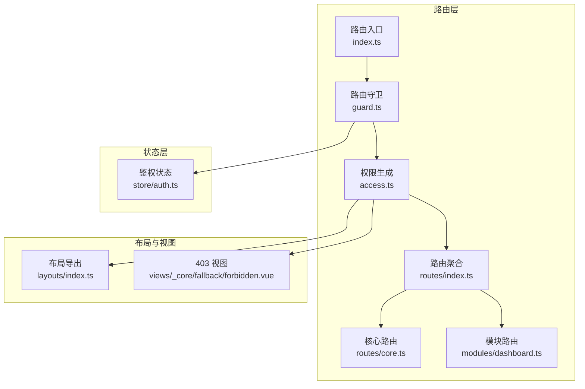
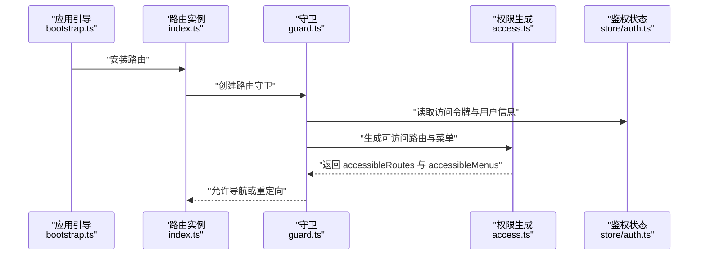
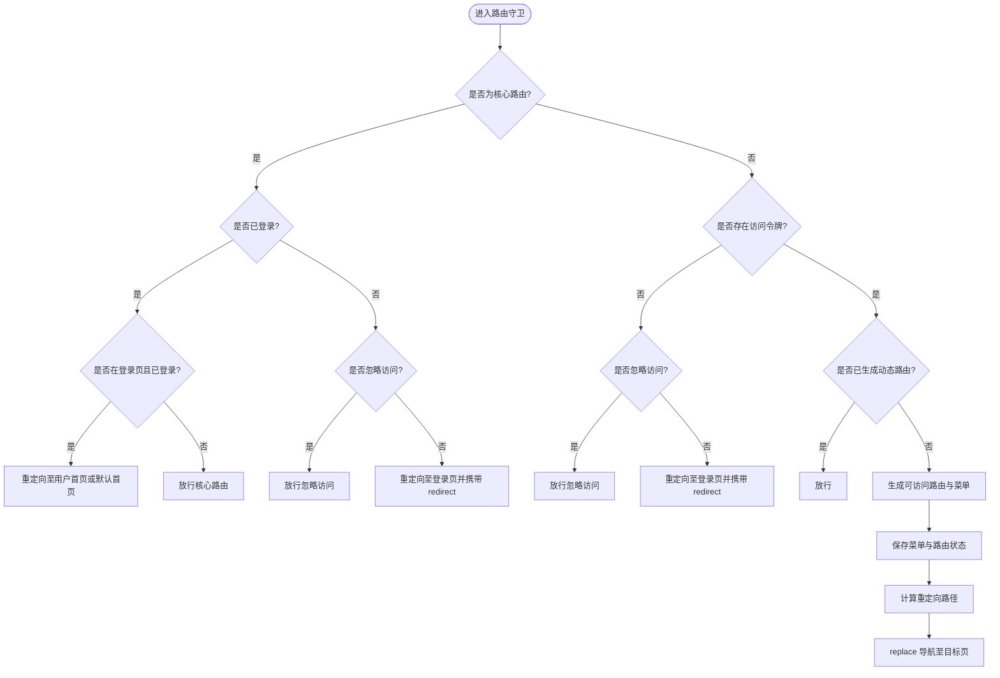
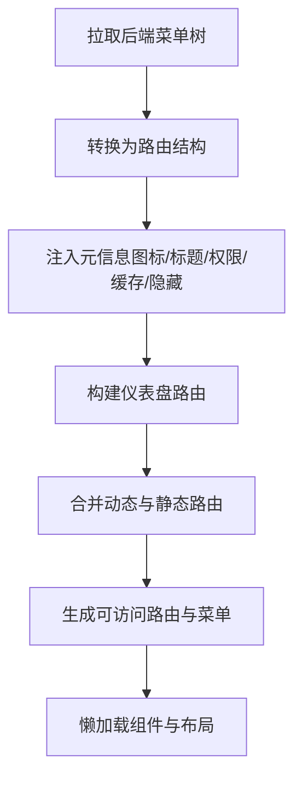
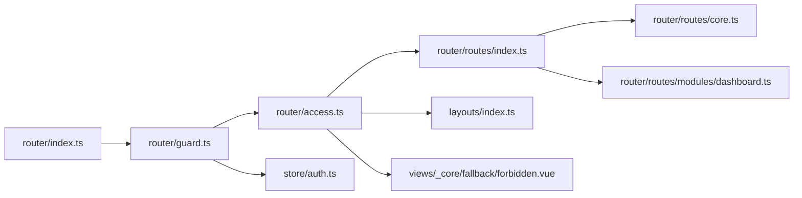

# 路由系统

<cite>
**本文引用的文件**
- [apps/vben-admin/apps/web-antd/src/router/index.ts](file://apps/vben-admin/apps/web-antd/src/router/index.ts)
- [apps/vben-admin/apps/web-antd/src/router/guard.ts](file://apps/vben-admin/apps/web-antd/src/router/guard.ts)
- [apps/vben-admin/apps/web-antd/src/router/access.ts](file://apps/vben-admin/apps/web-antd/src/router/access.ts)
- [apps/vben-admin/apps/web-antd/src/router/routes/index.ts](file://apps/vben-admin/apps/web-antd/src/router/routes/index.ts)
- [apps/vben-admin/apps/web-antd/src/router/routes/core.ts](file://apps/vben-admin/apps/web-antd/src/router/routes/core.ts)
- [apps/vben-admin/apps/web-antd/src/router/routes/modules/dashboard.ts](file://apps/vben-admin/apps/web-antd/src/router/routes/modules/dashboard.ts)
- [apps/vben-admin/apps/web-antd/src/layouts/index.ts](file://apps/vben-admin/apps/web-antd/src/layouts/index.ts)
- [apps/vben-admin/apps/web-antd/src/bootstrap.ts](file://apps/vben-admin/apps/web-antd/src/bootstrap.ts)
- [apps/vben-admin/apps/web-antd/src/store/auth.ts](file://apps/vben-admin/apps/web-antd/src/store/auth.ts)
- [apps/vben-admin/apps/web-antd/src/views/_core/fallback/forbidden.vue](file://apps/vben-admin/apps/web-antd/src/views/_core/fallback/forbidden.vue)
</cite>

## 目录
1. [简介](#简介)
2. [项目结构](#项目结构)
3. [核心组件](#核心组件)
4. [架构总览](#架构总览)
5. [详细组件分析](#详细组件分析)
6. [依赖分析](#依赖分析)
7. [性能考虑](#性能考虑)
8. [故障排查指南](#故障排查指南)
9. [结论](#结论)
10. [附录](#附录)

## 简介
本文件系统性梳理前端路由体系，覆盖 Vue Router 的配置与使用、嵌套路由与动态路由、权限路由守卫、懒加载与代码分割、路由元信息、导航拦截与重定向、路由与权限系统集成（菜单生成与访问控制）、以及 SEO 优化与预加载策略。内容基于实际源码进行分析，适合技术与非技术读者阅读。

## 项目结构
路由系统位于 Vben Admin Web Antd 应用中，采用模块化组织方式：
- 路由入口与历史模式：在路由入口中根据环境变量选择 Hash 或 HTML5 History，并统一滚动行为与初始路由注入。
- 路由模块化：通过 import.meta.glob 动态聚合各模块路由，形成动态路由集合；核心路由与兜底路由独立维护。
- 权限与守卫：在全局守卫中完成进度条、登录态检查、动态路由生成与菜单注入、重定向等逻辑。
- 布局与组件：基础布局、认证布局、iframe 布局与页面组件均支持懒加载与按需导入。
- 状态与鉴权：登录、用户信息、权限令牌与菜单状态通过 Pinia Store 管理，配合路由守卫实现访问控制。

图表来源
- [apps/vben-admin/apps/web-antd/src/router/index.ts:15-30](file://apps/vben-admin/apps/web-antd/src/router/index.ts#L15-L30)
- [apps/vben-admin/apps/web-antd/src/router/guard.ts:47-120](file://apps/vben-admin/apps/web-antd/src/router/guard.ts#L47-L120)
- [apps/vben-admin/apps/web-antd/src/router/access.ts:162-187](file://apps/vben-admin/apps/web-antd/src/router/access.ts#L162-L187)
- [apps/vben-admin/apps/web-antd/src/router/routes/index.ts:7-37](file://apps/vben-admin/apps/web-antd/src/router/routes/index.ts#L7-L37)
- [apps/vben-admin/apps/web-antd/src/router/routes/core.ts:24-95](file://apps/vben-admin/apps/web-antd/src/router/routes/core.ts#L24-L95)
- [apps/vben-admin/apps/web-antd/src/router/routes/modules/dashboard.ts:5-36](file://apps/vben-admin/apps/web-antd/src/router/routes/modules/dashboard.ts#L5-L36)
- [apps/vben-admin/apps/web-antd/src/layouts/index.ts:1-7](file://apps/vben-admin/apps/web-antd/src/layouts/index.ts#L1-L7)
- [apps/vben-admin/apps/web-antd/src/views/_core/fallback/forbidden.vue:1-10](file://apps/vben-admin/apps/web-antd/src/views/_core/fallback/forbidden.vue#L1-L10)

章节来源
- [apps/vben-admin/apps/web-antd/src/router/index.ts:15-30](file://apps/vben-admin/apps/web-antd/src/router/index.ts#L15-L30)
- [apps/vben-admin/apps/web-antd/src/router/routes/index.ts:7-37](file://apps/vben-admin/apps/web-antd/src/router/routes/index.ts#L7-L37)

## 核心组件
- 路由实例与历史模式
  - 基于环境变量选择 Hash 或 HTML5 History，支持基础路径与滚动行为配置。
  - 提供 resetRoutes 工具函数，用于重置静态路由。
- 路由模块化
  - 通过 import.meta.glob 聚合 modules 下的动态路由模块，形成 accessRoutes。
  - 核心路由 coreRoutes 与兜底路由 fallbackNotFoundRoute 独立维护，确保无需权限拦截的基础页面始终可用。
- 权限守卫
  - 通用守卫：记录已加载页面、控制进度条。
  - 访问守卫：检查登录态、忽略访问标记、生成动态路由与菜单、重定向至目标页面或首页。
- 权限生成
  - 从后端拉取菜单树，映射为路由结构，注入图标、标题、排序、权限码、缓存与隐藏菜单等元信息。
  - 支持 iframe 嵌套视图与 403 拒绝访问组件。
- 布局与视图
  - BasicLayout、AuthPageLayout、IFrameView 通过懒加载按需导入。
  - 页面组件同样采用懒加载，结合 import.meta.glob 实现代码分割。

章节来源
- [apps/vben-admin/apps/web-antd/src/router/index.ts:15-30](file://apps/vben-admin/apps/web-antd/src/router/index.ts#L15-L30)
- [apps/vben-admin/apps/web-antd/src/router/routes/index.ts:7-37](file://apps/vben-admin/apps/web-antd/src/router/routes/index.ts#L7-L37)
- [apps/vben-admin/apps/web-antd/src/router/guard.ts:47-120](file://apps/vben-admin/apps/web-antd/src/router/guard.ts#L47-L120)
- [apps/vben-admin/apps/web-antd/src/router/access.ts:162-187](file://apps/vben-admin/apps/web-antd/src/router/access.ts#L162-L187)
- [apps/vben-admin/apps/web-antd/src/layouts/index.ts:1-7](file://apps/vben-admin/apps/web-antd/src/layouts/index.ts#L1-L7)

## 架构总览
下图展示从应用启动到路由守卫生效的关键流程，以及权限生成与菜单注入的协作关系。

图表来源
- [apps/vben-admin/apps/web-antd/src/bootstrap.ts:56-57](file://apps/vben-admin/apps/web-antd/src/bootstrap.ts#L56-L57)
- [apps/vben-admin/apps/web-antd/src/router/index.ts:35](file://apps/vben-admin/apps/web-antd/src/router/index.ts#L35)
- [apps/vben-admin/apps/web-antd/src/router/guard.ts:47-120](file://apps/vben-admin/apps/web-antd/src/router/guard.ts#L47-L120)
- [apps/vben-admin/apps/web-antd/src/router/access.ts:162-187](file://apps/vben-admin/apps/web-antd/src/router/access.ts#L162-L187)
- [apps/vben-admin/apps/web-antd/src/store/auth.ts:16-137](file://apps/vben-admin/apps/web-antd/src/store/auth.ts#L16-L137)

## 详细组件分析

### 路由定义与模块化
- 动态路由聚合
  - 使用 import.meta.glob('./modules/**/*.ts', { eager: true }) 聚合模块路由，形成 accessRoutes。
  - 支持 coreRoutes 与 fallbackNotFoundRoute 组合为完整路由表。
- 嵌套路由
  - 根路由使用 BasicLayout 作为父容器，子路由无需重复配置父布局。
  - 仪表盘模块演示了二级嵌套结构，子路由可配置固定标签、图标与标题。
- 基础路由
  - 根路径 redirect 至默认首页；认证模块包含登录、扫码登录、忘记密码、注册等页面，均使用认证布局。

章节来源
- [apps/vben-admin/apps/web-antd/src/router/routes/index.ts:7-37](file://apps/vben-admin/apps/web-antd/src/router/routes/index.ts#L7-L37)
- [apps/vben-admin/apps/web-antd/src/router/routes/core.ts:24-95](file://apps/vben-admin/apps/web-antd/src/router/routes/core.ts#L24-L95)
- [apps/vben-admin/apps/web-antd/src/router/routes/modules/dashboard.ts:5-36](file://apps/vben-admin/apps/web-antd/src/router/routes/modules/dashboard.ts#L5-L36)

### 权限路由守卫工作原理
- 通用守卫
  - 记录已加载页面路径，避免重复执行页面切换动画与效果。
  - 根据偏好设置控制页面加载进度条的开启与关闭。
- 访问守卫
  - 忽略访问标记：若目标路由 meta.ignoreAccess 为真，直接放行。
  - 登录态检查：无令牌时，将用户重定向至登录页，并携带 redirect 参数以便登录后回跳。
  - 动态路由生成：根据用户角色与后端菜单生成可访问路由与菜单，写入状态并标记已检查。
  - 重定向逻辑：根据来源页 redirect、默认首页或目标页计算重定向路径，使用 replace 确保历史栈干净。

图表来源
- [apps/vben-admin/apps/web-antd/src/router/guard.ts:47-120](file://apps/vben-admin/apps/web-antd/src/router/guard.ts#L47-L120)

章节来源
- [apps/vben-admin/apps/web-antd/src/router/guard.ts:17-41](file://apps/vben-admin/apps/web-antd/src/router/guard.ts#L17-L41)
- [apps/vben-admin/apps/web-antd/src/router/guard.ts:47-120](file://apps/vben-admin/apps/web-antd/src/router/guard.ts#L47-L120)

### 动态路由与菜单生成
- 菜单到路由映射
  - 后端菜单树经转换函数映射为路由结构，自动注入图标、标题、排序、权限码、缓存与菜单隐藏等元信息。
  - 目录类型菜单映射为 BasicLayout，页面类型菜单映射为对应视图组件路径。
- 动态路由生成
  - 通过 generateAccessible 接口，结合 pageMap、layoutMap 与 forbiddenComponent，生成最终可访问路由与菜单。
  - 追加仪表盘路由并设置默认重定向，保证首页体验。
- 懒加载与代码分割
  - 页面组件与布局组件均采用懒加载导入，结合 import.meta.glob 实现按需打包与分块加载。

图表来源
- [apps/vben-admin/apps/web-antd/src/router/access.ts:93-131](file://apps/vben-admin/apps/web-antd/src/router/access.ts#L93-L131)
- [apps/vben-admin/apps/web-antd/src/router/access.ts:162-187](file://apps/vben-admin/apps/web-antd/src/router/access.ts#L162-L187)
- [apps/vben-admin/apps/web-antd/src/layouts/index.ts:1-7](file://apps/vben-admin/apps/web-antd/src/layouts/index.ts#L1-L7)

章节来源
- [apps/vben-admin/apps/web-antd/src/router/access.ts:93-131](file://apps/vben-admin/apps/web-antd/src/router/access.ts#L93-L131)
- [apps/vben-admin/apps/web-antd/src/router/access.ts:162-187](file://apps/vben-admin/apps/web-antd/src/router/access.ts#L162-L187)
- [apps/vben-admin/apps/web-antd/src/layouts/index.ts:1-7](file://apps/vben-admin/apps/web-antd/src/layouts/index.ts#L1-L7)

### 路由元信息配置与使用
- 元信息字段
  - icon：菜单图标，支持从后端图标名映射为 Lucide 图标名。
  - title：菜单标题，支持国际化。
  - order：排序权重，用于菜单排序。
  - authority：权限码数组，用于细粒度权限控制。
  - keepAlive：是否启用页面缓存。
  - hideInMenu：是否在菜单中隐藏。
  - affixTab：是否固定标签页。
- 使用场景
  - 菜单渲染：根据元信息决定显示与排序。
  - 权限控制：结合权限指令与守卫进行访问控制。
  - 缓存策略：结合 keepAlive 决定页面缓存行为。

章节来源
- [apps/vben-admin/apps/web-antd/src/router/access.ts:107-115](file://apps/vben-admin/apps/web-antd/src/router/access.ts#L107-L115)
- [apps/vben-admin/apps/web-antd/src/router/routes/modules/dashboard.ts:19-23](file://apps/vben-admin/apps/web-antd/src/router/routes/modules/dashboard.ts#L19-L23)

### 路由导航拦截与重定向
- 登录拦截
  - 未登录访问受保护路由时，重定向至登录页并携带 redirect 参数。
- 登录后回跳
  - 登录成功后根据 redirect 或用户首页进行回跳，确保良好用户体验。
- 默认首页与回退
  - 若 redirect 指向默认首页，清空 redirect 参数；否则保留 redirect 以便回跳。

章节来源
- [apps/vben-admin/apps/web-antd/src/router/guard.ts:72-86](file://apps/vben-admin/apps/web-antd/src/router/guard.ts#L72-L86)
- [apps/vben-admin/apps/web-antd/src/store/auth.ts:68-71](file://apps/vben-admin/apps/web-antd/src/store/auth.ts#L68-L71)

### 路由与权限系统集成（菜单生成与访问控制）
- 菜单生成
  - 从后端获取菜单树，映射为路由结构，注入元信息后参与菜单渲染。
- 访问控制
  - 结合用户角色与权限码，生成可访问路由与菜单，写入状态以便 UI 与守卫使用。
- 拒绝访问
  - 对于仅在菜单中可见但无权限访问的页面，使用 403 组件提示。

章节来源
- [apps/vben-admin/apps/web-antd/src/router/access.ts:162-187](file://apps/vben-admin/apps/web-antd/src/router/access.ts#L162-L187)
- [apps/vben-admin/apps/web-antd/src/views/_core/fallback/forbidden.vue:1-10](file://apps/vben-admin/apps/web-antd/src/views/_core/fallback/forbidden.vue#L1-L10)

### 路由懒加载与代码分割策略
- 懒加载组件
  - 页面组件与布局组件均采用动态 import 懒加载，减少首屏体积。
- 代码分割
  - import.meta.glob 聚合模块路由，结合打包工具实现按模块分块。
  - 布局组件通过异步导入实现额外分块，进一步优化加载性能。

章节来源
- [apps/vben-admin/apps/web-antd/src/router/routes/core.ts:54-92](file://apps/vben-admin/apps/web-antd/src/router/routes/core.ts#L54-L92)
- [apps/vben-admin/apps/web-antd/src/router/routes/modules/dashboard.ts:18-33](file://apps/vben-admin/apps/web-antd/src/router/routes/modules/dashboard.ts#L18-L33)
- [apps/vben-admin/apps/web-antd/src/layouts/index.ts:1-7](file://apps/vben-admin/apps/web-antd/src/layouts/index.ts#L1-L7)

### 路由历史模式与滚动行为
- 历史模式
  - 根据环境变量选择 Hash 或 HTML5 History，并支持基础路径配置。
- 滚动行为
  - 支持恢复滚动位置与锚点平滑滚动，提升用户体验。

章节来源
- [apps/vben-admin/apps/web-antd/src/router/index.ts:15-30](file://apps/vben-admin/apps/web-antd/src/router/index.ts#L15-L30)

## 依赖分析
- 组件耦合
  - 路由入口依赖路由模块与守卫；守卫依赖状态与权限生成；权限生成依赖布局与视图组件。
- 外部依赖
  - Vue Router、Pinia、Ant Design Vue、@vben/* 生态组件与工具库。
- 循环依赖
  - 当前结构清晰，未见明显循环依赖迹象。

图表来源
- [apps/vben-admin/apps/web-antd/src/router/index.ts:9-10](file://apps/vben-admin/apps/web-antd/src/router/index.ts#L9-L10)
- [apps/vben-admin/apps/web-antd/src/router/guard.ts:8-11](file://apps/vben-admin/apps/web-antd/src/router/guard.ts#L8-L11)
- [apps/vben-admin/apps/web-antd/src/router/access.ts:12-14](file://apps/vben-admin/apps/web-antd/src/router/access.ts#L12-L14)
- [apps/vben-admin/apps/web-antd/src/router/routes/index.ts:5-6](file://apps/vben-admin/apps/web-antd/src/router/routes/index.ts#L5-L6)
- [apps/vben-admin/apps/web-antd/src/router/routes/core.ts:8-9](file://apps/vben-admin/apps/web-antd/src/router/routes/core.ts#L8-L9)
- [apps/vben-admin/apps/web-antd/src/router/routes/modules/dashboard.ts:1-1](file://apps/vben-admin/apps/web-antd/src/router/routes/modules/dashboard.ts#L1-L1)
- [apps/vben-admin/apps/web-antd/src/store/auth.ts:13-14](file://apps/vben-admin/apps/web-antd/src/store/auth.ts#L13-L14)
- [apps/vben-admin/apps/web-antd/src/layouts/index.ts:1-7](file://apps/vben-admin/apps/web-antd/src/layouts/index.ts#L1-L7)
- [apps/vben-admin/apps/web-antd/src/views/_core/fallback/forbidden.vue:1-10](file://apps/vben-admin/apps/web-antd/src/views/_core/fallback/forbidden.vue#L1-L10)

## 性能考虑
- 懒加载与代码分割
  - 页面与布局组件均采用懒加载，结合 import.meta.glob 实现模块级分块，降低首屏加载压力。
- 进度条与滚动优化
  - 通用守卫控制进度条，滚动行为支持锚点与历史位置恢复，减少白屏与跳闪。
- 缓存策略
  - 通过 keepAlive 控制页面缓存，结合 affixTab 固定重要标签页，提升二次访问性能。
- 路由复用
  - 通过 loadedPaths 记录已加载页面，避免重复执行页面切换动画与效果。

章节来源
- [apps/vben-admin/apps/web-antd/src/router/guard.ts:17-41](file://apps/vben-admin/apps/web-antd/src/router/guard.ts#L17-L41)
- [apps/vben-admin/apps/web-antd/src/router/access.ts:112-113](file://apps/vben-admin/apps/web-antd/src/router/access.ts#L112-L113)
- [apps/vben-admin/apps/web-antd/src/router/routes/modules/dashboard.ts:20](file://apps/vben-admin/apps/web-antd/src/router/routes/modules/dashboard.ts#L20-L20)

## 故障排查指南
- 登录后无法回跳
  - 检查守卫中的 redirect 参数传递与解析逻辑，确认登录成功后的导航路径。
- 403 拒绝访问页面未显示
  - 确认 forbiddenComponent 的注册与路由生成流程，检查权限码与 authority 字段。
- 菜单不显示或顺序异常
  - 检查后端返回的菜单树与排序字段，确认元信息注入与 order 字段正确。
- 首屏加载缓慢
  - 分析分块大小与懒加载策略，确认 import.meta.glob 与布局组件的异步导入是否生效。

章节来源
- [apps/vben-admin/apps/web-antd/src/router/guard.ts:72-86](file://apps/vben-admin/apps/web-antd/src/router/guard.ts#L72-L86)
- [apps/vben-admin/apps/web-antd/src/router/access.ts:162-187](file://apps/vben-admin/apps/web-antd/src/router/access.ts#L162-L187)
- [apps/vben-admin/apps/web-antd/src/views/_core/fallback/forbidden.vue:1-10](file://apps/vben-admin/apps/web-antd/src/views/_core/fallback/forbidden.vue#L1-L10)

## 结论
该路由系统以模块化与懒加载为核心设计，结合完善的权限守卫与动态路由生成，实现了灵活的菜单与访问控制。通过元信息驱动的菜单渲染与缓存策略，兼顾了性能与用户体验。建议在后续迭代中持续优化分块策略与错误处理，确保复杂场景下的稳定性与可维护性。

## 附录
- 历史模式选择
  - 通过环境变量切换 Hash 与 HTML5 History，满足不同部署场景需求。
- 标题动态更新
  - 结合路由元信息与国际化，动态更新页面标题，提升 SEO 友好性。
- 回退路由
  - 404 路由隐藏在面包屑、菜单与标签页中，避免干扰正常导航。

章节来源
- [apps/vben-admin/apps/web-antd/src/router/index.ts:15-30](file://apps/vben-admin/apps/web-antd/src/router/index.ts#L15-L30)
- [apps/vben-admin/apps/web-antd/src/bootstrap.ts:64-71](file://apps/vben-admin/apps/web-antd/src/bootstrap.ts#L64-L71)
- [apps/vben-admin/apps/web-antd/src/router/routes/core.ts:11-21](file://apps/vben-admin/apps/web-antd/src/router/routes/core.ts#L11-L21)