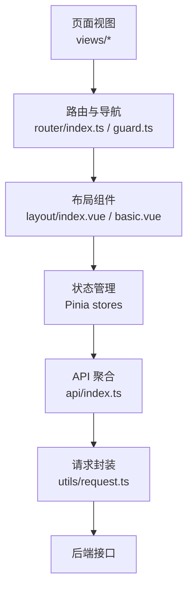
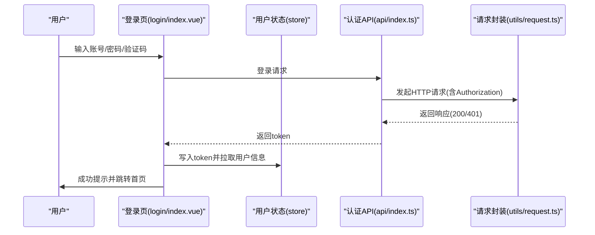
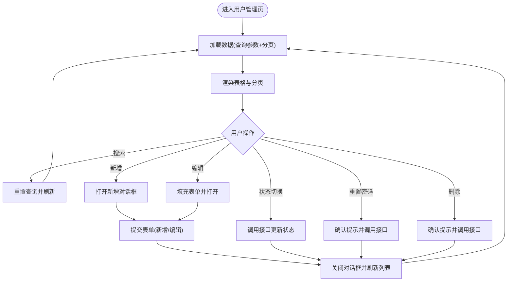
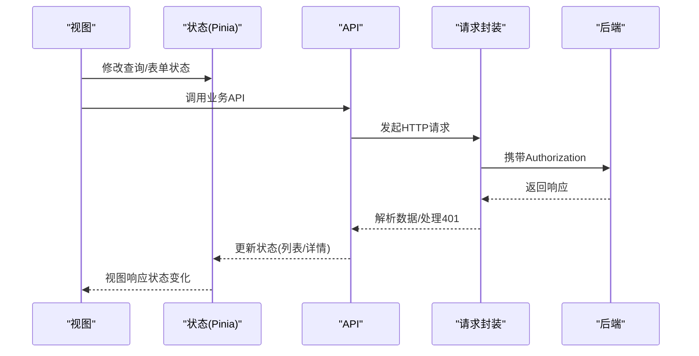
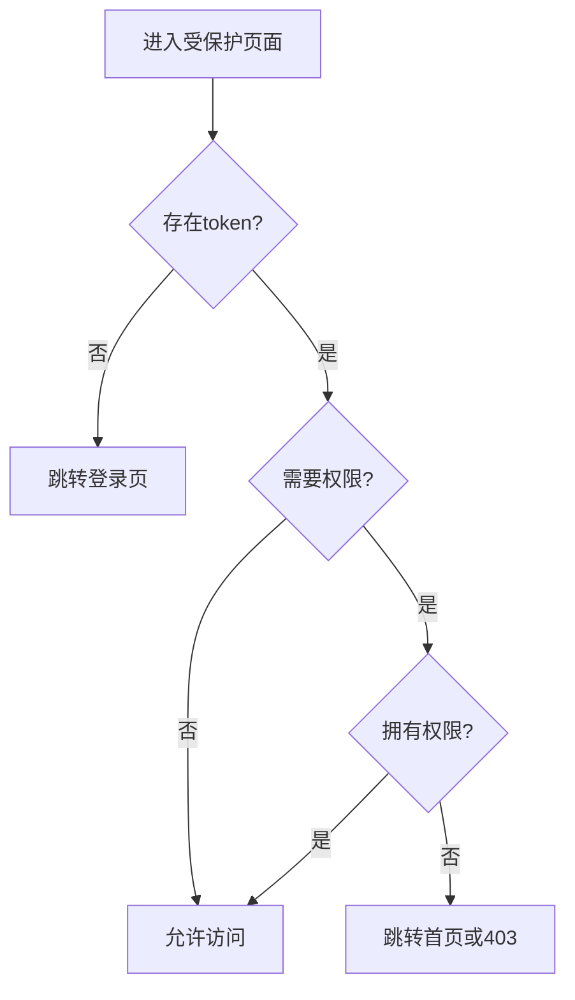
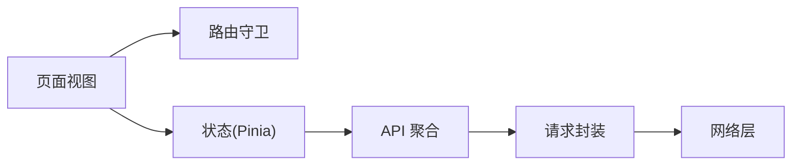

# 页面开发

<cite>
**本文引用的文件**
- [apps/app/src/pages/index/index.vue](file://apps/app/src/pages/index/index.vue)
- [apps/app/src/pages/login/index.vue](file://apps/app/src/pages/login/index.vue)
- [apps/app/src/stores/user.ts](file://apps/app/src/stores/user.ts)
- [apps/app/src/api/index.ts](file://apps/app/src/api/index.ts)
- [apps/app/src/utils/request.ts](file://apps/app/src/utils/request.ts)
- [apps/fronted/src/router/index.ts](file://apps/fronted/src/router/index.ts)
- [apps/fronted/src/store/modules/user.ts](file://apps/fronted/src/store/modules/user.ts)
- [apps/fronted/src/api/index.ts](file://apps/fronted/src/api/index.ts)
- [apps/fronted/src/utils/request.ts](file://apps/fronted/src/utils/request.ts)
- [apps/fronted/src/components/layout/index.vue](file://apps/fronted/src/components/layout/index.vue)
- [apps/vben-admin/apps/web-antd/src/router/guard.ts](file://apps/vben-admin/apps/web-antd/src/router/guard.ts)
- [apps/vben-admin/apps/web-antd/src/layouts/basic.vue](file://apps/vben-admin/apps/web-antd/src/layouts/basic.vue)
- [apps/fronted/src/views/system/user/index.vue](file://apps/fronted/src/views/system/user/index.vue)
- [apps/vben-admin/apps/web-antd/src/views/system/user/index.vue](file://apps/vben-admin/apps/web-antd/src/views/system/user/index.vue)
</cite>

## 目录
1. [引言](#引言)
2. [项目结构](#项目结构)
3. [核心组件](#核心组件)
4. [架构总览](#架构总览)
5. [详细组件分析](#详细组件分析)
6. [依赖关系分析](#依赖关系分析)
7. [性能考虑](#性能考虑)
8. [故障排查指南](#故障排查指南)
9. [结论](#结论)
10. [附录](#附录)

## 引言
本文件面向页面开发工程师与前端团队，系统化梳理本仓库中的页面开发规范、最佳实践与实现模式。内容覆盖页面布局与导航、CRUD 页面通用实现、表单页面与校验、状态管理与数据流、性能优化与懒加载、页面间导航与参数传递、权限控制与访问限制，以及页面开发工具链与脚手架使用建议。文档以实际源码为依据，配合图示帮助不同技术背景的读者快速上手。

## 项目结构
本仓库包含多端应用与多套前端工程，页面开发相关的关键位置如下：
- 小程序端（uni-app）：页面位于 apps/app/src/pages，状态管理在 apps/app/src/stores，网络请求封装在 apps/app/src/utils/request.ts，API 聚合在 apps/app/src/api/index.ts。
- 前端工程（Vue + daisyUI + Element Plus）：页面位于 apps/fronted/src/views，路由定义在 apps/fronted/src/router/index.ts，状态管理在 apps/fronted/src/store/modules/user.ts，网络请求封装在 apps/fronted/src/utils/request.ts，API 聚合在 apps/fronted/src/api/index.ts。
- Vben Admin 工程（Vue + Ant Design Vue）：页面位于 apps/vben-admin/apps/web-antd/src/views，路由守卫与权限在 apps/vben-admin/apps/web-antd/src/router/guard.ts，基础布局在 apps/vben-admin/apps/web-antd/src/layouts/basic.vue。

```mermaid
graph TB
subgraph "小程序端(uni-app)"
A_index["pages/index/index.vue"]
A_login["pages/login/index.vue"]
A_store_user["stores/user.ts"]
A_api["api/index.ts"]
A_req["utils/request.ts"]
end
subgraph "前端工程(Vue)"
F_router["router/index.ts"]
F_layout["components/layout/index.vue"]
F_store_user["store/modules/user.ts"]
F_api["api/index.ts"]
F_req["utils/request.ts"]
F_view_user["views/system/user/index.vue"]
end
subgraph "Vben Admin(Ant Design Vue)"
V_guard["router/guard.ts"]
V_layout["layouts/basic.vue"]
V_view_user["views/system/user/index.vue"]
end
A_index --> A_store_user
A_login --> A_store_user
A_store_user --> A_api
A_api --> A_req
F_router --> F_layout
F_layout --> F_store_user
F_store_user --> F_api
F_api --> F_req
F_view_user --> F_api
V_guard --> V_layout
V_view_user --> V_guard
```

**图表来源**
- [apps/app/src/pages/index/index.vue:1-158](file://apps/app/src/pages/index/index.vue#L1-L158)
- [apps/app/src/pages/login/index.vue:1-162](file://apps/app/src/pages/login/index.vue#L1-L162)
- [apps/app/src/stores/user.ts:1-61](file://apps/app/src/stores/user.ts#L1-L61)
- [apps/app/src/api/index.ts:1-37](file://apps/app/src/api/index.ts#L1-L37)
- [apps/app/src/utils/request.ts:1-57](file://apps/app/src/utils/request.ts#L1-L57)
- [apps/fronted/src/router/index.ts:1-160](file://apps/fronted/src/router/index.ts#L1-L160)
- [apps/fronted/src/components/layout/index.vue:1-234](file://apps/fronted/src/components/layout/index.vue#L1-L234)
- [apps/fronted/src/store/modules/user.ts:1-75](file://apps/fronted/src/store/modules/user.ts#L1-L75)
- [apps/fronted/src/api/index.ts:1-155](file://apps/fronted/src/api/index.ts#L1-L155)
- [apps/fronted/src/utils/request.ts:1-51](file://apps/fronted/src/utils/request.ts#L1-L51)
- [apps/fronted/src/views/system/user/index.vue:1-309](file://apps/fronted/src/views/system/user/index.vue#L1-L309)
- [apps/vben-admin/apps/web-antd/src/router/guard.ts:1-134](file://apps/vben-admin/apps/web-antd/src/router/guard.ts#L1-L134)
- [apps/vben-admin/apps/web-antd/src/layouts/basic.vue:1-257](file://apps/vben-admin/apps/web-antd/src/layouts/basic.vue#L1-L257)
- [apps/vben-admin/apps/web-antd/src/views/system/user/index.vue:1-408](file://apps/vben-admin/apps/web-antd/src/views/system/user/index.vue#L1-L408)

**章节来源**
- [apps/app/src/pages/index/index.vue:1-158](file://apps/app/src/pages/index/index.vue#L1-L158)
- [apps/app/src/pages/login/index.vue:1-162](file://apps/app/src/pages/login/index.vue#L1-L162)
- [apps/fronted/src/router/index.ts:1-160](file://apps/fronted/src/router/index.ts#L1-L160)
- [apps/fronted/src/components/layout/index.vue:1-234](file://apps/fronted/src/components/layout/index.vue#L1-L234)
- [apps/vben-admin/apps/web-antd/src/router/guard.ts:1-134](file://apps/vben-admin/apps/web-antd/src/router/guard.ts#L1-L134)

## 核心组件
- 页面容器与布局
  - 前端工程的基础布局组件负责响应式侧边栏、面包屑、主题与语言切换、用户下拉菜单等，页面通过路由出口渲染。
  - Vben Admin 提供更丰富的布局模板与通知、锁屏等扩展能力。
- 路由与导航
  - 前端工程采用 Vue Router 定义静态路由与权限元信息；小程序端通过 uni.switchTab/redirectTo 进行页面跳转。
- 状态管理
  - 使用 Pinia 管理用户令牌、用户信息、菜单与权限集合；小程序端与前端工程分别实现登录、登出、信息拉取等动作。
- 数据访问层
  - API 聚合模块按业务域划分；请求封装统一处理鉴权头、错误提示与 401 处理。

**章节来源**
- [apps/fronted/src/components/layout/index.vue:1-234](file://apps/fronted/src/components/layout/index.vue#L1-L234)
- [apps/vben-admin/apps/web-antd/src/layouts/basic.vue:1-257](file://apps/vben-admin/apps/web-antd/src/layouts/basic.vue#L1-L257)
- [apps/fronted/src/router/index.ts:1-160](file://apps/fronted/src/router/index.ts#L1-L160)
- [apps/app/src/stores/user.ts:1-61](file://apps/app/src/stores/user.ts#L1-L61)
- [apps/fronted/src/store/modules/user.ts:1-75](file://apps/fronted/src/store/modules/user.ts#L1-L75)
- [apps/app/src/api/index.ts:1-37](file://apps/app/src/api/index.ts#L1-L37)
- [apps/fronted/src/api/index.ts:1-155](file://apps/fronted/src/api/index.ts#L1-L155)
- [apps/app/src/utils/request.ts:1-57](file://apps/app/src/utils/request.ts#L1-L57)
- [apps/fronted/src/utils/request.ts:1-51](file://apps/fronted/src/utils/request.ts#L1-L51)

## 架构总览
页面开发遵循“布局/路由/状态/数据”四层解耦：
- 布局层：提供统一的头部、侧边栏、面包屑、用户菜单与主题语言切换。
- 路由层：定义页面路由、权限元信息与导航守卫。
- 状态层：集中管理用户令牌、用户信息、菜单与权限。
- 数据层：API 聚合与请求拦截器，统一封装错误处理与 401 自动跳转。

**图表来源**
- [apps/fronted/src/router/index.ts:1-160](file://apps/fronted/src/router/index.ts#L1-L160)
- [apps/vben-admin/apps/web-antd/src/router/guard.ts:1-134](file://apps/vben-admin/apps/web-antd/src/router/guard.ts#L1-L134)
- [apps/fronted/src/components/layout/index.vue:1-234](file://apps/fronted/src/components/layout/index.vue#L1-L234)
- [apps/vben-admin/apps/web-antd/src/layouts/basic.vue:1-257](file://apps/vben-admin/apps/web-antd/src/layouts/basic.vue#L1-L257)
- [apps/fronted/src/store/modules/user.ts:1-75](file://apps/fronted/src/store/modules/user.ts#L1-L75)
- [apps/app/src/stores/user.ts:1-61](file://apps/app/src/stores/user.ts#L1-L61)
- [apps/fronted/src/api/index.ts:1-155](file://apps/fronted/src/api/index.ts#L1-L155)
- [apps/app/src/api/index.ts:1-37](file://apps/app/src/api/index.ts#L1-L37)
- [apps/fronted/src/utils/request.ts:1-51](file://apps/fronted/src/utils/request.ts#L1-L51)
- [apps/app/src/utils/request.ts:1-57](file://apps/app/src/utils/request.ts#L1-L57)

## 详细组件分析

### 登录页面与会话管理
- 功能要点
  - 输入用户名/密码与验证码，提交后写入本地存储 token，并拉取用户信息。
  - 验证码刷新与失败重试，登录成功后跳转首页。
- 最佳实践
  - 表单字段必填校验与提示；401 统一处理与自动清空 token。
  - 登录成功后立即拉取用户信息，避免二次请求。
- 小程序端与前端工程差异
  - 小程序端使用 uni-api 进行跳转与提示；前端工程使用 axios 与 Element Plus 提示。

**图表来源**
- [apps/app/src/pages/login/index.vue:53-71](file://apps/app/src/pages/login/index.vue#L53-L71)
- [apps/app/src/stores/user.ts:30-49](file://apps/app/src/stores/user.ts#L30-L49)
- [apps/app/src/api/index.ts:5-11](file://apps/app/src/api/index.ts#L5-L11)
- [apps/app/src/utils/request.ts:10-45](file://apps/app/src/utils/request.ts#L10-L45)

**章节来源**
- [apps/app/src/pages/login/index.vue:1-162](file://apps/app/src/pages/login/index.vue#L1-L162)
- [apps/app/src/stores/user.ts:1-61](file://apps/app/src/stores/user.ts#L1-L61)
- [apps/app/src/api/index.ts:1-37](file://apps/app/src/api/index.ts#L1-L37)
- [apps/app/src/utils/request.ts:1-57](file://apps/app/src/utils/request.ts#L1-L57)

### 用户中心与首页
- 首页展示用户信息、系统公告与快捷入口；登录态缺失时引导至登录或个人中心。
- 用户中心展示头像占位、昵称与角色列表，支持跳转至登录或中心页。

**章节来源**
- [apps/app/src/pages/index/index.vue:1-158](file://apps/app/src/pages/index/index.vue#L1-L158)

### 系统用户管理页面（CRUD）
- 设计模式
  - 搜索区 + 工具栏卡片 + 表格卡片 + 分页 + 对话框表单。
  - 查询参数与分页参数分离，加载状态与空态统一处理。
- 组件组合
  - 表格列自定义渲染（图标、状态开关、操作按钮）。
  - 对话框表单：用户名/密码（新增必填）、邮箱/手机、部门树选择、岗位/角色多选、状态单选。
- 交互流程
  - 加载数据、加载部门树与选项、提交新增/编辑、批量操作（重置密码、删除）。
  - 状态变更通过接口更新并即时反馈。

**图表来源**
- [apps/fronted/src/views/system/user/index.vue:228-309](file://apps/fronted/src/views/system/user/index.vue#L228-L309)
- [apps/vben-admin/apps/web-antd/src/views/system/user/index.vue:130-229](file://apps/vben-admin/apps/web-antd/src/views/system/user/index.vue#L130-L229)

**章节来源**
- [apps/fronted/src/views/system/user/index.vue:1-309](file://apps/fronted/src/views/system/user/index.vue#L1-L309)
- [apps/vben-admin/apps/web-antd/src/views/system/user/index.vue:1-408](file://apps/vben-admin/apps/web-antd/src/views/system/user/index.vue#L1-L408)

### 表单页面与验证规则
- 前端工程（Element Plus）
  - 表单控件与校验：必填项、邮箱格式、多选/树选择等；提交前校验，成功后提示并刷新。
- Vben Admin（Ant Design Vue）
  - 表单控件与校验：必填规则、密码输入、部门树选择、角色多选、状态选择；提交时根据是否存在 id 区分新增/编辑。
- 最佳实践
  - 必填字段在表单层面配置校验规则；接口失败时统一提示与回滚状态。
  - 新增时隐藏不可编辑字段（如用户名），编辑时仅提交必要字段。

**章节来源**
- [apps/fronted/src/views/system/user/index.vue:143-204](file://apps/fronted/src/views/system/user/index.vue#L143-L204)
- [apps/vben-admin/apps/web-antd/src/views/system/user/index.vue:360-405](file://apps/vben-admin/apps/web-antd/src/views/system/user/index.vue#L360-L405)

### 页面状态管理与数据流
- 小程序端
  - 用户状态：token、userInfo；登录/登出/获取信息；401 清理 token 并跳转登录。
- 前端工程
  - 用户状态：token、userInfo、menus、permissions；登录后拉取完整信息；登出清理本地存储与状态。
- 数据流
  - 视图 -> 状态 -> API -> 请求封装 -> 后端；错误统一拦截与提示。

**图表来源**
- [apps/fronted/src/store/modules/user.ts:26-75](file://apps/fronted/src/store/modules/user.ts#L26-L75)
- [apps/app/src/stores/user.ts:14-61](file://apps/app/src/stores/user.ts#L14-L61)
- [apps/fronted/src/api/index.ts:14-24](file://apps/fronted/src/api/index.ts#L14-L24)
- [apps/app/src/api/index.ts:13-37](file://apps/app/src/api/index.ts#L13-L37)
- [apps/fronted/src/utils/request.ts:13-48](file://apps/fronted/src/utils/request.ts#L13-L48)
- [apps/app/src/utils/request.ts:10-45](file://apps/app/src/utils/request.ts#L10-L45)

**章节来源**
- [apps/app/src/stores/user.ts:1-61](file://apps/app/src/stores/user.ts#L1-L61)
- [apps/fronted/src/store/modules/user.ts:1-75](file://apps/fronted/src/store/modules/user.ts#L1-L75)
- [apps/fronted/src/api/index.ts:1-155](file://apps/fronted/src/api/index.ts#L1-L155)
- [apps/app/src/api/index.ts:1-37](file://apps/app/src/api/index.ts#L1-L37)
- [apps/fronted/src/utils/request.ts:1-51](file://apps/fronted/src/utils/request.ts#L1-L51)
- [apps/app/src/utils/request.ts:1-57](file://apps/app/src/utils/request.ts#L1-L57)

### 页面导航与权限控制
- 前端工程（Vue Router）
  - 路由元信息包含权限标识；导航守卫检查 token 与权限，未满足则跳转登录或首页。
- Vben Admin（路由守卫）
  - 通用守卫：记录已加载页面、进度条；访问守卫：生成动态路由、保存菜单与路由、处理重定向。
- 小程序端
  - 通过 uni.switchTab/redirectTo 实现页面跳转；登录态缺失时自动跳转登录。

**图表来源**
- [apps/fronted/src/router/index.ts:130-157](file://apps/fronted/src/router/index.ts#L130-L157)
- [apps/vben-admin/apps/web-antd/src/router/guard.ts:47-120](file://apps/vben-admin/apps/web-antd/src/router/guard.ts#L47-L120)

**章节来源**
- [apps/fronted/src/router/index.ts:1-160](file://apps/fronted/src/router/index.ts#L1-L160)
- [apps/vben-admin/apps/web-antd/src/router/guard.ts:1-134](file://apps/vben-admin/apps/web-antd/src/router/guard.ts#L1-L134)

### 页面布局与组件组合
- 前端工程
  - 移动端抽屉 + 桌面端侧边栏 + 面包屑 + 主题/语言/用户下拉；页面通过 router-view 渲染。
- Vben Admin
  - 基础布局模板 + 通知面板 + 锁屏 + 登录过期弹窗；支持水印与偏好设置联动。

**章节来源**
- [apps/fronted/src/components/layout/index.vue:1-234](file://apps/fronted/src/components/layout/index.vue#L1-L234)
- [apps/vben-admin/apps/web-antd/src/layouts/basic.vue:1-257](file://apps/vben-admin/apps/web-antd/src/layouts/basic.vue#L1-L257)

## 依赖关系分析
- 页面与路由
  - 页面通过路由注册与导航守卫进行访问控制；移动端通过 uni-app 导航 API。
- 页面与状态
  - 所有页面共享同一用户状态，避免重复登录与权限判断。
- 页面与数据
  - API 聚合模块按业务域拆分，请求封装统一处理鉴权与错误。

**图表来源**
- [apps/fronted/src/router/index.ts:130-157](file://apps/fronted/src/router/index.ts#L130-L157)
- [apps/fronted/src/store/modules/user.ts:26-75](file://apps/fronted/src/store/modules/user.ts#L26-L75)
- [apps/fronted/src/api/index.ts:1-155](file://apps/fronted/src/api/index.ts#L1-L155)
- [apps/fronted/src/utils/request.ts:1-51](file://apps/fronted/src/utils/request.ts#L1-L51)

**章节来源**
- [apps/fronted/src/router/index.ts:1-160](file://apps/fronted/src/router/index.ts#L1-L160)
- [apps/fronted/src/store/modules/user.ts:1-75](file://apps/fronted/src/store/modules/user.ts#L1-L75)
- [apps/fronted/src/api/index.ts:1-155](file://apps/fronted/src/api/index.ts#L1-L155)
- [apps/fronted/src/utils/request.ts:1-51](file://apps/fronted/src/utils/request.ts#L1-L51)

## 性能考虑
- 列表加载
  - 使用分页参数与加载状态，避免一次性渲染大量数据。
  - 表格空态与骨架态提示，提升感知性能。
- 图片与资源
  - 头像占位符与懒加载策略，减少首屏阻塞。
- 网络请求
  - 统一请求拦截器处理超时与错误，避免重复请求。
- 路由与布局
  - 路由懒加载与页面加载进度条，改善切换体验。

[本节为通用指导，不直接分析具体文件]

## 故障排查指南
- 登录失败
  - 检查请求封装是否正确携带 Authorization；查看 401 处理逻辑是否触发清理与跳转。
- 权限不足
  - 确认路由元信息中的权限标识与用户权限集合匹配；检查状态是否已拉取完整权限。
- 表单提交失败
  - 查看 API 返回码与消息；确认必填字段与校验规则；观察提示组件是否正确显示。
- 页面空白或白屏
  - 检查路由守卫是否正确重定向；确认状态初始化与异常捕获逻辑。

**章节来源**
- [apps/app/src/utils/request.ts:31-36](file://apps/app/src/utils/request.ts#L31-L36)
- [apps/fronted/src/utils/request.ts:29-36](file://apps/fronted/src/utils/request.ts#L29-L36)
- [apps/fronted/src/router/index.ts:138-156](file://apps/fronted/src/router/index.ts#L138-L156)

## 结论
本仓库提供了完整的页面开发参考：从布局与导航、CRUD 与表单、状态管理与数据流，到权限控制与性能优化均有清晰实现。建议在新页面开发中遵循以下原则：
- 统一使用 Pinia 管理用户状态，避免分散登录态。
- 采用 API 聚合模块与请求封装，确保一致的错误处理与鉴权。
- CRUD 页面遵循“搜索区 + 表格 + 分页 + 对话框”的组合模式。
- 表单页面明确区分新增/编辑场景，合理配置校验规则。
- 路由守卫与权限标识保持一致，保障访问安全。
- 在移动端与桌面端分别优化交互与性能。

[本节为总结性内容，不直接分析具体文件]

## 附录
- 页面开发工具链与脚手架
  - 前端工程基于 Vite + Vue + TypeScript；可结合 ESLint、Stylelint、Prettier 与 Commitlint 规范代码风格与提交信息。
  - Vben Admin 提供路由守卫、布局模板与偏好设置，便于快速搭建后台页面。
- 参考路径
  - 路由与守卫：apps/fronted/src/router/index.ts、apps/vben-admin/apps/web-antd/src/router/guard.ts
  - 布局与主题：apps/fronted/src/components/layout/index.vue、apps/vben-admin/apps/web-antd/src/layouts/basic.vue
  - 状态与 API：apps/fronted/src/store/modules/user.ts、apps/fronted/src/api/index.ts
  - 请求封装：apps/fronted/src/utils/request.ts、apps/app/src/utils/request.ts

[本节为补充信息，不直接分析具体文件]