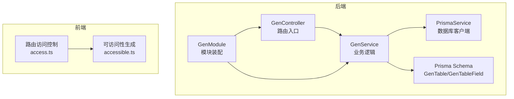
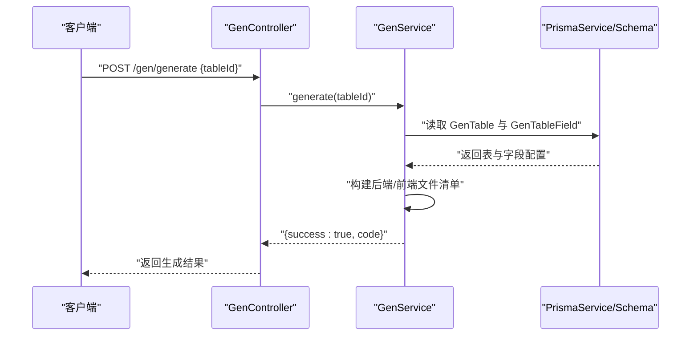
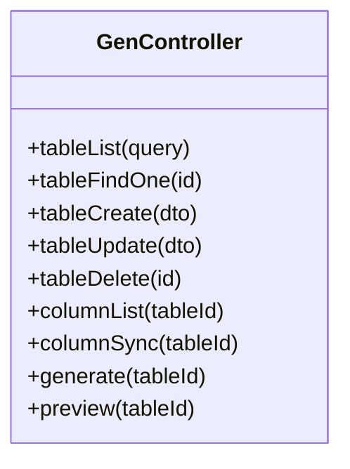
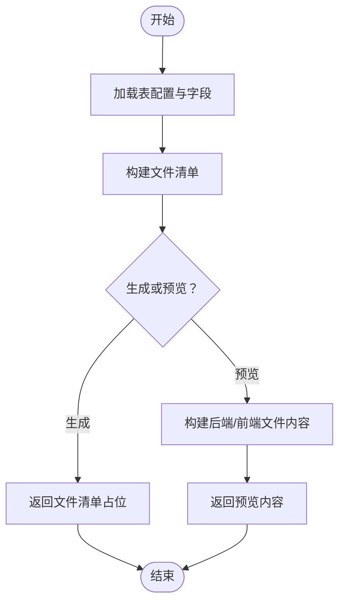
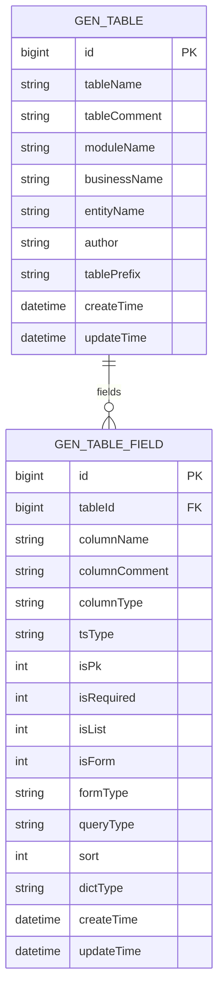
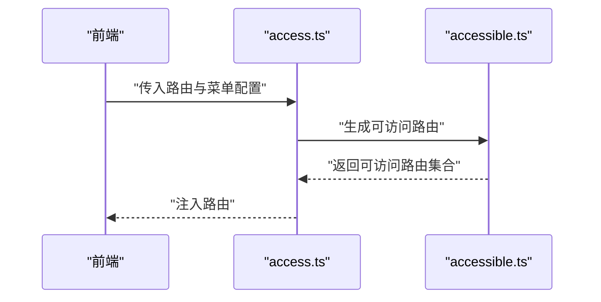
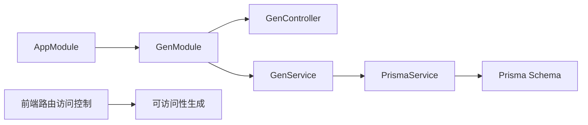

# 代码生成器

<cite>
**本文引用的文件**
- [apps/backend/src/modules/gen/gen.controller.ts](file://apps/backend/src/modules/gen/gen.controller.ts)
- [apps/backend/src/modules/gen/gen.service.ts](file://apps/backend/src/modules/gen/gen.service.ts)
- [apps/backend/src/modules/gen/gen.module.ts](file://apps/backend/src/modules/gen/gen.module.ts)
- [apps/backend/prisma/schema.prisma](file://apps/backend/prisma/schema.prisma)
- [apps/backend/src/common/prisma.service.ts](file://apps/backend/src/common/prisma.service.ts)
- [apps/backend/src/app.module.ts](file://apps/backend/src/app.module.ts)
- [apps/vben-admin/apps/web-antd/src/router/access.ts](file://apps/vben-admin/apps/web-antd/src/router/access.ts)
- [apps/vben-admin/packages/effects/access/src/accessible.ts](file://apps/vben-admin/packages/effects/access/src/accessible.ts)
</cite>

## 目录
1. [简介](#简介)
2. [项目结构](#项目结构)
3. [核心组件](#核心组件)
4. [架构总览](#架构总览)
5. [详细组件分析](#详细组件分析)
6. [依赖关系分析](#依赖关系分析)
7. [性能考虑](#性能考虑)
8. [故障排查指南](#故障排查指南)
9. [结论](#结论)
10. [附录](#附录)

## 简介
本文件面向“代码生成器”模块，系统化梳理基于数据库表的代码自动生成机制，覆盖以下方面：
- 表结构解析与字段配置：通过 Prisma 模型定义表与字段元数据，支持字段级配置（是否必填、是否列表显示、是否表单字段、查询方式、字典类型等）。
- 代码模板引擎与生成策略：后端采用简单字符串拼接模板，前端生成基础页面与 API 文件；提供“预览”能力输出前后端文件内容。
- 表配置管理：提供增删改查接口与同步能力占位，便于在 UI 中维护表与字段配置。
- 差异化生成策略：后端生成控制器、服务、DTO、实体；前端生成列表页、表单组件、API 封装。
- 安全与版本：鉴权守卫保护接口；生成结果以可下载的压缩包形式返回（当前为占位返回文件清单）。
- 流程示例与自定义模板指南：给出完整生成流程与扩展点。

## 项目结构
代码生成器位于后端 Nest 应用的模块化目录下，配合 Prisma 数据库模型与前端路由访问控制模块共同构成完整链路。

**图表来源**
- [apps/backend/src/modules/gen/gen.controller.ts:1-65](file://apps/backend/src/modules/gen/gen.controller.ts#L1-L65)
- [apps/backend/src/modules/gen/gen.service.ts:1-105](file://apps/backend/src/modules/gen/gen.service.ts#L1-L105)
- [apps/backend/src/modules/gen/gen.module.ts:1-10](file://apps/backend/src/modules/gen/gen.module.ts#L1-L10)
- [apps/backend/prisma/schema.prisma:291-332](file://apps/backend/prisma/schema.prisma#L291-L332)
- [apps/backend/src/common/prisma.service.ts:1-22](file://apps/backend/src/common/prisma.service.ts#L1-L22)
- [apps/vben-admin/apps/web-antd/src/router/access.ts:1-58](file://apps/vben-admin/apps/web-antd/src/router/access.ts#L1-L58)
- [apps/vben-admin/packages/effects/access/src/accessible.ts:1-35](file://apps/vben-admin/packages/effects/access/src/accessible.ts#L1-L35)

**章节来源**
- [apps/backend/src/modules/gen/gen.controller.ts:1-65](file://apps/backend/src/modules/gen/gen.controller.ts#L1-L65)
- [apps/backend/src/modules/gen/gen.service.ts:1-105](file://apps/backend/src/modules/gen/gen.service.ts#L1-L105)
- [apps/backend/src/modules/gen/gen.module.ts:1-10](file://apps/backend/src/modules/gen/gen.module.ts#L1-L10)
- [apps/backend/prisma/schema.prisma:291-332](file://apps/backend/prisma/schema.prisma#L291-L332)
- [apps/backend/src/common/prisma.service.ts:1-22](file://apps/backend/src/common/prisma.service.ts#L1-L22)
- [apps/backend/src/app.module.ts:1-59](file://apps/backend/src/app.module.ts#L1-L59)
- [apps/vben-admin/apps/web-antd/src/router/access.ts:1-58](file://apps/vben-admin/apps/web-antd/src/router/access.ts#L1-L58)
- [apps/vben-admin/packages/effects/access/src/accessible.ts:1-35](file://apps/vben-admin/packages/effects/access/src/accessible.ts#L1-L35)

## 核心组件
- 控制器（GenController）：暴露 REST 接口，负责接收请求并调用服务层；对所有接口启用 JWT 鉴权守卫。
- 服务（GenService）：封装业务逻辑，包含表与字段的 CRUD、列同步占位、代码生成与预览。
- 模块（GenModule）：装配控制器与服务，向外部导出服务实例。
- 数据模型（Prisma Schema）：定义 GenTable 与 GenTableField，承载表配置与字段配置。
- 数据库服务（PrismaService）：Nest 包装的 Prisma 客户端，提供连接生命周期管理。
- 前端路由访问控制：将后端组件路径映射到前端页面，生成可访问路由集合。

**章节来源**
- [apps/backend/src/modules/gen/gen.controller.ts:1-65](file://apps/backend/src/modules/gen/gen.controller.ts#L1-L65)
- [apps/backend/src/modules/gen/gen.service.ts:1-105](file://apps/backend/src/modules/gen/gen.service.ts#L1-L105)
- [apps/backend/src/modules/gen/gen.module.ts:1-10](file://apps/backend/src/modules/gen/gen.module.ts#L1-L10)
- [apps/backend/prisma/schema.prisma:291-332](file://apps/backend/prisma/schema.prisma#L291-L332)
- [apps/backend/src/common/prisma.service.ts:1-22](file://apps/backend/src/common/prisma.service.ts#L1-L22)
- [apps/vben-admin/apps/web-antd/src/router/access.ts:1-58](file://apps/vben-admin/apps/web-antd/src/router/access.ts#L1-L58)

## 架构总览
代码生成器采用“控制器-服务-数据模型”的分层设计，结合 Prisma 的强类型模型与 Nest 的模块化组织，形成清晰的职责边界。前端通过路由访问控制模块将后端组件路径映射为可访问页面。

**图表来源**
- [apps/backend/src/modules/gen/gen.controller.ts:54-58](file://apps/backend/src/modules/gen/gen.controller.ts#L54-L58)
- [apps/backend/src/modules/gen/gen.service.ts:56-61](file://apps/backend/src/modules/gen/gen.service.ts#L56-L61)
- [apps/backend/prisma/schema.prisma:291-332](file://apps/backend/prisma/schema.prisma#L291-L332)

## 详细组件分析

### 控制器（GenController）
- 路由分组：统一前缀 /gen，包含表管理、列管理、生成与预览接口。
- 安全控制：全局启用 JWT 鉴权守卫，确保接口访问安全。
- 主要接口：
  - 列表/详情/新增/更新/删除：表配置管理。
  - 列表/同步：字段配置管理与数据库同步占位。
  - 生成：触发代码生成，返回文件清单（当前为占位）。
  - 预览：返回后端与前端文件内容，便于在线预览。

**图表来源**
- [apps/backend/src/modules/gen/gen.controller.ts:1-65](file://apps/backend/src/modules/gen/gen.controller.ts#L1-L65)

**章节来源**
- [apps/backend/src/modules/gen/gen.controller.ts:1-65](file://apps/backend/src/modules/gen/gen.controller.ts#L1-L65)

### 服务（GenService）
- 表管理：提供分页查询、详情、创建、更新、删除；删除时级联清理字段。
- 字段管理：提供字段列表与同步占位（生产环境应读取真实数据库结构）。
- 生成与预览：
  - 生成：根据表配置构建后端与前端文件清单（当前为占位返回文件名数组）。
  - 预览：分别构建后端与前端文件内容（字符串模板），用于前端展示。

**图表来源**
- [apps/backend/src/modules/gen/gen.service.ts:56-69](file://apps/backend/src/modules/gen/gen.service.ts#L56-L69)
- [apps/backend/src/modules/gen/gen.service.ts:71-105](file://apps/backend/src/modules/gen/gen.service.ts#L71-L105)

**章节来源**
- [apps/backend/src/modules/gen/gen.service.ts:1-105](file://apps/backend/src/modules/gen/gen.service.ts#L1-L105)

### 模块（GenModule）
- 组织控制器与服务，向外部导出服务实例，便于跨模块复用。

**章节来源**
- [apps/backend/src/modules/gen/gen.module.ts:1-10](file://apps/backend/src/modules/gen/gen.module.ts#L1-L10)

### 数据模型（Prisma Schema）
- GenTable：表级配置，包含表名、注释、模块名、业务名、实体名、作者、表前缀等。
- GenTableField：字段级配置，包含列名、注释、类型、TS 类型、主键、必填、列表/表单显示、表单类型、查询类型、排序、字典类型等。
- 关系：GenTable 与 GenTableField 为一对多关系，按排序字段升序排列。

**图表来源**
- [apps/backend/prisma/schema.prisma:293-332](file://apps/backend/prisma/schema.prisma#L293-L332)

**章节来源**
- [apps/backend/prisma/schema.prisma:291-332](file://apps/backend/prisma/schema.prisma#L291-L332)

### 前端路由访问控制
- 路由映射：将后端组件路径映射为前端页面路径，支持后端组件字段与前端页面的对接。
- 可访问性生成：根据模式生成可访问路由集合，便于权限控制与菜单渲染。

**图表来源**
- [apps/vben-admin/apps/web-antd/src/router/access.ts:1-58](file://apps/vben-admin/apps/web-antd/src/router/access.ts#L1-L58)
- [apps/vben-admin/packages/effects/access/src/accessible.ts:1-35](file://apps/vben-admin/packages/effects/access/src/accessible.ts#L1-L35)

**章节来源**
- [apps/vben-admin/apps/web-antd/src/router/access.ts:1-58](file://apps/vben-admin/apps/web-antd/src/router/access.ts#L1-L58)
- [apps/vben-admin/packages/effects/access/src/accessible.ts:1-35](file://apps/vben-admin/packages/effects/access/src/accessible.ts#L1-L35)

## 依赖关系分析
- 控制器依赖服务；服务依赖 PrismaService 与 Prisma Schema；模块装配控制器与服务。
- 前端路由访问控制依赖后端组件路径与页面映射规则。
- 应用模块引入 GenModule，使代码生成器成为应用的一部分。

**图表来源**
- [apps/backend/src/app.module.ts:13-37](file://apps/backend/src/app.module.ts#L13-L37)
- [apps/backend/src/modules/gen/gen.module.ts:1-10](file://apps/backend/src/modules/gen/gen.module.ts#L1-L10)
- [apps/backend/src/modules/gen/gen.controller.ts:1-65](file://apps/backend/src/modules/gen/gen.controller.ts#L1-L65)
- [apps/backend/src/modules/gen/gen.service.ts:1-105](file://apps/backend/src/modules/gen/gen.service.ts#L1-L105)
- [apps/backend/src/common/prisma.service.ts:1-22](file://apps/backend/src/common/prisma.service.ts#L1-L22)
- [apps/backend/prisma/schema.prisma:291-332](file://apps/backend/prisma/schema.prisma#L291-L332)
- [apps/vben-admin/apps/web-antd/src/router/access.ts:1-58](file://apps/vben-admin/apps/web-antd/src/router/access.ts#L1-L58)
- [apps/vben-admin/packages/effects/access/src/accessible.ts:1-35](file://apps/vben-admin/packages/effects/access/src/accessible.ts#L1-L35)

**章节来源**
- [apps/backend/src/app.module.ts:1-59](file://apps/backend/src/app.module.ts#L1-L59)
- [apps/backend/src/modules/gen/gen.module.ts:1-10](file://apps/backend/src/modules/gen/gen.module.ts#L1-L10)
- [apps/backend/src/modules/gen/gen.controller.ts:1-65](file://apps/backend/src/modules/gen/gen.controller.ts#L1-L65)
- [apps/backend/src/modules/gen/gen.service.ts:1-105](file://apps/backend/src/modules/gen/gen.service.ts#L1-L105)
- [apps/backend/src/common/prisma.service.ts:1-22](file://apps/backend/src/common/prisma.service.ts#L1-L22)
- [apps/backend/prisma/schema.prisma:291-332](file://apps/backend/prisma/schema.prisma#L291-L332)
- [apps/vben-admin/apps/web-antd/src/router/access.ts:1-58](file://apps/vben-admin/apps/web-antd/src/router/access.ts#L1-L58)
- [apps/vben-admin/packages/effects/access/src/accessible.ts:1-35](file://apps/vben-admin/packages/effects/access/src/accessible.ts#L1-L35)

## 性能考虑
- 查询优化：列表接口使用分页与排序，避免一次性加载大量数据。
- 并发控制：应用层已集成限流守卫，建议在生成接口上保持谨慎并发策略，避免高负载。
- I/O 优化：当前生成为内存内字符串拼接，后续若接入文件系统或压缩包生成，需注意磁盘与网络 I/O 的开销。
- 数据库连接：PrismaService 提供连接生命周期管理，确保连接池健康与断线重连。

## 故障排查指南
- 访问被拒绝：确认请求头携带有效 JWT，控制器已启用鉴权守卫。
- 表不存在：详情查询未命中会抛出“未找到”异常，检查 tableId 是否正确。
- 生成为空：当前生成返回文件清单为占位，实际生成逻辑需在服务中完善。
- 预览不完整：预览仅返回后端与前端文件内容，具体页面需在前端工程中落地。

**章节来源**
- [apps/backend/src/modules/gen/gen.controller.ts:1-65](file://apps/backend/src/modules/gen/gen.controller.ts#L1-L65)
- [apps/backend/src/modules/gen/gen.service.ts:21-25](file://apps/backend/src/modules/gen/gen.service.ts#L21-L25)

## 结论
代码生成器模块以简洁的分层架构实现了表与字段配置、代码生成与预览能力。当前实现侧重于接口与模板占位，后续可在以下方向演进：
- 完善列同步：从数据库读取真实结构并写入 GenTableField。
- 扩展模板引擎：引入模板引擎（如 Handlebars/VTL）以支持复杂模板与条件渲染。
- 生成产物：将文件清单转换为可下载的压缩包，包含后端与前端文件。
- 安全加固：在生成前进行权限校验与输入校验，防止越权与注入风险。
- 版本管理：在生成目录中引入版本标记与变更记录，便于回溯与对比。

## 附录

### 代码生成流程示例
- 步骤一：在 UI 中创建/编辑表配置（表名、模块名、业务名、实体名、作者、表前缀等）。
- 步骤二：同步字段（从数据库读取结构并写入 GenTableField）。
- 步骤三：配置字段属性（必填、列表/表单显示、表单类型、查询类型、字典类型等）。
- 步骤四：点击“预览”，查看后端控制器、服务与前端页面、API 的内容。
- 步骤五：点击“生成”，获取可下载的压缩包（当前为占位，返回文件清单）。

**章节来源**
- [apps/backend/src/modules/gen/gen.controller.ts:12-64](file://apps/backend/src/modules/gen/gen.controller.ts#L12-L64)
- [apps/backend/src/modules/gen/gen.service.ts:56-69](file://apps/backend/src/modules/gen/gen.service.ts#L56-L69)
- [apps/backend/prisma/schema.prisma:293-332](file://apps/backend/prisma/schema.prisma#L293-L332)

### 自定义模板开发指南
- 后端模板：
  - 控制器：按模块名与实体名生成路由与导入。
  - 服务：注入 PrismaService，预留 CRUD 方法扩展点。
  - DTO：按实体名生成创建/更新 DTO。
  - 实体：按实体名生成实体文件（可结合 Prisma 模型）。
- 前端模板：
  - 列表页：生成基础列表、分页、搜索、操作按钮。
  - 表单组件：按字段生成表单项与校验规则。
  - API 封装：生成统一的 API 请求方法与类型定义。
- 模板引擎建议：
  - 使用字符串模板时，建议拆分为独立文件并在服务中按需拼接。
  - 引入模板引擎后，可通过配置项控制模板路径与变量替换。
- 安全与版本：
  - 在生成前进行权限校验与输入校验。
  - 生成目录引入版本号与时间戳，便于追踪与回滚。

**章节来源**
- [apps/backend/src/modules/gen/gen.service.ts:71-105](file://apps/backend/src/modules/gen/gen.service.ts#L71-L105)
- [apps/backend/prisma/schema.prisma:293-332](file://apps/backend/prisma/schema.prisma#L293-L332)