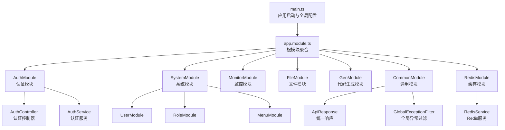
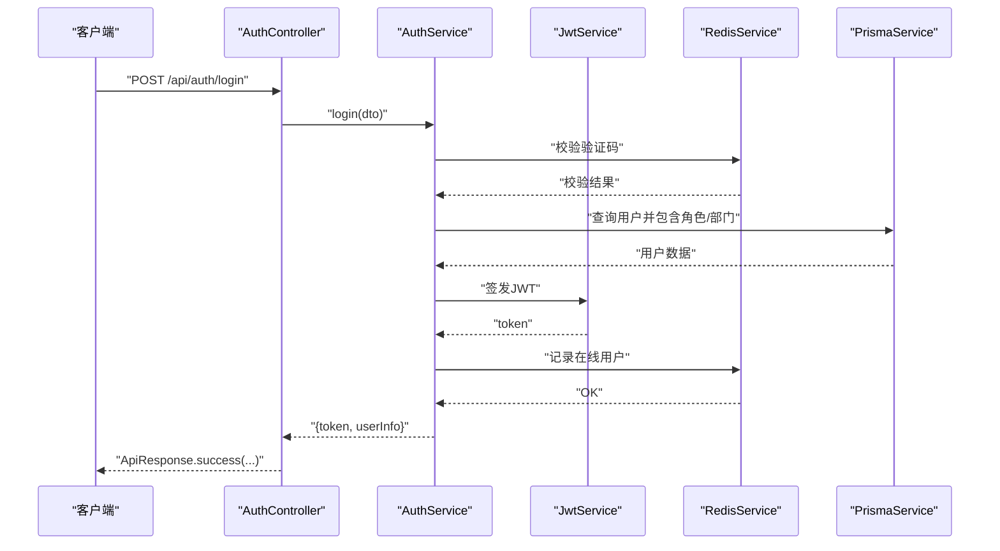
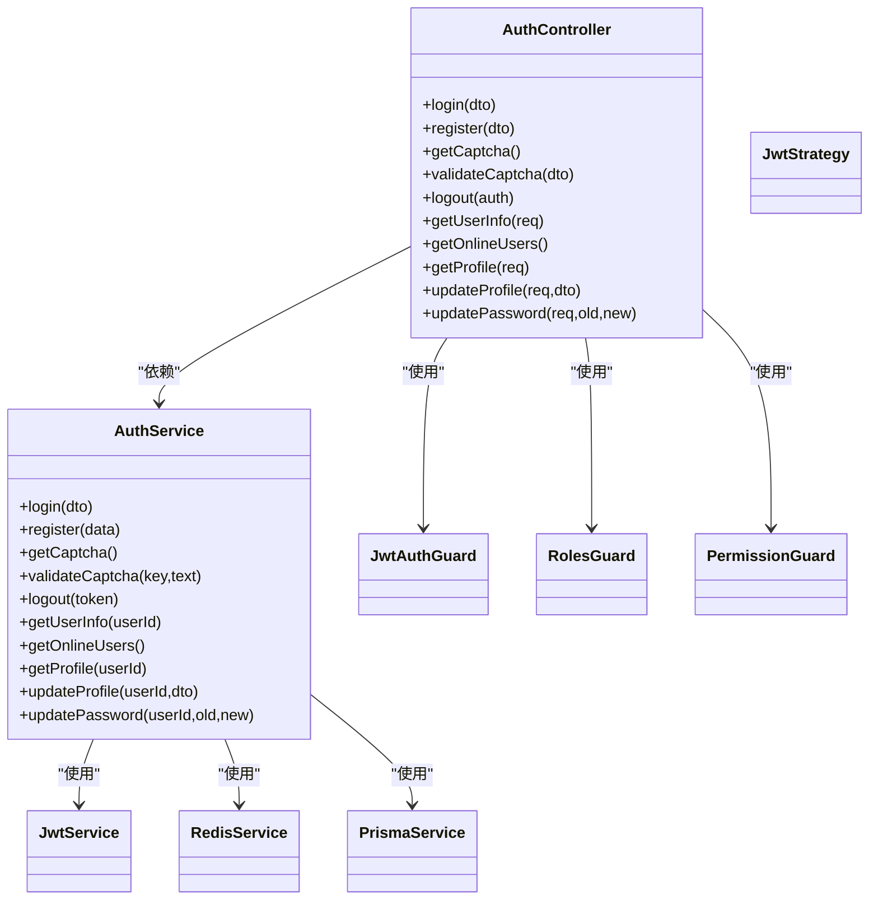
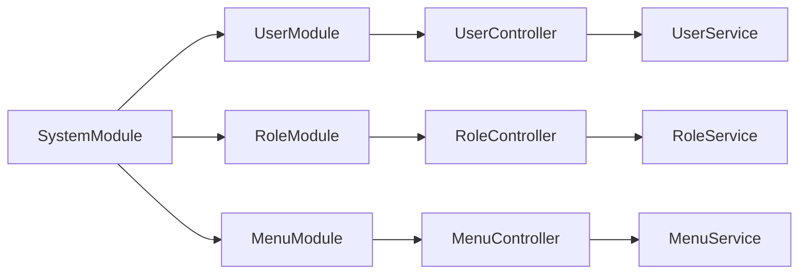
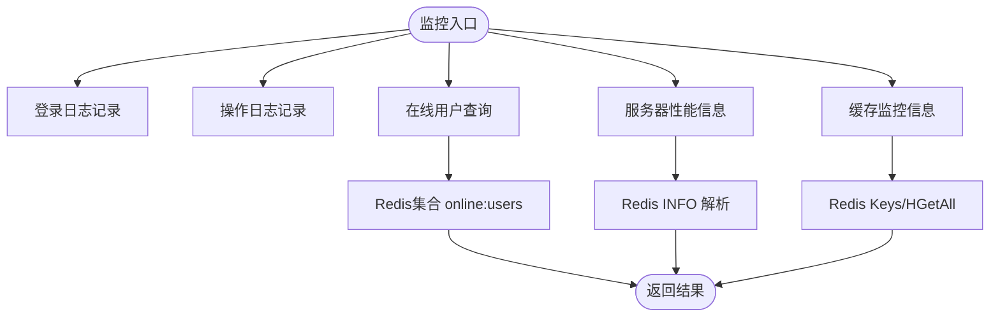
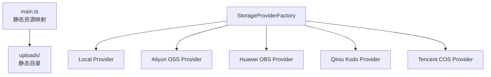
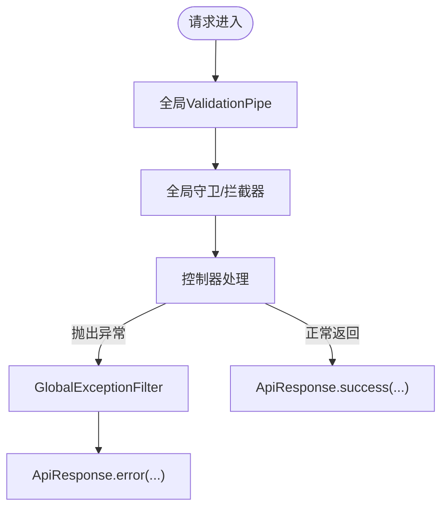
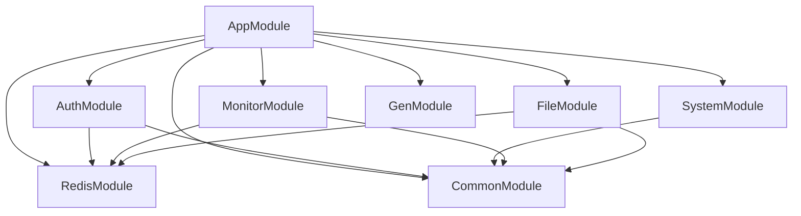

# 后端API开发

<cite>
**本文引用的文件**
- [apps/backend/src/main.ts](file://apps/backend/src/main.ts)
- [apps/backend/src/app.module.ts](file://apps/backend/src/app.module.ts)
- [apps/backend/src/auth/auth.module.ts](file://apps/backend/src/auth/auth.module.ts)
- [apps/backend/src/auth/auth.controller.ts](file://apps/backend/src/auth/auth.controller.ts)
- [apps/backend/src/auth/auth.service.ts](file://apps/backend/src/auth/auth.service.ts)
- [apps/backend/src/common/api-response.ts](file://apps/backend/src/common/api-response.ts)
- [apps/backend/src/common/exception.filter.ts](file://apps/backend/src/common/exception.filter.ts)
- [apps/backend/src/common/common.module.ts](file://apps/backend/src/common/common.module.ts)
- [apps/backend/src/cache/redis.module.ts](file://apps/backend/src/cache/redis.module.ts)
- [apps/backend/src/cache/redis.service.ts](file://apps/backend/src/cache/redis.service.ts)
- [apps/backend/src/modules/system/system.module.ts](file://apps/backend/src/modules/system/system.module.ts)
- [apps/backend/src/modules/system/user/user.module.ts](file://apps/backend/src/modules/system/user/user.module.ts)
- [apps/backend/src/modules/system/role/role.module.ts](file://apps/backend/src/modules/system/role/role.module.ts)
- [apps/backend/src/modules/system/menu/menu.module.ts](file://apps/backend/src/modules/system/menu/menu.module.ts)
</cite>

## 目录
1. [引言](#引言)
2. [项目结构](#项目结构)
3. [核心组件](#核心组件)
4. [架构总览](#架构总览)
5. [详细组件分析](#详细组件分析)
6. [依赖关系分析](#依赖关系分析)
7. [性能考虑](#性能考虑)
8. [故障排查指南](#故障排查指南)
9. [结论](#结论)
10. [附录](#附录)

## 引言
本文件面向后端API开发者，系统性梳理基于NestJS的API开发模式与最佳实践，覆盖控制器、服务、模块的设计原则；认证授权体系（JWT认证、RBAC权限模型、角色权限管理、按钮级权限控制）；系统管理模块的CRUD接口设计（用户、角色、部门、菜单、字典、参数、通知公告）；监控模块的日志管理、在线用户监控、服务器性能监控与Redis缓存监控接口；文件管理模块的上传机制与存储策略；代码生成器的接口设计与模板化实现；以及统一响应格式、参数校验、异常处理等工程化实践。

## 项目结构
后端采用NestJS标准分层与功能域划分：入口文件负责应用初始化、全局中间件与文档配置；根模块聚合各子模块；认证模块提供登录、注册、验证码、登出、用户信息与在线用户查询等能力；系统模块按业务域拆分为用户、角色、菜单、部门、岗位、字典、参数、通知等子模块；监控模块提供登录日志、操作日志、在线用户、服务器与缓存监控；文件模块支持多存储提供商；通用模块提供统一响应、异常过滤、拦截器与Prisma数据库访问；缓存模块封装Redis连接与常用操作。

图表来源
- [apps/backend/src/main.ts:1-48](file://apps/backend/src/main.ts#L1-L48)
- [apps/backend/src/app.module.ts:18-58](file://apps/backend/src/app.module.ts#L18-L58)
- [apps/backend/src/auth/auth.module.ts:11-28](file://apps/backend/src/auth/auth.module.ts#L11-L28)
- [apps/backend/src/modules/system/system.module.ts:11-22](file://apps/backend/src/modules/system/system.module.ts#L11-L22)
- [apps/backend/src/common/common.module.ts:4-8](file://apps/backend/src/common/common.module.ts#L4-L8)
- [apps/backend/src/cache/redis.module.ts:4-8](file://apps/backend/src/cache/redis.module.ts#L4-L8)

章节来源
- [apps/backend/src/main.ts:1-48](file://apps/backend/src/main.ts#L1-L48)
- [apps/backend/src/app.module.ts:18-58](file://apps/backend/src/app.module.ts#L18-L58)

## 核心组件
- 应用入口与全局配置：设置跨域、全局前缀、全局验证管道、Swagger文档、静态资源映射与端口监听。
- 根模块聚合：集中导入配置、限流、调度、通用模块、缓存、认证、系统、监控、文件、代码生成模块，并注入全局守卫、过滤器与拦截器。
- 统一响应与异常处理：通过ApiResponse统一返回结构，GlobalExceptionFilter捕获异常并标准化输出。
- 缓存服务：RedisService封装连接、键值操作、哈希操作与在线用户集合管理。

章节来源
- [apps/backend/src/main.ts:8-46](file://apps/backend/src/main.ts#L8-L46)
- [apps/backend/src/app.module.ts:18-58](file://apps/backend/src/app.module.ts#L18-L58)
- [apps/backend/src/common/api-response.ts:1-35](file://apps/backend/src/common/api-response.ts#L1-L35)
- [apps/backend/src/common/exception.filter.ts:12-36](file://apps/backend/src/common/exception.filter.ts#L12-L36)
- [apps/backend/src/cache/redis.service.ts:82-99](file://apps/backend/src/cache/redis.service.ts#L82-L99)

## 架构总览
下图展示认证流程与关键交互：客户端请求经全局守卫与拦截器，认证模块负责JWT签发与校验，服务层调用Prisma与Redis完成业务与状态持久化，统一响应与异常过滤贯穿始终。

图表来源
- [apps/backend/src/auth/auth.controller.ts:13-19](file://apps/backend/src/auth/auth.controller.ts#L13-L19)
- [apps/backend/src/auth/auth.service.ts:29-89](file://apps/backend/src/auth/auth.service.ts#L29-L89)
- [apps/backend/src/cache/redis.service.ts:83-91](file://apps/backend/src/cache/redis.service.ts#L83-L91)

## 详细组件分析

### 认证与授权模块
- 模块组成：Passport与JWT集成、策略与守卫、控制器与服务。
- 功能要点：
  - 登录：验证码校验、密码比对、JWT签发、写入在线用户集合。
  - 注册：用户名唯一性校验、密码加密、创建用户。
  - 验证码：生成SVG图片、键值存入Redis并设置TTL。
  - 登出：移除在线用户映射与集合。
  - 用户信息：构建菜单树、提取权限点、区分超级管理员与角色授权菜单。
  - 在线用户：读取Redis集合返回当前在线token列表。
  - 密码更新：旧密码校验、新密码加密更新。

图表来源
- [apps/backend/src/auth/auth.controller.ts:10-87](file://apps/backend/src/auth/auth.controller.ts#L10-L87)
- [apps/backend/src/auth/auth.service.ts:20-294](file://apps/backend/src/auth/auth.service.ts#L20-L294)
- [apps/backend/src/auth/auth.module.ts:11-28](file://apps/backend/src/auth/auth.module.ts#L11-L28)

章节来源
- [apps/backend/src/auth/auth.module.ts:11-28](file://apps/backend/src/auth/auth.module.ts#L11-L28)
- [apps/backend/src/auth/auth.controller.ts:10-87](file://apps/backend/src/auth/auth.controller.ts#L10-L87)
- [apps/backend/src/auth/auth.service.ts:20-294](file://apps/backend/src/auth/auth.service.ts#L20-L294)

### 系统管理模块（CRUD接口设计）
系统模块按业务域拆分，每个子模块遵循“模块-控制器-服务”的三层结构，职责清晰、内聚高、耦合低。以用户、角色、菜单为例：

图表来源
- [apps/backend/src/modules/system/system.module.ts:11-22](file://apps/backend/src/modules/system/system.module.ts#L11-L22)
- [apps/backend/src/modules/system/user/user.module.ts:5-9](file://apps/backend/src/modules/system/user/user.module.ts#L5-L9)
- [apps/backend/src/modules/system/role/role.module.ts:5-9](file://apps/backend/src/modules/system/role/role.module.ts#L5-L9)
- [apps/backend/src/modules/system/menu/menu.module.ts:5-9](file://apps/backend/src/modules/system/menu/menu.module.ts#L5-L9)

章节来源
- [apps/backend/src/modules/system/system.module.ts:11-22](file://apps/backend/src/modules/system/system.module.ts#L11-L22)
- [apps/backend/src/modules/system/user/user.module.ts:5-9](file://apps/backend/src/modules/system/user/user.module.ts#L5-L9)
- [apps/backend/src/modules/system/role/role.module.ts:5-9](file://apps/backend/src/modules/system/role/role.module.ts#L5-L9)
- [apps/backend/src/modules/system/menu/menu.module.ts:5-9](file://apps/backend/src/modules/system/menu/menu.module.ts#L5-L9)

### 监控模块（日志、在线用户、服务器、缓存）
- 登录日志：记录登录IP、状态与消息，便于审计与风控。
- 操作日志：可结合拦截器记录操作行为。
- 在线用户：基于Redis集合维护token列表，支持查询当前在线用户。
- 服务器监控：采集Redis实例信息，用于性能与容量评估。
- 缓存监控：提供缓存命中率、键空间等指标查询。

图表来源
- [apps/backend/src/auth/auth.service.ts:50-74](file://apps/backend/src/auth/auth.service.ts#L50-L74)
- [apps/backend/src/cache/redis.service.ts:97-99](file://apps/backend/src/cache/redis.service.ts#L97-L99)
- [apps/backend/src/cache/redis.service.ts:70-80](file://apps/backend/src/cache/redis.service.ts#L70-L80)

章节来源
- [apps/backend/src/auth/auth.service.ts:50-74](file://apps/backend/src/auth/auth.service.ts#L50-L74)
- [apps/backend/src/cache/redis.service.ts:70-99](file://apps/backend/src/cache/redis.service.ts#L70-L99)

### 文件管理模块（上传机制与存储策略）
- 静态资源：通过静态文件服务暴露上传目录，统一前缀路径。
- 存储策略：提供多种云存储适配器工厂与类型定义，支持本地、阿里云OSS、华为云OBS、七牛Kodo、腾讯云COS等，便于按需切换与扩展。

图表来源
- [apps/backend/src/main.ts:37-40](file://apps/backend/src/main.ts#L37-L40)

章节来源
- [apps/backend/src/main.ts:37-40](file://apps/backend/src/main.ts#L37-L40)

### 代码生成器（接口设计与模板化）
- 接口设计：提供代码生成相关控制器与服务，按领域模型自动生成CRUD接口与前端页面骨架。
- 模板化实现：通过模板引擎与配置项，动态渲染实体、DTO、路由、服务与前端组件代码，提升开发效率与一致性。

章节来源
- [apps/backend/src/modules/gen/gen.controller.ts](file://apps/backend/src/modules/gen/gen.controller.ts)
- [apps/backend/src/modules/gen/gen.service.ts](file://apps/backend/src/modules/gen/gen.service.ts)

### 统一响应格式、参数校验与异常处理
- 统一响应：ApiResponse提供成功、错误、未授权、禁止、未找到、错误请求等静态方法，确保前后端契约一致。
- 参数校验：全局ValidationPipe开启转换与白名单校验，减少脏数据进入业务层。
- 异常处理：GlobalExceptionFilter捕获HTTP与未处理异常，统一包装为ApiResponse错误响应，并记录日志。

图表来源
- [apps/backend/src/common/api-response.ts:12-34](file://apps/backend/src/common/api-response.ts#L12-L34)
- [apps/backend/src/common/exception.filter.ts:16-35](file://apps/backend/src/common/exception.filter.ts#L16-L35)
- [apps/backend/src/main.ts:17-24](file://apps/backend/src/main.ts#L17-L24)

章节来源
- [apps/backend/src/common/api-response.ts:1-35](file://apps/backend/src/common/api-response.ts#L1-L35)
- [apps/backend/src/common/exception.filter.ts:12-36](file://apps/backend/src/common/exception.filter.ts#L12-L36)
- [apps/backend/src/main.ts:17-24](file://apps/backend/src/main.ts#L17-L24)

## 依赖关系分析
- 模块耦合：根模块集中导入与装配，子模块内部高内聚；认证模块依赖缓存与数据库；系统模块依赖认证模块提供的用户上下文；监控模块依赖缓存与数据库；文件模块依赖存储适配器工厂。
- 外部依赖：Redis用于会话与在线用户管理；Prisma用于ORM；Swagger用于接口文档；bcrypt用于密码加密；svg-captcha用于图形验证码。

图表来源
- [apps/backend/src/app.module.ts:18-58](file://apps/backend/src/app.module.ts#L18-L58)

章节来源
- [apps/backend/src/app.module.ts:18-58](file://apps/backend/src/app.module.ts#L18-L58)

## 性能考虑
- 连接池与序列化：Redis连接复用，避免频繁创建销毁；BigInt序列化修复防止JSON过大时精度丢失。
- 缓存策略：验证码、在线用户、菜单树等热点数据使用Redis缓存，降低数据库压力。
- 查询优化：菜单树构建使用Map与一次遍历，避免重复查询；角色权限合并去重使用Set。
- 限流与安全：启用限流守卫与全局验证管道，降低暴力破解与异常输入风险。

章节来源
- [apps/backend/src/auth/auth.service.ts:15-18](file://apps/backend/src/auth/auth.service.ts#L15-L18)
- [apps/backend/src/cache/redis.service.ts:8-27](file://apps/backend/src/cache/redis.service.ts#L8-L27)
- [apps/backend/src/auth/auth.service.ts:189-203](file://apps/backend/src/auth/auth.service.ts#L189-L203)

## 故障排查指南
- 登录失败：检查验证码是否过期或不匹配、用户是否存在且启用、密码是否正确；查看登录日志表记录。
- 权限不足：确认用户角色与菜单权限映射、按钮级权限字符串是否正确下发；核对前端路由与按钮权限绑定。
- 在线用户异常：检查Redis连接状态、在线用户集合是否正确增删；核对Token过期时间。
- 文件上传失败：确认静态资源映射前缀、存储提供商配置与凭证、磁盘空间与权限。
- 接口报错：查看全局异常过滤器输出的错误码与消息，结合日志定位具体异常堆栈。

章节来源
- [apps/backend/src/auth/auth.service.ts:30-60](file://apps/backend/src/auth/auth.service.ts#L30-L60)
- [apps/backend/src/common/exception.filter.ts:16-35](file://apps/backend/src/common/exception.filter.ts#L16-L35)
- [apps/backend/src/cache/redis.service.ts:16-22](file://apps/backend/src/cache/redis.service.ts#L16-L22)

## 结论
本项目以NestJS为基础，构建了高内聚、低耦合的模块化架构，配合JWT认证、RBAC权限模型与Redis缓存，实现了从认证授权到系统管理、监控与文件管理的完整后端能力。通过统一响应、参数校验与异常过滤，提升了工程稳定性与可维护性。建议在生产环境中进一步完善鉴权边界、埋点监控与自动化测试，持续优化缓存命中与数据库索引策略。

## 附录
- 开发环境：Node.js + NestJS + Prisma + Redis + Swagger
- 命名规范：模块以领域命名，控制器以名词复数形式，服务以动词+名词组合
- 安全建议：定期轮换JWT密钥、限制验证码尝试次数、启用HTTPS与CORS白名单