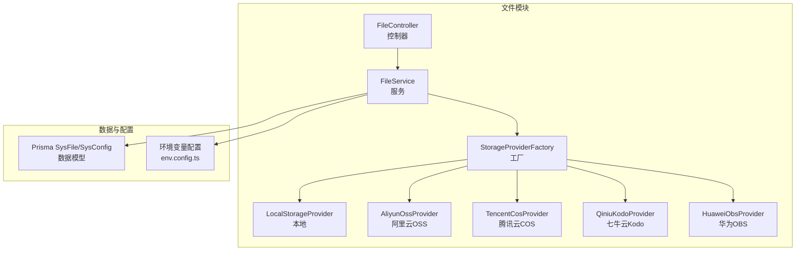
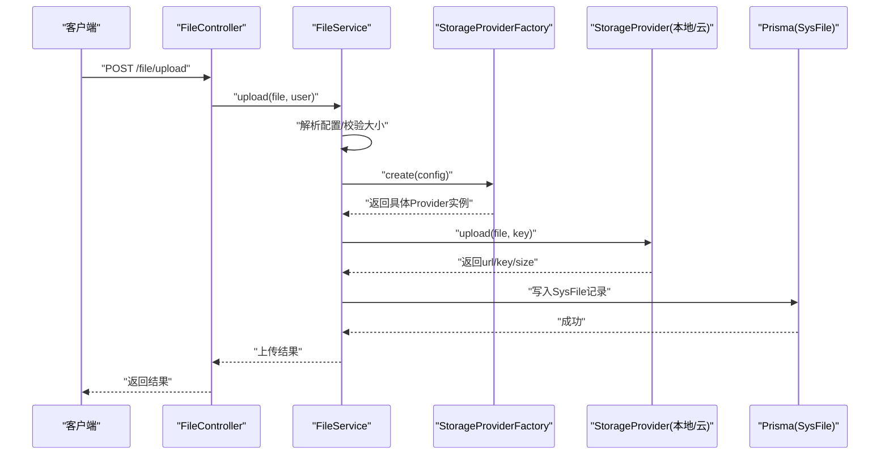
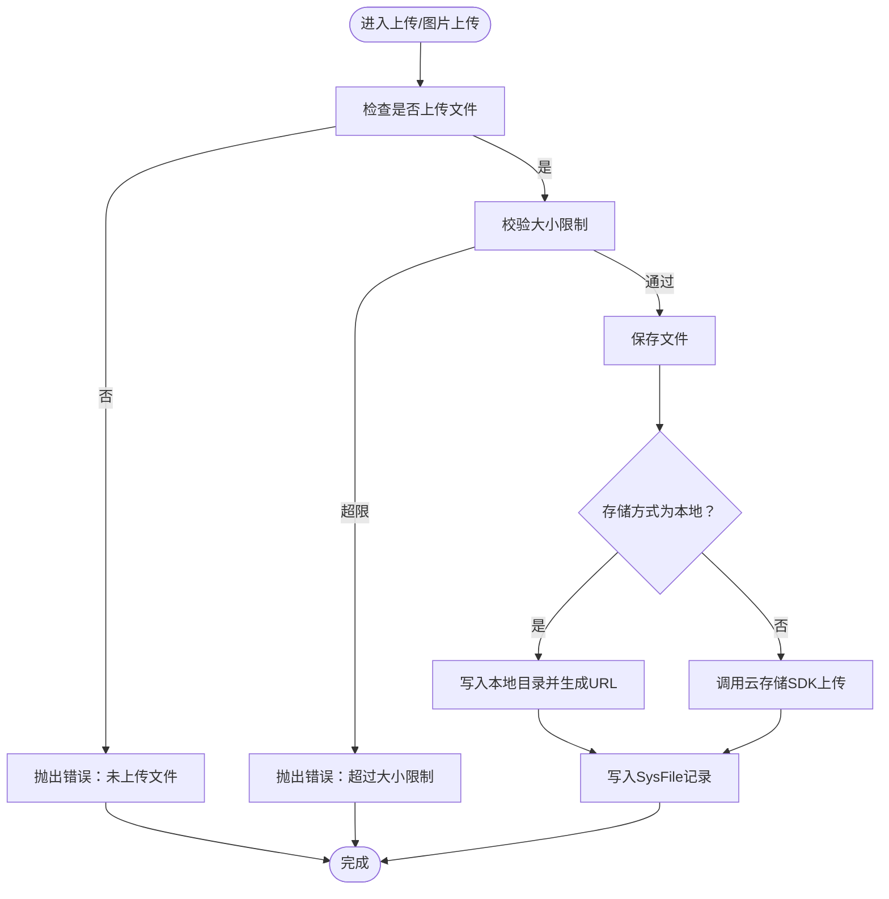
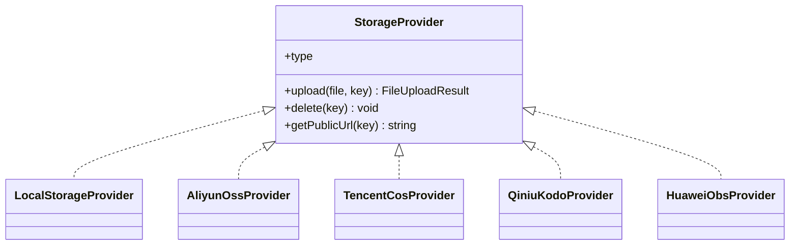
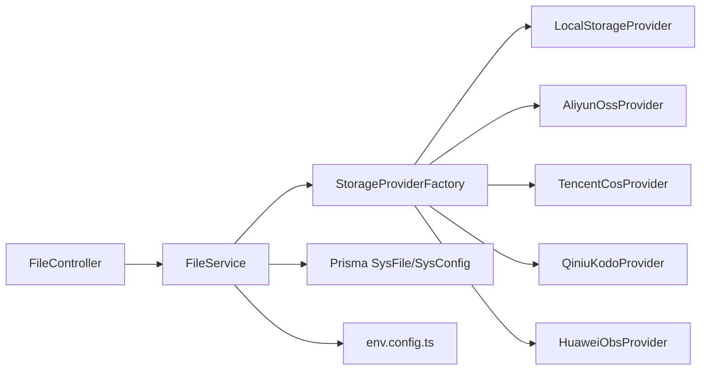

# 文件管理模块

<cite>
**本文引用的文件**
- [apps/backend/src/modules/file/file.module.ts](file://apps/backend/src/modules/file/file.module.ts)
- [apps/backend/src/modules/file/file.controller.ts](file://apps/backend/src/modules/file/file.controller.ts)
- [apps/backend/src/modules/file/file.service.ts](file://apps/backend/src/modules/file/file.service.ts)
- [apps/backend/src/modules/file/storage/storage.types.ts](file://apps/backend/src/modules/file/storage/storage.types.ts)
- [apps/backend/src/modules/file/storage/storage.utils.ts](file://apps/backend/src/modules/file/storage/storage.utils.ts)
- [apps/backend/src/modules/file/storage/storage-provider.factory.ts](file://apps/backend/src/modules/file/storage/storage-provider.factory.ts)
- [apps/backend/src/modules/file/storage/local.provider.ts](file://apps/backend/src/modules/file/storage/local.provider.ts)
- [apps/backend/src/modules/file/storage/aliyun-oss.provider.ts](file://apps/backend/src/modules/file/storage/aliyun-oss.provider.ts)
- [apps/backend/src/modules/file/storage/tencent-cos.provider.ts](file://apps/backend/src/modules/file/storage/tencent-cos.provider.ts)
- [apps/backend/src/modules/file/storage/qiniu-kodo.provider.ts](file://apps/backend/src/modules/file/storage/qiniu-kodo.provider.ts)
- [apps/backend/src/modules/file/storage/huawei-obs.provider.ts](file://apps/backend/src/modules/file/storage/huawei-obs.provider.ts)
- [apps/backend/prisma/schema.prisma](file://apps/backend/prisma/schema.prisma)
- [apps/backend/src/config/env.config.ts](file://apps/backend/src/config/env.config.ts)
</cite>

## 目录
1. [简介](#简介)
2. [项目结构](#项目结构)
3. [核心组件](#核心组件)
4. [架构总览](#架构总览)
5. [详细组件分析](#详细组件分析)
6. [依赖关系分析](#依赖关系分析)
7. [性能考量](#性能考量)
8. [故障排查指南](#故障排查指南)
9. [结论](#结论)
10. [附录：API 示例与最佳实践](#附录api-示例与最佳实践)

## 简介
本文件管理模块提供统一的文件上传、存储、访问与管理能力，支持本地存储与多家主流云存储（阿里云 OSS、腾讯云 COS、七牛云 Kodo、华为 OBS）。系统通过可插拔的存储提供者工厂实现多存储策略切换，并在服务层集中处理文件元数据持久化、访问鉴权、预览下载、删除等操作。同时内置文件类型与大小校验、路径安全检查、以及基于 JWT 的权限控制。

## 项目结构
文件管理模块位于后端应用的 modules/file 目录下，采用按功能分层的组织方式：
- 控制器：定义文件相关接口，负责请求参数解析、权限校验与响应封装
- 服务：业务逻辑核心，负责配置解析、文件保存、预览下载、删除、列表查询等
- 存储策略：以工厂模式聚合多种存储提供者（本地、阿里云 OSS、腾讯云 COS、七牛云 Kodo、华为 OBS）
- 数据模型：通过 Prisma 的 SysFile 表记录文件元信息；系统配置通过 SysConfig 统一管理

图表来源
- [apps/backend/src/modules/file/file.controller.ts:32-99](file://apps/backend/src/modules/file/file.controller.ts#L32-L99)
- [apps/backend/src/modules/file/file.service.ts:41-309](file://apps/backend/src/modules/file/file.service.ts#L41-L309)
- [apps/backend/src/modules/file/storage/storage-provider.factory.ts:8-24](file://apps/backend/src/modules/file/storage/storage-provider.factory.ts#L8-L24)
- [apps/backend/src/modules/file/storage/local.provider.ts:6-45](file://apps/backend/src/modules/file/storage/local.provider.ts#L6-L45)
- [apps/backend/src/modules/file/storage/aliyun-oss.provider.ts:6-50](file://apps/backend/src/modules/file/storage/aliyun-oss.provider.ts#L6-L50)
- [apps/backend/src/modules/file/storage/tencent-cos.provider.ts:7-73](file://apps/backend/src/modules/file/storage/tencent-cos.provider.ts#L7-L73)
- [apps/backend/src/modules/file/storage/qiniu-kodo.provider.ts:7-67](file://apps/backend/src/modules/file/storage/qiniu-kodo.provider.ts#L7-L67)
- [apps/backend/src/modules/file/storage/huawei-obs.provider.ts:8-92](file://apps/backend/src/modules/file/storage/huawei-obs.provider.ts#L8-L92)
- [apps/backend/prisma/schema.prisma:182-207](file://apps/backend/prisma/schema.prisma#L182-L207)
- [apps/backend/src/config/env.config.ts:3-22](file://apps/backend/src/config/env.config.ts#L3-L22)

章节来源
- [apps/backend/src/modules/file/file.module.ts:1-10](file://apps/backend/src/modules/file/file.module.ts#L1-L10)
- [apps/backend/src/modules/file/file.controller.ts:32-99](file://apps/backend/src/modules/file/file.controller.ts#L32-L99)
- [apps/backend/src/modules/file/file.service.ts:41-309](file://apps/backend/src/modules/file/file.service.ts#L41-L309)

## 核心组件
- 控制器：提供文件配置读取/更新、文件列表查询、详情、删除、单文件上传、图片上传、文件预览/下载等接口，并集成 JWT 与权限守卫
- 服务：集中处理配置解析（系统配置 + 环境变量）、文件保存（本地或云存储）、预览下载（本地直读/云存储重定向）、删除（先删云端再标记删除）、列表与详情查询
- 存储提供者：抽象出统一接口，不同云厂商 SDK 封装差异，统一返回上传结果与公共 URL
- 工厂：根据当前存储配置动态选择对应提供者实例
- 数据模型：SysFile 记录文件元信息；SysConfig 统一存储文件相关配置项

章节来源
- [apps/backend/src/modules/file/file.controller.ts:37-98](file://apps/backend/src/modules/file/file.controller.ts#L37-L98)
- [apps/backend/src/modules/file/file.service.ts:45-185](file://apps/backend/src/modules/file/file.service.ts#L45-L185)
- [apps/backend/src/modules/file/storage/storage.types.ts:3-42](file://apps/backend/src/modules/file/storage/storage.types.ts#L3-L42)
- [apps/backend/src/modules/file/storage/storage-provider.factory.ts:8-24](file://apps/backend/src/modules/file/storage/storage-provider.factory.ts#L8-L24)
- [apps/backend/prisma/schema.prisma:182-207](file://apps/backend/prisma/schema.prisma#L182-L207)

## 架构总览
文件管理的整体流程如下：
- 客户端调用上传接口，控制器接收文件并进行权限校验
- 服务层解析当前存储配置，对文件进行类型/大小校验
- 通过工厂创建对应存储提供者，执行上传并将结果写入数据库
- 预览/下载时，若为本地则直接读取文件；若为云存储则返回公开 URL 或重定向到云地址

图表来源
- [apps/backend/src/modules/file/file.controller.ts:77-83](file://apps/backend/src/modules/file/file.controller.ts#L77-L83)
- [apps/backend/src/modules/file/file.service.ts:150-209](file://apps/backend/src/modules/file/file.service.ts#L150-L209)
- [apps/backend/src/modules/file/storage/storage-provider.factory.ts:9-22](file://apps/backend/src/modules/file/storage/storage-provider.factory.ts#L9-L22)

## 详细组件分析

### 控制器与权限控制
- 接口覆盖
  - 获取/更新文件存储配置：需“system:config:list”权限
  - 列表查询与详情：需“system:file:list”
  - 删除：需“system:file:remove”
  - 上传与图片上传：需登录（JWT），无细粒度权限注解
  - 预览/下载：公开接口，无需登录
- 上传选项
  - 使用内存存储，限制单文件大小由配置决定
  - 图片上传额外限制仅允许常见图片扩展名

章节来源
- [apps/backend/src/modules/file/file.controller.ts:37-98](file://apps/backend/src/modules/file/file.controller.ts#L37-L98)

### 服务层与业务逻辑
- 配置解析
  - 从 SysConfig 读取文件相关配置键值，兼容旧版 OSS 键名
  - 支持环境变量兜底，如文件存储方式、上传目录、最大文件/图片大小、云存储区域/桶/密钥/端点/前缀/公开域名/HTTPS 等
- 文件上传
  - 单文件上传：校验大小后保存
  - 图片上传：除大小外还校验扩展名为常见图片格式
  - 本地存储：生成随机文件名并写入 uploadDir
  - 云存储：按 prefix/date/随机名 规则生成对象键，调用对应 SDK 上传
- 预览/下载
  - 本地：校验路径安全性，确保不越界，存在则直接返回文件流
  - 云存储：返回公开 URL 或重定向到云地址
- 删除
  - 先尝试删除云端对象，若远程已不存在仍继续清理元数据
  - 标记 SysFile 的 isDelete 与 deleteTime

图表来源
- [apps/backend/src/modules/file/file.service.ts:150-166](file://apps/backend/src/modules/file/file.service.ts#L150-L166)
- [apps/backend/src/modules/file/file.service.ts:187-209](file://apps/backend/src/modules/file/file.service.ts#L187-L209)

章节来源
- [apps/backend/src/modules/file/file.service.ts:45-185](file://apps/backend/src/modules/file/file.service.ts#L45-L185)
- [apps/backend/src/modules/file/file.service.ts:211-257](file://apps/backend/src/modules/file/file.service.ts#L211-L257)

### 存储提供者与多存储策略
- 抽象接口
  - 提供 upload、delete、getPublicUrl 三个核心方法
  - 统一返回 FileUploadResult，包含 url、filename、key、size、storage
- 本地存储
  - 上传：将 Buffer 写入 uploadDir
  - 删除：安全路径解析后删除
  - URL：/file/{filename}
- 阿里云 OSS
  - 上传：使用 region/bucket/accessKeyId/accessKeySecret/endpoint/secure 参数调用 SDK
  - 删除：同上
  - URL：优先使用 publicUrl，否则回退到 OSS 默认域名
- 腾讯云 COS
  - 上传：使用 SecretId/SecretKey/Region/Bucket
  - 删除：同上
  - URL：优先 publicUrl，否则构造 cos.{region}.myqcloud.com 形式
- 七牛云 Kodo
  - 上传：生成上传 Token 后调用 SDK
  - 删除：使用 BucketManager
  - URL：优先 publicUrl
- 华为 OBS
  - 上传：使用 ObsClient，要求 endpoint
  - 删除：同上
  - URL：优先 publicUrl，否则拼接 endpoint + bucket

图表来源
- [apps/backend/src/modules/file/storage/storage.types.ts:33-42](file://apps/backend/src/modules/file/storage/storage.types.ts#L33-L42)
- [apps/backend/src/modules/file/storage/local.provider.ts:6-45](file://apps/backend/src/modules/file/storage/local.provider.ts#L6-L45)
- [apps/backend/src/modules/file/storage/aliyun-oss.provider.ts:6-50](file://apps/backend/src/modules/file/storage/aliyun-oss.provider.ts#L6-L50)
- [apps/backend/src/modules/file/storage/tencent-cos.provider.ts:7-73](file://apps/backend/src/modules/file/storage/tencent-cos.provider.ts#L7-L73)
- [apps/backend/src/modules/file/storage/qiniu-kodo.provider.ts:7-67](file://apps/backend/src/modules/file/storage/qiniu-kodo.provider.ts#L7-L67)
- [apps/backend/src/modules/file/storage/huawei-obs.provider.ts:8-92](file://apps/backend/src/modules/file/storage/huawei-obs.provider.ts#L8-L92)

章节来源
- [apps/backend/src/modules/file/storage/storage.types.ts:3-42](file://apps/backend/src/modules/file/storage/storage.types.ts#L3-L42)
- [apps/backend/src/modules/file/storage/local.provider.ts:11-37](file://apps/backend/src/modules/file/storage/local.provider.ts#L11-L37)
- [apps/backend/src/modules/file/storage/aliyun-oss.provider.ts:13-34](file://apps/backend/src/modules/file/storage/aliyun-oss.provider.ts#L13-L34)
- [apps/backend/src/modules/file/storage/tencent-cos.provider.ts:14-43](file://apps/backend/src/modules/file/storage/tencent-cos.provider.ts#L14-L43)
- [apps/backend/src/modules/file/storage/qiniu-kodo.provider.ts:14-37](file://apps/backend/src/modules/file/storage/qiniu-kodo.provider.ts#L14-L37)
- [apps/backend/src/modules/file/storage/huawei-obs.provider.ts:18-55](file://apps/backend/src/modules/file/storage/huawei-obs.provider.ts#L18-L55)

### 工具函数与配置解析
- 名称与路径
  - createStoredName：生成带时间戳与随机数的唯一文件名
  - createCloudObjectKey：按 prefix/date/随机名 生成对象键
  - normalizeOriginalName：处理可能的编码问题，确保原始名正确
  - buildPublicUrl：拼接公开 URL
- 配置归一化
  - normalizeStorageProvider：将“oss”映射为“aliyun-oss”，并规范化大小写
  - assertCloudConfig：校验云存储关键配置是否完整
- 配置解析
  - resolveConfig：从 SysConfig 与环境变量合并当前有效配置
  - upsertConfig：写入或更新配置项

章节来源
- [apps/backend/src/modules/file/storage/storage.utils.ts:5-61](file://apps/backend/src/modules/file/storage/storage.utils.ts#L5-L61)
- [apps/backend/src/modules/file/file.service.ts:211-257](file://apps/backend/src/modules/file/file.service.ts#L211-L257)
- [apps/backend/src/modules/file/file.service.ts:269-282](file://apps/backend/src/modules/file/file.service.ts#L269-L282)

### 数据模型与配置项
- SysFile：记录文件原始名、存储文件名、对象键、URL、存储方式、MIME 类型、扩展名、大小、上传人信息等
- SysConfig：集中存储文件相关配置键值，服务层通过 upsertConfig 统一维护
- 关键配置键（部分）：file_storage、file_upload_dir、file_max_image_size、file_max_file_size、file_cloud_*、file_oss_* 等

章节来源
- [apps/backend/prisma/schema.prisma:182-207](file://apps/backend/prisma/schema.prisma#L182-L207)
- [apps/backend/src/modules/file/file.service.ts:269-282](file://apps/backend/src/modules/file/file.service.ts#L269-L282)

## 依赖关系分析
- 控制器依赖服务层，服务层依赖工厂与工具函数
- 工厂根据配置选择具体存储提供者
- 服务层依赖 Prisma 进行元数据持久化
- 配置来源：SysConfig 与环境变量，环境变量提供默认值与兜底

图表来源
- [apps/backend/src/modules/file/file.controller.ts:32-99](file://apps/backend/src/modules/file/file.controller.ts#L32-L99)
- [apps/backend/src/modules/file/file.service.ts:41-309](file://apps/backend/src/modules/file/file.service.ts#L41-L309)
- [apps/backend/src/modules/file/storage/storage-provider.factory.ts:8-24](file://apps/backend/src/modules/file/storage/storage-provider.factory.ts#L8-L24)
- [apps/backend/src/config/env.config.ts:3-22](file://apps/backend/src/config/env.config.ts#L3-L22)

章节来源
- [apps/backend/src/modules/file/file.module.ts:1-10](file://apps/backend/src/modules/file/file.module.ts#L1-L10)
- [apps/backend/src/modules/file/file.controller.ts:32-99](file://apps/backend/src/modules/file/file.controller.ts#L32-L99)
- [apps/backend/src/modules/file/file.service.ts:41-309](file://apps/backend/src/modules/file/file.service.ts#L41-L309)

## 性能考量
- 上传缓冲区：当前使用内存存储（memoryStorage），适合中小文件；大文件可能导致内存压力
- 并发与限流：建议在网关或中间件层增加上传速率与并发限制
- 云存储直传：可考虑前端直传（服务端签发临时凭证）以降低服务端带宽与 CPU 开销
- 缓存与 CDN：云存储建议开启 CDN 与缓存策略，减少回源压力
- 数据库索引：SysFile 的存储方式、对象键、上传人、创建时间、isDelete 等字段已建立索引，有利于查询与统计

[本节为通用指导，不涉及具体文件分析]

## 故障排查指南
- 上传失败（无文件/大小超限）
  - 检查前端 FormData 字段名是否为 file
  - 检查配置中的最大文件/图片大小是否合理
- 本地文件无法预览
  - 确认 uploadDir 是否存在且可写
  - 检查路径拼接与安全校验逻辑，避免路径穿越
- 云存储上传报错
  - 校验 region、bucket、accessKeyId、accessKeySecret、endpoint、publicUrl 等配置是否完整
  - 检查网络连通性与 CDN/HTTPS 设置
- 删除异常
  - 若云端对象已被删除，仍会尝试清理元数据，确保最终状态一致
- 权限相关
  - 配置接口与列表/删除接口均需相应权限，确认用户角色具备 system:config:list、system:file:list、system:file:remove

章节来源
- [apps/backend/src/modules/file/file.service.ts:150-166](file://apps/backend/src/modules/file/file.service.ts#L150-L166)
- [apps/backend/src/modules/file/file.service.ts:168-185](file://apps/backend/src/modules/file/file.service.ts#L168-L185)
- [apps/backend/src/modules/file/storage/storage.utils.ts:42-46](file://apps/backend/src/modules/file/storage/storage.utils.ts#L42-L46)
- [apps/backend/src/modules/file/file.controller.ts:37-75](file://apps/backend/src/modules/file/file.controller.ts#L37-L75)

## 结论
该文件管理模块通过清晰的职责分离与可插拔的存储策略，实现了从本地到多家云存储的统一接入。服务层集中处理配置、校验、持久化与访问控制，既保证了灵活性，也便于扩展新的存储提供商。建议在生产环境中结合 CDN、限流与前端直传策略进一步优化性能与安全性。

[本节为总结性内容，不涉及具体文件分析]

## 附录：API 示例与最佳实践

### API 定义与调用示例
- 获取文件存储配置
  - 方法：GET /file/config
  - 权限：system:config:list
  - 返回：当前存储方式、上传目录、大小限制、云存储配置等（敏感字段为空）
- 更新文件存储配置
  - 方法：PUT /file/config
  - 权限：system:config:list
  - 请求体：包含 storage、uploadDir、maxImageSize、maxFileSize、region、bucket、accessKeyId、accessKeySecret、endpoint、prefix、publicUrl、secure 等键
- 查询文件列表
  - 方法：GET /file/list
  - 权限：system:file:list
  - 查询参数：page、limit、originalName、storage、mimeType
- 获取文件详情
  - 方法：GET /file/detail/:id
  - 权限：system:file:list
- 删除文件
  - 方法：DELETE /file/:id
  - 权限：system:file:remove
- 单文件上传
  - 方法：POST /file/upload
  - 权限：登录（JWT）
  - 表单字段：file
- 图片上传
  - 方法：POST /file/upload-image
  - 权限：登录（JWT）
  - 表单字段：file
- 预览/下载
  - 方法：GET /file/:filename
  - 权限：公开

章节来源
- [apps/backend/src/modules/file/file.controller.ts:37-98](file://apps/backend/src/modules/file/file.controller.ts#L37-L98)

### 最佳实践
- 上传与校验
  - 前端限制文件类型与大小，服务端再次校验，避免绕过
  - 大文件建议分片上传或使用云存储直传（需额外实现）
- 存储策略
  - 本地存储适合开发与小规模场景；生产建议使用云存储并开启 CDN
  - 云存储配置建议通过系统配置界面动态调整，避免硬编码
- 安全
  - 预览接口为公开访问，如需私有访问可改为签名 URL 或鉴权后转发
  - 严格校验文件扩展名与 MIME 类型，必要时进行内容检测
- 可靠性
  - 上传失败时回滚元数据，确保一致性
  - 删除流程先删云端再删元数据，若云端不存在仍应清理元数据
- 性能
  - 本地存储建议使用高性能磁盘与合适的并发写入策略
  - 云存储建议启用压缩与缓存，合理设置对象前缀与生命周期

[本节为通用指导，不涉及具体文件分析]