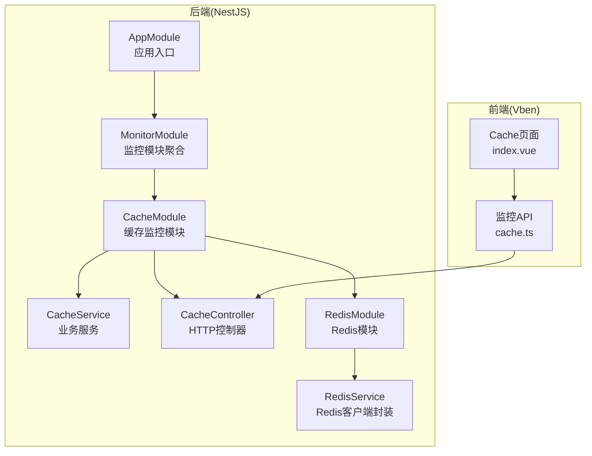
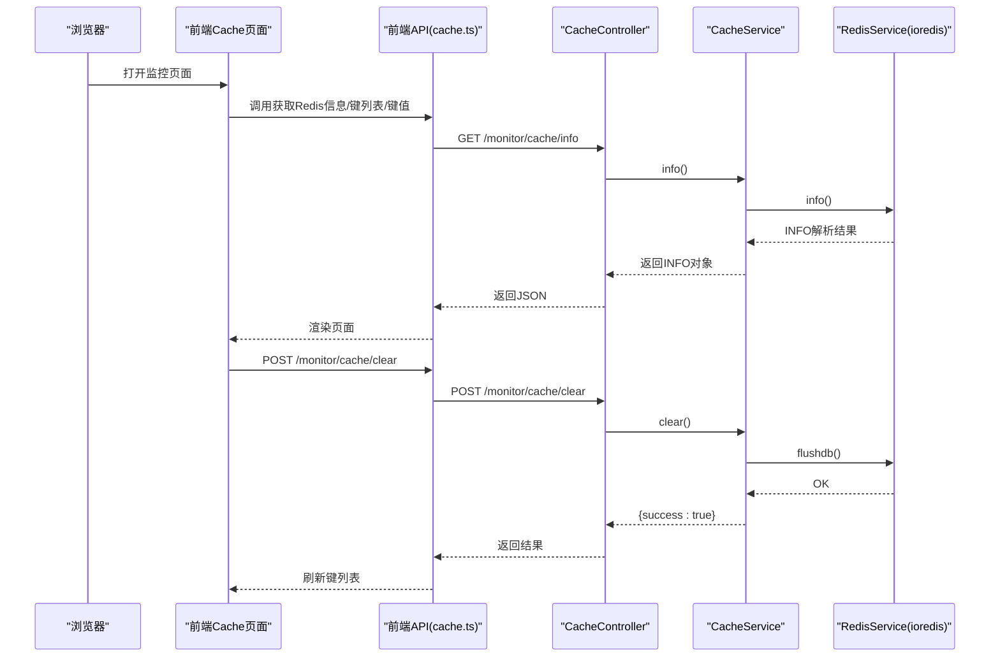
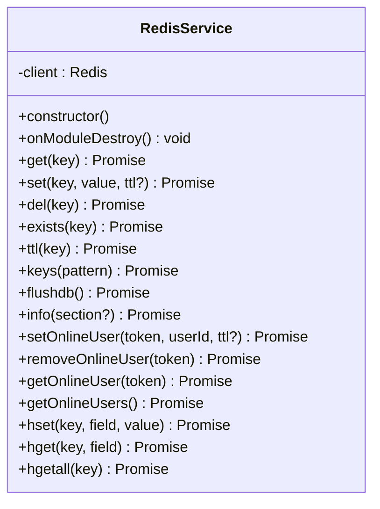
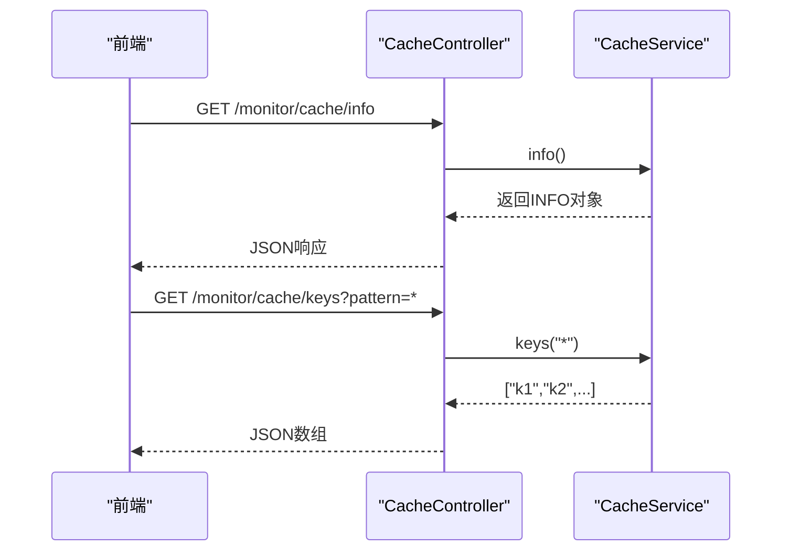
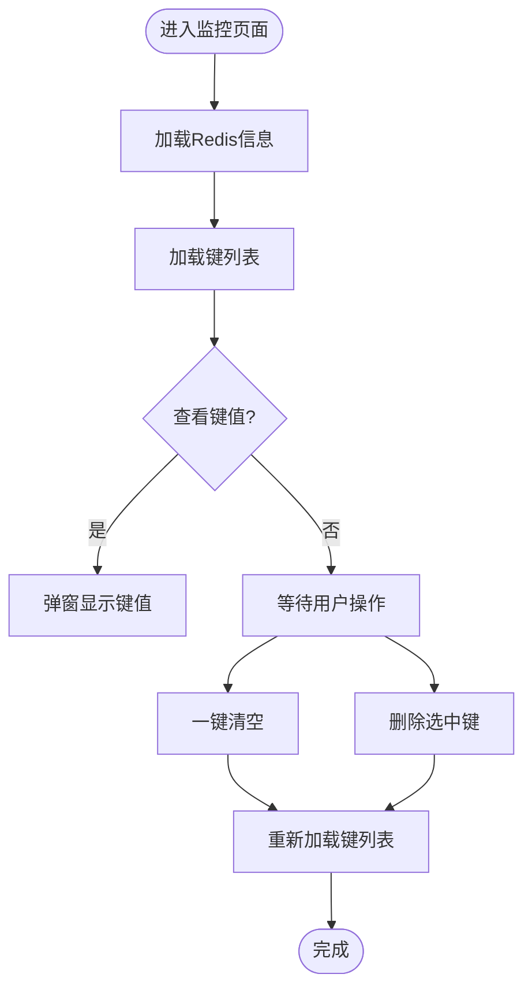
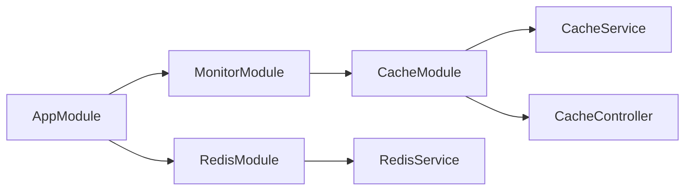

# Redis缓存监控

<cite>
**本文档引用的文件**
- [redis.service.ts](file://apps/backend/src/cache/redis.service.ts)
- [redis.module.ts](file://apps/backend/src/cache/redis.module.ts)
- [cache.service.ts](file://apps/backend/src/modules/monitor/cache/cache.service.ts)
- [cache.controller.ts](file://apps/backend/src/modules/monitor/cache/cache.controller.ts)
- [cache.module.ts](file://apps/backend/src/modules/monitor/cache/cache.module.ts)
- [monitor.module.ts](file://apps/backend/src/modules/monitor/monitor.module.ts)
- [app.module.ts](file://apps/backend/src/app.module.ts)
- [index.vue（前端Vben）](file://apps/vben-admin/apps/web-antd/src/views/monitor/cache/index.vue)
- [cache.ts（前端API）](file://apps/vben-admin/apps/web-antd/src/api/monitor/cache.ts)
</cite>

## 目录
1. [简介](#简介)
2. [项目结构](#项目结构)
3. [核心组件](#核心组件)
4. [架构概览](#架构概览)
5. [详细组件分析](#详细组件分析)
6. [依赖关系分析](#依赖关系分析)
7. [性能考虑](#性能考虑)
8. [故障排查指南](#故障排查指南)
9. [结论](#结论)

## 简介
本文件系统性梳理并说明本项目中Redis缓存监控功能的实现与使用方式，覆盖以下方面：
- 连接状态监控：连接数、内存使用、命中率等关键指标的采集与展示
- 命令统计与性能分析：基于INFO输出的命令处理量、连接总量等指标
- 缓存命中率计算与性能优化建议：基于keyspaceHits/keyspaceMisses的命中率计算方法
- 集群状态监控与故障检测：通过INFO输出中的mode字段识别单机/集群模式
- 缓存数据统计与热点分析：keys/pattern匹配与键值查看能力
- 配置监控与慢查询分析：当前实现不直接支持慢查询日志分析，需扩展
- 缓存清理策略与内存回收：flushdb/删除指定键等清理手段
- 备份状态监控与数据一致性检查：当前实现不包含备份与一致性校验，需扩展

## 项目结构
后端采用NestJS模块化架构，缓存监控功能位于monitor模块下的cache子模块；前端提供两个版本的监控界面（Vue + Element Plus 和 Vue + Ant Design Vue），通过统一的REST接口访问后端。



**图表来源**
- [app.module.ts:18-58](file://apps/backend/src/app.module.ts#L18-L58)
- [monitor.module.ts:1-11](file://apps/backend/src/modules/monitor/monitor.module.ts#L1-L11)
- [cache.module.ts:1-10](file://apps/backend/src/modules/monitor/cache/cache.module.ts#L1-L10)
- [cache.controller.ts:1-50](file://apps/backend/src/modules/monitor/cache/cache.controller.ts#L1-L50)
- [cache.service.ts:1-29](file://apps/backend/src/modules/monitor/cache/cache.service.ts#L1-L29)
- [redis.module.ts:1-9](file://apps/backend/src/cache/redis.module.ts#L1-L9)
- [redis.service.ts:1-128](file://apps/backend/src/cache/redis.service.ts#L1-L128)
- [index.vue（前端Vben）:1-114](file://apps/vben-admin/apps/web-antd/src/views/monitor/cache/index.vue#L1-L114)
- [cache.ts（前端API）:1-35](file://apps/vben-admin/apps/web-antd/src/api/monitor/cache.ts#L1-L35)

**章节来源**
- [app.module.ts:18-58](file://apps/backend/src/app.module.ts#L18-L58)
- [monitor.module.ts:1-11](file://apps/backend/src/modules/monitor/monitor.module.ts#L1-L11)
- [cache.module.ts:1-10](file://apps/backend/src/modules/monitor/cache/cache.module.ts#L1-L10)
- [cache.controller.ts:1-50](file://apps/backend/src/modules/monitor/cache/cache.controller.ts#L1-L50)
- [cache.service.ts:1-29](file://apps/backend/src/modules/monitor/cache/cache.service.ts#L1-L29)
- [redis.module.ts:1-9](file://apps/backend/src/cache/redis.module.ts#L1-L9)
- [redis.service.ts:1-128](file://apps/backend/src/cache/redis.service.ts#L1-L128)
- [index.vue（前端Vben）:1-114](file://apps/vben-admin/apps/web-antd/src/views/monitor/cache/index.vue#L1-L114)
- [cache.ts（前端API）:1-35](file://apps/vben-admin/apps/web-antd/src/api/monitor/cache.ts#L1-L35)

## 核心组件
- RedisService：对ioredis客户端进行封装，提供基础的键值操作、哈希操作、在线用户管理、以及INFO解析等能力，并内置连接事件监听。
- CacheService：在RedisService之上提供监控所需的业务方法，如获取INFO、列出keys、按key取值、清空数据库、删除键等。
- CacheController：定义监控相关HTTP接口，包括获取Redis信息、查询keys、查看键值、清空缓存、删除键等。
- CacheModule/MonitorModule：模块化组织监控功能，便于注入与导出。
- 前端Cache页面：提供Redis信息展示、键列表浏览、键值查看、一键清空、删除键等交互。

**章节来源**
- [redis.service.ts:1-128](file://apps/backend/src/cache/redis.service.ts#L1-L128)
- [cache.service.ts:1-29](file://apps/backend/src/modules/monitor/cache/cache.service.ts#L1-L29)
- [cache.controller.ts:1-50](file://apps/backend/src/modules/monitor/cache/cache.controller.ts#L1-L50)
- [cache.module.ts:1-10](file://apps/backend/src/modules/monitor/cache/cache.module.ts#L1-L10)
- [monitor.module.ts:1-11](file://apps/backend/src/modules/monitor/monitor.module.ts#L1-L11)
- [index.vue（前端Vben）:1-114](file://apps/vben-admin/apps/web-antd/src/views/monitor/cache/index.vue#L1-L114)

## 架构概览
下图展示了从浏览器到后端Redis的调用链路，以及各层职责分工。



**图表来源**
- [cache.controller.ts:13-48](file://apps/backend/src/modules/monitor/cache/cache.controller.ts#L13-L48)
- [cache.service.ts:8-28](file://apps/backend/src/modules/monitor/cache/cache.service.ts#L8-L28)
- [redis.service.ts:70-80](file://apps/backend/src/cache/redis.service.ts#L70-L80)
- [cache.ts（前端API）:16-34](file://apps/vben-admin/apps/web-antd/src/api/monitor/cache.ts#L16-L34)

## 详细组件分析

### RedisService（Redis客户端封装）
- 连接管理：构造函数中初始化ioredis客户端，支持host/port/password/db等环境变量配置；监听connect/error事件用于连接状态提示。
- 基础操作：提供get/set/del/exists/ttl/keys/flushdb等常用命令的Promise封装。
- INFO解析：info()方法将Redis INFO输出解析为键值对对象，供上层业务使用。
- 在线用户管理：提供在线用户集合的增删查与过期设置，便于会话管理。
- 哈希操作：提供hset/hget/hgetall的序列化/反序列化封装，便于复杂对象存储。



**图表来源**
- [redis.service.ts:1-128](file://apps/backend/src/cache/redis.service.ts#L1-L128)

**章节来源**
- [redis.service.ts:1-128](file://apps/backend/src/cache/redis.service.ts#L1-L128)

### CacheService（监控业务服务）
- info()：委托RedisService.info()返回Redis运行信息。
- keys(pattern)：委托RedisService.keys()返回匹配的键列表。
- get(key)：委托RedisService.get()返回键值。
- clear()：调用RedisService.flushdb()清空数据库。
- delete(key)：调用RedisService.del()删除指定键。

```mermaid
classDiagram
class CacheService {
-redis : RedisService
+constructor(redis : RedisService)
+info() Promise<Record>
+keys(pattern) Promise<string[]>
+get(key) Promise<any>
+clear() Promise<{success : true}>
+delete(key) Promise<{success : true}>
}
CacheService --> RedisService : "依赖"
```

**图表来源**
- [cache.service.ts:1-29](file://apps/backend/src/modules/monitor/cache/cache.service.ts#L1-L29)
- [redis.service.ts:1-128](file://apps/backend/src/cache/redis.service.ts#L1-L128)

**章节来源**
- [cache.service.ts:1-29](file://apps/backend/src/modules/monitor/cache/cache.service.ts#L1-L29)

### CacheController（HTTP接口）
- GET /monitor/cache/info：返回Redis运行信息（版本、模式、内存、连接数、命令数、命中/未命中等）。
- GET /monitor/cache/keys：根据pattern参数返回匹配的键列表。
- GET /monitor/cache/value：根据key参数返回键值。
- POST /monitor/cache/clear：清空数据库。
- POST /monitor/cache/delete：删除指定键。



**图表来源**
- [cache.controller.ts:13-48](file://apps/backend/src/modules/monitor/cache/cache.controller.ts#L13-L48)
- [cache.service.ts:8-28](file://apps/backend/src/modules/monitor/cache/cache.service.ts#L8-L28)

**章节来源**
- [cache.controller.ts:1-50](file://apps/backend/src/modules/monitor/cache/cache.controller.ts#L1-L50)

### 前端监控界面（Vben + Ant Design Vue）
- 展示Redis信息：版本、模式、内存、连接客户端数、总连接数、总命令数、命中次数、未命中次数。
- 键列表浏览：支持分页/搜索，点击“查看”弹窗显示键值详情。
- 操作按钮：一键清空缓存、删除选中键。
- 数据刷新：首次加载时自动拉取INFO与keys。



**图表来源**
- [index.vue（前端Vben）:13-57](file://apps/vben-admin/apps/web-antd/src/views/monitor/cache/index.vue#L13-L57)
- [index.vue（前端Vben）:8-52](file://apps/vben-admin/apps/web-antd/src/views/monitor/cache/index.vue#L8-L52)

**章节来源**
- [index.vue（前端Vben）:1-114](file://apps/vben-admin/apps/web-antd/src/views/monitor/cache/index.vue#L1-L114)

## 依赖关系分析
- AppModule导入MonitorModule与RedisModule，确保监控功能与Redis客户端可用。
- MonitorModule聚合多个监控子模块（登录日志、操作日志、在线用户、服务器、缓存）。
- CacheModule提供控制器与服务，依赖RedisModule导出的RedisService。
- 前端通过统一API模块调用后端接口，实现解耦。



**图表来源**
- [app.module.ts:18-58](file://apps/backend/src/app.module.ts#L18-L58)
- [monitor.module.ts:1-11](file://apps/backend/src/modules/monitor/monitor.module.ts#L1-L11)
- [cache.module.ts:1-10](file://apps/backend/src/modules/monitor/cache/cache.module.ts#L1-L10)
- [redis.module.ts:1-9](file://apps/backend/src/cache/redis.module.ts#L1-L9)

**章节来源**
- [app.module.ts:18-58](file://apps/backend/src/app.module.ts#L18-L58)
- [monitor.module.ts:1-11](file://apps/backend/src/modules/monitor/monitor.module.ts#L1-L11)
- [cache.module.ts:1-10](file://apps/backend/src/modules/monitor/cache/cache.module.ts#L1-L10)
- [redis.module.ts:1-9](file://apps/backend/src/cache/redis.module.ts#L1-L9)

## 性能考虑
- 命中率计算
  - 使用keyspaceHits与keyspaceMisses计算命中率：命中率 = keyspaceHits / (keyspaceHits + keyspaceMisses)。
  - 可在定时任务中周期性采集并记录趋势，辅助容量规划与热点识别。
- 内存使用监控
  - 通过used_memory_human或used_memory峰值阈值触发告警，结合键空间大小与过期策略评估内存压力。
- 命令处理量与连接数
  - total_commands_processed与connected_clients可作为负载与并发压力的参考指标。
- 键空间扫描
  - keys()在大数据集上可能阻塞，建议使用scan迭代器替代；当前实现直接调用keys，生产环境应谨慎使用。
- TTL与过期策略
  - 合理设置TTL，避免大量键同时过期导致的瞬时压力；定期清理过期键以释放内存。

[本节为通用性能指导，无需特定文件引用]

## 故障排查指南
- 连接失败
  - 检查RedisService构造参数（host/port/password/db）是否正确；确认网络连通性与防火墙策略。
  - 查看控制台输出的connect/error事件日志，定位连接问题。
- 查询超时/阻塞
  - keys()在大键空间上可能导致阻塞，建议改用scan迭代器或限制pattern范围。
- 权限不足
  - 确认Redis密码配置与权限设置；必要时开启认证或限制访问源。
- 前端无法加载
  - 确认后端接口路径与权限守卫配置；检查CORS与代理设置。
- 清空误操作
  - flushdb为高危操作，建议仅在测试环境使用；生产环境可通过删除指定键或设置更短TTL实现渐进式清理。

**章节来源**
- [redis.service.ts:8-23](file://apps/backend/src/cache/redis.service.ts#L8-L23)
- [cache.controller.ts:13-48](file://apps/backend/src/modules/monitor/cache/cache.controller.ts#L13-L48)
- [cache.service.ts:20-28](file://apps/backend/src/modules/monitor/cache/cache.service.ts#L20-L28)

## 结论
本项目已实现Redis缓存监控的核心能力：连接状态与运行指标展示、键空间浏览与键值查看、一键清空与删除键等操作。在此基础上，建议进一步增强以下能力：
- 慢查询分析：引入慢查询日志采集与可视化，辅助定位性能瓶颈。
- 集群监控：解析INFO中的cluster相关字段，实现多节点状态聚合与故障检测。
- 备份与一致性：接入RDB/AOF状态监控与备份链路健康检查。
- 命令统计：基于INFO中的命令统计字段进行更细粒度的命令类型分析。
- 热点分析：结合scan与键TTL/过期策略，识别热点键并制定淘汰策略。

[本节为总结性内容，无需特定文件引用]