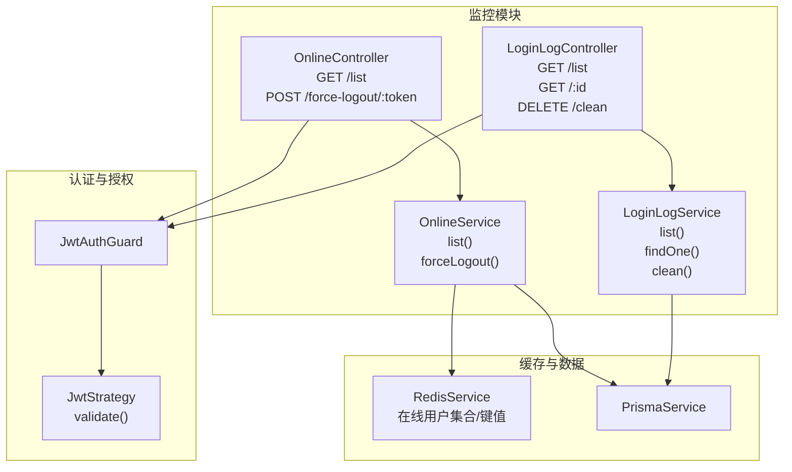
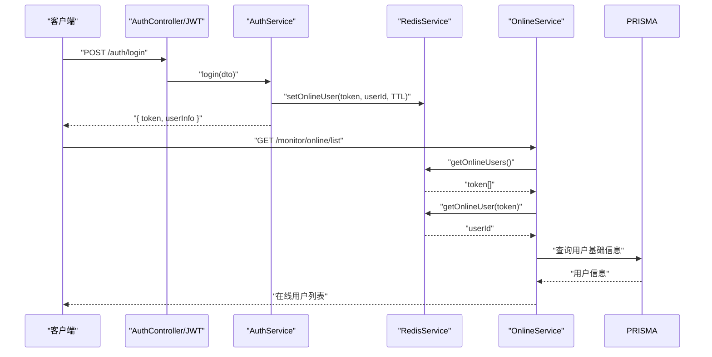
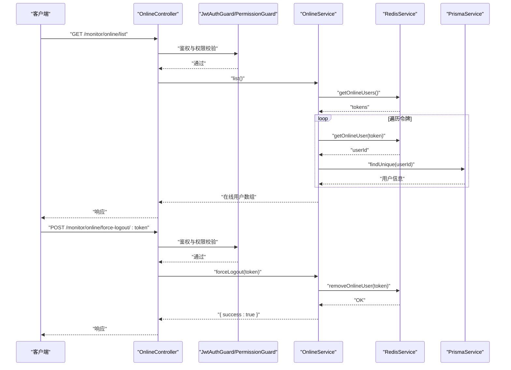
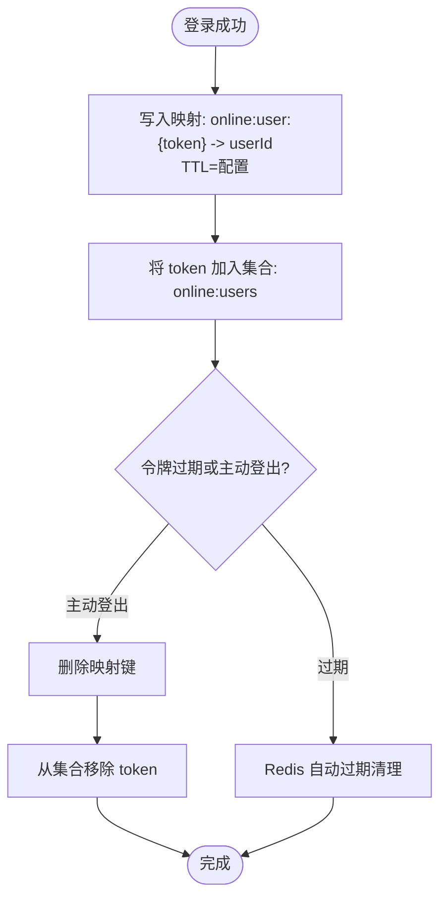
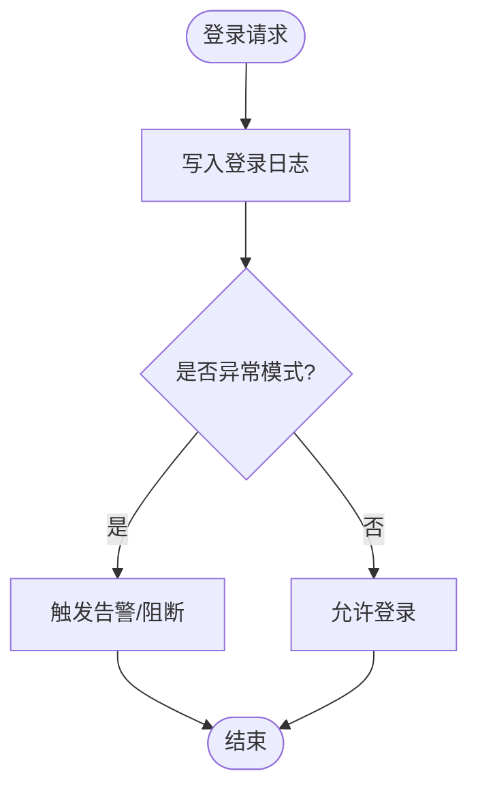
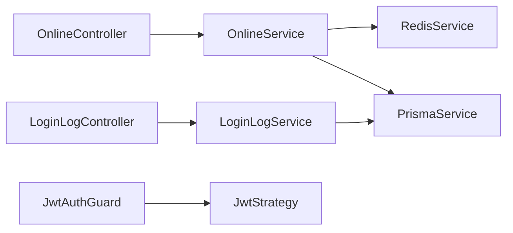

# 在线用户监控

<cite>
**本文引用的文件**
- [apps/backend/src/modules/monitor/online/online.controller.ts](file://apps/backend/src/modules/monitor/online/online.controller.ts)
- [apps/backend/src/modules/monitor/online/online.service.ts](file://apps/backend/src/modules/monitor/online/online.service.ts)
- [apps/backend/src/modules/monitor/online/online.module.ts](file://apps/backend/src/modules/monitor/online/online.module.ts)
- [apps/backend/src/cache/redis.service.ts](file://apps/backend/src/cache/redis.service.ts)
- [apps/backend/src/auth/auth.service.ts](file://apps/backend/src/auth/auth.service.ts)
- [apps/backend/src/auth/jwt.strategy.ts](file://apps/backend/src/auth/jwt.strategy.ts)
- [apps/backend/src/auth/jwt.guard.ts](file://apps/backend/src/auth/jwt.guard.ts)
- [apps/backend/src/modules/monitor/login-log/login-log.controller.ts](file://apps/backend/src/modules/monitor/login-log/login-log.controller.ts)
- [apps/backend/src/modules/monitor/login-log/login-log.service.ts](file://apps/backend/src/modules/monitor/login-log/login-log.service.ts)
- [apps/backend/src/modules/monitor/monitor.module.ts](file://apps/backend/src/modules/monitor/monitor.module.ts)
- [apps/backend/src/common/prisma.service.ts](file://apps/backend/src/common/prisma.service.ts)
</cite>

## 目录
1. [简介](#简介)
2. [项目结构](#项目结构)
3. [核心组件](#核心组件)
4. [架构总览](#架构总览)
5. [详细组件分析](#详细组件分析)
6. [依赖关系分析](#依赖关系分析)
7. [性能考量](#性能考量)
8. [故障排查指南](#故障排查指南)
9. [结论](#结论)
10. [附录](#附录)

## 简介
本文件面向“在线用户监控”功能，系统性梳理实时在线用户状态的监控机制，涵盖以下方面：
- 用户会话管理与在线状态维护
- 在线用户查询接口与状态更新机制
- 强制下线功能的实现原理与安全考虑
- 会话超时管理与自动清理策略
- 登录日志与异常登录检测（基于现有登录日志能力）
- WebSocket 连接管理与实时推送（当前仓库未实现，本节为概念性说明）

## 项目结构
在线用户监控功能位于后端 NestJS 应用的监控模块中，采用分层设计：
- 控制器层：暴露 REST 接口，负责参数解析与权限校验
- 服务层：封装业务逻辑，协调 Redis 缓存与数据库
- 缓存层：基于 Redis 的在线用户集合与键值映射
- 认证与授权：JWT 策略与守卫确保访问安全

图表来源
- [apps/backend/src/modules/monitor/online/online.controller.ts:1-28](file://apps/backend/src/modules/monitor/online/online.controller.ts#L1-L28)
- [apps/backend/src/modules/monitor/online/online.service.ts:1-31](file://apps/backend/src/modules/monitor/online/online.service.ts#L1-L31)
- [apps/backend/src/modules/monitor/login-log/login-log.controller.ts:1-45](file://apps/backend/src/modules/monitor/login-log/login-log.controller.ts#L1-L45)
- [apps/backend/src/modules/monitor/login-log/login-log.service.ts:1-31](file://apps/backend/src/modules/monitor/login-log/login-log.service.ts#L1-L31)
- [apps/backend/src/auth/jwt.guard.ts:1-5](file://apps/backend/src/auth/jwt.guard.ts#L1-L5)
- [apps/backend/src/auth/jwt.strategy.ts:1-78](file://apps/backend/src/auth/jwt.strategy.ts#L1-L78)
- [apps/backend/src/cache/redis.service.ts:1-128](file://apps/backend/src/cache/redis.service.ts#L1-L128)
- [apps/backend/src/common/prisma.service.ts:1-22](file://apps/backend/src/common/prisma.service.ts#L1-L22)

章节来源
- [apps/backend/src/modules/monitor/monitor.module.ts:1-11](file://apps/backend/src/modules/monitor/monitor.module.ts#L1-L11)
- [apps/backend/src/modules/monitor/online/online.module.ts:1-10](file://apps/backend/src/modules/monitor/online/online.module.ts#L1-L10)

## 核心组件
- 在线用户控制器：提供在线用户列表查询与强制下线接口，均受 JWT 与权限守卫保护
- 在线用户服务：从 Redis 获取在线令牌集合，按令牌反查用户 ID 并拉取用户基础信息
- Redis 服务：维护在线用户集合与令牌到用户 ID 的映射，支持 TTL 设置与集合操作
- 登录日志控制器与服务：提供登录日志的分页查询、详情查询与清空能力，为异常登录检测提供数据基础
- 认证与授权：JWT 策略在请求进入时校验令牌有效性与用户状态；守卫统一拦截未授权访问

章节来源
- [apps/backend/src/modules/monitor/online/online.controller.ts:1-28](file://apps/backend/src/modules/monitor/online/online.controller.ts#L1-L28)
- [apps/backend/src/modules/monitor/online/online.service.ts:1-31](file://apps/backend/src/modules/monitor/online/online.service.ts#L1-L31)
- [apps/backend/src/cache/redis.service.ts:82-99](file://apps/backend/src/cache/redis.service.ts#L82-L99)
- [apps/backend/src/modules/monitor/login-log/login-log.controller.ts:1-45](file://apps/backend/src/modules/monitor/login-log/login-log.controller.ts#L1-L45)
- [apps/backend/src/modules/monitor/login-log/login-log.service.ts:1-31](file://apps/backend/src/modules/monitor/login-log/login-log.service.ts#L1-L31)
- [apps/backend/src/auth/jwt.guard.ts:1-5](file://apps/backend/src/auth/jwt.guard.ts#L1-L5)
- [apps/backend/src/auth/jwt.strategy.ts:20-43](file://apps/backend/src/auth/jwt.strategy.ts#L20-L43)

## 架构总览
在线用户监控的整体流程如下：
- 登录成功后，服务端将“令牌 → 用户 ID”的映射写入 Redis，并将令牌加入在线用户集合
- 查询在线用户时，先从集合取出所有令牌，再逐个查询用户基础信息
- 强制下线时，删除令牌映射并从集合移除该令牌
- 登录日志记录每次登录行为，可用于后续异常登录检测与风险识别

图表来源
- [apps/backend/src/auth/auth.service.ts:29-89](file://apps/backend/src/auth/auth.service.ts#L29-L89)
- [apps/backend/src/cache/redis.service.ts:82-99](file://apps/backend/src/cache/redis.service.ts#L82-L99)
- [apps/backend/src/modules/monitor/online/online.service.ts:9-25](file://apps/backend/src/modules/monitor/online/online.service.ts#L9-L25)
- [apps/backend/src/common/prisma.service.ts:1-22](file://apps/backend/src/common/prisma.service.ts#L1-L22)

## 详细组件分析

### 在线用户控制器与服务
- 接口职责
  - GET /monitor/online/list：返回当前在线用户列表
  - POST /monitor/online/force-logout/:token：根据令牌强制下线
- 权限与安全
  - 使用 JWT 守卫与权限守卫，要求具备“monitor:online:list”权限
- 数据流
  - 列表查询：从 Redis 集合获取所有在线令牌，逐个查询用户 ID 并拉取用户基础信息
  - 强制下线：删除令牌映射并从集合移除该令牌

图表来源
- [apps/backend/src/modules/monitor/online/online.controller.ts:13-26](file://apps/backend/src/modules/monitor/online/online.controller.ts#L13-L26)
- [apps/backend/src/modules/monitor/online/online.service.ts:9-30](file://apps/backend/src/modules/monitor/online/online.service.ts#L9-L30)
- [apps/backend/src/cache/redis.service.ts:88-91](file://apps/backend/src/cache/redis.service.ts#L88-L91)
- [apps/backend/src/common/prisma.service.ts:1-22](file://apps/backend/src/common/prisma.service.ts#L1-L22)

章节来源
- [apps/backend/src/modules/monitor/online/online.controller.ts:1-28](file://apps/backend/src/modules/monitor/online/online.controller.ts#L1-L28)
- [apps/backend/src/modules/monitor/online/online.service.ts:1-31](file://apps/backend/src/modules/monitor/online/online.service.ts#L1-L31)
- [apps/backend/src/modules/monitor/online/online.module.ts:1-10](file://apps/backend/src/modules/monitor/online/online.module.ts#L1-L10)

### Redis 在线用户管理
- 关键方法
  - setOnlineUser(token, userId, ttlSeconds)：写入“令牌 → 用户 ID”的映射，并将令牌加入在线集合
  - removeOnlineUser(token)：删除映射并从集合移除令牌
  - getOnlineUser(token)：按令牌查询用户 ID
  - getOnlineUsers()：返回在线令牌集合
- 设计要点
  - 使用集合维护在线令牌，便于批量查询
  - 映射键带 TTL，结合服务端登出与会话过期实现自动清理
  - 令牌键名规范，避免与其他缓存键冲突

图表来源
- [apps/backend/src/cache/redis.service.ts:82-99](file://apps/backend/src/cache/redis.service.ts#L82-L99)

章节来源
- [apps/backend/src/cache/redis.service.ts:82-99](file://apps/backend/src/cache/redis.service.ts#L82-L99)

### 登录日志与异常登录检测（概念性说明）
- 登录日志能力
  - 提供分页查询、按用户名/状态过滤、按 ID 查询、清空日志等接口
  - 登录成功/失败均会写入日志，为后续风控提供数据基础
- 异常登录检测思路（概念性）
  - 基于登录日志统计同一 IP/账号的登录频率与时间窗口
  - 检测异地登录、多账号并发登录等高风险模式
  - 结合黑名单与白名单策略进行阻断或二次验证
- 当前仓库现状
  - 已具备登录日志能力，但未内置风控规则引擎或实时告警机制

图表来源
- [apps/backend/src/modules/monitor/login-log/login-log.controller.ts:1-45](file://apps/backend/src/modules/monitor/login-log/login-log.controller.ts#L1-L45)
- [apps/backend/src/modules/monitor/login-log/login-log.service.ts:1-31](file://apps/backend/src/modules/monitor/login-log/login-log.service.ts#L1-L31)

章节来源
- [apps/backend/src/modules/monitor/login-log/login-log.controller.ts:1-45](file://apps/backend/src/modules/monitor/login-log/login-log.controller.ts#L1-L45)
- [apps/backend/src/modules/monitor/login-log/login-log.service.ts:1-31](file://apps/backend/src/modules/monitor/login-log/login-log.service.ts#L1-L31)

### WebSocket 连接管理与实时推送（当前仓库未实现）
- 现状
  - 后端未集成 WebSocket 服务，无法实现在线用户状态的实时推送
- 可选方案（概念性）
  - 使用 NestJS 的 WebSocket 模块或 Socket.IO，建立用户到连接的映射
  - 在用户上线/下线时广播状态变更，前端订阅对应频道
  - 结合 Redis 发布/订阅实现多实例间的状态同步
- 注意事项
  - 连接池与心跳保活
  - 多实例部署下的状态一致性
  - 安全与鉴权，防止未授权订阅

[本节为概念性说明，不直接分析具体源码文件]

## 依赖关系分析
- 控制器依赖服务，服务依赖 Redis 与数据库
- 在线服务与登录日志服务分别独立，但都依赖数据库
- 认证链路通过守卫与策略统一处理，保证接口安全

图表来源
- [apps/backend/src/modules/monitor/online/online.controller.ts:1-28](file://apps/backend/src/modules/monitor/online/online.controller.ts#L1-L28)
- [apps/backend/src/modules/monitor/online/online.service.ts:1-31](file://apps/backend/src/modules/monitor/online/online.service.ts#L1-L31)
- [apps/backend/src/modules/monitor/login-log/login-log.controller.ts:1-45](file://apps/backend/src/modules/monitor/login-log/login-log.controller.ts#L1-L45)
- [apps/backend/src/modules/monitor/login-log/login-log.service.ts:1-31](file://apps/backend/src/modules/monitor/login-log/login-log.service.ts#L1-L31)
- [apps/backend/src/auth/jwt.guard.ts:1-5](file://apps/backend/src/auth/jwt.guard.ts#L1-L5)
- [apps/backend/src/auth/jwt.strategy.ts:1-78](file://apps/backend/src/auth/jwt.strategy.ts#L1-L78)
- [apps/backend/src/cache/redis.service.ts:1-128](file://apps/backend/src/cache/redis.service.ts#L1-L128)
- [apps/backend/src/common/prisma.service.ts:1-22](file://apps/backend/src/common/prisma.service.ts#L1-L22)

章节来源
- [apps/backend/src/modules/monitor/monitor.module.ts:1-11](file://apps/backend/src/modules/monitor/monitor.module.ts#L1-L11)

## 性能考量
- Redis 在线集合与映射键
  - 集合操作与键值查询均为 O(1)/O(n) 量级，适合高频查询
  - 建议合理设置令牌 TTL，避免长期占用内存
- 批量查询优化
  - 列表查询时对每个令牌进行一次 Redis 查询，建议控制在线规模或增加分页
- 数据库查询
  - 按用户 ID 查询基础信息为单条查询，性能良好
- 并发与锁
  - 强制下线涉及删除映射与集合操作，建议使用事务或原子操作减少竞态

[本节提供通用指导，不直接分析具体源码文件]

## 故障排查指南
- 无法获取在线用户列表
  - 检查 Redis 是否连通与在线集合是否存在
  - 确认令牌映射键是否正确写入且未过期
- 强制下线无效
  - 确认令牌是否存在于在线集合
  - 检查删除映射与集合移除是否执行
- 登录日志为空
  - 检查登录日志表是否正常写入
  - 确认查询条件与分页参数

章节来源
- [apps/backend/src/cache/redis.service.ts:82-99](file://apps/backend/src/cache/redis.service.ts#L82-L99)
- [apps/backend/src/modules/monitor/login-log/login-log.service.ts:8-21](file://apps/backend/src/modules/monitor/login-log/login-log.service.ts#L8-L21)

## 结论
本仓库实现了基础的在线用户监控能力：通过 Redis 维护在线集合与令牌映射，结合数据库查询用户信息，提供在线列表与强制下线接口。登录日志能力为异常登录检测提供了数据基础。当前未实现 WebSocket 实时推送与会话超时自动清理策略，建议后续扩展以完善用户体验与安全性。

[本节为总结性内容，不直接分析具体源码文件]

## 附录

### 接口定义与权限
- 在线用户列表
  - 方法：GET
  - 路径：/monitor/online/list
  - 权限：monitor:online:list
- 强制下线
  - 方法：POST
  - 路径：/monitor/online/force-logout/:token
  - 权限：monitor:online:list

章节来源
- [apps/backend/src/modules/monitor/online/online.controller.ts:13-26](file://apps/backend/src/modules/monitor/online/online.controller.ts#L13-L26)

### 认证与授权
- JWT 守卫：统一拦截未携带或无效令牌的请求
- JWT 策略：校验令牌有效性与用户状态，提取权限集合

章节来源
- [apps/backend/src/auth/jwt.guard.ts:1-5](file://apps/backend/src/auth/jwt.guard.ts#L1-L5)
- [apps/backend/src/auth/jwt.strategy.ts:20-43](file://apps/backend/src/auth/jwt.strategy.ts#L20-L43)