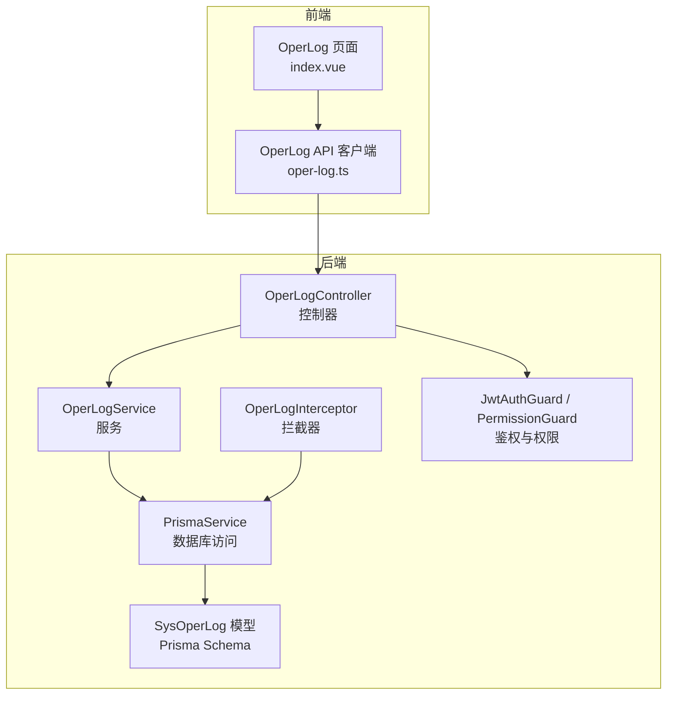
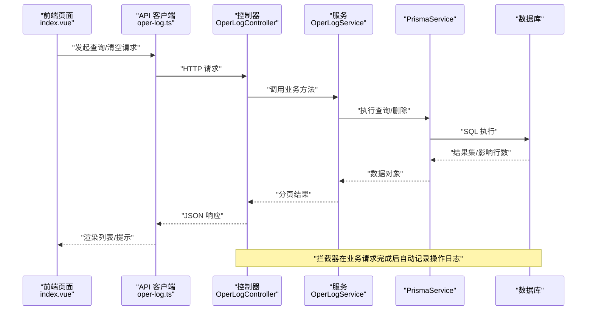
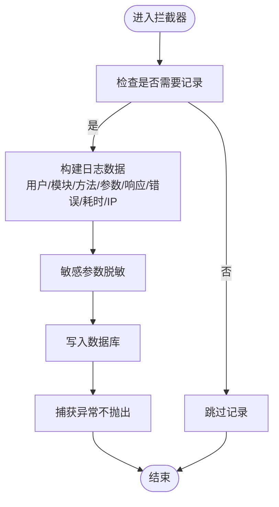
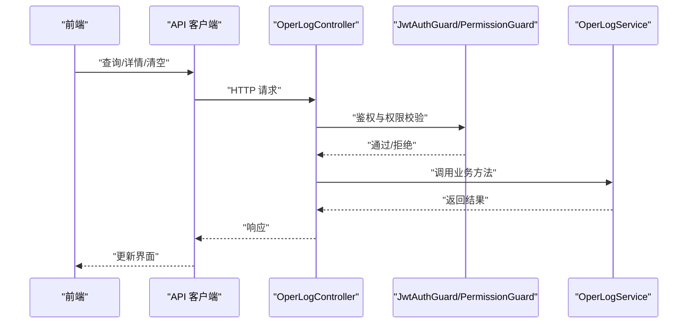
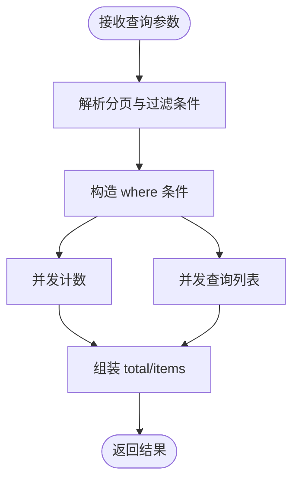
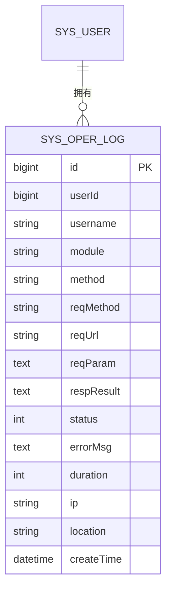
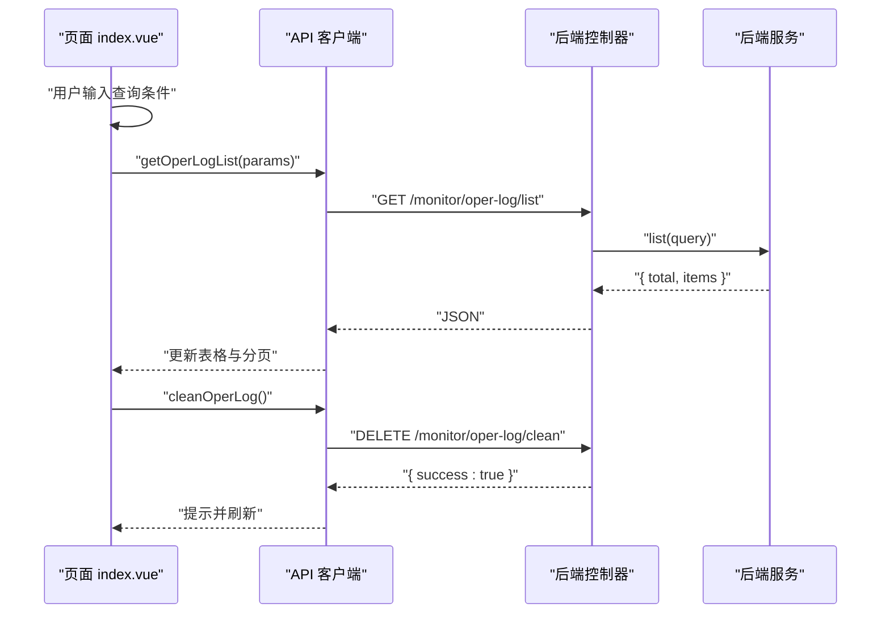
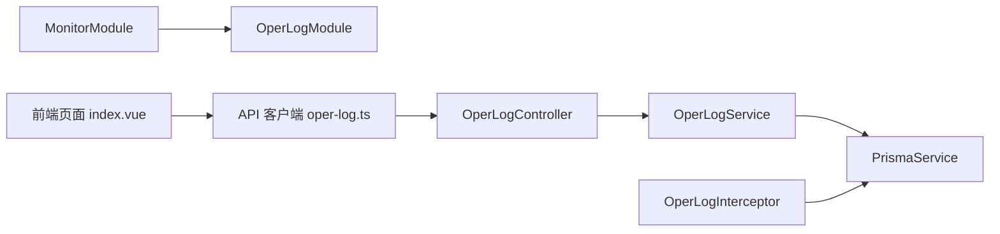

# 操作日志管理

<cite>
**本文引用的文件**
- [apps/backend/src/common/oper-log.interceptor.ts](file://apps/backend/src/common/oper-log.interceptor.ts)
- [apps/backend/src/modules/monitor/oper-log/oper-log.controller.ts](file://apps/backend/src/modules/monitor/oper-log/oper-log.controller.ts)
- [apps/backend/src/modules/monitor/oper-log/oper-log.service.ts](file://apps/backend/src/modules/monitor/oper-log/oper-log.service.ts)
- [apps/backend/src/modules/monitor/oper-log/oper-log.module.ts](file://apps/backend/src/modules/monitor/oper-log/oper-log.module.ts)
- [apps/backend/src/modules/monitor/monitor.module.ts](file://apps/backend/src/modules/monitor/monitor.module.ts)
- [apps/backend/src/auth/guards.ts](file://apps/backend/src/auth/guards.ts)
- [apps/backend/src/auth/jwt.guard.ts](file://apps/backend/src/auth/jwt.guard.ts)
- [apps/backend/prisma/schema.prisma](file://apps/backend/prisma/schema.prisma)
- [apps/vben-admin/apps/web-antd/src/api/monitor/oper-log.ts](file://apps/vben-admin/apps/web-antd/src/api/monitor/oper-log.ts)
- [apps/vben-admin/apps/web-antd/src/views/monitor/oper-log/index.vue](file://apps/vben-admin/apps/web-antd/src/views/monitor/oper-log/index.vue)
</cite>

## 目录
1. [简介](#简介)
2. [项目结构](#项目结构)
3. [核心组件](#核心组件)
4. [架构总览](#架构总览)
5. [详细组件分析](#详细组件分析)
6. [依赖关系分析](#依赖关系分析)
7. [性能考量](#性能考量)
8. [故障排查指南](#故障排查指南)
9. [结论](#结论)
10. [附录](#附录)

## 简介
本文件系统性阐述操作日志管理功能的设计与实现，覆盖以下方面：
- 用户操作行为的日志记录机制：记录操作类型、操作模块、操作描述、请求参数、响应结果、错误信息、耗时、IP 地址等字段。
- 操作日志的分类体系与标记规则：基于 URL 路径推导模块名，区分成功/失败状态。
- 查询接口设计：支持按用户名、模块名、状态、时间范围等条件检索，并分页返回。
- 详情展示与审计追踪：提供按 ID 获取详情的能力，便于审计回溯。
- 批量清理与归档策略：提供一键清空全部操作日志的能力；建议结合数据库归档策略实现长期留存。
- 统计分析与热点识别：当前后端未内置统计接口，可在前端或独立服务中扩展。

## 项目结构
操作日志功能由“拦截器 + 控制器 + 服务 + 数据模型 + 前端页面 + API 客户端”构成，采用分层与模块化组织：
- 后端模块：common 层的拦截器负责自动记录；monitor 模块下的 oper-log 子模块提供查询与清理接口；Prisma 定义 SysOperLog 数据模型。
- 前端模块：web-antd 提供操作日志列表页面与 API 客户端封装。

图表来源
- [apps/backend/src/common/oper-log.interceptor.ts:1-111](file://apps/backend/src/common/oper-log.interceptor.ts#L1-L111)
- [apps/backend/src/modules/monitor/oper-log/oper-log.controller.ts:1-35](file://apps/backend/src/modules/monitor/oper-log/oper-log.controller.ts#L1-L35)
- [apps/backend/src/modules/monitor/oper-log/oper-log.service.ts:1-33](file://apps/backend/src/modules/monitor/oper-log/oper-log.service.ts#L1-L33)
- [apps/backend/prisma/schema.prisma:231-254](file://apps/backend/prisma/schema.prisma#L231-L254)
- [apps/vben-admin/apps/web-antd/src/views/monitor/oper-log/index.vue:1-161](file://apps/vben-admin/apps/web-antd/src/views/monitor/oper-log/index.vue#L1-L161)
- [apps/vben-admin/apps/web-antd/src/api/monitor/oper-log.ts:1-40](file://apps/vben-admin/apps/web-antd/src/api/monitor/oper-log.ts#L1-L40)

章节来源
- [apps/backend/src/common/oper-log.interceptor.ts:1-111](file://apps/backend/src/common/oper-log.interceptor.ts#L1-L111)
- [apps/backend/src/modules/monitor/oper-log/oper-log.controller.ts:1-35](file://apps/backend/src/modules/monitor/oper-log/oper-log.controller.ts#L1-L35)
- [apps/backend/src/modules/monitor/oper-log/oper-log.service.ts:1-33](file://apps/backend/src/modules/monitor/oper-log/oper-log.service.ts#L1-L33)
- [apps/backend/prisma/schema.prisma:231-254](file://apps/backend/prisma/schema.prisma#L231-L254)
- [apps/vben-admin/apps/web-antd/src/views/monitor/oper-log/index.vue:1-161](file://apps/vben-admin/apps/web-antd/src/views/monitor/oper-log/index.vue#L1-L161)
- [apps/vben-admin/apps/web-antd/src/api/monitor/oper-log.ts:1-40](file://apps/vben-admin/apps/web-antd/src/api/monitor/oper-log.ts#L1-L40)

## 核心组件
- 拦截器（自动记录）：在请求处理完成后捕获成功/异常结果，构造日志条目并写入数据库，确保不影响业务主流程。
- 控制器（查询与清理）：提供列表查询、详情查询、清空日志等接口，配合鉴权守卫保证安全。
- 服务（数据访问）：封装分页查询、条件过滤、计数与删除逻辑。
- 数据模型（Prisma）：SysOperLog 表定义了操作日志的字段与索引。
- 前端页面与 API 客户端：提供查询表单、表格展示、清空按钮与分页交互。

章节来源
- [apps/backend/src/common/oper-log.interceptor.ts:1-111](file://apps/backend/src/common/oper-log.interceptor.ts#L1-L111)
- [apps/backend/src/modules/monitor/oper-log/oper-log.controller.ts:1-35](file://apps/backend/src/modules/monitor/oper-log/oper-log.controller.ts#L1-L35)
- [apps/backend/src/modules/monitor/oper-log/oper-log.service.ts:1-33](file://apps/backend/src/modules/monitor/oper-log/oper-log.service.ts#L1-L33)
- [apps/backend/prisma/schema.prisma:231-254](file://apps/backend/prisma/schema.prisma#L231-L254)
- [apps/vben-admin/apps/web-antd/src/views/monitor/oper-log/index.vue:1-161](file://apps/vben-admin/apps/web-antd/src/views/monitor/oper-log/index.vue#L1-L161)
- [apps/vben-admin/apps/web-antd/src/api/monitor/oper-log.ts:1-40](file://apps/vben-admin/apps/web-antd/src/api/monitor/oper-log.ts#L1-L40)

## 架构总览
下图展示了从请求到日志落库、再到前端查询与展示的完整链路。

图表来源
- [apps/vben-admin/apps/web-antd/src/views/monitor/oper-log/index.vue:42-94](file://apps/vben-admin/apps/web-antd/src/views/monitor/oper-log/index.vue#L42-L94)
- [apps/vben-admin/apps/web-antd/src/api/monitor/oper-log.ts:29-39](file://apps/vben-admin/apps/web-antd/src/api/monitor/oper-log.ts#L29-L39)
- [apps/backend/src/modules/monitor/oper-log/oper-log.controller.ts:13-33](file://apps/backend/src/modules/monitor/oper-log/oper-log.controller.ts#L13-L33)
- [apps/backend/src/modules/monitor/oper-log/oper-log.service.ts:8-32](file://apps/backend/src/modules/monitor/oper-log/oper-log.service.ts#L8-L32)
- [apps/backend/src/common/oper-log.interceptor.ts:15-61](file://apps/backend/src/common/oper-log.interceptor.ts#L15-L61)

## 详细组件分析

### 拦截器：自动记录操作日志
- 记录时机：请求处理完成（成功或异常）后，计算耗时并写入日志。
- 过滤规则：仅对非 GET 请求、存在登录用户且不在特定路径（如操作日志接口自身）时记录。
- 模块名推导：根据 URL 路径解析前两级作为模块标识。
- 参数脱敏：对包含敏感关键词的字段值统一替换为占位符，避免泄露。
- 写入策略：使用 Prisma 创建日志记录，异常吞掉以确保不影响业务主流程。

图表来源
- [apps/backend/src/common/oper-log.interceptor.ts:30-61](file://apps/backend/src/common/oper-log.interceptor.ts#L30-L61)
- [apps/backend/src/common/oper-log.interceptor.ts:63-79](file://apps/backend/src/common/oper-log.interceptor.ts#L63-L79)
- [apps/backend/src/common/oper-log.interceptor.ts:81-99](file://apps/backend/src/common/oper-log.interceptor.ts#L81-L99)
- [apps/backend/src/common/oper-log.interceptor.ts:101-109](file://apps/backend/src/common/oper-log.interceptor.ts#L101-L109)

章节来源
- [apps/backend/src/common/oper-log.interceptor.ts:1-111](file://apps/backend/src/common/oper-log.interceptor.ts#L1-L111)

### 控制器：查询与清理接口
- 列表查询：接收分页参数与可选过滤条件，委托服务层查询。
- 详情查询：按 ID 返回单条日志。
- 清空日志：删除所有日志记录，常用于维护或测试环境。
- 权限控制：使用 JWT 鉴权与权限守卫，要求具备相应权限码。

图表来源
- [apps/backend/src/modules/monitor/oper-log/oper-log.controller.ts:1-35](file://apps/backend/src/modules/monitor/oper-log/oper-log.controller.ts#L1-L35)
- [apps/backend/src/auth/jwt.guard.ts:1-5](file://apps/backend/src/auth/jwt.guard.ts#L1-L5)
- [apps/backend/src/auth/guards.ts:1-51](file://apps/backend/src/auth/guards.ts#L1-L51)

章节来源
- [apps/backend/src/modules/monitor/oper-log/oper-log.controller.ts:1-35](file://apps/backend/src/modules/monitor/oper-log/oper-log.controller.ts#L1-L35)
- [apps/backend/src/auth/guards.ts:1-51](file://apps/backend/src/auth/guards.ts#L1-L51)
- [apps/backend/src/auth/jwt.guard.ts:1-5](file://apps/backend/src/auth/jwt.guard.ts#L1-L5)

### 服务：数据访问与分页查询
- 分页与过滤：支持按用户名、模块名模糊匹配，按分页参数返回总数与列表。
- 计数与查询：使用并发计数与查询提升性能。
- 单条查询：按 ID 查找日志详情。
- 清理：删除所有日志记录。

图表来源
- [apps/backend/src/modules/monitor/oper-log/oper-log.service.ts:8-23](file://apps/backend/src/modules/monitor/oper-log/oper-log.service.ts#L8-L23)
- [apps/backend/src/modules/monitor/oper-log/oper-log.service.ts:25-32](file://apps/backend/src/modules/monitor/oper-log/oper-log.service.ts#L25-L32)

章节来源
- [apps/backend/src/modules/monitor/oper-log/oper-log.service.ts:1-33](file://apps/backend/src/modules/monitor/oper-log/oper-log.service.ts#L1-L33)

### 数据模型：SysOperLog
- 关键字段：用户标识、模块名、请求方法与 URL、请求参数、响应结果、状态、错误信息、耗时、IP、地理位置、创建时间等。
- 索引设计：对用户、模块、创建时间建立索引，支撑常见查询场景。
- 关系：与用户表关联，便于审计追踪。

图表来源
- [apps/backend/prisma/schema.prisma:231-254](file://apps/backend/prisma/schema.prisma#L231-L254)

章节来源
- [apps/backend/prisma/schema.prisma:231-254](file://apps/backend/prisma/schema.prisma#L231-L254)

### 前端：操作日志页面与 API 客户端
- 页面能力：支持按模块名、IP、状态、时间范围查询；分页展示；清空日志。
- API 客户端：封装列表、详情、清空三个接口，参数与后端保持一致。
- 交互细节：查询触发加载数据；清空后刷新列表；分页变更重新加载。

图表来源
- [apps/vben-admin/apps/web-antd/src/views/monitor/oper-log/index.vue:42-94](file://apps/vben-admin/apps/web-antd/src/views/monitor/oper-log/index.vue#L42-L94)
- [apps/vben-admin/apps/web-antd/src/api/monitor/oper-log.ts:29-39](file://apps/vben-admin/apps/web-antd/src/api/monitor/oper-log.ts#L29-L39)

章节来源
- [apps/vben-admin/apps/web-antd/src/views/monitor/oper-log/index.vue:1-161](file://apps/vben-admin/apps/web-antd/src/views/monitor/oper-log/index.vue#L1-L161)
- [apps/vben-admin/apps/web-antd/src/api/monitor/oper-log.ts:1-40](file://apps/vben-admin/apps/web-antd/src/api/monitor/oper-log.ts#L1-L40)

## 依赖关系分析
- 模块聚合：MonitorModule 导入 OperLogModule，统一暴露监控子模块。
- 控制器依赖：OperLogController 注入 OperLogService，并受鉴权守卫保护。
- 服务依赖：OperLogService 依赖 PrismaService 进行数据库操作。
- 拦截器依赖：OperLogInterceptor 依赖 PrismaService 写入日志。
- 前端依赖：页面通过 API 客户端调用后端接口。

图表来源
- [apps/backend/src/modules/monitor/monitor.module.ts:1-11](file://apps/backend/src/modules/monitor/monitor.module.ts#L1-L11)
- [apps/backend/src/modules/monitor/oper-log/oper-log.module.ts:1-10](file://apps/backend/src/modules/monitor/oper-log/oper-log.module.ts#L1-L10)
- [apps/backend/src/modules/monitor/oper-log/oper-log.controller.ts:1-35](file://apps/backend/src/modules/monitor/oper-log/oper-log.controller.ts#L1-L35)
- [apps/backend/src/modules/monitor/oper-log/oper-log.service.ts:1-33](file://apps/backend/src/modules/monitor/oper-log/oper-log.service.ts#L1-L33)
- [apps/backend/src/common/oper-log.interceptor.ts:1-111](file://apps/backend/src/common/oper-log.interceptor.ts#L1-L111)
- [apps/vben-admin/apps/web-antd/src/views/monitor/oper-log/index.vue:1-161](file://apps/vben-admin/apps/web-antd/src/views/monitor/oper-log/index.vue#L1-L161)
- [apps/vben-admin/apps/web-antd/src/api/monitor/oper-log.ts:1-40](file://apps/vben-admin/apps/web-antd/src/api/monitor/oper-log.ts#L1-L40)

章节来源
- [apps/backend/src/modules/monitor/monitor.module.ts:1-11](file://apps/backend/src/modules/monitor/monitor.module.ts#L1-L11)
- [apps/backend/src/modules/monitor/oper-log/oper-log.module.ts:1-10](file://apps/backend/src/modules/monitor/oper-log/oper-log.module.ts#L1-L10)
- [apps/backend/src/modules/monitor/oper-log/oper-log.controller.ts:1-35](file://apps/backend/src/modules/monitor/oper-log/oper-log.controller.ts#L1-L35)
- [apps/backend/src/modules/monitor/oper-log/oper-log.service.ts:1-33](file://apps/backend/src/modules/monitor/oper-log/oper-log.service.ts#L1-L33)
- [apps/backend/src/common/oper-log.interceptor.ts:1-111](file://apps/backend/src/common/oper-log.interceptor.ts#L1-L111)
- [apps/vben-admin/apps/web-antd/src/views/monitor/oper-log/index.vue:1-161](file://apps/vben-admin/apps/web-antd/src/views/monitor/oper-log/index.vue#L1-L161)
- [apps/vben-admin/apps/web-antd/src/api/monitor/oper-log.ts:1-40](file://apps/vben-admin/apps/web-antd/src/api/monitor/oper-log.ts#L1-L40)

## 性能考量
- 拦截器写入：采用异步写入并在异常时吞掉错误，避免阻塞主业务链路。
- 并发查询：服务层对计数与查询使用 Promise.all 并发执行，降低 RT。
- 参数大小限制：序列化请求/响应时对超长文本进行截断，防止存储膨胀与序列化开销过大。
- 索引优化：Prisma 对常用查询字段建立索引，有助于分页与过滤性能。
- 建议：对高频写入场景可考虑异步队列或批量入库策略；对历史日志可定期归档至冷存储。

## 故障排查指南
- 无日志记录
  - 检查拦截器过滤条件：是否为 GET 请求、是否存在用户、是否命中排除路径。
  - 确认鉴权是否生效：JWT 是否正确、权限是否满足。
- 查询不到数据
  - 确认查询参数：用户名/模块名是否正确、分页参数是否合理。
  - 检查索引与数据量：确认数据库中是否存在匹配记录。
- 清空无效
  - 确认调用的是清空接口而非列表接口。
  - 检查权限是否具备相应权限码。
- 参数脱敏导致调试困难
  - 在开发环境可临时调整脱敏规则，但需注意生产环境的安全性。

章节来源
- [apps/backend/src/common/oper-log.interceptor.ts:63-79](file://apps/backend/src/common/oper-log.interceptor.ts#L63-L79)
- [apps/backend/src/modules/monitor/oper-log/oper-log.controller.ts:1-35](file://apps/backend/src/modules/monitor/oper-log/oper-log.controller.ts#L1-L35)
- [apps/backend/src/modules/monitor/oper-log/oper-log.service.ts:8-23](file://apps/backend/src/modules/monitor/oper-log/oper-log.service.ts#L8-L23)

## 结论
该操作日志管理功能通过拦截器实现无侵入记录，结合控制器与服务提供完善的查询与清理能力，并以 Prisma 数据模型支撑审计追踪。前端页面提供了直观的查询与清空体验。当前实现聚焦于基础记录与检索，后续可在统计分析与热点识别方面扩展，以满足更高级的运营与安全部署需求。

## 附录

### 字段说明与分类体系
- 基础信息
  - 用户标识：userId、username
  - 模块标识：module（由 URL 推导）
  - 方法与 URL：method、reqMethod、reqUrl
  - IP 与位置：ip、location
  - 创建时间：createTime
- 请求与响应
  - 请求参数：reqParam（已脱敏）
  - 响应结果：respResult（超长截断）
- 状态与错误
  - 状态：status（1 成功/0 失败）
  - 错误信息：errorMsg
  - 耗时：duration（毫秒）
- 分类与标记
  - 模块分类：依据 URL 路径前两级划分（如 system/user）
  - 状态标记：成功/失败两类，前端以颜色区分

章节来源
- [apps/backend/prisma/schema.prisma:231-254](file://apps/backend/prisma/schema.prisma#L231-L254)
- [apps/backend/src/common/oper-log.interceptor.ts:30-61](file://apps/backend/src/common/oper-log.interceptor.ts#L30-L61)
- [apps/backend/src/common/oper-log.interceptor.ts:72-79](file://apps/backend/src/common/oper-log.interceptor.ts#L72-L79)

### 查询接口设计要点
- 支持条件
  - 用户名：模糊匹配
  - 模块名：模糊匹配
  - 状态：精确匹配（1/0）
  - 时间范围：可通过扩展参数支持（当前前端传参包含开始/结束时间，后端未直接使用）
- 分页
  - page、limit 默认值与类型转换
- 返回
  - total：总数
  - items：分页列表

章节来源
- [apps/backend/src/modules/monitor/oper-log/oper-log.service.ts:8-23](file://apps/backend/src/modules/monitor/oper-log/oper-log.service.ts#L8-L23)
- [apps/vben-admin/apps/web-antd/src/api/monitor/oper-log.ts:19-27](file://apps/vben-admin/apps/web-antd/src/api/monitor/oper-log.ts#L19-L27)
- [apps/vben-admin/apps/web-antd/src/views/monitor/oper-log/index.vue:22-30](file://apps/vben-admin/apps/web-antd/src/views/monitor/oper-log/index.vue#L22-L30)

### 批量清理与归档策略
- 清理
  - 提供一键清空全部操作日志接口，适用于维护与测试环境。
- 归档
  - 建议：按月/季度归档历史日志至独立表或对象存储，保留必要字段并压缩存储。
  - 定期：设置定时任务清理过期日志，控制在线表规模。

章节来源
- [apps/backend/src/modules/monitor/oper-log/oper-log.controller.ts:27-33](file://apps/backend/src/modules/monitor/oper-log/oper-log.controller.ts#L27-L33)
- [apps/backend/src/modules/monitor/oper-log/oper-log.service.ts:29-32](file://apps/backend/src/modules/monitor/oper-log/oper-log.service.ts#L29-L32)

### 统计分析与热点识别
- 当前实现
  - 后端未提供专门的统计接口。
- 建议
  - 前端或独立服务按天/小时聚合模块调用次数、平均耗时、失败率等指标。
  - 识别热点模块与高风险接口，辅助容量规划与安全加固。