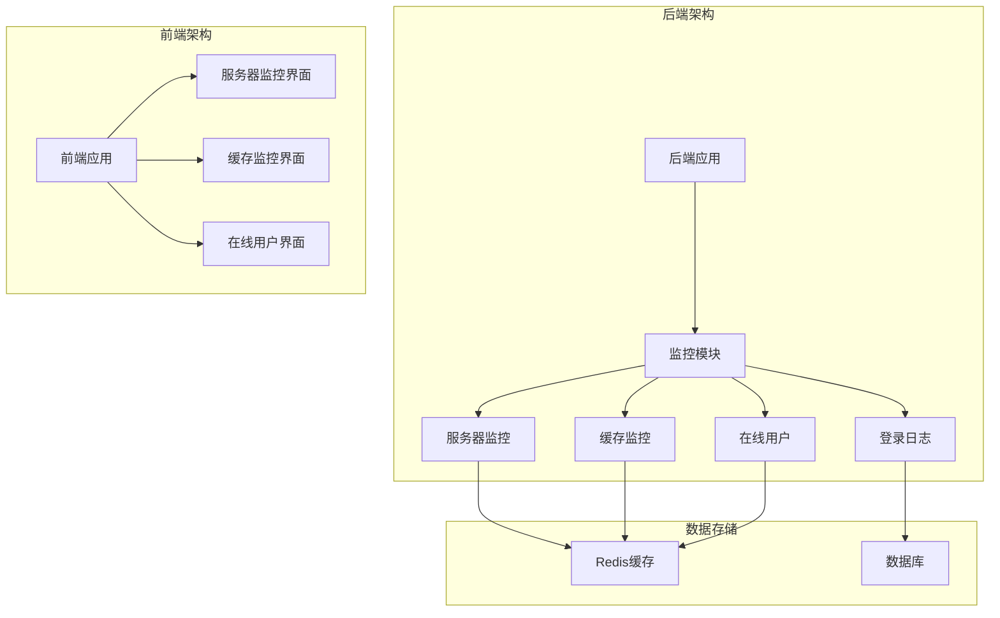
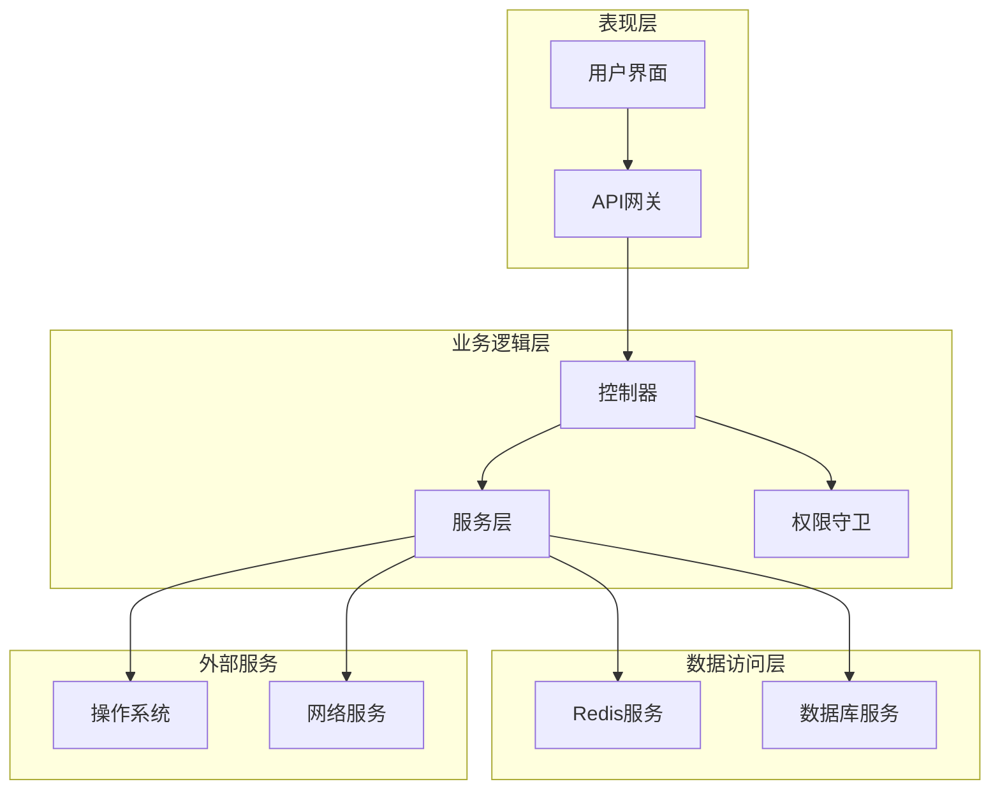
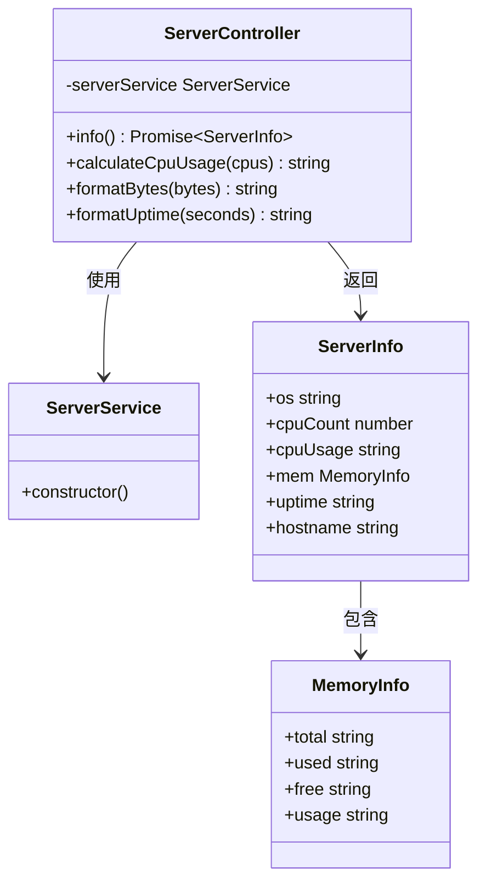
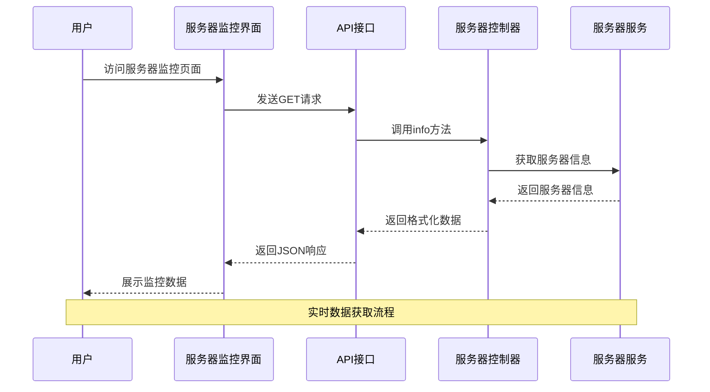
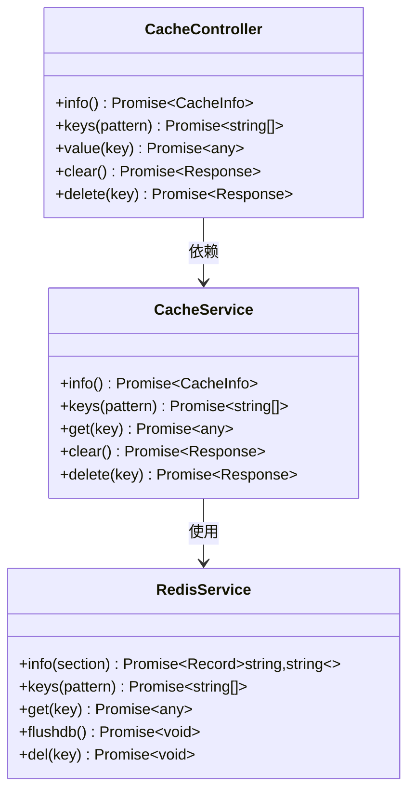
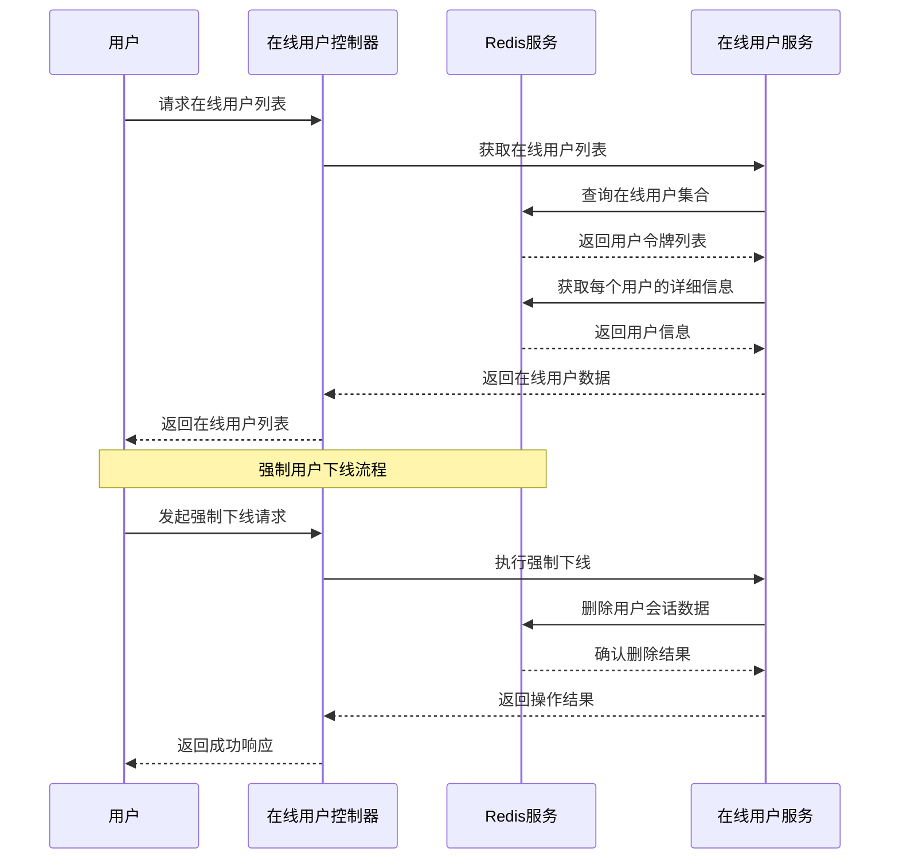
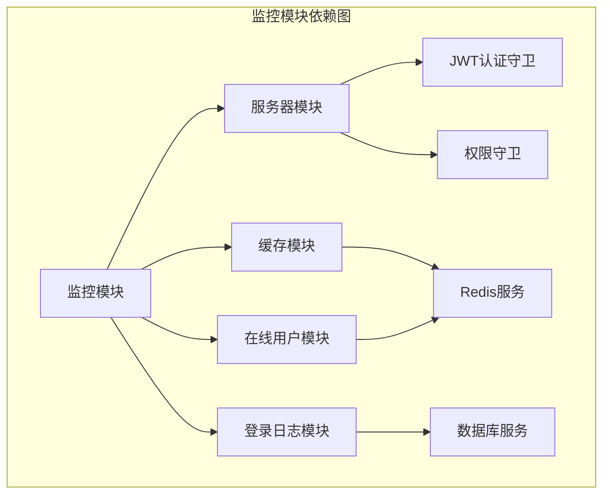

# 服务器性能监控

<cite>
**本文档引用的文件**
- [apps/backend/src/modules/monitor/server/server.controller.ts](file://apps/backend/src/modules/monitor/server/server.controller.ts)
- [apps/backend/src/modules/monitor/server/server.service.ts](file://apps/backend/src/modules/monitor/server/server.service.ts)
- [apps/backend/src/modules/monitor/server/server.module.ts](file://apps/backend/src/modules/monitor/server/server.module.ts)
- [apps/backend/src/modules/monitor/monitor.module.ts](file://apps/backend/src/modules/monitor/monitor.module.ts)
- [apps/backend/src/modules/monitor/cache/cache.controller.ts](file://apps/backend/src/modules/monitor/cache/cache.controller.ts)
- [apps/backend/src/modules/monitor/cache/cache.service.ts](file://apps/backend/src/modules/monitor/cache/cache.service.ts)
- [apps/backend/src/modules/monitor/online/online.controller.ts](file://apps/backend/src/modules/monitor/online/online.controller.ts)
- [apps/backend/src/modules/monitor/login-log/login-log.controller.ts](file://apps/backend/src/modules/monitor/login-log/login-log.controller.ts)
- [apps/backend/src/cache/redis.service.ts](file://apps/backend/src/cache/redis.service.ts)
- [apps/vben-admin/apps/web-antd/src/api/monitor/server.ts](file://apps/vben-admin/apps/web-antd/src/api/monitor/server.ts)
- [apps/vben-admin/apps/web-antd/src/views/monitor/server/index.vue](file://apps/vben-admin/apps/web-antd/src/views/monitor/server/index.vue)
- [apps/vben-admin/apps/web-antd/src/api/monitor/cache.ts](file://apps/vben-admin/apps/web-antd/src/api/monitor/cache.ts)
- [apps/vben-admin/apps/web-antd/src/views/monitor/cache/index.vue](file://apps/vben-admin/apps/web-antd/src/views/monitor/cache/index.vue)
- [apps/vben-admin/apps/web-antd/src/api/monitor/online.ts](file://apps/vben-admin/apps/web-antd/src/api/monitor/online.ts)
- [apps/vben-admin/apps/web-antd/src/views/monitor/online/index.vue](file://apps/vben-admin/apps/web-antd/src/views/monitor/online/index.vue)
</cite>

## 目录
1. [简介](#简介)
2. [项目结构](#项目结构)
3. [核心组件](#核心组件)
4. [架构概览](#架构概览)
5. [详细组件分析](#详细组件分析)
6. [依赖关系分析](#依赖关系分析)
7. [性能考虑](#性能考虑)
8. [故障排除指南](#故障排除指南)
9. [结论](#结论)
10. [附录](#附录)

## 简介

本项目提供了完整的服务器性能监控解决方案，专注于服务器硬件资源的实时监控和管理。系统实现了对CPU使用率、内存占用、磁盘IO、网络流量等关键指标的采集和展示，并提供了缓存监控、在线用户管理和登录日志管理等功能。

监控系统采用前后端分离架构，后端基于NestJS框架构建RESTful API，前端使用Vue.js和Ant Design Vue组件库实现数据可视化展示。系统支持权限控制、实时数据刷新和历史数据查询功能。

## 项目结构

监控功能主要分布在以下目录结构中：

**图表来源**
- [apps/backend/src/modules/monitor/monitor.module.ts:1-11](file://apps/backend/src/modules/monitor/monitor.module.ts#L1-L11)
- [apps/backend/src/modules/monitor/server/server.module.ts:1-10](file://apps/backend/src/modules/monitor/server/server.module.ts#L1-L10)

**章节来源**
- [apps/backend/src/modules/monitor/monitor.module.ts:1-11](file://apps/backend/src/modules/monitor/monitor.module.ts#L1-L11)
- [apps/backend/src/modules/monitor/server/server.module.ts:1-10](file://apps/backend/src/modules/monitor/server/server.module.ts#L1-L10)

## 核心组件

### 服务器监控组件

服务器监控组件负责收集和展示服务器硬件资源的实时状态信息。当前实现主要包括CPU使用率、内存占用、系统信息等基础监控指标。

### 缓存监控组件

缓存监控组件提供Redis缓存的实时监控和管理功能，包括缓存信息查看、键值管理、缓存清理等操作。

### 在线用户监控组件

在线用户监控组件用于跟踪和管理当前登录系统的用户会话状态，支持强制用户下线等管理操作。

### 登录日志监控组件

登录日志监控组件提供用户登录行为的历史记录查询和管理功能。

**章节来源**
- [apps/backend/src/modules/monitor/server/server.controller.ts:1-70](file://apps/backend/src/modules/monitor/server/server.controller.ts#L1-L70)
- [apps/backend/src/modules/monitor/cache/cache.controller.ts:1-50](file://apps/backend/src/modules/monitor/cache/cache.controller.ts#L1-L50)
- [apps/backend/src/modules/monitor/online/online.controller.ts:1-28](file://apps/backend/src/modules/monitor/online/online.controller.ts#L1-L28)
- [apps/backend/src/modules/monitor/login-log/login-log.controller.ts:1-45](file://apps/backend/src/modules/monitor/login-log/login-log.controller.ts#L1-L45)

## 架构概览

系统采用分层架构设计，实现了清晰的关注点分离：

**图表来源**
- [apps/backend/src/modules/monitor/server/server.controller.ts:1-70](file://apps/backend/src/modules/monitor/server/server.controller.ts#L1-L70)
- [apps/backend/src/cache/redis.service.ts:1-128](file://apps/backend/src/cache/redis.service.ts#L1-L128)

系统架构特点：
- **模块化设计**：监控功能按功能模块划分，便于维护和扩展
- **权限控制**：集成JWT认证和权限验证机制
- **异步处理**：使用Promise和async/await处理异步操作
- **错误处理**：统一的异常过滤器处理系统异常

## 详细组件分析

### 服务器监控控制器

服务器监控控制器实现了系统信息的实时获取和展示功能：

**图表来源**
- [apps/backend/src/modules/monitor/server/server.controller.ts:1-70](file://apps/backend/src/modules/monitor/server/server.controller.ts#L1-L70)
- [apps/backend/src/modules/monitor/server/server.service.ts:1-4](file://apps/backend/src/modules/monitor/server/server.service.ts#L1-L4)

服务器监控功能特性：
- **CPU监控**：计算多核CPU的平均使用率
- **内存监控**：显示总内存、已用内存、可用内存和使用率
- **系统信息**：提供操作系统信息和运行时间
- **数据格式化**：自动转换字节为合适的单位显示

**章节来源**
- [apps/backend/src/modules/monitor/server/server.controller.ts:14-70](file://apps/backend/src/modules/monitor/server/server.controller.ts#L14-L70)

### 前端服务器监控界面

前端界面使用Vue.js和Ant Design Vue组件实现数据可视化：

**图表来源**
- [apps/vben-admin/apps/web-antd/src/views/monitor/server/index.vue:1-139](file://apps/vben-admin/apps/web-antd/src/views/monitor/server/index.vue#L1-L139)
- [apps/vben-admin/apps/web-antd/src/api/monitor/server.ts:1-33](file://apps/vben-admin/apps/web-antd/src/api/monitor/server.ts#L1-L33)

界面展示功能：
- **CPU信息卡片**：显示CPU型号、核心数和使用率进度条
- **内存信息卡片**：显示内存总量、已用内存和使用率
- **磁盘信息卡片**：显示磁盘容量、已用空间和使用率
- **系统信息面板**：显示操作系统、Node版本和运行时间

**章节来源**
- [apps/vben-admin/apps/web-antd/src/views/monitor/server/index.vue:21-139](file://apps/vben-admin/apps/web-antd/src/views/monitor/server/index.vue#L21-L139)
- [apps/vben-admin/apps/web-antd/src/api/monitor/server.ts:3-28](file://apps/vben-admin/apps/web-antd/src/api/monitor/server.ts#L3-L28)

### 缓存监控组件

缓存监控组件提供完整的Redis缓存管理功能：

**图表来源**
- [apps/backend/src/modules/monitor/cache/cache.controller.ts:1-50](file://apps/backend/src/modules/monitor/cache/cache.controller.ts#L1-L50)
- [apps/backend/src/modules/monitor/cache/cache.service.ts:1-29](file://apps/backend/src/modules/monitor/cache/cache.service.ts#L1-L29)
- [apps/backend/src/cache/redis.service.ts:1-128](file://apps/backend/src/cache/redis.service.ts#L1-L128)

缓存管理功能：
- **缓存信息查看**：获取Redis服务器状态信息
- **键值管理**：支持键值查询、删除和批量清理
- **缓存清理**：提供安全的缓存清理机制
- **实时监控**：展示缓存命中率、连接数等关键指标

**章节来源**
- [apps/backend/src/modules/monitor/cache/cache.controller.ts:13-48](file://apps/backend/src/modules/monitor/cache/cache.controller.ts#L13-L48)
- [apps/backend/src/modules/monitor/cache/cache.service.ts:8-28](file://apps/backend/src/modules/monitor/cache/cache.service.ts#L8-L28)

### 在线用户监控

在线用户监控组件实现用户会话管理功能：

**图表来源**
- [apps/backend/src/modules/monitor/online/online.controller.ts:1-28](file://apps/backend/src/modules/monitor/online/online.controller.ts#L1-L28)
- [apps/backend/src/cache/redis.service.ts:82-99](file://apps/backend/src/cache/redis.service.ts#L82-L99)

在线用户管理功能：
- **实时用户列表**：显示当前在线用户的基本信息
- **强制下线**：支持管理员强制结束用户会话
- **会话管理**：基于Redis实现高效的会话存储和查询

**章节来源**
- [apps/backend/src/modules/monitor/online/online.controller.ts:13-26](file://apps/backend/src/modules/monitor/online/online.controller.ts#L13-L26)
- [apps/vben-admin/apps/web-antd/src/views/monitor/online/index.vue:20-44](file://apps/vben-admin/apps/web-antd/src/views/monitor/online/index.vue#L20-L44)

## 依赖关系分析

监控系统的依赖关系呈现清晰的层次结构：

**图表来源**
- [apps/backend/src/modules/monitor/monitor.module.ts:1-11](file://apps/backend/src/modules/monitor/monitor.module.ts#L1-L11)
- [apps/backend/src/modules/monitor/server/server.module.ts:1-10](file://apps/backend/src/modules/monitor/server/server.module.ts#L1-L10)

依赖关系特点：
- **模块解耦**：各监控模块相互独立，可单独启用或禁用
- **服务复用**：Redis服务在多个模块中共享使用
- **权限统一**：所有监控接口都经过JWT和权限验证
- **数据隔离**：不同类型的监控数据存储在不同的数据源中

**章节来源**
- [apps/backend/src/modules/monitor/monitor.module.ts:8-10](file://apps/backend/src/modules/monitor/monitor.module.ts#L8-L10)
- [apps/backend/src/cache/redis.service.ts:1-128](file://apps/backend/src/cache/redis.service.ts#L1-L128)

## 性能考虑

### 数据采集性能

系统在设计时充分考虑了性能优化：

- **轻量级数据采集**：服务器监控仅采集必要的系统指标，避免过度消耗系统资源
- **缓存友好设计**：Redis缓存数据采用适当的TTL策略，平衡数据新鲜度和性能
- **异步处理**：所有I/O操作都采用异步方式，避免阻塞主线程

### 前端渲染优化

前端界面采用了多种优化策略：

- **懒加载**：监控数据按需加载，减少初始页面渲染时间
- **虚拟滚动**：对于大量数据的列表采用虚拟滚动技术
- **防抖处理**：频繁的用户操作采用防抖机制，减少不必要的请求

### 存储策略

数据存储采用分层策略：

- **热数据**：实时监控数据存储在Redis中，保证快速访问
- **历史数据**：长期历史数据存储在关系型数据库中，支持查询和分析
- **缓存策略**：合理设置缓存过期时间，平衡内存使用和查询性能

## 故障排除指南

### 常见问题诊断

**服务器监控数据不更新**
1. 检查后端服务是否正常运行
2. 验证Redis连接配置是否正确
3. 查看系统权限是否足够访问硬件信息

**缓存监控功能异常**
1. 确认Redis服务器连接状态
2. 检查Redis配置参数
3. 验证缓存键的命名规范

**在线用户列表为空**
1. 检查Redis中是否存在在线用户集合
2. 验证用户会话数据的存储格式
3. 确认TTL设置是否过短

### 错误处理机制

系统实现了完善的错误处理机制：

- **统一异常过滤器**：捕获并处理所有未处理的异常
- **权限验证失败**：返回403状态码和详细的错误信息
- **数据访问异常**：提供友好的错误提示和重试机制

**章节来源**
- [apps/backend/src/cache/redis.service.ts:16-23](file://apps/backend/src/cache/redis.service.ts#L16-L23)

## 结论

本服务器性能监控系统提供了完整的监控解决方案，具有以下优势：

**技术优势**
- 采用现代化的前后端分离架构
- 实现了完善的权限控制和安全机制
- 提供了丰富的数据可视化功能
- 支持多种监控指标的实时展示

**功能完整性**
- 覆盖了服务器硬件资源监控的核心需求
- 集成了缓存管理、用户会话监控等辅助功能
- 提供了完整的数据查询和管理能力

**扩展性**
- 模块化设计便于功能扩展
- 插件化的监控指标采集机制
- 支持自定义监控规则和告警策略

系统为运维管理和性能优化提供了强有力的技术支撑，能够有效提升系统的稳定性和可靠性。

## 附录

### API接口定义

系统提供了完整的RESTful API接口，支持各种监控场景的数据获取和管理操作。

### 配置选项

系统支持通过环境变量进行灵活配置，包括Redis连接参数、监控周期、告警阈值等。

### 最佳实践

- 定期监控关键指标的变化趋势
- 设置合理的告警阈值和通知机制
- 建立完善的日志记录和审计功能
- 制定应急预案和故障恢复流程