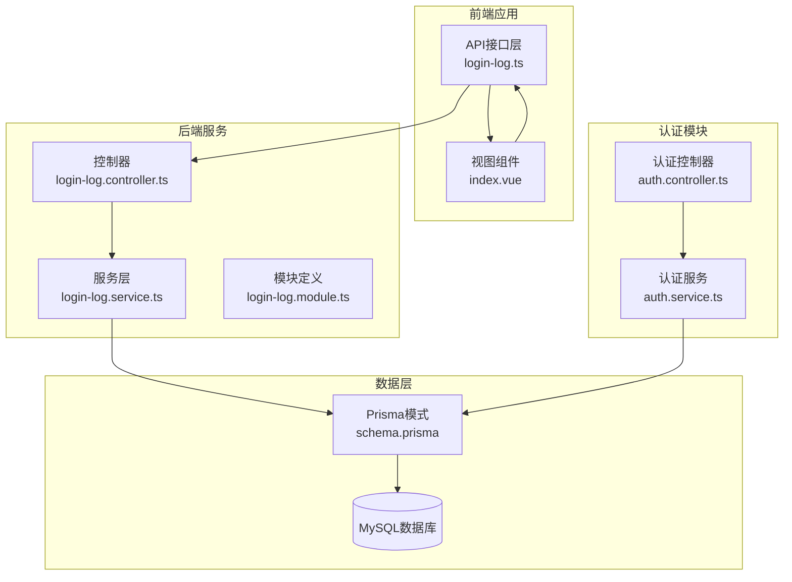
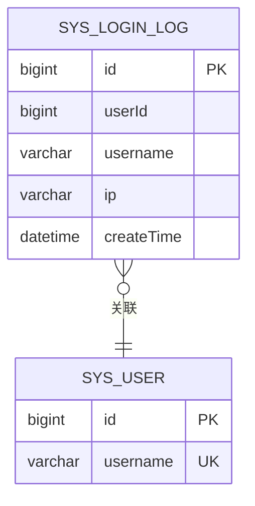
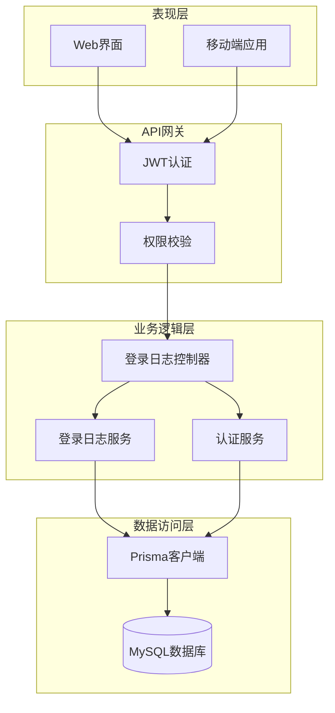
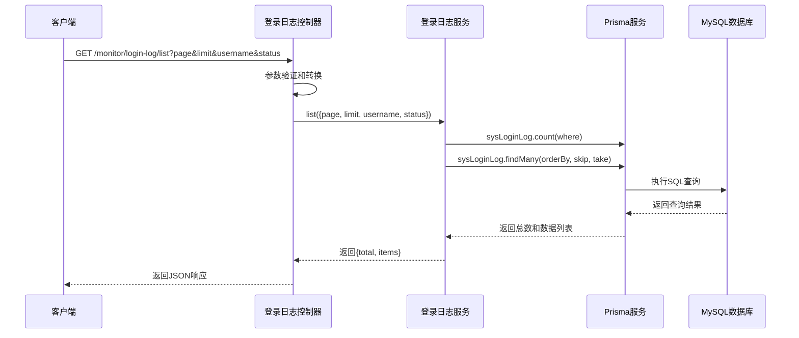
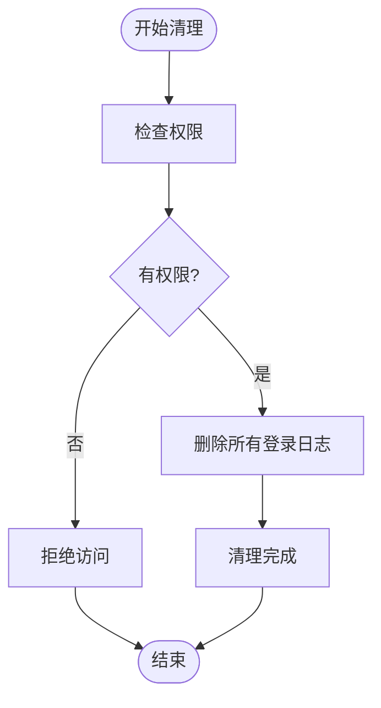
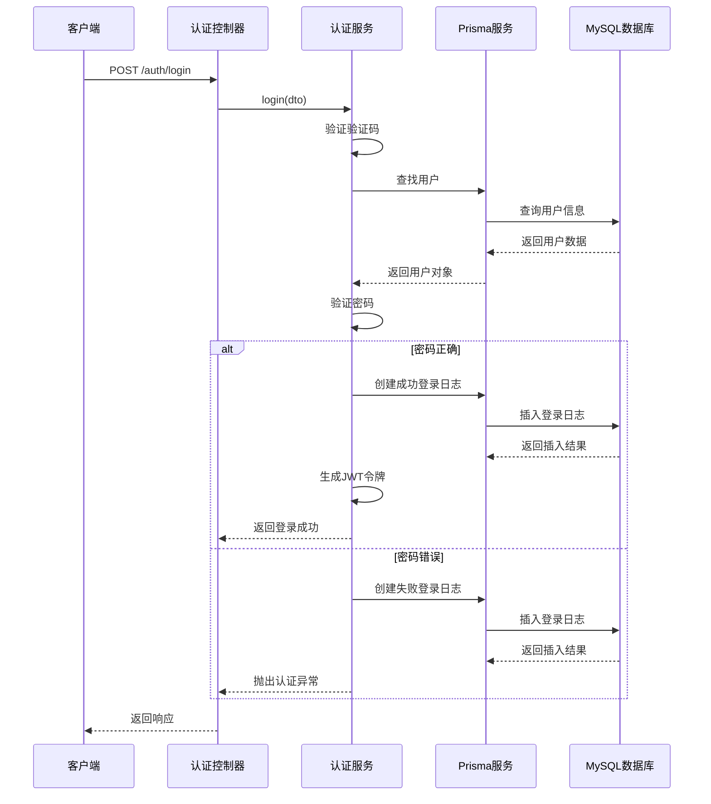
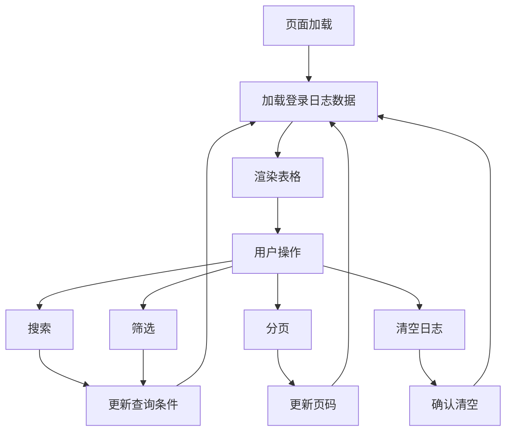
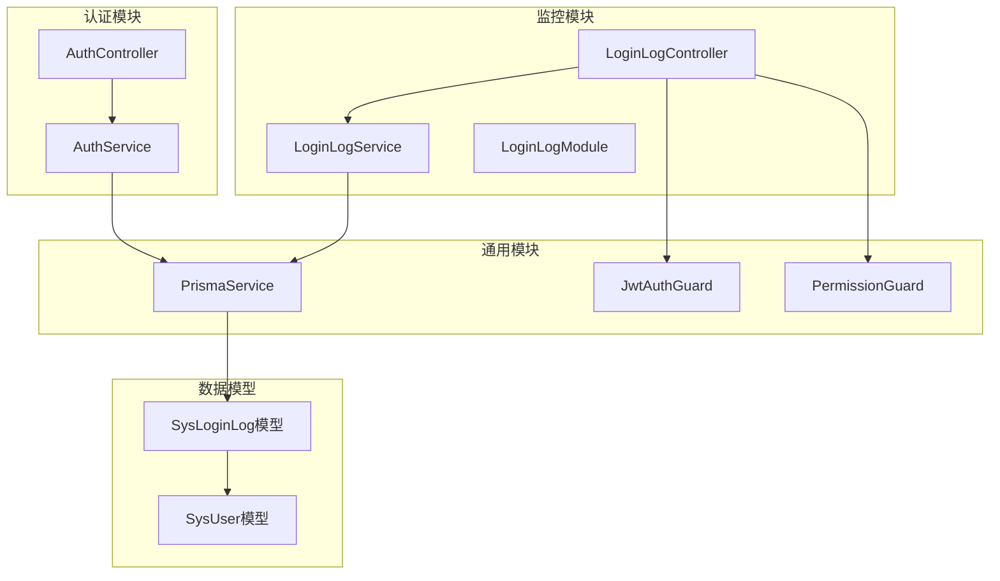

# 登录日志管理

<cite>
**本文档引用的文件**
- [login-log.controller.ts](file://apps/backend/src/modules/monitor/login-log/login-log.controller.ts)
- [login-log.service.ts](file://apps/backend/src/modules/monitor/login-log/login-log.service.ts)
- [login-log.module.ts](file://apps/backend/src/modules/monitor/login-log/login-log.module.ts)
- [schema.prisma](file://apps/backend/prisma/schema.prisma)
- [login-log.ts](file://apps/vben-admin/apps/web-antd/src/api/monitor/login-log.ts)
- [index.vue](file://apps/vben-admin/apps/web-antd/src/views/monitor/login-log/index.vue)
- [auth.service.ts](file://apps/backend/src/auth/auth.service.ts)
- [auth.controller.ts](file://apps/backend/src/auth/auth.controller.ts)
- [oper-log.interceptor.ts](file://apps/backend/src/common/oper-log.interceptor.ts)
</cite>

## 目录
1. [简介](#简介)
2. [项目结构](#项目结构)
3. [核心组件](#核心组件)
4. [架构概览](#架构概览)
5. [详细组件分析](#详细组件分析)
6. [依赖关系分析](#依赖关系分析)
7. [性能考虑](#性能考虑)
8. [故障排除指南](#故障排除指南)
9. [结论](#结论)

## 简介

登录日志管理功能是系统监控模块的重要组成部分，负责记录和管理用户的登录行为。该功能提供了完整的登录日志生命周期管理，包括日志记录、查询、筛选、分页展示以及批量清理等功能。

本系统采用前后端分离架构，后端使用NestJS框架和Prisma ORM，前端使用Vue.js和Ant Design Vue组件库。登录日志数据结构设计合理，包含登录时间、IP地址、登录状态、用户代理等关键字段，为安全审计和异常检测提供了坚实的数据基础。

## 项目结构

登录日志管理功能在项目中的组织结构如下：

**图表来源**
- [login-log.controller.ts:1-45](file://apps/backend/src/modules/monitor/login-log/login-log.controller.ts#L1-L45)
- [login-log.service.ts:1-31](file://apps/backend/src/modules/monitor/login-log/login-log.service.ts#L1-L31)
- [login-log.module.ts:1-10](file://apps/backend/src/modules/monitor/login-log/login-log.module.ts#L1-L10)
- [schema.prisma:211-229](file://apps/backend/prisma/schema.prisma#L211-L229)

**章节来源**
- [login-log.controller.ts:1-45](file://apps/backend/src/modules/monitor/login-log/login-log.controller.ts#L1-L45)
- [login-log.service.ts:1-31](file://apps/backend/src/modules/monitor/login-log/login-log.service.ts#L1-L31)
- [login-log.module.ts:1-10](file://apps/backend/src/modules/monitor/login-log/login-log.module.ts#L1-L10)

## 核心组件

### 数据模型设计

登录日志采用Prisma数据模型定义，包含以下关键字段：

| 字段名 | 类型 | 约束 | 描述 |
|--------|------|------|------|
| id | BigInt | 主键, 自增 | 日志唯一标识符 |
| userId | BigInt | 外键 | 关联用户ID |
| username | String | 非空, 最大长度50 | 用户名 |
| ip | String | 非空, 最大长度50 | 登录IP地址 |
| location | String | 可选, 最大长度255 | 地理位置信息 |
| os | String | 可选, 最大长度100 | 操作系统信息 |
| browser | String | 可选, 最大长度100 | 浏览器信息 |
| status | Int | 默认值1 | 登录状态(1=成功, 0=失败) |
| msg | String | 可选, 最大长度255 | 登录结果描述 |
| createTime | DateTime | 默认当前时间 | 创建时间 |

### 索引优化策略

系统为登录日志表建立了多个复合索引以优化查询性能：

**图表来源**
- [schema.prisma:211-229](file://apps/backend/prisma/schema.prisma#L211-L229)

**章节来源**
- [schema.prisma:211-229](file://apps/backend/prisma/schema.prisma#L211-L229)

## 架构概览

登录日志管理系统的整体架构采用分层设计，确保了良好的可维护性和扩展性：

**图表来源**
- [login-log.controller.ts:1-45](file://apps/backend/src/modules/monitor/login-log/login-log.controller.ts#L1-L45)
- [login-log.service.ts:1-31](file://apps/backend/src/modules/monitor/login-log/login-log.service.ts#L1-L31)
- [auth.service.ts:1-294](file://apps/backend/src/auth/auth.service.ts#L1-L294)

## 详细组件分析

### 后端控制器实现

登录日志控制器提供了完整的RESTful API接口：

#### 查询接口设计

**图表来源**
- [login-log.controller.ts:13-28](file://apps/backend/src/modules/monitor/login-log/login-log.controller.ts#L13-L28)
- [login-log.service.ts:8-21](file://apps/backend/src/modules/monitor/login-log/login-log.service.ts#L8-L21)

#### 清理接口实现

**图表来源**
- [login-log.controller.ts:37-43](file://apps/backend/src/modules/monitor/login-log/login-log.controller.ts#L37-L43)
- [login-log.service.ts:27-30](file://apps/backend/src/modules/monitor/login-log/login-log.service.ts#L27-L30)

**章节来源**
- [login-log.controller.ts:1-45](file://apps/backend/src/modules/monitor/login-log/login-log.controller.ts#L1-L45)
- [login-log.service.ts:1-31](file://apps/backend/src/modules/monitor/login-log/login-log.service.ts#L1-L31)

### 认证模块的日志记录

认证服务在用户登录过程中自动记录登录日志：

**图表来源**
- [auth.controller.ts:13-19](file://apps/backend/src/auth/auth.controller.ts#L13-L19)
- [auth.service.ts:29-89](file://apps/backend/src/auth/auth.service.ts#L29-L89)

**章节来源**
- [auth.controller.ts:1-87](file://apps/backend/src/auth/auth.controller.ts#L1-L87)
- [auth.service.ts:1-294](file://apps/backend/src/auth/auth.service.ts#L1-L294)

### 前端组件实现

前端使用Vue.js构建了完整的登录日志管理界面：

#### 数据流设计

**图表来源**
- [index.vue:34-86](file://apps/vben-admin/apps/web-antd/src/views/monitor/login-log/index.vue#L34-L86)

**章节来源**
- [index.vue:1-152](file://apps/vben-admin/apps/web-antd/src/views/monitor/login-log/index.vue#L1-L152)

### API接口定义

前端API接口定义了完整的登录日志操作规范：

| 接口名称 | 方法 | 路径 | 功能描述 |
|----------|------|------|----------|
| 获取登录日志列表 | GET | `/monitor/login-log/list` | 分页查询登录日志 |
| 获取登录日志详情 | GET | `/monitor/login-log/:id` | 获取指定ID的登录日志 |
| 清空登录日志 | DELETE | `/monitor/login-log/clean` | 删除所有登录日志 |

**章节来源**
- [login-log.ts:26-36](file://apps/vben-admin/apps/web-antd/src/api/monitor/login-log.ts#L26-L36)

## 依赖关系分析

登录日志管理功能涉及多个模块间的复杂依赖关系：

**图表来源**
- [login-log.controller.ts:1-45](file://apps/backend/src/modules/monitor/login-log/login-log.controller.ts#L1-L45)
- [login-log.service.ts:1-31](file://apps/backend/src/modules/monitor/login-log/login-log.service.ts#L1-L31)
- [auth.service.ts:1-294](file://apps/backend/src/auth/auth.service.ts#L1-L294)

**章节来源**
- [login-log.module.ts:1-10](file://apps/backend/src/modules/monitor/login-log/login-log.module.ts#L1-L10)
- [schema.prisma:211-229](file://apps/backend/prisma/schema.prisma#L211-L229)

## 性能考虑

### 查询性能优化

系统采用了多项性能优化策略来确保登录日志查询的高效性：

1. **索引优化**
   - 为username字段建立索引，支持用户名快速查询
   - 为ip字段建立索引，支持IP地址过滤
   - 为createTime字段建立索引，支持时间范围查询

2. **分页查询优化**
   - 使用skip和take参数实现高效的分页查询
   - 并行执行count和findMany操作，减少数据库往返次数

3. **查询条件优化**
   - 支持用户名模糊匹配和精确状态过滤
   - 使用where条件动态构建查询，避免全表扫描

### 缓存策略

虽然登录日志查询未直接实现缓存，但可以考虑以下优化方案：

1. **热点数据缓存**
   - 对高频查询的登录日志进行Redis缓存
   - 设置合理的过期时间，平衡内存使用和查询性能

2. **查询结果缓存**
   - 对常用的筛选组合结果进行缓存
   - 实现缓存失效策略，确保数据一致性

### 批量操作优化

批量清理登录日志时采用以下优化措施：

1. **事务处理**
   - 使用数据库事务确保批量删除的一致性
   - 避免部分删除导致的数据不一致

2. **分批处理**
   - 对大量数据采用分批删除策略
   - 避免长时间锁表影响系统性能

## 故障排除指南

### 常见问题及解决方案

#### 登录日志记录失败

**问题现象**: 用户登录成功但系统中没有对应的登录日志记录

**可能原因**:
1. 数据库连接异常
2. Prisma客户端初始化失败
3. 数据库权限不足

**解决步骤**:
1. 检查数据库连接配置
2. 验证Prisma客户端状态
3. 确认数据库用户权限

#### 查询性能问题

**问题现象**: 登录日志查询响应时间过长

**可能原因**:
1. 缺少必要的数据库索引
2. 查询条件过于宽泛
3. 数据量过大导致查询缓慢

**优化建议**:
1. 添加适当的数据库索引
2. 限制查询的时间范围
3. 考虑数据归档策略

#### 权限访问问题

**问题现象**: 用户无法访问登录日志查询功能

**解决方法**:
1. 检查用户角色是否具有相应权限
2. 验证JWT令牌的有效性
3. 确认权限守卫配置正确

**章节来源**
- [login-log.controller.ts:1-45](file://apps/backend/src/modules/monitor/login-log/login-log.controller.ts#L1-L45)
- [auth.service.ts:1-294](file://apps/backend/src/auth/auth.service.ts#L1-L294)

## 结论

登录日志管理功能通过合理的架构设计和优化策略，为系统提供了完整、高效、安全的日志管理能力。系统具备以下优势：

1. **完整的功能覆盖**: 从日志记录到查询展示，再到批量清理，形成了完整的生命周期管理

2. **高性能设计**: 通过索引优化、分页查询和并行处理等技术手段，确保了良好的查询性能

3. **安全可靠**: 采用JWT认证和权限控制，确保只有授权用户才能访问敏感的日志数据

4. **易于扩展**: 模块化的设计使得功能扩展和维护变得更加简单

未来可以在现有基础上进一步增强异常检测和安全审计功能，为系统的安全运营提供更强大的支持。