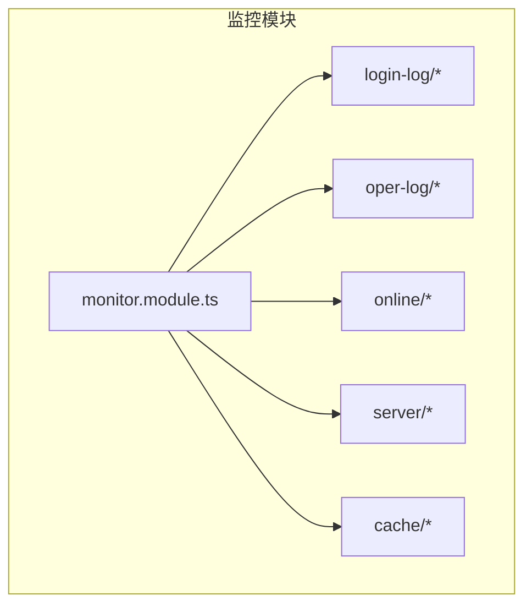
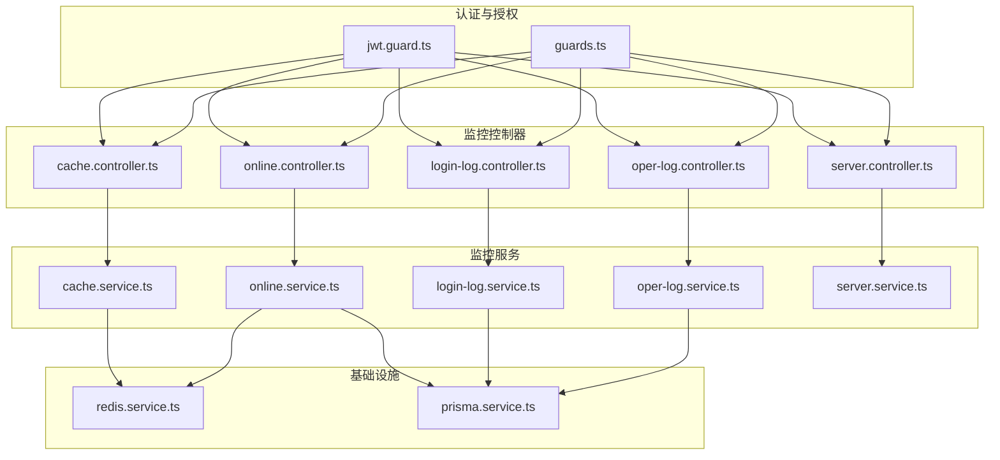
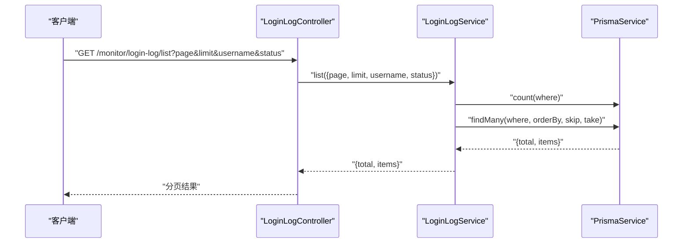
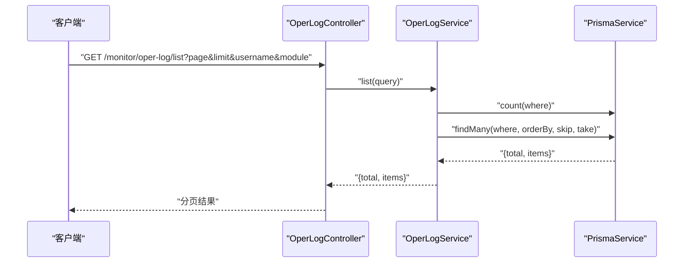
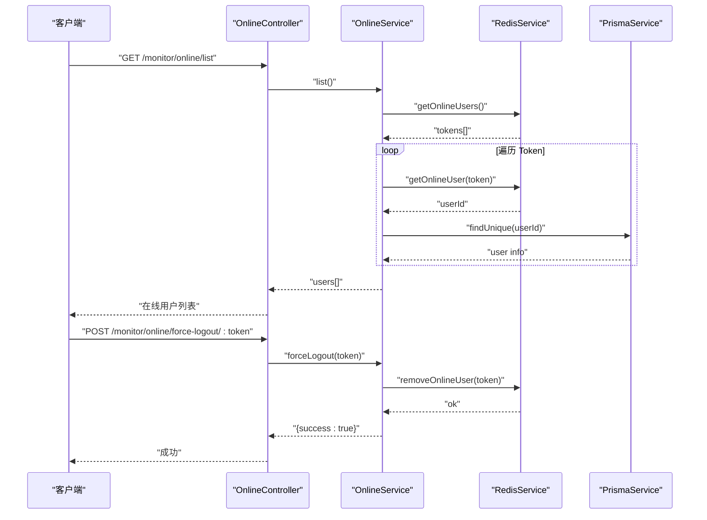
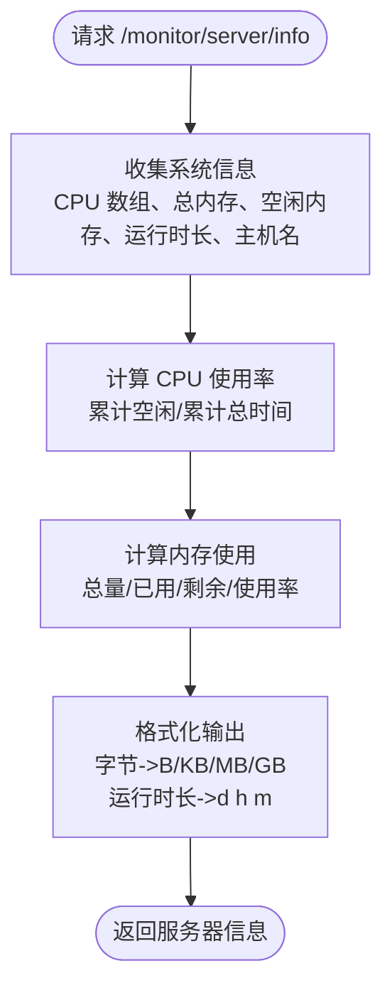
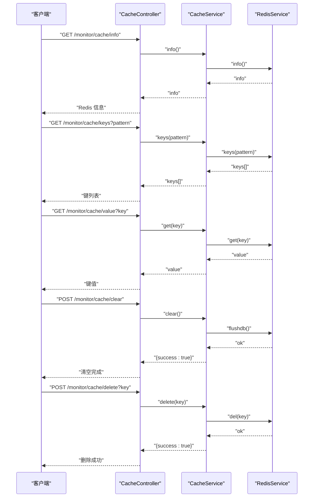
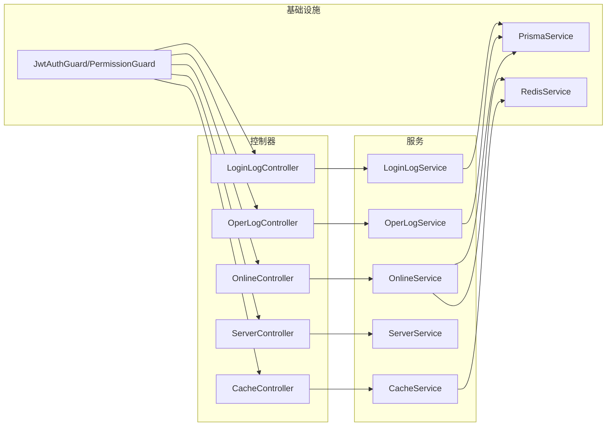

# 监控模块

<cite>
**本文引用的文件**
- [apps/backend/src/modules/monitor/monitor.module.ts](file://apps/backend/src/modules/monitor/monitor.module.ts)
- [apps/backend/src/modules/monitor/cache/cache.controller.ts](file://apps/backend/src/modules/monitor/cache/cache.controller.ts)
- [apps/backend/src/modules/monitor/cache/cache.service.ts](file://apps/backend/src/modules/monitor/cache/cache.service.ts)
- [apps/backend/src/modules/monitor/login-log/login-log.controller.ts](file://apps/backend/src/modules/monitor/login-log/login-log.controller.ts)
- [apps/backend/src/modules/monitor/login-log/login-log.service.ts](file://apps/backend/src/modules/monitor/login-log/login-log.service.ts)
- [apps/backend/src/modules/monitor/online/online.controller.ts](file://apps/backend/src/modules/monitor/online/online.controller.ts)
- [apps/backend/src/modules/monitor/online/online.service.ts](file://apps/backend/src/modules/monitor/online/online.service.ts)
- [apps/backend/src/modules/monitor/oper-log/oper-log.controller.ts](file://apps/backend/src/modules/monitor/oper-log/oper-log.controller.ts)
- [apps/backend/src/modules/monitor/oper-log/oper-log.service.ts](file://apps/backend/src/modules/monitor/oper-log/oper-log.service.ts)
- [apps/backend/src/modules/monitor/server/server.controller.ts](file://apps/backend/src/modules/monitor/server/server.controller.ts)
- [apps/backend/src/modules/monitor/server/server.service.ts](file://apps/backend/src/modules/monitor/server/server.service.ts)
- [apps/backend/src/cache/redis.service.ts](file://apps/backend/src/cache/redis.service.ts)
- [apps/backend/src/common/prisma.service.ts](file://apps/backend/src/common/prisma.service.ts)
- [apps/backend/src/auth/jwt.guard.ts](file://apps/backend/src/auth/jwt.guard.ts)
- [apps/backend/src/auth/guards.ts](file://apps/backend/src/auth/guards.ts)
- [apps/backend/src/common/oper-log.interceptor.ts](file://apps/backend/src/common/oper-log.interceptor.ts)
</cite>

## 目录
1. [简介](#简介)
2. [项目结构](#项目结构)
3. [核心组件](#核心组件)
4. [架构总览](#架构总览)
5. [详细组件分析](#详细组件分析)
6. [依赖关系分析](#依赖关系分析)
7. [性能考量](#性能考量)
8. [故障排查指南](#故障排查指南)
9. [结论](#结论)
10. [附录](#附录)

## 简介
本文件系统性梳理监控模块的设计与实现，覆盖以下能力：
- 登录日志管理：列表查询、详情查看、清理
- 操作日志管理：列表查询、详情查看、清理
- 在线用户监控：在线用户列表、强制下线
- 服务器性能监控：CPU、内存、主机信息、运行时长
- Redis 缓存监控：连接信息、键空间扫描、键值读取、清空与删除

同时说明各模块的权限控制、分页与查询条件、以及与 Redis 和数据库的交互方式。

## 项目结构
监控模块采用按功能域划分的目录组织，每个子域包含控制器、服务与模块文件，并在统一的 MonitorModule 中聚合导入。

图表来源
- [apps/backend/src/modules/monitor/monitor.module.ts:1-11](file://apps/backend/src/modules/monitor/monitor.module.ts#L1-L11)

章节来源
- [apps/backend/src/modules/monitor/monitor.module.ts:1-11](file://apps/backend/src/modules/monitor/monitor.module.ts#L1-L11)

## 核心组件
- 登录日志模块：提供登录日志的分页查询、按用户名与状态过滤、按主键查询、批量清理
- 操作日志模块：提供操作日志的分页查询、按用户名与模块名过滤、按主键查询、批量清理
- 在线用户模块：提供在线用户列表（基于 Redis Token 列表与用户表关联）、按 Token 强制下线
- 服务器模块：提供 CPU 使用率、内存使用量、系统信息、主机名与运行时长
- 缓存模块：提供 Redis 连接信息、键扫描、键值读取、清空数据库、删除指定键

章节来源
- [apps/backend/src/modules/monitor/login-log/login-log.controller.ts:1-45](file://apps/backend/src/modules/monitor/login-log/login-log.controller.ts#L1-L45)
- [apps/backend/src/modules/monitor/oper-log/oper-log.controller.ts:1-35](file://apps/backend/src/modules/monitor/oper-log/oper-log.controller.ts#L1-L35)
- [apps/backend/src/modules/monitor/online/online.controller.ts:1-28](file://apps/backend/src/modules/monitor/online/online.controller.ts#L1-L28)
- [apps/backend/src/modules/monitor/server/server.controller.ts:1-70](file://apps/backend/src/modules/monitor/server/server.controller.ts#L1-L70)
- [apps/backend/src/modules/monitor/cache/cache.controller.ts:1-50](file://apps/backend/src/modules/monitor/cache/cache.controller.ts#L1-L50)

## 架构总览
监控模块通过 NestJS 控制器暴露 REST 接口，服务层负责业务逻辑与数据访问；在线用户与缓存监控依赖 Redis；登录日志与操作日志依赖数据库。

图表来源
- [apps/backend/src/auth/jwt.guard.ts](file://apps/backend/src/auth/jwt.guard.ts)
- [apps/backend/src/auth/guards.ts](file://apps/backend/src/auth/guards.ts)
- [apps/backend/src/modules/monitor/cache/cache.controller.ts:1-50](file://apps/backend/src/modules/monitor/cache/cache.controller.ts#L1-L50)
- [apps/backend/src/modules/monitor/login-log/login-log.controller.ts:1-45](file://apps/backend/src/modules/monitor/login-log/login-log.controller.ts#L1-L45)
- [apps/backend/src/modules/monitor/online/online.controller.ts:1-28](file://apps/backend/src/modules/monitor/online/online.controller.ts#L1-L28)
- [apps/backend/src/modules/monitor/oper-log/oper-log.controller.ts:1-35](file://apps/backend/src/modules/monitor/oper-log/oper-log.controller.ts#L1-L35)
- [apps/backend/src/modules/monitor/server/server.controller.ts:1-70](file://apps/backend/src/modules/monitor/server/server.controller.ts#L1-L70)
- [apps/backend/src/modules/monitor/cache/cache.service.ts:1-29](file://apps/backend/src/modules/monitor/cache/cache.service.ts#L1-L29)
- [apps/backend/src/modules/monitor/login-log/login-log.service.ts:1-31](file://apps/backend/src/modules/monitor/login-log/login-log.service.ts#L1-L31)
- [apps/backend/src/modules/monitor/online/online.service.ts:1-31](file://apps/backend/src/modules/monitor/online/online.service.ts#L1-L31)
- [apps/backend/src/modules/monitor/oper-log/oper-log.service.ts:1-33](file://apps/backend/src/modules/monitor/oper-log/oper-log.service.ts#L1-L33)
- [apps/backend/src/modules/monitor/server/server.service.ts:1-4](file://apps/backend/src/modules/monitor/server/server.service.ts#L1-L4)
- [apps/backend/src/cache/redis.service.ts](file://apps/backend/src/cache/redis.service.ts)
- [apps/backend/src/common/prisma.service.ts](file://apps/backend/src/common/prisma.service.ts)

## 详细组件分析

### 登录日志管理
- 接口
  - GET /monitor/login-log/list：分页查询登录日志，支持按用户名模糊匹配与状态过滤
  - GET /monitor/login-log/:id：按主键查询登录日志
  - DELETE /monitor/login-log/clean：清空所有登录日志
- 查询参数
  - page：页码，默认 1
  - limit：每页条数，默认 10
  - username：用户名关键字
  - status：登录状态（数字）
- 数据模型
  - 返回 total 与 items 数组，items 为登录日志实体集合
- 权限
  - 需要权限标识 monitor:login:list
- 错误处理
  - 参数解析失败或数据库异常会由全局异常过滤器处理

图表来源
- [apps/backend/src/modules/monitor/login-log/login-log.controller.ts:13-28](file://apps/backend/src/modules/monitor/login-log/login-log.controller.ts#L13-L28)
- [apps/backend/src/modules/monitor/login-log/login-log.service.ts:8-21](file://apps/backend/src/modules/monitor/login-log/login-log.service.ts#L8-L21)
- [apps/backend/src/common/prisma.service.ts](file://apps/backend/src/common/prisma.service.ts)

章节来源
- [apps/backend/src/modules/monitor/login-log/login-log.controller.ts:1-45](file://apps/backend/src/modules/monitor/login-log/login-log.controller.ts#L1-L45)
- [apps/backend/src/modules/monitor/login-log/login-log.service.ts:1-31](file://apps/backend/src/modules/monitor/login-log/login-log.service.ts#L1-L31)

### 操作日志管理
- 接口
  - GET /monitor/oper-log/list：分页查询操作日志，支持按用户名与模块名过滤
  - GET /monitor/oper-log/:id：按主键查询操作日志
  - DELETE /monitor/oper-log/clean：清空所有操作日志
- 查询参数
  - page：页码，默认 1
  - limit：每页条数，默认 10
  - username：用户名关键字
  - module：模块名关键字
- 数据模型
  - 返回 total 与 items 数组，items 为操作日志实体集合
- 权限
  - 需要权限标识 monitor:oper:list

图表来源
- [apps/backend/src/modules/monitor/oper-log/oper-log.controller.ts:13-18](file://apps/backend/src/modules/monitor/oper-log/oper-log.controller.ts#L13-L18)
- [apps/backend/src/modules/monitor/oper-log/oper-log.service.ts:8-23](file://apps/backend/src/modules/monitor/oper-log/oper-log.service.ts#L8-L23)
- [apps/backend/src/common/prisma.service.ts](file://apps/backend/src/common/prisma.service.ts)

章节来源
- [apps/backend/src/modules/monitor/oper-log/oper-log.controller.ts:1-35](file://apps/backend/src/modules/monitor/oper-log/oper-log.controller.ts#L1-L35)
- [apps/backend/src/modules/monitor/oper-log/oper-log.service.ts:1-33](file://apps/backend/src/modules/monitor/oper-log/oper-log.service.ts#L1-L33)

### 在线用户监控
- 接口
  - GET /monitor/online/list：获取当前在线用户列表
  - POST /monitor/online/force-logout/:token：根据 Token 强制下线
- 实现要点
  - 从 Redis 获取在线 Token 列表
  - 逐个解析 Token 对应的用户 ID，并从数据库加载用户基本信息
  - 强制下线通过删除对应 Token 的在线记录实现
- 权限
  - 需要权限标识 monitor:online:list

图表来源
- [apps/backend/src/modules/monitor/online/online.controller.ts:13-26](file://apps/backend/src/modules/monitor/online/online.controller.ts#L13-L26)
- [apps/backend/src/modules/monitor/online/online.service.ts:9-30](file://apps/backend/src/modules/monitor/online/online.service.ts#L9-L30)
- [apps/backend/src/cache/redis.service.ts](file://apps/backend/src/cache/redis.service.ts)
- [apps/backend/src/common/prisma.service.ts](file://apps/backend/src/common/prisma.service.ts)

章节来源
- [apps/backend/src/modules/monitor/online/online.controller.ts:1-28](file://apps/backend/src/modules/monitor/online/online.controller.ts#L1-L28)
- [apps/backend/src/modules/monitor/online/online.service.ts:1-31](file://apps/backend/src/modules/monitor/online/online.service.ts#L1-L31)

### 服务器性能监控
- 接口
  - GET /monitor/server/info：获取服务器基础信息与资源使用情况
- 返回字段
  - os：操作系统与架构
  - cpuCount：CPU 核心数
  - cpuUsage：CPU 使用率百分比
  - mem：内存总量、已用、剩余与使用率
  - uptime：运行时长（天/小时/分钟）
  - hostname：主机名
- 计算逻辑
  - CPU 使用率：基于多核累计空闲时间与总时间计算
  - 内存：字节单位自动换算为 B/KB/MB/GB 并保留一位小数
  - 运行时长：秒转为天/小时/分钟格式

图表来源
- [apps/backend/src/modules/monitor/server/server.controller.ts:14-68](file://apps/backend/src/modules/monitor/server/server.controller.ts#L14-L68)

章节来源
- [apps/backend/src/modules/monitor/server/server.controller.ts:1-70](file://apps/backend/src/modules/monitor/server/server.controller.ts#L1-L70)
- [apps/backend/src/modules/monitor/server/server.service.ts:1-4](file://apps/backend/src/modules/monitor/server/server.service.ts#L1-L4)

### Redis 缓存监控
- 接口
  - GET /monitor/cache/info：获取 Redis 服务器信息
  - GET /monitor/cache/keys?pattern=...：按模式扫描键
  - GET /monitor/cache/value?key=...：读取指定键值
  - POST /monitor/cache/clear：清空当前数据库
  - POST /monitor/cache/delete?key=...：删除指定键
- 权限
  - 需要权限标识 monitor:cache:list
- 实现要点
  - 所有操作委托给 RedisService 完成
  - 清空与删除返回统一的成功标记

图表来源
- [apps/backend/src/modules/monitor/cache/cache.controller.ts:13-48](file://apps/backend/src/modules/monitor/cache/cache.controller.ts#L13-L48)
- [apps/backend/src/modules/monitor/cache/cache.service.ts:8-28](file://apps/backend/src/modules/monitor/cache/cache.service.ts#L8-L28)
- [apps/backend/src/cache/redis.service.ts](file://apps/backend/src/cache/redis.service.ts)

章节来源
- [apps/backend/src/modules/monitor/cache/cache.controller.ts:1-50](file://apps/backend/src/modules/monitor/cache/cache.controller.ts#L1-L50)
- [apps/backend/src/modules/monitor/cache/cache.service.ts:1-29](file://apps/backend/src/modules/monitor/cache/cache.service.ts#L1-L29)

## 依赖关系分析
- 控制器层
  - 统一使用 JWT 与权限守卫，确保接口安全
  - 每个控制器仅暴露业务所需端点，职责单一
- 服务层
  - LoginLogService、OperLogService 依赖 PrismaService 进行数据库访问
  - OnlineService 同时依赖 RedisService 与 PrismaService
  - CacheService 依赖 RedisService
- 外部依赖
  - Redis：用于在线用户状态存储与缓存键管理
  - 数据库：存储登录日志与操作日志
  - Node.js os 模块：用于服务器信息采集

图表来源
- [apps/backend/src/auth/jwt.guard.ts](file://apps/backend/src/auth/jwt.guard.ts)
- [apps/backend/src/auth/guards.ts](file://apps/backend/src/auth/guards.ts)
- [apps/backend/src/modules/monitor/login-log/login-log.controller.ts:1-45](file://apps/backend/src/modules/monitor/login-log/login-log.controller.ts#L1-L45)
- [apps/backend/src/modules/monitor/oper-log/oper-log.controller.ts:1-35](file://apps/backend/src/modules/monitor/oper-log/oper-log.controller.ts#L1-L35)
- [apps/backend/src/modules/monitor/online/online.controller.ts:1-28](file://apps/backend/src/modules/monitor/online/online.controller.ts#L1-L28)
- [apps/backend/src/modules/monitor/server/server.controller.ts:1-70](file://apps/backend/src/modules/monitor/server/server.controller.ts#L1-L70)
- [apps/backend/src/modules/monitor/cache/cache.controller.ts:1-50](file://apps/backend/src/modules/monitor/cache/cache.controller.ts#L1-L50)
- [apps/backend/src/modules/monitor/login-log/login-log.service.ts:1-31](file://apps/backend/src/modules/monitor/login-log/login-log.service.ts#L1-L31)
- [apps/backend/src/modules/monitor/oper-log/oper-log.service.ts:1-33](file://apps/backend/src/modules/monitor/oper-log/oper-log.service.ts#L1-L33)
- [apps/backend/src/modules/monitor/online/online.service.ts:1-31](file://apps/backend/src/modules/monitor/online/online.service.ts#L1-L31)
- [apps/backend/src/modules/monitor/server/server.service.ts:1-4](file://apps/backend/src/modules/monitor/server/server.service.ts#L1-L4)
- [apps/backend/src/modules/monitor/cache/cache.service.ts:1-29](file://apps/backend/src/modules/monitor/cache/cache.service.ts#L1-L29)
- [apps/backend/src/common/prisma.service.ts](file://apps/backend/src/common/prisma.service.ts)
- [apps/backend/src/cache/redis.service.ts](file://apps/backend/src/cache/redis.service.ts)

## 性能考量
- 分页查询
  - 登录日志与操作日志均采用 count + 分页查询，避免一次性拉取大量数据
  - 建议前端设置合理的 limit，避免过大数据量传输
- 在线用户列表
  - 逐 Token 查询用户信息存在 N+1 查询风险，建议在服务层合并批量查询以减少数据库往返
- Redis 操作
  - keys 扫描可能阻塞，建议配合 pattern 限制范围或使用 scan 迭代式扫描（如 RedisService 支持）
  - flushdb 与 del 为高危操作，建议增加二次确认与审计
- 服务器指标
  - CPU 使用率计算基于采样，建议在控制器层缓存短期结果以降低重复计算开销

## 故障排查指南
- 权限不足
  - 现象：接口返回 403
  - 处理：确认用户是否具备 monitor:* 权限
- Redis 不可用
  - 现象：/monitor/cache/* 与 /monitor/online/* 接口异常
  - 处理：检查 Redis 连接配置与网络连通性
- 数据库异常
  - 现象：登录日志、操作日志查询失败
  - 处理：检查 Prisma 连接池与数据库状态
- 分页参数错误
  - 现象：查询无结果或返回全量数据
  - 处理：确认 page 与 limit 是否为有效数字

章节来源
- [apps/backend/src/auth/jwt.guard.ts](file://apps/backend/src/auth/jwt.guard.ts)
- [apps/backend/src/auth/guards.ts](file://apps/backend/src/auth/guards.ts)
- [apps/backend/src/cache/redis.service.ts](file://apps/backend/src/cache/redis.service.ts)
- [apps/backend/src/common/prisma.service.ts](file://apps/backend/src/common/prisma.service.ts)

## 结论
监控模块以清晰的分层架构实现了登录日志、操作日志、在线用户、服务器与缓存的统一监控能力。通过权限守卫与最小暴露原则保障了安全性；通过分页与条件查询提升了可扩展性。建议后续优化在线用户批量查询与 Redis 扫描策略，进一步提升大规模场景下的性能与稳定性。

## 附录
- 日志拦截器
  - 操作日志记录通过全局拦截器实现，便于统一记录用户行为
- 可视化与导出
  - 当前后端未提供可视化图表与导出接口，可在前端页面集成图表库与导出工具实现

章节来源
- [apps/backend/src/common/oper-log.interceptor.ts](file://apps/backend/src/common/oper-log.interceptor.ts)