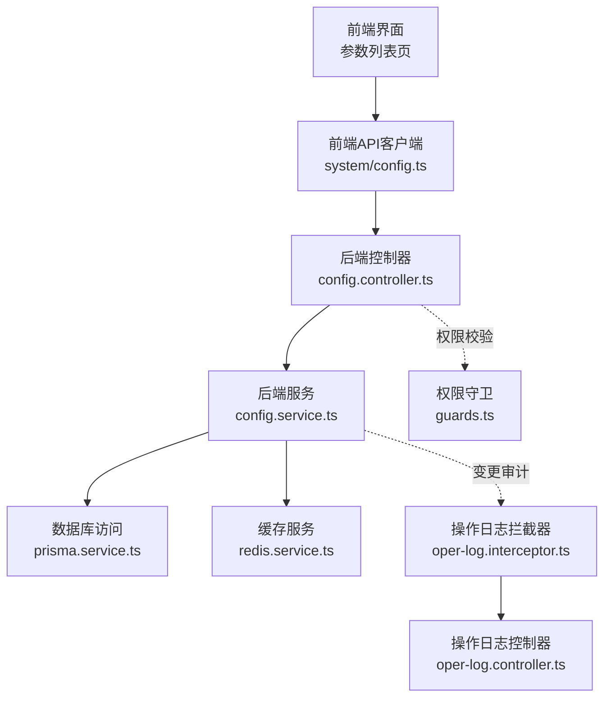
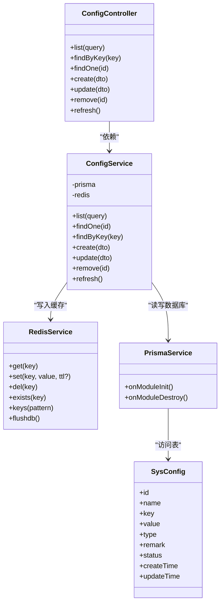
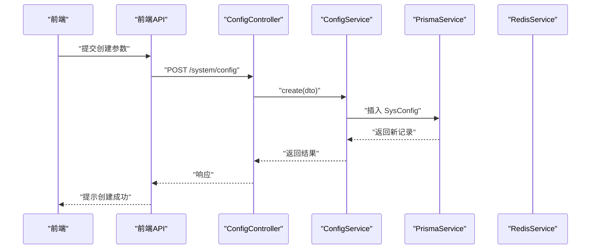
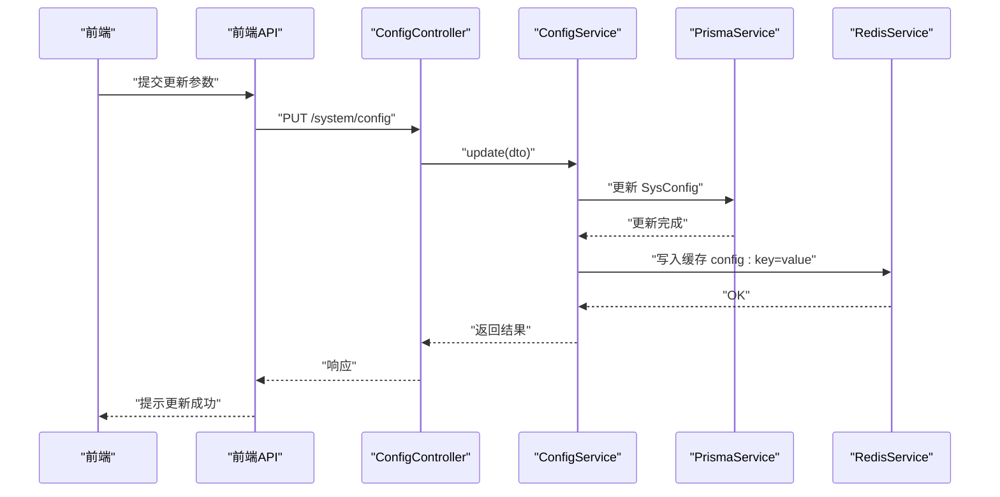
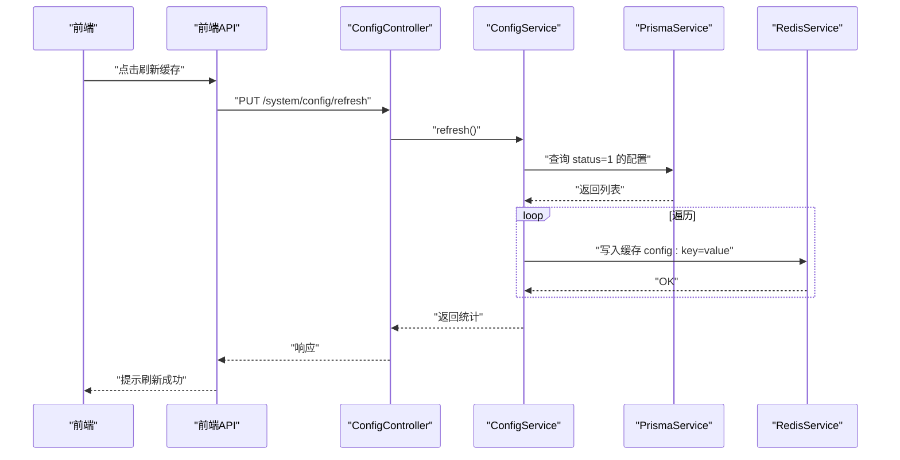
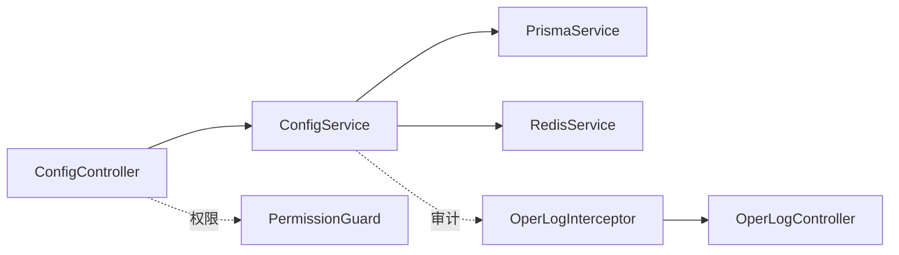

# 参数配置

<cite>
**本文引用的文件**
- [apps/backend/src/modules/system/config/config.controller.ts](file://apps/backend/src/modules/system/config/config.controller.ts)
- [apps/backend/src/modules/system/config/config.service.ts](file://apps/backend/src/modules/system/config/config.service.ts)
- [apps/backend/src/modules/system/config/dto/config.dto.ts](file://apps/backend/src/modules/system/config/dto/config.dto.ts)
- [apps/backend/src/modules/system/config/config.module.ts](file://apps/backend/src/modules/system/config/config.module.ts)
- [apps/backend/src/cache/redis.service.ts](file://apps/backend/src/cache/redis.service.ts)
- [apps/backend/src/auth/guards.ts](file://apps/backend/src/auth/guards.ts)
- [apps/backend/src/common/prisma.service.ts](file://apps/backend/src/common/prisma.service.ts)
- [apps/backend/prisma/schema.prisma](file://apps/backend/prisma/schema.prisma)
- [apps/backend/src/common/oper-log.interceptor.ts](file://apps/backend/src/common/oper-log.interceptor.ts)
- [apps/backend/src/modules/monitor/oper-log/oper-log.controller.ts](file://apps/backend/src/modules/monitor/oper-log/oper-log.controller.ts)
- [apps/backend/src/modules/monitor/oper-log/oper-log.module.ts](file://apps/backend/src/modules/monitor/oper-log/oper-log.module.ts)
- [apps/vben-admin/apps/web-antd/src/api/system/config.ts](file://apps/vben-admin/apps/web-antd/src/api/system/config.ts)
- [apps/vben-admin/apps/web-antd/src/views/system/config/index.vue](file://apps/vben-admin/apps/web-antd/src/views/system/config/index.vue)
- [scripts/seed.sql](file://scripts/seed.sql)
</cite>

## 目录
1. [简介](#简介)
2. [项目结构](#项目结构)
3. [核心组件](#核心组件)
4. [架构总览](#架构总览)
5. [详细组件分析](#详细组件分析)
6. [依赖关系分析](#依赖关系分析)
7. [性能考量](#性能考量)
8. [故障排查指南](#故障排查指南)
9. [结论](#结论)
10. [附录](#附录)

## 简介
本文件系统性梳理“参数配置”模块的设计与实现，覆盖参数的增删改查（CRUD）API、数据模型、缓存与持久化机制、权限控制、以及可扩展的业务场景（如配置热生效、版本管理、导入导出、变更审计等）。文档面向开发者与运维人员，既提供代码级分析，也给出可视化图示与实操建议。

## 项目结构
参数配置模块位于后端 NestJS 应用的系统模块下，采用标准的分层设计：控制器负责路由与鉴权，服务封装业务逻辑，DTO 校验请求参数，Prisma 访问数据库，Redis 提供运行时缓存，前端通过 API 客户端调用后端接口。

**图表来源**
- [apps/backend/src/modules/system/config/config.controller.ts:1-63](file://apps/backend/src/modules/system/config/config.controller.ts#L1-L63)
- [apps/backend/src/modules/system/config/config.service.ts:1-56](file://apps/backend/src/modules/system/config/config.service.ts#L1-L56)
- [apps/backend/src/cache/redis.service.ts:1-128](file://apps/backend/src/cache/redis.service.ts#L1-L128)
- [apps/backend/src/auth/guards.ts:1-51](file://apps/backend/src/auth/guards.ts#L1-L51)
- [apps/backend/src/common/prisma.service.ts:1-22](file://apps/backend/src/common/prisma.service.ts#L1-L22)
- [apps/backend/src/common/oper-log.interceptor.ts:1-79](file://apps/backend/src/common/oper-log.interceptor.ts#L1-L79)
- [apps/backend/src/modules/monitor/oper-log/oper-log.controller.ts:1-34](file://apps/backend/src/modules/monitor/oper-log/oper-log.controller.ts#L1-L34)
- [apps/vben-admin/apps/web-antd/src/api/system/config.ts:1-46](file://apps/vben-admin/apps/web-antd/src/api/system/config.ts#L1-L46)
- [apps/vben-admin/apps/web-antd/src/views/system/config/index.vue:1-123](file://apps/vben-admin/apps/web-antd/src/views/system/config/index.vue#L1-L123)

**章节来源**
- [apps/backend/src/modules/system/config/config.controller.ts:1-63](file://apps/backend/src/modules/system/config/config.controller.ts#L1-L63)
- [apps/backend/src/modules/system/config/config.service.ts:1-56](file://apps/backend/src/modules/system/config/config.service.ts#L1-L56)
- [apps/backend/src/modules/system/config/config.module.ts:1-10](file://apps/backend/src/modules/system/config/config.module.ts#L1-L10)
- [apps/backend/src/cache/redis.service.ts:1-128](file://apps/backend/src/cache/redis.service.ts#L1-L128)
- [apps/backend/src/auth/guards.ts:1-51](file://apps/backend/src/auth/guards.ts#L1-L51)
- [apps/backend/src/common/prisma.service.ts:1-22](file://apps/backend/src/common/prisma.service.ts#L1-L22)
- [apps/backend/src/common/oper-log.interceptor.ts:1-79](file://apps/backend/src/common/oper-log.interceptor.ts#L1-L79)
- [apps/backend/src/modules/monitor/oper-log/oper-log.controller.ts:1-34](file://apps/backend/src/modules/monitor/oper-log/oper-log.controller.ts#L1-L34)
- [apps/vben-admin/apps/web-antd/src/api/system/config.ts:1-46](file://apps/vben-admin/apps/web-antd/src/api/system/config.ts#L1-L46)
- [apps/vben-admin/apps/web-antd/src/views/system/config/index.vue:1-123](file://apps/vben-admin/apps/web-antd/src/views/system/config/index.vue#L1-L123)

## 核心组件
- 控制器（ConfigController）
  - 提供参数列表、按键查询、按ID查询、创建、更新、删除、刷新缓存等接口。
  - 使用 JWT 与权限守卫，确保接口访问安全。
- 服务（ConfigService）
  - 实现 CRUD 与缓存同步；更新时写入 Redis；刷新时批量加载有效配置到缓存。
- DTO（CreateConfigDto / UpdateConfigDto / QueryConfigDto）
  - 校验请求参数，保证数据一致性。
- 缓存（RedisService）
  - 提供通用的键值读写、序列化、TTL 等能力，参数模块使用统一命名空间写入。
- 数据库（PrismaService + schema.prisma）
  - SysConfig 表承载参数元数据与值，支持索引与唯一键约束。
- 前端（API 客户端 + 列表页）
  - 提供参数的增删改查与缓存刷新交互。

**章节来源**
- [apps/backend/src/modules/system/config/config.controller.ts:1-63](file://apps/backend/src/modules/system/config/config.controller.ts#L1-L63)
- [apps/backend/src/modules/system/config/config.service.ts:1-56](file://apps/backend/src/modules/system/config/config.service.ts#L1-L56)
- [apps/backend/src/modules/system/config/dto/config.dto.ts:1-28](file://apps/backend/src/modules/system/config/dto/config.dto.ts#L1-L28)
- [apps/backend/src/cache/redis.service.ts:1-128](file://apps/backend/src/cache/redis.service.ts#L1-L128)
- [apps/backend/prisma/schema.prisma:152-165](file://apps/backend/prisma/schema.prisma#L152-L165)
- [apps/vben-admin/apps/web-antd/src/api/system/config.ts:1-46](file://apps/vben-admin/apps/web-antd/src/api/system/config.ts#L1-L46)
- [apps/vben-admin/apps/web-antd/src/views/system/config/index.vue:1-123](file://apps/vben-admin/apps/web-antd/src/views/system/config/index.vue#L1-L123)

## 架构总览
参数配置模块遵循“控制器-服务-数据源”的分层架构，结合 Redis 实现运行时参数的快速读取与热生效。

**图表来源**
- [apps/backend/src/modules/system/config/config.controller.ts:1-63](file://apps/backend/src/modules/system/config/config.controller.ts#L1-L63)
- [apps/backend/src/modules/system/config/config.service.ts:1-56](file://apps/backend/src/modules/system/config/config.service.ts#L1-L56)
- [apps/backend/src/cache/redis.service.ts:1-128](file://apps/backend/src/cache/redis.service.ts#L1-L128)
- [apps/backend/src/common/prisma.service.ts:1-22](file://apps/backend/src/common/prisma.service.ts#L1-L22)
- [apps/backend/prisma/schema.prisma:152-165](file://apps/backend/prisma/schema.prisma#L152-L165)

## 详细组件分析

### 数据模型与字段定义
- SysConfig 表字段
  - id：主键，自增
  - name：参数名称
  - key：参数键名（唯一索引）
  - value：参数值（文本）
  - type：参数类型（默认 string）
  - remark：备注说明
  - status：状态（1=启用，0=停用）
  - createTime / updateTime：时间戳
- 初始化数据
  - 种子脚本中包含大量系统参数示例，涵盖系统名称、Logo、版权、登录验证码、文件上传策略等。

**章节来源**
- [apps/backend/prisma/schema.prisma:152-165](file://apps/backend/prisma/schema.prisma#L152-L165)
- [scripts/seed.sql:137-166](file://scripts/seed.sql#L137-L166)

### API 设计与权限控制
- 接口清单
  - GET /system/config/list：分页查询
  - GET /system/config/key/:key：按键查询
  - GET /system/config/:id：按ID查询
  - POST /system/config：创建
  - PUT /system/config：更新
  - DELETE /system/config/:id：删除
  - PUT /system/config/refresh：刷新缓存
- 权限标识
  - 所有接口均要求 system:config:list 权限，由 PermissionGuard 校验。
- DTO 校验
  - CreateConfigDto：name/key/value 必填，type/remark 可选，status 默认启用。
  - UpdateConfigDto：id 必填，其余可选。
  - QueryConfigDto：name/key/status 可选。

**章节来源**
- [apps/backend/src/modules/system/config/config.controller.ts:1-63](file://apps/backend/src/modules/system/config/config.controller.ts#L1-L63)
- [apps/backend/src/modules/system/config/dto/config.dto.ts:1-28](file://apps/backend/src/modules/system/config/dto/config.dto.ts#L1-L28)
- [apps/backend/src/auth/guards.ts:1-51](file://apps/backend/src/auth/guards.ts#L1-L51)

### 处理流程与时序图

#### 创建参数流程

**图表来源**
- [apps/backend/src/modules/system/config/config.controller.ts:35-40](file://apps/backend/src/modules/system/config/config.controller.ts#L35-L40)
- [apps/backend/src/modules/system/config/config.service.ts:31-35](file://apps/backend/src/modules/system/config/config.service.ts#L31-L35)
- [apps/backend/src/common/prisma.service.ts:1-22](file://apps/backend/src/common/prisma.service.ts#L1-L22)

#### 更新参数并热生效流程

**图表来源**
- [apps/backend/src/modules/system/config/config.controller.ts:42-47](file://apps/backend/src/modules/system/config/config.controller.ts#L42-L47)
- [apps/backend/src/modules/system/config/config.service.ts:37-42](file://apps/backend/src/modules/system/config/config.service.ts#L37-L42)
- [apps/backend/src/cache/redis.service.ts:39-47](file://apps/backend/src/cache/redis.service.ts#L39-L47)

#### 刷新缓存流程

**图表来源**
- [apps/backend/src/modules/system/config/config.controller.ts:56-61](file://apps/backend/src/modules/system/config/config.controller.ts#L56-L61)
- [apps/backend/src/modules/system/config/config.service.ts:49-55](file://apps/backend/src/modules/system/config/config.service.ts#L49-L55)
- [apps/backend/src/cache/redis.service.ts:39-47](file://apps/backend/src/cache/redis.service.ts#L39-L47)

### 查询与过滤逻辑
- 支持按 name、key、status 过滤，模糊匹配 name 与 key。
- 列表按 id 升序排序。

**章节来源**
- [apps/backend/src/modules/system/config/config.service.ts:10-17](file://apps/backend/src/modules/system/config/config.service.ts#L10-L17)

### 错误处理与边界条件
- 未找到参数时抛出异常，避免静默失败。
- 更新参数时若不存在对应记录则抛异常，防止误操作。
- 删除参数直接执行删除，返回成功标记。

**章节来源**
- [apps/backend/src/modules/system/config/config.service.ts:19-29](file://apps/backend/src/modules/system/config/config.service.ts#L19-L29)
- [apps/backend/src/modules/system/config/config.service.ts:37-47](file://apps/backend/src/modules/system/config/config.service.ts#L37-L47)

### 缓存与持久化机制
- 写入策略
  - 创建：写入数据库，不强制写缓存（可按需扩展）。
  - 更新：写入数据库后，同步写入 Redis，键格式为 config:{key}。
  - 刷新：遍历 status=1 的配置，批量写入 Redis。
- 读取策略
  - 当前模块未提供统一的“读取参数”方法，通常由业务模块自行从 Redis 读取；若需要统一入口，可在服务层增加读取方法并优先命中缓存。
- TTL 与序列化
  - RedisService 支持字符串与 JSON 自动序列化，可按需设置 TTL。

**章节来源**
- [apps/backend/src/modules/system/config/config.service.ts:41-55](file://apps/backend/src/modules/system/config/config.service.ts#L41-L55)
- [apps/backend/src/cache/redis.service.ts:39-47](file://apps/backend/src/cache/redis.service.ts#L39-L47)

### 参数类型与校验
- 类型字段 type 支持 string/number/boolean 等，前端在页面中提供类型选择。
- DTO 层对必填字段进行校验，避免非法数据进入数据库。

**章节来源**
- [apps/backend/src/modules/system/config/dto/config.dto.ts:5-21](file://apps/backend/src/modules/system/config/dto/config.dto.ts#L5-L21)
- [apps/vben-admin/apps/web-antd/src/views/system/config/index.vue:68-70](file://apps/vben-admin/apps/web-antd/src/views/system/config/index.vue#L68-L70)

### 权限与审计
- 权限控制
  - 所有接口均使用 RequirePermission('system:config:list')，确保只有具备相应权限的用户才能操作。
- 操作审计
  - 通过 OperLogInterceptor 记录非 GET 请求的操作日志，包含请求参数、响应结果、错误信息、耗时、IP 等，便于追踪参数变更历史。

**章节来源**
- [apps/backend/src/auth/guards.ts:16-17](file://apps/backend/src/auth/guards.ts#L16-L17)
- [apps/backend/src/common/oper-log.interceptor.ts:15-79](file://apps/backend/src/common/oper-log.interceptor.ts#L15-L79)
- [apps/backend/src/modules/monitor/oper-log/oper-log.controller.ts:1-34](file://apps/backend/src/modules/monitor/oper-log/oper-log.controller.ts#L1-L34)

### 前端交互与页面功能
- 列表页提供查询、新增、编辑、删除、刷新缓存等操作。
- 新增/编辑弹窗支持参数键名、键值、备注、类型、状态等字段。
- 分页与表格展示，支持按 key/name 过滤。

**章节来源**
- [apps/vben-admin/apps/web-antd/src/api/system/config.ts:1-46](file://apps/vben-admin/apps/web-antd/src/api/system/config.ts#L1-L46)
- [apps/vben-admin/apps/web-antd/src/views/system/config/index.vue:1-123](file://apps/vben-admin/apps/web-antd/src/views/system/config/index.vue#L1-L123)

## 依赖关系分析
- 组件耦合
  - 控制器仅依赖服务接口，低耦合高内聚。
  - 服务依赖 Prisma 与 Redis，职责清晰。
- 外部依赖
  - Prisma 作为 ORM，负责数据库连接与事务。
  - Redis 作为缓存中间件，提供高性能读取。
- 循环依赖
  - 模块内无循环依赖迹象。

**图表来源**
- [apps/backend/src/modules/system/config/config.controller.ts:1-63](file://apps/backend/src/modules/system/config/config.controller.ts#L1-L63)
- [apps/backend/src/modules/system/config/config.service.ts:1-56](file://apps/backend/src/modules/system/config/config.service.ts#L1-L56)
- [apps/backend/src/auth/guards.ts:36-50](file://apps/backend/src/auth/guards.ts#L36-L50)
- [apps/backend/src/common/oper-log.interceptor.ts:1-79](file://apps/backend/src/common/oper-log.interceptor.ts#L1-L79)
- [apps/backend/src/modules/monitor/oper-log/oper-log.controller.ts:1-34](file://apps/backend/src/modules/monitor/oper-log/oper-log.controller.ts#L1-L34)

**章节来源**
- [apps/backend/src/modules/system/config/config.module.ts:1-10](file://apps/backend/src/modules/system/config/config.module.ts#L1-L10)
- [apps/backend/src/modules/system/config/config.controller.ts:1-63](file://apps/backend/src/modules/system/config/config.controller.ts#L1-L63)
- [apps/backend/src/modules/system/config/config.service.ts:1-56](file://apps/backend/src/modules/system/config/config.service.ts#L1-L56)

## 性能考量
- 缓存命中率
  - 将高频读取的参数放入 Redis，减少数据库压力。
- 批量刷新
  - 刷新缓存采用批量写入，避免逐条网络往返。
- 查询优化
  - SysConfig.key 建有唯一索引，查询效率高；建议在 name、status 上建立复合索引以提升过滤性能。
- 序列化成本
  - RedisService 对非字符串自动 JSON 序列化，注意大对象带来的序列化/反序列化开销。

[本节为通用性能建议，无需特定文件引用]

## 故障排查指南
- 无法访问参数接口
  - 检查用户是否具备 system:config:list 权限。
- 更新后参数未生效
  - 确认 Redis 是否连通，检查 config:key 是否写入成功。
- 查询不到参数
  - 核对 key 是否正确，确认 status 是否为启用。
- 操作日志缺失
  - 确认请求方法非 GET，且未被拦截器排除；检查数据库连接与日志表是否存在。

**章节来源**
- [apps/backend/src/auth/guards.ts:36-50](file://apps/backend/src/auth/guards.ts#L36-L50)
- [apps/backend/src/cache/redis.service.ts:16-23](file://apps/backend/src/cache/redis.service.ts#L16-L23)
- [apps/backend/src/common/oper-log.interceptor.ts:63-79](file://apps/backend/src/common/oper-log.interceptor.ts#L63-L79)

## 结论
参数配置模块以清晰的分层设计实现了参数的全生命周期管理：从创建、更新到删除，再到缓存与持久化的同步与刷新。配合权限控制与操作审计，满足生产环境的安全与可追溯需求。后续可在统一读取入口、参数版本管理、导入导出与加密存储等方面进一步增强。

[本节为总结性内容，无需特定文件引用]

## 附录

### API 定义概览
- GET /system/config/list：分页查询，支持 name/key/status 过滤
- GET /system/config/key/:key：按键查询
- GET /system/config/:id：按ID查询
- POST /system/config：创建参数
- PUT /system/config：更新参数
- DELETE /system/config/:id：删除参数
- PUT /system/config/refresh：刷新缓存

**章节来源**
- [apps/backend/src/modules/system/config/config.controller.ts:14-61](file://apps/backend/src/modules/system/config/config.controller.ts#L14-L61)

### 参数数据模型（字段说明）
- id：主键
- name：参数名称
- key：参数键名（唯一）
- value：参数值
- type：参数类型（默认 string）
- remark：备注
- status：状态（1=启用，0=停用）
- createTime/updateTime：时间戳

**章节来源**
- [apps/backend/prisma/schema.prisma:152-165](file://apps/backend/prisma/schema.prisma#L152-L165)

### 业务场景示例
- 系统配置项管理
  - 通过参数键名区分不同配置域（如 sys_*），便于集中管理。
- 业务参数调整
  - 动态调整开关类参数（如登录验证码、文件上传大小），更新后立即写入缓存，实现热生效。
- 配置备份与恢复
  - 通过导出 SysConfig 表数据实现备份；恢复时按 key upsert，避免重复键冲突。
- 参数变更审计
  - 结合操作日志模块，记录每次变更的用户、参数、值、时间与错误信息，形成变更轨迹。

**章节来源**
- [apps/backend/src/common/oper-log.interceptor.ts:30-61](file://apps/backend/src/common/oper-log.interceptor.ts#L30-L61)
- [apps/backend/src/modules/monitor/oper-log/oper-log.controller.ts:13-33](file://apps/backend/src/modules/monitor/oper-log/oper-log.controller.ts#L13-L33)

### 可扩展建议
- 参数版本管理
  - 引入版本号字段或历史表，记录每次变更的版本与回滚点。
- 参数加密存储
  - 对敏感参数（如密钥）在入库前加密，读取时解密；或引入密钥管理服务（KMS）。
- 参数导入导出
  - 提供 CSV/JSON 导入导出接口，支持批量更新与校验。
- 统一读取入口
  - 在服务层增加 get(key) 方法，优先从 Redis 读取，未命中再回源数据库，并支持类型转换。

[本节为扩展建议，无需特定文件引用]