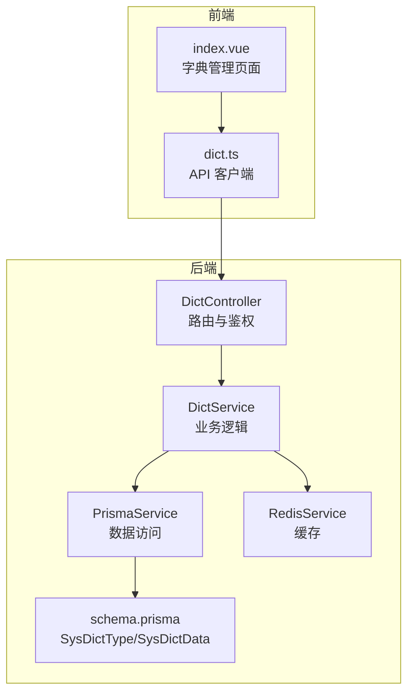
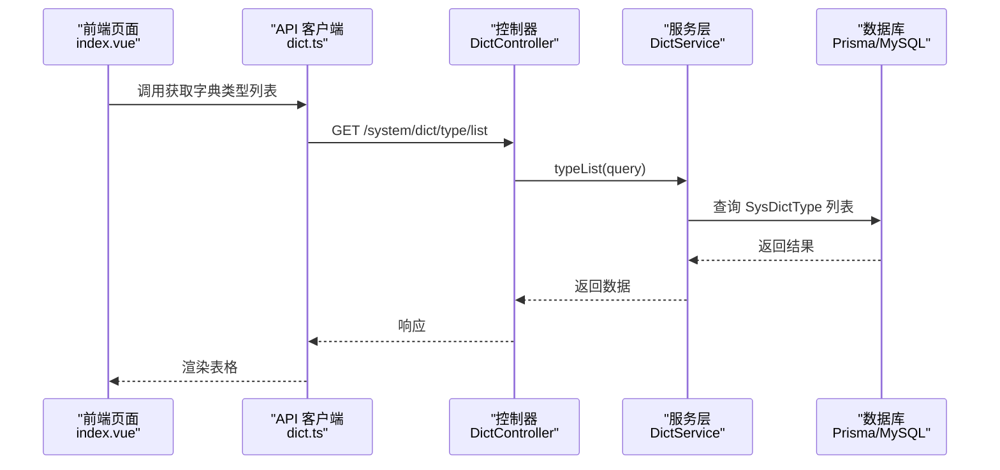
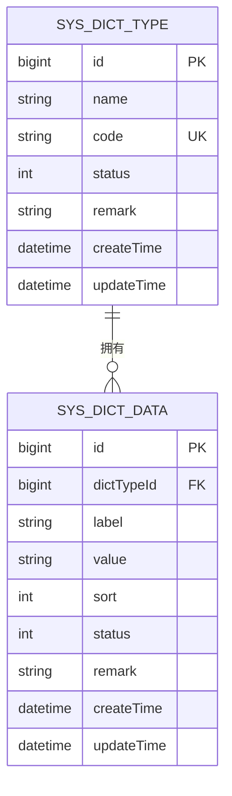
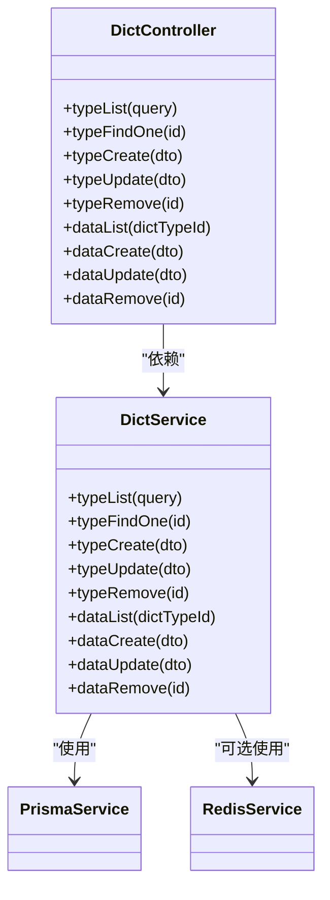

# 字典管理

<cite>
**本文引用的文件**
- [apps/backend/src/modules/system/dict/dict.controller.ts](file://apps/backend/src/modules/system/dict/dict.controller.ts)
- [apps/backend/src/modules/system/dict/dict.service.ts](file://apps/backend/src/modules/system/dict/dict.service.ts)
- [apps/backend/src/modules/system/dict/dict.module.ts](file://apps/backend/src/modules/system/dict/dict.module.ts)
- [apps/backend/src/modules/system/dict/dto/dict.dto.ts](file://apps/backend/src/modules/system/dict/dto/dict.dto.ts)
- [apps/backend/prisma/schema.prisma](file://apps/backend/prisma/schema.prisma)
- [apps/backend/src/cache/redis.service.ts](file://apps/backend/src/cache/redis.service.ts)
- [apps/vben-admin/apps/web-antd/src/api/system/dict.ts](file://apps/vben-admin/apps/web-antd/src/api/system/dict.ts)
- [apps/vben-admin/apps/web-antd/src/views/system/dict/index.vue](file://apps/vben-admin/apps/web-antd/src/views/system/dict/index.vue)
- [apps/vben-admin/apps/web-antd/src/locales/index.ts](file://apps/vben-admin/apps/web-antd/src/locales/index.ts)
</cite>

## 目录
1. [简介](#简介)
2. [项目结构](#项目结构)
3. [核心组件](#核心组件)
4. [架构总览](#架构总览)
5. [详细组件分析](#详细组件分析)
6. [依赖关系分析](#依赖关系分析)
7. [性能考量](#性能考量)
8. [故障排查指南](#故障排查指南)
9. [结论](#结论)
10. [附录](#附录)

## 简介
本模块提供系统级“字典管理”能力，覆盖“字典类型”与“字典数据”的全生命周期管理，包括查询、创建、更新、删除等 CRUD 操作；同时支持按类型维度组织字典项，以标签与键值对形式存储，配合排序号与状态字段实现灵活的展示与筛选。后端采用 Prisma 访问 MySQL 数据库，前端通过统一请求客户端调用后端接口，实现可视化管理界面。

## 项目结构
字典管理模块在后端由控制器、服务层与 DTO 组成，在前端由 API 客户端与视图组件构成；数据库模型由 Prisma 定义，包含字典类型与字典数据两张表及关联关系。

**图表来源**
- [apps/backend/src/modules/system/dict/dict.controller.ts:1-81](file://apps/backend/src/modules/system/dict/dict.controller.ts#L1-L81)
- [apps/backend/src/modules/system/dict/dict.service.ts:1-59](file://apps/backend/src/modules/system/dict/dict.service.ts#L1-L59)
- [apps/backend/prisma/schema.prisma:118-150](file://apps/backend/prisma/schema.prisma#L118-L150)
- [apps/backend/src/cache/redis.service.ts:1-128](file://apps/backend/src/cache/redis.service.ts#L1-L128)
- [apps/vben-admin/apps/web-antd/src/api/system/dict.ts:1-76](file://apps/vben-admin/apps/web-antd/src/api/system/dict.ts#L1-L76)
- [apps/vben-admin/apps/web-antd/src/views/system/dict/index.vue:1-161](file://apps/vben-admin/apps/web-antd/src/views/system/dict/index.vue#L1-L161)

**章节来源**
- [apps/backend/src/modules/system/dict/dict.controller.ts:1-81](file://apps/backend/src/modules/system/dict/dict.controller.ts#L1-L81)
- [apps/backend/src/modules/system/dict/dict.service.ts:1-59](file://apps/backend/src/modules/system/dict/dict.service.ts#L1-L59)
- [apps/backend/src/modules/system/dict/dict.module.ts:1-10](file://apps/backend/src/modules/system/dict/dict.module.ts#L1-L10)
- [apps/backend/src/modules/system/dict/dto/dict.dto.ts:1-42](file://apps/backend/src/modules/system/dict/dto/dict.dto.ts#L1-L42)
- [apps/backend/prisma/schema.prisma:118-150](file://apps/backend/prisma/schema.prisma#L118-L150)
- [apps/vben-admin/apps/web-antd/src/api/system/dict.ts:1-76](file://apps/vben-admin/apps/web-antd/src/api/system/dict.ts#L1-L76)
- [apps/vben-admin/apps/web-antd/src/views/system/dict/index.vue:1-161](file://apps/vben-admin/apps/web-antd/src/views/system/dict/index.vue#L1-L161)

## 核心组件
- 控制器：提供 /system/dict 类型与数据的 REST 接口，统一鉴权与权限校验。
- 服务层：封装字典类型与数据的查询、创建、更新、删除逻辑，负责数据一致性与约束检查。
- DTO：定义请求参数与响应结构，确保前后端契约一致。
- 前端 API 客户端：封装字典类型与数据的 HTTP 请求方法。
- 前端视图：提供字典类型与数据的表格展示、分页、增删改操作弹窗。
- 数据模型：Prisma 定义的 SysDictType 与 SysDictData，含索引与外键关系。

**章节来源**
- [apps/backend/src/modules/system/dict/dict.controller.ts:1-81](file://apps/backend/src/modules/system/dict/dict.controller.ts#L1-L81)
- [apps/backend/src/modules/system/dict/dict.service.ts:1-59](file://apps/backend/src/modules/system/dict/dict.service.ts#L1-L59)
- [apps/backend/src/modules/system/dict/dto/dict.dto.ts:1-42](file://apps/backend/src/modules/system/dict/dto/dict.dto.ts#L1-L42)
- [apps/vben-admin/apps/web-antd/src/api/system/dict.ts:1-76](file://apps/vben-admin/apps/web-antd/src/api/system/dict.ts#L1-L76)
- [apps/vben-admin/apps/web-antd/src/views/system/dict/index.vue:1-161](file://apps/vben-admin/apps/web-antd/src/views/system/dict/index.vue#L1-L161)
- [apps/backend/prisma/schema.prisma:118-150](file://apps/backend/prisma/schema.prisma#L118-L150)

## 架构总览
后端采用 NestJS 模块化结构，字典模块通过控制器暴露 API，服务层通过 Prisma 访问数据库；前端通过统一请求客户端调用后端接口，视图组件负责用户交互与数据展示。

**图表来源**
- [apps/vben-admin/apps/web-antd/src/views/system/dict/index.vue:43-50](file://apps/vben-admin/apps/web-antd/src/views/system/dict/index.vue#L43-L50)
- [apps/vben-admin/apps/web-antd/src/api/system/dict.ts:40-42](file://apps/vben-admin/apps/web-antd/src/api/system/dict.ts#L40-L42)
- [apps/backend/src/modules/system/dict/dict.controller.ts:15-20](file://apps/backend/src/modules/system/dict/dict.controller.ts#L15-L20)
- [apps/backend/src/modules/system/dict/dict.service.ts:9-16](file://apps/backend/src/modules/system/dict/dict.service.ts#L9-L16)
- [apps/backend/prisma/schema.prisma:118-131](file://apps/backend/prisma/schema.prisma#L118-L131)

## 详细组件分析

### 数据模型与关系
- SysDictType（字典类型）：包含名称、编码、状态、备注等字段，主键自增，编码唯一。
- SysDictData（字典数据）：包含所属类型 ID、标签、键值、排序号、状态、备注等字段，主键自增。
- 关系：SysDictType 与 SysDictData 为一对多关系，SysDictData.dictTypeId 外键关联 SysDictType.id。

**图表来源**
- [apps/backend/prisma/schema.prisma:118-150](file://apps/backend/prisma/schema.prisma#L118-L150)

**章节来源**
- [apps/backend/prisma/schema.prisma:118-150](file://apps/backend/prisma/schema.prisma#L118-L150)

### 控制器与路由
- 类型接口
  - GET /system/dict/type/list：分页查询字典类型
  - GET /system/dict/type/:id：按 ID 获取类型详情（含该类型下的所有数据项）
  - POST /system/dict/type：创建字典类型
  - PUT /system/dict/type：更新字典类型
  - DELETE /system/dict/type/:id：删除字典类型（若存在数据则拒绝删除）
- 数据接口
  - GET /system/dict/data/list：按类型 ID 查询字典数据列表
  - POST /system/dict/data：创建字典数据
  - PUT /system/dict/data：更新字典数据
  - DELETE /system/dict/data/:id：删除字典数据

鉴权与权限控制：所有路由均使用 JWT 与权限守卫，且明确标注所需权限标识。

**章节来源**
- [apps/backend/src/modules/system/dict/dict.controller.ts:1-81](file://apps/backend/src/modules/system/dict/dict.controller.ts#L1-L81)

### 服务层逻辑
- 类型管理
  - typeList：根据名称、编码、状态过滤，按 ID 升序返回
  - typeFindOne：按 ID 查询类型，包含其所有数据项并按排序号升序
  - typeCreate：创建类型，默认启用状态
  - typeUpdate：更新类型名称、状态、备注
  - typeRemove：若该类型下存在数据则拒绝删除，否则删除类型
- 数据管理
  - dataList：按类型 ID 查询数据项，按排序号升序
  - dataCreate：创建数据项，默认启用状态与排序号
  - dataUpdate：更新标签、键值、排序号、状态、备注
  - dataRemove：删除数据项

异常处理：未找到类型或数据时抛出“未找到”异常；删除类型前进行存在性检查。

**章节来源**
- [apps/backend/src/modules/system/dict/dict.service.ts:1-59](file://apps/backend/src/modules/system/dict/dict.service.ts#L1-L59)

### DTO 定义
- 类型相关
  - CreateDictTypeDto：名称、编码、可选状态、可选备注
  - UpdateDictTypeDto：ID、可选名称、可选状态、可选备注
  - QueryDictTypeDto：可选名称、可选编码、可选状态
- 数据相关
  - CreateDictDataDto：类型 ID、标签、键值、可选排序号、可选状态、可选备注
  - UpdateDictDataDto：ID、可选标签、可选键值、可选排序号、可选状态、可选备注

这些 DTO 用于控制器接收请求体与查询参数，并作为前端 API 客户端的入参类型参考。

**章节来源**
- [apps/backend/src/modules/system/dict/dto/dict.dto.ts:1-42](file://apps/backend/src/modules/system/dict/dto/dict.dto.ts#L1-L42)

### 前端 API 客户端
- 类型 API：列表、详情、创建、更新、删除
- 数据 API：列表、创建、更新、删除
- 查询参数：类型支持名称/编码/状态/分页；数据支持类型 ID/标签/状态/分页

**章节来源**
- [apps/vben-admin/apps/web-antd/src/api/system/dict.ts:1-76](file://apps/vben-admin/apps/web-antd/src/api/system/dict.ts#L1-L76)

### 前端视图组件
- 页面布局：左右切换的标签页，左侧为“字典类型”，右侧为“字典数据”
- 类型表格：列含 ID、名称、编码、状态、操作；支持新增、编辑、删除、进入数据管理
- 数据表格：列含 ID、标签、键值、排序、状态、操作；支持新增、编辑、删除
- 分页与加载：统一的分页参数与加载状态
- 弹窗表单：类型与数据分别维护独立表单与校验规则

**章节来源**
- [apps/vben-admin/apps/web-antd/src/views/system/dict/index.vue:1-161](file://apps/vben-admin/apps/web-antd/src/views/system/dict/index.vue#L1-L161)

### 缓存机制
当前字典管理模块未直接实现字典数据的缓存读写与失效策略。后端提供了 RedisService，可用于后续扩展：
- 可将常用字典类型/数据以键值形式缓存，减少数据库压力
- 可基于类型 ID 或字典编码设置 TTL，实现热更新与失效处理
- 可在数据变更时主动清理相关缓存键，保证一致性

注意：以上为扩展建议，当前仓库中未见与字典相关的具体缓存实现。

**章节来源**
- [apps/backend/src/cache/redis.service.ts:1-128](file://apps/backend/src/cache/redis.service.ts#L1-L128)

### 国际化支持
- 前端国际化框架：通过 locales/index.ts 加载应用与第三方组件语言包，支持中英文切换
- 字典管理页面中的静态文案（如“字典名称”、“字典编码”、“正常/禁用”等）可纳入对应语言包文件，实现多语言显示
- 建议将页面内固定文案迁移至语言包，便于统一维护与扩展

**章节来源**
- [apps/vben-admin/apps/web-antd/src/locales/index.ts:1-103](file://apps/vben-admin/apps/web-antd/src/locales/index.ts#L1-L103)
- [apps/vben-admin/apps/web-antd/src/views/system/dict/index.vue:26-41](file://apps/vben-admin/apps/web-antd/src/views/system/dict/index.vue#L26-L41)

### 导出功能
- 当前仓库未提供字典数据的导出能力
- 如需实现，可在前端增加导出按钮，调用后端接口获取全量数据并转换为 Excel/CSV；或在后端提供专门的导出接口

（本小节为功能建议，非现有实现）

## 依赖关系分析

**图表来源**
- [apps/backend/src/modules/system/dict/dict.controller.ts:1-81](file://apps/backend/src/modules/system/dict/dict.controller.ts#L1-L81)
- [apps/backend/src/modules/system/dict/dict.service.ts:1-59](file://apps/backend/src/modules/system/dict/dict.service.ts#L1-L59)
- [apps/backend/src/cache/redis.service.ts:1-128](file://apps/backend/src/cache/redis.service.ts#L1-L128)

**章节来源**
- [apps/backend/src/modules/system/dict/dict.controller.ts:1-81](file://apps/backend/src/modules/system/dict/dict.controller.ts#L1-L81)
- [apps/backend/src/modules/system/dict/dict.service.ts:1-59](file://apps/backend/src/modules/system/dict/dict.service.ts#L1-L59)

## 性能考量
- 数据库层面
  - SysDictType 与 SysDictData 均建立索引，有利于按编码、排序号、键值等字段查询
  - 类型与数据的查询默认按 ID 或排序号升序，有助于前端分页与排序
- 服务层层面
  - 查询接口支持条件过滤，建议在高频查询场景下合理使用索引字段
  - 删除类型前的“是否存在数据”检查避免了外键约束错误
- 前端层面
  - 表格分页与加载状态优化用户体验
  - 建议在大量数据场景下引入虚拟滚动与懒加载

（本节为通用性能建议，不涉及具体实现代码）

## 故障排查指南
- 404 未找到
  - 现象：查询类型或数据时返回“未找到”
  - 排查：确认 ID 是否正确；确认数据是否已被删除
- 400 禁止删除
  - 现象：删除类型时报错“存在数据”
  - 排查：先删除该类型的全部数据，再删除类型
- 权限不足
  - 现象：接口返回无权限
  - 排查：确认 JWT 令牌有效；确认具备 system:dict:list 权限
- 前端无数据
  - 现象：表格为空
  - 排查：检查分页参数、查询条件；确认后端接口返回结构与前端解析一致

**章节来源**
- [apps/backend/src/modules/system/dict/dict.service.ts:34-38](file://apps/backend/src/modules/system/dict/dict.service.ts#L34-L38)
- [apps/backend/src/modules/system/dict/dict.controller.ts:14-16](file://apps/backend/src/modules/system/dict/dict.controller.ts#L14-L16)

## 结论
字典管理模块实现了类型与数据的完整 CRUD 能力，前后端职责清晰、耦合度低；数据库模型设计合理，具备良好的扩展性。当前未内置缓存与国际化实现，建议后续结合业务需求引入缓存热更新与导出能力，并完善多语言支持。

## 附录

### API 定义一览
- 类型
  - GET /system/dict/type/list：查询类型列表（支持名称、编码、状态过滤）
  - GET /system/dict/type/:id：获取类型详情（含数据项）
  - POST /system/dict/type：创建类型
  - PUT /system/dict/type：更新类型
  - DELETE /system/dict/type/:id：删除类型（若存在数据则拒绝）
- 数据
  - GET /system/dict/data/list：按类型 ID 查询数据列表（按排序号升序）
  - POST /system/dict/data：创建数据
  - PUT /system/dict/data：更新数据
  - DELETE /system/dict/data/:id：删除数据

**章节来源**
- [apps/backend/src/modules/system/dict/dict.controller.ts:15-80](file://apps/backend/src/modules/system/dict/dict.controller.ts#L15-L80)

### 字段说明
- 字典类型
  - 名称：字符串，必填
  - 编码：字符串，唯一，必填
  - 状态：整数，1 正常/0 禁用，默认 1
  - 备注：字符串，可选
- 字典数据
  - 所属类型 ID：整数，必填
  - 标签：字符串，必填
  - 键值：字符串，必填
  - 排序号：整数，默认 0
  - 状态：整数，1 正常/0 禁用，默认 1
  - 备注：字符串，可选

**章节来源**
- [apps/backend/src/modules/system/dict/dto/dict.dto.ts:5-41](file://apps/backend/src/modules/system/dict/dto/dict.dto.ts#L5-L41)
- [apps/backend/prisma/schema.prisma:118-150](file://apps/backend/prisma/schema.prisma#L118-L150)

### 业务场景示例
- 系统参数配置：将配置项作为字典类型，键值对表示参数取值，便于集中管理与动态更新
- 枚举值管理：将业务枚举作为字典类型，每个枚举项作为字典数据，前端下拉选择时直接渲染
- 下拉选项数据：将不同页面的下拉选项归类到不同字典类型，统一维护与复用

（本小节为概念性说明，不涉及具体代码）