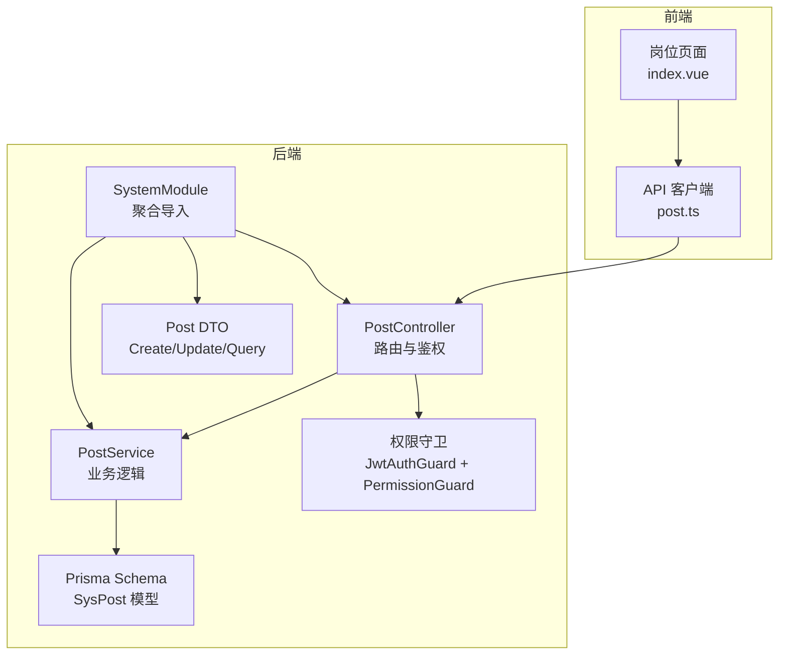
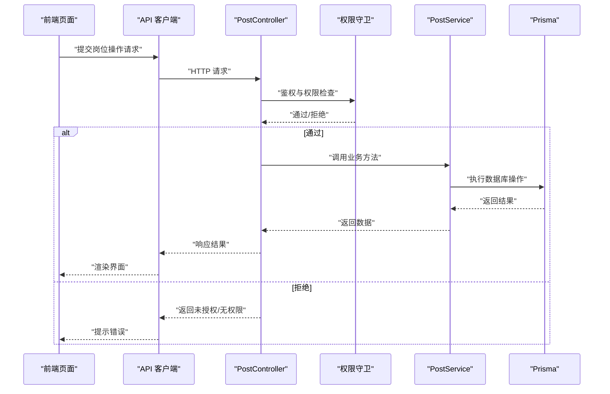
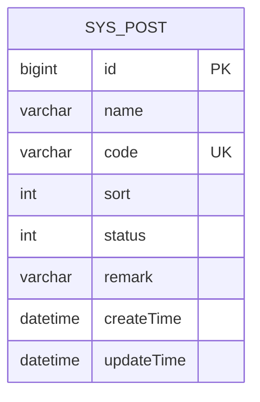
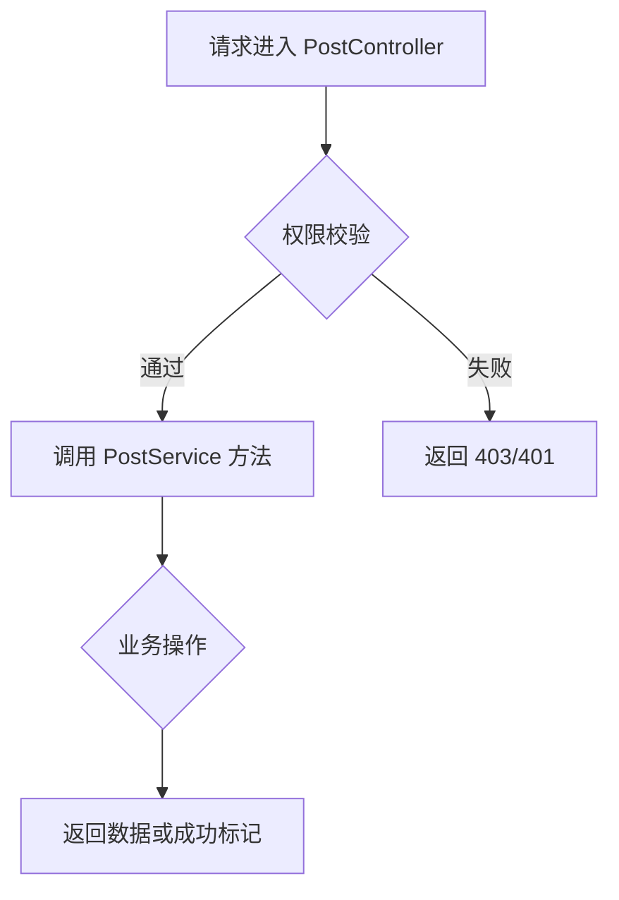
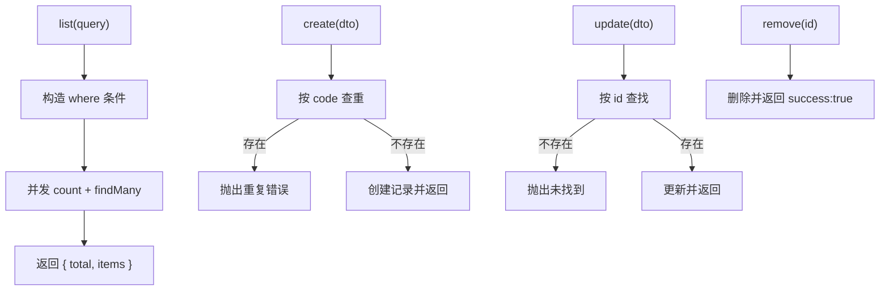
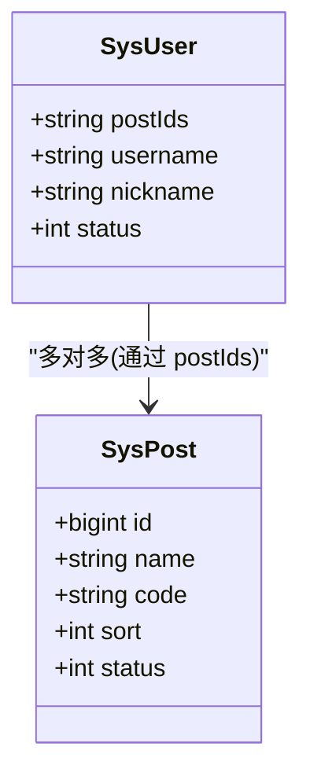
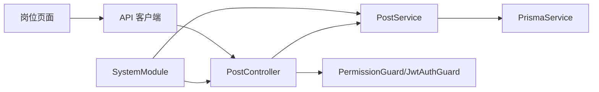

# 岗位管理

<cite>
**本文引用的文件**
- [apps/backend/src/modules/system/post/post.controller.ts](file://apps/backend/src/modules/system/post/post.controller.ts)
- [apps/backend/src/modules/system/post/post.service.ts](file://apps/backend/src/modules/system/post/post.service.ts)
- [apps/backend/src/modules/system/post/post.module.ts](file://apps/backend/src/modules/system/post/post.module.ts)
- [apps/backend/src/modules/system/post/dto/post.dto.ts](file://apps/backend/src/modules/system/post/dto/post.dto.ts)
- [apps/backend/prisma/schema.prisma](file://apps/backend/prisma/schema.prisma)
- [apps/backend/src/auth/guards.ts](file://apps/backend/src/auth/guards.ts)
- [apps/backend/src/modules/system/system.module.ts](file://apps/backend/src/modules/system/system.module.ts)
- [apps/backend/src/modules/system/user/user.service.ts](file://apps/backend/src/modules/system/user/user.service.ts)
- [apps/vben-admin/apps/web-antd/src/api/system/post.ts](file://apps/vben-admin/apps/web-antd/src/api/system/post.ts)
- [apps/vben-admin/apps/web-antd/src/views/system/post/index.vue](file://apps/vben-admin/apps/web-antd/src/views/system/post/index.vue)
</cite>

## 目录
1. [简介](#简介)
2. [项目结构](#项目结构)
3. [核心组件](#核心组件)
4. [架构总览](#架构总览)
5. [详细组件分析](#详细组件分析)
6. [依赖关系分析](#依赖关系分析)
7. [性能考虑](#性能考虑)
8. [故障排查指南](#故障排查指南)
9. [结论](#结论)
10. [附录](#附录)

## 简介
本文件系统性梳理岗位管理模块的设计与实现，覆盖后端控制器与服务层、DTO 数据校验、Prisma 数据模型、权限控制、前端接口与页面交互，以及岗位与用户的关联关系、岗位统计与历史记录等扩展能力。目标是帮助开发者快速理解岗位 CRUD 的完整链路与最佳实践。

## 项目结构
岗位管理模块位于后端系统模块中，采用标准的 NestJS 分层架构：控制器负责路由与鉴权，服务层封装业务逻辑，DTO 进行输入校验，Prisma 定义数据模型。前端通过统一请求客户端调用后端接口，页面完成岗位的增删改查与分页展示。

图表来源
- [apps/backend/src/modules/system/post/post.controller.ts:1-50](file://apps/backend/src/modules/system/post/post.controller.ts#L1-L50)
- [apps/backend/src/modules/system/post/post.service.ts:1-44](file://apps/backend/src/modules/system/post/post.service.ts#L1-L44)
- [apps/backend/src/modules/system/post/dto/post.dto.ts:1-28](file://apps/backend/src/modules/system/post/dto/post.dto.ts#L1-L28)
- [apps/backend/prisma/schema.prisma:77-90](file://apps/backend/prisma/schema.prisma#L77-L90)
- [apps/backend/src/auth/guards.ts:1-51](file://apps/backend/src/auth/guards.ts#L1-L51)
- [apps/backend/src/modules/system/system.module.ts:1-23](file://apps/backend/src/modules/system/system.module.ts#L1-L23)
- [apps/vben-admin/apps/web-antd/src/api/system/post.ts:1-40](file://apps/vben-admin/apps/web-antd/src/api/system/post.ts#L1-L40)
- [apps/vben-admin/apps/web-antd/src/views/system/post/index.vue:1-132](file://apps/vben-admin/apps/web-antd/src/views/system/post/index.vue#L1-L132)

章节来源
- [apps/backend/src/modules/system/post/post.controller.ts:1-50](file://apps/backend/src/modules/system/post/post.controller.ts#L1-L50)
- [apps/backend/src/modules/system/post/post.service.ts:1-44](file://apps/backend/src/modules/system/post/post.service.ts#L1-L44)
- [apps/backend/src/modules/system/post/post.module.ts:1-10](file://apps/backend/src/modules/system/post/post.module.ts#L1-L10)
- [apps/backend/src/modules/system/post/dto/post.dto.ts:1-28](file://apps/backend/src/modules/system/post/dto/post.dto.ts#L1-L28)
- [apps/backend/prisma/schema.prisma:77-90](file://apps/backend/prisma/schema.prisma#L77-L90)
- [apps/backend/src/auth/guards.ts:1-51](file://apps/backend/src/auth/guards.ts#L1-L51)
- [apps/backend/src/modules/system/system.module.ts:1-23](file://apps/backend/src/modules/system/system.module.ts#L1-L23)
- [apps/vben-admin/apps/web-antd/src/api/system/post.ts:1-40](file://apps/vben-admin/apps/web-antd/src/api/system/post.ts#L1-L40)
- [apps/vben-admin/apps/web-antd/src/views/system/post/index.vue:1-132](file://apps/vben-admin/apps/web-antd/src/views/system/post/index.vue#L1-L132)

## 核心组件
- 控制器：提供岗位列表、详情、创建、更新、删除接口，使用 JWT 与权限守卫进行安全控制。
- 服务层：封装查询、创建、更新、删除逻辑，处理重复编码校验与异常。
- DTO：定义创建、更新、查询的输入参数与校验规则。
- 数据模型：Prisma 中的 SysPost 表，包含岗位编码、名称、排序、状态、备注等字段。
- 权限守卫：RequirePermission 注解用于声明所需权限点。
- 前端 API 与页面：统一请求客户端与岗位管理页面，支持分页、筛选、新增/编辑/删除。

章节来源
- [apps/backend/src/modules/system/post/post.controller.ts:1-50](file://apps/backend/src/modules/system/post/post.controller.ts#L1-L50)
- [apps/backend/src/modules/system/post/post.service.ts:1-44](file://apps/backend/src/modules/system/post/post.service.ts#L1-L44)
- [apps/backend/src/modules/system/post/dto/post.dto.ts:1-28](file://apps/backend/src/modules/system/post/dto/post.dto.ts#L1-L28)
- [apps/backend/prisma/schema.prisma:77-90](file://apps/backend/prisma/schema.prisma#L77-L90)
- [apps/backend/src/auth/guards.ts:16-17](file://apps/backend/src/auth/guards.ts#L16-L17)

## 架构总览
岗位管理遵循“控制器-服务-数据访问”的分层设计，前后端通过 REST 接口交互，权限通过注解与守卫统一管控。

图表来源
- [apps/backend/src/modules/system/post/post.controller.ts:1-50](file://apps/backend/src/modules/system/post/post.controller.ts#L1-L50)
- [apps/backend/src/auth/guards.ts:36-51](file://apps/backend/src/auth/guards.ts#L36-L51)
- [apps/backend/src/modules/system/post/post.service.ts:1-44](file://apps/backend/src/modules/system/post/post.service.ts#L1-L44)
- [apps/backend/prisma/schema.prisma:77-90](file://apps/backend/prisma/schema.prisma#L77-L90)
- [apps/vben-admin/apps/web-antd/src/api/system/post.ts:1-40](file://apps/vben-admin/apps/web-antd/src/api/system/post.ts#L1-L40)

## 详细组件分析

### 数据模型与字段定义
- 模型：SysPost
- 关键字段
  - id：自增主键
  - name：岗位名称
  - code：岗位编码（唯一索引）
  - sort：排序号（默认 0）
  - status：状态（默认 1，通常 1 正常、0 禁用）
  - remark：备注
  - createTime/updateTime：创建与更新时间

图表来源
- [apps/backend/prisma/schema.prisma:77-90](file://apps/backend/prisma/schema.prisma#L77-L90)

章节来源
- [apps/backend/prisma/schema.prisma:77-90](file://apps/backend/prisma/schema.prisma#L77-L90)

### API 设计与权限控制
- 路由前缀：/system/post
- 权限点：system:post:list（列表、详情）、system:post:add/edit（创建/更新）、system:post:remove（删除）
- 控制器方法
  - GET /list：分页查询，支持按 name/code/status 查询
  - GET /:id：按 ID 获取详情
  - POST：创建岗位
  - PUT：更新岗位
  - DELETE /:id：删除岗位

图表来源
- [apps/backend/src/modules/system/post/post.controller.ts:14-48](file://apps/backend/src/modules/system/post/post.controller.ts#L14-L48)
- [apps/backend/src/auth/guards.ts:36-51](file://apps/backend/src/auth/guards.ts#L36-L51)

章节来源
- [apps/backend/src/modules/system/post/post.controller.ts:1-50](file://apps/backend/src/modules/system/post/post.controller.ts#L1-L50)
- [apps/backend/src/auth/guards.ts:16-17](file://apps/backend/src/auth/guards.ts#L16-L17)

### DTO 输入校验
- 创建 DTO：name、code 必填；sort 可选；status 默认 1；remark 可选
- 更新 DTO：id 必填；其余字段可选
- 查询 DTO：name/code/status 可选；page/limit 最小为 1

章节来源
- [apps/backend/src/modules/system/post/dto/post.dto.ts:5-27](file://apps/backend/src/modules/system/post/dto/post.dto.ts#L5-L27)

### 服务层实现要点
- 列表查询：支持模糊匹配 name/code，精确匹配 status，分页与排序
- 创建：校验 code 唯一性，否则抛出错误
- 更新：先查再更新，不存在则抛异常
- 删除：直接删除并返回成功标记

图表来源
- [apps/backend/src/modules/system/post/post.service.ts:9-43](file://apps/backend/src/modules/system/post/post.service.ts#L9-L43)

章节来源
- [apps/backend/src/modules/system/post/post.service.ts:1-44](file://apps/backend/src/modules/system/post/post.service.ts#L1-L44)

### 前端集成
- API 客户端：封装 get/post/put/delete 等方法，统一路径为 /system/post/*
- 页面组件：支持查询（名称/编码/状态）、分页、新增/编辑/删除弹窗、状态标签展示

章节来源
- [apps/vben-admin/apps/web-antd/src/api/system/post.ts:1-40](file://apps/vben-admin/apps/web-antd/src/api/system/post.ts#L1-L40)
- [apps/vben-admin/apps/web-antd/src/views/system/post/index.vue:1-132](file://apps/vben-admin/apps/web-antd/src/views/system/post/index.vue#L1-L132)

### 岗位与用户的关系管理
- 用户模型包含 postIds 字段，用于存储用户所拥有的岗位集合
- 用户创建/更新时，postIds 支持数组或序列化字符串形式传入
- 岗位删除不会自动清理用户关联，需在业务侧做迁移或清理策略

图表来源
- [apps/backend/prisma/schema.prisma:13-38](file://apps/backend/prisma/schema.prisma#L13-L38)
- [apps/backend/prisma/schema.prisma:77-90](file://apps/backend/prisma/schema.prisma#L77-L90)

章节来源
- [apps/backend/prisma/schema.prisma:13-38](file://apps/backend/prisma/schema.prisma#L13-L38)
- [apps/backend/prisma/schema.prisma:77-90](file://apps/backend/prisma/schema.prisma#L77-L90)
- [apps/backend/src/modules/system/user/user.service.ts:74-96](file://apps/backend/src/modules/system/user/user.service.ts#L74-L96)

### 业务场景示例
- 岗位设置：通过页面新增岗位，填写名称、编码、排序、状态与备注，保存后可在列表查看
- 员工岗位调整：在用户管理中选择用户，勾选其所属岗位集合，保存后用户即与对应岗位建立关联
- 岗位权限配置：岗位本身不直接持有权限，但可通过“角色-菜单”授权链路间接影响用户权限；岗位变更后建议重新评估用户权限

章节来源
- [apps/vben-admin/apps/web-antd/src/views/system/post/index.vue:39-68](file://apps/vben-admin/apps/web-antd/src/views/system/post/index.vue#L39-L68)
- [apps/backend/src/modules/system/user/user.service.ts:74-96](file://apps/backend/src/modules/system/user/user.service.ts#L74-L96)

### 数据权限控制
- 当前岗位模块未内置数据权限范围字段；若需要按部门/岗位限定数据可见性，可在用户查询或业务读取处增加基于岗位的过滤逻辑
- 可结合角色的数据范围字段与岗位集合共同实现更细粒度的数据权限

章节来源
- [apps/backend/prisma/schema.prisma:40-56](file://apps/backend/prisma/schema.prisma#L40-L56)

### 岗位人员统计
- 统计方式：遍历用户集合，解析 postIds 并统计各岗位下的用户数量
- 实现建议：在服务层提供聚合统计接口，或在前端按列表二次聚合

章节来源
- [apps/backend/src/modules/system/user/user.service.ts:38-46](file://apps/backend/src/modules/system/user/user.service.ts#L38-L46)

### 岗位历史记录
- 可通过操作日志模块记录岗位的创建/更新/删除事件，便于审计与回溯
- 建议在服务层调用日志拦截器或手动写入操作日志

章节来源
- [apps/backend/src/common/oper-log.interceptor.ts](file://apps/backend/src/common/oper-log.interceptor.ts)

## 依赖关系分析
- PostController 依赖 PostService 与权限守卫
- PostService 依赖 PrismaService
- SystemModule 聚合导入 PostModule
- 前端通过 API 客户端与控制器交互

图表来源
- [apps/backend/src/modules/system/post/post.controller.ts:1-50](file://apps/backend/src/modules/system/post/post.controller.ts#L1-L50)
- [apps/backend/src/modules/system/post/post.service.ts:1-44](file://apps/backend/src/modules/system/post/post.service.ts#L1-L44)
- [apps/backend/src/auth/guards.ts:36-51](file://apps/backend/src/auth/guards.ts#L36-L51)
- [apps/backend/src/modules/system/system.module.ts:1-23](file://apps/backend/src/modules/system/system.module.ts#L1-L23)
- [apps/vben-admin/apps/web-antd/src/api/system/post.ts:1-40](file://apps/vben-admin/apps/web-antd/src/api/system/post.ts#L1-L40)

章节来源
- [apps/backend/src/modules/system/post/post.controller.ts:1-50](file://apps/backend/src/modules/system/post/post.controller.ts#L1-L50)
- [apps/backend/src/modules/system/post/post.service.ts:1-44](file://apps/backend/src/modules/system/post/post.service.ts#L1-L44)
- [apps/backend/src/modules/system/system.module.ts:1-23](file://apps/backend/src/modules/system/system.module.ts#L1-L23)

## 性能考虑
- 列表查询使用并发 count + 分页查询，避免 N+1 问题
- SysPost 的 code 与 sort 建有索引，建议在高频查询字段上保持索引策略
- 前端分页参数最小值限制为 1，减少无效请求

章节来源
- [apps/backend/src/modules/system/post/post.service.ts:15-19](file://apps/backend/src/modules/system/post/post.service.ts#L15-L19)
- [apps/backend/prisma/schema.prisma:77-90](file://apps/backend/prisma/schema.prisma#L77-L90)

## 故障排查指南
- 403/401 未授权：确认登录态与权限点是否具备 system:post:* 权限
- 404 岗位不存在：检查 ID 是否正确或已被删除
- 400 编码已存在：创建/更新时请更换唯一编码
- 分页异常：确保 page/limit ≥ 1

章节来源
- [apps/backend/src/modules/system/post/post.controller.ts:14-48](file://apps/backend/src/modules/system/post/post.controller.ts#L14-L48)
- [apps/backend/src/modules/system/post/post.service.ts:28-31](file://apps/backend/src/modules/system/post/post.service.ts#L28-L31)
- [apps/backend/src/auth/guards.ts:36-51](file://apps/backend/src/auth/guards.ts#L36-L51)

## 结论
岗位管理模块以清晰的分层设计实现了完整的 CRUD 能力，配合权限守卫与 DTO 校验保障了安全性与数据质量。通过与用户模块的 postIds 关联，可灵活支撑岗位分配与权限间接控制。建议后续补充岗位维度的数据权限、岗位人员统计与历史审计能力，进一步完善岗位全生命周期管理。

## 附录
- 前端页面与 API 已内置于仓库，可直接参考与复用
- 若需扩展岗位与角色/菜单的直接关联，可在数据模型与服务层进行增强