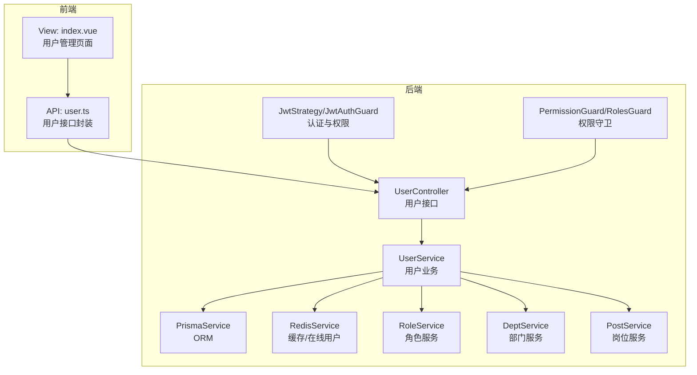
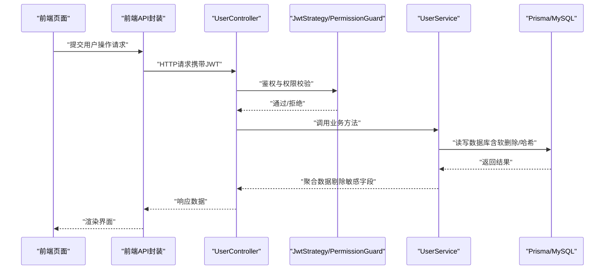
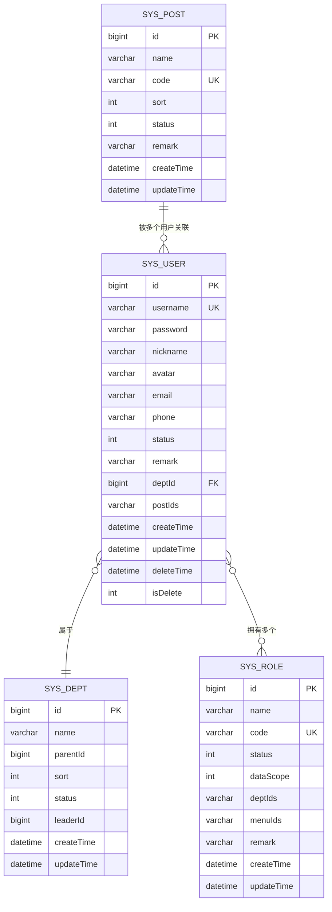
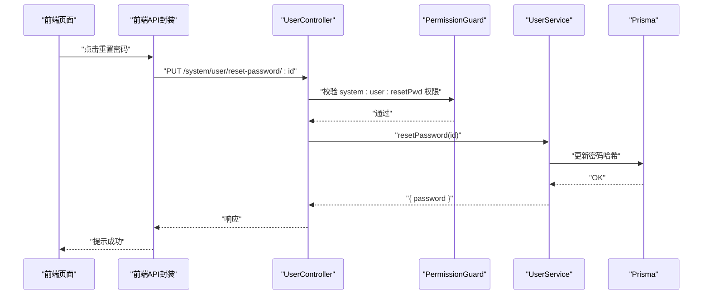
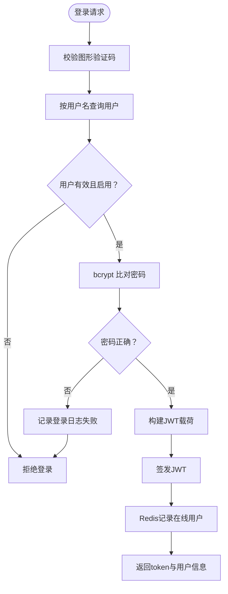
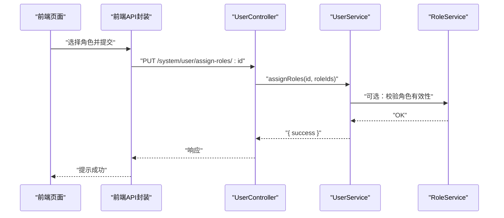
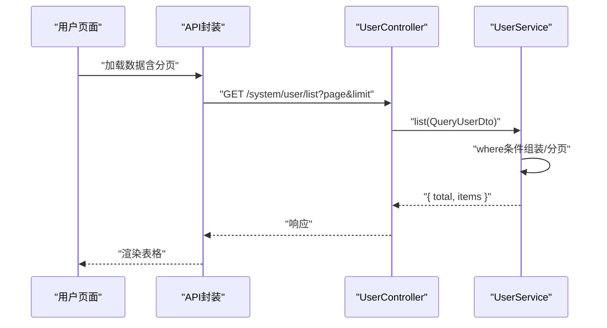
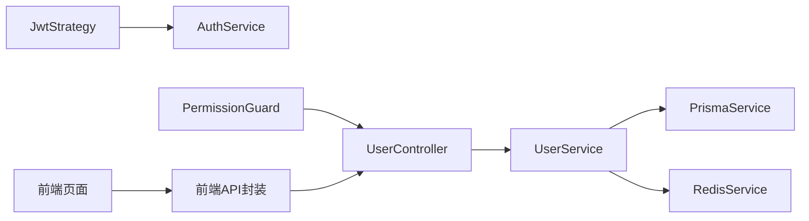

# 用户管理

<cite>
**本文引用的文件**
- [apps/backend/src/modules/system/user/user.controller.ts](file://apps/backend/src/modules/system/user/user.controller.ts)
- [apps/backend/src/modules/system/user/user.service.ts](file://apps/backend/src/modules/system/user/user.service.ts)
- [apps/backend/src/modules/system/user/dto/user.dto.ts](file://apps/backend/src/modules/system/user/dto/user.dto.ts)
- [apps/backend/src/modules/system/user/user.module.ts](file://apps/backend/src/modules/system/user/user.module.ts)
- [apps/backend/prisma/schema.prisma](file://apps/backend/prisma/schema.prisma)
- [apps/backend/src/auth/guards.ts](file://apps/backend/src/auth/guards.ts)
- [apps/backend/src/auth/jwt.strategy.ts](file://apps/backend/src/auth/jwt.strategy.ts)
- [apps/backend/src/auth/auth.service.ts](file://apps/backend/src/auth/auth.service.ts)
- [apps/backend/src/modules/system/role/role.service.ts](file://apps/backend/src/modules/system/role/role.service.ts)
- [apps/backend/src/modules/system/dept/dept.service.ts](file://apps/backend/src/modules/system/dept/dept.service.ts)
- [apps/backend/src/modules/system/post/post.service.ts](file://apps/backend/src/modules/system/post/post.service.ts)
- [apps/vben-admin/apps/web-antd/src/api/system/user.ts](file://apps/vben-admin/apps/web-antd/src/api/system/user.ts)
- [apps/vben-admin/apps/web-antd/src/views/system/user/index.vue](file://apps/vben-admin/apps/web-antd/src/views/system/user/index.vue)
</cite>

## 目录
1. [简介](#简介)
2. [项目结构](#项目结构)
3. [核心组件](#核心组件)
4. [架构总览](#架构总览)
5. [详细组件分析](#详细组件分析)
6. [依赖关系分析](#依赖关系分析)
7. [性能考虑](#性能考虑)
8. [故障排查指南](#故障排查指南)
9. [结论](#结论)
10. [附录](#附录)

## 简介
本文件系统化梳理用户管理模块的设计与实现，覆盖用户CRUD接口、数据模型、权限校验、密码加密策略、用户状态与角色管理、以及前端交互与分页查询优化等。文档同时提供典型业务场景示例与最佳实践建议，帮助开发者快速理解与扩展用户管理能力。

## 项目结构
用户管理模块位于后端 NestJS 应用的系统模块下，采用标准的分层设计：控制器负责HTTP路由与鉴权注解，服务层封装业务逻辑与数据库访问，DTO用于请求参数校验与Swagger标注；前端使用 Vben Admin 提供的表格、表单与弹窗组件完成用户列表、搜索、新增/编辑、状态切换、重置密码与角色分配等操作。

图表来源
- [apps/backend/src/modules/system/user/user.controller.ts:20-88](file://apps/backend/src/modules/system/user/user.controller.ts#L20-L88)
- [apps/backend/src/modules/system/user/user.service.ts:12-144](file://apps/backend/src/modules/system/user/user.service.ts#L12-L144)
- [apps/backend/src/auth/guards.ts:19-51](file://apps/backend/src/auth/guards.ts#L19-L51)
- [apps/backend/src/auth/jwt.strategy.ts:20-43](file://apps/backend/src/auth/jwt.strategy.ts#L20-L43)
- [apps/vben-admin/apps/web-antd/src/api/system/user.ts:27-57](file://apps/vben-admin/apps/web-antd/src/api/system/user.ts#L27-L57)
- [apps/vben-admin/apps/web-antd/src/views/system/user/index.vue:130-229](file://apps/vben-admin/apps/web-antd/src/views/system/user/index.vue#L130-L229)

章节来源
- [apps/backend/src/modules/system/user/user.controller.ts:20-88](file://apps/backend/src/modules/system/user/user.controller.ts#L20-L88)
- [apps/backend/src/modules/system/user/user.service.ts:12-144](file://apps/backend/src/modules/system/user/user.service.ts#L12-L144)
- [apps/backend/src/modules/system/user/user.module.ts:1-10](file://apps/backend/src/modules/system/user/user.module.ts#L1-L10)
- [apps/backend/src/auth/guards.ts:19-51](file://apps/backend/src/auth/guards.ts#L19-L51)
- [apps/backend/src/auth/jwt.strategy.ts:20-43](file://apps/backend/src/auth/jwt.strategy.ts#L20-L43)
- [apps/vben-admin/apps/web-antd/src/api/system/user.ts:27-57](file://apps/vben-admin/apps/web-antd/src/api/system/user.ts#L27-L57)
- [apps/vben-admin/apps/web-antd/src/views/system/user/index.vue:130-229](file://apps/vben-admin/apps/web-antd/src/views/system/user/index.vue#L130-L229)

## 核心组件
- 控制器（UserController）：暴露REST接口，统一使用JWT与权限守卫，按需标注具体权限点，实现用户列表、详情、创建、更新、删除、重置密码、状态变更、角色分配等。
- 服务（UserService）：封装业务逻辑，包括分页查询、模糊匹配、密码哈希、软删除、角色绑定、状态变更等；通过Prisma访问数据库，必要时使用Redis缓存。
- DTO（Create/Update/QueryUserDto）：基于class-validator与Swagger标注，确保入参校验与接口文档一致性。
- 权限与认证：JwtStrategy在登录时提取用户权限集合，PermissionGuard与RequirePermission注解实现细粒度权限控制。
- 前端API与视图：提供用户列表、搜索、分页、状态开关、重置密码、角色分配等交互能力。

章节来源
- [apps/backend/src/modules/system/user/user.controller.ts:26-87](file://apps/backend/src/modules/system/user/user.controller.ts#L26-L87)
- [apps/backend/src/modules/system/user/user.service.ts:18-143](file://apps/backend/src/modules/system/user/user.service.ts#L18-L143)
- [apps/backend/src/modules/system/user/dto/user.dto.ts:5-131](file://apps/backend/src/modules/system/user/dto/user.dto.ts#L5-L131)
- [apps/backend/src/auth/guards.ts:36-51](file://apps/backend/src/auth/guards.ts#L36-L51)
- [apps/backend/src/auth/jwt.strategy.ts:45-76](file://apps/backend/src/auth/jwt.strategy.ts#L45-L76)
- [apps/vben-admin/apps/web-antd/src/api/system/user.ts:27-57](file://apps/vben-admin/apps/web-antd/src/api/system/user.ts#L27-L57)
- [apps/vben-admin/apps/web-antd/src/views/system/user/index.vue:130-229](file://apps/vben-admin/apps/web-antd/src/views/system/user/index.vue#L130-L229)

## 架构总览
用户管理模块遵循“控制器-服务-数据模型”的清晰分层，配合JWT认证与权限守卫，确保接口安全与可扩展性。前端通过统一API封装调用后端接口，视图组件负责展示与交互。

图表来源
- [apps/backend/src/modules/system/user/user.controller.ts:22-87](file://apps/backend/src/modules/system/user/user.controller.ts#L22-L87)
- [apps/backend/src/auth/jwt.strategy.ts:20-43](file://apps/backend/src/auth/jwt.strategy.ts#L20-L43)
- [apps/backend/src/auth/guards.ts:36-51](file://apps/backend/src/auth/guards.ts#L36-L51)
- [apps/backend/src/modules/system/user/user.service.ts:18-143](file://apps/backend/src/modules/system/user/user.service.ts#L18-L143)
- [apps/backend/prisma/schema.prisma:13-38](file://apps/backend/prisma/schema.prisma#L13-L38)
- [apps/vben-admin/apps/web-antd/src/api/system/user.ts:27-57](file://apps/vben-admin/apps/web-antd/src/api/system/user.ts#L27-L57)

## 详细组件分析

### 数据模型与字段定义
- 用户表（SysUser）：包含唯一用户名、密码哈希、昵称、头像、邮箱、手机、状态、备注、部门外键、岗位ID序列化数组、创建/更新/删除时间与软删除标记；与部门、角色、菜单、操作日志、登录日志、文件等存在关联。
- 角色表（SysRole）：名称、编码（唯一）、状态、数据范围、菜单ID集合、部门ID集合、备注等。
- 部门表（SysDept）：树形结构，支持父节点、排序、状态、负责人等。
- 岗位表（SysPost）：名称、编码（唯一）、排序、状态、备注等。

图表来源
- [apps/backend/prisma/schema.prisma:13-38](file://apps/backend/prisma/schema.prisma#L13-L38)
- [apps/backend/prisma/schema.prisma:40-56](file://apps/backend/prisma/schema.prisma#L40-L56)
- [apps/backend/prisma/schema.prisma:58-75](file://apps/backend/prisma/schema.prisma#L58-L75)
- [apps/backend/prisma/schema.prisma:77-90](file://apps/backend/prisma/schema.prisma#L77-L90)

章节来源
- [apps/backend/prisma/schema.prisma:13-38](file://apps/backend/prisma/schema.prisma#L13-L38)
- [apps/backend/prisma/schema.prisma:40-56](file://apps/backend/prisma/schema.prisma#L40-L56)
- [apps/backend/prisma/schema.prisma:58-75](file://apps/backend/prisma/schema.prisma#L58-L75)
- [apps/backend/prisma/schema.prisma:77-90](file://apps/backend/prisma/schema.prisma#L77-L90)

### 接口与权限设计
- 列表查询：支持按用户名、昵称、状态、部门过滤，分页参数最小值校验，返回时剔除密码字段并精简角色信息。
- 单条查询：按ID查询并剔除密码。
- 创建用户：用户名唯一性校验，密码使用bcrypt哈希存储，非必填字段默认值处理，岗位ID序列化存储。
- 更新用户：必填ID校验，密码可选更新，其余字段按需更新，岗位ID序列化存储。
- 删除用户：软删除（更新isDelete与deleteTime），不物理删除。
- 重置密码：默认新密码生成并哈希保存。
- 变更状态：直接更新状态字段。
- 分配角色：通过Prisma关系更新，支持批量角色ID设置。

图表来源
- [apps/backend/src/modules/system/user/user.controller.ts:62-67](file://apps/backend/src/modules/system/user/user.controller.ts#L62-L67)
- [apps/backend/src/modules/system/user/user.service.ts:117-125](file://apps/backend/src/modules/system/user/user.service.ts#L117-L125)
- [apps/vben-admin/apps/web-antd/src/api/system/user.ts:47-49](file://apps/vben-admin/apps/web-antd/src/api/system/user.ts#L47-L49)

章节来源
- [apps/backend/src/modules/system/user/user.controller.ts:26-87](file://apps/backend/src/modules/system/user/user.controller.ts#L26-L87)
- [apps/backend/src/modules/system/user/user.service.ts:18-143](file://apps/backend/src/modules/system/user/user.service.ts#L18-L143)
- [apps/backend/src/modules/system/user/dto/user.dto.ts:94-131](file://apps/backend/src/modules/system/user/dto/user.dto.ts#L94-L131)

### 权限验证机制与密码加密
- 权限验证：RequirePermission注解与PermissionGuard组合，基于用户权限集合进行细粒度校验；JwtStrategy在登录时解析用户权限，超级管理员拥有全部权限，普通用户由角色菜单ID集合推导。
- 密码加密：bcrypt哈希，创建与更新时对明文密码进行加盐哈希，登录时比对哈希值。
- 认证流程：JwtAuthGuard + JwtStrategy，校验token有效性与用户状态，注入用户信息与权限到请求上下文。

图表来源
- [apps/backend/src/auth/auth.service.ts:29-89](file://apps/backend/src/auth/auth.service.ts#L29-L89)
- [apps/backend/src/auth/jwt.strategy.ts:20-43](file://apps/backend/src/auth/jwt.strategy.ts#L20-L43)
- [apps/backend/src/auth/guards.ts:36-51](file://apps/backend/src/auth/guards.ts#L36-L51)

章节来源
- [apps/backend/src/auth/auth.service.ts:29-89](file://apps/backend/src/auth/auth.service.ts#L29-L89)
- [apps/backend/src/auth/jwt.strategy.ts:45-76](file://apps/backend/src/auth/jwt.strategy.ts#L45-L76)
- [apps/backend/src/auth/guards.ts:36-51](file://apps/backend/src/auth/guards.ts#L36-L51)

### 用户状态与角色管理
- 状态管理：提供状态变更接口，支持启用/禁用切换。
- 角色管理：通过assignRoles接口为用户批量分配角色，内部使用Prisma关系更新。
- 角色服务：提供角色列表、详情、创建、更新、删除、状态变更、权限分配等能力。
- 部门与岗位：部门服务提供树形结构与列表查询，岗位服务提供列表与详情。

图表来源
- [apps/backend/src/modules/system/user/user.controller.ts:79-87](file://apps/backend/src/modules/system/user/user.controller.ts#L79-L87)
- [apps/backend/src/modules/system/user/user.service.ts:135-143](file://apps/backend/src/modules/system/user/user.service.ts#L135-L143)
- [apps/backend/src/modules/system/role/role.service.ts:64-73](file://apps/backend/src/modules/system/role/role.service.ts#L64-L73)

章节来源
- [apps/backend/src/modules/system/user/user.controller.ts:79-87](file://apps/backend/src/modules/system/user/user.controller.ts#L79-L87)
- [apps/backend/src/modules/system/user/user.service.ts:135-143](file://apps/backend/src/modules/system/user/user.service.ts#L135-L143)
- [apps/backend/src/modules/system/role/role.service.ts:11-79](file://apps/backend/src/modules/system/role/role.service.ts#L11-L79)

### 前端交互与分页查询优化
- 前端页面：提供搜索表单（用户名、昵称、状态、部门）、用户列表表格、新增/编辑弹窗、状态开关、重置密码、删除确认等交互。
- 分页查询：前端传入page与limit参数，后端按页返回总数与数据项，避免一次性加载大量数据。
- 性能优化建议：列表查询中对username/nickname/status/deptId建立索引；分页查询使用skip/take并按主键降序；避免在列表中返回大字段（已剔除密码）。

图表来源
- [apps/vben-admin/apps/web-antd/src/views/system/user/index.vue:130-143](file://apps/vben-admin/apps/web-antd/src/views/system/user/index.vue#L130-L143)
- [apps/vben-admin/apps/web-antd/src/api/system/user.ts:27-29](file://apps/vben-admin/apps/web-antd/src/api/system/user.ts#L27-L29)
- [apps/backend/src/modules/system/user/user.controller.ts:26-31](file://apps/backend/src/modules/system/user/user.controller.ts#L26-L31)
- [apps/backend/src/modules/system/user/user.service.ts:18-46](file://apps/backend/src/modules/system/user/user.service.ts#L18-L46)

章节来源
- [apps/vben-admin/apps/web-antd/src/views/system/user/index.vue:130-229](file://apps/vben-admin/apps/web-antd/src/views/system/user/index.vue#L130-L229)
- [apps/vben-admin/apps/web-antd/src/api/system/user.ts:27-57](file://apps/vben-admin/apps/web-antd/src/api/system/user.ts#L27-L57)
- [apps/backend/src/modules/system/user/user.controller.ts:26-31](file://apps/backend/src/modules/system/user/user.controller.ts#L26-L31)
- [apps/backend/src/modules/system/user/user.service.ts:18-46](file://apps/backend/src/modules/system/user/user.service.ts#L18-L46)

### 典型业务场景示例
- 批量用户导入：建议通过后端提供导入接口（例如POST /system/user/import），前端上传文件后端解析并逐条创建用户，结合事务与错误回滚，失败项单独记录。
- 用户状态变更：调用PUT /system/user/change-status/:id，前端通过开关控件触发，后端仅更新状态字段。
- 用户角色批量分配：调用PUT /system/user/assign-roles/:id，前端多选角色后提交roleIds数组，后端通过关系更新完成分配。

章节来源
- [apps/backend/src/modules/system/user/user.controller.ts:69-87](file://apps/backend/src/modules/system/user/user.controller.ts#L69-L87)
- [apps/backend/src/modules/system/user/user.service.ts:127-143](file://apps/backend/src/modules/system/user/user.service.ts#L127-L143)
- [apps/vben-admin/apps/web-antd/src/views/system/user/index.vue:196-205](file://apps/vben-admin/apps/web-antd/src/views/system/user/index.vue#L196-L205)

## 依赖关系分析
- 控制器依赖服务：UserController通过构造函数注入UserService，集中处理权限注解与业务调用。
- 服务依赖ORM与缓存：UserService依赖PrismaService与RedisService，实现数据持久化与在线用户管理。
- 权限守卫依赖反射：PermissionGuard与RolesGuard通过Reflector从控制器/方法元数据读取所需权限或角色，再与用户上下文中的权限集合比对。
- 前后端接口契约：前端API封装与后端控制器路径一一对应，保证调用一致性。

图表来源
- [apps/backend/src/modules/system/user/user.controller.ts:22-24](file://apps/backend/src/modules/system/user/user.controller.ts#L22-L24)
- [apps/backend/src/modules/system/user/user.service.ts:13-16](file://apps/backend/src/modules/system/user/user.service.ts#L13-L16)
- [apps/backend/src/auth/jwt.strategy.ts:20-43](file://apps/backend/src/auth/jwt.strategy.ts#L20-L43)
- [apps/backend/src/auth/guards.ts:36-51](file://apps/backend/src/auth/guards.ts#L36-L51)
- [apps/vben-admin/apps/web-antd/src/api/system/user.ts:27-57](file://apps/vben-admin/apps/web-antd/src/api/system/user.ts#L27-L57)

章节来源
- [apps/backend/src/modules/system/user/user.controller.ts:22-24](file://apps/backend/src/modules/system/user/user.controller.ts#L22-L24)
- [apps/backend/src/modules/system/user/user.service.ts:13-16](file://apps/backend/src/modules/system/user/user.service.ts#L13-L16)
- [apps/backend/src/auth/guards.ts:36-51](file://apps/backend/src/auth/guards.ts#L36-L51)
- [apps/vben-admin/apps/web-antd/src/api/system/user.ts:27-57](file://apps/vben-admin/apps/web-antd/src/api/system/user.ts#L27-L57)

## 性能考虑
- 查询优化：列表查询使用where条件与orderBy（按主键降序），分页使用skip/take；对username、deptId建立索引以提升模糊查询与过滤性能。
- 数据脱敏：列表与详情均剔除密码字段，避免敏感信息泄露。
- 缓存策略：登录成功后将token与用户ID写入Redis，便于在线用户统计与登出清理。
- 关系更新：角色分配使用Prisma关系set，减少中间态与冗余查询。

章节来源
- [apps/backend/src/modules/system/user/user.service.ts:18-46](file://apps/backend/src/modules/system/user/user.service.ts#L18-L46)
- [apps/backend/src/modules/system/user/user.service.ts:135-143](file://apps/backend/src/modules/system/user/user.service.ts#L135-L143)
- [apps/backend/src/auth/auth.service.ts:62-64](file://apps/backend/src/auth/auth.service.ts#L62-L64)

## 故障排查指南
- 用户名重复：创建用户时若用户名已存在，抛出请求异常；检查DTO校验与数据库唯一约束。
- 用户不存在：更新或删除用户前先查询，未找到则抛出异常；确认ID是否正确。
- 密码错误：登录时密码比对失败会记录登录日志并拒绝；检查bcrypt哈希与明文输入。
- 权限不足：接口标注权限点但当前用户不具备相应权限会被拒绝；核对用户角色与菜单权限映射。
- 分页参数非法：page与limit最小值为1，前端应避免传入0或负数；后端已做校验。

章节来源
- [apps/backend/src/modules/system/user/user.service.ts:57-61](file://apps/backend/src/modules/system/user/user.service.ts#L57-L61)
- [apps/backend/src/modules/system/user/user.service.ts:80-86](file://apps/backend/src/modules/system/user/user.service.ts#L80-L86)
- [apps/backend/src/auth/auth.service.ts:48-60](file://apps/backend/src/auth/auth.service.ts#L48-L60)
- [apps/backend/src/auth/guards.ts:36-51](file://apps/backend/src/auth/guards.ts#L36-L51)
- [apps/backend/src/modules/system/user/dto/user.dto.ts:120-129](file://apps/backend/src/modules/system/user/dto/user.dto.ts#L120-L129)

## 结论
用户管理模块以清晰的分层设计、完善的权限体系与严谨的数据模型为基础，提供了完整的CRUD能力与良好的扩展性。通过bcrypt加密、JWT认证、权限守卫与软删除等机制，保障了系统的安全性与稳定性。前端页面与API封装进一步提升了用户体验与开发效率。后续可在导入导出、批量操作、审计日志等方面持续增强。

## 附录
- 数据验证规则
  - 用户名：字符串，唯一，必填。
  - 密码：字符串，创建时必填，更新时可选。
  - 昵称/邮箱/手机/备注：字符串，可选。
  - 状态：整数，可选，默认启用。
  - 部门ID：整数，可选。
  - 岗位ID数组：整数数组，可选，序列化存储。
  - 分页参数：最小值为1，避免无效查询。
- 建议的扩展方向
  - 导出功能：提供CSV/Excel导出接口，支持筛选条件与分页。
  - 批量导入：支持模板上传与错误汇总，结合事务回滚。
  - 用户锁定与解锁：增加登录失败次数限制与账户锁定策略。
  - 审计日志：记录用户关键操作（创建/更新/删除/重置密码/角色分配）。