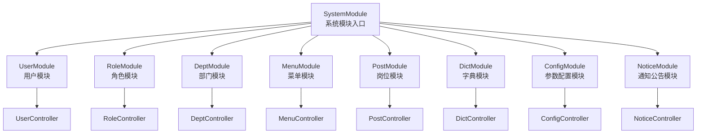
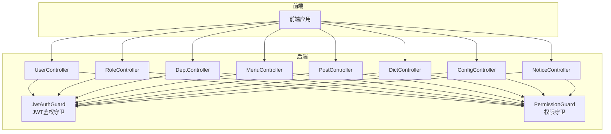
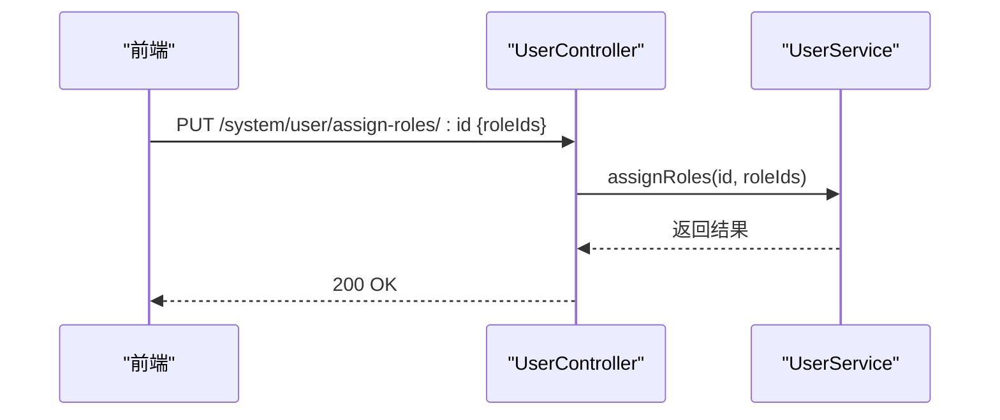
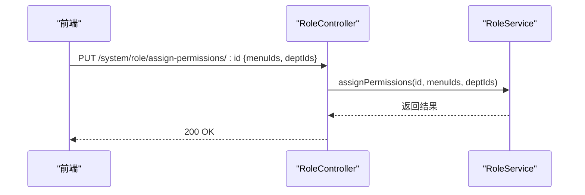
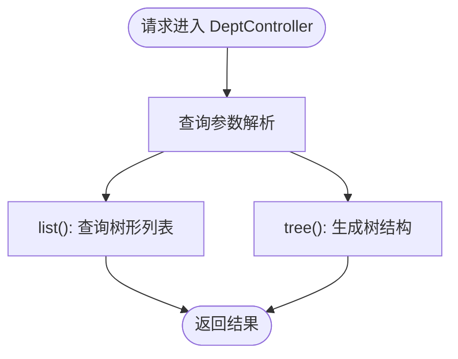
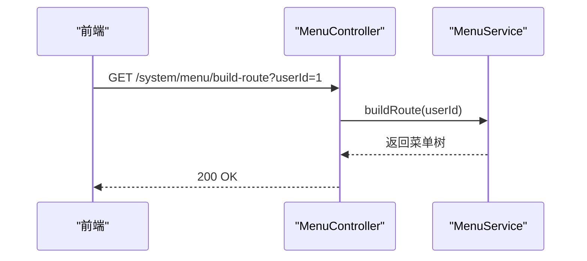
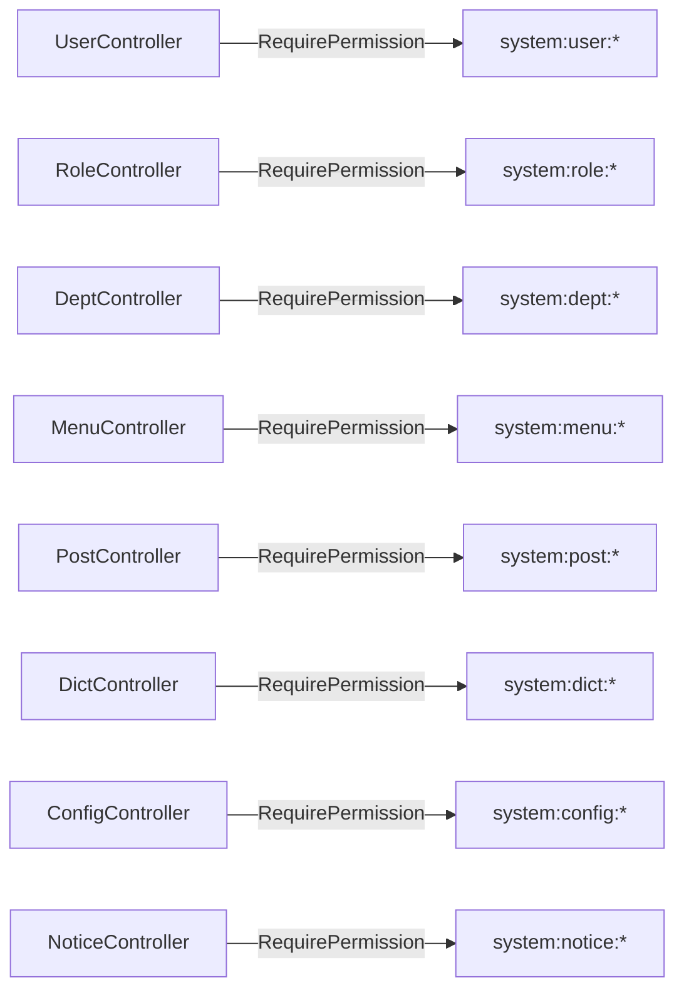

# 系统管理模块

<cite>
**本文档引用的文件**
- [apps/backend/src/modules/system/system.module.ts](file://apps/backend/src/modules/system/system.module.ts)
- [apps/backend/src/modules/system/user/user.controller.ts](file://apps/backend/src/modules/system/user/user.controller.ts)
- [apps/backend/src/modules/system/user/dto/user.dto.ts](file://apps/backend/src/modules/system/user/dto/user.dto.ts)
- [apps/backend/src/modules/system/role/role.controller.ts](file://apps/backend/src/modules/system/role/role.controller.ts)
- [apps/backend/src/modules/system/role/dto/role.dto.ts](file://apps/backend/src/modules/system/role/dto/role.dto.ts)
- [apps/backend/src/modules/system/dept/dept.controller.ts](file://apps/backend/src/modules/system/dept/dept.controller.ts)
- [apps/backend/src/modules/system/dept/dto/dept.dto.ts](file://apps/backend/src/modules/system/dept/dto/dept.dto.ts)
- [apps/backend/src/modules/system/menu/menu.controller.ts](file://apps/backend/src/modules/system/menu/menu.controller.ts)
- [apps/backend/src/modules/system/menu/dto/menu.dto.ts](file://apps/backend/src/modules/system/menu/dto/menu.dto.ts)
- [apps/backend/src/modules/system/post/post.controller.ts](file://apps/backend/src/modules/system/post/post.controller.ts)
- [apps/backend/src/modules/system/post/dto/post.dto.ts](file://apps/backend/src/modules/system/post/dto/post.dto.ts)
- [apps/backend/src/modules/system/dict/dict.controller.ts](file://apps/backend/src/modules/system/dict/dict.controller.ts)
- [apps/backend/src/modules/system/dict/dto/dict.dto.ts](file://apps/backend/src/modules/system/dict/dto/dict.dto.ts)
- [apps/backend/src/modules/system/config/config.controller.ts](file://apps/backend/src/modules/system/config/config.controller.ts)
- [apps/backend/src/modules/system/notice/notice.controller.ts](file://apps/backend/src/modules/system/notice/notice.controller.ts)
</cite>

## 目录
1. [简介](#简介)
2. [项目结构](#项目结构)
3. [核心组件](#核心组件)
4. [架构总览](#架构总览)
5. [详细组件分析](#详细组件分析)
6. [依赖分析](#依赖分析)
7. [性能考虑](#性能考虑)
8. [故障排除指南](#故障排除指南)
9. [结论](#结论)

## 简介
本文件为系统管理模块的综合技术文档，覆盖用户管理、角色管理、部门管理、菜单管理、岗位管理、字典管理、参数配置、通知公告等核心功能。文档从API设计、权限控制、树形结构处理、数据验证与批量操作等方面进行系统化梳理，并提供典型业务流程示例（如用户权限分配、菜单动态生成）。

## 项目结构
系统管理模块采用按功能域划分的分层组织方式：控制器（Controller）负责HTTP端点与权限注解；DTO（数据传输对象）定义请求/响应字段与校验规则；服务（Service）封装业务逻辑；模块（Module）聚合子模块。

图表来源
- [apps/backend/src/modules/system/system.module.ts:11-22](file://apps/backend/src/modules/system/system.module.ts#L11-L22)

章节来源
- [apps/backend/src/modules/system/system.module.ts:1-23](file://apps/backend/src/modules/system/system.module.ts#L1-L23)

## 核心组件
- 用户管理：提供用户增删改查、重置密码、状态变更、角色分配等接口。
- 角色管理：提供角色增删改查、状态变更、权限分配、查询角色菜单ID等接口。
- 部门管理：提供部门树形列表、树结构查询、增删改查等接口。
- 菜单管理：提供菜单列表、树形结构、路由构建、增删改查等接口。
- 岗位管理：提供岗位增删改查、分页查询等接口。
- 字典管理：提供字典类型与数据的增删改查接口。
- 参数配置：提供参数键值查询、刷新缓存等接口。
- 通知公告：提供通知公告增删改查接口。

章节来源
- [apps/backend/src/modules/system/user/user.controller.ts:20-88](file://apps/backend/src/modules/system/user/user.controller.ts#L20-L88)
- [apps/backend/src/modules/system/role/role.controller.ts:11-79](file://apps/backend/src/modules/system/role/role.controller.ts#L11-L79)
- [apps/backend/src/modules/system/dept/dept.controller.ts:11-59](file://apps/backend/src/modules/system/dept/dept.controller.ts#L11-L59)
- [apps/backend/src/modules/system/menu/menu.controller.ts:11-66](file://apps/backend/src/modules/system/menu/menu.controller.ts#L11-L66)
- [apps/backend/src/modules/system/post/post.controller.ts:8-49](file://apps/backend/src/modules/system/post/post.controller.ts#L8-L49)
- [apps/backend/src/modules/system/dict/dict.controller.ts:8-80](file://apps/backend/src/modules/system/dict/dict.controller.ts#L8-L80)
- [apps/backend/src/modules/system/config/config.controller.ts:8-62](file://apps/backend/src/modules/system/config/config.controller.ts#L8-L62)
- [apps/backend/src/modules/system/notice/notice.controller.ts:8-49](file://apps/backend/src/modules/system/notice/notice.controller.ts#L8-L49)

## 架构总览
系统管理模块通过统一的鉴权守卫（JWT + 权限）保护所有端点，各模块控制器仅暴露必要的REST接口，服务层承担业务逻辑与数据访问抽象。

图表来源
- [apps/backend/src/modules/system/user/user.controller.ts:14-22](file://apps/backend/src/modules/system/user/user.controller.ts#L14-L22)
- [apps/backend/src/modules/system/role/role.controller.ts:7-13](file://apps/backend/src/modules/system/role/role.controller.ts#L7-L13)
- [apps/backend/src/modules/system/dept/dept.controller.ts:7-13](file://apps/backend/src/modules/system/dept/dept.controller.ts#L7-L13)
- [apps/backend/src/modules/system/menu/menu.controller.ts:7-13](file://apps/backend/src/modules/system/menu/menu.controller.ts#L7-L13)
- [apps/backend/src/modules/system/post/post.controller.ts:1-6](file://apps/backend/src/modules/system/post/post.controller.ts#L1-L6)
- [apps/backend/src/modules/system/dict/dict.controller.ts:1-6](file://apps/backend/src/modules/system/dict/dict.controller.ts#L1-L6)
- [apps/backend/src/modules/system/config/config.controller.ts:1-6](file://apps/backend/src/modules/system/config/config.controller.ts#L1-L6)
- [apps/backend/src/modules/system/notice/notice.controller.ts:1-6](file://apps/backend/src/modules/system/notice/notice.controller.ts#L1-L6)

## 详细组件分析

### 用户管理（UserController）
- 接口清单
  - GET /system/user/list → 查询用户列表（分页、过滤）
  - GET /system/user/:id → 获取单个用户
  - POST /system/user → 创建用户
  - PUT /system/user → 更新用户
  - DELETE /system/user/:id → 删除用户
  - PUT /system/user/reset-password/:id → 重置密码
  - PUT /system/user/change-status/:id → 变更状态
  - PUT /system/user/assign-roles/:id → 分配角色
- 权限标识
  - 列表/查看：system:user:list
  - 新增：system:user:add
  - 编辑：system:user:edit
  - 删除：system:user:remove
  - 重置密码：system:user:resetPwd
- 请求体与参数
  - 查询参数：用户名、昵称、状态、部门ID、page、limit
  - 创建/更新：用户名、密码、昵称、邮箱、电话、状态、备注、部门ID、岗位ID数组
  - 变更状态：body中包含status
  - 分配角色：body中包含roleIds数组
- 数据验证
  - DTO使用字符串、整数、可选字段、最小值等约束
- 批量操作
  - 支持通过角色分配接口一次性设置多个角色ID
- 典型流程示例
  - 用户权限分配：调用分配角色接口，传入用户ID与角色ID数组
  - 动态菜单生成：结合菜单模块的“构建路由”接口，按用户角色生成其可见菜单树

图表来源
- [apps/backend/src/modules/system/user/user.controller.ts:79-87](file://apps/backend/src/modules/system/user/user.controller.ts#L79-L87)

章节来源
- [apps/backend/src/modules/system/user/user.controller.ts:20-88](file://apps/backend/src/modules/system/user/user.controller.ts#L20-L88)
- [apps/backend/src/modules/system/user/dto/user.dto.ts:5-47](file://apps/backend/src/modules/system/user/dto/user.dto.ts#L5-L47)
- [apps/backend/src/modules/system/user/dto/user.dto.ts:49-92](file://apps/backend/src/modules/system/user/dto/user.dto.ts#L49-L92)
- [apps/backend/src/modules/system/user/dto/user.dto.ts:94-130](file://apps/backend/src/modules/system/user/dto/user.dto.ts#L94-L130)

### 角色管理（RoleController）
- 接口清单
  - GET /system/role/list → 查询角色列表
  - GET /system/role/:id → 获取单个角色
  - POST /system/role → 创建角色
  - PUT /system/role → 更新角色
  - DELETE /system/role/:id → 删除角色
  - PUT /system/role/change-status/:id → 变更状态
  - PUT /system/role/assign-permissions/:id → 分配权限（菜单ID、部门ID）
  - GET /system/role/menu/:id → 查询角色已授权菜单ID集合
- 权限标识
  - 列表/查看/新增/编辑/删除：system:role:list
  - 变更状态：system:role:list
  - 分配权限：system:role:list
- 请求体与参数
  - 查询参数：名称、编码、状态、page、limit
  - 创建/更新：名称、编码、数据范围、状态
  - 分配权限：body中包含menuIds数组（字符串）、可选deptIds数组
- 数据验证
  - DTO对字符串、整数、可选字段、最小值进行约束
- 典型流程示例
  - 角色权限分配：调用分配权限接口，传入角色ID与菜单ID数组及部门ID数组
  - 查询角色菜单：调用查询角色菜单接口，返回该角色可用的菜单ID集合

图表来源
- [apps/backend/src/modules/system/role/role.controller.ts:56-64](file://apps/backend/src/modules/system/role/role.controller.ts#L56-L64)

章节来源
- [apps/backend/src/modules/system/role/role.controller.ts:11-79](file://apps/backend/src/modules/system/role/role.controller.ts#L11-L79)
- [apps/backend/src/modules/system/role/dto/role.dto.ts:5-14](file://apps/backend/src/modules/system/role/dto/role.dto.ts#L5-L14)
- [apps/backend/src/modules/system/role/dto/role.dto.ts:16-23](file://apps/backend/src/modules/system/role/dto/role.dto.ts#L16-L23)
- [apps/backend/src/modules/system/role/dto/role.dto.ts:25-31](file://apps/backend/src/modules/system/role/dto/role.dto.ts#L25-L31)
- [apps/backend/src/modules/system/role/dto/role.dto.ts:33-37](file://apps/backend/src/modules/system/role/dto/role.dto.ts#L33-L37)

### 部门管理（DeptController）
- 接口清单
  - GET /system/dept/list → 查询部门树形列表
  - GET /system/dept/tree → 获取部门树结构
  - GET /system/dept/:id → 获取单个部门
  - POST /system/dept → 创建部门
  - PUT /system/dept → 更新部门
  - DELETE /system/dept/:id → 删除部门
- 权限标识
  - 列表/查看/新增/编辑/删除：system:dept:list
- 请求体与参数
  - 查询参数：名称、状态
  - 创建/更新：名称、父级ID、排序、状态、负责人ID
- 数据验证
  - DTO对字符串、整数、可选字段进行约束
- 树形结构
  - 提供树形列表与树结构两种视图，支持父子关系展示
- 典型流程示例
  - 新建部门：调用创建接口，指定parentId实现层级关系
  - 展示部门树：调用tree接口获取完整层级结构

图表来源
- [apps/backend/src/modules/system/dept/dept.controller.ts:17-29](file://apps/backend/src/modules/system/dept/dept.controller.ts#L17-L29)

章节来源
- [apps/backend/src/modules/system/dept/dept.controller.ts:11-59](file://apps/backend/src/modules/system/dept/dept.controller.ts#L11-L59)
- [apps/backend/src/modules/system/dept/dto/dept.dto.ts:5-12](file://apps/backend/src/modules/system/dept/dto/dept.dto.ts#L5-L12)
- [apps/backend/src/modules/system/dept/dto/dept.dto.ts:14-21](file://apps/backend/src/modules/system/dept/dto/dept.dto.ts#L14-L21)
- [apps/backend/src/modules/system/dept/dto/dept.dto.ts:23-26](file://apps/backend/src/modules/system/dept/dto/dept.dto.ts#L23-L26)

### 菜单管理（MenuController）
- 接口清单
  - GET /system/menu/list → 查询菜单列表
  - GET /system/menu/tree → 获取菜单树
  - GET /system/menu/build-route → 为指定用户构建路由
  - GET /system/menu/:id → 获取单个菜单
  - POST /system/menu → 创建菜单
  - PUT /system/menu → 更新菜单
  - DELETE /system/menu/:id → 删除菜单
- 权限标识
  - 列表/查看/新增/编辑/删除：system:menu:list
- 请求体与参数
  - 查询参数：名称、类型、状态
  - 创建/更新：名称、类型、父级ID、路径、组件、图标、排序、权限标识、状态、外链、缓存策略、显示标志
  - 构建路由：query中包含userId
- 数据验证
  - DTO对字符串、整数、可选字段进行约束
- 树形结构
  - 提供树形列表与树结构，支持父子关系与层级渲染
- 典型流程示例
  - 菜单动态生成：调用构建路由接口，传入userId，后端根据用户角色返回其可见菜单树
  - 新建菜单：调用创建接口，指定parentId实现父子关系

图表来源
- [apps/backend/src/modules/system/menu/menu.controller.ts:31-36](file://apps/backend/src/modules/system/menu/menu.controller.ts#L31-L36)

章节来源
- [apps/backend/src/modules/system/menu/menu.controller.ts:11-66](file://apps/backend/src/modules/system/menu/menu.controller.ts#L11-L66)
- [apps/backend/src/modules/system/menu/dto/menu.dto.ts:5-18](file://apps/backend/src/modules/system/menu/dto/menu.dto.ts#L5-L18)
- [apps/backend/src/modules/system/menu/dto/menu.dto.ts:20-34](file://apps/backend/src/modules/system/menu/dto/menu.dto.ts#L20-L34)
- [apps/backend/src/modules/system/menu/dto/menu.dto.ts:36-40](file://apps/backend/src/modules/system/menu/dto/menu.dto.ts#L36-L40)

### 岗位管理（PostController）
- 接口清单
  - GET /system/post/list → 查询岗位列表
  - GET /system/post/:id → 获取单个岗位
  - POST /system/post → 创建岗位
  - PUT /system/post → 更新岗位
  - DELETE /system/post/:id → 删除岗位
- 权限标识
  - 列表/查看/新增/编辑/删除：system:post:list
- 请求体与参数
  - 查询参数：名称、编码、状态、page、limit
  - 创建/更新：名称、编码、排序、状态、备注
- 数据验证
  - DTO对字符串、整数、可选字段、最小值进行约束
- 典型流程示例
  - 绑定岗位：在用户创建/更新时，将postIds数组关联到用户

章节来源
- [apps/backend/src/modules/system/post/post.controller.ts:8-49](file://apps/backend/src/modules/system/post/post.controller.ts#L8-L49)
- [apps/backend/src/modules/system/post/dto/post.dto.ts:5-11](file://apps/backend/src/modules/system/post/dto/post.dto.ts#L5-L11)
- [apps/backend/src/modules/system/post/dto/post.dto.ts:13-19](file://apps/backend/src/modules/system/post/dto/post.dto.ts#L13-L19)
- [apps/backend/src/modules/system/post/dto/post.dto.ts:21-27](file://apps/backend/src/modules/system/post/dto/post.dto.ts#L21-L27)

### 字典管理（DictController）
- 接口清单
  - 类型
    - GET /system/dict/type/list → 查询字典类型列表
    - GET /system/dict/type/:id → 获取单个字典类型
    - POST /system/dict/type → 创建字典类型
    - PUT /system/dict/type → 更新字典类型
    - DELETE /system/dict/type/:id → 删除字典类型
  - 数据
    - GET /system/dict/data/list → 查询字典数据列表（需dictTypeId）
    - POST /system/dict/data → 创建字典数据
    - PUT /system/dict/data → 更新字典数据
    - DELETE /system/dict/data/:id → 删除字典数据
- 权限标识
  - 列表/查看/新增/编辑/删除：system:dict:list
- 请求体与参数
  - 类型：名称、编码、状态、备注
  - 数据：字典类型ID、标签、取值、排序、状态、备注
- 数据验证
  - DTO对字符串、整数、可选字段进行约束
- 典型流程示例
  - 新增字典数据：先创建字典类型，再以dictTypeId关联创建数据项

章节来源
- [apps/backend/src/modules/system/dict/dict.controller.ts:8-80](file://apps/backend/src/modules/system/dict/dict.controller.ts#L8-L80)
- [apps/backend/src/modules/system/dict/dto/dict.dto.ts:5-10](file://apps/backend/src/modules/system/dict/dto/dict.dto.ts#L5-L10)
- [apps/backend/src/modules/system/dict/dto/dict.dto.ts:12-17](file://apps/backend/src/modules/system/dict/dto/dict.dto.ts#L12-L17)
- [apps/backend/src/modules/system/dict/dto/dict.dto.ts:19-23](file://apps/backend/src/modules/system/dict/dto/dict.dto.ts#L19-L23)
- [apps/backend/src/modules/system/dict/dto/dict.dto.ts:25-32](file://apps/backend/src/modules/system/dict/dto/dict.dto.ts#L25-L32)
- [apps/backend/src/modules/system/dict/dto/dict.dto.ts:34-41](file://apps/backend/src/modules/system/dict/dto/dict.dto.ts#L34-L41)

### 参数配置（ConfigController）
- 接口清单
  - GET /system/config/list → 查询参数列表
  - GET /system/config/key/:key → 按键查询参数
  - GET /system/config/:id → 获取单个参数
  - POST /system/config → 创建参数
  - PUT /system/config → 更新参数
  - DELETE /system/config/:id → 删除参数
  - PUT /system/config/refresh → 刷新参数缓存
- 权限标识
  - 列表/查看/新增/编辑/删除：system:config:list
- 请求体与参数
  - 查询参数：键名、键值、状态、page、limit
  - 创建/更新：键名、键值、类型、状态、备注
  - 刷新缓存：无请求体
- 数据验证
  - DTO对字符串、整数、可选字段、最小值进行约束
- 典型流程示例
  - 应用启动后调用刷新接口，确保运行时读取最新配置

章节来源
- [apps/backend/src/modules/system/config/config.controller.ts:8-62](file://apps/backend/src/modules/system/config/config.controller.ts#L8-L62)

### 通知公告（NoticeController）
- 接口清单
  - GET /system/notice/list → 查询通知列表
  - GET /system/notice/:id → 获取单个通知
  - POST /system/notice → 创建通知
  - PUT /system/notice → 更新通知
  - DELETE /system/notice/:id → 删除通知
- 权限标识
  - 列表/查看/新增/编辑/删除：system:notice:list
- 请求体与参数
  - 查询参数：标题、类型、状态、page、limit
  - 创建/更新：标题、类型、内容、状态、备注
- 数据验证
  - DTO对字符串、整数、可选字段、最小值进行约束
- 典型流程示例
  - 发布通知：创建通知后，前端可拉取列表展示给用户

章节来源
- [apps/backend/src/modules/system/notice/notice.controller.ts:8-49](file://apps/backend/src/modules/system/notice/notice.controller.ts#L8-L49)

## 依赖分析
- 控制器依赖权限守卫（JwtAuthGuard + PermissionGuard），确保所有接口均受鉴权保护
- DTO作为输入输出契约，统一了请求参数与响应字段的约束
- 模块聚合：SystemModule统一导入各子模块，形成清晰的边界

图表来源
- [apps/backend/src/modules/system/user/user.controller.ts:27-56](file://apps/backend/src/modules/system/user/user.controller.ts#L27-L56)
- [apps/backend/src/modules/system/role/role.controller.ts:18-40](file://apps/backend/src/modules/system/role/role.controller.ts#L18-L40)
- [apps/backend/src/modules/system/dept/dept.controller.ts:18-54](file://apps/backend/src/modules/system/dept/dept.controller.ts#L18-L54)
- [apps/backend/src/modules/system/menu/menu.controller.ts:18-61](file://apps/backend/src/modules/system/menu/menu.controller.ts#L18-L61)
- [apps/backend/src/modules/system/post/post.controller.ts:15-44](file://apps/backend/src/modules/system/post/post.controller.ts#L15-L44)
- [apps/backend/src/modules/system/dict/dict.controller.ts:16-44](file://apps/backend/src/modules/system/dict/dict.controller.ts#L16-L44)
- [apps/backend/src/modules/system/config/config.controller.ts:15-51](file://apps/backend/src/modules/system/config/config.controller.ts#L15-L51)
- [apps/backend/src/modules/system/notice/notice.controller.ts:15-44](file://apps/backend/src/modules/system/notice/notice.controller.ts#L15-L44)

章节来源
- [apps/backend/src/modules/system/system.module.ts:11-22](file://apps/backend/src/modules/system/system.module.ts#L11-L22)

## 性能考虑
- 分页查询：列表接口统一支持page与limit参数，建议前端按需分页，避免一次性加载过多数据
- 树形结构：部门与菜单提供树形视图接口，建议在前端缓存树结构，减少重复请求
- 权限控制：统一的鉴权守卫在进入业务逻辑前拦截，避免无效请求进入数据库层
- 批量操作：角色分配接口支持一次传入多个角色ID，减少多次往返

## 故障排除指南
- 权限不足
  - 现象：返回403或被拦截
  - 处理：确认当前用户是否具备对应权限标识（如system:user:list）
- 参数校验失败
  - 现象：返回400，字段不满足DTO约束
  - 处理：检查请求体字段类型、必填性与范围（如page/limit最小值）
- 资源不存在
  - 现象：删除/更新/查询单个资源时返回错误
  - 处理：确认ID是否存在且有效
- 菜单/部门父子关系异常
  - 现象：树形结构显示异常
  - 处理：检查parentId与排序字段，确保层级正确

## 结论
系统管理模块通过清晰的模块划分、统一的鉴权与数据验证机制，提供了完善的CRUD与树形结构处理能力。结合角色与菜单的动态生成能力，能够支撑多租户、多角色的复杂权限体系。建议在生产环境中配合缓存与分页策略，持续优化性能与用户体验。