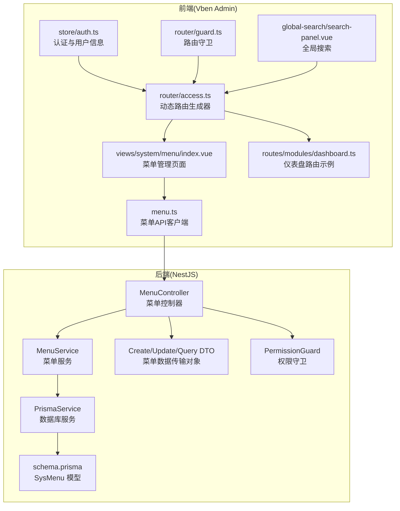
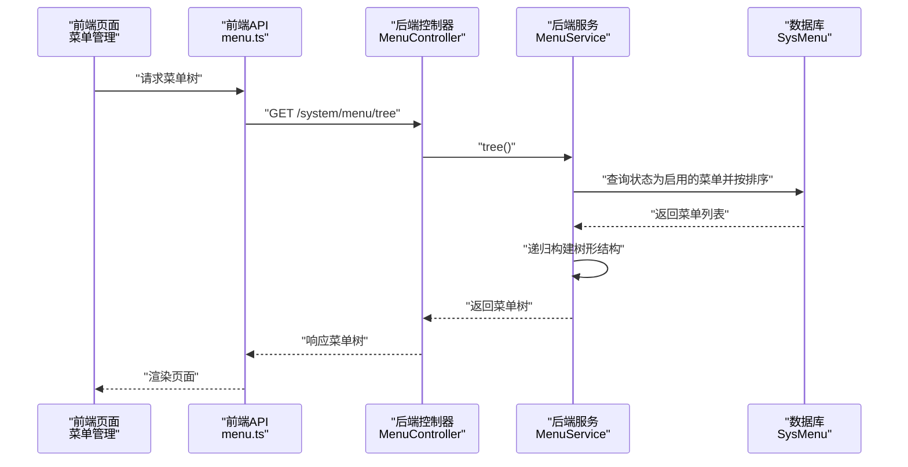
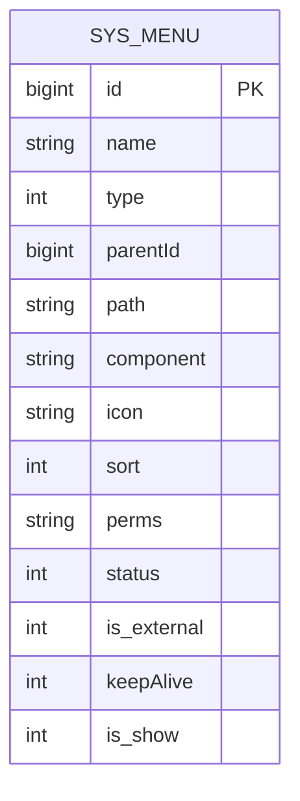
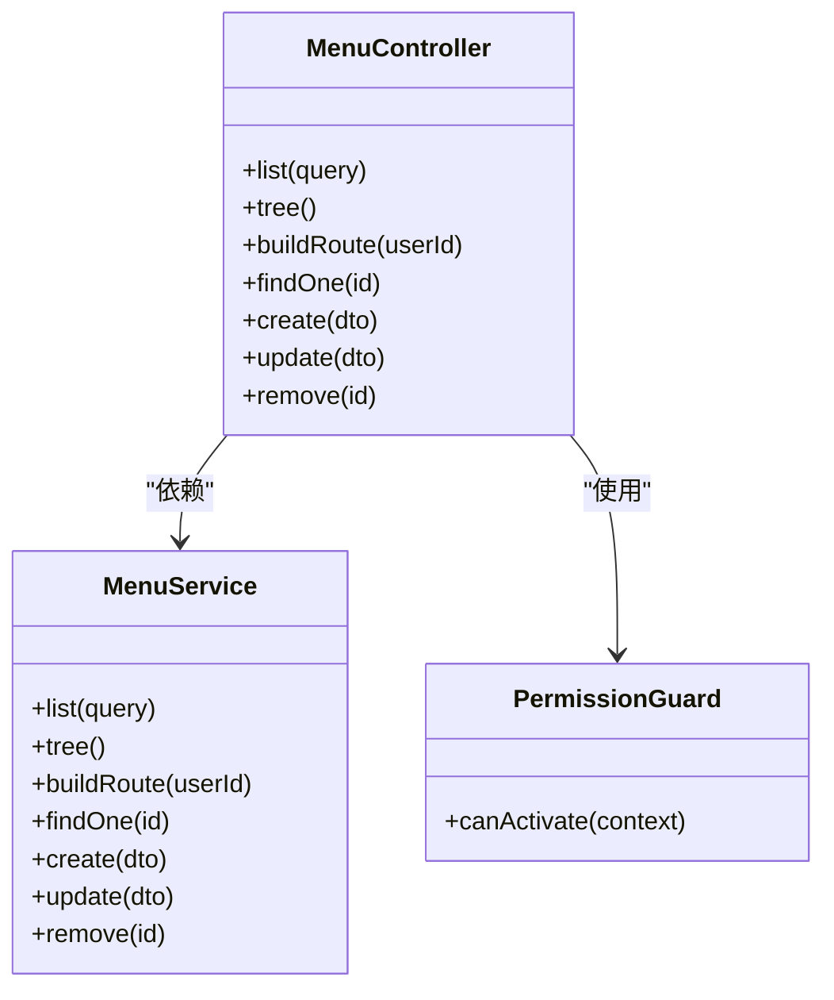
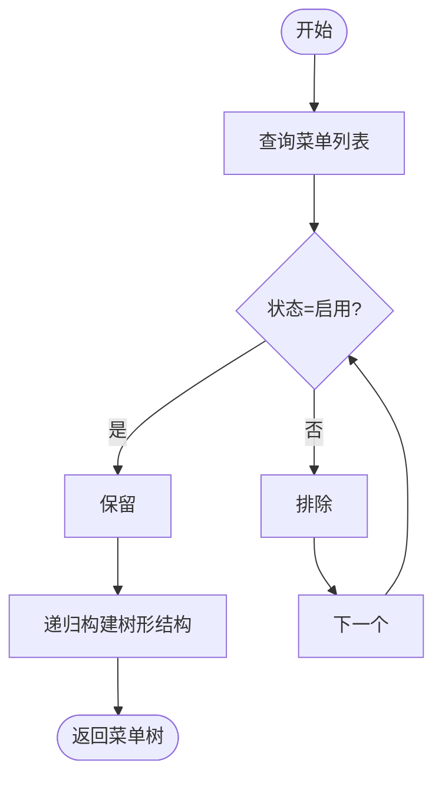
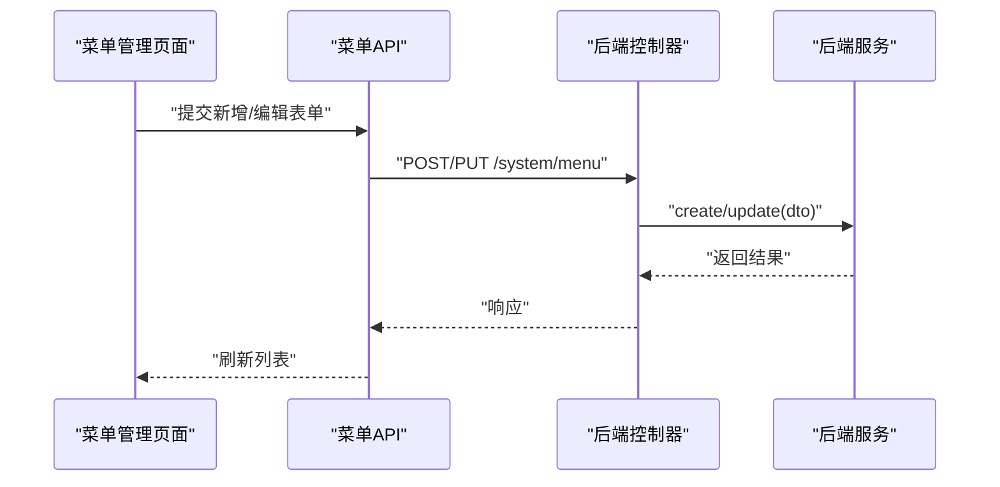
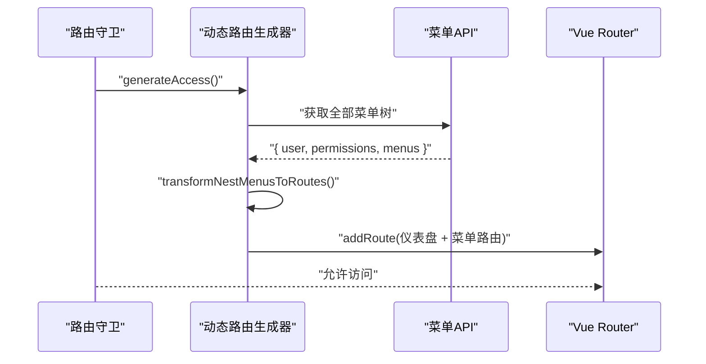
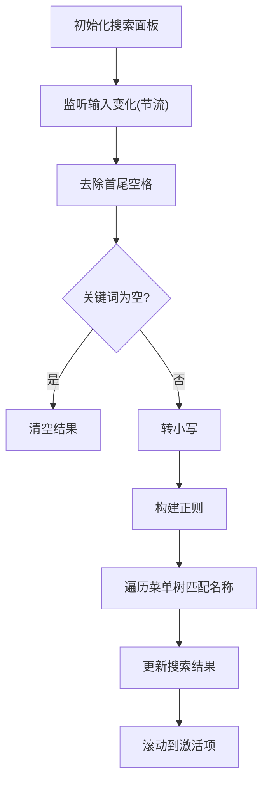
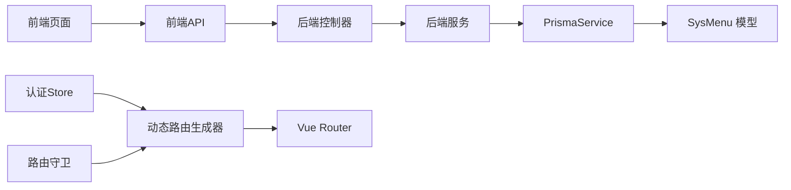

# 菜单管理

<cite>
**本文引用的文件**
- [apps/backend/src/modules/system/menu/menu.controller.ts](file://apps/backend/src/modules/system/menu/menu.controller.ts)
- [apps/backend/src/modules/system/menu/menu.service.ts](file://apps/backend/src/modules/system/menu/menu.service.ts)
- [apps/backend/src/modules/system/menu/dto/menu.dto.ts](file://apps/backend/src/modules/system/menu/dto/menu.dto.ts)
- [apps/backend/src/modules/system/menu/menu.module.ts](file://apps/backend/src/modules/system/menu/menu.module.ts)
- [apps/backend/src/auth/guards.ts](file://apps/backend/src/auth/guards.ts)
- [apps/backend/src/common/prisma.service.ts](file://apps/backend/src/common/prisma.service.ts)
- [apps/backend/prisma/schema.prisma](file://apps/backend/prisma/schema.prisma)
- [apps/vben-admin/apps/web-antd/src/api/system/menu.ts](file://apps/vben-admin/apps/web-antd/src/api/system/menu.ts)
- [apps/vben-admin/apps/web-antd/src/views/system/menu/index.vue](file://apps/vben-admin/apps/web-antd/src/views/system/menu/index.vue)
- [apps/vben-admin/apps/web-antd/src/router/access.ts](file://apps/vben-admin/apps/web-antd/src/router/access.ts)
- [apps/vben-admin/apps/web-antd/src/router/guard.ts](file://apps/vben-admin/apps/web-antd/src/router/guard.ts)
- [apps/vben-admin/apps/web-antd/src/store/auth.ts](file://apps/vben-admin/apps/web-antd/src/store/auth.ts)
- [apps/vben-admin/apps/web-antd/src/router/routes/modules/dashboard.ts](file://apps/vben-admin/apps/web-antd/src/router/routes/modules/dashboard.ts)
- [apps/vben-admin/packages/effects/layouts/src/widgets/global-search/search-panel.vue](file://apps/vben-admin/packages/effects/layouts/src/widgets/global-search/search-panel.vue)
</cite>

## 目录
1. [简介](#简介)
2. [项目结构](#项目结构)
3. [核心组件](#核心组件)
4. [架构总览](#架构总览)
5. [详细组件分析](#详细组件分析)
6. [依赖关系分析](#依赖关系分析)
7. [性能考量](#性能考量)
8. [故障排查指南](#故障排查指南)
9. [结论](#结论)
10. [附录](#附录)

## 简介
本文件系统性梳理“菜单管理”模块的设计与实现，覆盖后端菜单树形结构的 CRUD 接口、菜单数据模型、权限校验、动态菜单生成与前端路由映射、以及菜单搜索等实用特性。文档面向不同层次读者，既提供高层架构视图，也给出代码级的类图、时序图与流程图，帮助快速理解与落地。

## 项目结构
菜单管理涉及后端 NestJS 模块与前端 Vben Admin 前端应用两部分：
- 后端：系统模块下的菜单子模块，包含控制器、服务、DTO、模块装配与数据库模型定义。
- 前端：菜单管理页面、菜单 API 客户端、路由守卫与动态路由生成器、全局搜索等。

图表来源
- [apps/backend/src/modules/system/menu/menu.controller.ts:1-67](file://apps/backend/src/modules/system/menu/menu.controller.ts#L1-L67)
- [apps/backend/src/modules/system/menu/menu.service.ts:1-95](file://apps/backend/src/modules/system/menu/menu.service.ts#L1-L95)
- [apps/backend/src/modules/system/menu/dto/menu.dto.ts:1-41](file://apps/backend/src/modules/system/menu/dto/menu.dto.ts#L1-L41)
- [apps/backend/src/common/prisma.service.ts:1-22](file://apps/backend/src/common/prisma.service.ts#L1-L22)
- [apps/backend/prisma/schema.prisma:92-116](file://apps/backend/prisma/schema.prisma#L92-L116)
- [apps/vben-admin/apps/web-antd/src/api/system/menu.ts:1-44](file://apps/vben-admin/apps/web-antd/src/api/system/menu.ts#L1-L44)
- [apps/vben-admin/apps/web-antd/src/views/system/menu/index.vue:1-151](file://apps/vben-admin/apps/web-antd/src/views/system/menu/index.vue#L1-L151)
- [apps/vben-admin/apps/web-antd/src/router/access.ts:1-190](file://apps/vben-admin/apps/web-antd/src/router/access.ts#L1-L190)
- [apps/vben-admin/apps/web-antd/src/router/guard.ts:1-134](file://apps/vben-admin/apps/web-antd/src/router/guard.ts#L1-L134)
- [apps/vben-admin/apps/web-antd/src/store/auth.ts:1-137](file://apps/vben-admin/apps/web-antd/src/store/auth.ts#L1-L137)
- [apps/vben-admin/apps/web-antd/src/router/routes/modules/dashboard.ts:1-39](file://apps/vben-admin/apps/web-antd/src/router/routes/modules/dashboard.ts#L1-L39)
- [apps/vben-admin/packages/effects/layouts/src/widgets/global-search/search-panel.vue:1-95](file://apps/vben-admin/packages/effects/layouts/src/widgets/global-search/search-panel.vue#L1-L95)

章节来源
- [apps/backend/src/modules/system/menu/menu.controller.ts:1-67](file://apps/backend/src/modules/system/menu/menu.controller.ts#L1-L67)
- [apps/backend/src/modules/system/menu/menu.service.ts:1-95](file://apps/backend/src/modules/system/menu/menu.service.ts#L1-L95)
- [apps/backend/src/modules/system/menu/menu.module.ts:1-10](file://apps/backend/src/modules/system/menu/menu.module.ts#L1-L10)
- [apps/backend/src/auth/guards.ts:1-51](file://apps/backend/src/auth/guards.ts#L1-L51)
- [apps/backend/src/common/prisma.service.ts:1-22](file://apps/backend/src/common/prisma.service.ts#L1-L22)
- [apps/backend/prisma/schema.prisma:92-116](file://apps/backend/prisma/schema.prisma#L92-L116)
- [apps/vben-admin/apps/web-antd/src/api/system/menu.ts:1-44](file://apps/vben-admin/apps/web-antd/src/api/system/menu.ts#L1-L44)
- [apps/vben-admin/apps/web-antd/src/views/system/menu/index.vue:1-151](file://apps/vben-admin/apps/web-antd/src/views/system/menu/index.vue#L1-L151)
- [apps/vben-admin/apps/web-antd/src/router/access.ts:1-190](file://apps/vben-admin/apps/web-antd/src/router/access.ts#L1-L190)
- [apps/vben-admin/apps/web-antd/src/router/guard.ts:1-134](file://apps/vben-admin/apps/web-antd/src/router/guard.ts#L1-L134)
- [apps/vben-admin/apps/web-antd/src/store/auth.ts:1-137](file://apps/vben-admin/apps/web-antd/src/store/auth.ts#L1-L137)
- [apps/vben-admin/apps/web-antd/src/router/routes/modules/dashboard.ts:1-39](file://apps/vben-admin/apps/web-antd/src/router/routes/modules/dashboard.ts#L1-L39)
- [apps/vben-admin/packages/effects/layouts/src/widgets/global-search/search-panel.vue:1-95](file://apps/vben-admin/packages/effects/layouts/src/widgets/global-search/search-panel.vue#L1-L95)

## 核心组件
- 后端菜单控制器：提供菜单列表、树形结构、按用户构建路由、查询单个菜单、创建、更新、删除等接口，并通过 JWT 与权限守卫保护。
- 菜单服务：封装查询、树形构建、按用户权限过滤、增删改逻辑；使用 Prisma 访问 SysMenu 表。
- DTO：定义创建、更新、查询菜单的数据结构与校验规则。
- 前端菜单 API 客户端：封装 /system/menu 的 GET/POST/PUT/DELETE 请求。
- 前端菜单管理页面：表格展示、表单编辑、新增/编辑/删除交互。
- 动态路由生成器：将后端返回的菜单树转换为前端路由，支持 keepAlive、隐藏、权限标识等元信息映射。
- 路由守卫：在首次访问时生成动态路由，注入可访问菜单与路由，并处理登录态与重定向。
- 全局搜索：基于菜单树进行名称匹配，支持历史记录与键盘导航。

章节来源
- [apps/backend/src/modules/system/menu/menu.controller.ts:1-67](file://apps/backend/src/modules/system/menu/menu.controller.ts#L1-L67)
- [apps/backend/src/modules/system/menu/menu.service.ts:1-95](file://apps/backend/src/modules/system/menu/menu.service.ts#L1-L95)
- [apps/backend/src/modules/system/menu/dto/menu.dto.ts:1-41](file://apps/backend/src/modules/system/menu/dto/menu.dto.ts#L1-L41)
- [apps/vben-admin/apps/web-antd/src/api/system/menu.ts:1-44](file://apps/vben-admin/apps/web-antd/src/api/system/menu.ts#L1-L44)
- [apps/vben-admin/apps/web-antd/src/views/system/menu/index.vue:1-151](file://apps/vben-admin/apps/web-antd/src/views/system/menu/index.vue#L1-L151)
- [apps/vben-admin/apps/web-antd/src/router/access.ts:1-190](file://apps/vben-admin/apps/web-antd/src/router/access.ts#L1-L190)
- [apps/vben-admin/apps/web-antd/src/router/guard.ts:1-134](file://apps/vben-admin/apps/web-antd/src/router/guard.ts#L1-L134)
- [apps/vben-admin/packages/effects/layouts/src/widgets/global-search/search-panel.vue:1-95](file://apps/vben-admin/packages/effects/layouts/src/widgets/global-search/search-panel.vue#L1-L95)

## 架构总览
后端采用模块化设计，菜单模块通过控制器暴露 REST 接口，服务层负责业务逻辑与数据访问，Prisma 提供 ORM 能力。前端通过 API 客户端调用后端接口，路由守卫在鉴权后拉取菜单树并生成动态路由，最终渲染为侧边栏与面包屑等 UI。

图表来源
- [apps/backend/src/modules/system/menu/menu.controller.ts:24-29](file://apps/backend/src/modules/system/menu/menu.controller.ts#L24-L29)
- [apps/backend/src/modules/system/menu/menu.service.ts:19-25](file://apps/backend/src/modules/system/menu/menu.service.ts#L19-L25)
- [apps/vben-admin/apps/web-antd/src/api/system/menu.ts:25-27](file://apps/vben-admin/apps/web-antd/src/api/system/menu.ts#L25-L27)

章节来源
- [apps/backend/src/modules/system/menu/menu.controller.ts:1-67](file://apps/backend/src/modules/system/menu/menu.controller.ts#L1-L67)
- [apps/backend/src/modules/system/menu/menu.service.ts:1-95](file://apps/backend/src/modules/system/menu/menu.service.ts#L1-L95)
- [apps/vben-admin/apps/web-antd/src/api/system/menu.ts:1-44](file://apps/vben-admin/apps/web-antd/src/api/system/menu.ts#L1-L44)

## 详细组件分析

### 数据模型与字段说明
- SysMenu 模型字段（来源于 Prisma Schema）：
  - id、name、type、parentId、path、component、icon、sort、perms、status、external、keepAlive、show
- 字段语义要点：
  - type：菜单类型（目录/菜单/按钮），用于前端路由与权限区分
  - status：启用/禁用，影响菜单树构建与路由生成
  - external：外链标识
  - keepAlive：是否缓存组件
  - show：是否显示在菜单中
  - perms：权限标识，用于前端访问控制
  - parentId：父级菜单，支撑树形结构
  - sort：排序，决定菜单顺序

图表来源
- [apps/backend/prisma/schema.prisma:92-116](file://apps/backend/prisma/schema.prisma#L92-L116)

章节来源
- [apps/backend/prisma/schema.prisma:92-116](file://apps/backend/prisma/schema.prisma#L92-L116)

### 后端控制器与权限守卫
- 控制器暴露以下接口：
  - GET /system/menu/list：按条件查询并返回树形菜单
  - GET /system/menu/tree：返回启用状态的菜单树
  - GET /system/menu/build-route：按用户构建其可访问的菜单树
  - GET /system/menu/:id：查询单个菜单
  - POST /system/menu：创建菜单
  - PUT /system/menu：更新菜单
  - DELETE /system/menu/:id：删除菜单
- 权限守卫：
  - 使用 JWT 与 PermissionGuard 组合，接口通过 RequirePermission 注解声明所需权限
  - 未携带有效令牌或缺少权限时拒绝访问

图表来源
- [apps/backend/src/modules/system/menu/menu.controller.ts:1-67](file://apps/backend/src/modules/system/menu/menu.controller.ts#L1-L67)
- [apps/backend/src/modules/system/menu/menu.service.ts:1-95](file://apps/backend/src/modules/system/menu/menu.service.ts#L1-L95)
- [apps/backend/src/auth/guards.ts:36-51](file://apps/backend/src/auth/guards.ts#L36-L51)

章节来源
- [apps/backend/src/modules/system/menu/menu.controller.ts:1-67](file://apps/backend/src/modules/system/menu/menu.controller.ts#L1-L67)
- [apps/backend/src/auth/guards.ts:1-51](file://apps/backend/src/auth/guards.ts#L1-L51)

### 菜单服务与树形构建
- 查询与过滤：
  - 支持按名称模糊、类型、状态过滤
  - 默认按 sort 升序、id 升序排序
- 树形构建：
  - 通过递归筛选 parentId 匹配的节点，构建 children 结构
- 按用户构建路由：
  - 读取用户角色的 menuIds，去重后查询菜单
  - 过滤状态启用且类型不超过菜单（type<=2）的菜单
  - 返回树形结构供前端生成路由

图表来源
- [apps/backend/src/modules/system/menu/menu.service.ts:9-25](file://apps/backend/src/modules/system/menu/menu.service.ts#L9-L25)

章节来源
- [apps/backend/src/modules/system/menu/menu.service.ts:1-95](file://apps/backend/src/modules/system/menu/menu.service.ts#L1-L95)

### 前端菜单 API 与页面
- API 客户端：
  - 提供 getMenuList、getMenuTree、getMenuDetail、createMenu、updateMenu、deleteMenu 方法
- 菜单管理页面：
  - 表格展示菜单列表，支持新增、编辑、删除
  - 表单字段覆盖菜单类型、名称、上级菜单、路径、组件、权限标识、图标、排序、状态、显示、缓存等
  - 使用 TreeSelect 展示上级菜单树

图表来源
- [apps/vben-admin/apps/web-antd/src/api/system/menu.ts:21-43](file://apps/vben-admin/apps/web-antd/src/api/system/menu.ts#L21-L43)
- [apps/vben-admin/apps/web-antd/src/views/system/menu/index.vue:25-64](file://apps/vben-admin/apps/web-antd/src/views/system/menu/index.vue#L25-L64)

章节来源
- [apps/vben-admin/apps/web-antd/src/api/system/menu.ts:1-44](file://apps/vben-admin/apps/web-antd/src/api/system/menu.ts#L1-L44)
- [apps/vben-admin/apps/web-antd/src/views/system/menu/index.vue:1-151](file://apps/vben-admin/apps/web-antd/src/views/system/menu/index.vue#L1-L151)

### 动态菜单生成与路由映射
- 路由生成器：
  - 从后端获取菜单树，将 type=3 的按钮过滤掉
  - 目录映射为 BasicLayout，菜单映射为组件路径字符串
  - 将 icon、perms、keepAlive、hideInMenu 等映射为路由 meta
  - 追加仪表盘路由作为首页入口
- 路由守卫：
  - 在首次访问时生成动态路由，保存可访问菜单与路由
  - 处理登录态、重定向与页面加载进度

图表来源
- [apps/vben-admin/apps/web-antd/src/router/guard.ts:98-119](file://apps/vben-admin/apps/web-antd/src/router/guard.ts#L98-L119)
- [apps/vben-admin/apps/web-antd/src/router/access.ts:162-187](file://apps/vben-admin/apps/web-antd/src/router/access.ts#L162-L187)
- [apps/vben-admin/apps/web-antd/src/router/routes/modules/dashboard.ts:1-39](file://apps/vben-admin/apps/web-antd/src/router/routes/modules/dashboard.ts#L1-L39)

章节来源
- [apps/vben-admin/apps/web-antd/src/router/access.ts:1-190](file://apps/vben-admin/apps/web-antd/src/router/access.ts#L1-L190)
- [apps/vben-admin/apps/web-antd/src/router/guard.ts:1-134](file://apps/vben-admin/apps/web-antd/src/router/guard.ts#L1-L134)
- [apps/vben-admin/apps/web-antd/src/router/routes/modules/dashboard.ts:1-39](file://apps/vben-admin/apps/web-antd/src/router/routes/modules/dashboard.ts#L1-L39)

### 菜单搜索功能
- 全局搜索面板：
  - 从菜单树遍历名称进行正则匹配
  - 支持历史记录、节流搜索、键盘上下导航自动滚动
  - 可直接跳转到匹配的菜单项

图表来源
- [apps/vben-admin/packages/effects/layouts/src/widgets/global-search/search-panel.vue:46-83](file://apps/vben-admin/packages/effects/layouts/src/widgets/global-search/search-panel.vue#L46-L83)

章节来源
- [apps/vben-admin/packages/effects/layouts/src/widgets/global-search/search-panel.vue:1-95](file://apps/vben-admin/packages/effects/layouts/src/widgets/global-search/search-panel.vue#L1-L95)

### 业务场景示例
- 菜单权限分配：
  - 在角色管理中维护 menuIds（后端 SysRole.menuIds 字段存储菜单ID集合）
  - 通过 MenuService.buildRoute(userId) 汇总用户所有菜单ID，过滤启用且类型<=2的菜单，返回树形结构
- 菜单层级调整：
  - 修改 parentId 即可调整父子关系；前端 TreeSelect 支持选择上级菜单
- 菜单显示隐藏控制：
  - 通过 show 字段控制是否显示；前端路由 meta.hideInMenu 与菜单树 is_show 字段对应

章节来源
- [apps/backend/src/modules/system/menu/menu.service.ts:34-55](file://apps/backend/src/modules/system/menu/menu.service.ts#L34-L55)
- [apps/backend/prisma/schema.prisma:40-56](file://apps/backend/prisma/schema.prisma#L40-L56)
- [apps/vben-admin/apps/web-antd/src/views/system/menu/index.vue:103-113](file://apps/vben-admin/apps/web-antd/src/views/system/menu/index.vue#L103-L113)

## 依赖关系分析
- 控制器依赖服务，服务依赖 Prisma 访问 SysMenu
- 前端页面依赖 API 客户端，API 客户端依赖后端控制器
- 路由守卫依赖动态路由生成器，后者依赖菜单 API
- 权限守卫通过 RequirePermission 注解与控制器方法绑定

图表来源
- [apps/backend/src/modules/system/menu/menu.controller.ts:1-67](file://apps/backend/src/modules/system/menu/menu.controller.ts#L1-L67)
- [apps/backend/src/modules/system/menu/menu.service.ts:1-95](file://apps/backend/src/modules/system/menu/menu.service.ts#L1-L95)
- [apps/backend/src/common/prisma.service.ts:1-22](file://apps/backend/src/common/prisma.service.ts#L1-L22)
- [apps/backend/prisma/schema.prisma:92-116](file://apps/backend/prisma/schema.prisma#L92-L116)
- [apps/vben-admin/apps/web-antd/src/api/system/menu.ts:1-44](file://apps/vben-admin/apps/web-antd/src/api/system/menu.ts#L1-L44)
- [apps/vben-admin/apps/web-antd/src/router/access.ts:1-190](file://apps/vben-admin/apps/web-antd/src/router/access.ts#L1-L190)
- [apps/vben-admin/apps/web-antd/src/router/guard.ts:1-134](file://apps/vben-admin/apps/web-antd/src/router/guard.ts#L1-L134)

章节来源
- [apps/backend/src/modules/system/menu/menu.controller.ts:1-67](file://apps/backend/src/modules/system/menu/menu.controller.ts#L1-L67)
- [apps/backend/src/modules/system/menu/menu.service.ts:1-95](file://apps/backend/src/modules/system/menu/menu.service.ts#L1-L95)
- [apps/backend/src/common/prisma.service.ts:1-22](file://apps/backend/src/common/prisma.service.ts#L1-L22)
- [apps/backend/prisma/schema.prisma:92-116](file://apps/backend/prisma/schema.prisma#L92-L116)
- [apps/vben-admin/apps/web-antd/src/api/system/menu.ts:1-44](file://apps/vben-admin/apps/web-antd/src/api/system/menu.ts#L1-L44)
- [apps/vben-admin/apps/web-antd/src/router/access.ts:1-190](file://apps/vben-admin/apps/web-antd/src/router/access.ts#L1-L190)
- [apps/vben-admin/apps/web-antd/src/router/guard.ts:1-134](file://apps/vben-admin/apps/web-antd/src/router/guard.ts#L1-L134)

## 性能考量
- 树形构建复杂度：递归构建树形结构的时间复杂度为 O(n)，其中 n 为菜单数量；建议在后端分页或限制最大层级以避免超大菜单树导致的渲染压力。
- 数据库查询：按 parentId、sort、perms 建立索引有助于提升查询效率；对于高频访问的菜单树，可在服务层增加内存缓存（例如基于 Redis 的菜单树缓存）。
- 前端渲染：TreeSelect 与表格渲染大量节点时，建议开启虚拟滚动与懒加载；搜索面板使用节流与正则匹配，避免频繁全量遍历。
- 路由生成：仅在首次登录或切换角色时生成动态路由，避免重复计算；可将生成结果持久化至 Store，减少重复请求。

## 故障排查指南
- 删除菜单失败：
  - 若存在子菜单，服务层会抛出错误阻止删除；请先删除子菜单或调整层级后再试。
- 权限不足：
  - 控制器方法均标注 RequirePermission，若提示无权限，请确认用户角色是否包含对应 perms。
- 路由不生效：
  - 确认路由守卫已生成动态路由并注入；检查后端返回的菜单树中 type 是否为 3（按钮）以外的类型。
- 菜单不显示：
  - 检查 show 字段与 keepAlive 字段是否符合预期；前端 meta.hideInMenu 与 is_show 对应。

章节来源
- [apps/backend/src/modules/system/menu/menu.service.ts:88-93](file://apps/backend/src/modules/system/menu/menu.service.ts#L88-L93)
- [apps/backend/src/auth/guards.ts:36-51](file://apps/backend/src/auth/guards.ts#L36-L51)
- [apps/vben-admin/apps/web-antd/src/router/guard.ts:88-119](file://apps/vben-admin/apps/web-antd/src/router/guard.ts#L88-L119)

## 结论
菜单管理模块通过清晰的后端控制器与服务、严谨的 DTO 校验、完善的权限守卫与前端动态路由生成，实现了菜单的树形结构管理与权限控制。结合搜索、显示控制与缓存策略，能够满足复杂后台系统的菜单需求。建议在生产环境中引入菜单树缓存与前端虚拟化渲染，进一步优化性能与用户体验。

## 附录
- 菜单类型对照：1=目录、2=菜单、3=按钮
- 常用权限标识：system:menu:list、system:menu:create、system:menu:update、system:menu:delete
- 前端路由元信息映射：
  - icon：图标名称映射
  - authority：权限标识数组
  - keepAlive：是否缓存
  - hideInMenu：是否隐藏
  - order：排序权重