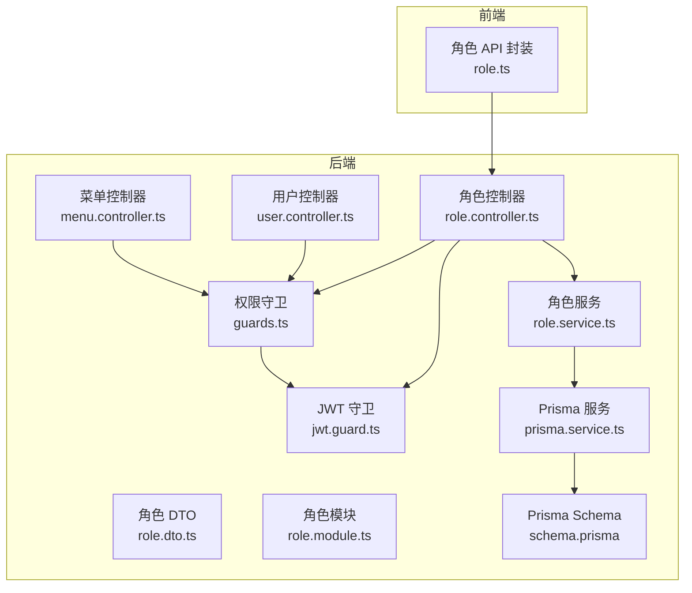
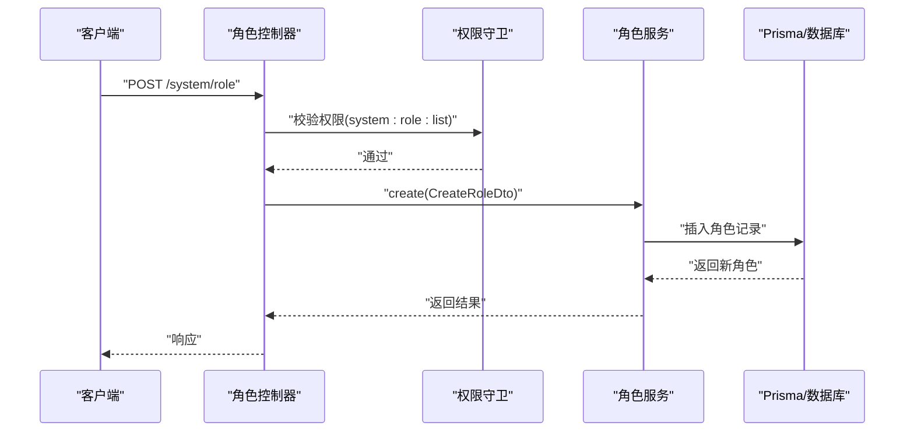
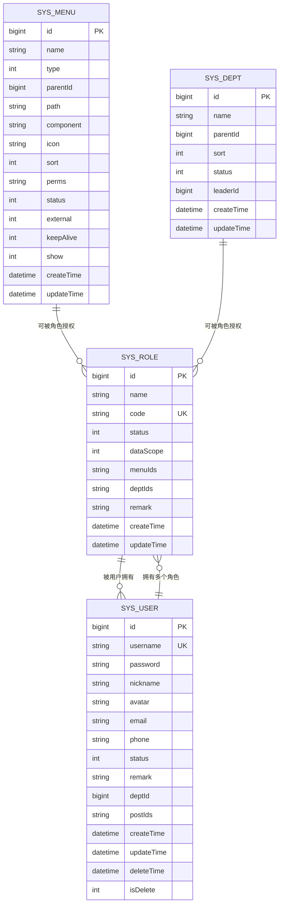
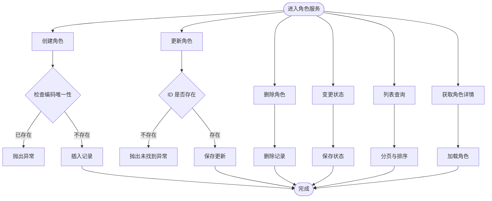
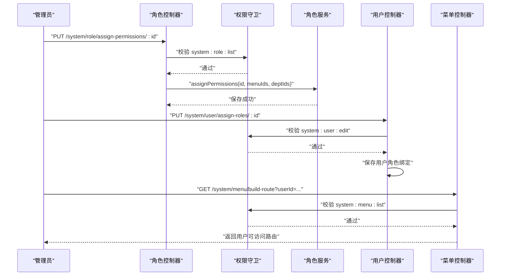
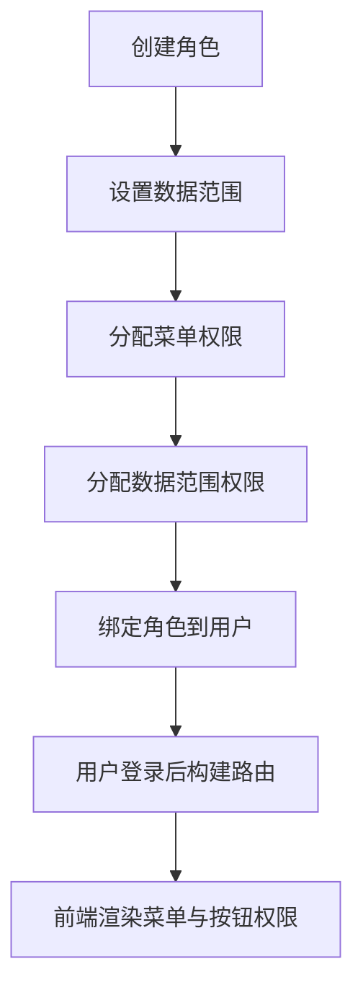
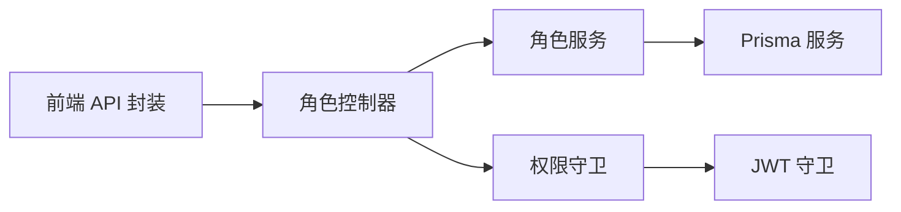

# 角色管理

<cite>
**本文引用的文件**
- [apps/backend/src/modules/system/role/role.controller.ts](file://apps/backend/src/modules/system/role/role.controller.ts)
- [apps/backend/src/modules/system/role/role.service.ts](file://apps/backend/src/modules/system/role/role.service.ts)
- [apps/backend/src/modules/system/role/dto/role.dto.ts](file://apps/backend/src/modules/system/role/dto/role.dto.ts)
- [apps/backend/src/modules/system/role/role.module.ts](file://apps/backend/src/modules/system/role/role.module.ts)
- [apps/backend/src/modules/system/user/user.controller.ts](file://apps/backend/src/modules/system/user/user.controller.ts)
- [apps/backend/src/modules/system/menu/menu.controller.ts](file://apps/backend/src/modules/system/menu/menu.controller.ts)
- [apps/backend/src/auth/guards.ts](file://apps/backend/src/auth/guards.ts)
- [apps/backend/src/auth/jwt.guard.ts](file://apps/backend/src/auth/jwt.guard.ts)
- [apps/backend/src/common/prisma.service.ts](file://apps/backend/src/common/prisma.service.ts)
- [apps/backend/prisma/schema.prisma](file://apps/backend/prisma/schema.prisma)
- [apps/vben-admin/apps/web-antd/src/api/system/role.ts](file://apps/vben-admin/apps/web-antd/src/api/system/role.ts)
</cite>

## 目录
1. [简介](#简介)
2. [项目结构](#项目结构)
3. [核心组件](#核心组件)
4. [架构总览](#架构总览)
5. [详细组件分析](#详细组件分析)
6. [依赖分析](#依赖分析)
7. [性能考虑](#性能考虑)
8. [故障排查指南](#故障排查指南)
9. [结论](#结论)
10. [附录](#附录)

## 简介
本章节概述角色管理模块的目标与范围：围绕角色的增删改查、角色状态变更、角色权限分配（菜单权限与数据范围）进行设计与实现，并结合 RBAC 权限模型，说明菜单权限、按钮权限、数据范围权限的配置方式与使用流程。同时给出角色与用户绑定、角色与菜单关联、数据权限设置的完整示例流程，以及权限验证机制、权限继承关系与权限缓存策略的技术实现要点。

## 项目结构
角色管理模块位于后端 NestJS 应用的系统模块中，采用按功能分层的组织方式：
- 控制器层：提供 REST 接口，负责请求路由与鉴权守卫
- 服务层：封装业务逻辑，处理数据持久化与查询
- DTO 层：定义输入输出的数据传输对象
- 数据模型：基于 Prisma 的 schema 定义，包含 SysRole、SysUser、SysMenu 等实体
- 前端对接：通过 API 文件与前端页面交互

图表来源
- [apps/backend/src/modules/system/role/role.controller.ts:1-80](file://apps/backend/src/modules/system/role/role.controller.ts#L1-L80)
- [apps/backend/src/modules/system/role/role.service.ts:1-80](file://apps/backend/src/modules/system/role/role.service.ts#L1-L80)
- [apps/backend/src/modules/system/role/dto/role.dto.ts:1-38](file://apps/backend/src/modules/system/role/dto/role.dto.ts#L1-L38)
- [apps/backend/src/modules/system/role/role.module.ts:1-10](file://apps/backend/src/modules/system/role/role.module.ts#L1-L10)
- [apps/backend/src/modules/system/user/user.controller.ts:1-89](file://apps/backend/src/modules/system/user/user.controller.ts#L1-L89)
- [apps/backend/src/modules/system/menu/menu.controller.ts:1-67](file://apps/backend/src/modules/system/menu/menu.controller.ts#L1-L67)
- [apps/backend/src/auth/guards.ts:1-51](file://apps/backend/src/auth/guards.ts#L1-L51)
- [apps/backend/src/auth/jwt.guard.ts:1-5](file://apps/backend/src/auth/jwt.guard.ts#L1-L5)
- [apps/backend/src/common/prisma.service.ts:1-22](file://apps/backend/src/common/prisma.service.ts#L1-L22)
- [apps/backend/prisma/schema.prisma:40-56](file://apps/backend/prisma/schema.prisma#L40-L56)
- [apps/vben-admin/apps/web-antd/src/api/system/role.ts](file://apps/vben-admin/apps/web-antd/src/api/system/role.ts)

章节来源
- [apps/backend/src/modules/system/role/role.controller.ts:1-80](file://apps/backend/src/modules/system/role/role.controller.ts#L1-L80)
- [apps/backend/src/modules/system/role/role.service.ts:1-80](file://apps/backend/src/modules/system/role/role.service.ts#L1-L80)
- [apps/backend/src/modules/system/role/dto/role.dto.ts:1-38](file://apps/backend/src/modules/system/role/dto/role.dto.ts#L1-L38)
- [apps/backend/src/modules/system/role/role.module.ts:1-10](file://apps/backend/src/modules/system/role/role.module.ts#L1-L10)
- [apps/backend/src/modules/system/user/user.controller.ts:1-89](file://apps/backend/src/modules/system/user/user.controller.ts#L1-L89)
- [apps/backend/src/modules/system/menu/menu.controller.ts:1-67](file://apps/backend/src/modules/system/menu/menu.controller.ts#L1-L67)
- [apps/backend/src/auth/guards.ts:1-51](file://apps/backend/src/auth/guards.ts#L1-L51)
- [apps/backend/src/auth/jwt.guard.ts:1-5](file://apps/backend/src/auth/jwt.guard.ts#L1-L5)
- [apps/backend/src/common/prisma.service.ts:1-22](file://apps/backend/src/common/prisma.service.ts#L1-L22)
- [apps/backend/prisma/schema.prisma:40-56](file://apps/backend/prisma/schema.prisma#L40-L56)
- [apps/vben-admin/apps/web-antd/src/api/system/role.ts](file://apps/vben-admin/apps/web-antd/src/api/system/role.ts)

## 核心组件
- 角色控制器：提供角色列表、创建、更新、删除、状态变更、权限分配、菜单查询等接口；统一使用 JWT 与权限守卫
- 角色服务：封装角色 CRUD、状态变更、权限分配、菜单查询等业务逻辑；基于 Prisma 进行数据访问
- 角色 DTO：定义创建、更新、查询、权限分配的输入参数校验规则
- 角色模块：装配控制器与服务，导出服务供其他模块使用
- 权限守卫：RequirePermission 注解用于声明所需权限；PermissionGuard 校验当前用户是否具备所需权限
- 数据模型：SysRole 包含角色编码、角色名称、状态、数据范围、菜单与部门权限集合等字段

章节来源
- [apps/backend/src/modules/system/role/role.controller.ts:11-80](file://apps/backend/src/modules/system/role/role.controller.ts#L11-L80)
- [apps/backend/src/modules/system/role/role.service.ts:11-80](file://apps/backend/src/modules/system/role/role.service.ts#L11-L80)
- [apps/backend/src/modules/system/role/dto/role.dto.ts:5-38](file://apps/backend/src/modules/system/role/dto/role.dto.ts#L5-L38)
- [apps/backend/src/modules/system/role/role.module.ts:5-9](file://apps/backend/src/modules/system/role/role.module.ts#L5-L9)
- [apps/backend/src/auth/guards.ts:16-51](file://apps/backend/src/auth/guards.ts#L16-L51)
- [apps/backend/prisma/schema.prisma:40-56](file://apps/backend/prisma/schema.prisma#L40-L56)

## 架构总览
角色管理模块遵循典型的分层架构：
- 表现层：控制器接收请求，调用服务层处理业务
- 业务层：服务层执行领域逻辑，如角色 CRUD、权限分配、状态变更
- 数据访问层：通过 Prisma 访问 MySQL 数据库
- 鉴权层：JWT 守卫与权限守卫确保接口访问安全

图表来源
- [apps/backend/src/modules/system/role/role.controller.ts:24-29](file://apps/backend/src/modules/system/role/role.controller.ts#L24-L29)
- [apps/backend/src/modules/system/role/role.service.ts:36-42](file://apps/backend/src/modules/system/role/role.service.ts#L36-L42)
- [apps/backend/src/auth/guards.ts:36-51](file://apps/backend/src/auth/guards.ts#L36-L51)

## 详细组件分析

### 角色数据模型与字段说明
- 角色实体（SysRole）关键字段
  - 编码（code）：唯一标识，用于区分不同角色
  - 名称（name）：角色显示名称
  - 状态（status）：启用/停用状态
  - 数据范围（dataScope）：控制数据可见范围
  - 菜单权限集合（menuIds）：JSON 字符串存储菜单 ID 列表
  - 部门权限集合（deptIds）：JSON 字符串存储部门 ID 列表
  - 备注（remark）、时间戳（createTime/updateTime）

图表来源
- [apps/backend/prisma/schema.prisma:13-38](file://apps/backend/prisma/schema.prisma#L13-L38)
- [apps/backend/prisma/schema.prisma:40-75](file://apps/backend/prisma/schema.prisma#L40-L75)
- [apps/backend/prisma/schema.prisma:92-116](file://apps/backend/prisma/schema.prisma#L92-L116)

章节来源
- [apps/backend/prisma/schema.prisma:40-56](file://apps/backend/prisma/schema.prisma#L40-L56)

### 角色 CRUD 接口与实现
- 列表查询：支持按名称、编码、状态过滤，分页查询
- 创建角色：校验编码唯一性，默认状态为启用，数据范围默认值可选
- 更新角色：支持更新名称、数据范围、状态
- 删除角色：物理删除
- 状态变更：批量或单个修改状态
- 获取角色详情：按 ID 查询

图表来源
- [apps/backend/src/modules/system/role/role.service.ts:11-80](file://apps/backend/src/modules/system/role/role.service.ts#L11-L80)

章节来源
- [apps/backend/src/modules/system/role/role.controller.ts:17-78](file://apps/backend/src/modules/system/role/role.controller.ts#L17-L78)
- [apps/backend/src/modules/system/role/role.service.ts:11-80](file://apps/backend/src/modules/system/role/role.service.ts#L11-L80)
- [apps/backend/src/modules/system/role/dto/role.dto.ts:5-31](file://apps/backend/src/modules/system/role/dto/role.dto.ts#L5-L31)

### RBAC 权限模型与权限分配
- 菜单权限：角色与菜单通过 menuIds 关联，支持树形菜单构建与路由生成
- 按钮权限：菜单项上的 perms 字段用于标识按钮级权限字符串
- 数据范围权限：角色的 dataScope 字段与 deptIds 字段共同决定数据可见范围
- 权限验证：RequirePermission 注解声明所需权限，PermissionGuard 校验用户权限集合

图表来源
- [apps/backend/src/modules/system/role/role.controller.ts:56-71](file://apps/backend/src/modules/system/role/role.controller.ts#L56-L71)
- [apps/backend/src/modules/system/user/user.controller.ts:79-87](file://apps/backend/src/modules/system/user/user.controller.ts#L79-L87)
- [apps/backend/src/modules/system/menu/menu.controller.ts:31-36](file://apps/backend/src/modules/system/menu/menu.controller.ts#L31-L36)
- [apps/backend/src/auth/guards.ts:16-51](file://apps/backend/src/auth/guards.ts#L16-L51)

章节来源
- [apps/backend/src/modules/system/role/role.controller.ts:56-71](file://apps/backend/src/modules/system/role/role.controller.ts#L56-L71)
- [apps/backend/src/modules/system/user/user.controller.ts:79-87](file://apps/backend/src/modules/system/user/user.controller.ts#L79-L87)
- [apps/backend/src/modules/system/menu/menu.controller.ts:31-36](file://apps/backend/src/modules/system/menu/menu.controller.ts#L31-L36)
- [apps/backend/src/auth/guards.ts:16-51](file://apps/backend/src/auth/guards.ts#L16-L51)
- [apps/backend/prisma/schema.prisma:92-116](file://apps/backend/prisma/schema.prisma#L92-L116)

### 角色权限分配完整流程示例
- 步骤一：创建角色并设置默认数据范围
- 步骤二：为角色分配菜单权限（选择菜单树节点 ID 列表）
- 步骤三：为角色分配数据范围权限（选择部门 ID 列表）
- 步骤四：将角色绑定到用户，使用户获得该角色的所有权限
- 步骤五：前端根据用户可访问菜单构建路由

图表来源
- [apps/backend/src/modules/system/role/role.service.ts:36-42](file://apps/backend/src/modules/system/role/role.service.ts#L36-L42)
- [apps/backend/src/modules/system/role/role.service.ts:64-73](file://apps/backend/src/modules/system/role/role.service.ts#L64-L73)
- [apps/backend/src/modules/system/user/user.controller.ts:79-87](file://apps/backend/src/modules/system/user/user.controller.ts#L79-L87)
- [apps/backend/src/modules/system/menu/menu.controller.ts:31-36](file://apps/backend/src/modules/system/menu/menu.controller.ts#L31-L36)

章节来源
- [apps/backend/src/modules/system/role/role.service.ts:36-73](file://apps/backend/src/modules/system/role/role.service.ts#L36-L73)
- [apps/backend/src/modules/system/user/user.controller.ts:79-87](file://apps/backend/src/modules/system/user/user.controller.ts#L79-L87)
- [apps/backend/src/modules/system/menu/menu.controller.ts:31-36](file://apps/backend/src/modules/system/menu/menu.controller.ts#L31-L36)

### 权限验证机制、继承关系与缓存策略
- 权限验证机制
  - 使用 RequirePermission 声明接口所需权限
  - PermissionGuard 校验当前用户权限集合是否包含所需权限
  - JWT 守卫保证请求携带有效令牌
- 权限继承关系
  - 角色与用户多对多关系：用户继承所拥有的所有角色权限
  - 菜单与按钮权限：菜单项的 perms 字段作为按钮级权限标识
- 权限缓存策略
  - 可在用户登录后将角色与权限信息写入缓存（如 Redis），减少重复查询
  - 当角色或菜单发生变更时，清理对应用户的权限缓存，确保一致性

章节来源
- [apps/backend/src/auth/guards.ts:16-51](file://apps/backend/src/auth/guards.ts#L16-L51)
- [apps/backend/src/auth/jwt.guard.ts:1-5](file://apps/backend/src/auth/jwt.guard.ts#L1-L5)
- [apps/backend/prisma/schema.prisma:30-31](file://apps/backend/prisma/schema.prisma#L30-L31)
- [apps/backend/prisma/schema.prisma:102-102](file://apps/backend/prisma/schema.prisma#L102-L102)

## 依赖分析
- 控制器依赖服务：控制器仅负责路由与鉴权，业务逻辑由服务层承担
- 服务依赖 Prisma：通过 PrismaService 访问数据库，避免直接操作底层连接
- 鉴权依赖守卫：RequirePermission 与 PermissionGuard 提供细粒度权限控制
- 前端依赖 API 封装：前端通过 API 文件调用后端接口

图表来源
- [apps/backend/src/modules/system/role/role.controller.ts:1-14](file://apps/backend/src/modules/system/role/role.controller.ts#L1-L14)
- [apps/backend/src/modules/system/role/role.service.ts:1-9](file://apps/backend/src/modules/system/role/role.service.ts#L1-L9)
- [apps/backend/src/auth/guards.ts:1-17](file://apps/backend/src/auth/guards.ts#L1-L17)
- [apps/backend/src/auth/jwt.guard.ts:1-5](file://apps/backend/src/auth/jwt.guard.ts#L1-L5)
- [apps/backend/src/common/prisma.service.ts:1-22](file://apps/backend/src/common/prisma.service.ts#L1-L22)
- [apps/vben-admin/apps/web-antd/src/api/system/role.ts](file://apps/vben-admin/apps/web-antd/src/api/system/role.ts)

章节来源
- [apps/backend/src/modules/system/role/role.controller.ts:1-14](file://apps/backend/src/modules/system/role/role.controller.ts#L1-L14)
- [apps/backend/src/modules/system/role/role.service.ts:1-9](file://apps/backend/src/modules/system/role/role.service.ts#L1-L9)
- [apps/backend/src/auth/guards.ts:1-17](file://apps/backend/src/auth/guards.ts#L1-L17)
- [apps/backend/src/auth/jwt.guard.ts:1-5](file://apps/backend/src/auth/jwt.guard.ts#L1-L5)
- [apps/backend/src/common/prisma.service.ts:1-22](file://apps/backend/src/common/prisma.service.ts#L1-L22)
- [apps/vben-admin/apps/web-antd/src/api/system/role.ts](file://apps/vben-admin/apps/web-antd/src/api/system/role.ts)

## 性能考虑
- 分页查询：列表接口支持分页，避免一次性加载大量数据
- 索引优化：角色编码、菜单父节点、字典键等字段建立索引，提升查询效率
- JSON 存储：菜单与部门权限以 JSON 字符串存储，简化关联查询但需注意序列化/反序列化开销
- 缓存策略：建议对用户权限集合进行缓存，降低鉴权成本

## 故障排查指南
- 角色编码冲突：创建角色时若编码已存在会抛出异常，需更换唯一编码
- 角色不存在：更新或删除角色时若未找到对应记录会抛出异常
- 权限不足：接口需具备相应权限注解，否则 PermissionGuard 将拒绝访问
- JWT 无效：未携带有效令牌或令牌过期将导致鉴权失败

章节来源
- [apps/backend/src/modules/system/role/role.service.ts:36-56](file://apps/backend/src/modules/system/role/role.service.ts#L36-L56)
- [apps/backend/src/auth/guards.ts:36-51](file://apps/backend/src/auth/guards.ts#L36-L51)
- [apps/backend/src/auth/jwt.guard.ts:1-5](file://apps/backend/src/auth/jwt.guard.ts#L1-L5)

## 结论
角色管理模块通过清晰的分层设计与 RBAC 权限模型，实现了角色的全生命周期管理与灵活的权限分配能力。结合菜单权限、按钮权限与数据范围权限，能够满足复杂业务场景下的权限控制需求。配合鉴权守卫与缓存策略，可在保证安全性的同时提升系统性能。

## 附录
- 前端角色管理页面与 API 封装：前端通过 API 文件调用后端接口，实现角色列表、新增、编辑、删除、状态变更与权限分配等操作

章节来源
- [apps/vben-admin/apps/web-antd/src/api/system/role.ts](file://apps/vben-admin/apps/web-antd/src/api/system/role.ts)