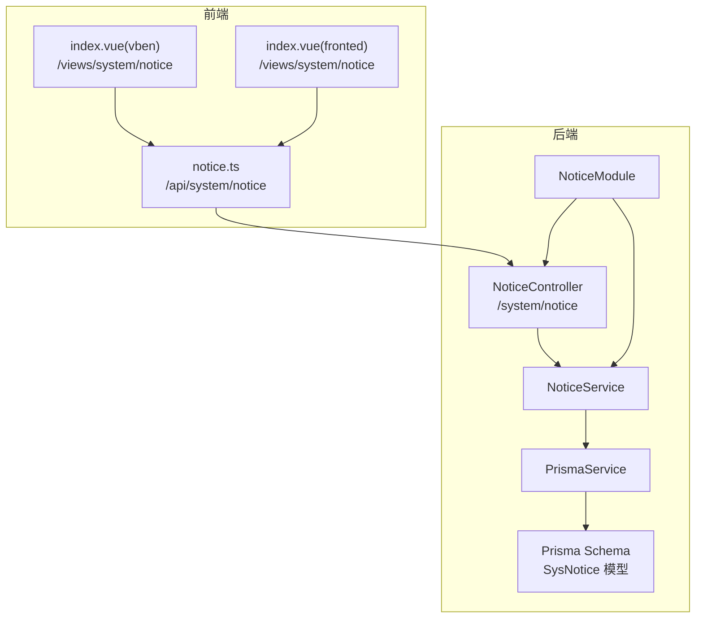
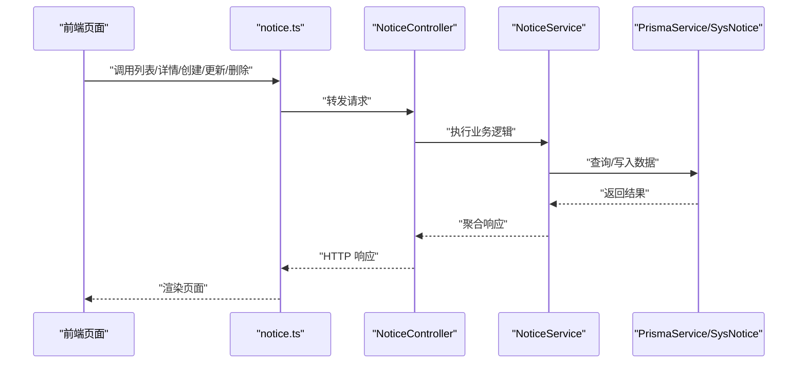
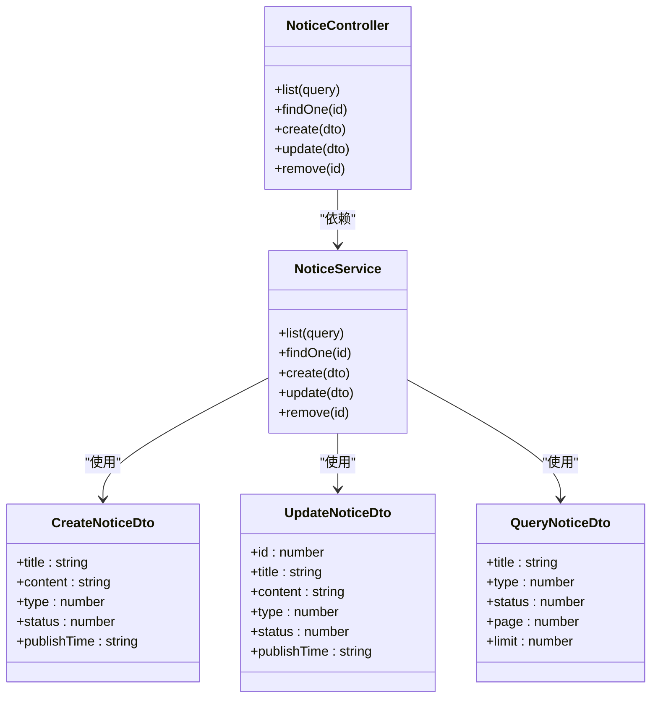
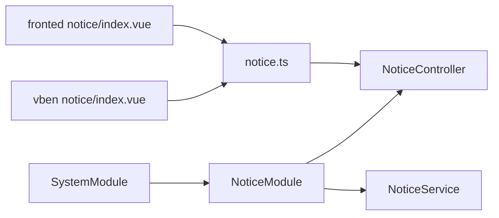
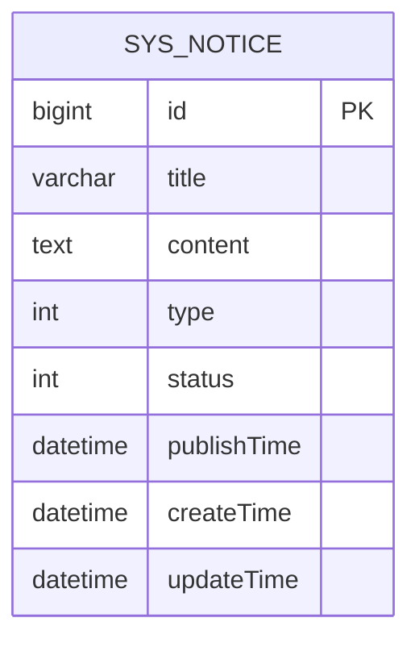

# 通知公告

<cite>
**本文引用的文件**
- [apps/backend/src/modules/system/notice/notice.controller.ts](file://apps/backend/src/modules/system/notice/notice.controller.ts)
- [apps/backend/src/modules/system/notice/notice.service.ts](file://apps/backend/src/modules/system/notice/notice.service.ts)
- [apps/backend/src/modules/system/notice/dto/notice.dto.ts](file://apps/backend/src/modules/system/notice/dto/notice.dto.ts)
- [apps/backend/src/modules/system/notice/notice.module.ts](file://apps/backend/src/modules/system/notice/notice.module.ts)
- [apps/backend/prisma/schema.prisma](file://apps/backend/prisma/schema.prisma)
- [apps/backend/src/modules/system/system.module.ts](file://apps/backend/src/modules/system/system.module.ts)
- [apps/vben-admin/apps/web-antd/src/api/system/notice.ts](file://apps/vben-admin/apps/web-antd/src/api/system/notice.ts)
- [apps/vben-admin/apps/web-antd/src/views/system/notice/index.vue](file://apps/vben-admin/apps/web-antd/src/views/system/notice/index.vue)
- [apps/fronted/src/views/system/notice/index.vue](file://apps/fronted/src/views/system/notice/index.vue)
</cite>

## 目录
1. [简介](#简介)
2. [项目结构](#项目结构)
3. [核心组件](#核心组件)
4. [架构总览](#架构总览)
5. [详细组件分析](#详细组件分析)
6. [依赖关系分析](#依赖关系分析)
7. [性能考量](#性能考量)
8. [故障排查指南](#故障排查指南)
9. [结论](#结论)
10. [附录](#附录)

## 简介
本文件系统性梳理“通知公告”模块的设计与实现，覆盖后端 API 的 CRUD 设计、数据模型定义、前端页面交互、以及可扩展的发布机制与范围控制思路。当前仓库已实现基础的公告增删改查能力，并预留了定时发布时间字段，便于后续扩展“定时发布”“范围控制”“阅读统计”等高级能力。

## 项目结构
通知公告模块在后端采用标准的 NestJS 分层：控制器负责接口暴露与权限校验，服务层封装数据访问逻辑，DTO 负责请求参数校验与 Swagger 文档标注；前端提供两个视图实现（vben-admin 与 fronted），均通过统一的 API 接口与后端交互。

**图表来源**
- [apps/backend/src/modules/system/notice/notice.controller.ts:1-50](file://apps/backend/src/modules/system/notice/notice.controller.ts#L1-L50)
- [apps/backend/src/modules/system/notice/notice.service.ts:1-44](file://apps/backend/src/modules/system/notice/notice.service.ts#L1-L44)
- [apps/backend/src/modules/system/notice/notice.module.ts:1-10](file://apps/backend/src/modules/system/notice/notice.module.ts#L1-L10)
- [apps/backend/prisma/schema.prisma:167-180](file://apps/backend/prisma/schema.prisma#L167-L180)
- [apps/vben-admin/apps/web-antd/src/api/system/notice.ts:1-40](file://apps/vben-admin/apps/web-antd/src/api/system/notice.ts#L1-L40)
- [apps/vben-admin/apps/web-antd/src/views/system/notice/index.vue:1-143](file://apps/vben-admin/apps/web-antd/src/views/system/notice/index.vue#L1-L143)
- [apps/fronted/src/views/system/notice/index.vue:1-115](file://apps/fronted/src/views/system/notice/index.vue#L1-L115)

**章节来源**
- [apps/backend/src/modules/system/notice/notice.controller.ts:1-50](file://apps/backend/src/modules/system/notice/notice.controller.ts#L1-L50)
- [apps/backend/src/modules/system/notice/notice.service.ts:1-44](file://apps/backend/src/modules/system/notice/notice.service.ts#L1-L44)
- [apps/backend/src/modules/system/notice/notice.module.ts:1-10](file://apps/backend/src/modules/system/notice/notice.module.ts#L1-L10)
- [apps/backend/prisma/schema.prisma:167-180](file://apps/backend/prisma/schema.prisma#L167-L180)
- [apps/vben-admin/apps/web-antd/src/api/system/notice.ts:1-40](file://apps/vben-admin/apps/web-antd/src/api/system/notice.ts#L1-L40)
- [apps/vben-admin/apps/web-antd/src/views/system/notice/index.vue:1-143](file://apps/vben-admin/apps/web-antd/src/views/system/notice/index.vue#L1-L143)
- [apps/fronted/src/views/system/notice/index.vue:1-115](file://apps/fronted/src/views/system/notice/index.vue#L1-L115)

## 核心组件
- 控制器：提供列表查询、详情查询、创建、更新、删除接口，使用 JWT 与权限守卫进行安全控制。
- 服务层：封装分页查询、条件过滤、创建、更新、删除等数据访问逻辑。
- DTO：定义请求参数的校验规则与示例值，支撑 Swagger 文档与输入约束。
- 数据模型：SysNotice 表包含标题、内容、类型、状态、发布时间等字段。
- 前端 API：封装 GET/POST/PUT/DELETE 请求，供页面调用。
- 前端视图：提供查询、分页、新增/编辑弹窗、删除确认等交互。

**章节来源**
- [apps/backend/src/modules/system/notice/notice.controller.ts:14-48](file://apps/backend/src/modules/system/notice/notice.controller.ts#L14-L48)
- [apps/backend/src/modules/system/notice/notice.service.ts:9-43](file://apps/backend/src/modules/system/notice/notice.service.ts#L9-L43)
- [apps/backend/src/modules/system/notice/dto/notice.dto.ts:5-28](file://apps/backend/src/modules/system/notice/dto/notice.dto.ts#L5-L28)
- [apps/backend/prisma/schema.prisma:167-180](file://apps/backend/prisma/schema.prisma#L167-L180)
- [apps/vben-admin/apps/web-antd/src/api/system/notice.ts:21-39](file://apps/vben-admin/apps/web-antd/src/api/system/notice.ts#L21-L39)
- [apps/vben-admin/apps/web-antd/src/views/system/notice/index.vue:25-74](file://apps/vben-admin/apps/web-antd/src/views/system/notice/index.vue#L25-L74)

## 架构总览
通知公告模块遵循“控制器-服务-数据访问”的分层架构，前后端通过统一 REST 接口交互。权限控制由后端守卫完成，前端仅负责展示与提交。

**图表来源**
- [apps/backend/src/modules/system/notice/notice.controller.ts:14-48](file://apps/backend/src/modules/system/notice/notice.controller.ts#L14-L48)
- [apps/backend/src/modules/system/notice/notice.service.ts:9-43](file://apps/backend/src/modules/system/notice/notice.service.ts#L9-L43)
- [apps/backend/prisma/schema.prisma:167-180](file://apps/backend/prisma/schema.prisma#L167-L180)
- [apps/vben-admin/apps/web-antd/src/api/system/notice.ts:21-39](file://apps/vben-admin/apps/web-antd/src/api/system/notice.ts#L21-L39)

## 详细组件分析

### 数据模型与字段定义
- 表名：SysNotice
- 关键字段
  - id：自增主键
  - title：标题，字符串，最大长度 200
  - content：内容，文本类型
  - type：类型，默认 1；前端视图中区分“通知/公告”
  - status：状态，默认 1；前端视图中区分“正常/禁用”
  - publishTime：发布时间（可选），支持定时发布
  - createTime/updateTime：记录创建与更新时间

索引
- 对 type 与 status 建有索引，有利于按类型与状态筛选。

**章节来源**
- [apps/backend/prisma/schema.prisma:167-180](file://apps/backend/prisma/schema.prisma#L167-L180)

### DTO 参数与校验
- CreateNoticeDto
  - title：字符串，必填
  - content：字符串，必填
  - type：整数，可选，默认 1
  - status：整数，可选，默认 1
  - publishTime：日期字符串，可选
- UpdateNoticeDto
  - id：整数，必填
  - 其余字段与创建一致，均为可选
- QueryNoticeDto
  - title：字符串，可选
  - type：整数，可选
  - status：整数，可选
  - page/limit：整数，最小为 1，可选

这些 DTO 同时用于 Swagger 文档生成与请求参数校验。

**章节来源**
- [apps/backend/src/modules/system/notice/dto/notice.dto.ts:5-28](file://apps/backend/src/modules/system/notice/dto/notice.dto.ts#L5-L28)

### 控制器与权限
- 路由前缀：/system/notice
- 接口
  - GET /list：列表查询（带分页与筛选）
  - GET /:id：按 ID 查询详情
  - POST：创建公告
  - PUT：更新公告
  - DELETE /:id：删除公告
- 权限
  - 使用 JwtAuthGuard 与 PermissionGuard
  - 列表接口需要权限标识 system:notice:list

**章节来源**
- [apps/backend/src/modules/system/notice/notice.controller.ts:14-48](file://apps/backend/src/modules/system/notice/notice.controller.ts#L14-L48)

### 服务层逻辑
- list：根据 title/type/status 过滤，分页查询，返回 total 与 items
- findOne：按 id 查询，未找到抛出异常
- create：创建公告，type/status 缺省时使用默认值
- update：先校验存在性，再更新
- remove：删除并返回成功标记

并发优化：count 与 findMany 并行执行，提升列表查询性能。

**章节来源**
- [apps/backend/src/modules/system/notice/notice.service.ts:9-43](file://apps/backend/src/modules/system/notice/notice.service.ts#L9-L43)

### 前端交互
- vben-admin 视图
  - 支持按标题、类型、状态筛选，分页切换
  - 新增/编辑弹窗，包含标题、类型、内容、状态、发布时间
  - 删除二次确认
- fronted 视图
  - 提供相同的功能入口与交互流程

**章节来源**
- [apps/vben-admin/apps/web-antd/src/views/system/notice/index.vue:25-74](file://apps/vben-admin/apps/web-antd/src/views/system/notice/index.vue#L25-L74)
- [apps/fronted/src/views/system/notice/index.vue:1-115](file://apps/fronted/src/views/system/notice/index.vue#L1-L115)

### API 定义与调用
- 列表：GET /system/notice/list
- 详情：GET /system/notice/:id
- 创建：POST /system/notice
- 更新：PUT /system/notice
- 删除：DELETE /system/notice/:id

前端通过 notice.ts 统一封装请求方法，供页面组件调用。

**章节来源**
- [apps/vben-admin/apps/web-antd/src/api/system/notice.ts:21-39](file://apps/vben-admin/apps/web-antd/src/api/system/notice.ts#L21-L39)

### 类关系图（代码级）

**图表来源**
- [apps/backend/src/modules/system/notice/notice.controller.ts:1-50](file://apps/backend/src/modules/system/notice/notice.controller.ts#L1-L50)
- [apps/backend/src/modules/system/notice/notice.service.ts:1-44](file://apps/backend/src/modules/system/notice/notice.service.ts#L1-L44)
- [apps/backend/src/modules/system/notice/dto/notice.dto.ts:5-28](file://apps/backend/src/modules/system/notice/dto/notice.dto.ts#L5-L28)

## 依赖关系分析
- NoticeModule 导出 NoticeService，供其他模块复用
- SystemModule 引入 NoticeModule，形成系统模块化组织
- 前端 notice.ts 作为统一 API 封装，被多个视图组件复用

**图表来源**
- [apps/backend/src/modules/system/system.module.ts:9-20](file://apps/backend/src/modules/system/system.module.ts#L9-L20)
- [apps/backend/src/modules/system/notice/notice.module.ts:5-9](file://apps/backend/src/modules/system/notice/notice.module.ts#L5-L9)
- [apps/vben-admin/apps/web-antd/src/views/system/notice/index.vue](file://apps/vben-admin/apps/web-antd/src/views/system/notice/index.vue#L6)
- [apps/fronted/src/views/system/notice/index.vue:1-22](file://apps/fronted/src/views/system/notice/index.vue#L1-L22)
- [apps/vben-admin/apps/web-antd/src/api/system/notice.ts:1-40](file://apps/vben-admin/apps/web-antd/src/api/system/notice.ts#L1-L40)

**章节来源**
- [apps/backend/src/modules/system/system.module.ts:1-23](file://apps/backend/src/modules/system/system.module.ts#L1-L23)
- [apps/backend/src/modules/system/notice/notice.module.ts:1-10](file://apps/backend/src/modules/system/notice/notice.module.ts#L1-L10)
- [apps/vben-admin/apps/web-antd/src/views/system/notice/index.vue:1-143](file://apps/vben-admin/apps/web-antd/src/views/system/notice/index.vue#L1-L143)
- [apps/fronted/src/views/system/notice/index.vue:1-115](file://apps/fronted/src/views/system/notice/index.vue#L1-L115)
- [apps/vben-admin/apps/web-antd/src/api/system/notice.ts:1-40](file://apps/vben-admin/apps/web-antd/src/api/system/notice.ts#L1-L40)

## 性能考量
- 列表查询采用并行 count 与 findMany，减少往返延迟
- SysNotice 对 type 与 status 建有索引，建议在高并发场景下结合分页 limit 控制单页规模
- publishTime 字段可为空，便于实现“定时发布”，但需注意数据库索引策略与查询条件匹配

[本节为通用性能建议，不直接分析具体文件]

## 故障排查指南
- 404 未找到：当查询不存在的公告 ID 时，服务层会抛出“未找到”异常
- 权限不足：未携带有效 JWT 或缺少 system:notice:list 权限会导致接口拒绝
- 参数校验失败：DTO 中的校验规则会拦截非法输入，返回参数错误提示
- 前端交互问题：确认 notice.ts 是否正确映射到后端路由，页面分页与筛选参数是否传递

**章节来源**
- [apps/backend/src/modules/system/notice/notice.service.ts:22-26](file://apps/backend/src/modules/system/notice/notice.service.ts#L22-L26)
- [apps/backend/src/modules/system/notice/notice.controller.ts:14-19](file://apps/backend/src/modules/system/notice/notice.controller.ts#L14-L19)

## 结论
通知公告模块已完成基础 CRUD 能力，具备良好的可扩展性。当前已具备“定时发布”字段与“范围控制”字段的预留空间，建议后续结合业务需求扩展如下能力：
- 定时发布：基于 publishTime 的异步调度与状态联动
- 可见范围：引入用户/部门/角色维度的关联表，实现定向推送
- 阅读状态：新增用户阅读记录表，统计阅读率与未读提醒
- 模板管理：公告模板表与动态渲染，降低重复录入成本
- 推送通知：集成站内信/邮件/短信通道，实现多渠道分发

[本节为总结性内容，不直接分析具体文件]

## 附录

### API 定义一览
- GET /system/notice/list
  - 查询参数：title、type、status、page、limit
  - 返回：total 与 items
- GET /system/notice/:id
  - 返回：指定公告详情
- POST /system/notice
  - 请求体：title、content、type、status、publishTime
  - 返回：新建公告
- PUT /system/notice
  - 请求体：id 必填，其余可选
  - 返回：更新后的公告
- DELETE /system/notice/:id
  - 返回：成功标记

**章节来源**
- [apps/backend/src/modules/system/notice/notice.controller.ts:14-48](file://apps/backend/src/modules/system/notice/notice.controller.ts#L14-L48)
- [apps/vben-admin/apps/web-antd/src/api/system/notice.ts:21-39](file://apps/vben-admin/apps/web-antd/src/api/system/notice.ts#L21-L39)

### 数据模型 ER 图

**图表来源**
- [apps/backend/prisma/schema.prisma:167-180](file://apps/backend/prisma/schema.prisma#L167-L180)

### 发布机制与范围控制（扩展设计建议）
- 定时发布
  - 在服务层增加定时任务调度器，扫描 publishTime 到期的公告，自动更新状态
  - 前端提供发布状态与定时开关，避免误操作
- 范围控制
  - 新增 SysNoticeReceiver 关联表，记录接收用户/部门/角色
  - 列表查询时按当前用户维度过滤可见范围
- 阅读统计
  - 新增 SysNoticeRead 记录用户阅读行为，统计阅读率与未读人数
- 模板管理
  - 新增 SysNoticeTemplate，支持标题/内容模板与变量替换
- 推送通知
  - 扩展消息通道（站内信/邮件/短信），在创建/更新时触发推送

[本节为概念性扩展设计，不直接分析具体文件]