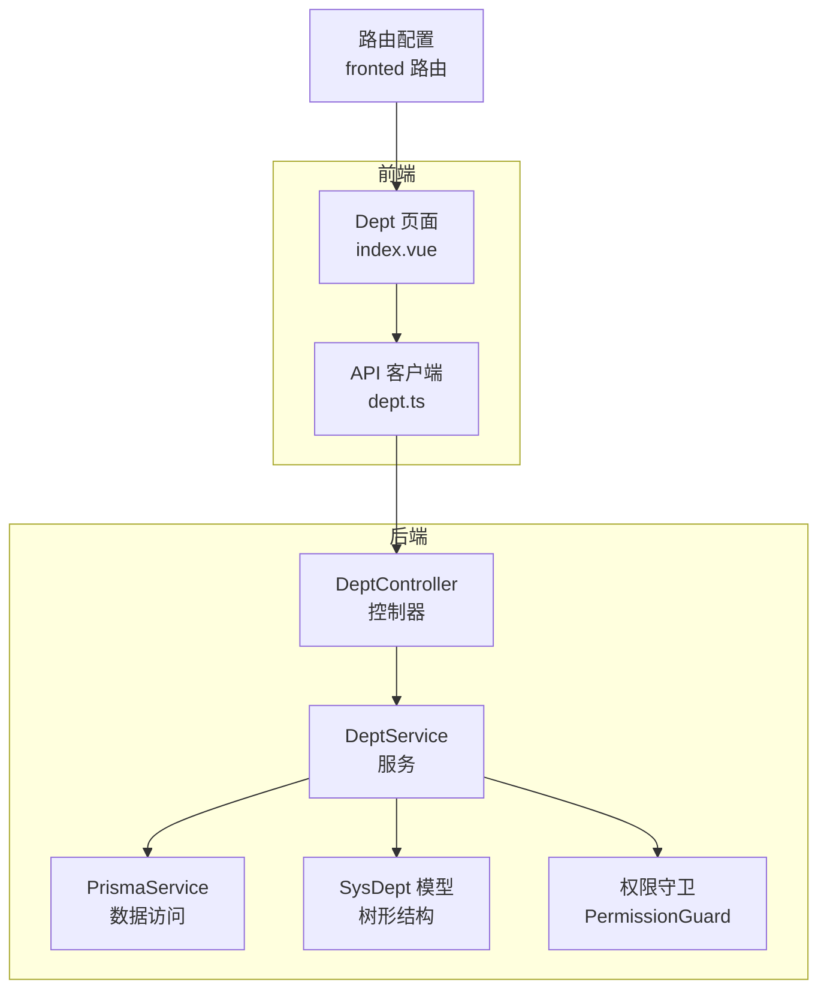
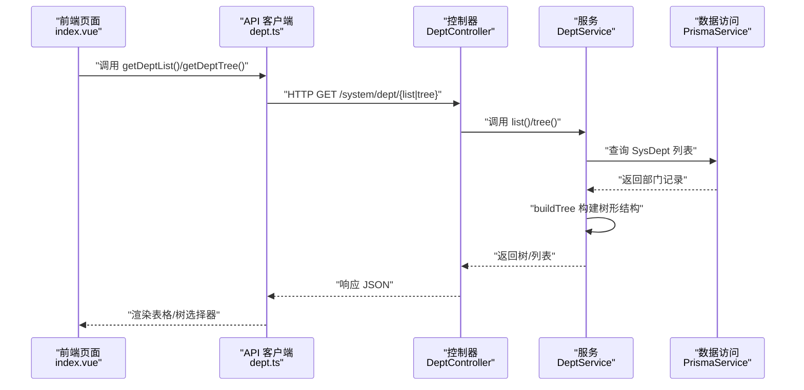
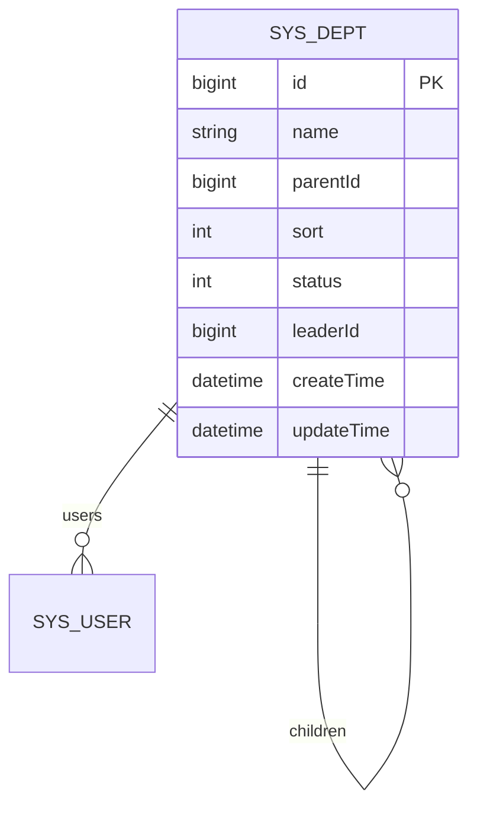
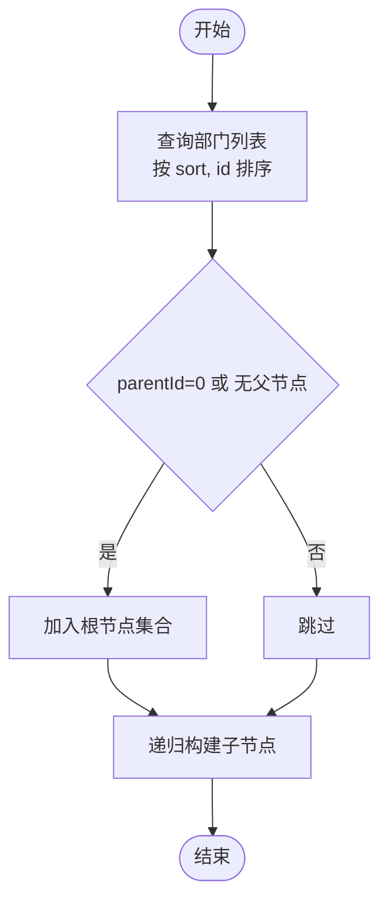
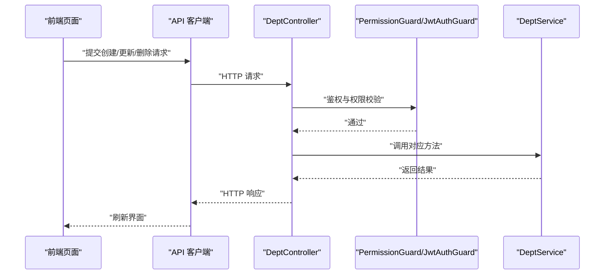
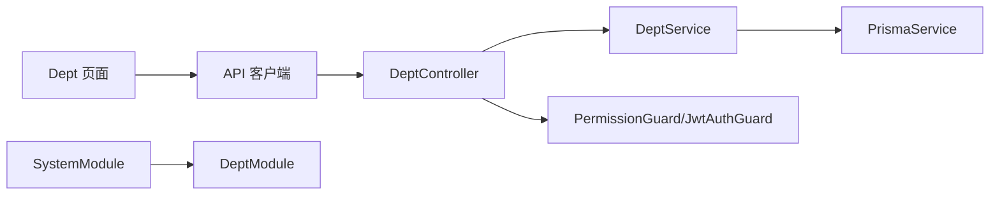

# 部门管理

<cite>
**本文引用的文件**
- [apps/backend/src/modules/system/dept/dept.controller.ts](file://apps/backend/src/modules/system/dept/dept.controller.ts)
- [apps/backend/src/modules/system/dept/dept.service.ts](file://apps/backend/src/modules/system/dept/dept.service.ts)
- [apps/backend/src/modules/system/dept/dept.module.ts](file://apps/backend/src/modules/system/dept/dept.module.ts)
- [apps/backend/src/modules/system/dept/dto/dept.dto.ts](file://apps/backend/src/modules/system/dept/dto/dept.dto.ts)
- [apps/backend/src/modules/system/system.module.ts](file://apps/backend/src/modules/system/system.module.ts)
- [apps/backend/src/auth/guards.ts](file://apps/backend/src/auth/guards.ts)
- [apps/backend/src/modules/system/role/role.service.ts](file://apps/backend/src/modules/system/role/role.service.ts)
- [apps/backend/src/modules/system/user/user.service.ts](file://apps/backend/src/modules/system/user/user.service.ts)
- [apps/backend/prisma/schema.prisma](file://apps/backend/prisma/schema.prisma)
- [apps/vben-admin/apps/web-antd/src/api/system/dept.ts](file://apps/vben-admin/apps/web-antd/src/api/system/dept.ts)
- [apps/vben-admin/apps/web-antd/src/views/system/dept/index.vue](file://apps/vben-admin/apps/web-antd/src/views/system/dept/index.vue)
- [apps/fronted/src/router/index.ts](file://apps/fronted/src/router/index.ts)
</cite>

## 目录
1. [简介](#简介)
2. [项目结构](#项目结构)
3. [核心组件](#核心组件)
4. [架构总览](#架构总览)
5. [详细组件分析](#详细组件分析)
6. [依赖分析](#依赖分析)
7. [性能考虑](#性能考虑)
8. [故障排查指南](#故障排查指南)
9. [结论](#结论)
10. [附录](#附录)

## 简介
本文件系统性梳理“部门管理”模块的设计与实现，覆盖树形结构的部门数据模型、CRUD 接口设计、树构建算法、权限控制、以及前端交互与路由集成。文档同时给出业务场景示例（组织架构调整、合并拆分、负责人变更）及实用功能（数据权限控制、人员统计、层级查询）的实现要点。

## 项目结构
部门管理模块位于后端 NestJS 应用的系统子模块下，采用标准的分层结构：控制器负责接口暴露与鉴权校验，服务层封装业务逻辑与树形构建，DTO 进行请求参数校验，Prisma 定义树形数据模型；前端通过 API 客户端调用后端接口，并在页面中以表格与树选择器进行展示与编辑。

图表来源
- [apps/backend/src/modules/system/dept/dept.controller.ts:11-59](file://apps/backend/src/modules/system/dept/dept.controller.ts#L11-L59)
- [apps/backend/src/modules/system/dept/dept.service.ts:1-73](file://apps/backend/src/modules/system/dept/dept.service.ts#L1-L73)
- [apps/backend/prisma/schema.prisma:58-75](file://apps/backend/prisma/schema.prisma#L58-L75)
- [apps/vben-admin/apps/web-antd/src/views/system/dept/index.vue:1-109](file://apps/vben-admin/apps/web-antd/src/views/system/dept/index.vue#L1-L109)
- [apps/vben-admin/apps/web-antd/src/api/system/dept.ts:1-38](file://apps/vben-admin/apps/web-antd/src/api/system/dept.ts#L1-L38)
- [apps/fronted/src/router/index.ts:36-41](file://apps/fronted/src/router/index.ts#L36-L41)

章节来源
- [apps/backend/src/modules/system/dept/dept.controller.ts:1-60](file://apps/backend/src/modules/system/dept/dept.controller.ts#L1-L60)
- [apps/backend/src/modules/system/dept/dept.service.ts:1-73](file://apps/backend/src/modules/system/dept/dept.service.ts#L1-L73)
- [apps/backend/src/modules/system/dept/dept.module.ts:1-10](file://apps/backend/src/modules/system/dept/dept.module.ts#L1-L10)
- [apps/backend/src/modules/system/system.module.ts:1-23](file://apps/backend/src/modules/system/system.module.ts#L1-L23)
- [apps/backend/prisma/schema.prisma:58-75](file://apps/backend/prisma/schema.prisma#L58-L75)
- [apps/vben-admin/apps/web-antd/src/api/system/dept.ts:1-38](file://apps/vben-admin/apps/web-antd/src/api/system/dept.ts#L1-L38)
- [apps/vben-admin/apps/web-antd/src/views/system/dept/index.vue:1-109](file://apps/vben-admin/apps/web-antd/src/views/system/dept/index.vue#L1-L109)
- [apps/fronted/src/router/index.ts:36-41](file://apps/fronted/src/router/index.ts#L36-L41)

## 核心组件
- 控制器：提供部门列表、树结构、详情、创建、更新、删除等接口，并统一应用 JWT 与权限守卫。
- 服务：封装查询、树构建、创建、更新、删除逻辑；对删除操作进行“存在子节点”的前置校验。
- DTO：定义创建、更新、查询参数的数据结构与校验规则。
- 数据模型：Prisma 定义 SysDept 树形模型，含自关联 parent/children 关系与索引。
- 前端 API 客户端：封装 GET/POST/PUT/DELETE 请求，返回树形或列表数据。
- 前端页面：表格展示部门列表，树选择器用于选择上级部门，支持新增、编辑、删除。

章节来源
- [apps/backend/src/modules/system/dept/dept.controller.ts:11-59](file://apps/backend/src/modules/system/dept/dept.controller.ts#L11-L59)
- [apps/backend/src/modules/system/dept/dept.service.ts:9-71](file://apps/backend/src/modules/system/dept/dept.service.ts#L9-L71)
- [apps/backend/src/modules/system/dept/dto/dept.dto.ts:5-26](file://apps/backend/src/modules/system/dept/dto/dept.dto.ts#L5-L26)
- [apps/backend/prisma/schema.prisma:58-75](file://apps/backend/prisma/schema.prisma#L58-L75)
- [apps/vben-admin/apps/web-antd/src/api/system/dept.ts:15-37](file://apps/vben-admin/apps/web-antd/src/api/system/dept.ts#L15-L37)
- [apps/vben-admin/apps/web-antd/src/views/system/dept/index.vue:14-62](file://apps/vben-admin/apps/web-antd/src/views/system/dept/index.vue#L14-L62)

## 架构总览
后端采用“控制器-服务-数据访问”的分层架构，权限通过守卫在控制器层面集中校验；前端通过统一的 API 客户端与后端交互，页面组件负责用户交互与数据渲染。

图表来源
- [apps/vben-admin/apps/web-antd/src/views/system/dept/index.vue:23-29](file://apps/vben-admin/apps/web-antd/src/views/system/dept/index.vue#L23-L29)
- [apps/vben-admin/apps/web-antd/src/api/system/dept.ts:15-21](file://apps/vben-admin/apps/web-antd/src/api/system/dept.ts#L15-L21)
- [apps/backend/src/modules/system/dept/dept.controller.ts:17-29](file://apps/backend/src/modules/system/dept/dept.controller.ts#L17-L29)
- [apps/backend/src/modules/system/dept/dept.service.ts:9-27](file://apps/backend/src/modules/system/dept/dept.service.ts#L9-L27)

## 详细组件分析

### 数据模型与树形结构
- 表结构：SysDept 包含 id、name、parentId、sort、status、leaderId 等字段，并建立自关联 parent/children。
- 索引：parentId、sort 字段建立索引，优化查询与排序。
- 关系：每个部门可有多个子部门，父部门可为空（根节点）。

图表来源
- [apps/backend/prisma/schema.prisma:58-75](file://apps/backend/prisma/schema.prisma#L58-L75)

章节来源
- [apps/backend/prisma/schema.prisma:58-75](file://apps/backend/prisma/schema.prisma#L58-L75)

### 树形构建算法
- 输入：扁平的部门列表（按 sort、id 排序）。
- 过程：使用递归过滤 parentId 匹配当前层级的节点，并为每个节点递归构建 children。
- 输出：树形结构数组，便于前端树选择器与表格展开显示。

图表来源
- [apps/backend/src/modules/system/dept/dept.service.ts:29-37](file://apps/backend/src/modules/system/dept/dept.service.ts#L29-L37)

章节来源
- [apps/backend/src/modules/system/dept/dept.service.ts:9-37](file://apps/backend/src/modules/system/dept/dept.service.ts#L9-L37)

### API 设计与权限控制
- 接口清单
  - GET /system/dept/list：按条件查询并返回树形结构
  - GET /system/dept/tree：返回启用状态的树形结构
  - GET /system/dept/:id：按 ID 查询部门详情
  - POST /system/dept：创建部门
  - PUT /system/dept：更新部门
  - DELETE /system/dept/:id：删除部门（禁止删除存在子部门的节点）
- 权限控制
  - 统一使用 JWT 与 PermissionGuard
  - 所有接口均要求 system:dept:list 权限
  - 前端路由也声明了该权限，用于导航可见性与访问控制

图表来源
- [apps/backend/src/modules/system/dept/dept.controller.ts:13-59](file://apps/backend/src/modules/system/dept/dept.controller.ts#L13-L59)
- [apps/backend/src/auth/guards.ts:16-50](file://apps/backend/src/auth/guards.ts#L16-L50)
- [apps/fronted/src/router/index.ts:36-41](file://apps/fronted/src/router/index.ts#L36-L41)

章节来源
- [apps/backend/src/modules/system/dept/dept.controller.ts:17-58](file://apps/backend/src/modules/system/dept/dept.controller.ts#L17-L58)
- [apps/backend/src/auth/guards.ts:16-50](file://apps/backend/src/auth/guards.ts#L16-L50)
- [apps/fronted/src/router/index.ts:36-41](file://apps/fronted/src/router/index.ts#L36-L41)

### CRUD 实现要点
- 创建：接收 name、parentId、sort、status、leaderId 等字段，parentId 默认 0 表示根节点。
- 更新：根据 id 更新 name、parentId、sort、status、leaderId。
- 删除：若存在子部门则拒绝删除，否则执行删除并返回成功状态。
- 查询：支持按 name、status 过滤；tree 接口默认仅返回启用状态的节点。

章节来源
- [apps/backend/src/modules/system/dept/dto/dept.dto.ts:5-26](file://apps/backend/src/modules/system/dept/dto/dept.dto.ts#L5-L26)
- [apps/backend/src/modules/system/dept/dept.service.ts:45-71](file://apps/backend/src/modules/system/dept/dept.service.ts#L45-L71)

### 前端交互与路由集成
- 前端页面通过 API 客户端调用后端接口，加载树形数据并在表格中展示。
- 使用 TreeSelect 组件进行上级部门的选择，支持清空与默认展开。
- 路由中声明 system:dept:list 权限，确保未授权用户无法访问部门管理页面。

章节来源
- [apps/vben-admin/apps/web-antd/src/views/system/dept/index.vue:23-62](file://apps/vben-admin/apps/web-antd/src/views/system/dept/index.vue#L23-L62)
- [apps/vben-admin/apps/web-antd/src/api/system/dept.ts:15-37](file://apps/vben-admin/apps/web-antd/src/api/system/dept.ts#L15-L37)
- [apps/fronted/src/router/index.ts:36-41](file://apps/fronted/src/router/index.ts#L36-L41)

## 依赖分析
- 控制器依赖服务；服务依赖 Prisma 数据访问层。
- 权限守卫在控制器层统一生效，避免重复校验。
- 前端 API 客户端与控制器一一对应，职责清晰。
- 系统模块聚合导入部门模块，体现模块化组织。

图表来源
- [apps/backend/src/modules/system/dept/dept.controller.ts:1-15](file://apps/backend/src/modules/system/dept/dept.controller.ts#L1-L15)
- [apps/backend/src/modules/system/dept/dept.service.ts:1-7](file://apps/backend/src/modules/system/dept/dept.service.ts#L1-L7)
- [apps/backend/src/modules/system/system.module.ts:11-22](file://apps/backend/src/modules/system/system.module.ts#L11-L22)
- [apps/vben-admin/apps/web-antd/src/api/system/dept.ts:1-38](file://apps/vben-admin/apps/web-antd/src/api/system/dept.ts#L1-L38)
- [apps/vben-admin/apps/web-antd/src/views/system/dept/index.vue:1-109](file://apps/vben-admin/apps/web-antd/src/views/system/dept/index.vue#L1-L109)

章节来源
- [apps/backend/src/modules/system/system.module.ts:1-23](file://apps/backend/src/modules/system/system.module.ts#L1-L23)
- [apps/backend/src/modules/system/dept/dept.module.ts:1-10](file://apps/backend/src/modules/system/dept/dept.module.ts#L1-L10)

## 性能考虑
- 查询排序：按 sort、id 排序，保证树构建顺序稳定且高效。
- 索引优化：parentId、sort 建立索引，提升树构建与筛选性能。
- 递归构建：树构建为 O(n) 递归遍历，配合已排序数据可减少重复扫描。
- 批量查询：列表与树接口复用同一查询基础，避免重复数据库访问。

章节来源
- [apps/backend/src/modules/system/dept/dept.service.ts:14-26](file://apps/backend/src/modules/system/dept/dept.service.ts#L14-L26)
- [apps/backend/prisma/schema.prisma:73-74](file://apps/backend/prisma/schema.prisma#L73-L74)

## 故障排查指南
- 删除失败：若提示“存在子部门”，需先移动或删除子部门后再试。
- 权限不足：前端路由或接口返回 403，检查用户是否具备 system:dept:list 权限。
- 参数校验：创建/更新时缺少必填字段或类型不匹配会触发 DTO 校验错误。
- 未找到部门：查询不存在的 ID 将返回 404。

章节来源
- [apps/backend/src/modules/system/dept/dept.service.ts:66-71](file://apps/backend/src/modules/system/dept/dept.service.ts#L66-L71)
- [apps/backend/src/modules/system/dept/dept.controller.ts:31-36](file://apps/backend/src/modules/system/dept/dept.controller.ts#L31-L36)
- [apps/backend/src/auth/guards.ts:36-50](file://apps/backend/src/auth/guards.ts#L36-L50)

## 结论
部门管理模块以清晰的分层架构、完善的权限控制与高效的树形构建算法，实现了对组织架构的全生命周期管理。通过前后端协同，满足日常的组织调整、合并拆分与负责人变更等场景需求。

## 附录

### 业务场景示例与实现要点
- 组织架构调整
  - 场景：将某部门从 A 组织迁移到 B 组织
  - 实现：调用更新接口将 parentId 修改为目标组织根节点或指定子节点
  - 注意：确保目标节点存在且非自身子节点，避免循环引用
- 部门合并拆分
  - 场景：将多个子部门合并到一个父部门
  - 实现：批量更新子部门 parentId 指向目标父部门；或拆分时逐个更新
  - 注意：删除前检查是否存在子部门，避免误删
- 部门负责人变更
  - 场景：更换部门负责人
  - 实现：调用更新接口修改 leaderId 字段
  - 注意：leaderId 可为空，表示暂无负责人

章节来源
- [apps/backend/src/modules/system/dept/dept.service.ts:57-64](file://apps/backend/src/modules/system/dept/dept.service.ts#L57-L64)
- [apps/backend/src/modules/system/dept/dto/dept.dto.ts:14-21](file://apps/backend/src/modules/system/dept/dto/dept.dto.ts#L14-L21)

### 实用功能实现细节
- 数据权限控制
  - 角色可绑定部门数据范围（如仅本部门、本部门及以下），通过角色服务的部门数据范围字段实现
- 部门人员统计
  - 通过用户表的 deptId 关联统计部门人数；用户服务已包含按部门查询的示例
- 部门层级查询
  - 树形接口默认返回启用状态的完整树；如需禁用项可扩展查询参数

章节来源
- [apps/backend/src/modules/system/role/role.service.ts:64-73](file://apps/backend/src/modules/system/role/role.service.ts#L64-L73)
- [apps/backend/src/modules/system/user/user.service.ts:18-25](file://apps/backend/src/modules/system/user/user.service.ts#L18-L25)