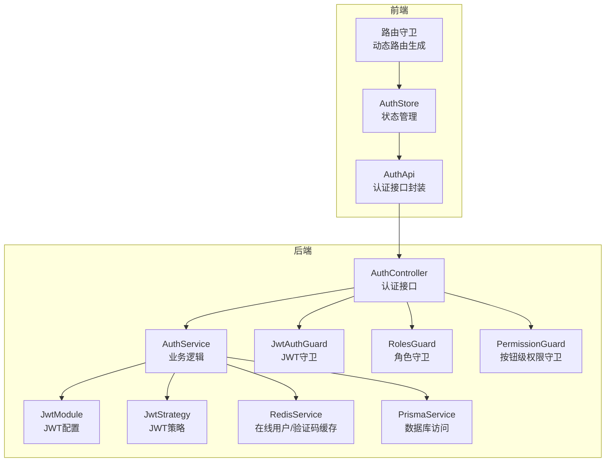
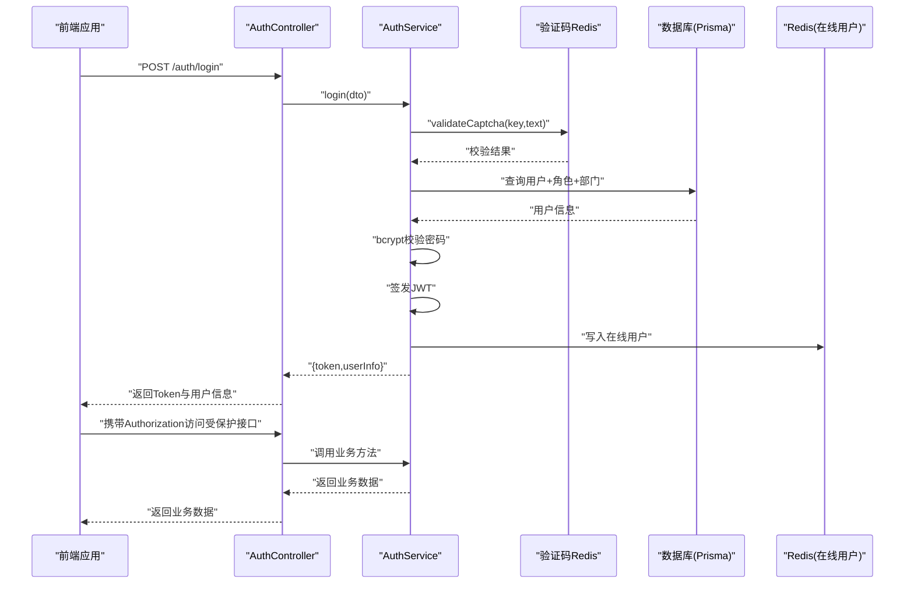
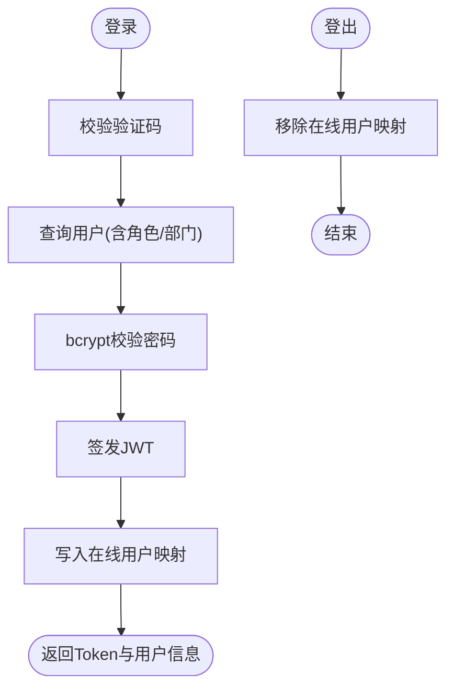
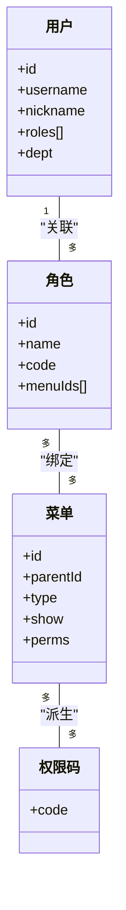
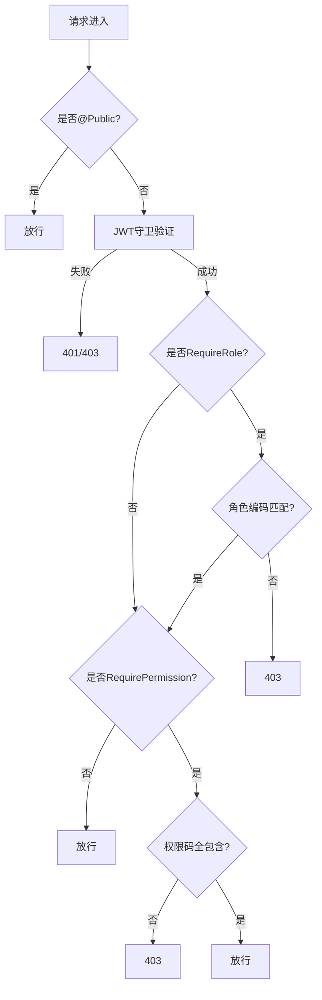
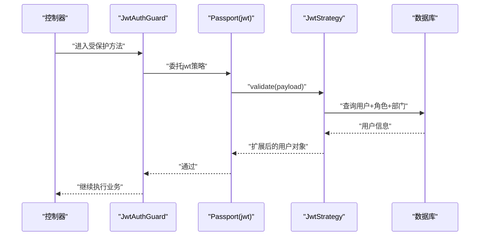
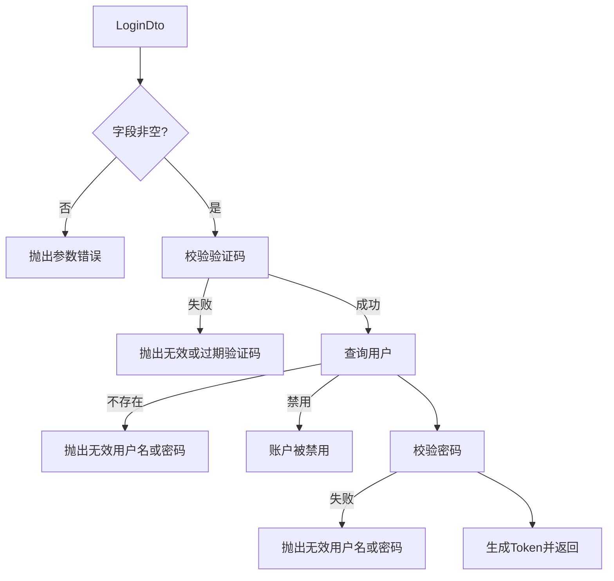
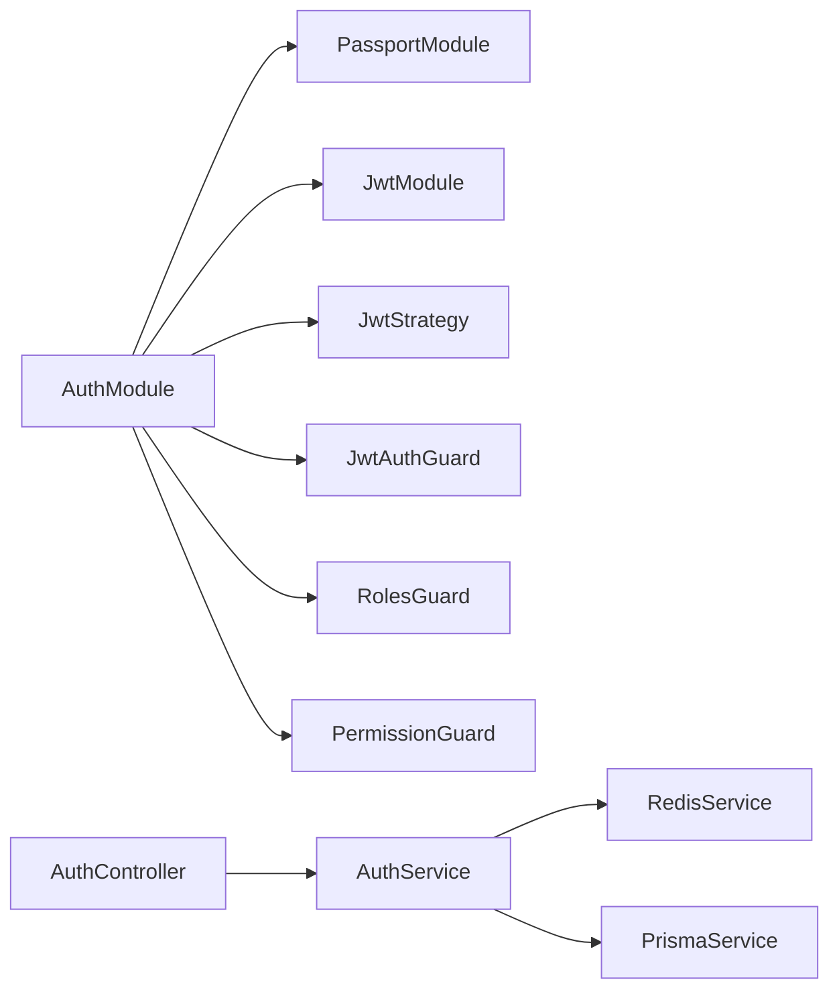

# 认证授权系统

<cite>
**本文引用的文件**
- [apps/backend/src/auth/auth.controller.ts](file://apps/backend/src/auth/auth.controller.ts)
- [apps/backend/src/auth/auth.service.ts](file://apps/backend/src/auth/auth.service.ts)
- [apps/backend/src/auth/jwt.guard.ts](file://apps/backend/src/auth/jwt.guard.ts)
- [apps/backend/src/auth/guards.ts](file://apps/backend/src/auth/guards.ts)
- [apps/backend/src/auth/jwt.strategy.ts](file://apps/backend/src/auth/jwt.strategy.ts)
- [apps/backend/src/auth/dto/auth.dto.ts](file://apps/backend/src/auth/dto/auth.dto.ts)
- [apps/backend/src/auth/auth.module.ts](file://apps/backend/src/auth/auth.module.ts)
- [apps/backend/src/cache/redis.service.ts](file://apps/backend/src/cache/redis.service.ts)
- [apps/backend/src/common/prisma.service.ts](file://apps/backend/src/common/prisma.service.ts)
- [apps/backend/src/modules/system/user/user.controller.ts](file://apps/backend/src/modules/system/user/user.controller.ts)
- [apps/vben-admin/apps/web-antd/src/api/core/auth.ts](file://apps/vben-admin/apps/web-antd/src/api/core/auth.ts)
- [apps/vben-admin/apps/web-antd/src/router/guard.ts](file://apps/vben-admin/apps/web-antd/src/router/guard.ts)
- [apps/vben-admin/apps/web-antd/src/store/auth.ts](file://apps/vben-admin/apps/web-antd/src/store/auth.ts)
</cite>

## 目录
1. [简介](#简介)
2. [项目结构](#项目结构)
3. [核心组件](#核心组件)
4. [架构总览](#架构总览)
5. [详细组件分析](#详细组件分析)
6. [依赖分析](#依赖分析)
7. [性能考虑](#性能考虑)
8. [故障排查指南](#故障排查指南)
9. [结论](#结论)
10. [附录](#附录)

## 简介
本文件系统性梳理认证授权模块的实现，覆盖以下要点：
- JWT认证机制：Token生成、验证与过期处理、登出在线用户管理
- RBAC权限模型：角色、权限、资源（菜单/按钮）映射与动态路由生成
- 多层权限守卫：公共接口标注、JWT守卫、角色守卫、按钮级权限守卫
- Passport策略：JWT策略配置与用户载荷扩展
- DTO校验与错误处理：登录/注册/验证码/更新资料/改密的参数约束与异常
- 完整接口示例与最佳实践：登录、注册、获取验证码、用户信息、权限验证

## 项目结构
认证授权系统由后端NestJS模块与前端Vben Admin协同组成：
- 后端
  - 认证控制器与服务：处理登录、注册、验证码、用户信息、登出、改密等
  - JWT与策略：JWT模块、策略、守卫
  - 数据访问：Prisma服务；缓存：Redis服务
  - 示例业务控制器：系统用户模块的按钮级权限守卫使用
- 前端
  - 认证API封装：登录、验证码、登出、用户信息、个人资料、改密
  - 路由守卫：基于用户权限生成可访问菜单与路由
  - 状态管理：访问令牌、用户信息、权限码存储与清理

**图表来源**
- [apps/backend/src/auth/auth.controller.ts:1-87](file://apps/backend/src/auth/auth.controller.ts#L1-L87)
- [apps/backend/src/auth/auth.service.ts:1-294](file://apps/backend/src/auth/auth.service.ts#L1-L294)
- [apps/backend/src/auth/auth.module.ts:1-29](file://apps/backend/src/auth/auth.module.ts#L1-L29)
- [apps/backend/src/auth/jwt.strategy.ts:1-78](file://apps/backend/src/auth/jwt.strategy.ts#L1-L78)
- [apps/backend/src/auth/jwt.guard.ts:1-5](file://apps/backend/src/auth/jwt.guard.ts#L1-L5)
- [apps/backend/src/auth/guards.ts:1-51](file://apps/backend/src/auth/guards.ts#L1-L51)
- [apps/backend/src/cache/redis.service.ts:1-128](file://apps/backend/src/cache/redis.service.ts#L1-L128)
- [apps/backend/src/common/prisma.service.ts:1-22](file://apps/backend/src/common/prisma.service.ts#L1-L22)
- [apps/vben-admin/apps/web-antd/src/api/core/auth.ts:1-122](file://apps/vben-admin/apps/web-antd/src/api/core/auth.ts#L1-L122)
- [apps/vben-admin/apps/web-antd/src/router/guard.ts:1-134](file://apps/vben-admin/apps/web-antd/src/router/guard.ts#L1-L134)
- [apps/vben-admin/apps/web-antd/src/store/auth.ts:1-137](file://apps/vben-admin/apps/web-antd/src/store/auth.ts#L1-L137)

**章节来源**
- [apps/backend/src/auth/auth.controller.ts:1-87](file://apps/backend/src/auth/auth.controller.ts#L1-L87)
- [apps/backend/src/auth/auth.module.ts:1-29](file://apps/backend/src/auth/auth.module.ts#L1-L29)
- [apps/vben-admin/apps/web-antd/src/api/core/auth.ts:1-122](file://apps/vben-admin/apps/web-antd/src/api/core/auth.ts#L1-L122)

## 核心组件
- 认证控制器与服务
  - 提供登录、注册、验证码、登出、用户信息、个人资料、改密等接口
  - 登录时进行验证码校验、密码校验、签发JWT、记录登录日志与在线用户
  - 用户信息接口按角色聚合菜单树与权限码
- JWT模块与策略
  - 注册默认JWT策略，配置签名密钥与过期时间
  - 策略在验证通过后从数据库加载用户角色与权限，扩展到请求上下文
- 多层守卫
  - 公共元数据：@Public()允许匿名访问
  - 角色守卫：基于用户角色编码判断
  - 按钮级权限守卫：基于用户权限码集合判断
- 缓存与数据访问
  - Redis用于验证码、在线用户集合与单个Token映射
  - Prisma访问数据库，包含用户、角色、菜单等实体

**章节来源**
- [apps/backend/src/auth/auth.controller.ts:1-87](file://apps/backend/src/auth/auth.controller.ts#L1-L87)
- [apps/backend/src/auth/auth.service.ts:1-294](file://apps/backend/src/auth/auth.service.ts#L1-L294)
- [apps/backend/src/auth/auth.module.ts:1-29](file://apps/backend/src/auth/auth.module.ts#L1-L29)
- [apps/backend/src/auth/jwt.strategy.ts:1-78](file://apps/backend/src/auth/jwt.strategy.ts#L1-L78)
- [apps/backend/src/auth/guards.ts:1-51](file://apps/backend/src/auth/guards.ts#L1-L51)
- [apps/backend/src/cache/redis.service.ts:1-128](file://apps/backend/src/cache/redis.service.ts#L1-L128)
- [apps/backend/src/common/prisma.service.ts:1-22](file://apps/backend/src/common/prisma.service.ts#L1-L22)

## 架构总览
下图展示认证授权的端到端流程：前端发起登录请求，后端验证参数与用户，签发JWT并写入在线用户缓存；后续请求携带Token，JWT策略解析并扩展用户信息，多层守卫逐级校验。

**图表来源**
- [apps/backend/src/auth/auth.controller.ts:1-87](file://apps/backend/src/auth/auth.controller.ts#L1-L87)
- [apps/backend/src/auth/auth.service.ts:29-89](file://apps/backend/src/auth/auth.service.ts#L29-L89)
- [apps/backend/src/cache/redis.service.ts:83-91](file://apps/backend/src/cache/redis.service.ts#L83-L91)
- [apps/backend/src/common/prisma.service.ts:1-22](file://apps/backend/src/common/prisma.service.ts#L1-L22)

**章节来源**
- [apps/backend/src/auth/auth.controller.ts:13-51](file://apps/backend/src/auth/auth.controller.ts#L13-L51)
- [apps/backend/src/auth/auth.service.ts:29-89](file://apps/backend/src/auth/auth.service.ts#L29-L89)
- [apps/backend/src/cache/redis.service.ts:83-91](file://apps/backend/src/cache/redis.service.ts#L83-L91)

## 详细组件分析

### JWT认证机制
- Token生成
  - 登录成功后，基于用户ID与用户名构建payload并签发JWT
  - 将Token与用户ID写入Redis，作为在线用户映射
- Token验证
  - 使用Passport JWT策略，从请求头提取Bearer Token
  - 校验过期与签名，从数据库加载用户、角色、部门信息
  - 对超级管理员与普通用户分别计算权限集
- 过期与登出
  - 策略未忽略过期，过期将触发认证失败
  - 登出时移除在线用户映射，客户端需清除本地Token

**图表来源**
- [apps/backend/src/auth/auth.service.ts:29-89](file://apps/backend/src/auth/auth.service.ts#L29-L89)
- [apps/backend/src/cache/redis.service.ts:83-91](file://apps/backend/src/cache/redis.service.ts#L83-L91)
- [apps/backend/src/auth/jwt.strategy.ts:20-43](file://apps/backend/src/auth/jwt.strategy.ts#L20-L43)

**章节来源**
- [apps/backend/src/auth/auth.service.ts:29-89](file://apps/backend/src/auth/auth.service.ts#L29-L89)
- [apps/backend/src/auth/jwt.strategy.ts:20-43](file://apps/backend/src/auth/jwt.strategy.ts#L20-L43)
- [apps/backend/src/cache/redis.service.ts:83-91](file://apps/backend/src/cache/redis.service.ts#L83-L91)

### RBAC权限模型设计
- 角色
  - 用户关联多个角色，角色包含名称、编码、菜单权限ID集合
- 权限
  - 权限码来源于菜单的按钮级权限字符串
  - 超级管理员拥有所有有效权限
  - 普通用户权限来自其角色绑定的菜单集合所对应的权限码
- 资源
  - 菜单树用于前端导航与页面路由生成
  - 菜单类型过滤、排序与层级构建，仅展示启用且需要显示的节点

**图表来源**
- [apps/backend/src/auth/jwt.strategy.ts:45-76](file://apps/backend/src/auth/jwt.strategy.ts#L45-L76)
- [apps/backend/src/auth/auth.service.ts:144-186](file://apps/backend/src/auth/auth.service.ts#L144-L186)

**章节来源**
- [apps/backend/src/auth/jwt.strategy.ts:45-76](file://apps/backend/src/auth/jwt.strategy.ts#L45-L76)
- [apps/backend/src/auth/auth.service.ts:144-186](file://apps/backend/src/auth/auth.service.ts#L144-L186)

### 多层权限守卫工作机制
- 公共接口标注
  - 使用@Public()元数据标注无需认证的接口（如登录、注册、验证码）
- JWT守卫
  - 基于Passport默认jwt策略，自动从请求头提取并验证Token
- 角色守卫
  - 从元数据读取所需角色编码集合，匹配用户角色编码
- 按钮级权限守卫
  - 从元数据读取所需权限码集合，要求用户权限集合包含全部所需权限

**图表来源**
- [apps/backend/src/auth/guards.ts:19-51](file://apps/backend/src/auth/guards.ts#L19-L51)
- [apps/backend/src/auth/jwt.guard.ts:1-5](file://apps/backend/src/auth/jwt.guard.ts#L1-L5)

**章节来源**
- [apps/backend/src/auth/guards.ts:10-51](file://apps/backend/src/auth/guards.ts#L10-L51)
- [apps/backend/src/auth/jwt.guard.ts:1-5](file://apps/backend/src/auth/jwt.guard.ts#L1-L5)

### Passport认证策略配置与使用
- 策略注册
  - 在JwtModule中配置secret与过期时间
  - PassportModule注册默认jwt策略
- 策略实现
  - 从请求头提取Bearer Token
  - 校验签名与过期，加载用户与角色信息
  - 计算权限集合并返回扩展后的用户对象

**图表来源**
- [apps/backend/src/auth/auth.module.ts:11-28](file://apps/backend/src/auth/auth.module.ts#L11-L28)
- [apps/backend/src/auth/jwt.strategy.ts:8-18](file://apps/backend/src/auth/jwt.strategy.ts#L8-L18)
- [apps/backend/src/auth/jwt.guard.ts:1-5](file://apps/backend/src/auth/jwt.guard.ts#L1-L5)

**章节来源**
- [apps/backend/src/auth/auth.module.ts:11-28](file://apps/backend/src/auth/auth.module.ts#L11-L28)
- [apps/backend/src/auth/jwt.strategy.ts:8-18](file://apps/backend/src/auth/jwt.strategy.ts#L8-L18)
- [apps/backend/src/auth/jwt.guard.ts:1-5](file://apps/backend/src/auth/jwt.guard.ts#L1-L5)

### 认证DTO的数据验证规则与错误处理
- 登录DTO
  - 用户名、密码、验证码键、验证码文本均非空
  - 登录时先校验验证码，再校验用户存在、状态、密码
- 注册DTO
  - 用户名非空，密码最小长度，昵称可选
  - 去重检查，哈希存储
- 验证码DTO
  - 键与文本非空
- 更新资料DTO
  - 支持昵称、邮箱、电话、头像、备注字段可选更新
- 更新密码DTO
  - 旧密码非空，新密码最小长度
  - 校验旧密码正确后更新为新密码

**图表来源**
- [apps/backend/src/auth/dto/auth.dto.ts:43-63](file://apps/backend/src/auth/dto/auth.dto.ts#L43-L63)
- [apps/backend/src/auth/auth.service.ts:29-60](file://apps/backend/src/auth/auth.service.ts#L29-L60)

**章节来源**
- [apps/backend/src/auth/dto/auth.dto.ts:1-91](file://apps/backend/src/auth/dto/auth.dto.ts#L1-L91)
- [apps/backend/src/auth/auth.service.ts:29-60](file://apps/backend/src/auth/auth.service.ts#L29-L60)

### 接口示例与最佳实践
- 登录
  - 方法：POST /auth/login
  - 参数：用户名、密码、验证码键、验证码文本
  - 返回：Token与用户信息（含角色）
  - 最佳实践：先调用获取验证码接口，再提交登录
- 注册
  - 方法：POST /auth/register
  - 参数：用户名、密码、昵称可选
  - 返回：用户ID与用户名
- 获取验证码
  - 方法：GET /auth/captcha
  - 返回：验证码键与SVG图片
- 验证验证码
  - 方法：POST /auth/captcha/validate
  - 参数：键、文本
  - 返回：布尔校验结果
- 登出
  - 方法：POST /auth/logout
  - 头部：Authorization: Bearer <token>
  - 返回：登出成功消息
- 用户信息
  - 方法：GET /auth/user/info
  - 返回：用户信息、权限码数组、菜单树
- 个人资料
  - 方法：GET /auth/profile
  - 方法：PUT /auth/profile
  - 方法：PUT /auth/profile/password
- 按钮级权限示例
  - 控制器：系统用户管理
  - 路由：/system/user/list
  - 元数据：RequirePermission('system:user:list')

**章节来源**
- [apps/backend/src/auth/auth.controller.ts:13-86](file://apps/backend/src/auth/auth.controller.ts#L13-L86)
- [apps/backend/src/modules/system/user/user.controller.ts:26-87](file://apps/backend/src/modules/system/user/user.controller.ts#L26-L87)

## 依赖分析
- 模块依赖
  - AuthModule导入PassportModule与JwtModule，注册JwtStrategy与守卫
  - AuthController依赖AuthService，使用JwtAuthGuard与自定义守卫
- 外部依赖
  - JWT：@nestjs/jwt
  - Passport：@nestjs/passport + passport-jwt
  - 缓存：ioredis
  - ORM：@prisma/client
- 前后端交互
  - 前端通过统一请求客户端发送Authorization头
  - 响应格式统一为{ code, data, message }，401交由拦截器处理

**图表来源**
- [apps/backend/src/auth/auth.module.ts:11-28](file://apps/backend/src/auth/auth.module.ts#L11-L28)
- [apps/backend/src/auth/auth.controller.ts:1-11](file://apps/backend/src/auth/auth.controller.ts#L1-L11)

**章节来源**
- [apps/backend/src/auth/auth.module.ts:11-28](file://apps/backend/src/auth/auth.module.ts#L11-L28)
- [apps/backend/src/auth/auth.controller.ts:1-11](file://apps/backend/src/auth/auth.controller.ts#L1-L11)

## 性能考虑
- Token过期与刷新
  - 当前后端未实现刷新Token接口；前端拦截器预留刷新逻辑但当前为空实现
  - 建议：后端新增刷新接口或采用短期Token+滑动过期策略
- 缓存优化
  - 在线用户集合使用集合类型，便于批量查询与清理
  - 验证码键值对TTL控制，避免长期占用内存
- 权限计算
  - 超级管理员一次性拉取所有有效权限，普通用户按角色菜单ID集合去重后查询
  - 菜单树构建在服务端完成，减少前端复杂度

[本节为通用建议，不涉及具体文件分析]

## 故障排查指南
- 401未授权
  - 检查请求头是否包含有效的Bearer Token
  - 确认Token未过期，密钥与过期配置一致
- 403禁止访问
  - 检查用户角色编码是否满足RequireRole
  - 检查用户权限码集合是否包含RequirePermission所需项
- 登录失败
  - 验证码是否正确且未过期
  - 用户是否存在、状态是否正常、密码是否匹配
- 登出无效
  - 确认登出接口已调用且Token从在线用户映射中移除
- 前端无法跳转
  - 检查路由守卫是否正确生成可访问菜单与路由
  - 确认用户信息与权限码已写入状态管理

**章节来源**
- [apps/backend/src/auth/jwt.strategy.ts:20-28](file://apps/backend/src/auth/jwt.strategy.ts#L20-L28)
- [apps/backend/src/auth/guards.ts:23-33](file://apps/backend/src/auth/guards.ts#L23-L33)
- [apps/backend/src/auth/auth.service.ts:29-60](file://apps/backend/src/auth/auth.service.ts#L29-L60)
- [apps/vben-admin/apps/web-antd/src/router/guard.ts:47-120](file://apps/vben-admin/apps/web-antd/src/router/guard.ts#L47-L120)

## 结论
本认证授权系统以JWT为核心，结合Passport策略与多层守卫，实现了从登录、权限计算到动态路由生成的完整闭环。RBAC模型通过角色与菜单权限映射到按钮级权限，既保证了功能安全，又提升了前端体验。建议后续完善Token刷新机制与权限缓存策略，进一步提升可用性与性能。

[本节为总结性内容，不涉及具体文件分析]

## 附录
- 前端认证API封装
  - 登录、获取验证码、登出、获取用户信息、个人资料、改密
- 前端路由守卫
  - 基于用户角色生成可访问菜单与路由，支持忽略权限访问
- 前端状态管理
  - 存储访问令牌、用户信息、权限码，登出时清理并跳转登录页

**章节来源**
- [apps/vben-admin/apps/web-antd/src/api/core/auth.ts:1-122](file://apps/vben-admin/apps/web-antd/src/api/core/auth.ts#L1-L122)
- [apps/vben-admin/apps/web-antd/src/router/guard.ts:47-120](file://apps/vben-admin/apps/web-antd/src/router/guard.ts#L47-L120)
- [apps/vben-admin/apps/web-antd/src/store/auth.ts:27-88](file://apps/vben-admin/apps/web-antd/src/store/auth.ts#L27-L88)