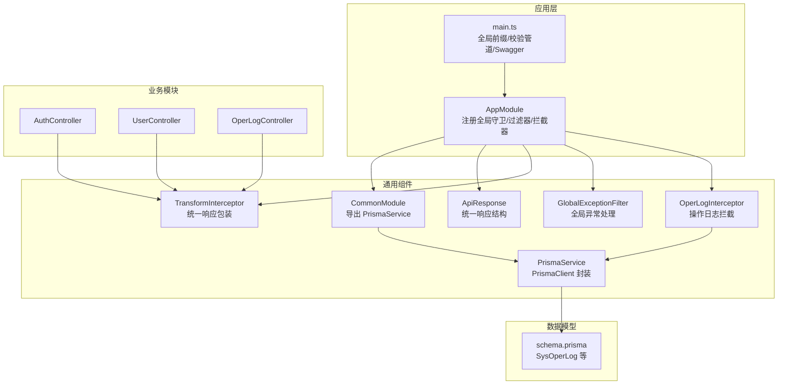
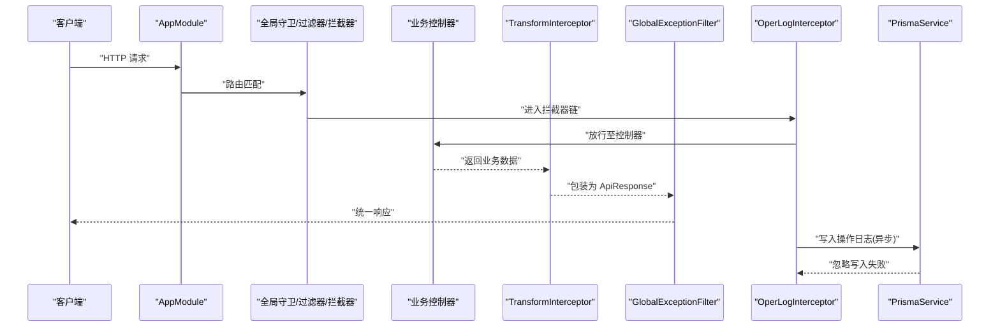
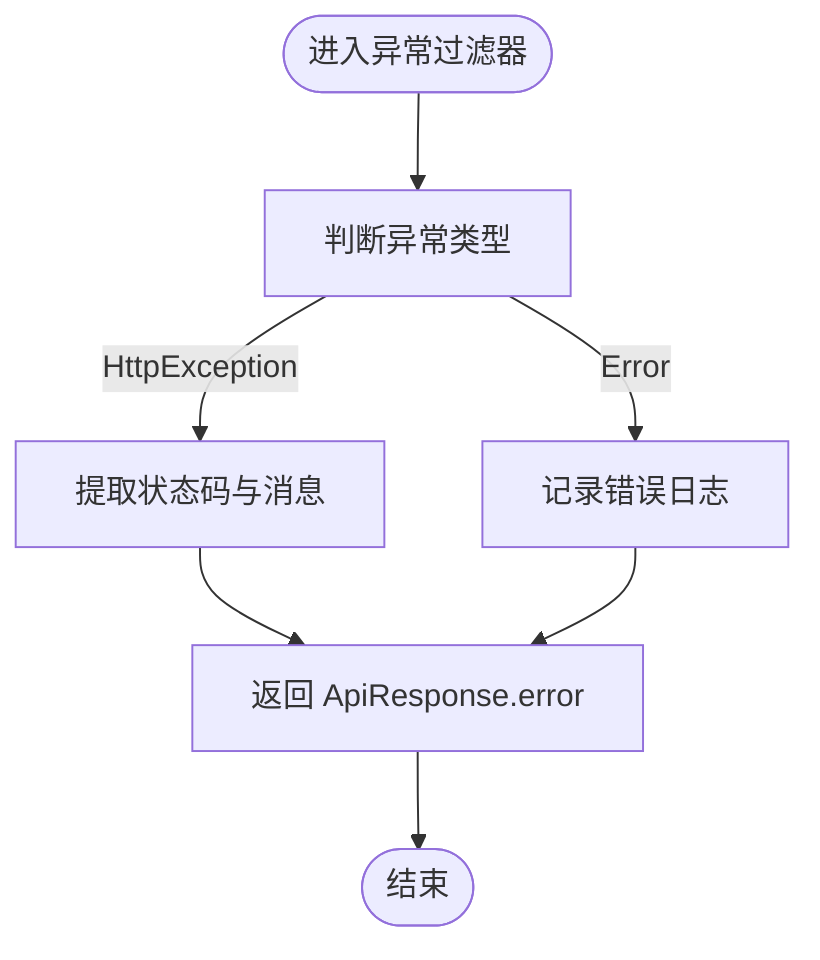
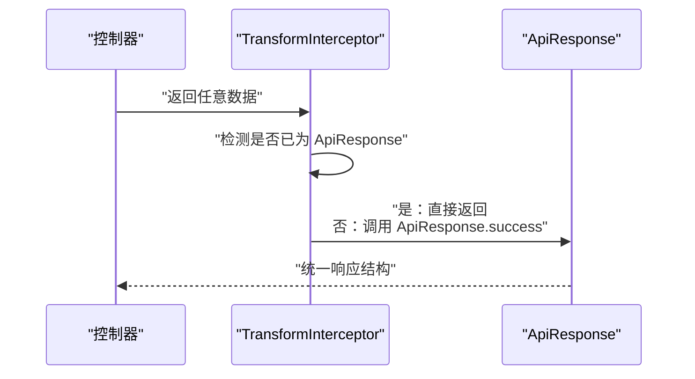
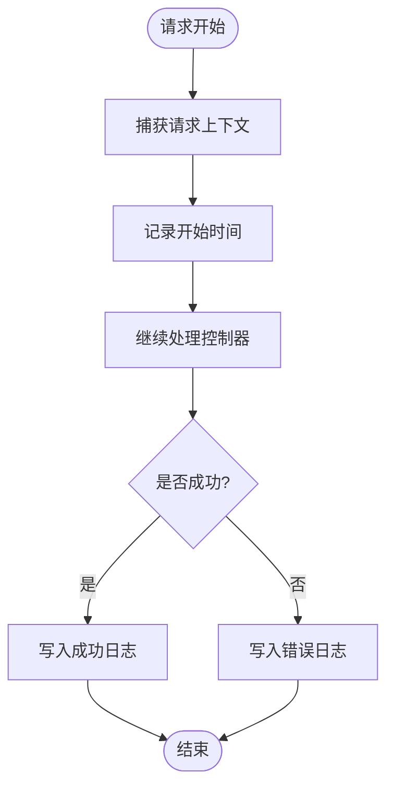
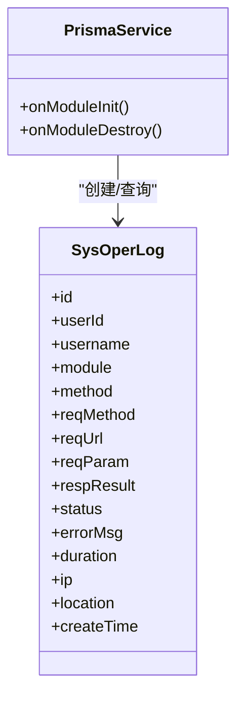
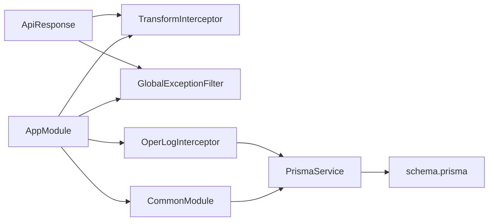

# 通用组件

<cite>
**本文引用的文件**
- [apps/backend/src/common/api-response.ts](file://apps/backend/src/common/api-response.ts)
- [apps/backend/src/common/exception.filter.ts](file://apps/backend/src/common/exception.filter.ts)
- [apps/backend/src/common/transform.interceptor.ts](file://apps/backend/src/common/transform.interceptor.ts)
- [apps/backend/src/common/oper-log.interceptor.ts](file://apps/backend/src/common/oper-log.interceptor.ts)
- [apps/backend/src/common/prisma.service.ts](file://apps/backend/src/common/prisma.service.ts)
- [apps/backend/src/common/common.module.ts](file://apps/backend/src/common/common.module.ts)
- [apps/backend/src/app.module.ts](file://apps/backend/src/app.module.ts)
- [apps/backend/src/main.ts](file://apps/backend/src/main.ts)
- [apps/backend/prisma/schema.prisma](file://apps/backend/prisma/schema.prisma)
- [apps/backend/src/auth/auth.controller.ts](file://apps/backend/src/auth/auth.controller.ts)
- [apps/backend/src/modules/system/user/user.controller.ts](file://apps/backend/src/modules/system/user/user.controller.ts)
- [apps/backend/src/modules/monitor/oper-log/oper-log.controller.ts](file://apps/backend/src/modules/monitor/oper-log/oper-log.controller.ts)
- [apps/backend/src/auth/dto/auth.dto.ts](file://apps/backend/src/auth/dto/auth.dto.ts)
- [apps/backend/src/modules/system/user/dto/user.dto.ts](file://apps/backend/src/modules/system/user/dto/user.dto.ts)
</cite>

## 目录
1. [简介](#简介)
2. [项目结构](#项目结构)
3. [核心组件](#核心组件)
4. [架构总览](#架构总览)
5. [组件详解](#组件详解)
6. [依赖关系分析](#依赖关系分析)
7. [性能考量](#性能考量)
8. [故障排查指南](#故障排查指南)
9. [结论](#结论)
10. [附录](#附录)

## 简介
本文件聚焦于项目的通用基础设施组件，系统性阐述统一响应格式、全局异常处理、数据转换拦截器、操作日志拦截器与Prisma数据库服务的封装与使用。文档旨在帮助开发者快速理解并正确使用这些组件，同时提供配置与扩展建议。

## 项目结构
通用组件主要位于后端应用的 common 目录中，并通过全局模块与全局拦截器/过滤器在应用启动时注入到整个请求生命周期中。Prisma 数据模型定义在 prisma/schema.prisma 中，用于支撑操作日志等审计能力。

图表来源
- [apps/backend/src/app.module.ts:18-58](file://apps/backend/src/app.module.ts#L18-L58)
- [apps/backend/src/common/common.module.ts:1-9](file://apps/backend/src/common/common.module.ts#L1-L9)
- [apps/backend/src/common/prisma.service.ts:1-22](file://apps/backend/src/common/prisma.service.ts#L1-L22)
- [apps/backend/src/common/api-response.ts:1-35](file://apps/backend/src/common/api-response.ts#L1-L35)
- [apps/backend/src/common/transform.interceptor.ts:1-29](file://apps/backend/src/common/transform.interceptor.ts#L1-L29)
- [apps/backend/src/common/exception.filter.ts:1-37](file://apps/backend/src/common/exception.filter.ts#L1-L37)
- [apps/backend/src/common/oper-log.interceptor.ts:1-111](file://apps/backend/src/common/oper-log.interceptor.ts#L1-L111)
- [apps/backend/prisma/schema.prisma:231-254](file://apps/backend/prisma/schema.prisma#L231-L254)

章节来源
- [apps/backend/src/app.module.ts:18-58](file://apps/backend/src/app.module.ts#L18-L58)
- [apps/backend/src/common/common.module.ts:1-9](file://apps/backend/src/common/common.module.ts#L1-L9)
- [apps/backend/src/main.ts:8-48](file://apps/backend/src/main.ts#L8-L48)

## 核心组件
- 统一响应格式：通过 ApiResponse 提供统一的 code/data/message 结构，支持成功、错误、未授权、禁止、未找到、错误请求等静态工厂方法。
- 全局异常处理：GlobalExceptionFilter 捕获所有未处理异常，区分 HttpException 与 Error，输出统一响应。
- 数据转换拦截器：TransformInterceptor 将控制器返回值自动包装为 ApiResponse，避免重复样板代码。
- 操作日志拦截器：OperLogInterceptor 自动记录用户操作日志，包含请求/响应、状态、耗时、IP、敏感信息脱敏等。
- Prisma 数据库服务：PrismaService 扩展 PrismaClient，负责连接生命周期管理与日志级别控制。

章节来源
- [apps/backend/src/common/api-response.ts:1-35](file://apps/backend/src/common/api-response.ts#L1-L35)
- [apps/backend/src/common/exception.filter.ts:1-37](file://apps/backend/src/common/exception.filter.ts#L1-L37)
- [apps/backend/src/common/transform.interceptor.ts:1-29](file://apps/backend/src/common/transform.interceptor.ts#L1-L29)
- [apps/backend/src/common/oper-log.interceptor.ts:1-111](file://apps/backend/src/common/oper-log.interceptor.ts#L1-L111)
- [apps/backend/src/common/prisma.service.ts:1-22](file://apps/backend/src/common/prisma.service.ts#L1-L22)

## 架构总览
下图展示从请求进入应用到最终返回统一响应的整体流程，以及异常处理与操作日志记录的关键节点。

图表来源
- [apps/backend/src/app.module.ts:39-56](file://apps/backend/src/app.module.ts#L39-L56)
- [apps/backend/src/common/transform.interceptor.ts:11-29](file://apps/backend/src/common/transform.interceptor.ts#L11-L29)
- [apps/backend/src/common/exception.filter.ts:12-37](file://apps/backend/src/common/exception.filter.ts#L12-L37)
- [apps/backend/src/common/oper-log.interceptor.ts:12-28](file://apps/backend/src/common/oper-log.interceptor.ts#L12-L28)
- [apps/backend/src/common/prisma.service.ts:4-22](file://apps/backend/src/common/prisma.service.ts#L4-L22)

## 组件详解

### 统一响应格式 ApiResponse
- 设计理念
  - 固定结构：code、data、message，便于前端统一处理。
  - 工厂方法：提供 success/error/unauthorized/forbidden/notFound/badRequest 等便捷方法，减少样板代码。
- 使用场景
  - 控制器直接返回业务对象时，由 TransformInterceptor 包装为 ApiResponse。
  - 业务显式返回时可直接使用 ApiResponse.success 或 ApiResponse.error。
- 复杂度与性能
  - 序列化开销极低，字符串截断仅在超长时触发，避免日志膨胀。

章节来源
- [apps/backend/src/common/api-response.ts:1-35](file://apps/backend/src/common/api-response.ts#L1-L35)
- [apps/backend/src/common/transform.interceptor.ts:11-29](file://apps/backend/src/common/transform.interceptor.ts#L11-L29)

### 全局异常处理 GlobalExceptionFilter
- 分类处理
  - HttpException：读取状态码与消息，优先使用异常响应体中的 message。
  - Error：记录未捕获错误日志，返回统一错误响应。
- 输出策略
  - 始终返回 ApiResponse.error，确保前后端一致的错误结构。
- 日志记录
  - 对未处理错误进行日志记录，便于问题追踪。

图表来源
- [apps/backend/src/common/exception.filter.ts:12-37](file://apps/backend/src/common/exception.filter.ts#L12-L37)

章节来源
- [apps/backend/src/common/exception.filter.ts:1-37](file://apps/backend/src/common/exception.filter.ts#L1-L37)

### 数据转换拦截器 TransformInterceptor
- 功能
  - 将控制器返回值统一包装为 ApiResponse。
  - 若返回值已是 ApiResponse，则直接透传，避免重复包装。
- 适用范围
  - 全局生效，所有控制器返回值均被标准化。
- 与 Swagger 的配合
  - 返回结构固定，Swagger 文档更清晰一致。

图表来源
- [apps/backend/src/common/transform.interceptor.ts:11-29](file://apps/backend/src/common/transform.interceptor.ts#L11-L29)

章节来源
- [apps/backend/src/common/transform.interceptor.ts:1-29](file://apps/backend/src/common/transform.interceptor.ts#L1-L29)

### 操作日志拦截器 OperLogInterceptor
- 自动化记录
  - 在请求完成后或发生错误时，自动写入操作日志。
  - 记录用户、模块、方法、URL、请求参数、响应结果、状态、错误信息、耗时、IP 等。
- 过滤策略
  - 仅对非 GET 请求、带用户上下文且非特定监控接口的请求进行记录。
- 敏感信息脱敏
  - 对包含 password/token/authorization/captcha 等字段进行脱敏处理。
- 异步写入与容错
  - 写入日志采用异步方式，失败不阻断主业务流程。

图表来源
- [apps/backend/src/common/oper-log.interceptor.ts:12-28](file://apps/backend/src/common/oper-log.interceptor.ts#L12-L28)

章节来源
- [apps/backend/src/common/oper-log.interceptor.ts:1-111](file://apps/backend/src/common/oper-log.interceptor.ts#L1-L111)

### Prisma 数据库服务封装与使用
- 封装要点
  - 继承 PrismaClient，构造函数中设置日志级别为 error/warn。
  - onModuleInit/onModuleDestroy 生命周期中自动连接/断开数据库，日志提示连接状态。
- 全局可用
  - 通过 CommonModule 导出 PrismaService，可在任意服务中注入使用。
- 数据模型支撑
  - schema.prisma 定义了 SysOperLog 等审计相关模型，OperLogInterceptor 会向该表写入记录。

图表来源
- [apps/backend/src/common/prisma.service.ts:4-22](file://apps/backend/src/common/prisma.service.ts#L4-L22)
- [apps/backend/prisma/schema.prisma:231-254](file://apps/backend/prisma/schema.prisma#L231-L254)

章节来源
- [apps/backend/src/common/prisma.service.ts:1-22](file://apps/backend/src/common/prisma.service.ts#L1-L22)
- [apps/backend/src/common/common.module.ts:1-9](file://apps/backend/src/common/common.module.ts#L1-L9)
- [apps/backend/prisma/schema.prisma:231-254](file://apps/backend/prisma/schema.prisma#L231-L254)

### 全局配置与集成点
- 全局守卫/过滤器/拦截器
  - AppModule 中通过 APP_GUARD、APP_FILTER、APP_INTERCEPTOR 注册 ThrottlerGuard、GlobalExceptionFilter、TransformInterceptor、OperLogInterceptor。
- 全局前缀与校验
  - main.ts 设置全局前缀为 api；启用 ValidationPipe，开启 transform、whitelist、forbidNonWhitelisted。
- Swagger 文档
  - 配置 Swagger 并暴露文档页面，便于调试与联调。

章节来源
- [apps/backend/src/app.module.ts:39-56](file://apps/backend/src/app.module.ts#L39-L56)
- [apps/backend/src/main.ts:8-48](file://apps/backend/src/main.ts#L8-L48)

### 业务使用示例与最佳实践
- 控制器返回值
  - 控制器可直接返回业务对象，TransformInterceptor 会自动包装为统一响应。
- 参数校验
  - DTO 使用 class-validator/class-transformer 注解，结合全局 ValidationPipe，自动进行类型转换与校验。
- 权限与认证
  - 使用 JwtAuthGuard 与 PermissionGuard 保护接口，OperLogInterceptor 会记录受保护接口的操作行为。

章节来源
- [apps/backend/src/auth/auth.controller.ts:1-87](file://apps/backend/src/auth/auth.controller.ts#L1-L87)
- [apps/backend/src/modules/system/user/user.controller.ts:1-89](file://apps/backend/src/modules/system/user/user.controller.ts#L1-L89)
- [apps/backend/src/modules/monitor/oper-log/oper-log.controller.ts:1-35](file://apps/backend/src/modules/monitor/oper-log/oper-log.controller.ts#L1-L35)
- [apps/backend/src/auth/dto/auth.dto.ts:1-91](file://apps/backend/src/auth/dto/auth.dto.ts#L1-L91)
- [apps/backend/src/modules/system/user/dto/user.dto.ts:1-131](file://apps/backend/src/modules/system/user/dto/user.dto.ts#L1-L131)

## 依赖关系分析
- 组件耦合
  - TransformInterceptor 与 ApiResponse 强关联，保证响应一致性。
  - GlobalExceptionFilter 与 ApiResponse 强关联，保证错误响应一致性。
  - OperLogInterceptor 依赖 PrismaService 以写入审计日志。
  - CommonModule 将 PrismaService 暴露为全局单例，降低各模块耦合。
- 外部依赖
  - NestJS 核心：@nestjs/common、@nestjs/core、@nestjs/swagger。
  - Prisma：@prisma/client。
  - 校验：class-validator、class-transformer。
- 潜在循环依赖
  - 当前结构清晰，无明显循环依赖风险。

图表来源
- [apps/backend/src/common/api-response.ts:1-35](file://apps/backend/src/common/api-response.ts#L1-L35)
- [apps/backend/src/common/transform.interceptor.ts:1-29](file://apps/backend/src/common/transform.interceptor.ts#L1-L29)
- [apps/backend/src/common/exception.filter.ts:1-37](file://apps/backend/src/common/exception.filter.ts#L1-L37)
- [apps/backend/src/common/oper-log.interceptor.ts:1-111](file://apps/backend/src/common/oper-log.interceptor.ts#L1-L111)
- [apps/backend/src/common/prisma.service.ts:1-22](file://apps/backend/src/common/prisma.service.ts#L1-L22)
- [apps/backend/src/common/common.module.ts:1-9](file://apps/backend/src/common/common.module.ts#L1-L9)
- [apps/backend/src/app.module.ts:18-58](file://apps/backend/src/app.module.ts#L18-L58)
- [apps/backend/prisma/schema.prisma:231-254](file://apps/backend/prisma/schema.prisma#L231-L254)

章节来源
- [apps/backend/src/app.module.ts:18-58](file://apps/backend/src/app.module.ts#L18-L58)
- [apps/backend/src/common/common.module.ts:1-9](file://apps/backend/src/common/common.module.ts#L1-L9)

## 性能考量
- 响应包装与序列化
  - TransformInterceptor 与 ApiResponse 的序列化成本极低，字符串截断仅在超长时触发，避免日志过大影响性能。
- 异常处理
  - GlobalExceptionFilter 仅做简单映射与日志记录，开销很小。
- 操作日志
  - 写入日志采用异步方式，失败被吞并，不影响主业务请求的响应时间。
- 数据库连接
  - PrismaService 在模块初始化时连接，销毁时断开，避免频繁连接带来的开销。

## 故障排查指南
- 统一响应未生效
  - 检查 AppModule 是否正确注册 TransformInterceptor。
  - 确认控制器未手动返回非 ApiResponse 对象。
- 异常未按预期返回
  - 确认异常是否为 HttpException；否则会被视为未处理错误，返回通用错误响应。
  - 查看日志中是否有未处理错误记录。
- 操作日志未记录
  - 检查请求是否为 GET、是否包含用户上下文、是否命中监控接口白名单。
  - 确认 PrismaService 可正常连接数据库。
- 参数校验无效
  - 确认 DTO 注解正确，且全局 ValidationPipe 已启用。

章节来源
- [apps/backend/src/app.module.ts:39-56](file://apps/backend/src/app.module.ts#L39-L56)
- [apps/backend/src/main.ts:17-24](file://apps/backend/src/main.ts#L17-L24)
- [apps/backend/src/common/oper-log.interceptor.ts:63-70](file://apps/backend/src/common/oper-log.interceptor.ts#L63-L70)
- [apps/backend/src/common/exception.filter.ts:23-33](file://apps/backend/src/common/exception.filter.ts#L23-L33)

## 结论
本项目的通用组件通过统一响应格式、全局异常处理、数据转换拦截器与操作日志拦截器，构建了稳定、一致、可观测的后端基础设施。Prisma 封装提供了可靠的数据库访问能力，并与审计模型协同工作。整体设计降低了重复代码、提升了开发效率与系统稳定性。

## 附录
- 配置项与扩展建议
  - 全局前缀：可通过 main.ts 修改 setGlobalPrefix。
  - 校验管道：可在 main.ts 的 ValidationPipe 中调整选项。
  - 异常过滤器：可扩展 GlobalExceptionFilter 以支持更多异常类型。
  - 拦截器：可新增自定义拦截器，或在现有拦截器中增加过滤规则。
  - 操作日志：可调整 OperLogInterceptor 的过滤条件与脱敏规则，或扩展写入目标。