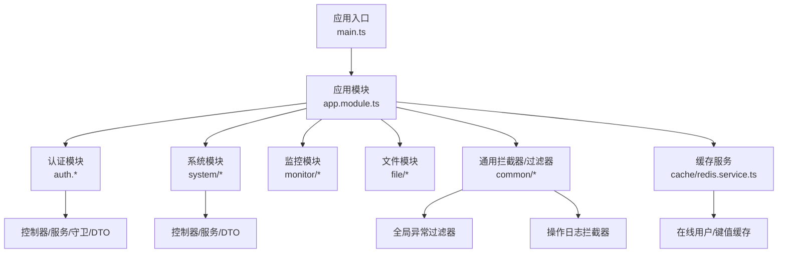
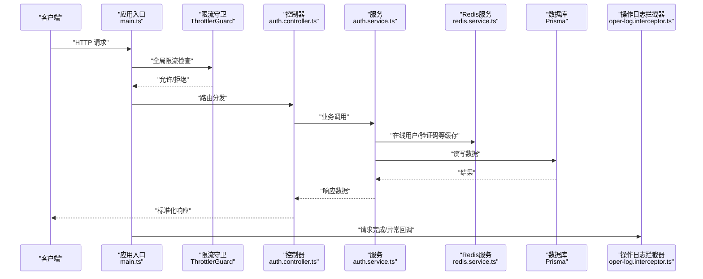
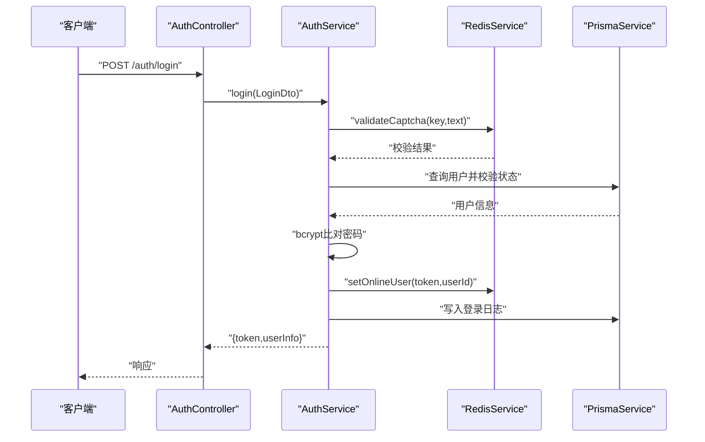
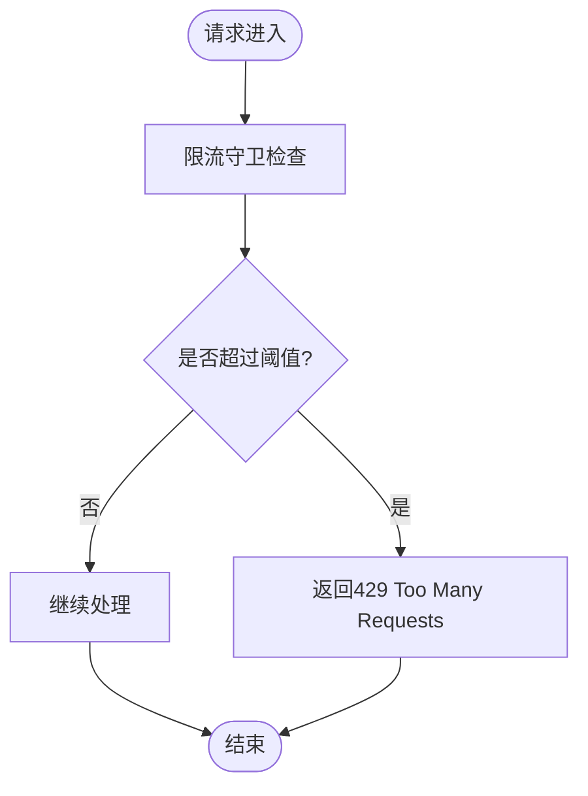
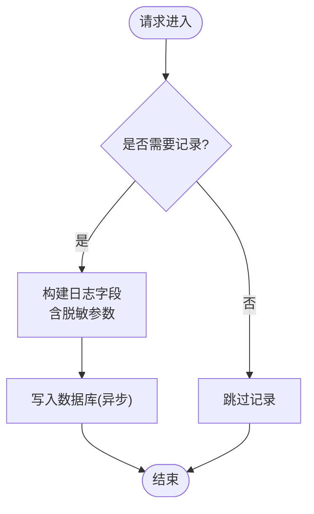
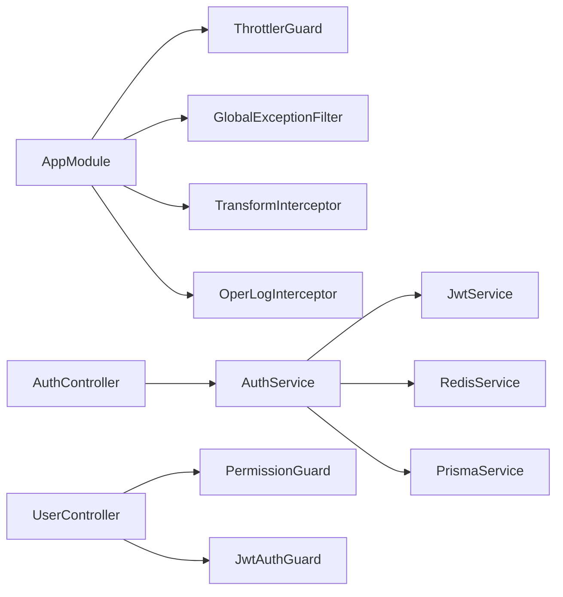

# API安全

<cite>
**本文引用的文件**
- [apps/backend/src/main.ts](file://apps/backend/src/main.ts)
- [apps/backend/src/app.module.ts](file://apps/backend/src/app.module.ts)
- [apps/backend/src/common/exception.filter.ts](file://apps/backend/src/common/exception.filter.ts)
- [apps/backend/src/common/oper-log.interceptor.ts](file://apps/backend/src/common/oper-log.interceptor.ts)
- [apps/backend/src/common/api-response.ts](file://apps/backend/src/common/api-response.ts)
- [apps/backend/src/auth/auth.controller.ts](file://apps/backend/src/auth/auth.controller.ts)
- [apps/backend/src/auth/auth.service.ts](file://apps/backend/src/auth/auth.service.ts)
- [apps/backend/src/auth/guards.ts](file://apps/backend/src/auth/guards.ts)
- [apps/backend/src/auth/jwt.guard.ts](file://apps/backend/src/auth/jwt.guard.ts)
- [apps/backend/src/auth/dto/auth.dto.ts](file://apps/backend/src/auth/dto/auth.dto.ts)
- [apps/backend/src/cache/redis.service.ts](file://apps/backend/src/cache/redis.service.ts)
- [apps/backend/src/modules/system/user/user.controller.ts](file://apps/backend/src/modules/system/user/user.controller.ts)
- [apps/backend/src/modules/system/user/dto/user.dto.ts](file://apps/backend/src/modules/system/user/dto/user.dto.ts)
- [apps/backend/src/common/prisma.service.ts](file://apps/backend/src/common/prisma.service.ts)
</cite>

## 目录
1. [引言](#引言)
2. [项目结构](#项目结构)
3. [核心组件](#核心组件)
4. [架构总览](#架构总览)
5. [详细组件分析](#详细组件分析)
6. [依赖关系分析](#依赖关系分析)
7. [性能考量](#性能考量)
8. [故障排查指南](#故障排查指南)
9. [结论](#结论)
10. [附录](#附录)

## 引言
本文件聚焦于该NestJS项目的API安全实践，系统梳理请求频率限制、身份认证与授权、操作审计、错误处理、限流与熔断、监控与异常检测、CORS与跨域策略、以及API文档与访问控制等主题。文档以仓库中现有实现为依据，结合最佳实践给出可操作的安全建议与改进方向。

## 项目结构
后端采用NestJS模块化架构，围绕认证鉴权、系统管理、监控、文件存储等模块组织。全局中间件与守卫在应用启动时统一注册，确保所有请求在进入业务逻辑前经过统一的校验与拦截。

图表来源
- [apps/backend/src/main.ts:1-48](file://apps/backend/src/main.ts#L1-L48)
- [apps/backend/src/app.module.ts:18-59](file://apps/backend/src/app.module.ts#L18-L59)

章节来源
- [apps/backend/src/main.ts:1-48](file://apps/backend/src/main.ts#L1-L48)
- [apps/backend/src/app.module.ts:18-59](file://apps/backend/src/app.module.ts#L18-L59)

## 核心组件
- 全局异常过滤器：统一捕获未处理异常，屏蔽内部细节，返回标准化响应。
- 操作日志拦截器：记录请求方法、URL、参数（敏感字段脱敏）、响应结果或错误、耗时、IP等。
- 认证与授权：基于JWT的身份认证，结合角色与权限守卫实现细粒度访问控制。
- 频率限制：全局启用限流守卫，默认每分钟最多60次请求。
- 在线用户与会话：通过Redis维护在线用户集合与令牌映射。
- 数据库连接：Prisma客户端配置日志级别，便于问题定位。
- API响应格式：统一的响应包装类，便于前端与监控系统解析。

章节来源
- [apps/backend/src/common/exception.filter.ts:12-37](file://apps/backend/src/common/exception.filter.ts#L12-L37)
- [apps/backend/src/common/oper-log.interceptor.ts:15-111](file://apps/backend/src/common/oper-log.interceptor.ts#L15-L111)
- [apps/backend/src/auth/guards.ts:19-51](file://apps/backend/src/auth/guards.ts#L19-L51)
- [apps/backend/src/auth/jwt.guard.ts:1-5](file://apps/backend/src/auth/jwt.guard.ts#L1-L5)
- [apps/backend/src/app.module.ts:24-29](file://apps/backend/src/app.module.ts#L24-L29)
- [apps/backend/src/cache/redis.service.ts:83-99](file://apps/backend/src/cache/redis.service.ts#L83-L99)
- [apps/backend/src/common/prisma.service.ts:8-12](file://apps/backend/src/common/prisma.service.ts#L8-L12)
- [apps/backend/src/common/api-response.ts:12-35](file://apps/backend/src/common/api-response.ts#L12-L35)

## 架构总览
下图展示从客户端到业务服务的关键交互路径，以及安全相关组件的介入点。

图表来源
- [apps/backend/src/main.ts:11-24](file://apps/backend/src/main.ts#L11-L24)
- [apps/backend/src/app.module.ts:40-55](file://apps/backend/src/app.module.ts#L40-L55)
- [apps/backend/src/auth/auth.controller.ts:13-87](file://apps/backend/src/auth/auth.controller.ts#L13-L87)
- [apps/backend/src/auth/auth.service.ts:29-89](file://apps/backend/src/auth/auth.service.ts#L29-L89)
- [apps/backend/src/cache/redis.service.ts:83-99](file://apps/backend/src/cache/redis.service.ts#L83-L99)
- [apps/backend/src/common/prisma.service.ts:8-12](file://apps/backend/src/common/prisma.service.ts#L8-L12)
- [apps/backend/src/common/oper-log.interceptor.ts:15-28](file://apps/backend/src/common/oper-log.interceptor.ts#L15-L28)

## 详细组件分析

### 身份认证与授权
- JWT认证：使用JWT守卫保护受控路由，登录成功签发令牌并写入Redis在线用户集合。
- 角色与权限：通过守卫读取元数据，校验用户角色与权限集合；控制器上使用装饰器声明所需权限。
- 登录流程要点：验证码校验（Redis存储与过期）、密码比对、登录日志记录、成功后生成JWT并登记在线状态。

图表来源
- [apps/backend/src/auth/auth.controller.ts:13-19](file://apps/backend/src/auth/auth.controller.ts#L13-L19)
- [apps/backend/src/auth/auth.service.ts:29-89](file://apps/backend/src/auth/auth.service.ts#L29-L89)
- [apps/backend/src/cache/redis.service.ts:83-99](file://apps/backend/src/cache/redis.service.ts#L83-L99)
- [apps/backend/src/common/prisma.service.ts:8-12](file://apps/backend/src/common/prisma.service.ts#L8-L12)

章节来源
- [apps/backend/src/auth/auth.controller.ts:13-19](file://apps/backend/src/auth/auth.controller.ts#L13-L19)
- [apps/backend/src/auth/auth.service.ts:29-89](file://apps/backend/src/auth/auth.service.ts#L29-L89)
- [apps/backend/src/auth/guards.ts:19-51](file://apps/backend/src/auth/guards.ts#L19-L51)
- [apps/backend/src/auth/jwt.guard.ts:1-5](file://apps/backend/src/auth/jwt.guard.ts#L1-L5)
- [apps/backend/src/auth/dto/auth.dto.ts:43-63](file://apps/backend/src/auth/dto/auth.dto.ts#L43-L63)

### 请求频率限制与熔断
- 全局限流：在应用模块中注册限流模块，设置默认规则（例如每分钟60次）。
- 熔断建议：当前未实现熔断器，可在网关或上游层引入熔断策略，或在服务内针对下游依赖（如Redis/DB）增加超时与降级逻辑。

图表来源
- [apps/backend/src/app.module.ts:24-29](file://apps/backend/src/app.module.ts#L24-L29)

章节来源
- [apps/backend/src/app.module.ts:24-29](file://apps/backend/src/app.module.ts#L24-L29)

### IP白名单与黑名单管理
- 当前实现未发现内置的IP白名单/黑名单机制。建议在网关或自定义守卫中实现IP黑白名单校验，并结合速率限制使用。

[本节为概念性建议，不直接分析具体文件]

### API签名验证与数字证书认证
- 当前未见API签名验证与数字证书认证实现。建议在网关层或自定义拦截器中引入签名算法与证书校验流程，确保请求完整性与来源可信。

[本节为概念性建议，不直接分析具体文件]

### API版本控制与向后兼容性安全考虑
- 版本控制：当前通过全局前缀“api”进行命名空间隔离，未见明确的版本号路径段。建议在路由层面显式标注版本（如“/api/v1/...”），并在变更时保持向后兼容或提供迁移指引。
- 安全考虑：版本切换期间应保留旧版接口的最小必要暴露时间，配合严格的访问控制与审计。

章节来源
- [apps/backend/src/main.ts:14-15](file://apps/backend/src/main.ts#L14-L15)

### API文档的安全发布与访问控制
- 文档发布：Swagger已启用并配置Bearer Token认证，可通过“/api-docs”访问。
- 访问控制：建议仅在开发环境暴露文档，生产环境移除或限制访问。

章节来源
- [apps/backend/src/main.ts:26-35](file://apps/backend/src/main.ts#L26-L35)

### API错误信息的安全处理
- 统一异常过滤器：捕获未处理异常，屏蔽堆栈与内部细节，返回标准化错误响应。
- 建议：对敏感字段（如密码、令牌、验证码）在日志中进行脱敏处理；对外仅返回通用错误信息。

章节来源
- [apps/backend/src/common/exception.filter.ts:16-36](file://apps/backend/src/common/exception.filter.ts#L16-L36)
- [apps/backend/src/common/oper-log.interceptor.ts:81-99](file://apps/backend/src/common/oper-log.interceptor.ts#L81-L99)

### 操作审计日志与异常检测
- 操作日志拦截器：记录请求方法、URL、参数（敏感字段脱敏）、响应结果或错误、耗时、IP等；仅对非GET且有用户上下文的请求记录。
- 异常检测：建议在日志系统中建立规则，识别高频失败、异常耗时、异常IP来源等模式，并联动告警。

图表来源
- [apps/backend/src/common/oper-log.interceptor.ts:15-70](file://apps/backend/src/common/oper-log.interceptor.ts#L15-L70)
- [apps/backend/src/common/oper-log.interceptor.ts:30-61](file://apps/backend/src/common/oper-log.interceptor.ts#L30-L61)

章节来源
- [apps/backend/src/common/oper-log.interceptor.ts:15-111](file://apps/backend/src/common/oper-log.interceptor.ts#L15-L111)

### CORS配置与跨域安全策略
- CORS启用：应用入口启用了CORS，未指定白名单域名。
- 建议：生产环境限定允许的源、方法与头，避免使用通配符；对凭证请求谨慎放行。

章节来源
- [apps/backend/src/main.ts:11-12](file://apps/backend/src/main.ts#L11-L12)

### API安全测试与漏洞扫描最佳实践
- 单元/集成测试：对认证、授权、日志、异常过滤器等关键路径编写测试用例。
- 渗透测试：定期对登录、用户管理、文件上传等高风险接口进行安全评估。
- 依赖扫描：使用工具扫描第三方依赖中的已知漏洞并及时升级。

[本节为通用实践建议，不直接分析具体文件]

## 依赖关系分析
- 应用模块集中注册全局守卫、过滤器与拦截器，形成统一的安全边界。
- 认证模块依赖JWT服务、Redis与数据库；系统模块依赖权限守卫与JWT守卫。
- 操作日志拦截器依赖Prisma服务写入审计表。

图表来源
- [apps/backend/src/app.module.ts:39-55](file://apps/backend/src/app.module.ts#L39-L55)
- [apps/backend/src/auth/auth.controller.ts:13-87](file://apps/backend/src/auth/auth.controller.ts#L13-L87)
- [apps/backend/src/auth/auth.service.ts:22-27](file://apps/backend/src/auth/auth.service.ts#L22-L27)
- [apps/backend/src/modules/system/user/user.controller.ts:17-18](file://apps/backend/src/modules/system/user/user.controller.ts#L17-L18)
- [apps/backend/src/auth/guards.ts:36-50](file://apps/backend/src/auth/guards.ts#L36-L50)
- [apps/backend/src/auth/jwt.guard.ts:1-5](file://apps/backend/src/auth/jwt.guard.ts#L1-L5)

章节来源
- [apps/backend/src/app.module.ts:39-55](file://apps/backend/src/app.module.ts#L39-L55)
- [apps/backend/src/auth/auth.controller.ts:13-87](file://apps/backend/src/auth/auth.controller.ts#L13-L87)
- [apps/backend/src/auth/auth.service.ts:22-27](file://apps/backend/src/auth/auth.service.ts#L22-L27)
- [apps/backend/src/modules/system/user/user.controller.ts:17-18](file://apps/backend/src/modules/system/user/user.controller.ts#L17-L18)

## 性能考量
- 限流策略：默认每分钟60次，需根据业务峰值调整；对不同端点可配置差异化规则。
- 缓存优化：Redis用于在线用户与验证码，建议合理设置TTL与键命名规范。
- 日志写入：操作日志写库采用异步捕获，避免阻塞主流程。
- 数据库连接：Prisma日志级别已配置，便于问题定位但需关注日志量。

[本节提供通用指导，不直接分析具体文件]

## 故障排查指南
- 未登录或令牌无效：确认JWT守卫是否正确应用，检查Redis中的在线用户映射是否存在。
- 验证码失效：检查Redis中验证码键是否存在且未过期。
- 频繁触发限流：核对限流配置与实际流量，必要时为特定端点放宽限制。
- 错误信息泄露：检查异常过滤器与日志脱敏策略，确保不输出敏感信息。
- 跨域问题：核对CORS配置与浏览器开发者工具Network面板的预检请求结果。

章节来源
- [apps/backend/src/auth/auth.service.ts:121-128](file://apps/backend/src/auth/auth.service.ts#L121-L128)
- [apps/backend/src/cache/redis.service.ts:83-99](file://apps/backend/src/cache/redis.service.ts#L83-L99)
- [apps/backend/src/common/exception.filter.ts:16-36](file://apps/backend/src/common/exception.filter.ts#L16-L36)
- [apps/backend/src/app.module.ts:24-29](file://apps/backend/src/app.module.ts#L24-L29)
- [apps/backend/src/main.ts:11-12](file://apps/backend/src/main.ts#L11-L12)

## 结论
该项目在API安全方面已具备基础能力：统一异常处理、操作审计、JWT认证与权限守卫、全局限流与CORS启用。为进一步提升安全性，建议补充IP黑白名单、API签名与证书认证、明确的API版本控制策略、生产环境文档访问控制、完善的错误信息脱敏与异常检测规则，以及持续的安全测试与漏洞扫描流程。

[本节为总结性内容，不直接分析具体文件]

## 附录

### API响应格式
- 成功/错误/未授权/禁止/未找到/错误请求均有统一包装，便于前端与监控系统一致处理。

章节来源
- [apps/backend/src/common/api-response.ts:12-35](file://apps/backend/src/common/api-response.ts#L12-L35)

### 用户管理接口示例
- 使用JWT与权限守卫保护用户管理端点，要求具备相应权限标识。

章节来源
- [apps/backend/src/modules/system/user/user.controller.ts:26-87](file://apps/backend/src/modules/system/user/user.controller.ts#L26-L87)
- [apps/backend/src/modules/system/user/dto/user.dto.ts:5-47](file://apps/backend/src/modules/system/user/dto/user.dto.ts#L5-L47)