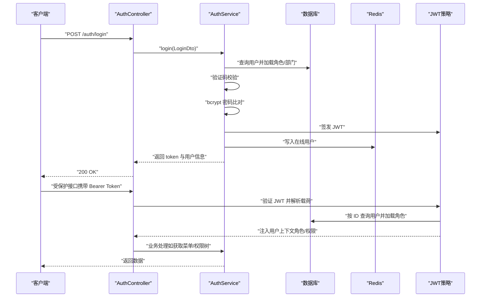
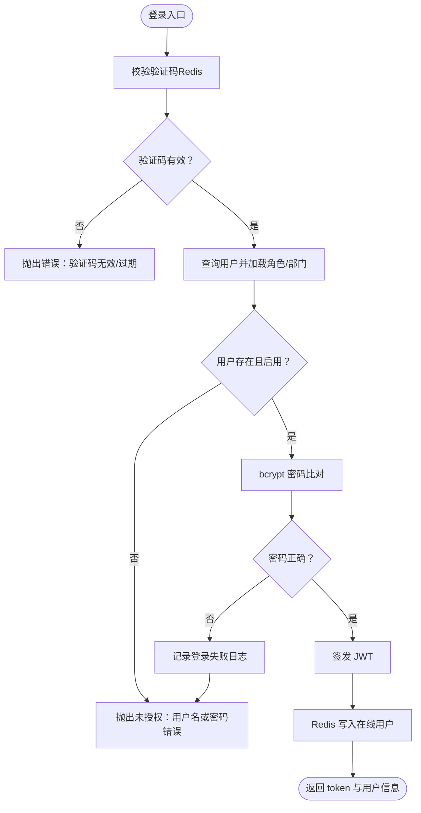
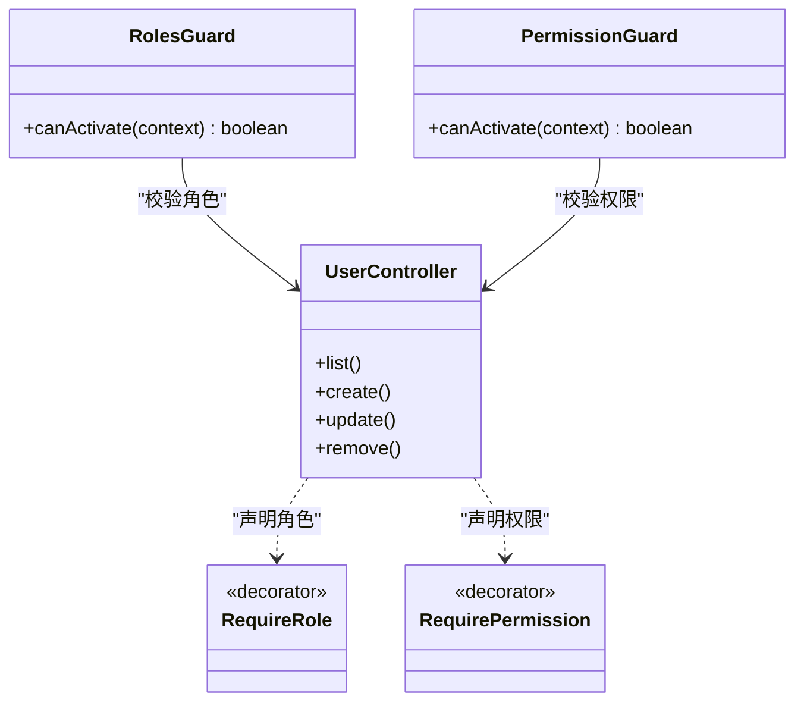
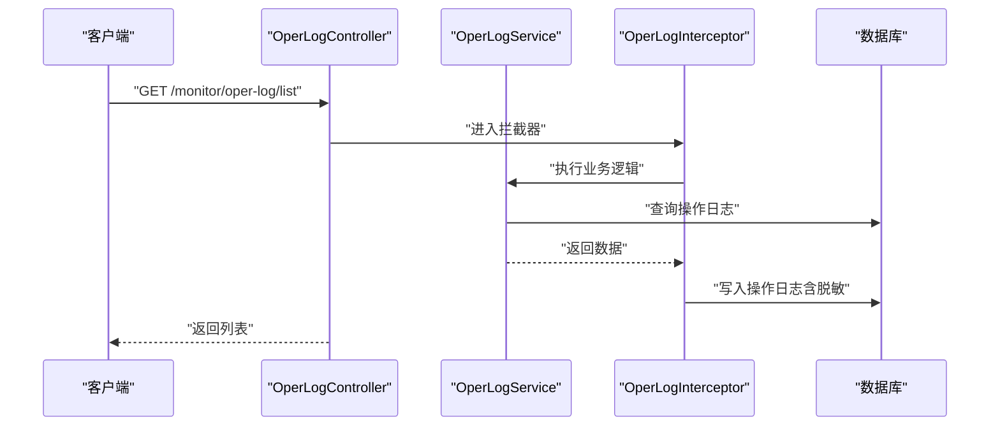
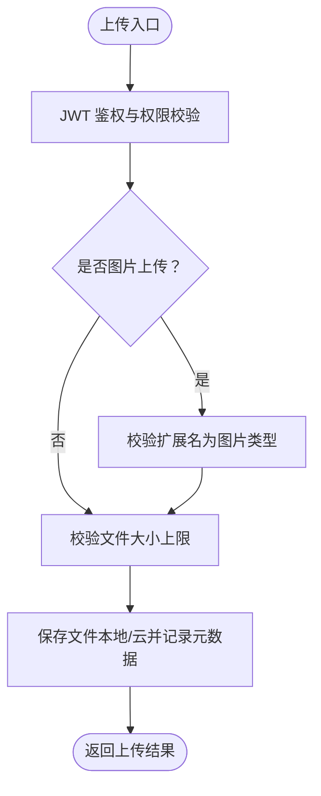
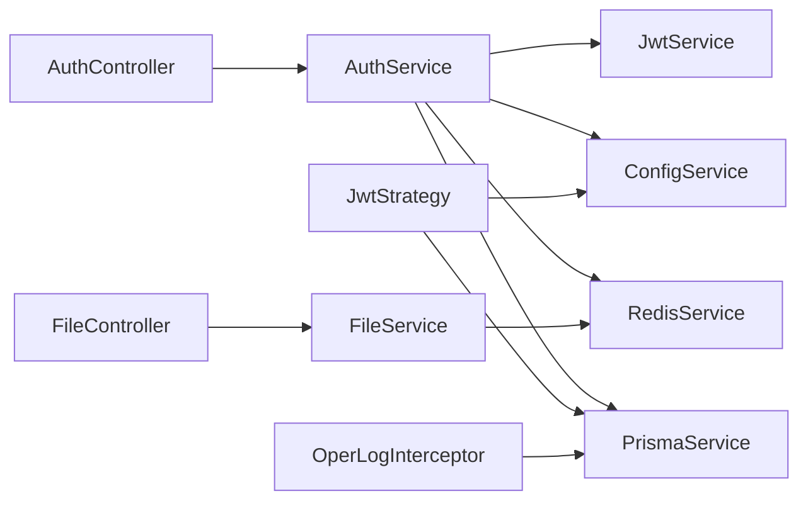

# 安全最佳实践

<cite>
**本文引用的文件**
- [apps/backend/src/auth/auth.controller.ts](file://apps/backend/src/auth/auth.controller.ts)
- [apps/backend/src/auth/auth.service.ts](file://apps/backend/src/auth/auth.service.ts)
- [apps/backend/src/auth/guards.ts](file://apps/backend/src/auth/guards.ts)
- [apps/backend/src/auth/jwt.guard.ts](file://apps/backend/src/auth/jwt.guard.ts)
- [apps/backend/src/auth/jwt.strategy.ts](file://apps/backend/src/auth/jwt.strategy.ts)
- [apps/backend/src/config/env.config.ts](file://apps/backend/src/config/env.config.ts)
- [apps/backend/src/common/oper-log.interceptor.ts](file://apps/backend/src/common/oper-log.interceptor.ts)
- [apps/backend/src/common/exception.filter.ts](file://apps/backend/src/common/exception.filter.ts)
- [apps/backend/src/modules/system/user/user.controller.ts](file://apps/backend/src/modules/system/user/user.controller.ts)
- [apps/backend/src/modules/system/user/user.service.ts](file://apps/backend/src/modules/system/user/user.service.ts)
- [apps/backend/src/cache/redis.service.ts](file://apps/backend/src/cache/redis.service.ts)
- [apps/backend/src/modules/monitor/login-log/login-log.controller.ts](file://apps/backend/src/modules/monitor/login-log/login-log.controller.ts)
- [apps/backend/src/modules/monitor/oper-log/oper-log.controller.ts](file://apps/backend/src/modules/monitor/oper-log/oper-log.controller.ts)
- [apps/backend/src/modules/file/file.controller.ts](file://apps/backend/src/modules/file/file.controller.ts)
- [apps/backend/src/modules/file/file.service.ts](file://apps/backend/src/modules/file/file.service.ts)
</cite>

## 目录
1. [引言](#引言)
2. [项目结构](#项目结构)
3. [核心组件](#核心组件)
4. [架构总览](#架构总览)
5. [详细组件分析](#详细组件分析)
6. [依赖关系分析](#依赖关系分析)
7. [性能与安全特性](#性能与安全特性)
8. [故障排查指南](#故障排查指南)
9. [结论](#结论)
10. [附录：安全检查清单与建议](#附录安全检查清单与建议)

## 引言
本文件面向安全最佳实践，结合代码库中的实际实现，系统梳理认证安全（JWT）、授权控制（RBAC）、数据安全（密码与参数）、传输安全（HTTPS/密钥管理）、日志审计、文件上传安全、以及防暴力破解与应急响应建议。目标是帮助开发者与运维人员在不牺牲可用性的前提下，构建健壮、可审计、可扩展的安全体系。

## 项目结构
后端采用 NestJS 模块化组织，安全相关能力主要分布在以下区域：
- 认证与授权：auth 控制器、服务、守卫、策略
- 配置：环境变量与运行时配置
- 日志与异常：操作日志拦截器、全局异常过滤器
- 系统与监控：用户管理、登录日志、操作日志控制器
- 缓存：Redis 在线用户与会话状态管理
- 文件管理：文件上传、预览、存储配置与访问控制

```mermaid
graph TB
subgraph "认证与授权"
AC["AuthController<br/>apps/backend/src/auth/auth.controller.ts"]
AS["AuthService<br/>apps/backend/src/auth/auth.service.ts"]
JG["JwtAuthGuard<br/>apps/backend/src/auth/jwt.guard.ts"]
JS["JwtStrategy<br/>apps/backend/src/auth/jwt.strategy.ts"]
G["守卫与元数据<br/>apps/backend/src/auth/guards.ts"]
end
subgraph "配置与环境"
ENV["环境配置<br/>apps/backend/src/config/env.config.ts"]
end
subgraph "日志与异常"
OLI["操作日志拦截器<br/>apps/backend/src/common/oper-log.interceptor.ts"]
EF["全局异常过滤器<br/>apps/backend/src/common/exception.filter.ts"]
end
subgraph "系统与监控"
UC["UserController<br/>apps/backend/src/modules/system/user/user.controller.ts"]
US["UserService<br/>apps/backend/src/modules/system/user/user.service.ts"]
LGC["LoginLogController<br/>apps/backend/src/modules/monitor/login-log/login-log.controller.ts"]
OLC["OperLogController<br/>apps/backend/src/modules/monitor/oper-log/oper-log.controller.ts"]
end
subgraph "缓存与文件"
RS["RedisService<br/>apps/backend/src/cache/redis.service.ts"]
FC["FileController<br/>apps/backend/src/modules/file/file.controller.ts"]
FS["FileService<br/>apps/backend/src/modules/file/file.service.ts"]
end
AC --> AS
AS --> JS
AC --> JG
UC --> G
UC --> JG
OLI --> AS
FS --> RS
FC --> RS
ENV --> AS
ENV --> FS
```

图表来源
- [apps/backend/src/auth/auth.controller.ts:1-87](file://apps/backend/src/auth/auth.controller.ts#L1-L87)
- [apps/backend/src/auth/auth.service.ts:1-294](file://apps/backend/src/auth/auth.service.ts#L1-L294)
- [apps/backend/src/auth/jwt.guard.ts:1-5](file://apps/backend/src/auth/jwt.guard.ts#L1-L5)
- [apps/backend/src/auth/jwt.strategy.ts:1-78](file://apps/backend/src/auth/jwt.strategy.ts#L1-L78)
- [apps/backend/src/auth/guards.ts:1-51](file://apps/backend/src/auth/guards.ts#L1-L51)
- [apps/backend/src/config/env.config.ts:1-47](file://apps/backend/src/config/env.config.ts#L1-L47)
- [apps/backend/src/common/oper-log.interceptor.ts:1-111](file://apps/backend/src/common/oper-log.interceptor.ts#L1-L111)
- [apps/backend/src/common/exception.filter.ts:1-37](file://apps/backend/src/common/exception.filter.ts#L1-L37)
- [apps/backend/src/modules/system/user/user.controller.ts:1-89](file://apps/backend/src/modules/system/user/user.controller.ts#L1-L89)
- [apps/backend/src/modules/system/user/user.service.ts:1-144](file://apps/backend/src/modules/system/user/user.service.ts#L1-L144)
- [apps/backend/src/modules/monitor/login-log/login-log.controller.ts:1-45](file://apps/backend/src/modules/monitor/login-log/login-log.controller.ts#L1-L45)
- [apps/backend/src/modules/monitor/oper-log/oper-log.controller.ts:1-35](file://apps/backend/src/modules/monitor/oper-log/oper-log.controller.ts#L1-L35)
- [apps/backend/src/cache/redis.service.ts:1-128](file://apps/backend/src/cache/redis.service.ts#L1-L128)
- [apps/backend/src/modules/file/file.controller.ts:1-100](file://apps/backend/src/modules/file/file.controller.ts#L1-L100)
- [apps/backend/src/modules/file/file.service.ts:1-310](file://apps/backend/src/modules/file/file.service.ts#L1-L310)

章节来源
- [apps/backend/src/auth/auth.controller.ts:1-87](file://apps/backend/src/auth/auth.controller.ts#L1-L87)
- [apps/backend/src/auth/auth.service.ts:1-294](file://apps/backend/src/auth/auth.service.ts#L1-L294)
- [apps/backend/src/auth/guards.ts:1-51](file://apps/backend/src/auth/guards.ts#L1-L51)
- [apps/backend/src/auth/jwt.guard.ts:1-5](file://apps/backend/src/auth/jwt.guard.ts#L1-L5)
- [apps/backend/src/auth/jwt.strategy.ts:1-78](file://apps/backend/src/auth/jwt.strategy.ts#L1-L78)
- [apps/backend/src/config/env.config.ts:1-47](file://apps/backend/src/config/env.config.ts#L1-L47)
- [apps/backend/src/common/oper-log.interceptor.ts:1-111](file://apps/backend/src/common/oper-log.interceptor.ts#L1-L111)
- [apps/backend/src/common/exception.filter.ts:1-37](file://apps/backend/src/common/exception.filter.ts#L1-L37)
- [apps/backend/src/modules/system/user/user.controller.ts:1-89](file://apps/backend/src/modules/system/user/user.controller.ts#L1-L89)
- [apps/backend/src/modules/system/user/user.service.ts:1-144](file://apps/backend/src/modules/system/user/user.service.ts#L1-L144)
- [apps/backend/src/modules/monitor/login-log/login-log.controller.ts:1-45](file://apps/backend/src/modules/monitor/login-log/login-log.controller.ts#L1-L45)
- [apps/backend/src/modules/monitor/oper-log/oper-log.controller.ts:1-35](file://apps/backend/src/modules/monitor/oper-log/oper-log.controller.ts#L1-L35)
- [apps/backend/src/cache/redis.service.ts:1-128](file://apps/backend/src/cache/redis.service.ts#L1-L128)
- [apps/backend/src/modules/file/file.controller.ts:1-100](file://apps/backend/src/modules/file/file.controller.ts#L1-L100)
- [apps/backend/src/modules/file/file.service.ts:1-310](file://apps/backend/src/modules/file/file.service.ts#L1-L310)

## 核心组件
- 认证与会话
  - 登录接口通过验证码校验与密码比对，成功后签发 JWT，并将在线用户信息写入 Redis；登出时移除在线状态。
  - JWT 策略负责从请求头提取令牌、校验过期与签名，并加载用户的角色与权限集合。
- 授权控制（RBAC）
  - 基于元数据的 RequireRole 与 RequirePermission 装饰器，配合 RolesGuard 与 PermissionGuard 实现角色与权限双重校验。
- 数据安全
  - 密码使用 bcrypt 加盐哈希；请求体敏感字段在日志中脱敏；查询参数与路径参数安全处理。
- 传输安全
  - JWT 密钥与过期时间由环境变量配置；文件上传大小限制与类型白名单。
- 日志与审计
  - 操作日志拦截器自动记录请求方法、URL、参数（含敏感字段脱敏）、响应结果或错误、耗时与 IP；全局异常过滤器统一错误输出。
- 文件上传安全
  - 上传接口鉴权与权限控制；本地存储路径规范化与越界检测；云存储支持与公共 URL 重定向。

章节来源
- [apps/backend/src/auth/auth.controller.ts:1-87](file://apps/backend/src/auth/auth.controller.ts#L1-L87)
- [apps/backend/src/auth/auth.service.ts:1-294](file://apps/backend/src/auth/auth.service.ts#L1-L294)
- [apps/backend/src/auth/jwt.strategy.ts:1-78](file://apps/backend/src/auth/jwt.strategy.ts#L1-L78)
- [apps/backend/src/auth/guards.ts:1-51](file://apps/backend/src/auth/guards.ts#L1-L51)
- [apps/backend/src/common/oper-log.interceptor.ts:1-111](file://apps/backend/src/common/oper-log.interceptor.ts#L1-L111)
- [apps/backend/src/common/exception.filter.ts:1-37](file://apps/backend/src/common/exception.filter.ts#L1-L37)
- [apps/backend/src/modules/file/file.controller.ts:1-100](file://apps/backend/src/modules/file/file.controller.ts#L1-L100)
- [apps/backend/src/modules/file/file.service.ts:1-310](file://apps/backend/src/modules/file/file.service.ts#L1-L310)

## 架构总览
下图展示从客户端到后端服务的关键交互与安全控制点：

图表来源
- [apps/backend/src/auth/auth.controller.ts:1-87](file://apps/backend/src/auth/auth.controller.ts#L1-L87)
- [apps/backend/src/auth/auth.service.ts:1-294](file://apps/backend/src/auth/auth.service.ts#L1-L294)
- [apps/backend/src/auth/jwt.strategy.ts:1-78](file://apps/backend/src/auth/jwt.strategy.ts#L1-L78)
- [apps/backend/src/cache/redis.service.ts:1-128](file://apps/backend/src/cache/redis.service.ts#L1-L128)

## 详细组件分析

### 认证与会话（JWT）
- 登录流程
  - 验证码校验：从 Redis 读取并比对，成功后删除验证码键。
  - 用户查询与状态校验：确保用户存在且未被删除/禁用。
  - 密码校验：bcrypt 比对失败时记录登录日志。
  - 成功后签发 JWT，并将 token 与用户 ID 写入 Redis 的在线用户集合。
- 退出流程
  - 从 Authorization 头部提取 Bearer token，调用 Redis 移除在线用户。
- JWT 策略
  - 从请求头提取 Bearer token，校验过期与签名。
  - 从数据库加载用户及其角色，计算权限集合（超级管理员或基于菜单集的权限）。
- 配置
  - JWT 密钥与过期时间来自环境变量，避免硬编码。

图表来源
- [apps/backend/src/auth/auth.service.ts:1-294](file://apps/backend/src/auth/auth.service.ts#L1-L294)
- [apps/backend/src/cache/redis.service.ts:1-128](file://apps/backend/src/cache/redis.service.ts#L1-L128)

章节来源
- [apps/backend/src/auth/auth.controller.ts:1-87](file://apps/backend/src/auth/auth.controller.ts#L1-L87)
- [apps/backend/src/auth/auth.service.ts:1-294](file://apps/backend/src/auth/auth.service.ts#L1-L294)
- [apps/backend/src/auth/jwt.strategy.ts:1-78](file://apps/backend/src/auth/jwt.strategy.ts#L1-L78)
- [apps/backend/src/config/env.config.ts:1-47](file://apps/backend/src/config/env.config.ts#L1-L47)

### 授权控制（RBAC）
- 角色与权限
  - 元数据装饰器 RequireRole 与 RequirePermission 分别声明所需角色与权限。
  - RolesGuard 与 PermissionGuard 从请求上下文读取用户角色/权限，进行匹配。
- 特殊角色
  - 超级管理员拥有全部菜单权限，其他用户按其角色绑定的菜单集合计算权限。
- 控制器应用
  - 用户管理、监控等模块均使用 JwtAuthGuard 与 PermissionGuard 组合守卫。

图表来源
- [apps/backend/src/auth/guards.ts:1-51](file://apps/backend/src/auth/guards.ts#L1-L51)
- [apps/backend/src/modules/system/user/user.controller.ts:1-89](file://apps/backend/src/modules/system/user/user.controller.ts#L1-L89)

章节来源
- [apps/backend/src/auth/guards.ts:1-51](file://apps/backend/src/auth/guards.ts#L1-L51)
- [apps/backend/src/modules/system/user/user.controller.ts:1-89](file://apps/backend/src/modules/system/user/user.controller.ts#L1-L89)
- [apps/backend/src/modules/system/user/user.service.ts:1-144](file://apps/backend/src/modules/system/user/user.service.ts#L1-L144)

### 数据安全（密码与参数）
- 密码处理
  - 注册与更新密码均使用 bcrypt 进行加盐哈希，避免明文存储。
- 请求参数与日志脱敏
  - 操作日志拦截器对请求体中的 password/token/authorization/captcha 等字段进行脱敏处理，避免敏感信息落库。
- 参数校验
  - 控制器层使用 ParseIntPipe 等管道进行参数类型转换与边界约束。

章节来源
- [apps/backend/src/auth/auth.service.ts:1-294](file://apps/backend/src/auth/auth.service.ts#L1-L294)
- [apps/backend/src/modules/system/user/user.service.ts:1-144](file://apps/backend/src/modules/system/user/user.service.ts#L1-L144)
- [apps/backend/src/common/oper-log.interceptor.ts:1-111](file://apps/backend/src/common/oper-log.interceptor.ts#L1-L111)

### 传输安全（密钥与过期）
- JWT 密钥与过期时间
  - 通过环境变量配置，避免硬编码；默认值仅为开发用途，生产必须覆盖。
- 文件上传与存储
  - 上传大小限制与类型白名单（仅允许常见图片扩展名），本地存储路径规范化以防止目录穿越。

章节来源
- [apps/backend/src/config/env.config.ts:1-47](file://apps/backend/src/config/env.config.ts#L1-L47)
- [apps/backend/src/modules/file/file.service.ts:1-310](file://apps/backend/src/modules/file/file.service.ts#L1-L310)

### 日志与审计
- 操作日志拦截器
  - 自动记录请求方法、URL、参数（敏感字段脱敏）、响应结果或错误、耗时与 IP；仅对非 GET 且非特定监控接口记录。
- 登录日志与操作日志
  - 登录日志与操作日志控制器均受 JwtAuthGuard 与 PermissionGuard 保护，支持分页查询与清理。
- 全局异常过滤器
  - 将未捕获异常统一为标准错误响应，便于前端与审计系统一致处理。

图表来源
- [apps/backend/src/modules/monitor/oper-log/oper-log.controller.ts:1-35](file://apps/backend/src/modules/monitor/oper-log/oper-log.controller.ts#L1-L35)
- [apps/backend/src/common/oper-log.interceptor.ts:1-111](file://apps/backend/src/common/oper-log.interceptor.ts#L1-L111)

章节来源
- [apps/backend/src/common/oper-log.interceptor.ts:1-111](file://apps/backend/src/common/oper-log.interceptor.ts#L1-L111)
- [apps/backend/src/modules/monitor/login-log/login-log.controller.ts:1-45](file://apps/backend/src/modules/monitor/login-log/login-log.controller.ts#L1-L45)
- [apps/backend/src/modules/monitor/oper-log/oper-log.controller.ts:1-35](file://apps/backend/src/modules/monitor/oper-log/oper-log.controller.ts#L1-L35)
- [apps/backend/src/common/exception.filter.ts:1-37](file://apps/backend/src/common/exception.filter.ts#L1-L37)

### 文件上传安全
- 权限与鉴权
  - 上传接口使用 JwtAuthGuard；部分管理接口需要系统权限。
- 上传限制
  - 通过环境变量与配置表设置最大文件大小与图片大小；仅允许图片扩展名。
- 存储与访问
  - 支持本地与云存储（OSS/对象存储），本地预览时进行路径规范化与越界检测；云存储通过公共 URL 重定向。
- 删除与清理
  - 删除文件时尝试同步删除远端对象，同时标记数据库记录为已删除。

图表来源
- [apps/backend/src/modules/file/file.controller.ts:1-100](file://apps/backend/src/modules/file/file.controller.ts#L1-L100)
- [apps/backend/src/modules/file/file.service.ts:1-310](file://apps/backend/src/modules/file/file.service.ts#L1-L310)

章节来源
- [apps/backend/src/modules/file/file.controller.ts:1-100](file://apps/backend/src/modules/file/file.controller.ts#L1-L100)
- [apps/backend/src/modules/file/file.service.ts:1-310](file://apps/backend/src/modules/file/file.service.ts#L1-L310)

## 依赖关系分析
- 组件耦合
  - AuthController 依赖 AuthService；AuthService 依赖 PrismaService、JwtService、ConfigService、RedisService。
  - JwtStrategy 依赖 ConfigService 与 PrismaService；JwtAuthGuard 作为策略门面。
  - 拦截器与过滤器贯穿所有请求，形成横切关注点。
- 外部依赖
  - Redis 用于在线用户与会话状态；Prisma 用于数据持久化；Multer/云存储 SDK 用于文件上传。
- 潜在风险
  - 若 Redis 不可用，可能影响在线用户状态与验证码；需具备降级与告警策略。
  - JWT 密钥泄露将导致伪造令牌风险，需定期轮换与严格权限管控。

图表来源
- [apps/backend/src/auth/auth.controller.ts:1-87](file://apps/backend/src/auth/auth.controller.ts#L1-L87)
- [apps/backend/src/auth/auth.service.ts:1-294](file://apps/backend/src/auth/auth.service.ts#L1-L294)
- [apps/backend/src/auth/jwt.strategy.ts:1-78](file://apps/backend/src/auth/jwt.strategy.ts#L1-L78)
- [apps/backend/src/common/oper-log.interceptor.ts:1-111](file://apps/backend/src/common/oper-log.interceptor.ts#L1-L111)
- [apps/backend/src/modules/file/file.controller.ts:1-100](file://apps/backend/src/modules/file/file.controller.ts#L1-L100)
- [apps/backend/src/modules/file/file.service.ts:1-310](file://apps/backend/src/modules/file/file.service.ts#L1-L310)
- [apps/backend/src/cache/redis.service.ts:1-128](file://apps/backend/src/cache/redis.service.ts#L1-L128)

章节来源
- [apps/backend/src/auth/auth.service.ts:1-294](file://apps/backend/src/auth/auth.service.ts#L1-L294)
- [apps/backend/src/cache/redis.service.ts:1-128](file://apps/backend/src/cache/redis.service.ts#L1-L128)

## 性能与安全特性
- 性能
  - Redis 在线用户与会话状态管理，减少数据库压力；操作日志异步写入，避免阻塞主流程。
- 安全
  - bcrypt 哈希、JWT 过期校验、验证码、参数脱敏、上传大小与类型限制、路径规范化与越界检测。
- 可扩展性
  - 通过配置中心集中管理密钥与阈值；文件存储抽象工厂支持多云适配。

[本节为通用讨论，无需列出具体文件来源]

## 故障排查指南
- 登录失败
  - 检查验证码是否过期或不匹配；确认用户状态正常；查看登录日志表定位失败原因。
- 403/401
  - 确认令牌格式与有效期；核对用户角色与权限是否满足 RequireRole/RequirePermission；检查 Redis 在线状态。
- 操作日志缺失
  - 确认拦截器生效范围（GET 与特定监控接口不会记录）；检查数据库连接与写入异常。
- 文件上传失败
  - 检查文件大小与类型限制；确认存储配置与凭证；本地模式检查上传目录权限与路径规范化。

章节来源
- [apps/backend/src/auth/auth.service.ts:1-294](file://apps/backend/src/auth/auth.service.ts#L1-L294)
- [apps/backend/src/modules/monitor/login-log/login-log.controller.ts:1-45](file://apps/backend/src/modules/monitor/login-log/login-log.controller.ts#L1-L45)
- [apps/backend/src/common/oper-log.interceptor.ts:1-111](file://apps/backend/src/common/oper-log.interceptor.ts#L1-L111)
- [apps/backend/src/modules/file/file.service.ts:1-310](file://apps/backend/src/modules/file/file.service.ts#L1-L310)

## 结论
该代码库在认证、授权、数据与传输安全方面提供了较为完善的实现：JWT 策略与守卫构成基础防线，RBAC 通过元数据与守卫落地执行，日志与异常过滤器保障可观测性，文件上传具备基本的大小、类型与路径安全控制。建议在生产环境中强化密钥轮换、引入速率限制与 WAF、完善渗透测试与漏洞扫描流程，并建立标准化的安全事件响应机制。

[本节为总结性内容，无需列出具体文件来源]

## 附录：安全检查清单与建议
- 密钥与配置
  - 生产环境必须覆盖 JWT 密钥与过期时间；定期轮换密钥；限制密钥访问权限。
- 速率限制与防暴力破解
  - 引入基于 IP 或账户的限流策略（如每分钟登录尝试次数），超过阈值临时封禁。
- 输入验证与输出编码
  - 使用 DTO 与管道进行强类型校验；对富文本输出进行 HTML/JS 编码；CSRF 防护（如 SameSite Cookie 与 CSRF Token）。
- 传输加密
  - 强制 HTTPS；TLS 最低版本与套件升级；证书轮换自动化。
- 数据加密
  - 对敏感字段（如支付信息）进行静态加密；备份数据加密存储。
- 安全审计
  - 操作日志保留周期与合规要求；异常告警与联动处置。
- 文件上传
  - 恶意文件检测（病毒扫描/内容识别）；缩略图生成与只读访问；CDN 回源鉴权。
- 渗透测试与漏洞扫描
  - 定期进行 SAST/DAST 扫描；模拟社会工程与 API 暴力破解演练。
- 应急响应
  - 制定密钥泄露、令牌滥用、数据泄露等场景的应急预案与恢复流程。

[本节为通用建议，无需列出具体文件来源]