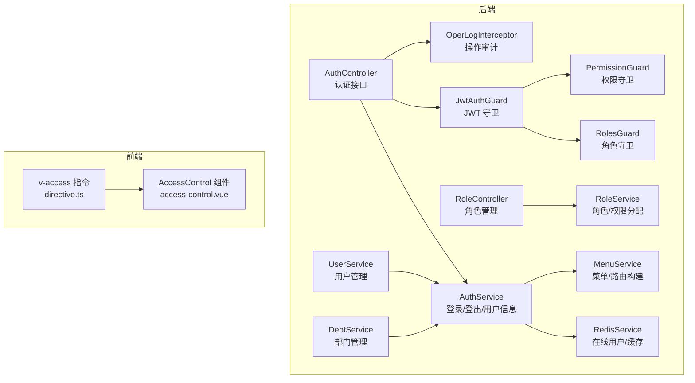
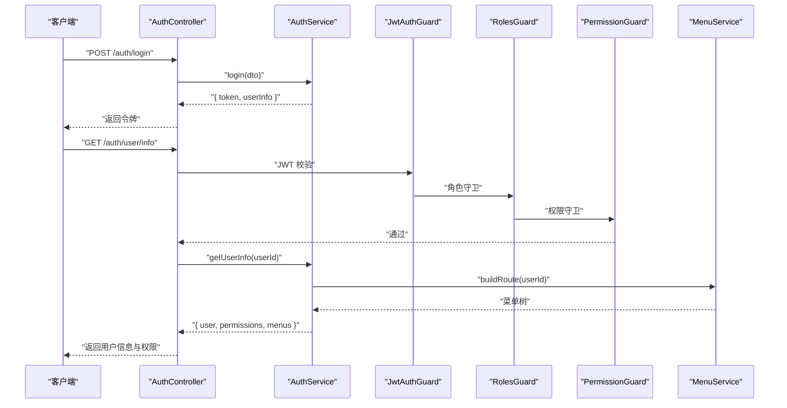
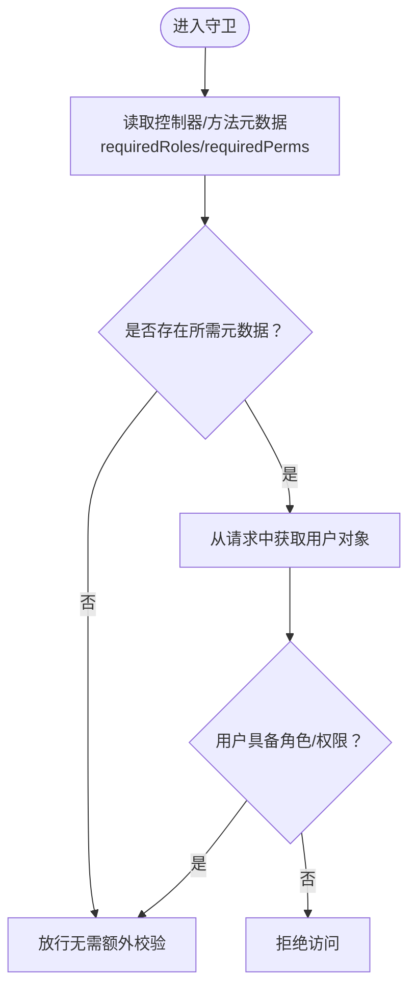
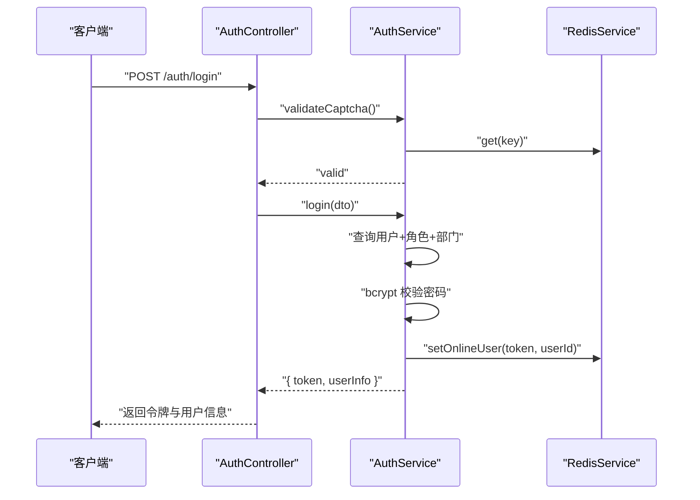
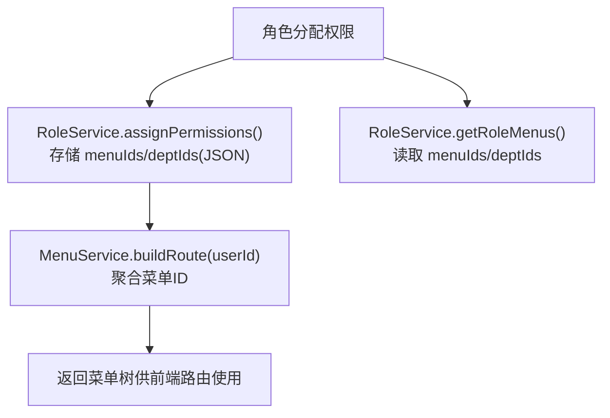
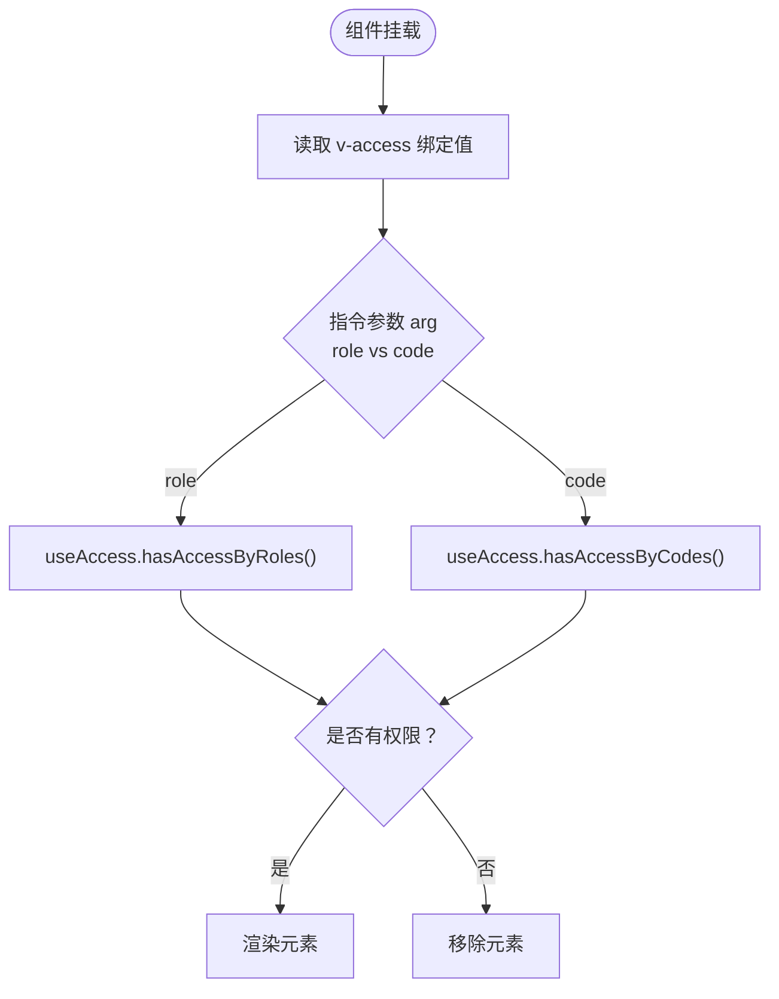
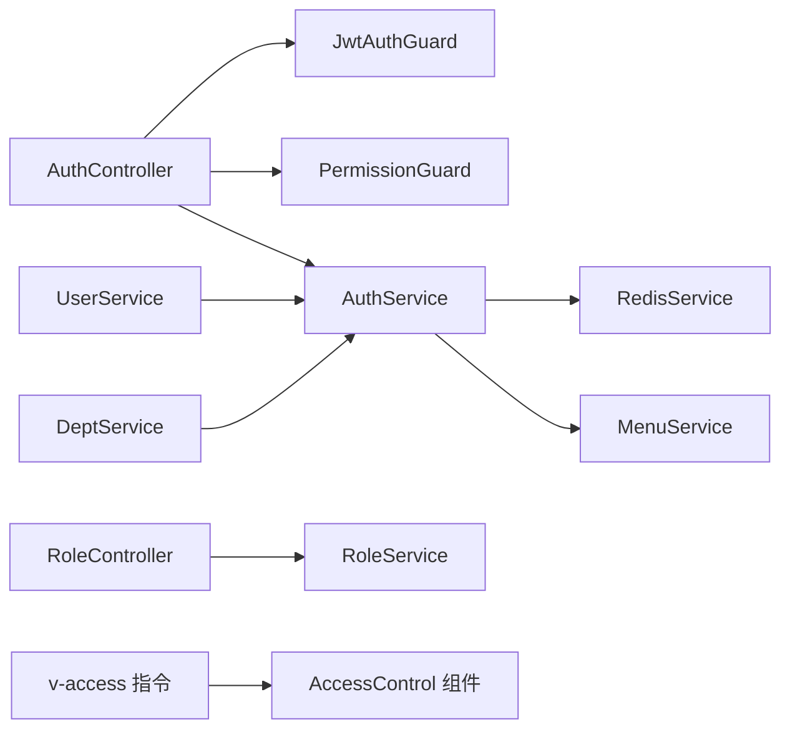

# 授权控制

<cite>
**本文引用的文件**
- [apps/backend/src/auth/guards.ts](file://apps/backend/src/auth/guards.ts)
- [apps/backend/src/auth/jwt.guard.ts](file://apps/backend/src/auth/jwt.guard.ts)
- [apps/backend/src/auth/auth.service.ts](file://apps/backend/src/auth/auth.service.ts)
- [apps/backend/src/auth/auth.controller.ts](file://apps/backend/src/auth/auth.controller.ts)
- [apps/backend/src/modules/system/role/role.service.ts](file://apps/backend/src/modules/system/role/role.service.ts)
- [apps/backend/src/modules/system/role/role.controller.ts](file://apps/backend/src/modules/system/role/role.controller.ts)
- [apps/backend/src/modules/system/user/user.service.ts](file://apps/backend/src/modules/system/user/user.service.ts)
- [apps/backend/src/modules/system/menu/menu.service.ts](file://apps/backend/src/modules/system/menu/menu.service.ts)
- [apps/backend/src/modules/system/dept/dept.service.ts](file://apps/backend/src/modules/system/dept/dept.service.ts)
- [apps/backend/src/cache/redis.service.ts](file://apps/backend/src/cache/redis.service.ts)
- [apps/backend/src/common/oper-log.interceptor.ts](file://apps/backend/src/common/oper-log.interceptor.ts)
- [apps/vben-admin/packages/effects/access/src/directive.ts](file://apps/vben-admin/packages/effects/access/src/directive.ts)
- [apps/vben-admin/packages/effects/access/src/access-control.vue](file://apps/vben-admin/packages/effects/access/src/access-control.vue)
- [scripts/clean.sql](file://scripts/clean.sql)
</cite>

## 目录
1. [简介](#简介)
2. [项目结构](#项目结构)
3. [核心组件](#核心组件)
4. [架构总览](#架构总览)
5. [详细组件分析](#详细组件分析)
6. [依赖关系分析](#依赖关系分析)
7. [性能考量](#性能考量)
8. [故障排查指南](#故障排查指南)
9. [结论](#结论)
10. [附录](#附录)

## 简介
本文件系统性梳理并说明本项目的授权控制体系，围绕基于角色的访问控制（RBAC）模型，覆盖角色与权限的继承、分配与验证机制；详述后端守卫（角色守卫与权限守卫）的工作原理与使用方法；阐述前端按钮级权限控制（指令与组件）的实现与动态显隐；介绍数据权限控制（部门数据隔离与用户数据访问限制）；说明API级别的权限验证与资源访问控制；提供权限缓存策略与性能优化建议；介绍操作审计日志的记录与分析；总结权限配置最佳实践与常见安全风险的防范，并给出权限绕过检测与异常访问监控机制。

## 项目结构
本项目的授权控制由“后端认证鉴权 + 前端细粒度权限”协同完成：
- 后端：基于 JWT 的登录认证、菜单与权限树构建、角色与权限守卫、在线用户与缓存管理、操作审计拦截器。
- 前端：全局权限指令与权限控制组件，支持按权限码或角色进行按钮级显隐控制。

图表来源
- [apps/backend/src/auth/auth.controller.ts:1-87](file://apps/backend/src/auth/auth.controller.ts#L1-L87)
- [apps/backend/src/auth/auth.service.ts:1-294](file://apps/backend/src/auth/auth.service.ts#L1-L294)
- [apps/backend/src/auth/guards.ts:1-51](file://apps/backend/src/auth/guards.ts#L1-L51)
- [apps/backend/src/auth/jwt.guard.ts:1-5](file://apps/backend/src/auth/jwt.guard.ts#L1-L5)
- [apps/backend/src/cache/redis.service.ts:1-128](file://apps/backend/src/cache/redis.service.ts#L1-L128)
- [apps/backend/src/modules/system/menu/menu.service.ts:1-95](file://apps/backend/src/modules/system/menu/menu.service.ts#L1-L95)
- [apps/backend/src/modules/system/role/role.controller.ts:1-80](file://apps/backend/src/modules/system/role/role.controller.ts#L1-L80)
- [apps/backend/src/modules/system/role/role.service.ts:1-80](file://apps/backend/src/modules/system/role/role.service.ts#L1-L80)
- [apps/backend/src/modules/system/user/user.service.ts:1-144](file://apps/backend/src/modules/system/user/user.service.ts#L1-L144)
- [apps/backend/src/modules/system/dept/dept.service.ts:1-72](file://apps/backend/src/modules/system/dept/dept.service.ts#L1-L72)
- [apps/backend/src/common/oper-log.interceptor.ts:1-111](file://apps/backend/src/common/oper-log.interceptor.ts#L1-L111)
- [apps/vben-admin/packages/effects/access/src/directive.ts:1-42](file://apps/vben-admin/packages/effects/access/src/directive.ts#L1-L42)
- [apps/vben-admin/packages/effects/access/src/access-control.vue:1-47](file://apps/vben-admin/packages/effects/access/src/access-control.vue#L1-L47)

章节来源
- [apps/backend/src/auth/auth.controller.ts:1-87](file://apps/backend/src/auth/auth.controller.ts#L1-L87)
- [apps/backend/src/auth/auth.service.ts:1-294](file://apps/backend/src/auth/auth.service.ts#L1-L294)
- [apps/backend/src/auth/guards.ts:1-51](file://apps/backend/src/auth/guards.ts#L1-L51)
- [apps/backend/src/auth/jwt.guard.ts:1-5](file://apps/backend/src/auth/jwt.guard.ts#L1-L5)
- [apps/backend/src/cache/redis.service.ts:1-128](file://apps/backend/src/cache/redis.service.ts#L1-L128)
- [apps/backend/src/modules/system/menu/menu.service.ts:1-95](file://apps/backend/src/modules/system/menu/menu.service.ts#L1-L95)
- [apps/backend/src/modules/system/role/role.controller.ts:1-80](file://apps/backend/src/modules/system/role/role.controller.ts#L1-L80)
- [apps/backend/src/modules/system/role/role.service.ts:1-80](file://apps/backend/src/modules/system/role/role.service.ts#L1-L80)
- [apps/backend/src/modules/system/user/user.service.ts:1-144](file://apps/backend/src/modules/system/user/user.service.ts#L1-L144)
- [apps/backend/src/modules/system/dept/dept.service.ts:1-72](file://apps/backend/src/modules/system/dept/dept.service.ts#L1-L72)
- [apps/backend/src/common/oper-log.interceptor.ts:1-111](file://apps/backend/src/common/oper-log.interceptor.ts#L1-L111)
- [apps/vben-admin/packages/effects/access/src/directive.ts:1-42](file://apps/vben-admin/packages/effects/access/src/directive.ts#L1-L42)
- [apps/vben-admin/packages/effects/access/src/access-control.vue:1-47](file://apps/vben-admin/packages/effects/access/src/access-control.vue#L1-L47)

## 核心组件
- 角色守卫（RolesGuard）：用于校验用户是否具备所需角色编码，通常配合 RequireRole 元数据使用。
- 权限守卫（PermissionGuard）：用于校验用户是否具备所需权限码，通常配合 RequirePermission 元数据使用。
- JWT 守卫（JwtAuthGuard）：统一的 JWT 认证入口，确保请求携带有效令牌。
- 用户服务（AuthService）：负责登录、登出、用户信息拉取、菜单与权限集合构建等。
- 菜单服务（MenuService）：根据用户角色聚合菜单ID，构建前端可用的路由树。
- 角色服务（RoleService）：角色的增删改查、权限分配（菜单ID与部门ID集合）。
- 部门服务（DeptService）：部门树构建与基础管理。
- Redis 服务（RedisService）：在线用户、会话与通用缓存。
- 操作审计拦截器（OperLogInterceptor）：统一记录操作日志，含请求参数脱敏与耗时统计。
- 前端权限指令与组件：v-access 指令与 AccessControl 组件，支持按钮级权限控制。

章节来源
- [apps/backend/src/auth/guards.ts:1-51](file://apps/backend/src/auth/guards.ts#L1-L51)
- [apps/backend/src/auth/jwt.guard.ts:1-5](file://apps/backend/src/auth/jwt.guard.ts#L1-L5)
- [apps/backend/src/auth/auth.service.ts:1-294](file://apps/backend/src/auth/auth.service.ts#L1-L294)
- [apps/backend/src/modules/system/menu/menu.service.ts:1-95](file://apps/backend/src/modules/system/menu/menu.service.ts#L1-L95)
- [apps/backend/src/modules/system/role/role.service.ts:1-80](file://apps/backend/src/modules/system/role/role.service.ts#L1-L80)
- [apps/backend/src/modules/system/dept/dept.service.ts:1-72](file://apps/backend/src/modules/system/dept/dept.service.ts#L1-L72)
- [apps/backend/src/cache/redis.service.ts:1-128](file://apps/backend/src/cache/redis.service.ts#L1-L128)
- [apps/backend/src/common/oper-log.interceptor.ts:1-111](file://apps/backend/src/common/oper-log.interceptor.ts#L1-L111)
- [apps/vben-admin/packages/effects/access/src/directive.ts:1-42](file://apps/vben-admin/packages/effects/access/src/directive.ts#L1-L42)
- [apps/vben-admin/packages/effects/access/src/access-control.vue:1-47](file://apps/vben-admin/packages/effects/access/src/access-control.vue#L1-L47)

## 架构总览
下图展示从客户端到后端的典型授权流程：登录获取令牌、JWT 守卫校验、角色/权限守卫决策、菜单与权限集合下发、前端指令/组件据此渲染。

图表来源
- [apps/backend/src/auth/auth.controller.ts:1-87](file://apps/backend/src/auth/auth.controller.ts#L1-L87)
- [apps/backend/src/auth/auth.service.ts:1-294](file://apps/backend/src/auth/auth.service.ts#L1-L294)
- [apps/backend/src/auth/jwt.guard.ts:1-5](file://apps/backend/src/auth/jwt.guard.ts#L1-L5)
- [apps/backend/src/auth/guards.ts:1-51](file://apps/backend/src/auth/guards.ts#L1-L51)
- [apps/backend/src/modules/system/menu/menu.service.ts:1-95](file://apps/backend/src/modules/system/menu/menu.service.ts#L1-L95)

## 详细组件分析

### RBAC 权限模型与数据结构
- 角色（Role）：包含名称、唯一编码、状态、数据范围（dataScope）、菜单ID集合与部门ID集合。
- 权限（Permission）：来源于菜单的权限码（perms），用于细粒度 API 控制。
- 用户（User）：关联角色列表、所属部门、岗位等。
- 菜单（Menu）：树形结构，包含类型、路径、权限码、是否显示等字段。

```mermaid
erDiagram
SYS_USER {
int id PK
string username
string password
string nickname
int deptId
}
SYS_ROLE {
int id PK
string name
string code
int status
int dataScope
json menuIds
json deptIds
}
SYS_MENU {
int id PK
string name
int type
string perms
int status
int parentId
int sort
}
SYS_DEPT {
int id PK
string name
int parentId
int sort
int status
}
SYS_USER ||--o{ SYS_USER_ROLES : "拥有"
SYS_USER_ROLES {
int userId FK
int roleId FK
}
SYS_ROLE ||--o{ SYS_MENU : "授权"
SYS_USER ||--o{ SYS_DEPT : "属于"
```

图表来源
- [apps/backend/src/modules/system/role/role.service.ts:64-73](file://apps/backend/src/modules/system/role/role.service.ts#L64-L73)
- [apps/backend/src/modules/system/menu/menu.service.ts:34-55](file://apps/backend/src/modules/system/menu/menu.service.ts#L34-L55)
- [apps/backend/src/modules/system/user/user.service.ts:135-143](file://apps/backend/src/modules/system/user/user.service.ts#L135-L143)
- [apps/backend/src/modules/system/dept/dept.service.ts:1-72](file://apps/backend/src/modules/system/dept/dept.service.ts#L1-L72)

章节来源
- [apps/backend/src/modules/system/role/role.service.ts:1-80](file://apps/backend/src/modules/system/role/role.service.ts#L1-L80)
- [apps/backend/src/modules/system/menu/menu.service.ts:1-95](file://apps/backend/src/modules/system/menu/menu.service.ts#L1-L95)
- [apps/backend/src/modules/system/user/user.service.ts:1-144](file://apps/backend/src/modules/system/user/user.service.ts#L1-L144)
- [apps/backend/src/modules/system/dept/dept.service.ts:1-72](file://apps/backend/src/modules/system/dept/dept.service.ts#L1-L72)

### 角色守卫（RolesGuard）与权限守卫（PermissionGuard）
- 元数据装饰器：
  - RequireRole(...roles)：为控制器或方法设置所需角色编码集合。
  - RequirePermission(...perms)：为控制器或方法设置所需权限码集合。
  - Public()：标记接口无需认证。
- 守卫逻辑：
  - RolesGuard：从请求上下文提取用户角色编码集合，判断是否包含任一所需角色编码。
  - PermissionGuard：从请求上下文提取用户权限码集合，判断是否满足所有所需权限码。
- 使用方式：
  - 在控制器上组合使用 JwtAuthGuard 与 PermissionGuard，再在具体方法上使用 RequirePermission。
  - 在需要公开接口处使用 Public() 装饰器。

图表来源
- [apps/backend/src/auth/guards.ts:13-51](file://apps/backend/src/auth/guards.ts#L13-L51)

章节来源
- [apps/backend/src/auth/guards.ts:1-51](file://apps/backend/src/auth/guards.ts#L1-L51)
- [apps/backend/src/modules/system/role/role.controller.ts:1-80](file://apps/backend/src/modules/system/role/role.controller.ts#L1-L80)

### JWT 守卫与认证流程
- JwtAuthGuard：基于 Passport 的 JWT 守卫，统一拦截未携带或无效令牌的请求。
- 登录流程：
  - 校验验证码（Redis 存储与过期控制）。
  - 校验用户名与密码（bcrypt 对比）。
  - 生成 JWT 并写入在线用户缓存（Redis）。
  - 写入登录日志。
- 获取用户信息：
  - 构建菜单树（超级管理员全量，普通用户按角色聚合的菜单ID过滤）。
  - 返回用户基本信息、权限码数组与菜单树。

图表来源
- [apps/backend/src/auth/auth.controller.ts:13-19](file://apps/backend/src/auth/auth.controller.ts#L13-L19)
- [apps/backend/src/auth/auth.service.ts:29-89](file://apps/backend/src/auth/auth.service.ts#L29-L89)
- [apps/backend/src/cache/redis.service.ts:83-99](file://apps/backend/src/cache/redis.service.ts#L83-L99)

章节来源
- [apps/backend/src/auth/jwt.guard.ts:1-5](file://apps/backend/src/auth/jwt.guard.ts#L1-L5)
- [apps/backend/src/auth/auth.controller.ts:1-87](file://apps/backend/src/auth/auth.controller.ts#L1-L87)
- [apps/backend/src/auth/auth.service.ts:1-294](file://apps/backend/src/auth/auth.service.ts#L1-L294)
- [apps/backend/src/cache/redis.service.ts:1-128](file://apps/backend/src/cache/redis.service.ts#L1-L128)

### 角色与权限分配（菜单与部门维度）
- 角色服务：
  - 分配权限：将菜单ID集合与部门ID集合以 JSON 字符串形式保存至角色记录。
  - 查询角色菜单：解析角色记录中的菜单ID与部门ID集合。
- 菜单服务：
  - 构建路由树：根据用户角色聚合的菜单ID集合，筛选有效菜单并构建树形结构。
- 数据范围（dataScope）：
  - 通过字典数据定义“全部数据”、“本部门数据”、“本部门及以下”、“仅本人数据”等范围，结合业务层查询条件实现数据隔离。

图表来源
- [apps/backend/src/modules/system/role/role.service.ts:64-79](file://apps/backend/src/modules/system/role/role.service.ts#L64-L79)
- [apps/backend/src/modules/system/menu/menu.service.ts:34-55](file://apps/backend/src/modules/system/menu/menu.service.ts#L34-L55)
- [scripts/clean.sql:69-71](file://scripts/clean.sql#L69-L71)

章节来源
- [apps/backend/src/modules/system/role/role.service.ts:1-80](file://apps/backend/src/modules/system/role/role.service.ts#L1-L80)
- [apps/backend/src/modules/system/menu/menu.service.ts:1-95](file://apps/backend/src/modules/system/menu/menu.service.ts#L1-L95)
- [scripts/clean.sql:69-71](file://scripts/clean.sql#L69-L71)

### 前端按钮级权限控制
- v-access 指令：
  - 支持两种模式：按角色（role）或按权限码（code）判断。
  - 当无权限时，移除 DOM 元素，实现按钮级动态隐藏。
- AccessControl 组件：
  - 通过属性 codes 与 type（code/role）控制插槽显示。
- 使用建议：
  - 在菜单与权限码设计阶段明确“按钮级权限码”，并与后端 RequirePermission 对应。

图表来源
- [apps/vben-admin/packages/effects/access/src/directive.ts:11-30](file://apps/vben-admin/packages/effects/access/src/directive.ts#L11-L30)
- [apps/vben-admin/packages/effects/access/src/access-control.vue:36-41](file://apps/vben-admin/packages/effects/access/src/access-control.vue#L36-L41)

章节来源
- [apps/vben-admin/packages/effects/access/src/directive.ts:1-42](file://apps/vben-admin/packages/effects/access/src/directive.ts#L1-L42)
- [apps/vben-admin/packages/effects/access/src/access-control.vue:1-47](file://apps/vben-admin/packages/effects/access/src/access-control.vue#L1-L47)

### API 级别权限验证与资源访问控制
- 控制器层面：
  - 使用 JwtAuthGuard 保证令牌有效性。
  - 使用 PermissionGuard 结合 RequirePermission 对具体方法进行权限校验。
- 资源访问控制：
  - 用户信息与菜单树构建时已按角色聚合的菜单ID过滤。
  - 数据范围（dataScope）与部门ID集合用于限制数据可见性，需在业务查询中应用。

章节来源
- [apps/backend/src/modules/system/role/role.controller.ts:1-80](file://apps/backend/src/modules/system/role/role.controller.ts#L1-L80)
- [apps/backend/src/auth/auth.service.ts:135-187](file://apps/backend/src/auth/auth.service.ts#L135-L187)
- [apps/backend/src/modules/system/menu/menu.service.ts:34-55](file://apps/backend/src/modules/system/menu/menu.service.ts#L34-L55)

### 数据权限控制（部门数据隔离与用户数据访问限制）
- 数据范围（dataScope）：
  - “全部数据”、“本部门数据”、“本部门及以下”、“仅本人数据”等字典项定义了不同角色的数据访问边界。
- 实现要点：
  - 角色记录中保存 deptIds（可选），用于限定可访问的部门集合。
  - 业务查询时根据用户角色的数据范围与 deptIds 进行过滤，避免越权访问。

章节来源
- [apps/backend/src/modules/system/role/role.service.ts:40-41](file://apps/backend/src/modules/system/role/role.service.ts#L40-L41)
- [apps/backend/src/modules/system/role/role.service.ts:64-73](file://apps/backend/src/modules/system/role/role.service.ts#L64-L73)
- [scripts/clean.sql:69-71](file://scripts/clean.sql#L69-L71)

### 操作审计日志（OperLogInterceptor）
- 记录内容：
  - 模块名、HTTP 方法与URL、请求参数（敏感字段脱敏）、响应结果、状态、错误信息、耗时、IP等。
- 过滤规则：
  - 忽略 GET 请求与特定监控接口，避免日志风暴。
- 异常处理：
  - 捕获错误并记录，同时将异常重新抛出，保证业务不被日志失败影响。

章节来源
- [apps/backend/src/common/oper-log.interceptor.ts:1-111](file://apps/backend/src/common/oper-log.interceptor.ts#L1-L111)

## 依赖关系分析
- 控制器依赖守卫：JwtAuthGuard 与 PermissionGuard 组合使用，确保先认证再授权。
- 服务间协作：
  - AuthService 依赖 PrismaService 与 RedisService，负责登录态与缓存。
  - MenuService 依赖 PrismaService，负责菜单树构建。
  - RoleService 与 DeptService 提供角色与部门的基础能力。
- 前端依赖：
  - v-access 指令与 AccessControl 组件依赖前端权限状态（通常来自用户信息中的权限码集合）。

图表来源
- [apps/backend/src/auth/auth.controller.ts:1-87](file://apps/backend/src/auth/auth.controller.ts#L1-L87)
- [apps/backend/src/auth/guards.ts:1-51](file://apps/backend/src/auth/guards.ts#L1-L51)
- [apps/backend/src/auth/auth.service.ts:1-294](file://apps/backend/src/auth/auth.service.ts#L1-L294)
- [apps/backend/src/cache/redis.service.ts:1-128](file://apps/backend/src/cache/redis.service.ts#L1-L128)
- [apps/backend/src/modules/system/menu/menu.service.ts:1-95](file://apps/backend/src/modules/system/menu/menu.service.ts#L1-L95)
- [apps/backend/src/modules/system/role/role.controller.ts:1-80](file://apps/backend/src/modules/system/role/role.controller.ts#L1-L80)
- [apps/backend/src/modules/system/role/role.service.ts:1-80](file://apps/backend/src/modules/system/role/role.service.ts#L1-L80)
- [apps/backend/src/modules/system/user/user.service.ts:1-144](file://apps/backend/src/modules/system/user/user.service.ts#L1-L144)
- [apps/backend/src/modules/system/dept/dept.service.ts:1-72](file://apps/backend/src/modules/system/dept/dept.service.ts#L1-L72)
- [apps/vben-admin/packages/effects/access/src/directive.ts:1-42](file://apps/vben-admin/packages/effects/access/src/directive.ts#L1-L42)
- [apps/vben-admin/packages/effects/access/src/access-control.vue:1-47](file://apps/vben-admin/packages/effects/access/src/access-control.vue#L1-L47)

## 性能考量
- 缓存策略：
  - 登录态与在线用户：使用 Redis 存储 token 到 userId 的映射，并维护在线用户集合，便于快速踢人与统计。
  - 菜单与权限：用户登录后一次性下发菜单树与权限码集合，前端本地缓存，减少重复请求。
- 查询优化：
  - 菜单树构建采用一次查询后内存组装，避免 N+1 查询。
  - 角色聚合菜单ID使用 Set 去重，时间复杂度 O(n)。
- 日志开销：
  - 操作审计拦截器对 GET 请求与特定监控接口进行过滤，降低日志写入压力。
- 建议：
  - 对高频接口增加本地缓存（如权限码集合）与合理的 TTL。
  - 对菜单树与用户信息变更时，清理相关缓存，确保一致性。

章节来源
- [apps/backend/src/cache/redis.service.ts:83-99](file://apps/backend/src/cache/redis.service.ts#L83-L99)
- [apps/backend/src/auth/auth.service.ts:135-187](file://apps/backend/src/auth/auth.service.ts#L135-L187)
- [apps/backend/src/modules/system/menu/menu.service.ts:19-32](file://apps/backend/src/modules/system/menu/menu.service.ts#L19-L32)
- [apps/backend/src/common/oper-log.interceptor.ts:63-70](file://apps/backend/src/common/oper-log.interceptor.ts#L63-L70)

## 故障排查指南
- 常见问题与定位：
  - 无法登录：检查验证码键值是否过期、密码是否匹配、账户状态是否正常。
  - 403 拒绝访问：确认控制器/方法是否正确设置了 RequirePermission，以及用户权限码集合是否包含所需权限。
  - 无菜单/按钮不可见：确认用户角色是否分配了对应菜单ID，前端 v-access 绑定值是否正确。
  - 数据越权：核对角色的 dataScope 与 deptIds 是否正确，业务查询是否应用了数据范围过滤。
- 审计与监控：
  - 通过操作审计日志定位异常请求与错误信息，关注状态为失败的记录与耗时异常的接口。
  - 结合在线用户列表监控异常登录与并发峰值。

章节来源
- [apps/backend/src/auth/auth.service.ts:29-89](file://apps/backend/src/auth/auth.service.ts#L29-L89)
- [apps/backend/src/auth/guards.ts:36-51](file://apps/backend/src/auth/guards.ts#L36-L51)
- [apps/backend/src/common/oper-log.interceptor.ts:1-111](file://apps/backend/src/common/oper-log.interceptor.ts#L1-L111)
- [apps/backend/src/cache/redis.service.ts:97-99](file://apps/backend/src/cache/redis.service.ts#L97-L99)

## 结论
本项目采用“后端守卫 + 前端指令”的双层授权控制方案，结合 RBAC 模型实现了角色继承、权限分配与验证、菜单与权限码下发、数据范围隔离与审计日志。通过 JWT 守卫统一认证、角色/权限守卫细化授权、Redis 缓存提升性能、前端指令实现按钮级显隐，形成完整且可扩展的授权体系。建议在实际部署中持续完善权限配置与监控告警，确保权限最小化与可追溯。

## 附录
- 最佳实践：
  - 权限码命名规范：模块:功能:动作（如 system:user:list）。
  - 角色设计：尽量使用“职责最小化”原则，避免超级角色滥用。
  - 数据范围：为每个角色明确 dataScope 与 deptIds，业务查询必须应用。
  - 审计日志：保留必要的请求参数脱敏记录，定期分析异常与高风险操作。
- 常见风险与防范：
  - 权限绕过：严格使用 RequirePermission 与 RequireRole，避免遗漏守卫。
  - 越权访问：在数据查询中强制应用部门/个人维度过滤。
  - 令牌泄露：缩短令牌有效期、启用黑名单与在线用户管理。
  - 前端权限穿透：指令与组件双重控制，避免仅依赖前端。