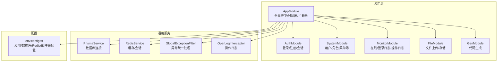
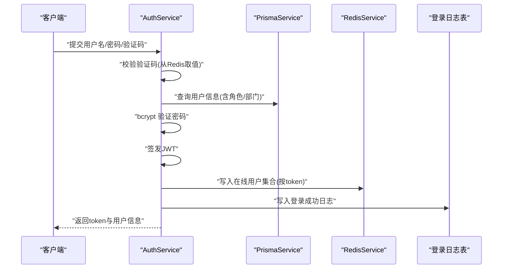
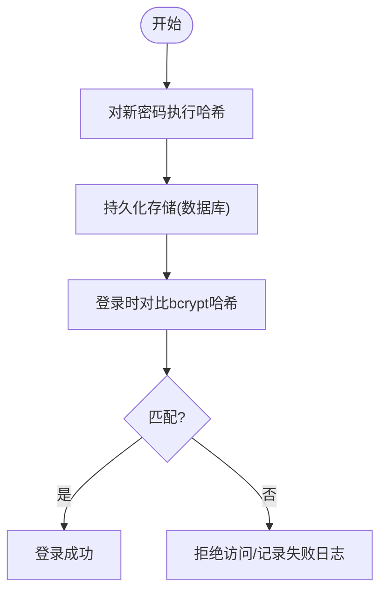
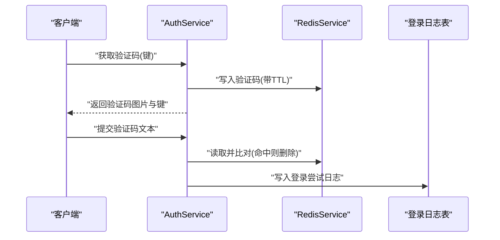
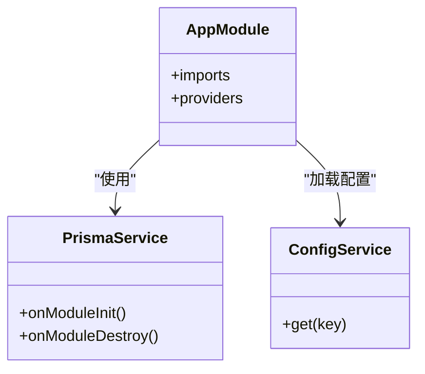
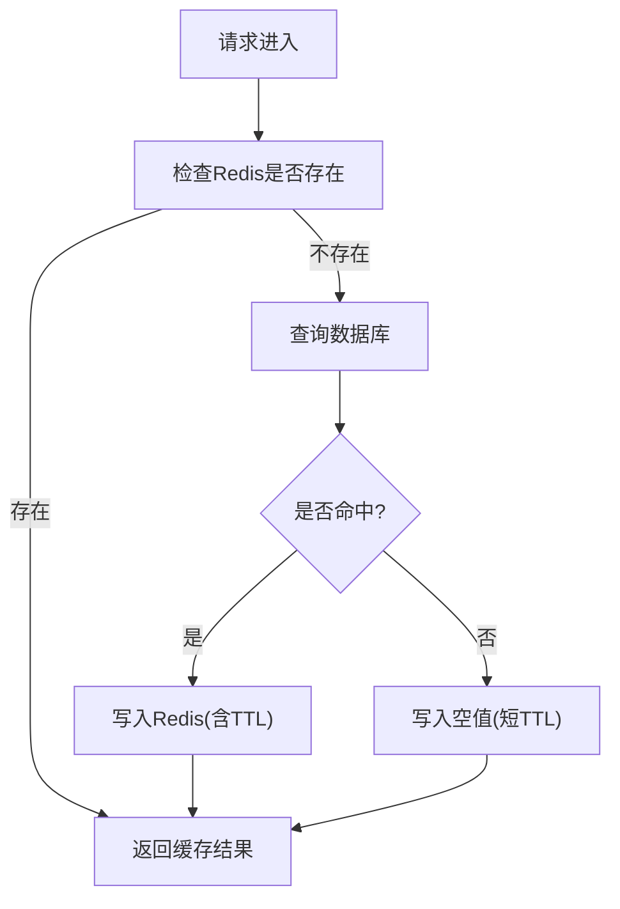
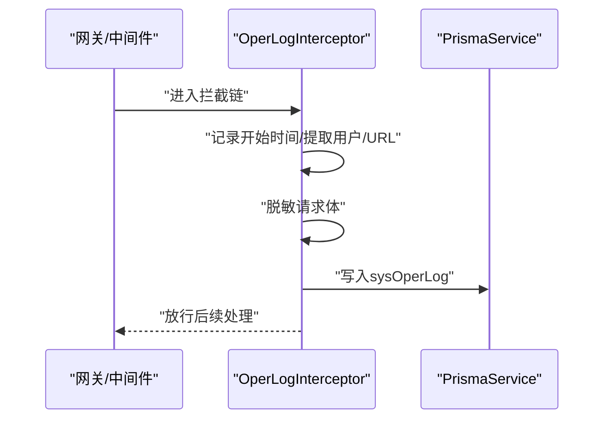
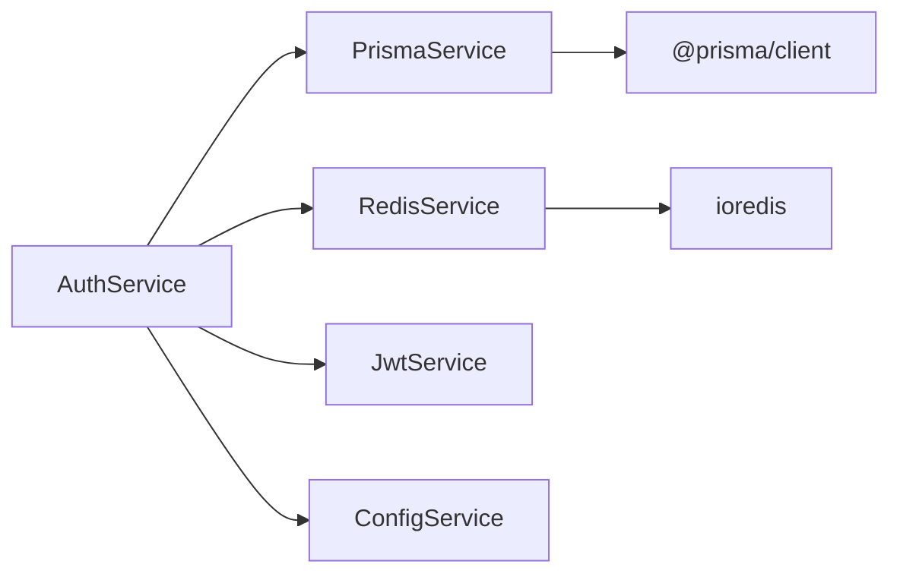

# 数据安全

<cite>
**本文引用的文件**
- [apps/backend/src/auth/auth.service.ts](file://apps/backend/src/auth/auth.service.ts)
- [apps/backend/src/auth/guards.ts](file://apps/backend/src/auth/guards.ts)
- [apps/backend/src/cache/redis.service.ts](file://apps/backend/src/cache/redis.service.ts)
- [apps/backend/src/common/prisma.service.ts](file://apps/backend/src/common/prisma.service.ts)
- [apps/backend/src/common/exception.filter.ts](file://apps/backend/src/common/exception.filter.ts)
- [apps/backend/src/common/oper-log.interceptor.ts](file://apps/backend/src/common/oper-log.interceptor.ts)
- [apps/backend/src/modules/system/user/user.service.ts](file://apps/backend/src/modules/system/user/user.service.ts)
- [apps/backend/src/modules/system/user/dto/user.dto.ts](file://apps/backend/src/modules/system/user/dto/user.dto.ts)
- [apps/backend/src/config/env.config.ts](file://apps/backend/src/config/env.config.ts)
- [apps/backend/src/app.module.ts](file://apps/backend/src/app.module.ts)
- [apps/backend/src/main.ts](file://apps/backend/src/main.ts)
- [scripts/init-db.sh](file://scripts/init-db.sh)
</cite>

## 目录
1. [引言](#引言)
2. [项目结构](#项目结构)
3. [核心组件](#核心组件)
4. [架构总览](#架构总览)
5. [详细组件分析](#详细组件分析)
6. [依赖关系分析](#依赖关系分析)
7. [性能考量](#性能考量)
8. [故障排查指南](#故障排查指南)
9. [结论](#结论)
10. [附录](#附录)

## 引言
本文件聚焦于本项目的“数据安全”主题，系统梳理并说明以下方面：密码与敏感数据的加密存储策略、登录验证码与会话管理、数据库连接与访问控制、Redis 缓存中的敏感数据处理与缓存穿透防护、操作日志与审计、异常与错误处理、以及数据生命周期管理（删除与归档）。同时，结合现有代码实现，给出可落地的安全实践建议与改进方向。

## 项目结构
后端采用 NestJS 架构，模块化组织认证、系统管理、监控、文件等业务模块；通用能力包括数据库连接、Redis 缓存、全局拦截器与过滤器、配置加载等。前端通过 Swagger 提供 API 文档与认证入口。

图表来源
- [apps/backend/src/app.module.ts:18-58](file://apps/backend/src/app.module.ts#L18-L58)
- [apps/backend/src/auth/auth.module.ts](file://apps/backend/src/auth/auth.module.ts)
- [apps/backend/src/common/prisma.service.ts:1-22](file://apps/backend/src/common/prisma.service.ts#L1-L22)
- [apps/backend/src/cache/redis.service.ts:1-128](file://apps/backend/src/cache/redis.service.ts#L1-L128)
- [apps/backend/src/common/oper-log.interceptor.ts:1-111](file://apps/backend/src/common/oper-log.interceptor.ts#L1-L111)
- [apps/backend/src/common/exception.filter.ts:1-37](file://apps/backend/src/common/exception.filter.ts#L1-L37)
- [apps/backend/src/config/env.config.ts:1-47](file://apps/backend/src/config/env.config.ts#L1-L47)

章节来源
- [apps/backend/src/app.module.ts:18-58](file://apps/backend/src/app.module.ts#L18-L58)
- [apps/backend/src/main.ts:8-48](file://apps/backend/src/main.ts#L8-L48)

## 核心组件
- 认证与会话：登录校验、JWT 签发、验证码、在线用户集合维护。
- 数据库连接：Prisma 客户端连接与日志级别配置。
- 缓存与会话：Redis 连接、键空间设计、在线用户集合。
- 权限与访问控制：基于角色与权限的守卫。
- 操作审计：请求参数脱敏、操作日志入库、耗时统计。
- 全局异常处理：统一错误响应格式与日志记录。
- 用户数据生命周期：软删除标记、密码重置、状态变更。

章节来源
- [apps/backend/src/auth/auth.service.ts:29-89](file://apps/backend/src/auth/auth.service.ts#L29-L89)
- [apps/backend/src/cache/redis.service.ts:83-99](file://apps/backend/src/cache/redis.service.ts#L83-L99)
- [apps/backend/src/common/prisma.service.ts:8-21](file://apps/backend/src/common/prisma.service.ts#L8-L21)
- [apps/backend/src/auth/guards.ts:19-50](file://apps/backend/src/auth/guards.ts#L19-L50)
- [apps/backend/src/common/oper-log.interceptor.ts:30-61](file://apps/backend/src/common/oper-log.interceptor.ts#L30-L61)
- [apps/backend/src/common/exception.filter.ts:16-36](file://apps/backend/src/common/exception.filter.ts#L16-L36)
- [apps/backend/src/modules/system/user/user.service.ts:109-133](file://apps/backend/src/modules/system/user/user.service.ts#L109-L133)

## 架构总览
下图展示登录流程中涉及的关键对象与交互，体现密码验证、JWT 会话、Redis 在线用户管理与登录日志写入。

图表来源
- [apps/backend/src/auth/auth.service.ts:29-89](file://apps/backend/src/auth/auth.service.ts#L29-L89)
- [apps/backend/src/cache/redis.service.ts:83-99](file://apps/backend/src/cache/redis.service.ts#L83-L99)
- [apps/backend/src/common/prisma.service.ts:8-21](file://apps/backend/src/common/prisma.service.ts#L8-L21)

## 详细组件分析

### 密码加密与存储策略
- 存储策略：注册与更新密码均使用 bcrypt 进行哈希存储，避免明文落库。
- 验证流程：登录时使用 bcrypt.compare 对比输入密码与存储哈希。
- DTO 约束：用户创建/更新 DTO 对 password 字段进行字符串类型约束，减少非法输入风险。
- 软删除与状态：用户删除采用软删除标记，配合状态字段实现禁用控制，避免物理删除造成审计断档。

图表来源
- [apps/backend/src/auth/auth.service.ts:91-107](file://apps/backend/src/auth/auth.service.ts#L91-L107)
- [apps/backend/src/modules/system/user/user.service.ts:57-78](file://apps/backend/src/modules/system/user/user.service.ts#L57-L78)
- [apps/backend/src/modules/system/user/user.service.ts:98-100](file://apps/backend/src/modules/system/user/user.service.ts#L98-L100)
- [apps/backend/src/modules/system/user/dto/user.dto.ts:5-47](file://apps/backend/src/modules/system/user/dto/user.dto.ts#L5-L47)

章节来源
- [apps/backend/src/auth/auth.service.ts:91-107](file://apps/backend/src/auth/auth.service.ts#L91-L107)
- [apps/backend/src/modules/system/user/user.service.ts:57-78](file://apps/backend/src/modules/system/user/user.service.ts#L57-L78)
- [apps/backend/src/modules/system/user/user.service.ts:98-100](file://apps/backend/src/modules/system/user/user.service.ts#L98-L100)
- [apps/backend/src/modules/system/user/dto/user.dto.ts:5-47](file://apps/backend/src/modules/system/user/dto/user.dto.ts#L5-L47)

### 登录验证码与会话管理
- 验证码：生成 SVG 验证码，键值对存储于 Redis，设置短期 TTL，校验后立即删除，降低撞库风险。
- 会话：JWT 作为会话凭证，登录成功后将 token 写入 Redis 在线用户集合，支持在线用户查询与退出清理。
- 登录日志：无论成功或失败均写入登录日志表，便于审计与风控。

图表来源
- [apps/backend/src/auth/auth.service.ts:109-128](file://apps/backend/src/auth/auth.service.ts#L109-L128)
- [apps/backend/src/cache/redis.service.ts:16-23](file://apps/backend/src/cache/redis.service.ts#L16-L23)

章节来源
- [apps/backend/src/auth/auth.service.ts:109-128](file://apps/backend/src/auth/auth.service.ts#L109-L128)
- [apps/backend/src/cache/redis.service.ts:16-23](file://apps/backend/src/cache/redis.service.ts#L16-L23)

### 数据库连接与访问控制
- 连接配置：通过 ConfigModule 加载数据库连接 URL，PrismaService 初始化时建立连接。
- 日志级别：PrismaClient 设置日志级别为 error/warn，避免敏感信息泄露到日志。
- 访问控制：全局守卫与路由守卫结合，基于角色与权限进行细粒度授权。

图表来源
- [apps/backend/src/common/prisma.service.ts:8-21](file://apps/backend/src/common/prisma.service.ts#L8-L21)
- [apps/backend/src/config/env.config.ts:24-26](file://apps/backend/src/config/env.config.ts#L24-L26)
- [apps/backend/src/app.module.ts:18-58](file://apps/backend/src/app.module.ts#L18-L58)

章节来源
- [apps/backend/src/common/prisma.service.ts:8-21](file://apps/backend/src/common/prisma.service.ts#L8-L21)
- [apps/backend/src/config/env.config.ts:24-26](file://apps/backend/src/config/env.config.ts#L24-L26)
- [apps/backend/src/auth/guards.ts:19-50](file://apps/backend/src/auth/guards.ts#L19-L50)

### Redis 缓存与敏感数据处理
- 连接与键空间：RedisService 支持字符串与哈希读写、TTL、集合等常用操作；在线用户集合以 token 为键，值为用户标识。
- 敏感数据策略：操作日志拦截器对请求体进行脱敏，避免将密码、Token、验证码等敏感字段入库。
- 缓存穿透防护：当前未见针对热点键的空值缓存策略；建议对不存在的用户/资源在 Redis 中设置短 TTL 的空值，防止缓存穿透。

图表来源
- [apps/backend/src/cache/redis.service.ts:83-99](file://apps/backend/src/cache/redis.service.ts#L83-L99)
- [apps/backend/src/common/oper-log.interceptor.ts:81-99](file://apps/backend/src/common/oper-log.interceptor.ts#L81-L99)

章节来源
- [apps/backend/src/cache/redis.service.ts:83-99](file://apps/backend/src/cache/redis.service.ts#L83-L99)
- [apps/backend/src/common/oper-log.interceptor.ts:81-99](file://apps/backend/src/common/oper-log.interceptor.ts#L81-L99)

### 操作审计与日志脱敏
- 拦截器：OperLogInterceptor 记录请求方法、URL、参数（含脱敏）、响应结果、错误信息、耗时与 IP。
- 脱敏规则：对包含 password/token/authorization/captcha 等关键词的字段进行掩码处理。
- 日志落库：将审计信息写入操作日志表，便于事后审计与取证。

图表来源
- [apps/backend/src/common/oper-log.interceptor.ts:30-61](file://apps/backend/src/common/oper-log.interceptor.ts#L30-L61)
- [apps/backend/src/common/oper-log.interceptor.ts:81-99](file://apps/backend/src/common/oper-log.interceptor.ts#L81-L99)

章节来源
- [apps/backend/src/common/oper-log.interceptor.ts:30-61](file://apps/backend/src/common/oper-log.interceptor.ts#L30-L61)
- [apps/backend/src/common/oper-log.interceptor.ts:81-99](file://apps/backend/src/common/oper-log.interceptor.ts#L81-L99)

### 全局异常处理与错误响应
- 统一过滤器：GlobalExceptionFilter 将未知异常转换为标准错误响应，并记录日志。
- 响应格式：使用 ApiResponse.error 输出一致的错误结构，便于前端处理与日志检索。

章节来源
- [apps/backend/src/common/exception.filter.ts:16-36](file://apps/backend/src/common/exception.filter.ts#L16-L36)

### 数据生命周期管理（删除与归档）
- 删除策略：用户删除采用软删除标记，保留历史审计轨迹；删除时间字段用于归档与合规追溯。
- 归档建议：可定期扫描软删除记录，将非敏感字段导出至归档库或压缩存储，清理主库冗余数据。

章节来源
- [apps/backend/src/modules/system/user/user.service.ts:109-115](file://apps/backend/src/modules/system/user/user.service.ts#L109-L115)

### 数据访问审计与合规
- 登录审计：登录日志记录用户名、IP、状态与消息，支持异常登录识别。
- 操作审计：操作日志记录模块、方法、参数（已脱敏）、耗时与错误，满足合规审计要求。
- 合规建议：结合法规要求，对日志保留周期、访问权限与导出审批流程进行制度化管理。

章节来源
- [apps/backend/src/auth/auth.service.ts:50-74](file://apps/backend/src/auth/auth.service.ts#L50-L74)
- [apps/backend/src/common/oper-log.interceptor.ts:30-61](file://apps/backend/src/common/oper-log.interceptor.ts#L30-L61)

### 数据库权限最小化与角色分离
- 角色守卫：RequireRole 与 RequirePermission 基于用户角色与权限元数据进行访问控制。
- 最小权限：建议为不同环境与职责分配独立数据库账号，限制 DDL 权限与高危函数调用。

章节来源
- [apps/backend/src/auth/guards.ts:19-50](file://apps/backend/src/auth/guards.ts#L19-L50)

### 数据泄露应急响应与用户隐私保护
- 应急响应：发现异常登录/操作后，可利用登录日志与操作日志快速定位；必要时冻结账户、撤销令牌、重置密码。
- 隐私保护：请求体脱敏、日志分级、最小化采集与保留期限控制，符合隐私保护要求。

章节来源
- [apps/backend/src/common/oper-log.interceptor.ts:81-99](file://apps/backend/src/common/oper-log.interceptor.ts#L81-L99)
- [apps/backend/src/auth/auth.service.ts:130-133](file://apps/backend/src/auth/auth.service.ts#L130-L133)

## 依赖关系分析
- 组件耦合：AuthService 依赖 PrismaService、RedisService、JwtService、ConfigService；RedisService 仅依赖 ioredis；PrismaService 依赖 @prisma/client。
- 外部依赖：Redis 与数据库连接由环境变量驱动，具备良好的可移植性。
- 循环依赖：当前模块间无明显循环依赖迹象。

图表来源
- [apps/backend/src/auth/auth.service.ts:22-27](file://apps/backend/src/auth/auth.service.ts#L22-L27)
- [apps/backend/src/cache/redis.service.ts:1-14](file://apps/backend/src/cache/redis.service.ts#L1-L14)
- [apps/backend/src/common/prisma.service.ts:1-2](file://apps/backend/src/common/prisma.service.ts#L1-L2)

章节来源
- [apps/backend/src/auth/auth.service.ts:22-27](file://apps/backend/src/auth/auth.service.ts#L22-L27)
- [apps/backend/src/cache/redis.service.ts:1-14](file://apps/backend/src/cache/redis.service.ts#L1-L14)
- [apps/backend/src/common/prisma.service.ts:1-2](file://apps/backend/src/common/prisma.service.ts#L1-L2)

## 性能考量
- 缓存命中：Redis 在线用户集合与验证码键值对可显著降低数据库压力。
- 日志写入：操作日志写入数据库可能成为瓶颈，建议异步队列或批量写入。
- 连接池：数据库与 Redis 连接池默认配置需根据并发与延迟目标进行调优。

## 故障排查指南
- 登录失败：检查验证码键是否过期、bcrypt 密码对比是否正确、登录日志表记录。
- 会话异常：确认 JWT 是否过期、Redis 在线用户集合是否正确维护。
- 数据库连接：查看 PrismaService 初始化日志与连接 URL 配置。
- 日志缺失：确认拦截器是否生效、脱敏逻辑是否导致字段被替换为空。

章节来源
- [apps/backend/src/auth/auth.service.ts:48-60](file://apps/backend/src/auth/auth.service.ts#L48-L60)
- [apps/backend/src/cache/redis.service.ts:83-99](file://apps/backend/src/cache/redis.service.ts#L83-L99)
- [apps/backend/src/common/prisma.service.ts:14-16](file://apps/backend/src/common/prisma.service.ts#L14-L16)
- [apps/backend/src/common/oper-log.interceptor.ts:30-61](file://apps/backend/src/common/oper-log.interceptor.ts#L30-L61)

## 结论
本项目在数据安全方面已具备良好基础：密码哈希存储、JWT 会话、Redis 在线用户管理、操作日志脱敏与统一异常处理。建议进一步完善缓存穿透防护、数据库连接安全加固、访问控制最小化与角色分离、以及日志异步化与合规保留策略，以满足更严格的安全与合规要求。

## 附录
- 数据库初始化脚本：包含 Prisma Client 生成、迁移与种子数据导入流程，便于本地与 CI 环境快速部署。

章节来源
- [scripts/init-db.sh:43-85](file://scripts/init-db.sh#L43-L85)