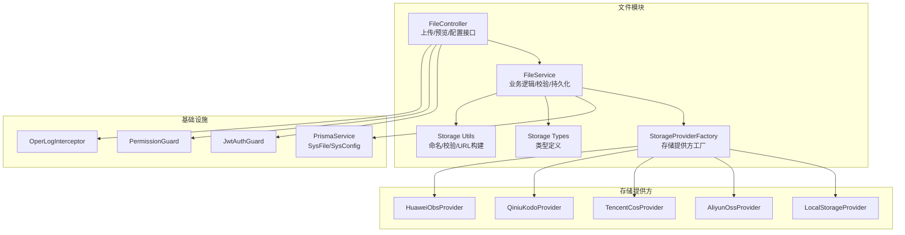
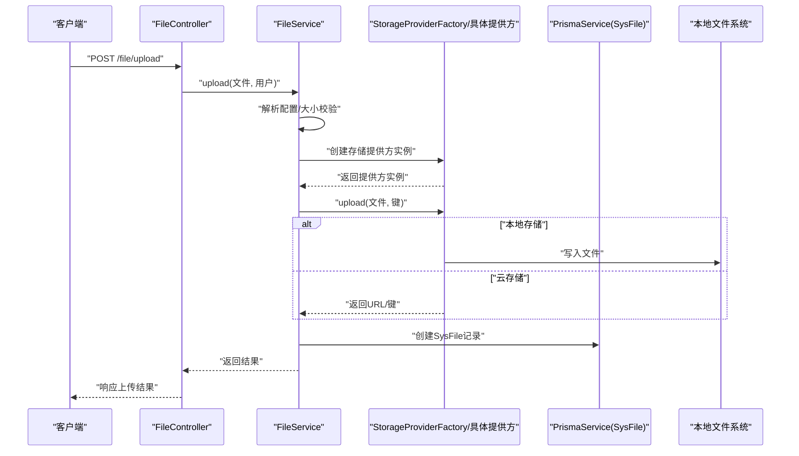
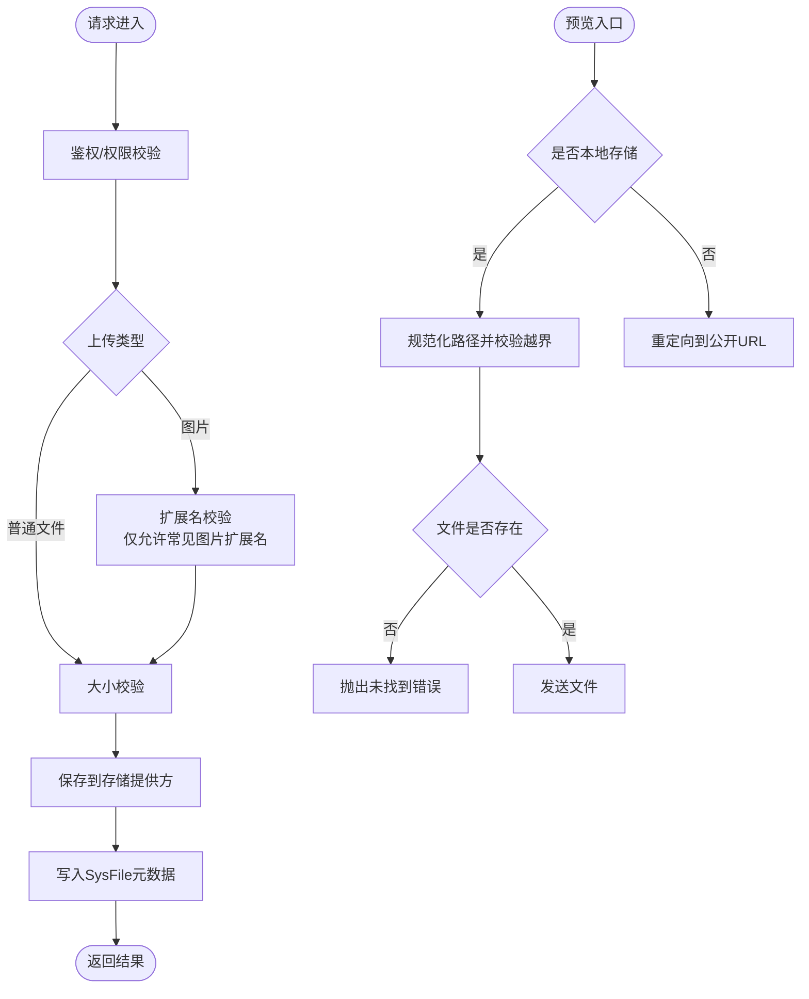
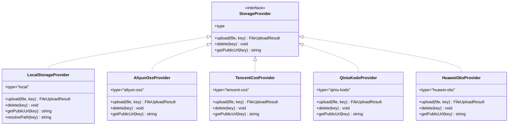
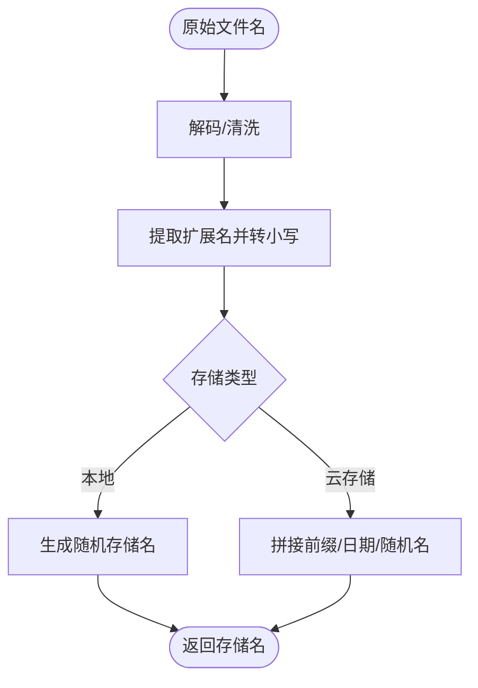
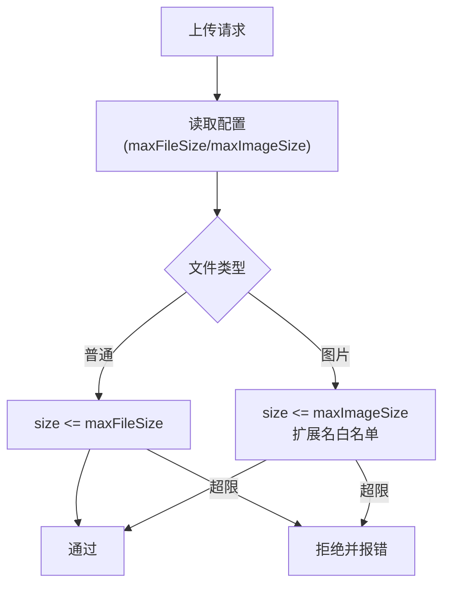
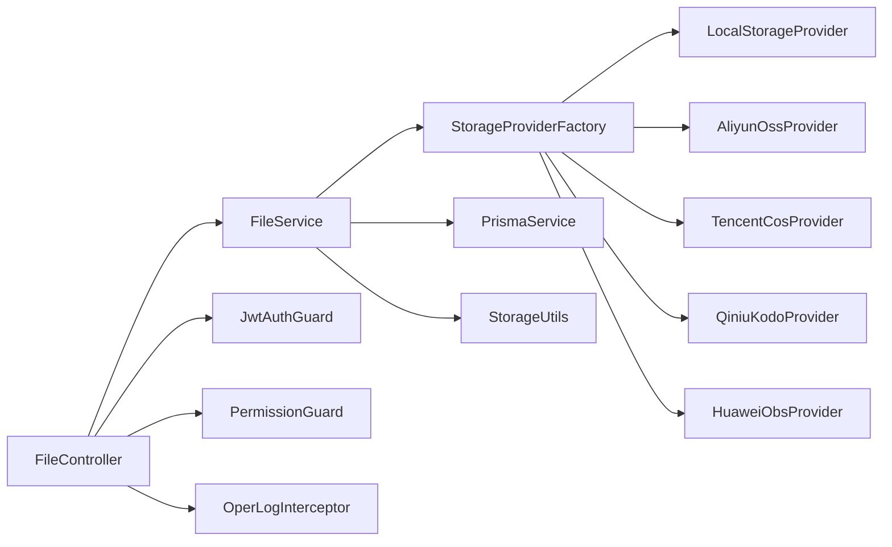
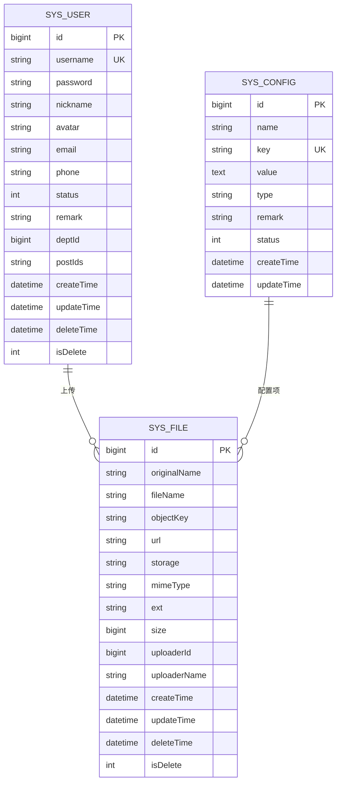

# 文件上传安全

<cite>
**本文引用的文件**
- [apps/backend/src/modules/file/file.controller.ts](file://apps/backend/src/modules/file/file.controller.ts)
- [apps/backend/src/modules/file/file.service.ts](file://apps/backend/src/modules/file/file.service.ts)
- [apps/backend/src/modules/file/file.module.ts](file://apps/backend/src/modules/file/file.module.ts)
- [apps/backend/src/modules/file/storage/storage.types.ts](file://apps/backend/src/modules/file/storage/storage.types.ts)
- [apps/backend/src/modules/file/storage/storage.utils.ts](file://apps/backend/src/modules/file/storage/storage.utils.ts)
- [apps/backend/src/modules/file/storage/storage-provider.factory.ts](file://apps/backend/src/modules/file/storage/storage-provider.factory.ts)
- [apps/backend/src/modules/file/storage/local.provider.ts](file://apps/backend/src/modules/file/storage/local.provider.ts)
- [apps/backend/src/modules/file/storage/aliyun-oss.provider.ts](file://apps/backend/src/modules/file/storage/aliyun-oss.provider.ts)
- [apps/backend/src/modules/file/storage/tencent-cos.provider.ts](file://apps/backend/src/modules/file/storage/tencent-cos.provider.ts)
- [apps/backend/src/modules/file/storage/qiniu-kodo.provider.ts](file://apps/backend/src/modules/file/storage/qiniu-kodo.provider.ts)
- [apps/backend/src/modules/file/storage/huawei-obs.provider.ts](file://apps/backend/src/modules/file/storage/huawei-obs.provider.ts)
- [apps/backend/prisma/schema.prisma](file://apps/backend/prisma/schema.prisma)
- [apps/backend/src/auth/jwt.guard.ts](file://apps/backend/src/auth/jwt.guard.ts)
- [apps/backend/src/auth/guards.ts](file://apps/backend/src/auth/guards.ts)
- [apps/backend/src/common/oper-log.interceptor.ts](file://apps/backend/src/common/oper-log.interceptor.ts)
</cite>

## 目录
1. [引言](#引言)
2. [项目结构](#项目结构)
3. [核心组件](#核心组件)
4. [架构总览](#架构总览)
5. [详细组件分析](#详细组件分析)
6. [依赖关系分析](#依赖关系分析)
7. [性能考量](#性能考量)
8. [故障排查指南](#故障排查指南)
9. [结论](#结论)
10. [附录](#附录)

## 引言
本文件聚焦于文件上传安全，系统性梳理该仓库中文件上传与存储的安全机制与最佳实践，覆盖以下方面：
- 文件类型检查、MIME 类型验证与文件头检测策略
- 文件大小限制与数量控制
- 恶意文件检测与格式验证建议
- 文件命名与路径安全策略
- 存储路径隔离、权限控制与访问控制
- 文件访问控制（临时链接、过期时间、访问日志）
- 云存储服务配置与密钥管理
- 删除与清理安全机制
- 面向文件上传攻击的防护与检测方案

## 项目结构
文件上传功能位于后端应用的文件模块中，采用多存储提供方抽象与统一工厂模式，结合数据库持久化与鉴权/权限守卫，形成可扩展且安全的上传链路。

**图表来源**
- [apps/backend/src/modules/file/file.controller.ts:1-100](file://apps/backend/src/modules/file/file.controller.ts#L1-100)
- [apps/backend/src/modules/file/file.service.ts:1-310](file://apps/backend/src/modules/file/file.service.ts#L1-310)
- [apps/backend/src/modules/file/storage/storage-provider.factory.ts:1-25](file://apps/backend/src/modules/file/storage/storage-provider.factory.ts#L1-25)
- [apps/backend/src/modules/file/storage/storage.types.ts:1-43](file://apps/backend/src/modules/file/storage/storage.types.ts#L1-43)
- [apps/backend/src/modules/file/storage/storage.utils.ts:1-62](file://apps/backend/src/modules/file/storage/storage.utils.ts#L1-62)
- [apps/backend/src/modules/file/storage/local.provider.ts:1-46](file://apps/backend/src/modules/file/storage/local.provider.ts#L1-46)
- [apps/backend/src/modules/file/storage/aliyun-oss.provider.ts:1-51](file://apps/backend/src/modules/file/storage/aliyun-oss.provider.ts#L1-51)
- [apps/backend/src/modules/file/storage/tencent-cos.provider.ts:1-74](file://apps/backend/src/modules/file/storage/tencent-cos.provider.ts#L1-74)
- [apps/backend/src/modules/file/storage/qiniu-kodo.provider.ts:1-68](file://apps/backend/src/modules/file/storage/qiniu-kodo.provider.ts#L1-68)
- [apps/backend/src/modules/file/storage/huawei-obs.provider.ts:1-93](file://apps/backend/src/modules/file/storage/huawei-obs.provider.ts#L1-93)
- [apps/backend/prisma/schema.prisma:182-207](file://apps/backend/prisma/schema.prisma#L182-L207)
- [apps/backend/src/auth/jwt.guard.ts:1-5](file://apps/backend/src/auth/jwt.guard.ts#L1-5)
- [apps/backend/src/auth/guards.ts:1-51](file://apps/backend/src/auth/guards.ts#L1-51)
- [apps/backend/src/common/oper-log.interceptor.ts:1-111](file://apps/backend/src/common/oper-log.interceptor.ts#L1-111)

**章节来源**
- [apps/backend/src/modules/file/file.controller.ts:1-100](file://apps/backend/src/modules/file/file.controller.ts#L1-100)
- [apps/backend/src/modules/file/file.service.ts:1-310](file://apps/backend/src/modules/file/file.service.ts#L1-310)
- [apps/backend/src/modules/file/file.module.ts:1-10](file://apps/backend/src/modules/file/file.module.ts#L1-10)

## 核心组件
- 控制器：提供上传、图片上传、文件列表、详情、删除、预览/下载等接口；对上传接口启用文件拦截器与鉴权/权限守卫；对预览接口支持公开访问。
- 服务层：集中处理配置解析、大小校验、类型校验、存储选择、元数据入库、删除与清理。
- 存储抽象：统一的存储提供方接口，支持本地与多家云存储；通过工厂按配置动态选择。
- 数据模型：SysFile 记录文件元信息；SysConfig 存储文件存储配置与阈值。
- 安全守卫：JWT 鉴权与权限守卫，确保上传/管理操作受控。
- 操作日志：拦截器记录上传相关操作，便于审计与追踪。

**章节来源**
- [apps/backend/src/modules/file/file.controller.ts:32-99](file://apps/backend/src/modules/file/file.controller.ts#L32-L99)
- [apps/backend/src/modules/file/file.service.ts:41-309](file://apps/backend/src/modules/file/file.service.ts#L41-L309)
- [apps/backend/prisma/schema.prisma:182-207](file://apps/backend/prisma/schema.prisma#L182-L207)
- [apps/backend/src/auth/guards.ts:19-51](file://apps/backend/src/auth/guards.ts#L19-L51)
- [apps/backend/src/common/oper-log.interceptor.ts:11-111](file://apps/backend/src/common/oper-log.interceptor.ts#L11-L111)

## 架构总览
文件上传从控制器进入，经服务层进行安全校验与存储决策，再由存储提供方完成实际写入或云端上传，同时将元数据写入数据库。预览接口根据存储类型返回重定向或直接读取本地文件。

**图表来源**
- [apps/backend/src/modules/file/file.controller.ts:77-83](file://apps/backend/src/modules/file/file.controller.ts#L77-L83)
- [apps/backend/src/modules/file/file.service.ts:150-209](file://apps/backend/src/modules/file/file.service.ts#L150-L209)
- [apps/backend/src/modules/file/storage/storage-provider.factory.ts:8-24](file://apps/backend/src/modules/file/storage/storage-provider.factory.ts#L8-L24)
- [apps/backend/src/modules/file/storage/local.provider.ts:11-26](file://apps/backend/src/modules/file/storage/local.provider.ts#L11-L26)
- [apps/backend/prisma/schema.prisma:182-207](file://apps/backend/prisma/schema.prisma#L182-L207)

## 详细组件分析

### 文件上传与预览流程
- 上传接口：启用内存存储与大小限制；支持普通文件与图片两类上传，图片上传额外限制扩展名。
- 预览接口：本地存储时进行路径规范化与越界检测；非本地存储时返回公开URL重定向。
- 删除接口：先调用对应存储提供方删除对象，再软删除数据库记录。

**图表来源**
- [apps/backend/src/modules/file/file.controller.ts:77-98](file://apps/backend/src/modules/file/file.controller.ts#L77-L98)
- [apps/backend/src/modules/file/file.service.ts:150-209](file://apps/backend/src/modules/file/file.service.ts#L150-L209)
- [apps/backend/src/modules/file/storage/local.provider.ts:39-44](file://apps/backend/src/modules/file/storage/local.provider.ts#L39-L44)

**章节来源**
- [apps/backend/src/modules/file/file.controller.ts:77-98](file://apps/backend/src/modules/file/file.controller.ts#L77-L98)
- [apps/backend/src/modules/file/file.service.ts:150-209](file://apps/backend/src/modules/file/file.service.ts#L150-L209)
- [apps/backend/src/modules/file/storage/local.provider.ts:39-44](file://apps/backend/src/modules/file/storage/local.provider.ts#L39-L44)

### 存储提供方与配置解析
- 工厂模式：依据配置动态选择本地或云存储提供方。
- 云存储提供方：阿里云 OSS、腾讯云 COS、七牛 Kodo、华为 OBS，均在上传时设置 Content-Type 并支持自定义公共URL。
- 配置解析：从数据库与环境变量加载存储配置，支持最大文件/图片大小、存储类型、桶/区域、密钥、前缀、公开URL、HTTPS 等。

**图表来源**
- [apps/backend/src/modules/file/storage/storage.types.ts:33-42](file://apps/backend/src/modules/file/storage/storage.types.ts#L33-L42)
- [apps/backend/src/modules/file/storage/local.provider.ts:6-45](file://apps/backend/src/modules/file/storage/local.provider.ts#L6-L45)
- [apps/backend/src/modules/file/storage/aliyun-oss.provider.ts:6-50](file://apps/backend/src/modules/file/storage/aliyun-oss.provider.ts#L6-L50)
- [apps/backend/src/modules/file/storage/tencent-cos.provider.ts:7-73](file://apps/backend/src/modules/file/storage/tencent-cos.provider.ts#L7-L73)
- [apps/backend/src/modules/file/storage/qiniu-kodo.provider.ts:7-67](file://apps/backend/src/modules/file/storage/qiniu-kodo.provider.ts#L7-L67)
- [apps/backend/src/modules/file/storage/huawei-obs.provider.ts:8-92](file://apps/backend/src/modules/file/storage/huawei-obs.provider.ts#L8-L92)

**章节来源**
- [apps/backend/src/modules/file/storage/storage-provider.factory.ts:8-24](file://apps/backend/src/modules/file/storage/storage-provider.factory.ts#L8-L24)
- [apps/backend/src/modules/file/storage/storage.types.ts:10-42](file://apps/backend/src/modules/file/storage/storage.types.ts#L10-L42)
- [apps/backend/src/modules/file/storage/storage.utils.ts:42-61](file://apps/backend/src/modules/file/storage/storage.utils.ts#L42-L61)

### 文件命名与路径安全
- 随机命名：本地存储使用带时间戳与随机数的文件名，避免暴露原始名称与路径。
- 云存储键：基于前缀与日期路径组织对象键，增强可维护性与访问控制灵活性。
- 路径遍历防护：本地预览时对路径进行规范化与越界检测，防止目录穿越。
- 特殊字符过滤：对原始文件名进行解码与清洗，降低异常字符风险。

**图表来源**
- [apps/backend/src/modules/file/storage/storage.utils.ts:5-20](file://apps/backend/src/modules/file/storage/storage.utils.ts#L5-L20)
- [apps/backend/src/modules/file/storage/local.provider.ts:16-17](file://apps/backend/src/modules/file/storage/local.provider.ts#L16-L17)
- [apps/backend/src/modules/file/file.service.ts:187-209](file://apps/backend/src/modules/file/file.service.ts#L187-L209)
- [apps/backend/src/modules/file/storage/local.provider.ts:39-44](file://apps/backend/src/modules/file/storage/local.provider.ts#L39-L44)

**章节来源**
- [apps/backend/src/modules/file/storage/storage.utils.ts:5-33](file://apps/backend/src/modules/file/storage/storage.utils.ts#L5-L33)
- [apps/backend/src/modules/file/storage/local.provider.ts:11-26](file://apps/backend/src/modules/file/storage/local.provider.ts#L11-L26)

### 文件大小限制与数量控制
- 大小限制：普通文件与图片文件分别配置最大大小；上传时进行严格校验。
- 数量控制：列表查询支持分页与条件筛选，便于后台管理与审计。

**图表来源**
- [apps/backend/src/modules/file/file.service.ts:150-166](file://apps/backend/src/modules/file/file.service.ts#L150-L166)
- [apps/backend/src/modules/file/file.service.ts:100-119](file://apps/backend/src/modules/file/file.service.ts#L100-L119)

**章节来源**
- [apps/backend/src/modules/file/file.service.ts:150-166](file://apps/backend/src/modules/file/file.service.ts#L150-L166)
- [apps/backend/src/modules/file/file.service.ts:100-119](file://apps/backend/src/modules/file/file.service.ts#L100-L119)

### 恶意文件检测与格式验证
- 当前实现要点：对图片上传进行扩展名白名单校验；上传时设置 Content-Type；本地预览时进行路径越界检测。
- 建议补充：引入文件头/魔数检测、病毒扫描集成、恶意代码静态分析、MIME 类型与扩展名一致性校验、文件内容二次验证。

**章节来源**
- [apps/backend/src/modules/file/file.service.ts:157-166](file://apps/backend/src/modules/file/file.service.ts#L157-L166)
- [apps/backend/src/modules/file/storage/aliyun-oss.provider.ts:21-25](file://apps/backend/src/modules/file/storage/aliyun-oss.provider.ts#L21-L25)
- [apps/backend/src/modules/file/storage/tencent-cos.provider.ts:20-34](file://apps/backend/src/modules/file/storage/tencent-cos.provider.ts#L20-L34)
- [apps/backend/src/modules/file/storage/qiniu-kodo.provider.ts:21-28](file://apps/backend/src/modules/file/storage/qiniu-kodo.provider.ts#L21-L28)
- [apps/backend/src/modules/file/storage/huawei-obs.provider.ts:26-46](file://apps/backend/src/modules/file/storage/huawei-obs.provider.ts#L26-L46)
- [apps/backend/src/modules/file/storage/local.provider.ts:39-44](file://apps/backend/src/modules/file/storage/local.provider.ts#L39-L44)

### 文件存储安全配置
- 本地存储：指定上传目录，首次写入自动创建目录；预览时进行路径规范化与越界检测。
- 云存储：要求完整配置（区域、桶、密钥、访问ID），支持自定义公共URL与HTTPS；不同云厂商 SDK 参数适配。
- 权限控制：上传与管理接口均需 JWT 与权限守卫；预览接口可设为公开访问。

**章节来源**
- [apps/backend/src/modules/file/storage/local.provider.ts:11-26](file://apps/backend/src/modules/file/storage/local.provider.ts#L11-L26)
- [apps/backend/src/modules/file/storage/aliyun-oss.provider.ts:9-11](file://apps/backend/src/modules/file/storage/aliyun-oss.provider.ts#L9-L11)
- [apps/backend/src/modules/file/storage/tencent-cos.provider.ts:10-12](file://apps/backend/src/modules/file/storage/tencent-cos.provider.ts#L10-L12)
- [apps/backend/src/modules/file/storage/qiniu-kodo.provider.ts:10-12](file://apps/backend/src/modules/file/storage/qiniu-kodo.provider.ts#L10-L12)
- [apps/backend/src/modules/file/storage/huawei-obs.provider.ts:11-16](file://apps/backend/src/modules/file/storage/huawei-obs.provider.ts#L11-L16)
- [apps/backend/src/modules/file/file.controller.ts:77-98](file://apps/backend/src/modules/file/file.controller.ts#L77-L98)

### 文件访问控制与日志
- 访问控制：预览接口根据存储类型返回重定向或直接读取；可结合网关/CDN 的访问控制策略。
- 过期时间：当前实现未内置临时链接与过期时间；可在云存储侧配置签名URL与过期策略。
- 访问日志：操作日志拦截器记录上传相关请求与响应，便于审计。

**章节来源**
- [apps/backend/src/modules/file/file.controller.ts:93-98](file://apps/backend/src/modules/file/file.controller.ts#L93-L98)
- [apps/backend/src/common/oper-log.interceptor.ts:15-61](file://apps/backend/src/common/oper-log.interceptor.ts#L15-L61)

### 云存储服务配置与密钥管理
- 配置项：存储类型、上传目录、最大文件/图片大小、区域、桶、访问ID、密钥、端点、前缀、公共URL、HTTPS。
- 密钥管理：敏感字段在配置查询时进行遮蔽；更新配置时支持部分字段变更；云存储提供方在构造时校验关键配置。

**章节来源**
- [apps/backend/src/modules/file/file.service.ts:45-98](file://apps/backend/src/modules/file/file.service.ts#L45-L98)
- [apps/backend/src/modules/file/storage/storage.utils.ts:42-46](file://apps/backend/src/modules/file/storage/storage.utils.ts#L42-L46)

### 删除与清理安全机制
- 删除流程：先调用存储提供方删除对象，再软删除数据库记录（标记删除时间）。
- 清理策略：建议定期扫描数据库中已标记删除且超过保留期的对象，执行最终清理。

**章节来源**
- [apps/backend/src/modules/file/file.service.ts:129-148](file://apps/backend/src/modules/file/file.service.ts#L129-L148)

## 依赖关系分析
- 控制器依赖服务层与守卫；服务层依赖存储工厂与工具函数；存储工厂依赖各云存储提供方；服务层依赖数据库模型与配置。
- 关键耦合点：配置解析、存储选择、路径与URL构建、日志记录。

**图表来源**
- [apps/backend/src/modules/file/file.controller.ts:16-23](file://apps/backend/src/modules/file/file.controller.ts#L16-L23)
- [apps/backend/src/modules/file/file.service.ts:43-43](file://apps/backend/src/modules/file/file.service.ts#L43-L43)
- [apps/backend/src/modules/file/storage/storage-provider.factory.ts:8-24](file://apps/backend/src/modules/file/storage/storage-provider.factory.ts#L8-L24)
- [apps/backend/src/auth/guards.ts:19-51](file://apps/backend/src/auth/guards.ts#L19-L51)
- [apps/backend/src/common/oper-log.interceptor.ts:11-28](file://apps/backend/src/common/oper-log.interceptor.ts#L11-L28)

**章节来源**
- [apps/backend/src/modules/file/file.controller.ts:16-23](file://apps/backend/src/modules/file/file.controller.ts#L16-L23)
- [apps/backend/src/modules/file/file.service.ts:43-43](file://apps/backend/src/modules/file/file.service.ts#L43-L43)
- [apps/backend/src/modules/file/storage/storage-provider.factory.ts:8-24](file://apps/backend/src/modules/file/storage/storage-provider.factory.ts#L8-L24)

## 性能考量
- 内存上传：当前使用内存存储，适合中小文件；大文件可能导致内存压力，建议在生产环境限制最大文件大小并考虑流式上传或分片。
- 云存储上传：SDK 直传，网络为瓶颈；建议开启 CDN 与 HTTPS，合理设置对象缓存策略。
- 数据库写入：每次上传写入一条记录，索引覆盖存储类型、对象键、上传者、时间与删除状态，有利于查询与清理。

[本节为通用指导，不涉及具体文件分析]

## 故障排查指南
- 上传被拒：检查文件大小是否超过配置阈值；确认图片扩展名是否在白名单内。
- 预览失败：本地存储时检查上传目录权限与文件存在性；路径越界保护会阻止非法访问。
- 云存储错误：核对区域、桶、密钥、端点与公共URL配置；查看云厂商 SDK 返回状态。
- 删除异常：云对象可能已被删除但仍需清理元数据，服务层已做容错处理；如需彻底清理，检查云存储侧状态。

**章节来源**
- [apps/backend/src/modules/file/file.service.ts:150-166](file://apps/backend/src/modules/file/file.service.ts#L150-L166)
- [apps/backend/src/modules/file/file.service.ts:168-185](file://apps/backend/src/modules/file/file.service.ts#L168-L185)
- [apps/backend/src/modules/file/storage/local.provider.ts:39-44](file://apps/backend/src/modules/file/storage/local.provider.ts#L39-L44)
- [apps/backend/src/modules/file/storage/aliyun-oss.provider.ts:34-38](file://apps/backend/src/modules/file/storage/aliyun-oss.provider.ts#L34-L38)
- [apps/backend/src/modules/file/storage/tencent-cos.provider.ts:45-51](file://apps/backend/src/modules/file/storage/tencent-cos.provider.ts#L45-L51)
- [apps/backend/src/modules/file/storage/qiniu-kodo.provider.ts:39-41](file://apps/backend/src/modules/file/storage/qiniu-kodo.provider.ts#L39-L41)
- [apps/backend/src/modules/file/storage/huawei-obs.provider.ts:57-62](file://apps/backend/src/modules/file/storage/huawei-obs.provider.ts#L57-L62)

## 结论
该文件上传模块具备清晰的职责分离与可扩展的存储抽象，结合鉴权、权限与操作日志，形成了较为完整的安全基线。建议在现有基础上进一步完善恶意文件检测、签名URL与过期控制、更严格的文件头/格式验证，以及统一的删除与清理策略，以满足更高安全等级的要求。

[本节为总结性内容，不涉及具体文件分析]

## 附录

### 数据模型概览（与文件上传相关）

**图表来源**
- [apps/backend/prisma/schema.prisma:182-207](file://apps/backend/prisma/schema.prisma#L182-L207)
- [apps/backend/prisma/schema.prisma:152-165](file://apps/backend/prisma/schema.prisma#L152-L165)
- [apps/backend/prisma/schema.prisma:12-38](file://apps/backend/prisma/schema.prisma#L12-L38)