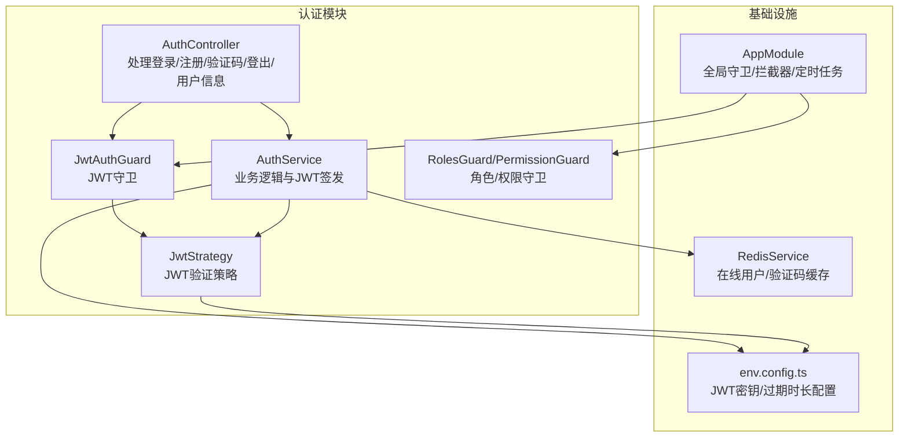
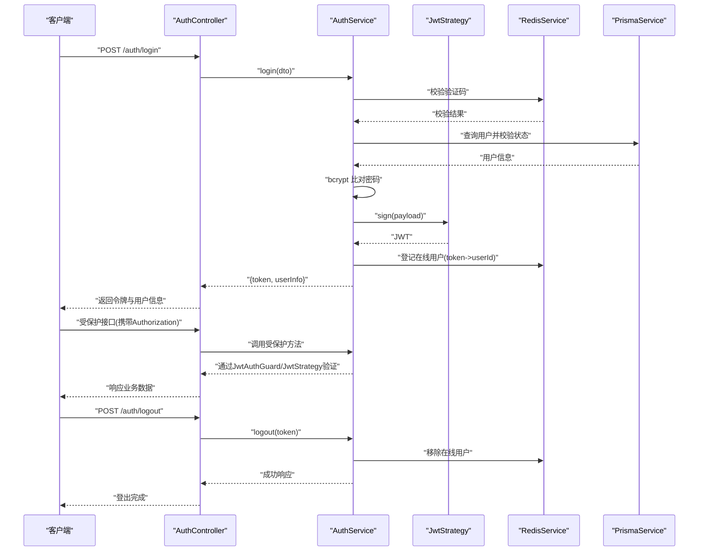
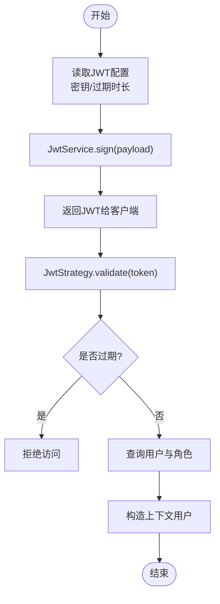
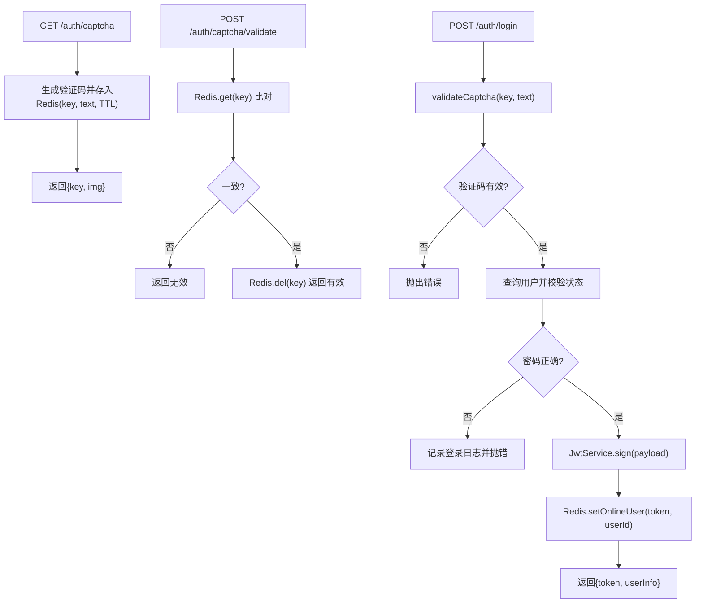
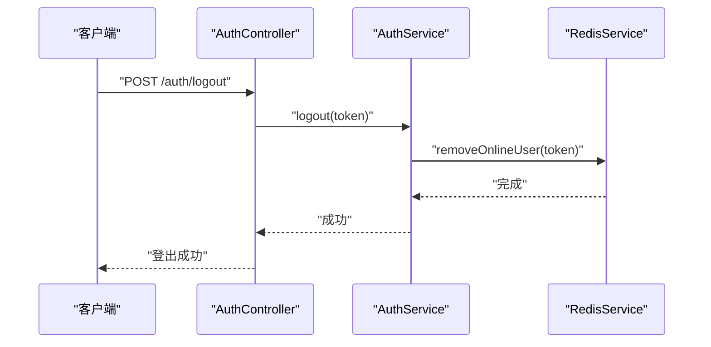
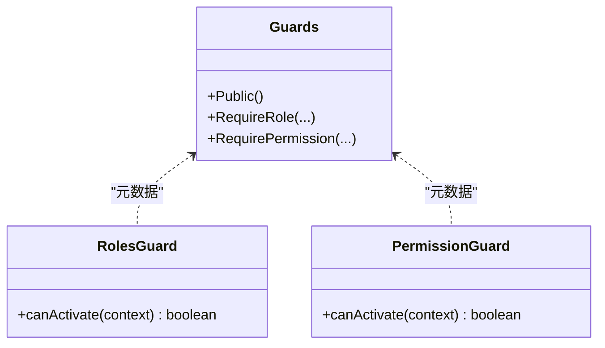
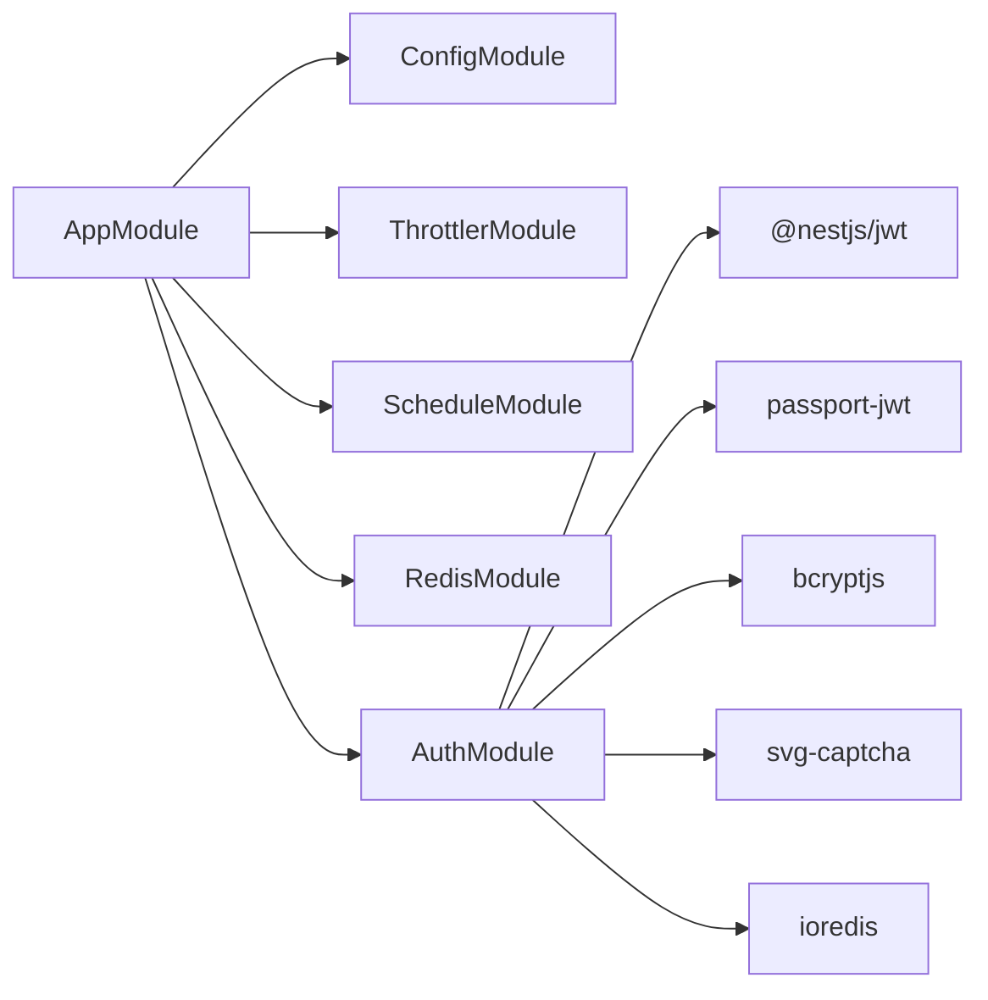

# 认证安全

<cite>
**本文引用的文件**
- [apps/backend/src/auth/auth.controller.ts](file://apps/backend/src/auth/auth.controller.ts)
- [apps/backend/src/auth/auth.service.ts](file://apps/backend/src/auth/auth.service.ts)
- [apps/backend/src/auth/jwt.strategy.ts](file://apps/backend/src/auth/jwt.strategy.ts)
- [apps/backend/src/auth/jwt.guard.ts](file://apps/backend/src/auth/jwt.guard.ts)
- [apps/backend/src/auth/guards.ts](file://apps/backend/src/auth/guards.ts)
- [apps/backend/src/auth/dto/auth.dto.ts](file://apps/backend/src/auth/dto/auth.dto.ts)
- [apps/backend/src/cache/redis.service.ts](file://apps/backend/src/cache/redis.service.ts)
- [apps/backend/src/config/env.config.ts](file://apps/backend/src/config/env.config.ts)
- [apps/backend/src/app.module.ts](file://apps/backend/src/app.module.ts)
- [apps/backend/src/main.ts](file://apps/backend/src/main.ts)
- [apps/backend/package.json](file://apps/backend/package.json)
</cite>

## 目录
1. [引言](#引言)
2. [项目结构](#项目结构)
3. [核心组件](#核心组件)
4. [架构总览](#架构总览)
5. [详细组件分析](#详细组件分析)
6. [依赖关系分析](#依赖关系分析)
7. [性能考量](#性能考量)
8. [故障排查指南](#故障排查指南)
9. [结论](#结论)
10. [附录](#附录)

## 引言
本文件聚焦于后端认证与授权子系统的安全设计与实现，围绕基于 JWT 的认证机制进行深入解析，涵盖令牌生成、验证与注销流程；密钥管理（含密钥轮换建议）；过期时间与续期策略；以及与 Redis 在线用户状态管理的协同。同时结合现有代码实现，给出安全最佳实践与可操作的改进建议，帮助读者在不牺牲可用性的前提下提升系统安全性。

## 项目结构
后端采用 NestJS 模块化组织，认证相关模块位于 apps/backend/src/auth 下，核心职责如下：
- 控制器：处理登录、注册、验证码、登出、用户信息等公开或受保护接口
- 服务：业务逻辑封装，包括密码校验、JWT 签发、在线用户登记、日志记录等
- 守卫与策略：JWT 验证策略、角色/权限守卫、公开接口注解
- 缓存：基于 Redis 的在线用户状态与短期验证码缓存
- 配置：JWT 密钥与过期时长等通过环境变量注入

图表来源
- [apps/backend/src/auth/auth.controller.ts:1-87](file://apps/backend/src/auth/auth.controller.ts#L1-L87)
- [apps/backend/src/auth/auth.service.ts:1-294](file://apps/backend/src/auth/auth.service.ts#L1-L294)
- [apps/backend/src/auth/jwt.strategy.ts:1-78](file://apps/backend/src/auth/jwt.strategy.ts#L1-L78)
- [apps/backend/src/auth/jwt.guard.ts:1-5](file://apps/backend/src/auth/jwt.guard.ts#L1-L5)
- [apps/backend/src/auth/guards.ts:1-51](file://apps/backend/src/auth/guards.ts#L1-L51)
- [apps/backend/src/cache/redis.service.ts:1-128](file://apps/backend/src/cache/redis.service.ts#L1-L128)
- [apps/backend/src/config/env.config.ts:1-47](file://apps/backend/src/config/env.config.ts#L1-L47)
- [apps/backend/src/app.module.ts:1-59](file://apps/backend/src/app.module.ts#L1-L59)

章节来源
- [apps/backend/src/auth/auth.controller.ts:1-87](file://apps/backend/src/auth/auth.controller.ts#L1-L87)
- [apps/backend/src/auth/auth.service.ts:1-294](file://apps/backend/src/auth/auth.service.ts#L1-L294)
- [apps/backend/src/auth/jwt.strategy.ts:1-78](file://apps/backend/src/auth/jwt.strategy.ts#L1-L78)
- [apps/backend/src/auth/jwt.guard.ts:1-5](file://apps/backend/src/auth/jwt.guard.ts#L1-L5)
- [apps/backend/src/auth/guards.ts:1-51](file://apps/backend/src/auth/guards.ts#L1-L51)
- [apps/backend/src/cache/redis.service.ts:1-128](file://apps/backend/src/cache/redis.service.ts#L1-L128)
- [apps/backend/src/config/env.config.ts:1-47](file://apps/backend/src/config/env.config.ts#L1-L47)
- [apps/backend/src/app.module.ts:1-59](file://apps/backend/src/app.module.ts#L1-L59)

## 核心组件
- 登录与注册
  - 登录接口接收用户名、密码与验证码，先校验验证码，再比对用户状态与密码，成功后签发 JWT 并登记在线用户
  - 注册接口对密码进行哈希处理并创建用户
- JWT 策略与守卫
  - 使用 passport-jwt 从 Authorization 头部提取 Bearer Token，禁用忽略过期选项，密钥来自配置服务
  - JwtAuthGuard 基于 jwt 策略的通用守卫
  - 角色/权限守卫支持基于元数据的角色与权限校验
- 在线用户与验证码
  - 登录成功后将 token 映射到用户 ID 并写入集合，用于在线用户查询与登出清理
  - 验证码以键值形式存入 Redis，并设置短期 TTL，校验后即删除
- 全局安全配置
  - 全局启用 CORS、统一前缀、Swagger 文档与 Bearer 授权
  - 全局限流（每分钟请求次数），可按需扩展为更细粒度的速率限制

章节来源
- [apps/backend/src/auth/auth.controller.ts:13-87](file://apps/backend/src/auth/auth.controller.ts#L13-L87)
- [apps/backend/src/auth/auth.service.ts:29-133](file://apps/backend/src/auth/auth.service.ts#L29-L133)
- [apps/backend/src/auth/jwt.strategy.ts:13-43](file://apps/backend/src/auth/jwt.strategy.ts#L13-L43)
- [apps/backend/src/auth/jwt.guard.ts:1-5](file://apps/backend/src/auth/jwt.guard.ts#L1-L5)
- [apps/backend/src/auth/guards.ts:10-51](file://apps/backend/src/auth/guards.ts#L10-L51)
- [apps/backend/src/cache/redis.service.ts:82-99](file://apps/backend/src/cache/redis.service.ts#L82-L99)
- [apps/backend/src/main.ts:11-35](file://apps/backend/src/main.ts#L11-L35)
- [apps/backend/src/app.module.ts:24-29](file://apps/backend/src/app.module.ts#L24-L29)

## 架构总览
下图展示认证主流程：登录、JWT 验证、在线用户登记与登出。

图表来源
- [apps/backend/src/auth/auth.controller.ts:14-51](file://apps/backend/src/auth/auth.controller.ts#L14-L51)
- [apps/backend/src/auth/auth.service.ts:29-133](file://apps/backend/src/auth/auth.service.ts#L29-L133)
- [apps/backend/src/auth/jwt.strategy.ts:20-43](file://apps/backend/src/auth/jwt.strategy.ts#L20-L43)
- [apps/backend/src/cache/redis.service.ts:82-99](file://apps/backend/src/cache/redis.service.ts#L82-L99)

## 详细组件分析

### JWT 生成与验证流程
- 生成
  - 登录成功后，服务层使用 JwtService 对包含用户标识的载荷进行签名，生成 JWT
- 验证
  - JwtStrategy 从请求头中提取 Bearer Token，使用配置的密钥与过期控制进行验证
  - 验证通过后，从数据库加载用户角色与部门信息，构建上下文用户对象
- 过期控制
  - 禁止忽略过期，确保令牌到期后无法继续使用

图表来源
- [apps/backend/src/auth/auth.service.ts:62-63](file://apps/backend/src/auth/auth.service.ts#L62-L63)
- [apps/backend/src/auth/jwt.strategy.ts:13-17](file://apps/backend/src/auth/jwt.strategy.ts#L13-L17)
- [apps/backend/src/config/env.config.ts:6-7](file://apps/backend/src/config/env.config.ts#L6-L7)

章节来源
- [apps/backend/src/auth/auth.service.ts:29-89](file://apps/backend/src/auth/auth.service.ts#L29-L89)
- [apps/backend/src/auth/jwt.strategy.ts:20-43](file://apps/backend/src/auth/jwt.strategy.ts#L20-L43)
- [apps/backend/src/config/env.config.ts:6-7](file://apps/backend/src/config/env.config.ts#L6-L7)

### 登录与验证码流程
- 验证码
  - 获取验证码：生成 SVG 图形与唯一键，键值对存入 Redis，设置短期 TTL
  - 校验验证码：从 Redis 取出并比对，一致则删除该键
- 登录
  - 校验验证码通过后，查询用户并检查状态
  - 使用 bcrypt 对比密码
  - 成功后签发 JWT，并将 token 与用户 ID 绑定，加入在线用户集合

图表来源
- [apps/backend/src/auth/auth.service.ts:109-128](file://apps/backend/src/auth/auth.service.ts#L109-L128)
- [apps/backend/src/cache/redis.service.ts:11-14](file://apps/backend/src/cache/redis.service.ts#L11-L14)
- [apps/backend/src/auth/auth.controller.ts:28-42](file://apps/backend/src/auth/auth.controller.ts#L28-L42)

章节来源
- [apps/backend/src/auth/auth.service.ts:109-133](file://apps/backend/src/auth/auth.service.ts#L109-L133)
- [apps/backend/src/cache/redis.service.ts:82-99](file://apps/backend/src/cache/redis.service.ts#L82-L99)
- [apps/backend/src/auth/auth.controller.ts:28-42](file://apps/backend/src/auth/auth.controller.ts#L28-L42)

### 登出与在线用户管理
- 登出
  - 从 Authorization 头部提取 Bearer Token
  - 调用服务层注销，服务层删除 Redis 中的在线用户映射
- 在线用户
  - 登录成功后登记 token->userId，并维护在线用户集合
  - 提供查询在线用户的接口

图表来源
- [apps/backend/src/auth/auth.controller.ts:44-51](file://apps/backend/src/auth/auth.controller.ts#L44-L51)
- [apps/backend/src/auth/auth.service.ts:130-133](file://apps/backend/src/auth/auth.service.ts#L130-L133)
- [apps/backend/src/cache/redis.service.ts:88-91](file://apps/backend/src/cache/redis.service.ts#L88-L91)

章节来源
- [apps/backend/src/auth/auth.controller.ts:44-51](file://apps/backend/src/auth/auth.controller.ts#L44-L51)
- [apps/backend/src/auth/auth.service.ts:130-133](file://apps/backend/src/auth/auth.service.ts#L130-L133)
- [apps/backend/src/cache/redis.service.ts:82-99](file://apps/backend/src/cache/redis.service.ts#L82-L99)

### 角色与权限守卫
- 元数据注解
  - Public：标注公开接口，绕过 JWT 校验
  - RequireRole：要求具备指定角色编码
  - RequirePermission：要求具备指定权限字符串
- 守卫实现
  - RolesGuard：检查用户角色集合是否包含所需角色编码
  - PermissionGuard：检查用户权限集合是否满足所需权限

图表来源
- [apps/backend/src/auth/guards.ts:10-51](file://apps/backend/src/auth/guards.ts#L10-L51)

章节来源
- [apps/backend/src/auth/guards.ts:10-51](file://apps/backend/src/auth/guards.ts#L10-L51)

### 配置与密钥管理
- 配置项
  - JWT 密钥与过期时长通过环境变量注入
- 密钥安全建议
  - 当前实现直接从配置读取密钥，未见密钥轮换逻辑
  - 建议引入密钥轮换：新旧密钥并行验证，逐步淘汰旧密钥；密钥存储与传输采用安全通道与最小暴露面

章节来源
- [apps/backend/src/config/env.config.ts:6-7](file://apps/backend/src/config/env.config.ts#L6-L7)
- [apps/backend/src/auth/jwt.strategy.ts:16-17](file://apps/backend/src/auth/jwt.strategy.ts#L16-L17)

### 客户端令牌存储方案
- 当前后端未实现专用的刷新令牌与刷新接口
- 常见安全存储对比（概念性说明）
  - HttpOnly Cookie：抵御 XSS 攻击，适合持久会话
  - Secure Cookie：仅 HTTPS 传输，防止中间人窃听
  - LocalStorage：易受 XSS 影响，不适合高敏感场景
- 建议
  - 若采用 Cookie 存储，应配合 SameSite、Secure、HttpOnly 等属性
  - 若采用前端本地存储，应配合 CSP、XSS 保护与短令牌生命周期

[本节为概念性说明，不直接分析具体文件]

## 依赖关系分析
- 模块依赖
  - AppModule 导入 ConfigModule、ThrottlerModule、ScheduleModule、RedisModule、AuthModule 等
  - 全局提供 ThrottlerGuard、异常过滤器、拦截器
- 关键外部库
  - @nestjs/jwt、passport-jwt：JWT 生成与验证
  - ioredis：Redis 客户端
  - bcryptjs：密码哈希
  - svg-captcha：图形验证码

图表来源
- [apps/backend/src/app.module.ts:18-56](file://apps/backend/src/app.module.ts#L18-L56)
- [apps/backend/package.json:16-41](file://apps/backend/package.json#L16-L41)

章节来源
- [apps/backend/src/app.module.ts:18-56](file://apps/backend/src/app.module.ts#L18-L56)
- [apps/backend/package.json:16-41](file://apps/backend/package.json#L16-L41)

## 性能考量
- Redis 在线用户与验证码缓存
  - 使用 TTL 管理短期数据，避免内存泄漏
  - 在线用户集合采用集合类型，便于批量查询与清理
- 登录日志与审计
  - 登录成功/失败均写入日志表，便于审计与风控
- 限流
  - 全局限流已启用，建议针对登录接口单独设置更严格的阈值与窗口

[本节提供一般性指导，不直接分析具体文件]

## 故障排查指南
- 常见问题定位
  - 令牌无效或过期：确认密钥是否正确、过期时长是否合理、客户端是否正确携带 Bearer Token
  - 登录失败：检查验证码是否过期、用户状态是否正常、密码是否匹配
  - 在线用户查询为空：确认登录是否成功登记、Redis 是否连通
- 日志与监控
  - 登录日志记录有助于定位失败原因
  - 结合 Redis 与数据库状态进行交叉验证

章节来源
- [apps/backend/src/auth/auth.service.ts:40-74](file://apps/backend/src/auth/auth.service.ts#L40-L74)
- [apps/backend/src/cache/redis.service.ts:82-99](file://apps/backend/src/cache/redis.service.ts#L82-L99)

## 结论
当前实现提供了完整的 JWT 登录、验证与在线用户管理能力，结合验证码与全局限流提升了基础安全水平。为进一步强化安全，建议引入刷新令牌与刷新接口、完善密钥轮换与存储策略、细化令牌续期与撤销机制，并在客户端侧采用更安全的令牌存储方式。这些改进可在不显著影响用户体验的前提下，大幅提升系统的整体安全性。

## 附录

### JWT 密钥与过期时长配置
- 配置来源：环境变量注入
- 建议
  - 密钥长度足够且定期轮换
  - 过期时长根据业务场景权衡，短令牌+刷新令牌组合更安全

章节来源
- [apps/backend/src/config/env.config.ts:6-7](file://apps/backend/src/config/env.config.ts#L6-L7)

### 刷新令牌与撤销机制（建议）
- 刷新令牌
  - 登录成功发放短期访问令牌与长期刷新令牌
  - 刷新接口仅接受刷新令牌，签发新的访问令牌并可重新签发刷新令牌
- 撤销与黑名单
  - 将已撤销的访问令牌加入黑名单，验证阶段进行检查
  - 刷新令牌撤销时，同步使相关访问令牌失效

[本节为建议性内容，不直接分析具体文件]

### 双因素与多因素认证（建议）
- OTP（短信/邮件/应用）
  - 登录第二步：发送一次性验证码，输入正确后发放令牌
- WebAuthn/FIDO2
  - 无密码登录，结合硬件/生物识别，提升抗钓鱼能力

[本节为建议性内容，不直接分析具体文件]

### 认证失败防护（建议）
- 账户锁定
  - 连续失败达到阈值后临时锁定账户
- IP 限制
  - 同一 IP 的失败尝试超过阈值进行临时封禁
- 频率限制
  - 登录接口独立限流，区分不同维度（IP/账号）

[本节为建议性内容，不直接分析具体文件]