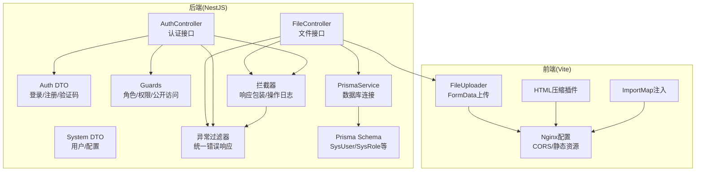
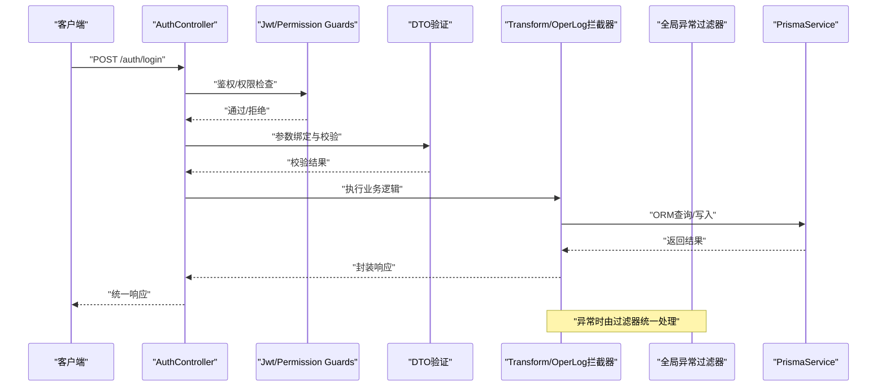
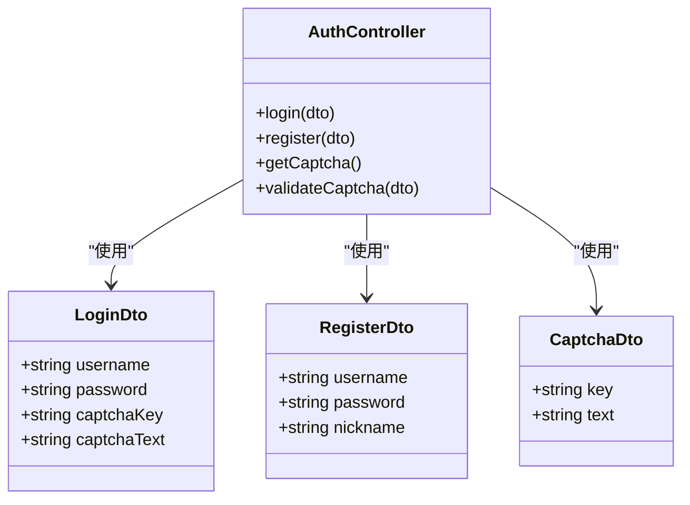
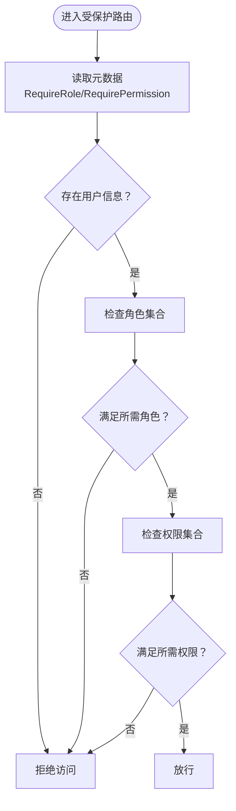
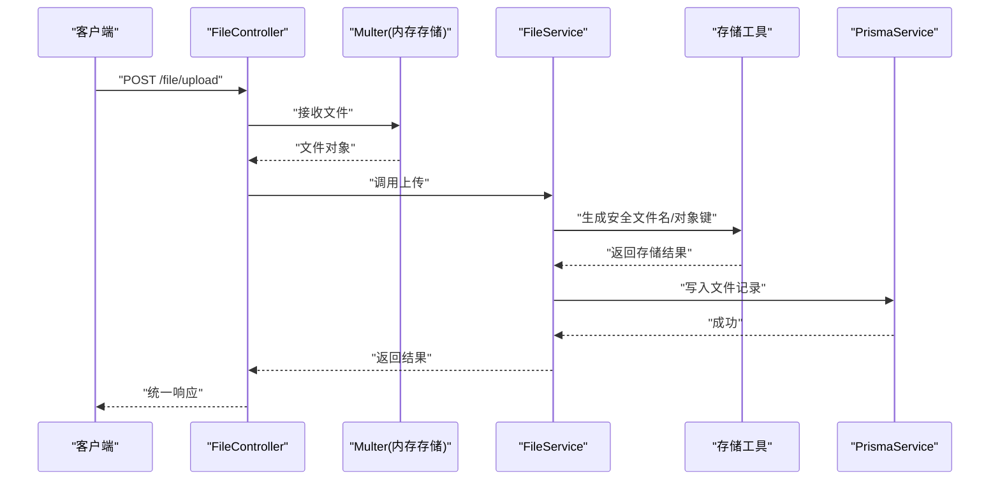
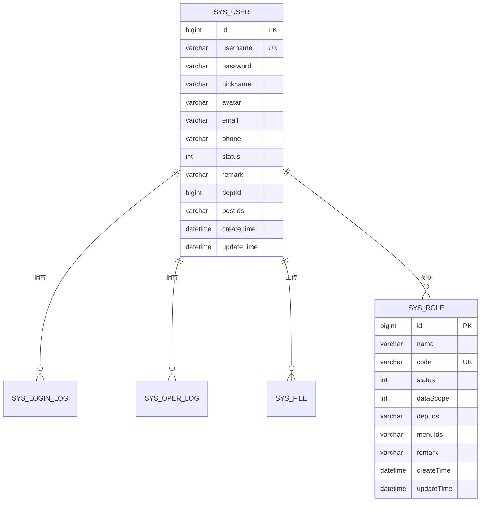
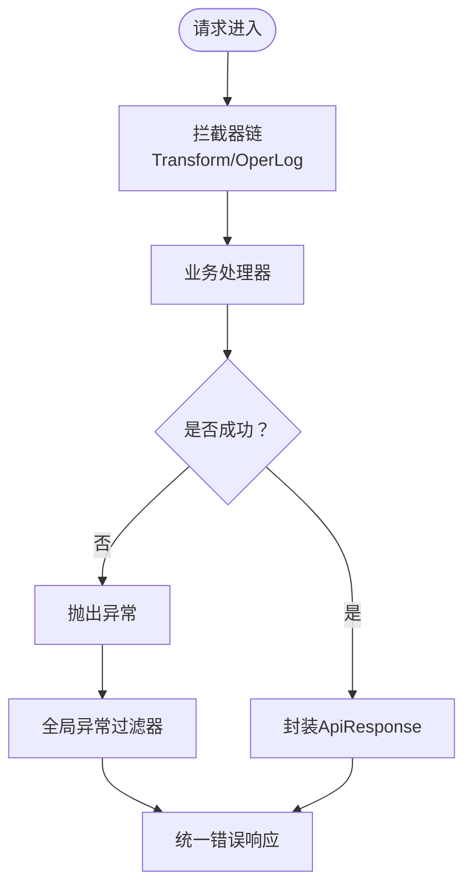
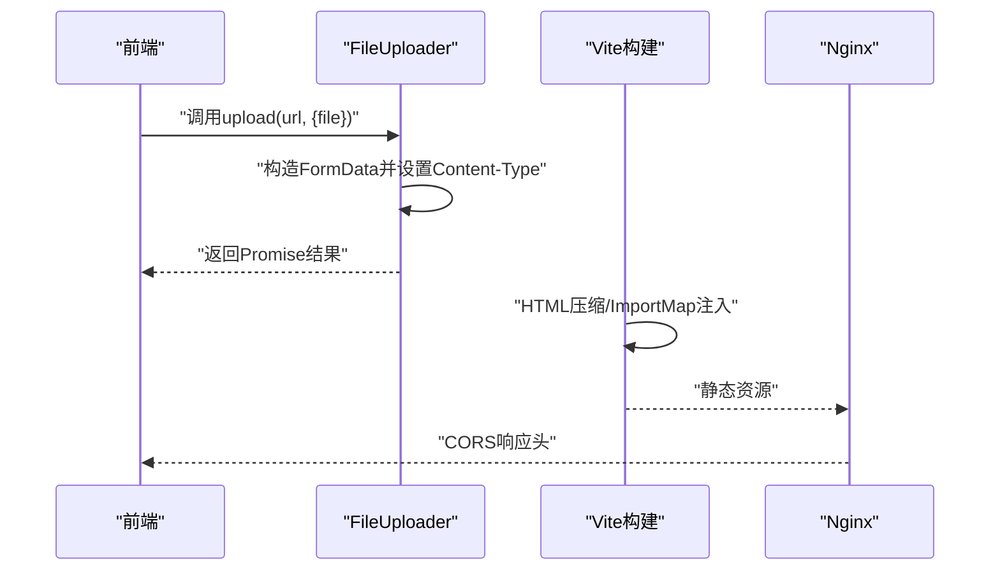
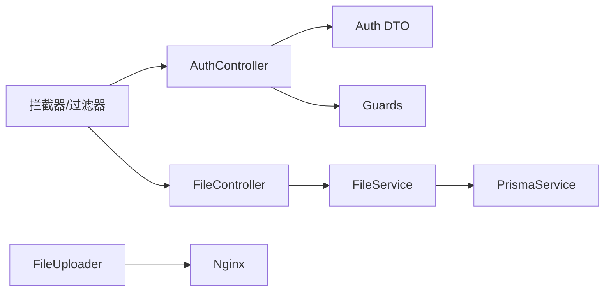

# 输入验证与输出编码

<cite>
**本文引用的文件**
- [apps/backend/src/auth/dto/auth.dto.ts](file://apps/backend/src/auth/dto/auth.dto.ts)
- [apps/backend/src/auth/auth.controller.ts](file://apps/backend/src/auth/auth.controller.ts)
- [apps/backend/src/auth/guards.ts](file://apps/backend/src/auth/guards.ts)
- [apps/backend/src/modules/file/file.controller.ts](file://apps/backend/src/modules/file/file.controller.ts)
- [apps/backend/src/modules/file/file.service.ts](file://apps/backend/src/modules/file/file.service.ts)
- [apps/backend/src/modules/file/storage/storage.utils.ts](file://apps/backend/src/modules/file/storage/storage.utils.ts)
- [apps/backend/src/modules/system/user/dto/user.dto.ts](file://apps/backend/src/modules/system/user/dto/user.dto.ts)
- [apps/backend/src/modules/system/config/dto/config.dto.ts](file://apps/backend/src/modules/system/config/dto/config.dto.ts)
- [apps/backend/src/common/transform.interceptor.ts](file://apps/backend/src/common/transform.interceptor.ts)
- [apps/backend/src/common/exception.filter.ts](file://apps/backend/src/common/exception.filter.ts)
- [apps/backend/src/common/oper-log.interceptor.ts](file://apps/backend/src/common/oper-log.interceptor.ts)
- [apps/backend/src/common/prisma.service.ts](file://apps/backend/src/common/prisma.service.ts)
- [apps/backend/prisma/schema.prisma](file://apps/backend/prisma/schema.prisma)
- [apps/vben-admin/packages/effects/request/src/request-client/modules/uploader.ts](file://apps/vben-admin/packages/effects/request/src/request-client/modules/uploader.ts)
- [apps/vben-admin/packages/effects/request/src/request-client/modules/uploader.test.ts](file://apps/vben-admin/packages/effects/request/src/request-client/modules/uploader.test.ts)
- [apps/vben-admin/internal/vite-config/src/plugins/html.ts](file://apps/vben-admin/internal/vite-config/src/plugins/html.ts)
- [apps/vben-admin/internal/vite-config/src/plugins/importmap.ts](file://apps/vben-admin/internal/vite-config/src/plugins/importmap.ts)
- [apps/vben-admin/scripts/deploy/nginx.conf](file://apps/vben-admin/scripts/deploy/nginx.conf)
</cite>

## 目录
1. [简介](#简介)
2. [项目结构](#项目结构)
3. [核心组件](#核心组件)
4. [架构总览](#架构总览)
5. [详细组件分析](#详细组件分析)
6. [依赖关系分析](#依赖关系分析)
7. [性能考量](#性能考量)
8. [故障排查指南](#故障排查指南)
9. [结论](#结论)
10. [附录](#附录)

## 简介
本文件聚焦于输入验证与输出编码的安全实践，结合后端NestJS与前端Vite生态的实际实现，系统性梳理以下方面：
- 输入数据验证策略：DTO验证、参数校验、请求体验证
- SQL注入防护：参数绑定、ORM查询、存储过程安全
- XSS防护：HTML转义、内容安全策略（CSP）、富文本安全处理
- CSRF防护：Token验证、SameSite Cookie、Referer检查
- 文件上传安全：类型检查、大小限制、恶意文件检测
- API参数严格验证与错误处理机制
- 输出编码与转义策略
- 常见输入验证漏洞与修复建议

## 项目结构
本项目采用多应用架构，后端使用NestJS，前端包含多个子应用（如vben-admin）。安全相关的关键位置如下：
- 后端认证与权限控制：auth模块（DTO、控制器、守卫）
- 文件管理：file模块（控制器、服务、存储工具）
- 系统管理：system模块（用户、配置等DTO）
- 全局拦截器与异常过滤器：统一响应包装、异常捕获与日志
- ORM与数据库：Prisma服务与Schema定义
- 前端构建与部署：Vite插件（HTML压缩、importmap注入）与Nginx配置

图表来源
- [apps/backend/src/auth/auth.controller.ts](file://apps/backend/src/auth/auth.controller.ts)
- [apps/backend/src/modules/file/file.controller.ts](file://apps/backend/src/modules/file/file.controller.ts)
- [apps/backend/src/auth/dto/auth.dto.ts](file://apps/backend/src/auth/dto/auth.dto.ts)
- [apps/backend/src/modules/system/user/dto/user.dto.ts](file://apps/backend/src/modules/system/user/dto/user.dto.ts)
- [apps/backend/src/modules/system/config/dto/config.dto.ts](file://apps/backend/src/modules/system/config/dto/config.dto.ts)
- [apps/backend/src/auth/guards.ts](file://apps/backend/src/auth/guards.ts)
- [apps/backend/src/common/transform.interceptor.ts](file://apps/backend/src/common/transform.interceptor.ts)
- [apps/backend/src/common/exception.filter.ts](file://apps/backend/src/common/exception.filter.ts)
- [apps/backend/src/common/oper-log.interceptor.ts](file://apps/backend/src/common/oper-log.interceptor.ts)
- [apps/backend/src/common/prisma.service.ts](file://apps/backend/src/common/prisma.service.ts)
- [apps/backend/prisma/schema.prisma](file://apps/backend/prisma/schema.prisma)
- [apps/vben-admin/packages/effects/request/src/request-client/modules/uploader.ts](file://apps/vben-admin/packages/effects/request/src/request-client/modules/uploader.ts)
- [apps/vben-admin/internal/vite-config/src/plugins/html.ts](file://apps/vben-admin/internal/vite-config/src/plugins/html.ts)
- [apps/vben-admin/internal/vite-config/src/plugins/importmap.ts](file://apps/vben-admin/internal/vite-config/src/plugins/importmap.ts)
- [apps/vben-admin/scripts/deploy/nginx.conf](file://apps/vben-admin/scripts/deploy/nginx.conf)

章节来源
- [apps/backend/src/auth/auth.controller.ts](file://apps/backend/src/auth/auth.controller.ts)
- [apps/backend/src/modules/file/file.controller.ts](file://apps/backend/src/modules/file/file.controller.ts)
- [apps/backend/src/common/transform.interceptor.ts](file://apps/backend/src/common/transform.interceptor.ts)
- [apps/backend/src/common/exception.filter.ts](file://apps/backend/src/common/exception.filter.ts)
- [apps/backend/src/common/oper-log.interceptor.ts](file://apps/backend/src/common/oper-log.interceptor.ts)
- [apps/backend/src/common/prisma.service.ts](file://apps/backend/src/common/prisma.service.ts)
- [apps/backend/prisma/schema.prisma](file://apps/backend/prisma/schema.prisma)
- [apps/vben-admin/packages/effects/request/src/request-client/modules/uploader.ts](file://apps/vben-admin/packages/effects/request/src/request-client/modules/uploader.ts)
- [apps/vben-admin/internal/vite-config/src/plugins/html.ts](file://apps/vben-admin/internal/vite-config/src/plugins/html.ts)
- [apps/vben-admin/internal/vite-config/src/plugins/importmap.ts](file://apps/vben-admin/internal/vite-config/src/plugins/importmap.ts)
- [apps/vben-admin/scripts/deploy/nginx.conf](file://apps/vben-admin/scripts/deploy/nginx.conf)

## 核心组件
- DTO验证：通过class-validator装饰器对请求体字段进行类型、非空、长度等约束，覆盖登录、注册、用户创建/更新、配置创建/更新等场景。
- 参数校验：使用ParseIntPipe等管道对路径/查询参数进行类型转换与边界校验。
- 请求体验证：结合Swagger注解与DTO，自动完成参数校验与错误提示。
- ORM与数据库：Prisma作为ORM，配合Schema定义字段类型与约束，避免不安全的原生SQL拼接。
- 拦截器与过滤器：统一响应包装、异常捕获、敏感信息脱敏与日志记录。
- 文件上传：基于Multer内存存储与大小限制，结合存储工具生成安全文件名与对象键。

章节来源
- [apps/backend/src/auth/dto/auth.dto.ts](file://apps/backend/src/auth/dto/auth.dto.ts)
- [apps/backend/src/modules/system/user/dto/user.dto.ts](file://apps/backend/src/modules/system/user/dto/user.dto.ts)
- [apps/backend/src/modules/system/config/dto/config.dto.ts](file://apps/backend/src/modules/system/config/dto/config.dto.ts)
- [apps/backend/src/modules/file/file.controller.ts](file://apps/backend/src/modules/file/file.controller.ts)
- [apps/backend/src/modules/file/file.service.ts](file://apps/backend/src/modules/file/file.service.ts)
- [apps/backend/src/common/transform.interceptor.ts](file://apps/backend/src/common/transform.interceptor.ts)
- [apps/backend/src/common/exception.filter.ts](file://apps/backend/src/common/exception.filter.ts)
- [apps/backend/src/common/oper-log.interceptor.ts](file://apps/backend/src/common/oper-log.interceptor.ts)
- [apps/backend/src/common/prisma.service.ts](file://apps/backend/src/common/prisma.service.ts)
- [apps/backend/prisma/schema.prisma](file://apps/backend/prisma/schema.prisma)

## 架构总览
下图展示从客户端到后端的典型请求流程，以及安全控制点（DTO校验、权限守卫、拦截器、异常过滤器、ORM查询）：

图表来源
- [apps/backend/src/auth/auth.controller.ts](file://apps/backend/src/auth/auth.controller.ts)
- [apps/backend/src/auth/guards.ts](file://apps/backend/src/auth/guards.ts)
- [apps/backend/src/auth/dto/auth.dto.ts](file://apps/backend/src/auth/dto/auth.dto.ts)
- [apps/backend/src/common/transform.interceptor.ts](file://apps/backend/src/common/transform.interceptor.ts)
- [apps/backend/src/common/exception.filter.ts](file://apps/backend/src/common/exception.filter.ts)
- [apps/backend/src/common/oper-log.interceptor.ts](file://apps/backend/src/common/oper-log.interceptor.ts)
- [apps/backend/src/common/prisma.service.ts](file://apps/backend/src/common/prisma.service.ts)

## 详细组件分析

### 认证与参数校验（DTO与控制器）
- 登录/注册/验证码DTO使用字符串类型、非空、最小长度等约束，确保输入符合预期格式。
- 控制器方法通过@Body()接收DTO实例，结合@Public()等元数据控制访问权限。
- 参数校验贯穿请求生命周期：路由参数使用ParseIntPipe转换为整数并进行边界检查。

图表来源
- [apps/backend/src/auth/dto/auth.dto.ts](file://apps/backend/src/auth/dto/auth.dto.ts)
- [apps/backend/src/auth/auth.controller.ts](file://apps/backend/src/auth/auth.controller.ts)

章节来源
- [apps/backend/src/auth/dto/auth.dto.ts](file://apps/backend/src/auth/dto/auth.dto.ts)
- [apps/backend/src/auth/auth.controller.ts](file://apps/backend/src/auth/auth.controller.ts)

### 权限与角色守卫
- 使用Reflector读取元数据，实现角色与权限的细粒度控制。
- 结合JwtAuthGuard与PermissionGuard，确保受保护接口仅对授权用户开放。

图表来源
- [apps/backend/src/auth/guards.ts](file://apps/backend/src/auth/guards.ts)

章节来源
- [apps/backend/src/auth/guards.ts](file://apps/backend/src/auth/guards.ts)

### 文件上传安全（类型、大小、路径与存储）
- 控制器启用FileInterceptor并配置内存存储与文件大小限制。
- 服务层对上传缓冲区进行校验，生成安全的存储文件名与对象键，防止路径穿越。
- 存储工具提供云存储配置校验与前缀规范化，避免不安全的公共URL拼接。

图表来源
- [apps/backend/src/modules/file/file.controller.ts](file://apps/backend/src/modules/file/file.controller.ts)
- [apps/backend/src/modules/file/file.service.ts](file://apps/backend/src/modules/file/file.service.ts)
- [apps/backend/src/modules/file/storage/storage.utils.ts](file://apps/backend/src/modules/file/storage/storage.utils.ts)
- [apps/backend/src/common/prisma.service.ts](file://apps/backend/src/common/prisma.service.ts)

章节来源
- [apps/backend/src/modules/file/file.controller.ts](file://apps/backend/src/modules/file/file.controller.ts)
- [apps/backend/src/modules/file/file.service.ts](file://apps/backend/src/modules/file/file.service.ts)
- [apps/backend/src/modules/file/storage/storage.utils.ts](file://apps/backend/src/modules/file/storage/storage.utils.ts)

### ORM与数据库安全（Prisma）
- Prisma Schema定义了字段类型与约束，例如用户名唯一、密码长度等。
- 通过PrismaClient进行类型安全的查询与写入，避免手写SQL导致的注入风险。
- 日志级别配置为error/warn，便于发现潜在问题。

图表来源
- [apps/backend/prisma/schema.prisma](file://apps/backend/prisma/schema.prisma)
- [apps/backend/src/common/prisma.service.ts](file://apps/backend/src/common/prisma.service.ts)

章节来源
- [apps/backend/prisma/schema.prisma](file://apps/backend/prisma/schema.prisma)
- [apps/backend/src/common/prisma.service.ts](file://apps/backend/src/common/prisma.service.ts)

### 统一响应与异常处理
- TransformInterceptor将业务返回值包装为统一的ApiResponse结构，若已是ApiResponse则直接透传。
- GlobalExceptionFilter捕获未处理异常，区分HttpException与Error，统一返回错误响应并记录日志。
- OperLogInterceptor在请求完成后记录操作日志，并对敏感字段进行脱敏处理（如password/token/captcha/authorization）。

图表来源
- [apps/backend/src/common/transform.interceptor.ts](file://apps/backend/src/common/transform.interceptor.ts)
- [apps/backend/src/common/exception.filter.ts](file://apps/backend/src/common/exception.filter.ts)
- [apps/backend/src/common/oper-log.interceptor.ts](file://apps/backend/src/common/oper-log.interceptor.ts)

章节来源
- [apps/backend/src/common/transform.interceptor.ts](file://apps/backend/src/common/transform.interceptor.ts)
- [apps/backend/src/common/exception.filter.ts](file://apps/backend/src/common/exception.filter.ts)
- [apps/backend/src/common/oper-log.interceptor.ts](file://apps/backend/src/common/oper-log.interceptor.ts)

### 前端上传与构建安全
- FileUploader使用FormData构造上传载荷，并强制设置Content-Type为multipart/form-data。
- Vite HTML压缩插件对HTML进行压缩与清理，减少不必要的属性与注释。
- ImportMap注入脚本在构建阶段插入importmap，提升模块化安全性。
- Nginx配置开启CORS头，支持跨域预检，便于前后端联调。

图表来源
- [apps/vben-admin/packages/effects/request/src/request-client/modules/uploader.ts](file://apps/vben-admin/packages/effects/request/src/request-client/modules/uploader.ts)
- [apps/vben-admin/internal/vite-config/src/plugins/html.ts](file://apps/vben-admin/internal/vite-config/src/plugins/html.ts)
- [apps/vben-admin/internal/vite-config/src/plugins/importmap.ts](file://apps/vben-admin/internal/vite-config/src/plugins/importmap.ts)
- [apps/vben-admin/scripts/deploy/nginx.conf](file://apps/vben-admin/scripts/deploy/nginx.conf)

章节来源
- [apps/vben-admin/packages/effects/request/src/request-client/modules/uploader.ts](file://apps/vben-admin/packages/effects/request/src/request-client/modules/uploader.ts)
- [apps/vben-admin/packages/effects/request/src/request-client/modules/uploader.test.ts](file://apps/vben-admin/packages/effects/request/src/request-client/modules/uploader.test.ts)
- [apps/vben-admin/internal/vite-config/src/plugins/html.ts](file://apps/vben-admin/internal/vite-config/src/plugins/html.ts)
- [apps/vben-admin/internal/vite-config/src/plugins/importmap.ts](file://apps/vben-admin/internal/vite-config/src/plugins/importmap.ts)
- [apps/vben-admin/scripts/deploy/nginx.conf](file://apps/vben-admin/scripts/deploy/nginx.conf)

## 依赖关系分析
- 控制器依赖DTO与守卫；服务层依赖Prisma进行数据持久化。
- 拦截器与过滤器作为横切关注点，贯穿所有控制器。
- 前端上传组件与Vite插件共同保障构建产物的安全性与可维护性。

图表来源
- [apps/backend/src/auth/auth.controller.ts](file://apps/backend/src/auth/auth.controller.ts)
- [apps/backend/src/auth/dto/auth.dto.ts](file://apps/backend/src/auth/dto/auth.dto.ts)
- [apps/backend/src/auth/guards.ts](file://apps/backend/src/auth/guards.ts)
- [apps/backend/src/modules/file/file.controller.ts](file://apps/backend/src/modules/file/file.controller.ts)
- [apps/backend/src/modules/file/file.service.ts](file://apps/backend/src/modules/file/file.service.ts)
- [apps/backend/src/common/prisma.service.ts](file://apps/backend/src/common/prisma.service.ts)
- [apps/vben-admin/packages/effects/request/src/request-client/modules/uploader.ts](file://apps/vben-admin/packages/effects/request/src/request-client/modules/uploader.ts)
- [apps/vben-admin/scripts/deploy/nginx.conf](file://apps/vben-admin/scripts/deploy/nginx.conf)

章节来源
- [apps/backend/src/auth/auth.controller.ts](file://apps/backend/src/auth/auth.controller.ts)
- [apps/backend/src/modules/file/file.controller.ts](file://apps/backend/src/modules/file/file.controller.ts)
- [apps/backend/src/common/prisma.service.ts](file://apps/backend/src/common/prisma.service.ts)
- [apps/vben-admin/packages/effects/request/src/request-client/modules/uploader.ts](file://apps/vben-admin/packages/effects/request/src/request-client/modules/uploader.ts)

## 性能考量
- DTO验证与管道转换在请求入口处完成，有助于尽早失败，减少后续处理开销。
- 拦截器与过滤器对每个请求都执行，应避免在其中进行重IO操作；必要时可引入缓存或异步处理。
- 文件上传采用内存存储，适合小文件；大文件建议落盘或使用云存储SDK直传以降低内存压力。
- Prisma日志级别已设为error/warn，生产环境建议关闭详细日志以降低I/O。

## 故障排查指南
- 统一错误响应：确认异常过滤器是否正确捕获并返回标准错误格式。
- 操作日志脱敏：检查OperLogInterceptor对password/token/captcha/authorization等字段的脱敏逻辑。
- 文件上传失败：核对MAX_FILE_SIZE环境变量、文件名规范化与路径穿越防护。
- 跨域问题：检查Nginx CORS头配置与预检响应。

章节来源
- [apps/backend/src/common/exception.filter.ts](file://apps/backend/src/common/exception.filter.ts)
- [apps/backend/src/common/oper-log.interceptor.ts](file://apps/backend/src/common/oper-log.interceptor.ts)
- [apps/backend/src/modules/file/file.controller.ts](file://apps/backend/src/modules/file/file.controller.ts)
- [apps/vben-admin/scripts/deploy/nginx.conf](file://apps/vben-admin/scripts/deploy/nginx.conf)

## 结论
本项目在输入验证与输出编码方面形成了较为完整的安全闭环：通过DTO与管道实现严格的参数校验，借助守卫与拦截器实现权限控制与统一响应，结合Prisma ORM降低SQL注入风险，并通过前端构建与Nginx配置强化传输与静态资源安全。建议持续完善富文本安全策略与CSRF防护（如引入CSRF Token与SameSite Cookie），并在生产环境中进一步优化日志与监控策略。

## 附录

### 常见输入验证漏洞与修复方案
- SQL注入
  - 现状：使用Prisma ORM，避免原生SQL拼接。
  - 建议：如需原生SQL，务必使用参数绑定或ORM原生查询方法。
- XSS
  - 现状：前端构建进行HTML压缩与清理。
  - 建议：引入CSP头、富文本白名单与HTML转义库。
- CSRF
  - 现状：未见显式CSRF Token与SameSite Cookie配置。
  - 建议：在Cookie中设置SameSite=Strict/Lax，接口增加CSRF Token校验。
- 文件上传
  - 现状：内存存储与大小限制已实现。
  - 建议：增加MIME类型白名单、文件内容检测与病毒扫描。