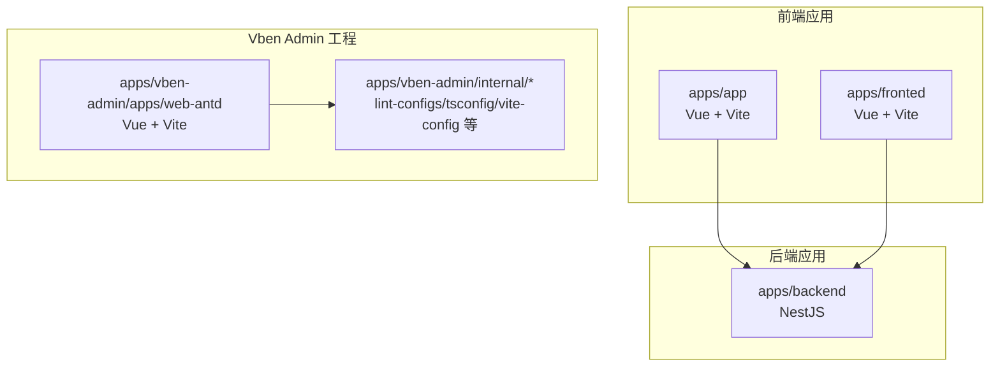
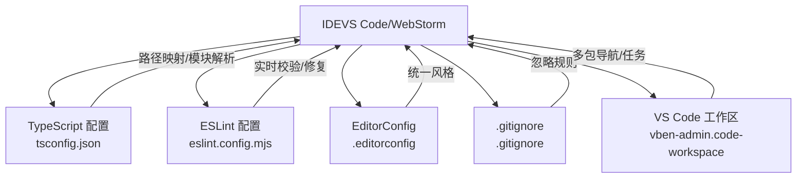
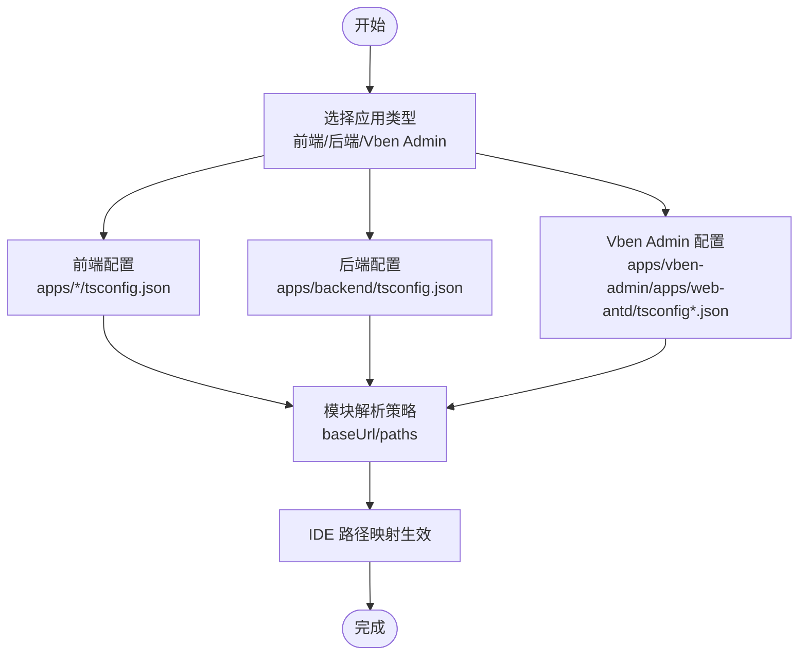
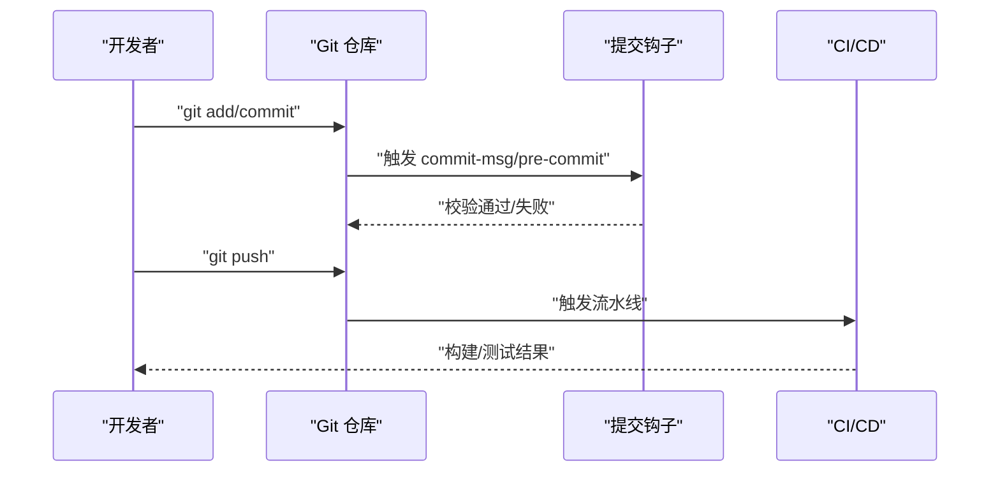
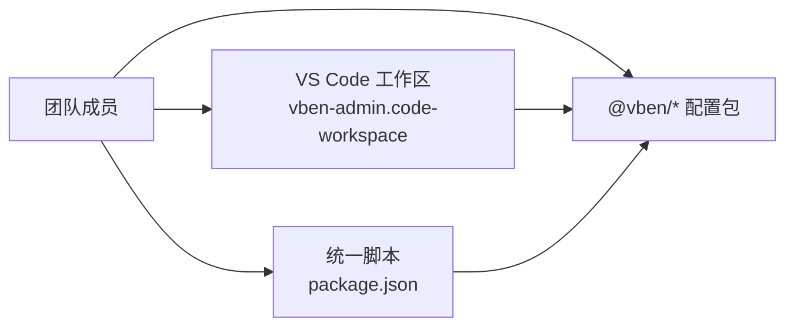
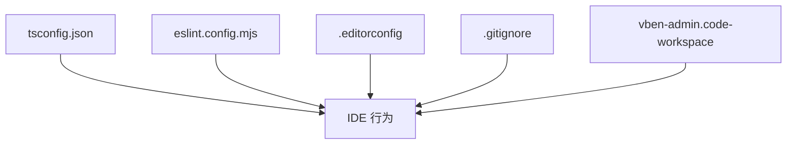

# IDE配置

<cite>
**本文引用的文件**
- [apps/app/tsconfig.json](file://apps/app/tsconfig.json)
- [apps/backend/tsconfig.json](file://apps/backend/tsconfig.json)
- [apps/fronted/tsconfig.json](file://apps/fronted/tsconfig.json)
- [apps/vben-admin/apps/web-antd/tsconfig.json](file://apps/vben-admin/apps/web-antd/tsconfig.json)
- [apps/vben-admin/apps/web-antd/tsconfig.node.json](file://apps/vben-admin/apps/web-antd/tsconfig.node.json)
- [apps/vben-admin/.editorconfig](file://apps/vben-admin/.editorconfig)
- [apps/vben-admin/eslint.config.mjs](file://apps/vben-admin/eslint.config.mjs)
- [apps/vben-admin/package.json](file://apps/vben-admin/package.json)
- [apps/vben-admin/vben-admin.code-workspace](file://apps/vben-admin/vben-admin.code-workspace)
- [apps/vben-admin/.gitignore](file://apps/vben-admin/.gitignore)
- [apps/vben-admin/.commitlintrc.js](file://apps/vben-admin/.commitlintrc.js)
</cite>

## 目录
1. [简介](#简介)
2. [项目结构](#项目结构)
3. [核心组件](#核心组件)
4. [架构总览](#架构总览)
5. [详细组件分析](#详细组件分析)
6. [依赖关系分析](#依赖关系分析)
7. [性能考虑](#性能考虑)
8. [故障排查指南](#故障排查指南)
9. [结论](#结论)
10. [附录](#附录)

## 简介
本文件面向IDE配置与开发环境标准化，围绕以下目标展开：  
- VS Code、WebStorm等主流IDE的配置建议（插件、工作区设置、快捷键）  
- TypeScript项目配置要点（编译选项、路径映射、模块解析策略）  
- EditorConfig统一代码风格  
- Git配置与工作流（提交模板、分支命名、合并策略）  
- 代码片段与Emmet配置  
- 团队协作中的IDE配置同步与开发环境标准化  

本仓库包含多端应用与Monorepo工程，本文将分别给出前端（Vue/Vite）、后端（NestJS）、以及Vben Admin工程的IDE配置建议与最佳实践。

## 项目结构
本仓库采用多包管理与多应用并存的组织方式，主要涉及：
- 前端应用：apps/app（基于Vue + Vite）、apps/fronted（基于Vue + Vite）
- 后端应用：apps/backend（NestJS）
- Vben Admin工程：apps/vben-admin（Monorepo，包含多个子应用与内部工具包）

**图表来源**
- [apps/app/tsconfig.json:1-14](file://apps/app/tsconfig.json#L1-L14)
- [apps/backend/tsconfig.json:1-20](file://apps/backend/tsconfig.json#L1-L20)
- [apps/fronted/tsconfig.json:1-8](file://apps/fronted/tsconfig.json#L1-L8)
- [apps/vben-admin/apps/web-antd/tsconfig.json:1-12](file://apps/vben-admin/apps/web-antd/tsconfig.json#L1-L12)
- [apps/vben-admin/apps/web-antd/tsconfig.node.json:1-11](file://apps/vben-admin/apps/web-antd/tsconfig.node.json#L1-L11)

**章节来源**
- [apps/app/tsconfig.json:1-14](file://apps/app/tsconfig.json#L1-L14)
- [apps/backend/tsconfig.json:1-20](file://apps/backend/tsconfig.json#L1-L20)
- [apps/fronted/tsconfig.json:1-8](file://apps/fronted/tsconfig.json#L1-L8)
- [apps/vben-admin/apps/web-antd/tsconfig.json:1-12](file://apps/vben-admin/apps/web-antd/tsconfig.json#L1-L12)
- [apps/vben-admin/apps/web-antd/tsconfig.node.json:1-11](file://apps/vben-admin/apps/web-antd/tsconfig.node.json#L1-L11)

## 核心组件
- TypeScript配置：前端与后端的tsconfig差异较大，需按应用类型选择合适的编译目标、模块系统与路径映射策略
- Lint与格式化：Vben Admin使用集中式lint配置与脚本，建议在IDE中启用实时校验
- EditorConfig：统一换行、缩进、字符集等基础风格
- Git：忽略规则、提交规范与工作流建议
- 工作区：VS Code多工作区配置，便于Monorepo协同开发

**章节来源**
- [apps/app/tsconfig.json:1-14](file://apps/app/tsconfig.json#L1-L14)
- [apps/backend/tsconfig.json:1-20](file://apps/backend/tsconfig.json#L1-L20)
- [apps/vben-admin/apps/web-antd/tsconfig.json:1-12](file://apps/vben-admin/apps/web-antd/tsconfig.json#L1-L12)
- [apps/vben-admin/apps/web-antd/tsconfig.node.json:1-11](file://apps/vben-admin/apps/web-antd/tsconfig.node.json#L1-L11)
- [apps/vben-admin/.editorconfig:1-19](file://apps/vben-admin/.editorconfig#L1-L19)
- [apps/vben-admin/eslint.config.mjs:1-4](file://apps/vben-admin/eslint.config.mjs#L1-L4)
- [apps/vben-admin/.gitignore:1-63](file://apps/vben-admin/.gitignore#L1-L63)
- [apps/vben-admin/.commitlintrc.js:1-2](file://apps/vben-admin/.commitlintrc.js#L1-L2)
- [apps/vben-admin/vben-admin.code-workspace:1-185](file://apps/vben-admin/vben-admin.code-workspace#L1-L185)

## 架构总览
下图展示IDE配置与工程配置的交互关系，帮助理解如何在不同IDE中落地统一的开发体验。

**图表来源**
- [apps/vben-admin/apps/web-antd/tsconfig.json:1-12](file://apps/vben-admin/apps/web-antd/tsconfig.json#L1-L12)
- [apps/vben-admin/eslint.config.mjs:1-4](file://apps/vben-admin/eslint.config.mjs#L1-L4)
- [apps/vben-admin/.editorconfig:1-19](file://apps/vben-admin/.editorconfig#L1-L19)
- [apps/vben-admin/.gitignore:1-63](file://apps/vben-admin/.gitignore#L1-L63)
- [apps/vben-admin/vben-admin.code-workspace:1-185](file://apps/vben-admin/vben-admin.code-workspace#L1-L185)

## 详细组件分析

### VS Code 配置建议
- 插件推荐
  - Vue相关：Vue Language Features (Volar)、Auto Rename Tag、Path Intellisense
  - TypeScript：TypeScript Importer、Bracket Pair Colorizer
  - Lint与格式化：ESLint、Prettier、oxlint/oxfmt（如启用）
  - Git：GitLens、Git History
  - 其他：Bracket Pair Colorizer、DotENV、EditorConfig
- 工作区设置
  - 使用多工作区文件统一打开Vben Admin工程，便于跨包开发与任务执行
  - 在工作区根目录或用户设置中启用“建议只读”以避免误改内部配置
- 快捷键
  - 自定义常用快捷键：如快速打开最近文件、切换终端、格式化文档
  - 将“保存时自动格式化”与“保存时自动修复ESLint问题”开启，提升一致性
- 调试
  - 为前端Vite应用与后端NestJS应用分别配置launch.json，支持断点调试与热重载

**章节来源**
- [apps/vben-admin/vben-admin.code-workspace:1-185](file://apps/vben-admin/vben-admin.code-workspace#L1-L185)
- [apps/vben-admin/package.json:27-52](file://apps/vben-admin/package.json#L27-L52)

### WebStorm 配置建议
- 插件推荐
  - Vue.js、TypeScript、ESLint、Prettier、EditorConfig
- 设置
  - 启用“On save action”自动格式化与导入优化
  - 配置代码风格与编码规范，与EditorConfig保持一致
- 调试
  - 为前端Vite与后端NestJS分别配置运行/调试配置，支持源码映射与断点

**章节来源**
- [apps/vben-admin/.editorconfig:1-19](file://apps/vben-admin/.editorconfig#L1-L19)
- [apps/vben-admin/eslint.config.mjs:1-4](file://apps/vben-admin/eslint.config.mjs#L1-L4)

### TypeScript 项目配置
- 前端（Vue/Vite）
  - apps/app：继承通用tsconfig，启用sourceMap、设置baseUrl与路径别名，包含Vue与TS文件
  - apps/fronted：使用复合配置引用app与node两个tsconfig
  - apps/vben-admin/apps/web-antd：继承web-app与node配置，设置路径别名并限定包含范围
- 后端（NestJS）
  - apps/backend：使用commonjs模块系统、严格空值检查、目标版本与增量编译等配置
- 模块解析与路径映射
  - 建议在IDE中启用“路径映射”与“模块解析策略”，确保导入提示与跳转正确
  - 对于Vite工程，IDE应识别其自定义的路径别名与引用关系

**图表来源**
- [apps/app/tsconfig.json:1-14](file://apps/app/tsconfig.json#L1-L14)
- [apps/fronted/tsconfig.json:1-8](file://apps/fronted/tsconfig.json#L1-L8)
- [apps/vben-admin/apps/web-antd/tsconfig.json:1-12](file://apps/vben-admin/apps/web-antd/tsconfig.json#L1-L12)
- [apps/vben-admin/apps/web-antd/tsconfig.node.json:1-11](file://apps/vben-admin/apps/web-antd/tsconfig.node.json#L1-L11)
- [apps/backend/tsconfig.json:1-20](file://apps/backend/tsconfig.json#L1-L20)

**章节来源**
- [apps/app/tsconfig.json:1-14](file://apps/app/tsconfig.json#L1-L14)
- [apps/backend/tsconfig.json:1-20](file://apps/backend/tsconfig.json#L1-L20)
- [apps/fronted/tsconfig.json:1-8](file://apps/fronted/tsconfig.json#L1-L8)
- [apps/vben-admin/apps/web-antd/tsconfig.json:1-12](file://apps/vben-admin/apps/web-antd/tsconfig.json#L1-L12)
- [apps/vben-admin/apps/web-antd/tsconfig.node.json:1-11](file://apps/vben-admin/apps/web-antd/tsconfig.node.json#L1-L11)

### EditorConfig 统一风格
- 编码与换行：UTF-8、LF
- 缩进：空格、大小2
- 行宽：100
- 引号：单引号
- 特殊文件：YAML/JSON/YML统一缩进；Markdown不裁剪尾随空白

**章节来源**
- [apps/vben-admin/.editorconfig:1-19](file://apps/vben-admin/.editorconfig#L1-L19)

### Git 配置与工作流
- 提交模板与规范
  - 使用commitlint配置，建议在本地安装husky或lefthook以强制执行
  - 提交信息遵循约定式提交，分支前缀与类型明确
- 分支命名规范
  - 示例：feature/xxx、fix/xxx、docs/xxx、chore/xxx
- 合并策略
  - 推荐使用squash merge以保持提交历史整洁
  - 代码审查通过后再合并
- 忽略规则
  - 使用.gitignore屏蔽node_modules、dist、日志、IDE临时文件等

**图表来源**
- [apps/vben-admin/.commitlintrc.js:1-2](file://apps/vben-admin/.commitlintrc.js#L1-L2)
- [apps/vben-admin/.gitignore:1-63](file://apps/vben-admin/.gitignore#L1-L63)

**章节来源**
- [apps/vben-admin/.commitlintrc.js:1-2](file://apps/vben-admin/.commitlintrc.js#L1-L2)
- [apps/vben-admin/.gitignore:1-63](file://apps/vben-admin/.gitignore#L1-L63)

### 代码片段与 Emmet 配置
- 代码片段
  - 在IDE中为常用组件、路由、服务等创建片段，提升重复性代码编写效率
  - 可结合模板文件与占位符，减少手写错误
- Emmet
  - 在Vue/HTML文件中启用Emmet，提升标记语言编写速度
  - 配合EditorConfig统一缩进与格式

**章节来源**
- [apps/vben-admin/.editorconfig:1-19](file://apps/vben-admin/.editorconfig#L1-L19)

### IDE配置同步与团队标准化
- 多工作区
  - 使用VS Code工作区文件统一打开工程，便于共享任务与设置
- 脚本与工具
  - 通过package.json脚本统一格式化、类型检查、依赖更新等流程
- 内部配置包
  - Vben Admin工程提供lint-config、tsconfig、vite-config等内部包，IDE中可直接引用以保持一致

**图表来源**
- [apps/vben-admin/vben-admin.code-workspace:1-185](file://apps/vben-admin/vben-admin.code-workspace#L1-L185)
- [apps/vben-admin/package.json:27-52](file://apps/vben-admin/package.json#L27-L52)

**章节来源**
- [apps/vben-admin/vben-admin.code-workspace:1-185](file://apps/vben-admin/vben-admin.code-workspace#L1-L185)
- [apps/vben-admin/package.json:27-52](file://apps/vben-admin/package.json#L27-L52)

## 依赖关系分析
- TypeScript配置对IDE行为的影响
  - baseUrl与paths决定IDE的路径解析与智能提示
  - 模块系统（commonjs vs ES Modules）影响导入/导出语义
- Lint配置对IDE行为的影响
  - ESLint配置决定实时校验规则与修复能力
- EditorConfig对IDE行为的影响
  - 统一行宽、缩进、换行等基础风格
- Git与工作流对IDE行为的影响
  - 提交钩子与CI流程影响本地提交与推送体验

**图表来源**
- [apps/vben-admin/apps/web-antd/tsconfig.json:1-12](file://apps/vben-admin/apps/web-antd/tsconfig.json#L1-L12)
- [apps/vben-admin/eslint.config.mjs:1-4](file://apps/vben-admin/eslint.config.mjs#L1-L4)
- [apps/vben-admin/.editorconfig:1-19](file://apps/vben-admin/.editorconfig#L1-L19)
- [apps/vben-admin/.gitignore:1-63](file://apps/vben-admin/.gitignore#L1-L63)
- [apps/vben-admin/vben-admin.code-workspace:1-185](file://apps/vben-admin/vben-admin.code-workspace#L1-L185)

**章节来源**
- [apps/vben-admin/apps/web-antd/tsconfig.json:1-12](file://apps/vben-admin/apps/web-antd/tsconfig.json#L1-L12)
- [apps/vben-admin/eslint.config.mjs:1-4](file://apps/vben-admin/eslint.config.mjs#L1-L4)
- [apps/vben-admin/.editorconfig:1-19](file://apps/vben-admin/.editorconfig#L1-L19)
- [apps/vben-admin/.gitignore:1-63](file://apps/vben-admin/.gitignore#L1-L63)
- [apps/vben-admin/vben-admin.code-workspace:1-185](file://apps/vben-admin/vben-admin.code-workspace#L1-L185)

## 性能考虑
- 启用增量编译与缓存，减少IDE索引与类型检查开销
- 合理配置包含/排除范围，避免扫描无关目录
- 在大型Monorepo中，优先加载必要包，避免一次性加载全部工作区

## 故障排查指南
- 路径解析异常
  - 检查baseUrl与paths是否与IDE设置一致
  - 确认tsconfig引用链完整（复合项目）
- 类型检查报错
  - 清理缓存后重新索引
  - 确认模块系统与目标版本匹配
- Lint冲突
  - 同步ESLint配置与IDE扩展
  - 在保存时自动修复与格式化
- Git钩子未触发
  - 检查本地钩子安装与权限
  - 确认提交信息符合规范

**章节来源**
- [apps/app/tsconfig.json:1-14](file://apps/app/tsconfig.json#L1-L14)
- [apps/backend/tsconfig.json:1-20](file://apps/backend/tsconfig.json#L1-L20)
- [apps/vben-admin/apps/web-antd/tsconfig.json:1-12](file://apps/vben-admin/apps/web-antd/tsconfig.json#L1-L12)
- [apps/vben-admin/eslint.config.mjs:1-4](file://apps/vben-admin/eslint.config.mjs#L1-L4)
- [apps/vben-admin/.commitlintrc.js:1-2](file://apps/vben-admin/.commitlintrc.js#L1-L2)

## 结论
通过统一的TypeScript配置、EditorConfig、ESLint与Git工作流，配合VS Code/WebStorm的合理插件与工作区设置，可以显著提升开发效率与团队协作质量。建议在团队内推广本文件的配置建议，并定期同步IDE与工具链版本，确保一致性与可维护性。

## 附录
- 快速对照表
  - TypeScript：baseUrl、paths、module、target、incremental
  - Lint：ESLint配置、格式化工具、提交前检查
  - EditorConfig：缩进、行宽、换行、引号
  - Git：提交规范、分支命名、合并策略、忽略规则
  - IDE：工作区、插件、快捷键、调试